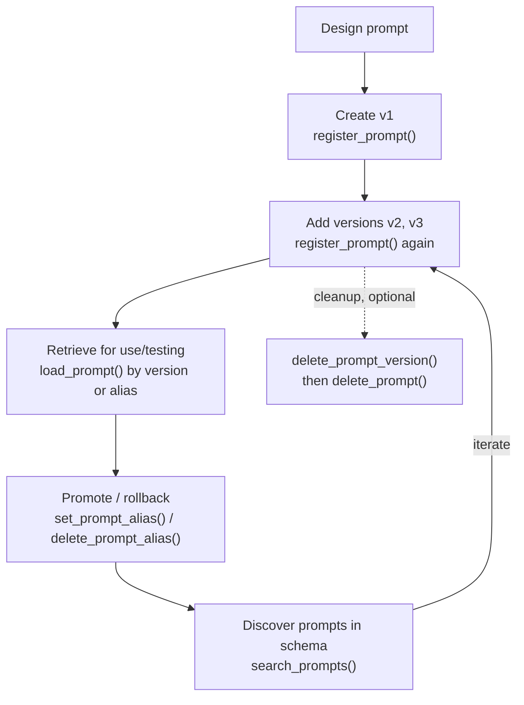
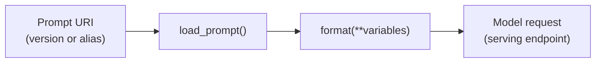

# MLflow Prompt Registry — versioning, aliases, lifecycle  ·  Module 02 · Topic 02.5 (★ cornerstone)  ·  [Theory + Hands-on]

> **You are here:** Roadmap Module 02 → 02.5. This is the module's cornerstone deep-dive. The module hub (`module.md`) has the short version.
> **Prerequisites:** 02.1–02.4 (prompt craft), Unity Catalog basics (Module 00), a serving endpoint you can call. Light MLflow context helps (Module 06) but this page gives you what you need.

## TL;DR
- The Prompt Registry gives prompts a **governed home** in Unity Catalog: named prompts, immutable versions, mutable aliases, version-specific tags.
- **Versions are immutable** snapshots (edit = new version). **Aliases** (`staging`, `production`) are mutable pointers you move to promote or roll back — no redeploy.
- The SDK is small: `register_prompt`, `load_prompt`, `set_prompt_alias`, `delete_prompt_alias`, `search_prompts`, `delete_prompt` — all under **`mlflow.genai`**.
- URIs: version = `prompts:/<name>/2`, alias = `prompts:/<catalog>.<schema>.<name>@<alias>`. Templates use `{{double_brace}}` variables.
- On Databricks it is **Beta**: needs `mlflow[databricks]>=3.1.0`, a UC schema, and `CREATE FUNCTION` + `EXECUTE` + `MANAGE` on that schema.

## The problem
- A Databricks customer's support assistant went live. A week later a customer says "your bot told me I'd get a full refund." Nobody can answer three basic questions: **which prompt is running right now, who changed it, and what was the last known-good version?**
- The "deployed prompt" is whatever someone last edited in a notebook. Updating a sentence means redeploying the app. Comparing "before and after" means comparing screenshots.
- A domain expert (the support policy owner) can't fix wording without opening a pull request against application code.

## Why the naive approach fails
- **Prompts as strings in the repo / notebook.** No history, no safe rollback, no side-by-side comparison, no way to separate "what changed" from "what's live."
- **Prompts as app config redeployed each edit.** Every wording tweak becomes a deployment event, so people stop iterating and quality stalls.
- **Prompts as untracked text.** Once a prompt affects customer outcomes, an untracked edit is an unlogged production change. That is how you get a silent incident.

The fix is to treat prompts the way you already treat code and models: **version control, safe releases, reproducibility, and ownership.**

## What it is
- **Plain-language definition:** The MLflow Prompt Registry is a centralized, governed store for prompt templates, with Git-like versioning and promotion mechanics, backed by Unity Catalog on Databricks.
- **Mental model:** Git for prompts. A prompt is a named entity. Each meaningful edit is an immutable commit (version). Aliases are branches/tags you move (`production` → v3). Tags are metadata on a commit.

## Why it matters (for a Databricks FDE)
- It is the concrete, differentiated answer to "how do we govern and roll back prompts?" — governance and audit ride on Unity Catalog, same as the rest of the customer's data and models.
- It unblocks collaboration: non-engineers can edit prompts in the UI without touching code.
- It makes prompt changes **reversible**: promotion and rollback are a pointer change, not a deploy. That is a production-readiness talking point.
- It is the backbone for evaluation (02.6) and optimization (02.7): both hang off registered, versioned prompts.

## Core concepts
- **Prompt** — a named entity in UC: `catalog.schema.prompt_name`. The stable unit of organization.
- **Version** — an **immutable** snapshot of the template plus its metadata. Created by `register_prompt`. Never edited in place.
- **Alias** — a **mutable** string label (e.g., `production`, `staging`) pointing to one version. Reassigning it is how you promote/roll back.
- **Tag** — version-specific key-value metadata (`use_case`, `owner`, `risk`, `hypothesis`) for discovery and audit.
- **Commit message** — a short human note describing the intent of a version. "Fix prompt" is not intent; "Reduce refund overpromises by requiring fare type" is.
- **URI** — how you reference a prompt: `prompts:/name/1` (version) or `prompts:/catalog.schema.name@alias` (alias).

## 🗺️ Visual map

**Registry functions mapped to lifecycle stages** (mirrors the book's Figure 3-2):



*Takeaway: the whole SDK maps onto one loop — create, version, retrieve, promote, discover, (rarely) delete.*

**Consumption pipeline in the app** (mirrors the book's Figure 3-6):



*Takeaway: an app loads by alias, renders variables, and calls the model. Re-pointing the alias changes behavior with no code change.*

## How it works — deep dive

### Immutable versions vs mutable aliases
- **Mechanism:** `register_prompt` with a **new** name creates the prompt at v1; calling it again with the **same** name adds v2, v3, ... Each version is frozen. `set_prompt_alias(name, alias, version)` points a label at a version and can be reassigned freely.
- **Why it matters:** immutability makes comparisons meaningful and rollback deterministic ("go back to version 3," not "hope no one overwrote the prompt"). Aliases turn versioned artifacts into an operational control lever.
- **Trade-off:** you cannot hot-edit a version. That is the point — the small friction of "new version per change" buys you a clean history.

### Naming and default location
- **Mechanism:** a prompt name is a **Unity Catalog identifier** (`catalog.schema.prompt_name`), so ownership and permissions are explicit. Optionally, set an MLflow experiment tag `mlflow.promptRegistryLocation = "catalog.schema"` so GenAI APIs treat that schema as the default namespace and you can use short prompt names.
- **Why it matters:** consistent governance and no "where did we store this" question.
- **Trade-off:** the default-location tag is a convention, not enforcement. The real win is team consistency.

### Tags, discovery, and deletion
- **Mechanism:** tags are version-specific metadata. `search_prompts(filter_string, max_results)` finds prompts; on a UC-backed registry the **only** supported filter is `catalog = '...' AND schema = '...'` (no name-pattern or direct tag filtering), so list-then-filter-in-Python is the pattern. Deletion is conservative: `delete_prompt_version` for each version first, then `delete_prompt`.
- **Why it matters:** good tagging is what makes a registry usable at scale; conservative deletion prevents "wipe everything" mistakes.
- **Trade-off:** weaker server-side search means a stable naming convention (e.g., prefix `unity_airways_`) matters more.

### Loading and rendering safely
- **Mechanism:** `load_prompt(uri)` returns a prompt object; `prompt.format(**variables)` renders `{{variables}}`. Load by **version** for deterministic dev/test; load by **alias** for production so promotion doesn't need a redeploy.
- **Why it matters:** this is where many production failures begin — variables get renamed, new ones appear. A thin `format()` wrapper that fails loudly turns a confusing runtime error into a fixable one.
- **Trade-off:** alias-based loads use a short cache TTL (e.g., 60s) by default; version loads default to no TTL. Set `cache_ttl_seconds=0` to always fetch the latest mapping.

## How to do it on Databricks

**Prereqs:** `mlflow[databricks]>=3.1.0`; a Unity Catalog schema where you hold `CREATE FUNCTION`, `EXECUTE`, and `MANAGE`; the feature enabled on the workspace **Previews** page (it is **Beta**).

**1. Point MLflow at a default prompt location (optional but recommended):**

```python
import mlflow
mlflow.set_tracking_uri("databricks")
mlflow.set_experiment("/Shared/unity-airways/unity-airways-prompts")
mlflow.set_experiment_tags({
    "mlflow.promptRegistryLocation": "main.default"  # <catalog>.<schema>
})
```

**2. Register the first version (SDK):**

```python
uc_prompt = "main.default.unity_airways_customer_support"
v1 = mlflow.genai.register_prompt(
    name=uc_prompt,
    template="""You are a customer support assistant for Unity Airways.

Rules:
- If key details are missing, ask exactly one clarifying question.
- Do not invent fees, waivers, or exceptions.

Customer question: {{question}}

Write a concise answer (max 120 words).""",
    commit_message="v1: baseline support answer with safety and brevity constraints",
    tags={"use_case": "customer_support", "language": "en", "owner": "unity-airways-support"},
)
print(f"Created prompt {v1.name} version {v1.version}")
```

`register_prompt` also accepts optional `response_format` (a Pydantic model or schema dict, when downstream code parses output) and `model_config` (generation settings stored alongside the template).

**3. Register a second version — one intentional change:**

```python
v2 = mlflow.genai.register_prompt(
    name=uc_prompt,
    template="""You are a customer support assistant for Unity Airways.

Rules:
- If the question is ambiguous, ask exactly one clarifying question.
- If the customer mentions refunds, do not promise eligibility without fare details.
- Do not invent fees, waivers, or exceptions.
- Keep the answer under 120 words.

Customer question:
{{question}}

Answer:""",
    commit_message="v2: tighten ambiguity handling and refund safety posture",
    tags={"change_type": "behavior", "risk": "medium",
          "hypothesis": "reduces overconfident refund promises"},
)
```

**4. Promote with aliases (mutable pointers):**

```python
mlflow.genai.set_prompt_alias(name=uc_prompt, alias="staging", version=2)
mlflow.genai.set_prompt_alias(name=uc_prompt, alias="production", version=1)
```

**5. Load and render in the app (load by alias in production):**

```python
prompt_prod = mlflow.genai.load_prompt(f"prompts:/{uc_prompt}@production")
content = prompt_prod.format(question="Can I change my flight tomorrow?")
print(prompt_prod.name, prompt_prod.version)
```

**6. Make the model call (OpenAI-compatible client from the Databricks SDK):**

```python
from databricks.sdk import WorkspaceClient

w = WorkspaceClient()
client = w.serving_endpoints.get_open_ai_client()
resp = client.chat.completions.create(
    model="databricks-claude-sonnet-4-5",     # verify on the supported-models page
    messages=[{"role": "user", "content": content}],
    temperature=0.1, max_tokens=350)
print(resp.choices[0].message.content)
```

**7. Deployment-friendly loading (config, not hard-coded):**

```python
import os
def load_runtime_prompt():
    alias = os.getenv("PROMPT_ALIAS", "production")
    name = os.getenv("PROMPT_URI", "main.default.unity_airways_customer_support")
    return mlflow.genai.load_prompt(f"prompts:/{name}@{alias}")
```

**8. Discover and clean up:**

```python
# List everything in the schema, then filter in Python (UC filter is catalog+schema only)
all_prompts = mlflow.genai.search_prompts(
    filter_string="catalog = 'main' AND schema = 'default'")
support = [p for p in all_prompts if "unity_airways" in p.name.lower()]

# Delete versions first, then the prompt (UC requirement)
from mlflow import MlflowClient
client_ml = MlflowClient()
# client_ml.delete_prompt_version(uc_prompt, "1")
# client_ml.delete_prompt(uc_prompt)
```

**Rollback is one line** — move `production` back to the previous version:

```python
mlflow.genai.set_prompt_alias(name=uc_prompt, alias="production", version=1)
```

**How to verify it worked**
- After step 2, the MLflow experiment's **Prompts** tab shows version 1 with your commit message and tags.
- After step 3, the **Compare** view highlights the diff between v1 and v2 (added rules, changed structure).
- After step 4, `staging` and `production` badges appear on versions 2 and 1.
- After step 6, log `prompt.name` + `prompt.version` alongside the response so any customer report traces back to an exact version.

## Worked example (Unity Airways)
Reuse the running use case end to end: register a safe baseline (v1), stage a tighter refund-handling version (v2), evaluate both on a fixed dataset (02.6), and promote the winner by moving `staging` then `production`. When a customer later disputes an answer, you look up the logged prompt version, reproduce it by pinning that version, and either patch forward with a new version or roll `production` back in one call. That is the whole value: **routine, measurable, reversible** prompt changes.

## Uses, edge cases and limitations
| Use it when | Be careful when | Better move |
|---|---|---|
| Prompts affect customer-facing behavior | Feature not enabled (Beta) | Check Previews page + UC privileges before promising it in a POC |
| Non-engineers must edit prompts | You need name/tag server-side search | List by schema, filter in Python; use a naming prefix |
| You need deterministic rollback | App hard-codes version numbers | Load by alias; note the previous production version |
| Chat vs single-turn prompts | Multi-message system/user prompts | Use a chat template (list of role/content) instead of a string template |

## Common mistakes / gotchas
| Mistake | Why it hurts | Better move |
|---|---|---|
| Encoding version numbers in the prompt **name** | Breaks comparisons and rollback | Keep the name stable; let versions + aliases carry versioning |
| Single-brace variables in a registry template | Won't render; registry uses `{{double}}` | Author with `{{var}}`; convert to `{var}` via `to_single_brace_format()` for LangChain/LlamaIndex |
| Hard-coding a version in production | Rollback becomes a deploy | Load by alias; move the pointer |
| Loading the prompt on every request | Adds latency and failure points | Load at startup; refresh on schedule/restart |
| `allow_missing=True` without a fallback | Missing prompt silently degrades behavior | Only with a conservative fallback + a clear log line |

> 📌 **IMPORTANT:** Versions are immutable, aliases are mutable. That single sentence is the whole philosophy: you never overwrite history, and you promote/roll back by moving a pointer.

> 💡 **TIP:** Standardize a lightweight versioning convention: a commit message in the form "behavior change | context | expected outcome," a `risk` tag (low/medium/high), and one intentional change per version. It makes months-later debugging a lookup instead of an investigation.

> ⚠️ **GOTCHA:** The book is an O'Reilly Early Release and the Databricks Prompt Registry is **Beta**. Re-verify the API surface, the `mlflow[databricks]` minimum version, and the UC privilege list against current docs before you build a customer POC on it. Books lag the product; docs win.

## 📝 Notes
- _Space for your own notes._

**Self-check (5 questions)**
1. Why are prompt **versions** immutable while **aliases** are mutable, and what operation does each enable?
2. Write the two URI forms for loading a prompt by version and by alias, using `main.default.unity_airways_customer_support`.
3. On a Unity Catalog-backed registry, what is the only supported `search_prompts` filter, and how do you filter further?
4. What is the correct deletion order for a prompt that still has versions, and which functions do you call?
5. What three Unity Catalog privileges and which minimum `mlflow[databricks]` version does the Databricks Prompt Registry require?

## How this maps to the certification
- **📘 B1 Ch3** is the primary source: prompt lifecycle management, Prompt Registry SDK, versioning, aliases, using prompts in code. The exam expects you to reason about **governed, reversible** prompt operations rather than ad-hoc strings.
- Reinforces **Domain 5 (Models with MLflow & Unity Catalog)** thinking: prompts, like models, are UC-governed assets with registration, aliases, and access control.

## Sources
- 📘 B1 — *Practical MLflow for Generative AI on Databricks* (Early Release), Ch 3: "Managing Prompts with the MLflow Prompt Registry" (why the registry, SDK overview, naming, creating/versioning, promoting via aliases, discovery, deletion), "Using Prompts in Code" (loading by alias/version, `format()`, error handling), and the "Integrating Prompts into Applications" section.
- 🌐 MLflow Docs — GenAI Prompt Registry: `mlflow.org/docs/latest/genai/prompt-registry/` — `register_prompt`, `load_prompt`, `search_prompts`, `set_prompt_alias`, `delete_prompt_alias`; URI forms `prompts:/name/2` and `prompts:/name@alias`; `{{variable}}` syntax; `to_single_brace_format()`.
- 🌐 Databricks Docs — MLflow 3 Prompt Registry (**Beta**): `docs.databricks.com/aws/en/mlflow3/genai/prompt-version-mgmt/prompt-registry/` — Beta status, `mlflow[databricks]>=3.1.0`, UC `CREATE FUNCTION` + `EXECUTE` + `MANAGE`, alias URI `prompts:/catalog.schema.name@alias`.
- 🌐 MLflow Docs — `mlflow.genai` API reference: `mlflow.org/docs/latest/api_reference/python_api/mlflow.genai.html`.
