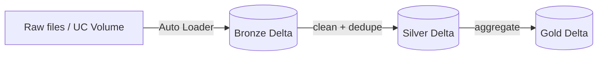

# Self-Contained HTML Lesson Page

When the user accepts the HTML offer, produce a single standalone `.html` file
(typically `index.html` inside the topic folder) that opens directly in a
browser with no external build step.

## Requirements

- **Deep, enterprise-grade, and code-rich (not a docs replacement, but not
  shallow either)**: the page must go deep on each sub-topic of the concept —
  mechanism + why + trade-off — matching the lesson's depth. Cut trivia and rare
  flags; keep the depth a senior engineer/interviewer expects. Bullets carry
  substance; short paragraphs connect them. Link the doc only for the long tail.
  (Same depth rule as the lesson — see SKILL.md "Depth & clarity".)
- **Sub-topic sections**: break the concept into its sub-topics, each as its own
  `<section>` (or card) with a heading, the mechanism, and a code snippet where
  it applies — mirror the markdown lesson's structure.
- **Code snippets are mandatory** (see SKILL.md "Required: code examples"): every
  sub-topic that has a code surface shows real, commented, enterprise-shaped code
  in a syntax-highlighted / monospaced `<pre><code>` block — SQL and/or PySpark.
  Don't describe an operation in prose when you can show the code.
- **Analogy + real-world use case per feature**: each feature/concept card
  should carry a one-line analogy and a concrete "when you'd use it" scenario.
- **Uses, edge cases & limitations**: every feature must include a short block on
  its uses (when to use / when not), key edge cases, and honest limitations (see
  SKILL.md "Required: uses, edge cases & limitations").
- **Fully self-contained**: all CSS and JS inline in the file. No external CSS/JS
  frameworks required to render. (A single CDN script is acceptable only for an
  interactive diagram library such as Mermaid; otherwise inline.)
- **Clean, readable, standalone**: proper `<h1>`/`<h2>` headings, sectioned
  content, comfortable typography, light background, max-width content column.
- **Matches the explanation**: same sections as the lesson (What it is, Why it
  matters, How it works, How to do it, comparison table, gotchas, references).
- **One or more interactive diagrams** illustrating the concept — **not capped at
  one**. Add a separate diagram for each major sub-concept, stage, lifecycle, or
  comparison the lesson covers, and place each one near the section it explains.
  A single-idea topic may need just one; a richer topic (e.g. Auto Loader) may
  warrant several — an ingestion-architecture flow, a schema-evolution
  step-through, and a checkpoint/state diagram. Acceptable forms (mix them so each
  diagram fits its content):
  - Clickable/expandable flow (e.g. click a stage to reveal detail).
  - Step-through (Prev/Next buttons advancing through an architecture).
  - Collapsible accordion of pipeline stages (bronze → silver → gold, etc.).
  - Expandable tree (e.g. Unity Catalog metastore → catalog → schema → table).
  - Tabbed compare (e.g. Auto Loader vs COPY INTO side-by-side).
  - Keep each diagram's JS independent so multiple diagrams coexist on one page
    without ID/handler collisions (scope selectors per diagram container).
- **Code samples**: syntax-highlight them, or at minimum present them in a clean
  dark monospace `<pre><code>` box with comfortable padding. A single CDN include
  for a highlighter (e.g. highlight.js) is acceptable; otherwise style a `.code`
  block inline and keep the code readable. Label each block's language and add a
  one-line caption saying what it does. Show SQL and PySpark variants where both
  are common. Use code to demonstrate the trade-offs (naive vs. right way).
- Include a **References** section linking the cited docs.

## Minimal skeleton

```html
<!doctype html>
<html lang="en">
<head>
  <meta charset="utf-8" />
  <meta name="viewport" content="width=device-width, initial-scale=1" />
  <title>TOPIC — Databricks DE Lesson</title>
  <style>
    :root { --bg:#f7f8fa; --fg:#1b1f24; --accent:#ff3621; --card:#fff; --border:#e3e6ea; }
    body { margin:0; background:var(--bg); color:var(--fg);
           font:16px/1.6 -apple-system,Segoe UI,Roboto,sans-serif; }
    main { max-width:880px; margin:0 auto; padding:32px 20px 80px; }
    h1 { color:var(--accent); }
    section { background:var(--card); border:1px solid var(--border);
              border-radius:12px; padding:20px 24px; margin:18px 0; }
    table { border-collapse:collapse; width:100%; }
    th,td { border:1px solid var(--border); padding:8px 10px; text-align:left; }
    pre { background:#0d1117; color:#e6edf3; padding:14px; border-radius:8px;
          overflow:auto; }
    /* interactive diagram */
    .stage { cursor:pointer; border:1px solid var(--border); border-radius:8px;
             padding:12px 14px; margin:8px 0; background:#fff; }
    .stage .detail { display:none; margin-top:8px; color:#444; }
    .stage.open .detail { display:block; }
    .stage .head { font-weight:600; }
  </style>
</head>
<body>
<main>
  <h1>TOPIC</h1>
  <p class="lede">One-line plain-language definition.</p>

  <section id="diagram">
    <h2>Architecture (click each stage)</h2>
    <div class="stage" onclick="this.classList.toggle('open')">
      <div class="head">① Bronze — raw ingest</div>
      <div class="detail">Auto Loader lands raw files into a Delta bronze table…</div>
    </div>
    <div class="stage" onclick="this.classList.toggle('open')">
      <div class="head">② Silver — cleaned/conformed</div>
      <div class="detail">Validate, dedupe, enforce schema…</div>
    </div>
    <div class="stage" onclick="this.classList.toggle('open')">
      <div class="head">③ Gold — business aggregates</div>
      <div class="detail">Curated tables for BI / ML…</div>
    </div>
  </section>

  <section><h2>What it is</h2><p>…</p></section>
  <section><h2>Why it matters</h2><p>…</p></section>
  <section><h2>How it works</h2><p>…</p></section>
  <section><h2>How to do it</h2><pre><code>… runnable snippet …</code></pre></section>
  <section><h2>Comparison</h2><table><!-- … --></table></section>
  <section><h2>Common mistakes / gotchas</h2><ul><li>…</li></ul></section>
  <section><h2>References</h2><ul><li><a href="https://docs.databricks.com/…">Doc page</a></li></ul></section>
</main>
</body>
</html>
```

The skeleton above shows a single diagram for brevity. **Add more `<section>`
diagram blocks as the concept warrants** — interleave each diagram with the text
section it supports rather than clustering them. When a page has multiple
diagrams, scope each one's CSS/JS to its own container (e.g. a unique wrapper
class or `id` prefix) so handlers and `querySelector` calls don't collide.

Adapt each interactive piece to what it shows (a step-through for a workflow, an
expandable tree for the Unity Catalog hierarchy, a tabbed compare for two
approaches, etc.). Keep them lightweight and genuinely interactive — not static
images.

## Markdown companion (when requested)

When the user also accepts the markdown offer, produce a `.md` file with the same
sections and a **mermaid** diagram. Keep it concise and bullet-driven, and
include the **uses, edge cases & limitations** block for each feature (see
SKILL.md). Example diagram:

````markdown

````
