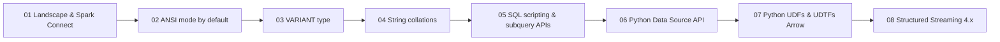

# Spark 4.x — What's New (companion track, 8 lessons)

> **This is the SECOND track this tutor skill authors.** The primary track is the
> 11-lesson **DBX PySpark Performance** track (`references/curriculum.md`, engine &
> tuning). This companion track teaches the **new language/API features of Spark 4.0/4.1**
> — the things a Databricks FDE peer-round interviewer now expects you to have heard of
> and be able to reason about. It is **feature-breadth**, not performance-depth: keep the
> two tracks separate so the performance story stays clean.

The track answers one interview question well: **"What changed in Spark 4, and when
would you actually use it?"** Each feature gets the same treatment as the perf track —
plain-language definition, mechanism, a worked code snippet, when-to-use-vs-not, and
(where relevant) how it behaves differently on Databricks vs OSS Spark.

Grounded in the **Apache Spark 4.0.0 release notes** (the verified major release; see
`references/fact-sheet-spark4x.md` for JIRA IDs + doc URLs) and the **Azure Databricks**
docs. The repo's venv is on **pyspark 4.1.2**; 4.1-specific items are flagged
"verify at build" in the fact sheet because the 4.1 release notes were not yet published
at authoring time.

## The story arc

> Spark 4 is **"safer, richer, and more decoupled"**: the client detaches from the
> engine (**Spark Connect**) → the SQL layer gets **stricter by default** (ANSI) and
> **richer types** (VARIANT, collations) → **procedural SQL** (session variables,
> EXECUTE IMMEDIATE) and **subquery DataFrame APIs** close SQL/DataFrame gaps → Python
> becomes a **first-class extension surface** (Python Data Source API, Arrow UDFs,
> UDTFs) → **Structured Streaming** gets **arbitrary stateful processing v2**
> (`transformWithState`) and a state-inspection data source.

## Lessons, hooks & the facts to nail

| # | Folder | Topic | One-line hook | Key doc-grounded facts to nail (verify against fact sheet) |
| --- | --- | --- | --- | --- |
| 01 | `01-landscape-connect` | The Spark 4.x landscape & **Spark Connect** | Your code and the engine are no longer the same process | JDK 17 baseline (drops JDK 8/11; Java 21 supported); Scala 2.13 default; Python ≥3.9. Spark Connect = decoupled client↔server over gRPC; **opt-in in OSS** via `spark.api.mode`=`connect` / `SPARK_REMOTE`; lightweight `pyspark-client` (~1.5 MB). **Databricks: Spark Connect is the default on serverless & shared/standard-access clusters** — this is the OSS-vs-DBX distinction. Cross-links to perf-track Lesson 01 (driver/executor). |
| 02 | `02-ansi-mode` | **ANSI SQL mode on by default** | Silent wrong answers become loud errors | `spark.sql.ansi.enabled` = **true by default in Spark 4.0** (SPARK-44444). Overflow, divide-by-zero, and invalid casts now **raise** instead of returning NULL; stricter type coercion; error classes. The **`try_*` family** as the safe escape hatch: `try_cast`, `try_mod`, `try_add`/`try_subtract`/`try_multiply`, `try_divide`, `try_parse_json`, `try_element_at`. Migration/debugging impact. DBX note: recent DBR already defaulted ANSI on. |
| 03 | `03-variant` | The **VARIANT** type | Store messy JSON without paying the string-parse tax every read | `VariantType` (SPARK-45827). Ingest with `parse_json` / `try_parse_json`; read paths with `variant_get(v, '$.a.b', 'int')` / `try_variant_get`; introspect with `schema_of_variant` / `schema_of_variant_agg`; `is_variant_null`; `to_variant_object`. VARIANT vs string-JSON vs a fixed struct (when each wins). Databricks-origin feature; note storage/shredding perf angle. |
| 04 | `04-collations` | **String collations** | Case-/accent-insensitive comparison without `lower()` everywhere | Collation support (SPARK-46830). `COLLATE 'UTF8_LCASE'` / `'UNICODE_CI'` etc.; `collate(col, name)` and `collation(col)` functions; collation-aware `=`, `ORDER BY`, `GROUP BY`, joins. UTF-8 validation helpers: `is_valid_utf8`, `make_valid_utf8`, `validate_utf8`, `try_validate_utf8`. Correctness win + the perf/indexing trade-off. |
| 05 | `05-sql-scripting` | **SQL scripting, session variables & subquery DataFrame APIs** | Procedural logic in pure SQL, and DataFrame parity for subqueries | Session variables `DECLARE VARIABLE` / `SET VAR` (SPARK-42849); `EXECUTE IMMEDIATE` for dynamic SQL (SPARK-46246). **Full control-flow scripting (BEGIN/END, IF, WHILE) — verify exact 4.0-vs-later gating at build; more complete on Databricks.** DataFrame subquery APIs new in 4.0: `DataFrame.scalar`, `DataFrame.exists`, `DataFrame.lateralJoin`; plus `Column.outer`. |
| 06 | `06-python-data-source` | **Python Data Source API** | Write a custom connector in pure Python — no Scala/JVM | SPIP SPARK-44076. `DataSource` / `DataSourceReader` / `DataSourceWriter` (+ streaming reader/writer); register via `spark.dataSource.register(...)`; then `spark.read.format("mysrc")`. Arrow-based writer (SPARK-50471); Python metrics (SPARK-46424); DSv2 SQL execution (SPARK-45597). **Ties to the existing `spark-python-data-source` skill** — use it as ground truth. |
| 07 | `07-python-udfs-udtfs` | **Modern Python UDFs & UDTFs (Arrow)** | Faster Python UDFs and functions that return whole tables | Arrow-optimized Python UDFs (`useArrow=True` / `spark.sql.execution.pythonUDF.arrow.enabled`); named-argument support (SPARK-44918/44952); unified UDF profiling via `spark.profile.*` / `SparkSession.profile`. **Python UDTFs** `@udtf` returning a table, with Python-side `analyze` (SPARK-43797); table arguments via `DataFrame.asTable` + `TableArg.partitionBy/orderBy/withSinglePartition`; `spark.tvf` for TVFs. `GroupedData.applyInArrow` / `PandasCogroupedOps.applyInArrow`. |
| 08 | `08-streaming-4x` | **Structured Streaming in 4.x** | Arbitrary keyed state, done right, and inspectable | Arbitrary State API v2 — `transformWithState` / `transformWithStateInPandas` (SPARK-46815) with `ValueState`/`ListState`/`MapState`, timers (SPARK-49513), schema evolution (SPARK-50573), batch + streaming. **State Data Source** reader to inspect/debug state (SPARK-45511). `DataStreamWriter.clusterBy`. 4.1 "real-time mode" is a candidate add — **verify at build**. Cross-links to the `databricks-spark-structured-streaming` skill. |

### Quality-of-life features (fold into the lesson above where they fit — do NOT add a 9th lesson)

- **Built-in XML data source** (SPARK-44265): `spark.read.xml(...)`, `from_xml`, `to_xml`, `schema_of_xml` → mention in **06** (data sources).
- **Native PySpark plotting** `df.plot.line()/.hist()/.kde()` (SPARK-49530, Plotly backend) → mention in **07** (PySpark surface).
- **New DataFrame ops**: `DataFrame.transpose`, `toArrow`, `mergeInto`, `groupingSets`, `metadataColumn`, `DataFrameWriter.clusterBy` → mention in **05** or **07**.
- **New SQL functions**: `uniform`, `randstr`, `listagg`/`string_agg`, `timestamp_diff`/`timestamp_add`, `dayname`/`monthname`, `session_user`, `try_reflect` → sprinkle as examples in **02**.
- **Breaking changes to flag** (interviewers probe these): JDK 8/11 removed, Scala 2.12 removed, Python 3.8 removed, Mesos removed, SparkR deprecated → **01**.

## Per-lesson artifact set (same house style as the perf track)

The companion track lives in the project's **`Spark_4x/`** folder (a sibling to `Spark/`,
mirroring the multi-track layout). Reuse the **dark** house style + "Cluster Execution
Lab" CSS toolkit from `references/style-template.html` and the exemplar
`references/lesson.{md,html}` (Lesson 02 Joins) for depth, section order, and the
code-paired-with-verification pattern. Each `Spark_4x/lessons/<NN-topic>/` folder holds:

- `lesson.md` — written lesson (created first): mermaid diagram, deep dive per sub-topic,
  commented PySpark/SQL snippets, a **before-4.0 → in-4.0 contrast** where it teaches
  (e.g. string-JSON parsing vs VARIANT; silent NULL vs ANSI error; classic session vs
  Spark Connect), a comparison table, the uses/edge-cases/limitations block, gotchas,
  and a **References** section citing the JIRA + doc URL from the fact sheet.
- `index.html` — self-contained interactive page in the dark house style (≥1 interactive
  diagram; e.g. a Connect classic-vs-decoupled toggle, an ANSI "NULL vs error" evaluator,
  a VARIANT path-extractor, a collation comparison table, a UDTF row-fan-out animation).
- `<NN-topic>-demo.py` — runnable Databricks notebook: build data → **use the new
  feature** → show the result / plan, on a DBR that ships Spark 4.x (state the runtime
  prerequisite at the top; several features are DBR-version-gated).

Plus a track landing page at `Spark_4x/index.html` and a `Spark_4x/learning plan/`.
When a lesson goes live, flip its landing-page card from `soon` to `Open lesson →`, and
add the new track as a card on the site root `index.html`.

## Verification is non-negotiable (accuracy rules still apply)

This track is **newer** than the perf track, so version gating is the #1 accuracy risk:

- **Every "since 4.0 / 4.1" claim** must trace to `references/fact-sheet-spark4x.md`
  (which carries the JIRA ID + doc URL). Re-verify borderline items against the live
  **Apache Spark 4.0.0 release notes** and **Azure Databricks** docs before asserting.
- **Always state OSS-vs-Databricks scope.** The two biggest traps: Spark Connect is
  **opt-in in OSS** but **default on Databricks serverless/shared clusters**; ANSI mode
  is default-on in OSS 4.0 but was already default on recent DBR.
- **SQL scripting control-flow** and **Spark 4.1 items** are the least-settled — mark
  them "verify at build," don't assert an exact version you couldn't confirm.
- Use the `spark-api-beta` MCP (`spark_get_version_changes` for 4.0) and the
  `spark-python-data-source` / `databricks-spark-structured-streaming` skills as ground
  truth for the API-heavy lessons (06, 07, 08).

## What the learner leaves with

> A crisp, honest answer to **"what's new in Spark 4 and why do I care?"** — able to
> (1) explain the decoupled Spark Connect architecture and where it's the default,
> (2) reason about ANSI-mode behavior changes and the `try_*` escape hatch,
> (3) pick VARIANT vs struct vs string-JSON, (4) use collations instead of `lower()`
> gymnastics, (5) write a Python data source / UDTF, and (6) describe `transformWithState`
> — each with the OSS-vs-Databricks caveat an interviewer will push on.
