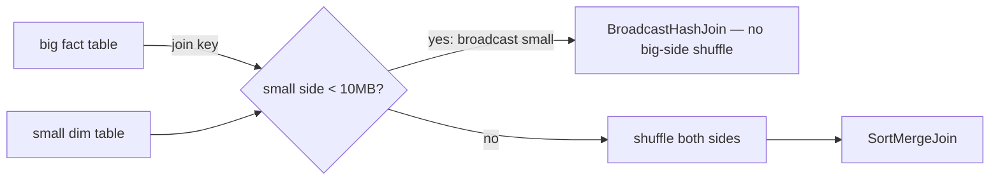

# Self-Contained Interactive HTML Lesson Page (PySpark Performance house style)

When the user accepts the HTML offer, produce a single standalone `.html` file
(`index.html` inside the topic folder) that opens directly in a browser with no build
step. Keep all CSS inline. The house style is a **light "paper" editorial / technical-
manual** look (redesigned 2026-07-01, replacing the earlier dark aurora theme).

> **Start from the worked exemplar.** `Spark/lessons/03-driver-memory/index.html` is the
> **new canonical light-paper reference** — a complete, real lesson built to this spec
> with the redesigned system and **two DISTINCT** interactive diagrams. Read it first and
> mirror its structure, CSS variables, code blocks, and interaction patterns.
> `references/lesson.html` and `references/style-template.html` are now **exact copies of
> 03** (regenerated 2026-07-01) — copy their `<head>` + `<style>` verbatim for a new page.

## The house style (LIGHT "paper" editorial — the anti-"AI-slop" look)

The design goal: read like a **technical manual / research zine**, not a SaaS landing
page. That means restraint — no gradient hero words, no glassmorphism, no aurora, no
italic "drip" heading (those are the AI-generated tells we are removing). Single accent,
warm paper background, confident typography.

- **Fonts** (one CDN `<link>`): **JetBrains Mono** (weight **800** for the big hero
  `h1.display` in ALL CAPS; 400/500/700 for all UI chrome — nav, eyebrows, section
  labels, code, tags, diagram controls), **Source Serif 4** (body prose + `h2`/`h3` — the
  editorial reading face). Heavy-mono-hero + mono-chrome + serif-reading is the whole
  system. (An earlier pixel/bitmap "Silkscreen" hero was tried and rejected as gimmicky —
  use the clean heavy monospace.)
- **Palette** via CSS vars (LIGHT): `--bg:#f4f1e8` warm paper, `--card:#fbfaf5`,
  `--panel:#efe9d9` (code/diagram surfaces), `--ink:#17140d` near-black, `--muted`/
  `--faint` warm grays, `--line` hairline rules, and **one accent `--accent:#2b2bf0`**
  (electric/lightning blue). Add `--danger:#b91c1c` (red — OOM/abort, distinct from the
  blue accent) + `--ok:#2f7d55` (healthy), used sparingly in diagrams only. **One accent —
  do not reintroduce a multi-color ember/violet/cyan set.** (An ember accent was tried and
  reverted to electric blue — the blue reads sharper on the warm paper.)
- **Top bar**: a slim sticky `.topbar` — mono uppercase, a `■`-marked brand link back to
  the track index on the left, a `FIG_NN · Lesson NN / 11` locator on the right.
- **Hero**: a `.figstamp` line (mono, `Fig_NN · Topic · v1.0` left / scope right, hairline
  under it), the big **`h1.display` in JetBrains Mono 800** electric blue, left-aligned, ALL CAPS,
  **no gradient/italic**; a smaller mono uppercase `.subline` tagline; a serif `.lede`; a
  row of bracketed mono `.spec` tags (Spark/DBR version, key defaults, "verified Jun
  2026"). A subtle radial **dot-grid** texture behind the hero (`header::before`).
  **Do NOT put an "&" ampersand in the display title** — the glyph reads as clutter in the
  heavy mono; spell it "and", use "·", or restructure (e.g. hero `DRIVER MEMORY` +
  subline `DRIVER OOM · PROTECTING THE ONE FIXED HEAP`).
- **Sections**: `<section>` separated by hairline top borders; each opens with a mono
  **`.seclabel`** eyebrow (`03 · How it works`), then a serif `h2`; `h3` serif for
  sub-topics. `.callout` (accent-soft) for the one rule; `.callout.warn` (danger-soft) for
  the single "X ≠ Y" distinction. `.tbl` tables with a mono accent-soft header row.
  Light `<pre>` code panels (`--panel` bg) with `.c`/`.k`/`.s`/`.f` syntax spans + `.tag`.
  Optionally a serif drop cap (`.dropcap`) on the first deep-dive paragraph.
- **Readability helpers**: mirror the current `03-driver-memory/index.html` pattern.
  Add `.quickgrid` / `.quickcard` style blocks for early "at a glance" understanding
  when a topic has several moving parts. Use them for component jobs, healthy-vs-danger
  patterns, or a one-screen memory hook. Use `.tbl` for scan-friendly mechanism maps
  and gotchas instead of long dense bullet lists.
- **Footer**: mono, hairline top border, `.doclinks` (Apache Spark + Azure Databricks
  URLs) + a back-to-track link + a small "verified Jun 2026 / OSS-vs-DBX noted" meta line.
- **Content width** ~748px (`--wrap`) — a readable editorial measure, single column.

## Requirements

- **Deep, enterprise-grade, code-rich** — same depth as the markdown lesson: mechanism +
  why + trade-off per sub-topic. Cut trivia; link the doc for the long tail.
- **Sub-topic sections** mirroring the markdown lesson, each a `<section>` with a heading,
  the mechanism, and a code snippet where it applies.
- **Code snippets are mandatory** for every code-bearing sub-topic — real, commented,
  enterprise-shaped, in dark `<pre><code>` blocks. PySpark first; SQL/config where common.
  **Pair each with a verification line** — the `.explain()` node or Spark-UI signal that
  proves it worked (e.g. "look for `BroadcastHashJoin` and no big-side `Exchange`").
- **Analogy + real-world use case per feature** — use the `.chip.analogy` and
  `.chip.usecase` labels (or inline) so each carries both.
- **Uses, edge cases & limitations** block for every feature (see SKILL.md).
- **Fully self-contained**: all CSS/JS inline. Only the Google Fonts `<link>` (and
  optionally a single highlighter CDN) may be external.
- **References** section linking the exact cited docs.

## Readability and comprehension rules

Use the enhanced Lesson 03 driver-memory page as the reference for how to make a dense
Spark topic easier to comprehend:

- **Open with orientation cards** when helpful. Examples: "what this component does",
  "healthy pattern", "danger pattern", "what to watch in the UI".
- **Prefer comparison tables for mechanisms.** If a section contains more than three
  related bullets, consider a table with columns like "what it is", "plain meaning",
  "why it grows", "symptom", "better move", or "verification signal".
- **Insert one reading-rule callout before code-heavy sections.** It should tell the
  learner how to interpret the code, not restate the whole mechanism.
- **Gotchas should be actionable.** For 4+ gotchas, use a
  `Mistake | Why it hurts | Better move` table.
- **Do not use readability helpers as filler.** A quick card or table must make the page
  easier to scan or reduce cognitive load; otherwise keep prose.

## Interactive diagrams — a few DISTINCT ones, quality over quantity

> **Quality over quantity.** Two or three sharp diagrams that each teach a **different**
> facet beat five that re-demonstrate the same mechanic. Before adding a diagram, name
> the **one concept it teaches that no other diagram/section already does** — if you
> can't, don't build it. Never build a tabbed/accordion "diagram" whose panels are just a
> list of sentences already in the deep dive (that's prose, not a diagram — see "Say it
> once" in `SKILL.md`).

**Required for every lesson: a "Cluster Execution Lab."** In addition to the topic
diagrams below, every lesson MUST include one **step-by-step animated** diagram built
with the shared `.cluster`/`.nodes`/`.node`/`.parts`/`.stepper`/`.narr` toolkit in
`style-template.html` that shows **how this feature actually runs across the driver +
executor nodes**, using **dummy data + dummy PySpark code** that highlight per step, and
a **Prev / Play / Next** stepper with a narration line. For Lesson 01 (and wherever
relevant) this must animate **how a shuffle moves records across executor nodes**, stage
by stage (map → shuffle write → exchange across the network → shuffle read → result).

Add a separate interactive diagram for each major sub-concept, placed near the section it
explains. Scope each diagram's JS in an IIFE keyed to a unique container id so
handlers/`querySelector` calls don't collide. Pick the interaction that fits:

| Lesson | Strong interactive diagram idea(s) |
| --- | --- |
| 01 Architecture & execution model | Click-through: a PySpark snippet → highlight which lines are transformations (lazy) vs the action that fires the job; a job→stages→tasks tree that expands; a narrow-vs-wide toggle showing a shuffle appear between stages. |
| 02 Joins | **Join-strategy chooser**: a size slider on the small side → as it crosses 10 MB the chosen strategy flips Broadcast Hash Join ⇄ Sort-Merge Join, with the plan (Exchange vs BroadcastExchange) redrawn and a "shuffled? yes/no" readout. |
| 03 Driver memory | A `collect(n rows)` slider → driver heap fills toward `maxResultSize`; cross the limit → "Job aborted: maxResultSize exceeded / driver OOM". Toggle `collect` vs `write`/`take`. |
| 04 Executor memory | **Stacked `.membar`**: drag execution vs storage demand → watch borrow/evict (execution evicts storage down to R; storage can't evict execution); push past M → a hatched **spill** segment appears, then OOM. Toggle off-heap / PySpark-worker memory outside the bar. |
| 05 AQE | Step-through: default 200 tiny shuffle partitions → "AQE coalesce" merges to advisory 64 MB chunks; a skewed partition (>5× median & >256 MB) splits into sub-partitions; a sort-merge join flips to broadcast at runtime. |
| 06 Cache & persist | **Storage-level explorer**: pick a level (MEMORY_ONLY / MEMORY_AND_DISK / DISK_ONLY / OFF_HEAP, ±_SER ±_2) → show where blocks land (RAM/disk/off-heap), serialized?, replicated?, and the RDD-vs-DataFrame default callout. |
| 07 Partition pruning & DPP | **Partition `.grid`** of directories: type a filter on the partition column → matching directories light up (`hit`), the rest grey out (`skip`); a DPP toggle shows a filtered dimension pushing its filter onto the fact partitions at runtime. |
| 08 Salting & hints | **Skew visualizer**: a bar chart where one key towers over the rest → drag a "salt N" slider to split the hot key across N partitions and rebalance the bars; show the join exploding the other side ×N. |
| 09 Broadcast vars & accumulators | Two side-by-side panels: a broadcast variable shipped once per executor (vs once per task) with a counter; an accumulator where workers `.add()` and only the driver reads `.value`, with the actions-vs-transformations exactly-once note. |
| 10 Garbage collection | **GC pause timeline**: task threads as bars; trigger a minor GC (short pause) vs a full GC (long stop-the-world pause) and watch tasks stall; a slider lowering `spark.memory.fraction` shrinks Old-gen pressure and shortens pauses. |
| 11 Bucketing | **Shuffle-eliminator**: two tables; toggle "bucket both by key, same N" → the `Exchange` (shuffle) node disappears from the join plan; mismatch the bucket counts → the shuffle returns (and a `coalesceBucketsInJoin` toggle). |

Reusable building blocks already styled in the template: the `.grid`/`.file` grid
simulator, the `.membar` stacked memory bar, the `.seg` tabbed/segmented toggle, the
`.step` clickable accordion, the `.stat`/`.readout` metric tiles, and the `.verdict`
explainer box. Keep diagrams lightweight and genuinely interactive — not static images.

### Each diagram must be DISTINCT (no overlap)

The failure mode to avoid: three widgets that all show the same thing (e.g. for driver
memory — a collect-slider, a collect-vs-write accordion, AND a cluster animation that all
re-demonstrate "collect fills the heap and OOMs"). Instead, give each diagram a job the
others don't:

- **Each diagram teaches ONE concept no other diagram covers.** Write its unique job in
  one line before building it (e.g. "the *threshold* — where the heap tips over" vs "*where*
  the data physically lands across nodes" vs "the *decision* between actions").
- **If two diagrams would demonstrate the same mechanic, build one** — the clearest — and
  cut the other.
- A **list of items** (the four OOM paths, the storage levels) belongs in **one** prose
  list or table, not in a tabbed diagram that reveals the same sentences. Reserve
  interactivity for state that visibly *changes* (a bar fills, a plan node appears/vanishes,
  a partition lights up), not for hiding/showing static text.

### Demonstrate, don't narrate

The diagram's prose (intro line + captions + verdict) **points at what to notice** — it
does not re-explain the mechanism already taught in the deep dive.

- Intro: one sentence — what to drag/click and what to watch.
- Readout/verdict: state the *result of the current state* ("aborted at 1.2 GB"), not a
  paragraph re-teaching the concept.
- The mechanism lives in the deep-dive section; the diagram makes it *tangible*.

### Professional visual bar (every diagram)

- **Clear title + one-line purpose**; labeled nodes/axes/segments; a legend when colours
  carry meaning (ember = action/danger, violet = secondary, cyan = driver — used
  consistently).
- **Visible live state** — a readout/stat tile or plan box that updates, and a sensible
  default state on load (not blank).
- **Smooth, purposeful transitions** (CSS transitions on the state that changes); no
  janky layout shifts; nothing overlaps or clips at mobile widths (responsive — the
  template's grids already collapse).
- **Accessible**: `aria-pressed` on toggles, keyboard-operable controls, sufficient
  contrast, and honor `prefers-reduced-motion` (the template's `@media` block disables
  animation — keep diagram JS calm under it).
- **Exactly one** one-line "simplified illustration" disclaimer per simulator — not
  repeated on every sub-caption.

## Minimal skeleton

Use `references/style-template.html` verbatim for the `<head>` + header/footer shell,
then fill `<main>` with the sub-topic sections and interleave the interactive diagrams.
Example diagram shell (scoped JS):

```html
<section>
  <h2>See it work</h2>
  <div class="lab" id="lab-joins">
    <div class="lab-head"><span class="lab-title">Join-strategy chooser</span></div>
    <p class="lab-sub">Drag the small table's size past 10 MB and watch the plan flip.</p>
    <div class="controls"><label>Small side <input type="range" id="jn-size" min="1" max="40" value="8"></label></div>
    <div class="readout">
      <div class="stat"><div class="big" id="jn-strategy">—</div><div class="lbl">join strategy</div></div>
      <div class="stat win"><div class="big" id="jn-shuffle">—</div><div class="lbl">big-side shuffle?</div></div>
    </div>
    <div class="verdict" id="jn-verdict"></div>
  </div>
</section>
<script>
(function(){ const root=document.getElementById('lab-joins'); /* ...scoped... */ })();
</script>
```

## Markdown companion (always, created first)

The `.md` lesson uses the same sections and a **mermaid** diagram. Keep it concise and
bullet-driven, include the uses/edge-cases/limitations block, and put a commented code
snippet (+ its verification line) under every code-bearing sub-topic. Example diagram:

````markdown

````
