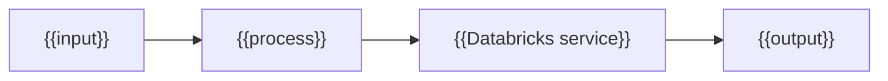

# {{TOPIC_TITLE}}  ·  Module {{NN}} · Topic {{X.Y}}  ·  [{{Theory|Hands-on}}]

> **You are here:** Roadmap Module {{NN}} → {{X.Y}}.
> **Prerequisites:** {{prereqs or "none"}}

## TL;DR
- {{bullet}}
- {{bullet}}
- {{bullet}}

## Why it matters (for a Databricks FDE)
- {{bullet}}

## Core concepts
- **{{term}}** — {{plain-language definition}}
- **{{term}}** — {{plain-language definition}}

## 🗺️ Visual map


## How it works on Databricks
1. {{concrete step — name exact UI path / SDK / API}}
2. {{...}}

```python
# [Hands-on] minimal runnable snippet
```

## Worked example (Unity Airways)
- {{tie concept to the book's running use case}}

> 📌 **IMPORTANT:** {{must-remember point}}

> 💡 **TIP:** {{practitioner / field tip}}

> ⚠️ **GOTCHA:** {{pitfall or book-vs-docs version difference}}

## 📝 Notes
- {{space for learner}}

**Self-check (5 questions)**
1. {{q}}
2. {{q}}
3. {{q}}
4. {{q}}
5. {{q}}

## How this maps to the certification
- Exam domain: {{domain}} — {{why it's tested}}

## Sources
- 📘 B1 — *Practical MLflow for GenAI on Databricks*, Ch {{n}}: {{section}}
- 📗 B2 — *Cert Study Guide*, Ch {{n}}: {{section}}
- 🌐 Docs — {{url}}
- ✍️ Blog — {{url}}
