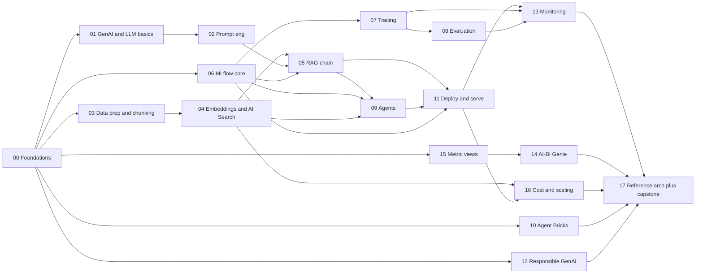

# Databricks Generative AI — End-to-End Learning Roadmap

**Audience:** Databricks Field Engineer (FDE)
**Goal:** Go from fundamentals → expert / architect-level on **GenAI with Databricks**, mixing **theory + hands-on**.
**How to use:** Teaching follows this order (Level 0 → Level 7). Each topic, when requested, produces a simple `.md` explainer + an interactive `.html` diagram, and then offers a Databricks notebook. See `CLAUDE.md` for the rules.

---

## Source legend

| Tag | Source |
|---|---|
| 📘 **B1** | *Practical MLflow for Generative AI on Databricks* (book) |
| 📗 **B2** | *Databricks Certified Generative AI Engineer Associate Study Guide* (book) |
| 🌐 **Agents** | docs.databricks.com → AI Agents (`/agents/`) |
| 🌐 **Genie** | docs.databricks.com → AI/BI Genie (`/genie/`) |
| 🌐 **GenieOne** | docs.databricks.com → Genie One (`/genie-one/`) |
| 🌐 **Semantics** | docs.databricks.com → Business Semantics / Metric Views (`/business-semantics/`) |
| 🌐 **Docs** | Other latest Databricks docs |
| ✍️ **Blog** | Official Databricks blog / engineering blog |

**Content type:** `[T]` = Theory · `[H]` = Hands-on · `[T+H]` = Both

**Progress markers:** ⬜ not started · 🔄 in progress · ✅ done

---

## Level 0 — Orientation & Environment

### Module 00 — Databricks platform foundations for GenAI  ✅
<!-- progress: 00.1–00.6 ✅ (built in phase P0) -->

*Why: you can't build GenAI without the platform plumbing.*
- 00.1 Databricks Lakehouse & workspace basics — clusters/serverless, notebooks, repos `[T+H]` · 📗B2 Ch1
- 00.2 Unity Catalog 101 — catalogs, schemas, tables, volumes, governance model `[T]` · 📗B2 Ch6, 📘B1 Ch1
- 00.3 Setting up a workspace + ML compute (sign-up, cluster, first notebook) `[H]` · 📗B2 Ch1
- 00.4 The Mosaic AI product landscape — where each piece fits (map of the whole stack) `[T]` · 🌐Agents, 📗B2 Ch9
- 00.5 The "Unity Airways" running use case (book's end-to-end example) `[T]` · 📘B1 Ch1
- 00.6 Discovering data & models via **Databricks Marketplace** (e.g., NOAA datasets for a GenAI demo) `[T+H]` · 🌐Docs

---

## Level 1 — GenAI Foundations

### Module 01 — GenAI & LLM fundamentals  ✅
<!-- progress: 01.1–01.6 ✅ (built in phase P0) -->
- 01.1 What is Generative AI vs traditional ML `[T]` · 📗B2 Ch2
- 01.2 LLMs, tokens, context windows, temperature & sampling `[T]` · 📗B2 Ch2
- 01.3 Embeddings — what they are and why they matter `[T]` · 📗B2 Ch3, Ch9
- 01.4 Model tasks ↔ use cases; reading model cards (risk & bias) `[T]` · 📗B2 Ch2
- 01.5 Balancing cost, latency, and quality when choosing models `[T]` · 📗B2 Ch2, Ch9
- 01.6 Foundation Model APIs & external models on Databricks `[T+H]` · 🌐Docs, 🌐Agents

### Module 02 — Prompt engineering  ✅
<!-- progress: 02.1–02.8 ✅ (built in phase P0) -->
- 02.1 Fundamentals & core prompting techniques `[T]` · 📘B1 Ch3, 📗B2 Ch2
- 02.2 Prompts for **structured output**; prompt templates in code `[T+H]` · 📗B2 Ch2
- 02.3 Prompt injection considerations with templates `[T]` · 📗B2 Ch2, Ch4
- 02.4 Metaprompts — minimizing hallucination & data leakage `[T]` · 📗B2 Ch4
- 02.5 **MLflow Prompt Registry** — versioning, aliases, lifecycle `[T+H]` · 📘B1 Ch3
- 02.6 Evaluating & comparing prompt versions `[H]` · 📘B1 Ch3
- 02.7 Prompt optimization (MLflow interface) `[T+H]` · 📘B1 Ch3
- 02.8 Anti-patterns & debugging habits `[T]` · 📘B1 Ch3

---

## Level 2 — RAG Core

### Module 03 — Data preparation & chunking for RAG  ✅
- 03.1 RAG pipeline overview — where chunking fits `[T]` · 📗B2 Ch3
- 03.2 Chunking strategies: fixed, sentence, paragraph, sliding-window, **semantic** `[T+H]` · 📗B2 Ch3
- 03.3 Controlling overlap & granularity; impact on retrieval `[T]` · 📗B2 Ch3
- 03.4 Content extraction from PDFs/images; choosing the right Python package `[H]` · 📗B2 Ch3
- 03.5 Content filtering — removing redundancy & noise `[T+H]` · 📗B2 Ch3
- 03.6 Converting to **Delta** for querying `[H]` · 📗B2 Ch3
- 03.7 Evaluating retrieval quality; corrective techniques `[T+H]` · 📗B2 Ch3
- 03.8 Document parsing & extraction with **AI Functions** (`ai_parse_document`, `ai_extract`) `[T+H]` · 🌐Docs
- 03.9 Building the RAG ingestion pipeline as a **Lakeflow Spark Declarative Pipeline (SDP)** `[H]` · 🌐Docs

### Module 04 — Embeddings & Databricks AI Search (formerly Vector Search)  ✅
- 04.1 AI Search (Vector Search) fundamentals — cosine vs dot-product, normalization `[T]` · 📗B2 Ch9
- 04.2 Choosing an embedding model & context length `[T]` · 📗B2 Ch3, Ch9
- 04.3 Creating & querying a Vector Search index `[H]` · 📗B2 Ch9, 🌐Agents (AI Search)
- 04.4 Metadata filtering on queries `[H]` · 📗B2 Ch9
- 04.5 Retrievers & embedding models together `[T+H]` · 📗B2 Ch9
- 04.6 Tuning for latency & cost; endpoint optimization `[T+H]` · 📗B2 Ch5, Ch9
- 04.7 Index & endpoint types — Delta Sync vs Direct Vector Access vs Full-text; standard vs storage-optimized `[T+H]` · 🌐Docs
- 04.8 Hybrid search — combining keyword + vector retrieval `[T+H]` · 🌐Docs
- 04.9 **Reranking** retrieved results (cross-encoder / reranker models) `[T+H]` · 🌐Docs

### Module 05 — Building & versioning a RAG chain  ✅

- 05.1 What is a "chain"? RAG chain anatomy `[T]` · 📘B1 Ch4, 📗B2 Ch4
- 05.2 LangChain ↔ Databricks integration: `ChatDatabricks`, `DatabricksVectorSearch` `[H]` · 📘B1 Ch4
- 05.3 LLM-only app → full RAG chain `[H]` · 📘B1 Ch4
- 05.4 Memory & context management (short/long-term, injection patterns) `[T+H]` · 📗B2 Ch4
- 05.5 Packaging & logging: model signatures, dependent resources `[T+H]` · 📘B1 Ch4
- 05.6 **Logging "Model as Code"** vs LangChain flavor `[T+H]` · 📘B1 Ch4
- 05.7 MLflow app versioning for chains `[H]` · 📘B1 Ch4

---

## Level 3 — MLOps for GenAI with MLflow

### Module 06 — MLflow for GenAI core  ✅
- 06.1 What is MLflow? Experiments, Runs, Model Registry `[T]` · 📘B1 Ch1, 📗B2 Ch6
- 06.2 From **MLflow 2 → MLflow 3** (what changed for GenAI) `[T]` · 📘B1 Ch1
- 06.3 Tracking experiments, params, metrics, artifacts `[H]` · 📘B1 Ch1, 📗B2 Ch6
- 06.4 Open-source vs **Managed MLflow**; workspaces ↔ catalogs `[T]` · 📘B1 Ch1
- 06.5 **Unity Catalog Model Registry** — registration, aliases, tags `[T+H]` · 📘B1 Ch1, 📗B2 Ch6
- 06.6 Model lifecycle, governance & access control `[T]` · 📗B2 Ch6
- 06.7 Reproducibility, signatures, metadata, archiving/cleanup `[T+H]` · 📗B2 Ch6
- 06.8 MLflow internals — **backend store, artifact store, nested runs** `[T+H]` · 📘B1 Ch1

### Module 07 — MLflow Tracing & observability  ✅
- 07.1 Tracing concepts — Trace & Span `[T]` · 📘B1 Ch5
- 07.2 Automated tracing `[H]` · 📘B1 Ch5
- 07.3 Manual tracing / custom spans `[H]` · 📘B1 Ch5
- 07.4 Querying traces `[H]` · 📘B1 Ch5
- 07.5 Trace-first development as a discipline `[T]` · 📘B1 Ch2, Ch5

### Module 08 — Evaluating GenAI applications  ⬜
- 08.1 The MLflow 3.x evaluation stack & **Evaluation Harness** `[T]` · 📘B1 Ch6
- 08.2 Building & managing **evaluation datasets** `[T+H]` · 📘B1 Ch6, 📗B2 Ch8
- 08.3 Scorers — code-based scorers `[H]` · 📘B1 Ch6
- 08.4 **LLM-as-a-Judge** scorers; which judges need ground truth `[T+H]` · 📘B1 Ch6, 📗B2 Ch8
- 08.5 Running & comparing evaluation runs; diagnosing regressions with traces `[H]` · 📘B1 Ch6
- 08.6 Capturing human-in-the-loop feedback `[T+H]` · 📘B1 Ch6
- 08.7 Qualitative assessment: quality, safety, hallucination rubrics `[T]` · 📗B2 Ch4, Ch8
- 08.8 Calibrating evaluation metrics (e.g., groundedness) `[T+H]` · 📗B2 Ch8
- 08.9 Evidence-driven development & the **minimum evaluable product (MEP)** — the Develop-phase discipline `[T]` · 📘B1 Ch2
- 08.10 Traditional text-eval metrics — **BLEU, ROUGE, perplexity, exact-match** (and when to use them vs LLM judges) `[T]` · 📗B2 Ch8

---

## Level 4 — Agents

### Module 09 — Agent fundamentals & tools (Mosaic AI Agent Framework)  ⬜
- 09.1 Agents vs AI Agents vs Agentic AI — definitions `[T]` · 📘B1 Ch7, 📗B2 Ch4
- 09.2 Agent development lifecycle `[T]` · 🌐Agents
- 09.3 Creating tools: vector retriever, structured-data lookup, API-calling `[H]` · 📘B1 Ch7, 📗B2 Ch4
- 09.4 Tool design for safety/governance; tools vs prompt instructions `[T]` · 📗B2 Ch4
- 09.5 Multi-stage reasoning & tool ordering; planning agent chains `[T+H]` · 📗B2 Ch2, Ch4
- 09.6 Packaging with **ResponsesAgent**; register in Unity Catalog `[H]` · 📘B1 Ch7
- 09.7 Context engineering `[T]` · 📘B1 Ch7
- 09.8 **MCP servers as tools** `[T+H]` · 📘B1 Ch7, 🌐Agents
- 09.9 Multi-agent orchestration & agents-as-tools; multi-agent system design `[T+H]` · 📘B1 Ch7, 📗B2 Ch2, Ch4
- 09.10 **Testing agent tools** before packaging/deploy (pairs with 09.3) `[H]` · 📘B1 Ch7
- 09.11 **Managed MCP servers** on Databricks (Databricks-hosted MCP for Vector Search, UC functions, Genie) `[T+H]` · 🌐Agents, Docs

### Module 10 — Agent Bricks & no/low-code agents  🔄
<!-- progress: 10.5 ✅ -->

- 10.1 **AI Playground** — prototyping agents `[H]` · 🌐Agents
- 10.2 **Knowledge Assistant** (Agent Bricks) `[T+H]` · 🌐Agents
- 10.3 **Supervisor Agent** (multi-agent orchestration) `[T+H]` · 🌐Agents
- 10.4 **Custom Agents** (Agent Bricks) `[T+H]` · 🌐Agents
- 10.5 Build & deploy a GenAI app on **Databricks Apps** `[T+H]` · 🌐Agents, Docs
- 10.6 Get started with AI agents end-to-end `[H]` · 🌐Agents
- 10.7 **Information Extraction** (Agent Bricks) — unstructured docs/PDFs → structured table `[T+H]` (Beta) · 🌐Agents
- 10.8 **Custom LLM** (Agent Bricks) — domain summarize/classify/transform/generate `[T+H]` (Beta) · 🌐Agents

---

## Level 5 — Production: Deploy, Govern, Monitor

### Module 11 — Deployment & serving  ⬜
- 11.1 Model Serving endpoints for GenAI `[T+H]` · 📘B1 Ch8, 📗B2 Ch5
- 11.2 The **Review App** for stakeholder feedback `[H]` · 📘B1 Ch8
- 11.3 **AI Gateway** — guardrails, rate limits, fallbacks, usage & payload logging, **supported LLM providers**; **Unity AI Gateway** (budgets/cost caps, MCP-service governance) `[T+H]` · 📘B1 Ch7, Ch8 · 🌐Agents · 🌐Docs
- 11.4 PyFunc model structure; pre/post-processing `[H]` · 📗B2 Ch5
- 11.5 Batch inference with **`ai_query`** `[H]` · 📗B2 Ch5, Ch9
- 11.6 Access & version control for endpoints `[T+H]` · 📗B2 Ch5
- 11.7 Authentication for agent endpoints `[T]` · 📘B1 Ch8, 🌐Agents
- 11.8 LLMOps & AgentOps: environments, Champion vs Challenger, rollout `[T]` · 📘B1 Ch8
- 11.9 **Databricks Apps authentication & authorization** for GenAI (app service principal, OAuth scopes, on-behalf-of-user) `[T]` · 🌐Docs
- 11.10 **AI Functions for GenAI at scale** — `ai_query` (incl. structured/JSON extraction), `ai_classify`, `ai_analyze_sentiment`, `ai_extract`, `ai_gen`, `ai_mask`, `ai_summarize`, `ai_translate`, `ai_fix_grammar`, `vector_search` `[T+H]` · 🌐Docs
- 11.11 Orchestrating & scheduling GenAI/RAG pipelines with **Lakeflow Jobs** `[H]` · 🌐Docs
- 11.12 **External model credentials & provider setup** — secrets/API keys, external-model serving endpoints (e.g., Claude/OpenAI) `[H]` · 🌐Docs
- 11.13 Deploying **open-source / Hugging Face models** on Model Serving (custom models, `transformers` flavor) `[H]` · 📗B2 Ch5, 🌐Docs

### Module 12 — Responsible GenAI: guardrails & governance  ⬜
- 12.1 Guardrail techniques: prompt filtering, redaction, input validation `[T+H]` · 📗B2 Ch7, 📘B1 Ch8
- 12.2 **AI Guardrails** on Databricks (config & examples) `[H]` · 📘B1 Ch8
- 12.3 Masking & PII handling; mitigating problematic text `[T+H]` · 📗B2 Ch7
- 12.4 Rate limiting & monitoring for abuse `[T]` · 📗B2 Ch7
- 12.5 Data governance & privacy with Unity Catalog `[T]` · 📗B2 Ch6, Ch7
- 12.6 Licensing/legal requirements for data sources `[T]` · 📗B2 Ch7
- 12.7 Risk frameworks, responsible-AI checklists, audit trails `[T]` · 📗B2 Ch7
- 12.8 **Service principals & model identity** — create SPs, grant UC & endpoint privileges, deploy-as-service-principal `[H]` · 📗B2 Ch6, 🌐Docs

### Module 13 — Production monitoring & continuous improvement  ⬜
- 13.1 Metric types: operational, quality, business impact `[T]` · 📘B1 Ch9, 📗B2 Ch8
- 13.2 Inference tables & logs `[T+H]` · 📗B2 Ch8
- 13.3 Online monitoring workflow; real-time trace capture `[H]` · 📘B1 Ch9
- 13.4 Agent monitoring tools `[T+H]` · 📗B2 Ch8, 🌐Agents
- 13.5 NLP analysis on traces; custom **AI/BI** monitoring dashboard `[H]` · 📘B1 Ch9
- 13.6 Metric alerts & anomaly detection `[H]` · 📘B1 Ch9, 📗B2 Ch8
- 13.7 The "Improve" loop — expanding eval sets from production `[T+H]` · 📘B1 Ch2, Ch9

---

## Level 6 — Conversational Analytics & the Semantic Layer

### Module 14 — AI/BI Genie  ⬜
- 14.1 Genie Agents (formerly Genie Spaces) concepts — how Genie works `[T]` · 🌐Genie
- 14.2 Create & manage a Genie Agent `[H]` · 🌐Genie
- 14.3 Curate & tune a Genie Agent (instructions, sample queries, quality) `[T+H]` · 🌐Genie
- 14.4 Test & monitor a Genie Agent `[H]` · 🌐Genie
- 14.5 Verified answers & trust/safety `[T]` · 🌐Genie
- 14.6 **Agent mode** in Genie Agents `[T+H]` · 🌐Genie
- 14.7 Embed a Genie Agent in an external app `[H]` · 🌐Genie
- 14.8 **Genie Agents API** `[H]` · 🌐Genie
- 14.9 **Genie One** (formerly Databricks One) — unified interface, account-level discovery, deep research, budgets `[T+H]` · 🌐GenieOne

### Module 15 — Business Semantics (Unity Catalog metric views)  ⬜
- 15.1 What metric views are & why a semantic layer matters `[T]` · 🌐Semantics
- 15.2 Create & edit metric views `[H]` · 🌐Semantics
- 15.3 Query metric views; tutorial with joins `[H]` · 🌐Semantics
- 15.4 Modeling metric views; advanced techniques `[T+H]` · 🌐Semantics
- 15.5 Materialization for metric views `[T+H]` · 🌐Semantics
- 15.6 **Agent metadata** in metric views (synonyms, display names, formatting) — feeding Genie/agents `[T+H]` · 🌐Semantics, 🌐Genie
- 15.7 Metric view YAML syntax reference; manage metric views `[H]` · 🌐Semantics

---

## Level 7 — Architect & Frontier

### Module 16 — Cost, performance & scaling  ⬜
- 16.1 Mosaic AI architecture overview; model serving at scale `[T]` · 📗B2 Ch9
- 16.2 Context length & embedding dimension trade-offs `[T]` · 📗B2 Ch9
- 16.3 Batch inference workloads suitable for `ai_query()` `[T+H]` · 📗B2 Ch9
- 16.4 Performance testing & profiling; high-throughput retrieval `[H]` · 📗B2 Ch9
- 16.5 Controlling LLM/GenAI costs with Databricks features `[T]` · 📗B2 Ch6, Ch8
- 16.6 **Fine-tuning & provisioned throughput** — custom / fine-tuned weights (Mosaic AI Model Training); *beyond the exam blueprint* `[T]` · 🌐Docs

### Module 17 — Reference architectures & unifying GenAI systems  ⬜
- 17.1 The 5-phase GenAI lifecycle (Develop→Evaluate→Deploy→Monitor→Improve) as architecture `[T]` · 📘B1 Ch2
- 17.2 MLflow Traces as the shared integration artifact `[T]` · 📘B1 Ch10
- 17.3 **OpenTelemetry** for cross-stack tracing `[T+H]` · 📘B1 Ch10
- 17.4 MLflow Agent Server as a stable serving layer `[T]` · 📘B1 Ch10
- 17.5 **MCP as the bridge** to assistants & IDEs; MLflow Skills for coding agents `[T+H]` · 📘B1 Ch10
- 17.6 Third-party judges & ecosystem integration `[T]` · 📘B1 Ch10
- 17.7 Designing an end-to-end enterprise GenAI reference architecture (capstone) `[T+H]` · all

---

## Track C — Certification prep (cross-cutting)

*Run alongside Levels 1–7; maps the above to the exam blueprint.*
- C.1 Exam format, blueprint, domains & weights `[T]` · 📗B2 Ch1, Ch10
- C.2 Domain 1 — Designing GenAI applications → Modules 01, 02, 09 `[T]` · 📗B2 Ch2
- C.3 Domain 2 — Data prep for RAG → Modules 03, 04 `[T]` · 📗B2 Ch3
- C.4 Domain 3 — Building apps (Python/LangChain) → Modules 05, 09 `[T]` · 📗B2 Ch4
- C.5 Domain 4 — Deploying & integrating → Modules 11, 04 `[T]` · 📗B2 Ch5
- C.6 Domain 5 — Models with MLflow & UC → Modules 06, 07 `[T]` · 📗B2 Ch6
- C.7 Domain 6 — Governance → Module 12 `[T]` · 📗B2 Ch7
- C.8 Domain 7 — Monitoring & evaluation → Modules 08, 13 `[T]` · 📗B2 Ch8
- C.9 Domain 8 — Scaling (Vector Search & Mosaic AI) → Modules 04, 16 `[T]` · 📗B2 Ch9
- C.10 Mock exams, readiness checklist, practice questions `[H]` · 📗B2 Ch10

---

## Track D — FDE delivery toolkit (cross-cutting)

*Run from Level 4 onward; turns knowledge into customer-facing delivery skill.*
- D.1 Discovery questions for customer GenAI maturity mapping `[T]`
- D.2 POC shaping & success criteria; pilot → production migration path `[T]`
- D.3 Architecture trade-off storytelling & objection handling `[T]`
- D.4 Reusable assets: architecture one-pager, POC scorecard, production-readiness checklist `[H]`
- D.5 Reliability/security/governance-by-design; red-teaming your own agent `[T+H]`
- D.6 Reference architectures by use case: enterprise Q&A · operational copilot · agentic analytics (Genie + semantic layer) · hybrid deterministic+generative `[T+H]`

---

## Suggested learning paths

- **Fastest path to building a RAG app:** 00 → 01 → 02 → 03 → 04 → 05 → 06 → 11
- **Agent-focused path:** (after RAG core) 07 → 08 → 09 → 10 → 11 → 13
- **Certification path:** Track C in parallel, Levels 1–6 in order
- **Architect path (full):** Level 0 → Level 7 in order, ending with capstone 17.7
- **Parallel-team path:** after 00+01, split into three independent tracks — **RAG** (03→04→05), **MLflow MLOps** (06→07→08), **Conversational analytics** (15→14) — then converge on **Agents** (09→10) and **Production** (11→12→13), ending at 16→17.

## Module dependencies & parallel tracks

Not everything is strictly sequential. There is one **hard "spine"** and several **independent tracks**
that can run in parallel once the foundation (**00 + 01**) is done.

### Hard prerequisite chains (must be in order)

- `00 → 03 → 04 → 05` — the RAG build
- `06 → 07 → 08` — MLflow: observe → evaluate
- `(05 or 09) + 06 → 11 → 13` — deploy before you can monitor
- everything → **17.7** (capstone)

### Parallel tracks after 00 + 01

| Track | Modules | Depends only on | Runs parallel with |
|---|---|---|---|
| α — RAG spine | 03 → 04 → 05 | 00, 01 (05 also needs 02, 06) | β, γ, δ, ε |
| β — MLflow MLOps | 06 → 07 → 08 | 00 (08 also needs an app to score) | α, γ, δ, ε |
| γ — Prompt engineering | 02 | 01 (02.5–02.7 need 06) | α, β, δ, ε |
| δ — Conversational analytics | 15 → 14 | **00 only** (fully independent) | everything |
| ε — Agent Bricks (low-code) | 10 | 00 (+03/04 for Knowledge Assistant) | everything |

> 📌 **IMPORTANT:** **Level 6 (Genie 14 + metric views 15)** is fully independent of the RAG/MLflow/agent
> spine — it only needs Unity Catalog data from Module 00, so it can be done any time in parallel. The only
> soft links: 15.6 (agent metadata) feeds 14, and 09.11 (managed MCP for Genie) references 14.

### Per-module prerequisites (quick reference)

| Module | Hard prerequisite(s) | Notes |
|---|---|---|
| 00 Foundations | — | Root; do first |
| 01 GenAI/LLM fundamentals | 00 (light) | Concept-first; can overlap 00 |
| 02 Prompt engineering | 01 · 06 for 02.5–02.7 | Core 02.1–02.4 parallel with 03/04 |
| 03 Data prep & chunking | 00, 01.3 | Start of RAG spine |
| 04 Embeddings & AI Search | 03 | Needs chunked data |
| 05 RAG chain | 03, 04, 02, 06 | Convergence point |
| 06 MLflow core | 00 | Independent of RAG |
| 07 Tracing | 06 | |
| 08 Evaluation | 06, 07 + an app (05/09) | 08.10 BLEU/ROUGE is standalone |
| 09 Agents | 01, 02, 04, 05, 06 | Needs RAG + MLflow foundations |
| 10 Agent Bricks | 00 (+03/04 data) | Low-code early quick-win |
| 11 Deployment & serving | 06 + (05/09) | 11.5/11.10 AI Functions fairly standalone |
| 12 Responsible GenAI | 00 · pairs with 11 | Much is conceptual/parallel |
| 13 Production monitoring | 07, 08, 11 | Late |
| 14 AI/BI Genie | **00 only** | Independent track |
| 15 Metric views | **00 only** | Independent; 15.6 feeds 14 |
| 16 Cost/perf/scaling | 04, 11 (broad) | Late |
| 17 Reference arch + capstone | ~all | Last |
| Track C — Cert prep | cross-cutting | Parallel throughout |
| Track D — FDE delivery | from Level 4 | Parallel |

### Dependency map

*Independent track (needs only 00): 15 → 14. Cross-cutting (parallel throughout): Track C, Track D.*

## Suggested 16-week cadence (for an FDE, compressible to 10–12 weeks)

| Weeks | Focus | Modules |
|---|---|---|
| 1 | Foundations & setup | 00 |
| 2–3 | GenAI core + prompting | 01, 02 |
| 4–5 | Retrieval & grounding (RAG) | 03, 04, 05 |
| 6–8 | MLflow MLOps + agent engineering | 06, 07, 08, 09, 10 |
| 9–10 | Evaluation, tracing, monitoring, deploy | 08, 11, 13 + Track D |
| 11–12 | Genie ecosystem | 14 |
| 13–14 | Business semantics & metric governance | 15 |
| 15–16 | Expert architecture + FDE execution + capstone | 16, 17, Track D, capstone |

> 💡 **TIP (per-module learning loop):** for each module run the loop —
> **① Learn concepts → ② Build a focused lab → ③ Review architecture trade-offs → ④ Produce a customer-facing narrative (demo + design rationale).**

> 📝 **Evidence checklist per module** (mark done): concept notes ✅ · lab artifact ✅ ·
> architecture decision log ✅ · common failure cases documented ✅ · demo script ✅.

## Capstone (end of roadmap — Topic 17.7)

Deliver a complete Databricks GenAI solution package: architecture diagram · implementation
notebooks · evaluation report · monitoring plan · governance controls · customer-facing narrative.
**Rubric:** technical correctness · quality & groundedness · reliability/observability ·
governance & security completeness · business-impact clarity.

> 📌 **IMPORTANT:** This roadmap (`ROADMAP.md`) is the **single source of teaching order** for
> both Claude Code (`CLAUDE.md`) and Cursor (`.cursor/rules/databricks-genai-learning-mode.mdc`).
> Update the ⬜/🔄/✅ markers as topics are completed so progress is always visible.
