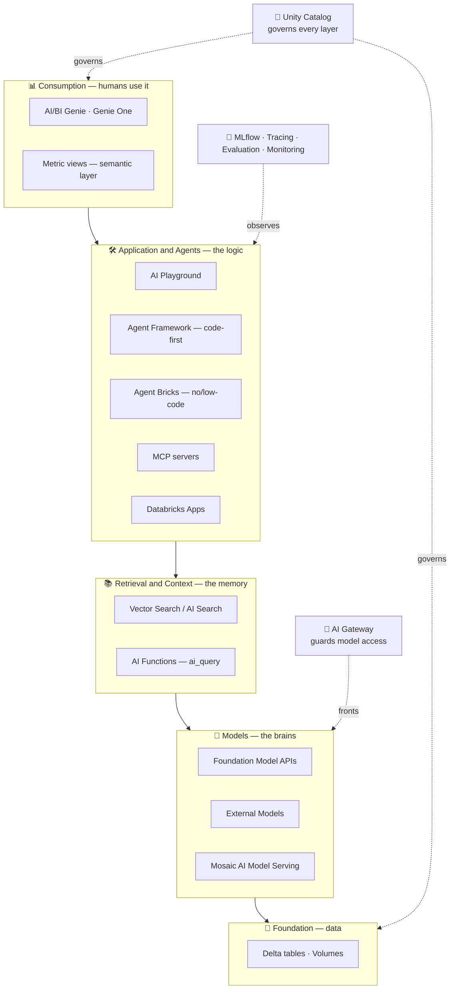
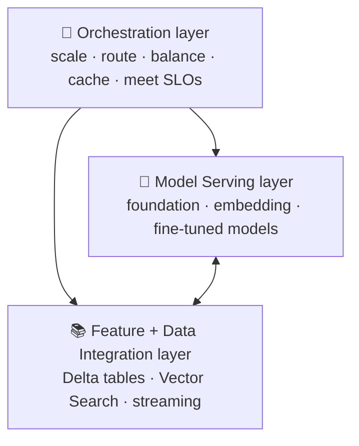
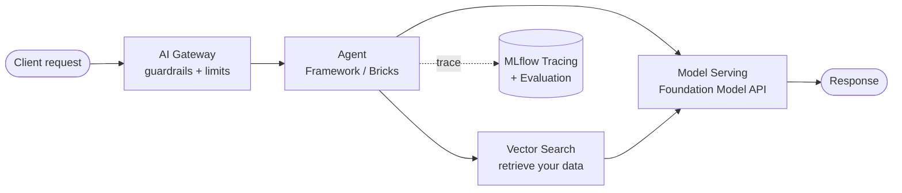
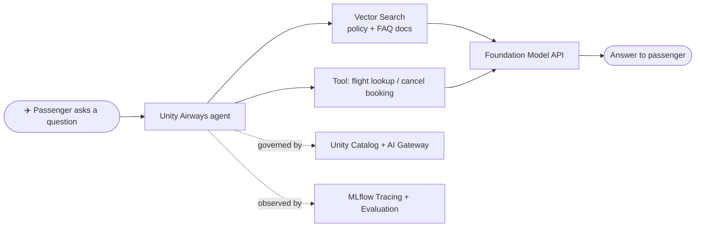

# The Mosaic AI Product Landscape — Where Each Piece Fits  ·  Module 00 · Topic 00.4  ·  [Theory]

> **You are here:** Roadmap Module 00 → 00.4. **Prereqs:** 00.1 (workspace basics), 00.2 (Unity Catalog 101) — helpful but not required.

---

## TL;DR
- **Mosaic AI** is Databricks' umbrella for building, serving, and governing AI — it is **not one product**, it's a **stack of modular pieces** that snap together.
- The cleanest way to remember it: **3 infrastructure layers** (from the cert book) → **Model Serving**, **Data/Feature integration**, **Orchestration**.
- Around those, Databricks adds a **GenAI product surface**: models (Foundation Model APIs, external models), retrieval (Vector Search), app/agent building (Agent Framework, Agent Bricks, AI Playground), quality/ops (MLflow, Agent Evaluation, Tracing), and a **governance spine** (Unity Catalog + AI Gateway).
- Business users consume it through **AI/BI Genie** and a **semantic layer** (metric views).
- 📌 Every later module in this roadmap is just a **deep dive into one box** on this map.

## Why it matters (for a Databricks FDE)
- Customers constantly ask *"what do I use for X?"* — you must instantly place the right component.
- It lets you **draw a reference architecture** on a whiteboard and defend *why* each piece is there.
- It prevents the classic mistake of **reaching for code** (Agent Framework) when a **no-code** option (Agent Bricks / Genie) would close the deal faster.

---

## Core concepts

### The mental model: a layered stack
Think of any GenAI app on Databricks as **5 layers + 2 cross-cutting spines**:

- **🧱 Foundation (data & governance)** — Unity Catalog, Delta tables, Volumes. *Everything else is governed here.*
- **🧠 Models** — the "brains" that generate text/embeddings.
- **📚 Retrieval & context** — gives the model *your* data (RAG).
- **🛠️ Application & agents** — the logic that ties models + tools + retrieval into something useful.
- **📊 Consumption** — how humans actually use it (chat UI, natural-language analytics).
- **🔐 Governance spine (cross-cutting)** — Unity Catalog + AI Gateway sit *across* all layers.
- **🔬 Quality & Ops spine (cross-cutting)** — MLflow / Tracing / Evaluation / Monitoring sit *across* all layers.

---

## 🗺️ Visual map

**The landscape, layer by layer** (dashed arrows = the two cross-cutting spines that touch every layer):

---

## Core concepts (the pieces, by layer)

**🧠 Models layer**
- **Foundation Model APIs** — state-of-the-art **open models hosted by Databricks** (pay-per-token or provisioned throughput).
- **External Models** — third-party models (OpenAI, Anthropic, etc.) called through Databricks with **unified governance**.
- **Custom / fine-tuned models** — your own models.
- **Mosaic AI Model Serving** — one **scalable REST endpoint** type that serves *all* of the above (autoscaling, GPU, sync/async, dynamic batching, versioning, A/B).

**📚 Retrieval & context layer**
- **Mosaic AI Vector Search** (a.k.a. **"AI Search"**) — builds an **embedding index** over your docs and does **similarity search** for RAG.
- **AI Functions** — call models straight from **SQL** (e.g., `ai_query`, `ai_*` functions) for batch/inline inference.
- **Feature & function serving + Delta tables** — supply structured context.

**🛠️ Application & agents layer**
- **AI Playground** — **no-code** place to chat with models, attach tools, and prototype.
- **Mosaic AI Agent Framework** — **code-first** way to author agents, tools, and the `ResponsesAgent`, then `agents.deploy()`.
- **Agent Bricks** — **no/low-code** agents: **Knowledge Assistant**, **Supervisor Agent**, **Custom Agents**.
- **MCP servers** — a **standard interface** to expose tools/data to agents.
- **Databricks Apps** — host the **web UI** for your app/agent.

**📊 Consumption layer**
- **AI/BI Genie** & **Genie One** — let **business users ask questions in natural language** over governed data.
- **Business semantics / Unity Catalog metric views** — the **semantic layer** (KPIs, synonyms) that makes Genie & agents answer *consistently*.

**🔐 Governance spine (cross-cutting)**
- **Unity Catalog** — governs **data, features, models, functions, and vector indexes**, with lineage and access control.
- **Mosaic AI Gateway / Unity AI Gateway** — governs & monitors model access: **rate limits, payload logging, guardrails, usage tracking, fallbacks**.

**🔬 Quality & Ops spine (cross-cutting)**
- **MLflow** — experiment tracking, **Model Registry in Unity Catalog**, Prompt Registry, "model-as-code".
- **MLflow Tracing** — see *every step* an agent took (observability).
- **Mosaic AI Agent Evaluation** — LLM-as-a-judge + eval datasets to score quality.
- **Monitoring / inference tables** — production metrics & feedback.

---

## How it works on Databricks

### The cert book's 3-layer view (memorize this)
From 📗 B2 Ch9 — *"Overview of Mosaic AI Architecture"* — Mosaic AI is the **orchestration backbone** with **three core layers**:

| Layer | Role |
|---|---|
| **Model serving layer** | Hosts foundation, embedding, and fine-tuned models behind scalable API endpoints (inference + embeddings). |
| **Feature & data integration layer** | Supplies models with current context from **Delta tables, Vector Search indexes, or streaming pipelines**. |
| **Orchestration layer** | **Scales resources, balances workloads, routes requests, caches responses**, ensures SLOs are met (autoscaling, load distribution). |

### A request's journey (Figure 9-7 / 9-8 in the book)
A client prompt flows through the serving layer, which may call the vector index for retrieval, apply business logic, and forward the enriched input to the model — while the orchestration layer handles autoscaling and load distribution:

### How you *invoke* each piece (concrete handles)
- Model: query a **Model Serving endpoint** (REST) or a Foundation Model API.
- Retrieval: a **Vector Search index** queried by the agent's retriever tool.
- Agent: built with **Agent Framework**, deployed via `agents.deploy(...)` (📘 B1 shows single-line deploy).
- Governance: traffic flows through the **AI Gateway**; assets live in **Unity Catalog**.
- Quality: **MLflow** logs the run; **Tracing** records the spans; **Agent Evaluation** scores it.

---

## Worked example (Unity Airways)
The book's running use case is **Unity Airways**, an airline support chatbot. Here's where each piece fits:

| Need | Mosaic AI piece |
|---|---|
| The chatbot "brain" | **Foundation Model APIs** (LLM) via **Model Serving** |
| Answer from airline policies / FAQs | **Vector Search** index over policy docs |
| Look up a flight, cancel a booking | **Agent Framework** tools (API-calling, structured lookup) |
| Tie it all together | **Agent Framework** agent (or **Agent Bricks → Knowledge Assistant** for no-code) |
| Block unsafe input/output, rate-limit | **AI Gateway** guardrails |
| Govern the docs, model, index | **Unity Catalog** |
| See why the bot gave a bad answer | **MLflow Tracing** |
| Prove quality before release | **Agent Evaluation** |
| Ops team asks "what's our deflection rate?" | **AI/BI Genie** + **metric views** |

---

> 📌 **IMPORTANT**
> - Mosaic AI = a **stack of modular pieces**, not a single product. Learn the **layers**, then the boxes.
> - **Unity Catalog** (governance) and the **AI Gateway** + **MLflow/Tracing** (ops) are **cross-cutting** — they touch *every* layer.
> - **Two ways to build agents:** **Agent Framework** (code-first, max control) vs **Agent Bricks** (no/low-code, fast). Pick based on the customer's skills and timeline.

> 💡 **TIP (field)**
> - When a customer says *"we want a chatbot over our docs,"* the minimum viable stack is just **4 boxes**: Vector Search → Foundation Model API → Agent Framework/Bricks → Model Serving, all governed by Unity Catalog.
> - Enable **dynamic batching** on serving endpoints for lots of short requests — more throughput, lower cost, minimal latency hit (book TIP, Fig 9-8).

> ⚠️ **GOTCHA (names change — verify against docs)**
> - **"Databricks Vector Search"** is now also surfaced as **"AI Search."**
> - **"MLflow AI Gateway"** evolved into the **Databricks / Unity AI Gateway.**
> - **"Mosaic AI"** carries Mosaic ML heritage; some assets/branding shift over time. Always confirm the current name in the docs before quoting it to a customer.
> - Exact product naming for **fine-tuning / model training** can vary by region/preview — verify before committing.

---

## 📝 Notes
*(your space)*
-
-

**Self-check (5 questions)**
1. What are the **three core layers** of the Mosaic AI architecture (per the cert book)?
2. Which two "spines" are **cross-cutting** across all layers, and what does each govern/provide?
3. When would you choose **Agent Bricks** over the **Agent Framework**?
4. In the Unity Airways chatbot, which piece answers questions from **policy documents**, and which serves the **LLM**?
5. What does the **AI Gateway** add that raw Model Serving does not?

---

## How this maps to the certification
- Primarily **Domain 8 — Scaling AI Solutions with Vector Search & Mosaic AI** (📗 B2 Ch9: Mosaic AI architecture, model serving at scale).
- Acts as the **map for the whole exam**: every other domain (design, RAG, deploy, govern, monitor) is a deep dive into one region of this landscape.

## Sources
- 📗 **B2** — *Databricks Certified GenAI Engineer Associate Study Guide*, Ch9: "Scaling Applications with Mosaic AI" → "Overview of Mosaic AI Architecture" (pp. 562–565), "Model Serving at Scale" (Figs 9-7, 9-8).
- 📘 **B1** — *Practical MLflow for GenAI on Databricks*, Ch7 (Agent Framework, `agents.deploy()`). *(Early Release — verify against docs.)*
- 🌐 Databricks docs — **AI Agents** landing (`/aws/en/agents/`): AI Playground, Agent Bricks (Knowledge Assistant, Supervisor Agent, Custom Agents), Agent Framework, MCP servers, AI Search, Foundation Models, Unity AI Gateway, AI Functions, Evaluation & Monitoring.
- 🌐 Databricks docs — **Mosaic AI / Machine Learning** (`/aws/en/machine-learning/`) and **Generative AI** (`/aws/en/generative-ai/`): Foundation Model APIs, External Models, Model Serving, AI Gateway, MLflow.
- 🌐 Databricks docs — **AI/BI Genie** (`/aws/en/genie/`), **Genie One** (`/aws/en/genie-one/`), **Business Semantics** (`/aws/en/business-semantics/`).
