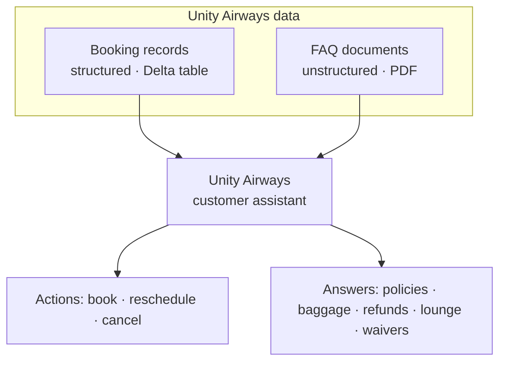
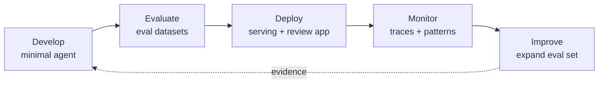

# The "Unity Airways" Running Use Case  ·  Module 00 · Topic 00.5  ·  [Theory]

> **You are here:** Roadmap Module 00 → 00.5. **Prereqs:** 00.4 (Mosaic AI landscape) helps — this use case is what we'll run *through* that landscape.

---

## TL;DR
- **Unity Airways** is a **mock airline**; the book's running example is its **customer-support chatbot/assistant**.
- The assistant helps travelers **book, reschedule, or cancel flights** and **answer policy questions** (lounge access, baggage, refunds, disruption waivers).
- It deliberately uses **two data types**: **structured booking records** (a Delta table) + **unstructured FAQ documents** (PDFs) — exactly like real enterprise GenAI projects.
- Its real purpose is to **showcase MLflow-on-Databricks best practices for GenAI**, end-to-end, not the business value itself.
- 📌 Every later module in this roadmap can be **taught against this one example** — it's the through-line.

## Why it matters (for a Databricks FDE)
- It's a **ready-made demo scaffold**: swap in a customer's docs + records and you have a tailored POC.
- It mirrors the **shape of almost every customer GenAI project** (structured data + unstructured docs + actions/tools).
- It gives us **one continuous story** so each new concept (RAG, agents, evaluation, monitoring…) attaches to something concrete.

---

## Core concepts

- **The assistant's job** — two kinds of help:
  - **Actions:** book / reschedule / cancel flight reservations.
  - **Answers:** lounge access, airline policies, baggage allowances, refund rules, disruption waivers.
- **Two deliberate data types** (to replicate real projects):
  - **Booking records — structured.** Reservation details, journey segments, contact info, fare policies, payment & refund data. *(Book Table 1-1: `booking_id`, `pnr`, `status` [TICKETED/REFUNDED], `travel_start_date`, `travel_end_date`, …)* → lives in a **Delta table**.
  - **FAQ dataset — unstructured.** Categorized Q&A on policies, services, and rules — supplied as **PDFs** → chunked & indexed for retrieval.
- **Three stated requirements** (book p. 34) — and what each one forces you to practice:

| Requirement (from the book) | What it exercises | Roadmap modules |
|---|---|---|
| Integrate **diverse data sources** (text FAQ + tabular bookings + online tools) | RAG + tools | 03, 04, 05, 09 |
| **Measure performance across every step** & pinpoint what to improve | Tracing + Evaluation | 07, 08 |
| **Track & govern** the development lifecycle for collaboration | MLflow + Unity Catalog | 06, 12, 17 |

- **Stated goal:** *"to showcase best practices of using MLflow on Databricks for GenAI workloads"* — more than business value.

---

## 🗺️ Visual map

**Anatomy of the use case** — two data sources feed one assistant with two kinds of capability:

**How the book runs it through the 5-phase MLflow lifecycle** (introduced in Ch2):

---

## How it works on Databricks (where each piece lands)
- **FAQ PDFs** → chunked, embedded, and stored in **Vector Search** (RAG for policy answers). *(Modules 03–04)*
- **Booking records** → a **Delta table**, queried by an **agent tool** / structured-data lookup. *(Modules 05, 09)*
- **The assistant** → an **agent** (Agent Framework or Agent Bricks) that routes between retrieval and tools. *(Modules 09–10)*
- **Quality & ops** → **MLflow Tracing** + **Agent Evaluation** measure each step; **Unity Catalog** governs the data/model. *(Modules 06–08, 12)*

> This is the same picture as Topic 00.4 (the Mosaic AI landscape) — Unity Airways is just that landscape **filled in with airline data**.

## Worked example
A traveler asks: **"Can I change my flight to next week, and will I be charged?"**
- **Retrieval (FAQ/Vector Search):** finds the *change/rescheduling policy* and any fees.
- **Tool (booking records):** looks up the traveler's reservation (`pnr`, `status`, dates) to check eligibility.
- **The assistant** combines both into a grounded answer — and every step is **traced** so you can see *why* it answered that way.

---

> 📌 **IMPORTANT**
> - Unity Airways deliberately combines **structured + unstructured data + actions** — that's exactly why it **generalizes** to almost any enterprise GenAI project.
> - It is the **single thread** the book (and this roadmap) reuses across develop → evaluate → deploy → monitor → improve.

> 💡 **TIP (field)**
> - Reuse Unity Airways as your **POC scaffold**: replace the FAQ PDFs with a customer's policy docs and the booking table with their records — the architecture stays identical.
> - When teaching a new concept, anchor it to one Unity Airways question (e.g., *"refund for a cancelled flight?"*) — it makes abstract MLflow features concrete.

> ⚠️ **GOTCHA (Early Release + mock data)**
> - The book is an O'Reilly **Early Release (RAW & UNEDITED)**: the Chapter 1 *conclusion* mistakenly calls it a *"financial inclusion use case"* — that's an editing artifact. The real use case is the **Unity Airways airline assistant**.
> - All booking data is **mock/synthetic** — fine for learning/demos, not real PII.

---

## 📝 Notes
*(your space)*
-
-

**Self-check (5 questions)**
1. What does the Unity Airways assistant actually *do* for travelers (two categories)?
2. Name the **two data types** in the use case and the **format** of each.
3. Which Databricks pieces handle the **FAQ PDFs** vs the **booking records**?
4. What are the **three requirements** the book says the use case must satisfy?
5. Why is this use case a good **POC scaffold** for a real customer?

---

## How this maps to the certification
- Strong fit for **Domain 2 — Preparing & chunking data for RAG** (the structured-vs-unstructured split, FAQ-PDF extraction) and **Domain 1 — Designing GenAI applications**.
- Because the use case touches the whole lifecycle, it's a convenient mental anchor for **every** exam domain.

## Sources
- 📘 **B1** — *Practical MLflow for GenAI on Databricks*, Ch1 "Introducing the Book's Core Use Case" (pp. 33–35, incl. Table 1-1 booking records). *(Early Release — verify against docs.)*
- 📘 **B1** — Ch2 "Applying the lifecycle to Unity Airways" (pp. 42, 46, 70); Ch3 prompt examples ("You are a customer support assistant for Unity Airways", pp. 78–80).
- 🔗 Related: Topic **00.4** (Mosaic AI landscape) — the architecture this use case fills in.
