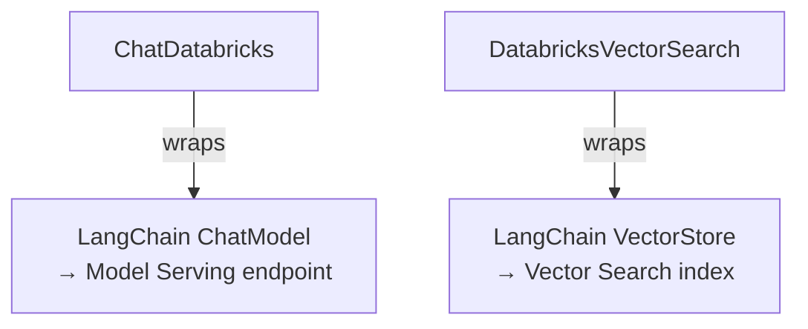
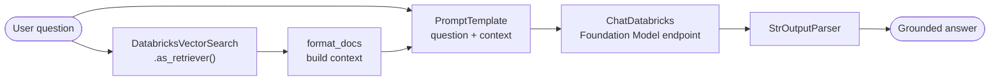

# LangChain ↔ Databricks: `ChatDatabricks` & `DatabricksVectorSearch`  ·  Module 05 · Topic 05.2  ·  [Hands-on]

> **You are here:** Roadmap Module 05 → 05.2. **Prereqs (recommended):** 05.1 (what a chain is), 04 (Vector Search), 01 (LLM basics). You jumped ahead — that's fine; backfill anytime.

---

## TL;DR
- LangChain has **first-party Databricks integrations**, so RAG building blocks work out-of-the-box.
- Two classes do the heavy lifting:
  - **`ChatDatabricks`** — wraps a LangChain **ChatModel** to call any **Model Serving** endpoint (e.g., a Foundation Model API).
  - **`DatabricksVectorSearch`** — wraps a LangChain **VectorStore** to query a **Vector Search index** (and turn it into a retriever).
- Both come from one package: **`databricks-langchain`** → `from databricks_langchain import ChatDatabricks, DatabricksVectorSearch`.
- Wire them together with **LCEL** (`retriever → prompt → model → parser`) and you have a RAG chain.
- 📌 This is the exact pair the book uses to build the Unity Airways assistant.

## Why it matters (for a Databricks FDE)
- It's the **shortest path** from "I have a Vector Search index + a Foundation Model" to "I have a working RAG chain."
- Everything stays **on Databricks** (governed endpoints, UC) — no glue code to external SDKs.
- It's the foundation for logging/serving the chain later (05.5–05.7) and for agents (Module 09).

---

## Core concepts
- **`ChatDatabricks`** — *"call my served model from LangChain."* You give it an **`endpoint`** name; you get a standard LangChain chat model you can `.invoke()` or drop into a chain.
- **`DatabricksVectorSearch`** — *"query my index from LangChain."* You give it an **`index_name`** (and endpoint); you get a VectorStore with `.similarity_search(...)` and `.as_retriever(...)`.
- **Retriever** — `vector_store.as_retriever(...)` returns the standard LangChain retriever interface, so it composes with any chain.

---

## 🗺️ Visual map

**What each class wraps:**


**The RAG chain they build (LCEL):**


---

## How it works on Databricks `[Hands-on]`

**Prerequisites (from the book, p. 140):**
- **Serverless compute** attached to a notebook.
- A **pay-per-token Foundation Model API** model (simplest LLM to start).
- A **Vector Search endpoint with an indexed dataset**.

**0 · Install the package**
```python
%pip install -U databricks-langchain mlflow
dbutils.library.restartPython()
```

**1 · `ChatDatabricks` — call a served model** *(book p. 140, verbatim)*
```python
from databricks_langchain import ChatDatabricks

chat_model = ChatDatabricks(
    endpoint="databricks-claude-3-7-sonnet",   # any Model Serving / FM API endpoint
    temperature=0,
    max_tokens=256,
)
print(chat_model.invoke("How do i book flights with Unity Airways?"))
```

**2 · `DatabricksVectorSearch` — query an index, get a retriever** *(book p. 141)*
```python
from databricks_langchain import DatabricksVectorSearch

vector_store = DatabricksVectorSearch(
    endpoint="<your-vs-endpoint>",
    index_name="<catalog>.<schema>.<faq_index>",
)

# direct similarity search
results = vector_store.similarity_search(
    query="How do i book flights with Unity Airways?", k=1
)
for doc in results:
    print(f"* {doc.page_content} [{doc.metadata}]")

# convert to a LangChain retriever
retriever = vector_store.as_retriever(search_kwargs={"k": 3, "query_type": "ANN"})
print(retriever.invoke("How do i book flights with Unity Airways?"))
```

**3 · Assemble a minimal RAG chain (LCEL)** — a clean, runnable version of the book's chain:
```python
from langchain_core.prompts import PromptTemplate
from langchain_core.runnables import RunnablePassthrough
from langchain_core.output_parsers import StrOutputParser

prompt = PromptTemplate(
    template=(
        "You are a customer support assistant for Unity Airways.\n"
        "Answer using ONLY the context.\n\nContext:\n{context}\n\nQuestion: {question}"
    ),
    input_variables=["context", "question"],
)

def format_docs(docs):
    return "\n\n".join(d.page_content for d in docs)

chain = (
    {"context": retriever | format_docs, "question": RunnablePassthrough()}
    | prompt
    | chat_model
    | StrOutputParser()
)

import mlflow
mlflow.langchain.autolog()   # every call is now traced (Module 07)
print(chain.invoke("How do i book flights with Unity Airways?"))
```

---

## Worked example (Unity Airways)
The book uses the exact query **"How do I book flights with Unity Airways?"** to show: the **LLM-only** answer first (no context), then the **full RAG** answer once `DatabricksVectorSearch` feeds the FAQ chunks into the prompt — grounding the response in the airline's actual policies.

> 📌 **IMPORTANT**
> - Import from **`databricks_langchain`** (the current package). Both classes live there.
> - **`ChatDatabricks(endpoint=...)`** points at a Model Serving / Foundation Model endpoint; **`DatabricksVectorSearch(index_name=...)`** points at a Vector Search index.
> - `.as_retriever()` makes the index composable with **any** LangChain chain.

> 💡 **TIP (field)**
> - **Separate config from code:** the book stores endpoint names, index name, and prompt in a **`rag_chain_config.yml`** and loads it via `mlflow.models.ModelConfig` — so you can change models/indexes without touching code (and track it in Git).
> - Call **`mlflow.langchain.autolog()`** once and every chain invocation is automatically **traced** — invaluable for debugging RAG.

> ⚠️ **GOTCHA (package + param drift — verify in docs)**
> - The integration moved: older code used `langchain_community` or `langchain-databricks`; **today it's `databricks-langchain`**. Old imports may still appear in tutorials.
> - Newer docs also show an **AI-Gateway** form `ChatDatabricks(model="<endpoint>", use_ai_gateway=True)`. The book/standard form uses **`endpoint=`** — confirm which your runtime/package version expects.
> - `DatabricksVectorSearch` works against a **delta-sync index with Databricks-managed embeddings**; if you self-manage embeddings the args differ — check the current docs.

---

## 📝 Notes
*(your space)*
-
-

**Self-check (5 questions)**
1. Which package do `ChatDatabricks` and `DatabricksVectorSearch` come from today?
2. What LangChain base class does each one wrap?
3. How do you turn a `DatabricksVectorSearch` into a retriever?
4. In the LCEL chain, what does `format_docs` do and why is it needed?
5. What's one benefit of putting endpoint/index names in a YAML config instead of code?

---

## How this maps to the certification
- **Domain 3 — Building GenAI apps with Python & LangChain** (chains, retrievers) and **Domain 4 — Deploying & integrating RAG** (the chain becomes the deployable artifact).

## Sources
- 📘 **B1** — *Practical MLflow for GenAI on Databricks*, Ch4 "LangChain and Databricks Integration" → `ChatDatabricks` (p. 140), `DatabricksVectorSearch` (p. 141), Full RAG Chain with `ModelConfig` (pp. 146–147). *(Early Release — verify against docs.)*
- 🌐 Databricks docs — "LangChain on Databricks" / the **`databricks-langchain`** integration package (`ChatDatabricks`, `DatabricksEmbeddings`, `DatabricksVectorSearch`).
- 🔗 Related: 04 (Vector Search), 05.1 (chains), 05.5–05.7 (logging/versioning the chain).
