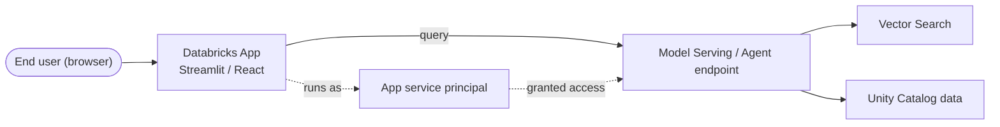
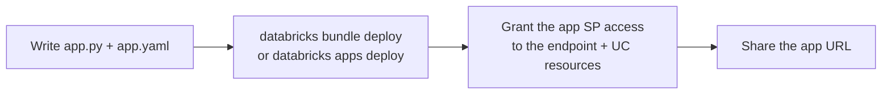

# Build & Deploy a GenAI App on Databricks Apps  ·  Module 10 · Topic 10.5  ·  [Hands-on]

> **You are here:** Roadmap Module 10 → 10.5. **Prereqs (recommended):** a deployed **Model Serving / agent endpoint** (05.2, 11.1) to call, and the **Databricks CLI**. Deep auth is the *next* topic (11.7 + 11.9).

---

## TL;DR
- **Databricks Apps** lets you host an **interactive web app** (chat UI, dashboard) **directly on Databricks** — no separate infrastructure.
- It runs on the **serverless** platform, integrates with **Unity Catalog / SQL / OAuth**, and is **billed per hour** while running.
- Build with **Python** (Streamlit, Dash, Gradio) or **Node.js** (React, Angular, Svelte, Express).
- An app declares **resources** (e.g., a Model Serving endpoint) and, when deployed, runs as an **app service principal**.
- For GenAI: a chat UI that **queries your agent/Model Serving endpoint**. There's an official **`e2e-chatbot-app-next`** template (NextJS + AI SDK).
- 📌 This is how you put a **front-end** on the Unity Airways assistant.

## Why it matters (for a Databricks FDE)
- It closes the "last mile": customers can **see and use** the agent you built — no separate web host, auth stack, or cloud account.
- Everything stays **governed** (UC) and **co-located** with the data and endpoints.
- It's a fast, credible **demo + pilot** surface.

---

## Core concepts
- **App = code + `app.yaml`.** Your source (e.g., `app.py`) plus a config file telling Databricks how to start it.
- **`app.yaml`** — two key parts:
  - **`command`** — how to launch (e.g., `["streamlit", "run", "app.py"]`).
  - **`env`** — environment variables / config (e.g., the endpoint name).
- **Resources** — things the app is allowed to use: **Model Serving endpoints**, **SQL warehouses**, **secrets**, **UC** objects. You attach them so the app's identity gets scoped access.
- **Identity** — a **deployed app runs as an app service principal**; **local dev** uses *your* CLI auth. *(Full auth model = topic 11.9.)*
- **Compute** — **serverless**, billed per hour while the app is running.
- **Frameworks** — Python: **Streamlit / Dash / Gradio**; Node: **React / Angular / Svelte / Express**.

---

## 🗺️ Visual map

**Runtime architecture** (the app is a thin UI in front of your endpoint):


**Build → deploy flow:**


---

## How it works on Databricks `[Hands-on]`

**Prerequisites:** a workspace with **Databricks Apps** enabled; a **Model Serving / agent endpoint** to call (e.g., the Unity Airways agent from 05.2/11.1); the **Databricks CLI** (`databricks auth login`).

**1 · A minimal Streamlit chat app** (`app.py`):
```python
import streamlit as st
from databricks.sdk import WorkspaceClient
from databricks.sdk.service.serving import ChatMessage, ChatMessageRole

w = WorkspaceClient()                  # deployed app: auto-auths as the app service principal
ENDPOINT = "unity-airways-agent"       # your Model Serving / agent endpoint name

st.title("✈️ Unity Airways Assistant")
st.session_state.setdefault("history", [])

for m in st.session_state.history:
    st.chat_message(m["role"]).write(m["content"])

if q := st.chat_input("Ask about bookings, baggage, refunds…"):
    st.session_state.history.append({"role": "user", "content": q})
    st.chat_message("user").write(q)

    resp = w.serving_endpoints.query(
        name=ENDPOINT,
        messages=[ChatMessage(role=ChatMessageRole.USER, content=q)],
    )
    answer = resp.choices[0].message.content
    st.session_state.history.append({"role": "assistant", "content": answer})
    st.chat_message("assistant").write(answer)
```

**2 · `app.yaml`** (how Databricks starts it):
```yaml
command: ["streamlit", "run", "app.py"]
env:
  - name: "SERVING_ENDPOINT"
    value: "unity-airways-agent"
```

**3 · `requirements.txt`:**
```text
streamlit
databricks-sdk
```

**4 · Deploy** (CLI; bundles are the repeatable/CI path):
```bash
# option A — direct
databricks apps create unity-airways-chat
databricks sync ./app "/Workspace/Users/me@co.com/unity-airways-chat"
databricks apps deploy unity-airways-chat \
  --source-code-path "/Workspace/Users/me@co.com/unity-airways-chat"

# option B — Databricks Asset Bundles (recommended for repeatable deploys + CI/CD)
databricks bundle deploy
```

**5 · Grant the app's service principal access** to the serving endpoint (and any UC objects/secrets it uses), then **share the app URL**.

---

## Worked example (Unity Airways)
A traveler opens the app, types *"Can I change my flight to next week?"* → the Streamlit app calls the **Unity Airways agent endpoint** → the agent does RAG (FAQ) + a booking lookup → the answer streams back in the chat UI. Same agent as Module 05/09; the app is just the **face**.

> 📌 **IMPORTANT**
> - A **deployed app runs as an app service principal** — you must **grant that SP access** to the endpoint (and UC data/secrets) it calls. Declaring **resources** wires this up.
> - The app is a **thin client**: keep the LLM/agent logic in the **endpoint**, not the UI.

> 💡 **TIP (field)**
> - Start from the official **`e2e-chatbot-app-next`** template (NextJS + React + AI SDK) — production-ready chat with **streaming, tool-call rendering, and persistent history**. It connects to *agents on Apps* or *agents on Model Serving (Chat/Responses task)*.
> - Use **Databricks Asset Bundles** (`databricks bundle deploy`) for repeatable deploys and GitHub-Actions CI/CD.

> ⚠️ **GOTCHA (docs-only; evolving)**
> - **The project books don't cover Databricks Apps** (newer than the Early Release) — this topic is grounded in current docs; **verify exact `app.yaml` keys, CLI flags, and the SDK `serving_endpoints.query` shape** against the live docs for your workspace.
> - Apps run on **serverless and bill per hour while running** — stop unused apps.
> - The NextJS chat template supports **only CLI auth (local dev) and service-principal auth (deployed)** today.

---

## 📝 Notes
*(your space)*
-
-

**Self-check (5 questions)**
1. What two files minimally define a Databricks App, and what does each do?
2. What identity does a **deployed** app run as, and why does that matter for calling an endpoint?
3. Which frameworks can you use (name two Python, two Node)?
4. Why keep the agent logic in the endpoint rather than the app?
5. What's the recommended way to deploy repeatably (with CI/CD)?

---

## How this maps to the certification
- **Domain 4 — Deploying & integrating** (the app is the front-end/integration surface). Apps aren't a heavy exam focus, but knowing the deploy + identity model is valuable field knowledge.

## Sources
- 🌐 Databricks docs — **Databricks Apps** (`/aws/en/dev-tools/databricks-apps/`): overview, **Key concepts**, **Configuration**, **Deploy**, **CI/CD**, frameworks (Streamlit/Dash/Gradio; React/Angular/Svelte/Express), serverless + per-hour billing.
- 🌐 Databricks docs — **Agent Framework → chat app** (`/aws/en/generative-ai/agent-framework/chat-app`): the **`e2e-chatbot-app-next`** template, connecting to agents on Apps / Model Serving, `databricks bundle deploy`.
- ⚠️ Not in the project books (Databricks Apps postdates the Early Release).
- 🔗 Related: 11.7 + 11.9 (authentication — next), 09–10 (the agent the app calls).
