# Unity Airways Support RAG Knowledge Base · Capstone C1 · Build after P1 (Module 05) · [Project]

> **Where this sits:** first capstone in the roadmap. Build it at the **end of Level 2 / Module 05 (Phase P1)**, once Modules 00–05 are done. It stitches those five modules into one shipped thing — an ingestion pipeline, an AI Search index, and a **registered, queryable RAG chain that answers policy questions with citations**.
>
> **Why it's first:** this capstone *creates* the Unity Airways artifacts every later capstone extends — the chunk table `unity_airways.rag.ua_rag_chunks`, the index `unity_airways.rag.ua_rag_chunks_index`, and the registered chain `unity_airways.rag.ua_rag_chain`. C2 evaluates and versions this chain; C3 turns it into a governed agent; C4 folds it into the full platform. Get the names and the shapes right here and the rest of the track inherits them.

This is a **project brief**, not a lesson. It tells you what to build, in what order, and how it will be graded. The runnable notebook (`17` phase) comes later — here you assemble the pieces you already learned into a working system and prove it works.

---

## 1. Scenario

Unity Airways runs a customer-support desk that fields the same policy questions all day: refunds on Basic Economy, checked-bag fees, what happens when a connection is cancelled, how to change a booking. The answers all live in official documents — policy PDFs, an internal FAQ export, and scanned refund forms — but they are spread across thousands of files, and agents burn minutes hunting for the exact clause.

The support lead wants a knowledge base an agent can ask in plain language and get back **a grounded answer plus the document it came from**, so the agent can trust it and paste the citation into the ticket.

**The business problem, precisely:**
- The corpus is real-world messy: typed policy PDFs, an FAQ dump, and image-only scanned refund forms.
- Questions are worded nothing like the documents. "Can I rebook for free if my connection is cancelled?" has to find a chunk that says *involuntary re-accommodation* and never uses the words "rebook" or "free".
- A confident wrong answer is worse than no answer. Every response must be traceable to a source chunk, or an agent could relay a policy the airline doesn't actually have.

**Success criteria** (what "done" looks like for the business):
- An agent asks a policy question in natural language and gets a correct, grounded answer in seconds.
- Every answer carries **which source document** backs it, so the agent can verify before relaying.
- When a policy PDF changes, refreshing the knowledge base is incremental — you re-index what changed, not the whole corpus.
- The whole thing is a **governed, registered model** in Unity Catalog, not a notebook someone has to re-run by hand.

> 📌 **IMPORTANT:** "Answers with citations" is the acceptance bar, not a nice-to-have. A RAG chain that returns fluent text with no traceable source has failed this capstone even if the prose reads well. Groundedness and the source reference are what make it usable at a support desk.

---

## 2. What you'll build

**Objective:** turn a folder of Unity Airways documents into a queryable, registered RAG chain — end to end, on Databricks, with governance and versioning baked in.

**The concrete target, in one line:** an **ingestion pipeline → AI Search index → a registered, queryable RAG chain that answers policy questions with citations**.

Broken out, you will produce:
- an **ingestion + parse** step that reads the raw documents from a UC Volume and extracts clean text (`ai_parse_document`, with `ai_extract` where structured fields help);
- a **chunk table**, `unity_airways.rag.ua_rag_chunks` — one governed Delta row per chunk, with metadata and Change Data Feed on;
- a **Delta Sync vector index**, `unity_airways.rag.ua_rag_chunks_index`, with managed embeddings from `databricks-gte-large-en`;
- a **LangChain RAG chain** — the Module 04 retriever wired to `ChatDatabricks("databricks-claude-sonnet-4-5")` through an LCEL pipeline that returns a grounded answer and the source, with its **prompt loaded from the MLflow Prompt Registry** (not baked into the code);
- a **registered UC model**, `unity_airways.rag.ua_rag_chain`, logged as **Models-from-Code** and versioned as an MLflow LoggedModel.

**One design choice worth naming up front:** the chain's prompt is not a string baked into the code. You **author it once and register it** in the MLflow Prompt Registry (Module 02.5, **Beta**) as `unity_airways.rag.ua_rag_prompt`, then the chain **loads it by URI** — so the prompt is a governed, versioned Unity Catalog artifact from day one. Here you author v1; C2 versions and evaluates it later.

> 💡 **TIP:** Build it exactly in the order of the milestones below. Each one hands its output to the next — the table feeds the index, the index feeds the retriever, the retriever feeds the chain, the chain gets logged and registered. Skipping ahead (e.g. building the index before Change Data Feed is on the table) is the fastest way to a mid-build stall.

---

## 3. Prerequisites

**Modules (all ✅ before you start):**
- **00 — Platform foundations:** Unity Catalog, Volumes, Delta, the Unity Airways use case.
- **01 — GenAI & LLM fundamentals:** what embeddings are and why they matter (01.3).
- **02 — Prompt engineering:** the prompt you'll register and load in the chain — including **02.5 MLflow Prompt Registry** (author and version the RAG prompt).
- **03 — Data prep & chunking:** parsing (03.4/03.8), chunking (03.2/03.3), Delta chunk store (03.6).
- **04 — Embeddings & AI Search:** embedding model choice (04.2), building/querying the index (04.3).
- **05 — Building the RAG chain:** LCEL chain (05.1–05.3), packaging & logging (05.5–05.7).

**Workspace / platform:**
- A Databricks workspace with **Unity Catalog** enabled, and rights to create a catalog/schema, a UC Volume, tables, a Vector Search index, and a UC model in `unity_airways.rag`.
- **Serverless or a recent DBR-ML runtime.** `ai_parse_document` needs a recent DBR/serverless (the two live doc pages disagree — DBR 17.3+ on the function reference vs 18.2+/serverless v3+ on the AI Functions overview; confirm against your workspace at build time). Not a Classic/Pro SQL warehouse.
- **MLflow ≥ 3.1** (Models-from-Code, `set_active_model`/LoggedModel).
- **MLflow Prompt Registry (Beta)** — `mlflow[databricks]>=3.1.0`, a UC schema (`unity_airways.rag`) where you hold `CREATE FUNCTION` + `EXECUTE` + `MANAGE`, and the feature enabled on the workspace **Previews** page. Used to register and load the chain's prompt (Module 02.5).
- Access to the Foundation Model endpoints: **`databricks-gte-large-en`** (embeddings) and **`databricks-claude-sonnet-4-5`** (chat). Served-model names churn — confirm both on the supported-models page before hard-coding.
- Packages: **`databricks-vectorsearch`** (the `VectorSearchClient` SDK — name unchanged despite the "AI Search" rebrand), **`databricks-langchain`** (`ChatDatabricks`, `DatabricksVectorSearch`, `DatabricksEmbeddings`), and `mlflow`.

> ⚠️ **GOTCHA:** The package is `databricks-vectorsearch` even though the product is now **Databricks AI Search**. There is no `databricks-ai-search` package and no `AISearchClient`. And the LangChain integration is **`databricks-langchain`**, not `langchain-databricks` or `langchain_community`. Two of the most common build-blockers in this capstone are import errors from getting these wrong.

---

## 4. 🗺️ Target architecture

The whole capstone is one left-to-right spine: raw docs become chunks, chunks become vectors, vectors become a retriever, the retriever becomes a chain, and the chain becomes a governed model. Nothing loops back except the incremental re-index when documents change.

```mermaid
flowchart LR
  subgraph SRC["Source · UC Volume (Module 00/03)"]
    V["Unity Airways docs<br/>policy PDFs · FAQ export · scanned refund forms<br/>/Volumes/unity_airways/rag/landing/"]
  end
  subgraph PREP["Ingest + prepare (Module 03)"]
    P["ai_parse_document(content)<br/>layout-aware text · ai_extract for fields<br/>03.4 / 03.8"]
    K["chunk the clean text<br/>paragraph + sliding-window, ~200 tokens<br/>03.2 / 03.3"]
    P --> K
  end
  subgraph STORE["Governed chunk store (Module 03.6)"]
    D["unity_airways.rag.ua_rag_chunks<br/>Delta · CDF on<br/>chunk_id · content · source_doc · chunk_index · ingested_at"]
  end
  subgraph INDEX["Embed + index (Module 04)"]
    E["Embedding endpoint<br/>databricks-gte-large-en<br/>1024-dim · 8192-token"]
    I["Delta Sync Index (managed embeddings)<br/>unity_airways.rag.ua_rag_chunks_index<br/>Standard endpoint · TRIGGERED · 04.3"]
    E --> I
  end
  subgraph CHAIN["RAG chain (Module 05)"]
    RET["DatabricksVectorSearch(...).as_retriever(k=5)<br/>databricks-langchain · 04.5 / 05.2"]
    LC["LCEL chain: extract - retrieve - format<br/>registry prompt + ChatDatabricks + StrOutputParser<br/>ChatDatabricks('databricks-claude-sonnet-4-5') · 05.1/05.3"]
    RET --> LC
  end
  PR["Prompt Registry · Beta · 02.5<br/>prompts:/unity_airways.rag.ua_rag_prompt/1<br/>register_prompt() v1 · load_prompt()"]
  subgraph REG["Log + register (Module 05.5-05.7)"]
    MC["Models-from-Code<br/>mlflow.models.set_model(chain) in rag_chain.py<br/>signature + resources=[endpoint, index]"]
    UC["Register to Unity Catalog<br/>unity_airways.rag.ua_rag_chain<br/>LoggedModel version · set_active_model"]
    MC --> UC
  end
  V --> P
  K --> D
  D --> E
  I --> RET
  PR --> LC
  LC --> MC
  D -. "policy changes -> CDF -> re-embed only changed rows" .-> I
```



*Fig. C1 — Unity Airways RAG: ingest → chunk → index → chain → register. Everything left of the RAG chain is Modules 03–04; the chain and its registration are Module 05. The **Prompt Registry** node (02.5) feeds the chain's prompt step — the chain loads a registered, versioned prompt rather than an inline string. The dashed line is the incremental refresh — a Delta Sync index reads the table's Change Data Feed and re-embeds only the rows that changed.*

> 📌 **IMPORTANT:** The retriever the chain calls is the *exact* object Module 04 built — Module 05 does not re-create it. The single hand-off between "retrieval" and "application" is `DatabricksVectorSearch(...).as_retriever(...)`. Keep the endpoint name, index name, and returned `columns` identical on both sides or the chain retrieves nothing.

---

## 5. Milestones

Five milestones, each mapping to specific module topics, each with an **acceptance criterion** you can check before moving on. All are `[Hands-on]`. Code here is illustrative and short — the point is the shape and the checkpoint, not a copy-paste solution.

### M1 · Ingest + parse the raw documents — 03.4 / 03.8

Land the Unity Airways documents in a UC Volume and extract clean, readable text. Prefer the SQL-native path (`ai_parse_document`) so you don't manage OCR/PDF libraries by hand; fall back to the layered text-first/OCR pattern (03.4) only if you need local control. Use `ai_extract` where a structured field (e.g. `booking_reference`, `refund_amount`) is genuinely useful.

```sql
-- Parse straight from the UC Volume, SQL-native (03.8)
SELECT path, ai_parse_document(content) AS parsed
FROM READ_FILES('/Volumes/unity_airways/rag/landing/policies/', format => 'binaryFile');
```

**Acceptance criterion:** parsed text exists for every source document; scanned refund forms yield readable text (not garbled OCR); rows whose first `error_status` element is non-null (`parsed:error_status[0] IS NOT NULL`) are routed to a quarantine table rather than passed downstream. Spot-check three documents and confirm the prose is clean.

### M2 · Chunk the text → governed Delta table — 03.2 / 03.6

Clean the parsed text (strip nav menus, "last updated" lines, page numbers — 03.5) and chunk it with a strategy that fits the content: sentence/paragraph chunks for the FAQ (each Q&A stands alone), paragraph chunks with a **sliding-window overlap** for dense fare-rules policies (so cross-referenced clauses stay together). Start around **~200 tokens**. Write one row per chunk to a **UC managed Delta table** with metadata, and enable **Change Data Feed**.

```python
# Chunks -> governed UC Delta table (03.6)
CATALOG, SCHEMA = "unity_airways", "rag"
(df.withColumn("source_doc", ...).withColumn("chunk_index", ...)
   .withColumn("ingested_at", current_timestamp())
   .write.format("delta").mode("overwrite")
   .saveAsTable(f"{CATALOG}.{SCHEMA}.ua_rag_chunks"))
# ALTER TABLE unity_airways.rag.ua_rag_chunks SET TBLPROPERTIES (delta.enableChangeDataFeed = true);
```

**Acceptance criterion:** `unity_airways.rag.ua_rag_chunks` exists as a UC managed table with columns `chunk_id, content, source_doc, chunk_index, ingested_at`; `chunk_id` is unique; Change Data Feed is on; `SELECT count(*)` is > 0 and a sampled row is a clean, self-contained chunk with populated metadata. No `/mnt/...` DBFS paths.

### M3 · Build + query the AI Search index — 04.3

Create a **Standard** Vector Search endpoint, then a **Delta Sync index with managed embeddings** on `ua_rag_chunks`: primary key `chunk_id`, embed the `content` column with `databricks-gte-large-en`, sync the metadata columns you'll filter/return, TRIGGERED pipeline. Query it and confirm meaning-based retrieval works.

```python
from databricks.vector_search.client import VectorSearchClient  # databricks-vectorsearch
vsc = VectorSearchClient()
vsc.create_endpoint_and_wait(name="unity-airways-vs", endpoint_type="STANDARD")
index = vsc.create_delta_sync_index_and_wait(
    endpoint_name="unity-airways-vs",
    index_name="unity_airways.rag.ua_rag_chunks_index",
    source_table_name="unity_airways.rag.ua_rag_chunks",
    primary_key="chunk_id",
    embedding_source_column="content",
    embedding_model_endpoint_name="databricks-gte-large-en",
    pipeline_type="TRIGGERED",
    columns_to_sync=["chunk_id", "content", "source_doc", "chunk_index"],
)
```

**Acceptance criterion:** the index reaches state **ONLINE**; a semantic query with zero shared keywords retrieves the right chunk — "Can I rebook for free if my connection is cancelled?" returns the *involuntary re-accommodation* chunk in the top results. Metadata (`source_doc`) comes back on each hit (proof the columns synced).

### M4 · Assemble the LCEL RAG chain — 05.2 / 05.3

First **register the RAG prompt** as a governed artifact, then assemble the chain around it. Rather than hardcode the prompt as an inline string, **author it once and register it in the MLflow Prompt Registry** (Module 02.5, **Beta**) as `unity_airways.rag.ua_rag_prompt` v1 — a Unity Catalog identifier — with `{{context}}` and `{{question}}` variables. The chain then **loads it by URI** (`prompts:/unity_airways.rag.ua_rag_prompt/1`) instead of holding a literal. Wrap the index as a retriever with `DatabricksVectorSearch(...).as_retriever(search_kwargs={"k":5})`, and build the LCEL chain: two parallel branches (extract query → retrieve → `format_docs` for `context`; pass the raw question through for `question`) → the **loaded prompt** → `ChatDatabricks("databricks-claude-sonnet-4-5")` → `StrOutputParser`. Keep config (endpoint, index, `k`, and the prompt URI) in a YAML loaded via `ModelConfig`. The chain's input contract is `{"messages":[...]}`, not a bare string. The registered prompt must instruct the model to answer **only from the retrieved context and name the source**.

```python
import mlflow
from langchain_core.prompts import PromptTemplate

# Author + register the RAG prompt as a governed UC artifact (Module 02.5, Beta)
mlflow.genai.register_prompt(
    name="unity_airways.rag.ua_rag_prompt",                # UC identifier: catalog.schema.name
    template=("You are a customer-support assistant for Unity Airways. "
              "Answer ONLY from the retrieved context; if it is missing, say you don't know. "
              "Always name the source document.\n\n"
              "Context:\n{{context}}\n\nQuestion: {{question}}\n\nGrounded answer:"),
    commit_message="v1: grounded, cite-the-source RAG prompt",
    tags={"use_case": "support_rag", "owner": "unity-airways-rag"},
)
# The chain loads the prompt by URI — never an inline literal
loaded = mlflow.genai.load_prompt("prompts:/unity_airways.rag.ua_rag_prompt/1")
prompt = PromptTemplate.from_template(loaded.to_single_brace_format())  # {{var}} -> {var} for LangChain

chain = (
    {"context":  itemgetter("messages") | RunnableLambda(extract_user_query_string)
                 | retriever | RunnableLambda(format_docs),
     "question": itemgetter("messages") | RunnableLambda(extract_user_query_string)}
    | prompt | model | StrOutputParser()
)
chain.invoke({"messages": [{"role": "user",
    "content": "Can I rebook for free if my connection is cancelled?"}]})
```

**Acceptance criterion:** the chain answers the re-accommodation question with a grounded response that **cites its source document**, and the answer changes correctly versus an LLM-only baseline (which has no grounding). An MLflow trace shows both the retriever (`VectorStoreRetriever`) and `ChatDatabricks` as child spans — proof retrieval ran before generation. The chain **resolves its prompt from `prompts:/unity_airways.rag.ua_rag_prompt/1`** (not an inline literal), and `unity_airways.rag.ua_rag_prompt` exists as a UC entity in the `unity_airways.rag` schema.

### M5 · Log Model-as-Code + register to UC — 05.5 / 05.6 / 05.7

Package the chain so it runs outside the notebook. Define the **signature** and the **dependent resources** (`DatabricksServingEndpoint` + `DatabricksVectorSearchIndex`) so a served chain auto-authenticates. Log it with **Models-from-Code** (`mlflow.models.set_model(chain)` in `rag_chain.py`, logged by path — not by pickling the object), register it to Unity Catalog, and version each iteration with `set_active_model`.

```python
logged = mlflow.langchain.log_model(
    lc_model="rag_chain.py",                       # a path, not the object (Models-from-Code)
    code_paths=["helpers/"],
    model_config="../conf/rag_chain_config.yml",
    signature=signature,
    resources=[DatabricksServingEndpoint(endpoint_name="databricks-claude-sonnet-4-5"),
               DatabricksVectorSearchIndex(index_name="unity_airways.rag.ua_rag_chunks_index")],
    registered_model_name="unity_airways.rag.ua_rag_chain",  # -> UC (set_registry_uri('databricks-uc'))
)
```

**Acceptance criterion:** `unity_airways.rag.ua_rag_chain` appears in Unity Catalog with at least one version; the version's `MLmodel` artifact lists the `signature`, a `resources:` block naming the serving endpoint and the index, and the saved `rag_chain.py` source (not a pickle); `mlflow.langchain.load_model(...).invoke(input_example)` **reproduces the notebook answer**. Each iteration shows as a LoggedModel in the Versions tab with its params.

> ⚠️ **GOTCHA:** If the chain works in the notebook but 401s once served, you forgot `resources=[...]`. Flavor-logging the chain object (rather than the `.py` path) hits `Failed to save runnable sequence` because `VectorStoreRetriever` isn't natively serializable — Models-from-Code sidesteps that entirely by saving code instead of an object.

---

## 6. Deliverables

Submit the **three named artifacts** plus a short demo:

1. **`unity_airways.rag.ua_rag_chunks`** — the governed Delta chunk table (CDF on, metadata columns).
2. **`unity_airways.rag.ua_rag_chunks_index`** — the ONLINE Delta Sync index (managed embeddings, `databricks-gte-large-en`).
3. **`unity_airways.rag.ua_rag_chain`** — the registered UC model, logged as Models-from-Code, with at least one LoggedModel version.

**Demo (the proof it works):** five representative Unity Airways policy questions answered by the registered chain, each with the **source document cited**. Suggested set:
- "Can I get a refund on a Basic Economy fare?"
- "Can I rebook for free if my connection is cancelled?"
- "What's the checked-bag fee?"
- "How do I change an existing booking?"
- "What happens if my flight is delayed overnight?"

Each answer must be grounded in a retrieved chunk and name where it came from. An ungrounded or uncited answer fails the demo.

---

## 7. Grading rubric

Concrete criteria across three levels. "Meets" is the pass bar; "Exceeds" is what a strong FDE submission looks like.

| Criterion | Not yet | Meets | Exceeds |
|---|---|---|---|
| **Retrieval relevance** | Semantic queries miss obviously relevant chunks; keyword-only matching | Top-k returns the correct chunk for paraphrased questions (e.g. "rebook for free" → re-accommodation) | Adds HYBRID search for exact terms (codes/fares) and/or a reranker so the best chunk lands at rank 1; measured on a small labeled set (precision/recall/MRR) |
| **Answer groundedness / citations** | Fluent answers with no source, or answers not supported by any retrieved chunk | Every demo answer is grounded in a retrieved chunk **and names the source document** | Answers refuse or hedge when context is missing rather than hallucinating; citation includes the specific source + chunk reference |
| **Chunking quality** | Fixed-length splits break sentences/procedures; boilerplate pollutes chunks; whole docs embedded | Content-appropriate chunking (paragraph/sentence + overlap ~200 tokens); noise filtered; one self-contained idea per chunk | Strategy tuned against retrieval metrics; scanned forms handled cleanly; metadata rich enough for filtered retrieval |
| **Chain runs from the registered model** | Only runs live in the notebook; not registered, or `load_model` fails / 401s when loaded | `unity_airways.rag.ua_rag_chain` is registered; `load_model(...).invoke(...)` reproduces the notebook answer with `signature` + `resources` present | Versioned as LoggedModels with params logged; ready to serve (resources declared, input example valid); rollback-friendly aliasing considered |
| **Prompt is registered & loaded by URI** | Prompt is an inline string literal in the chain code — no version, no governance | RAG prompt is registered as `unity_airways.rag.ua_rag_prompt` (v1) and the chain loads it by URI (`prompts:/unity_airways.rag.ua_rag_prompt/1`), not a hardcoded string | Prompt carries a commit message + tags and is loaded by alias (`prompts:/unity_airways.rag.ua_rag_prompt@champion`) for promotion — ready for C2 to version and evaluate |
| **Code reproducibility** | Config hard-coded in the chain; artifacts on `/mnt/...`; no version linkage | Config externalized to YAML (`ModelConfig`); UC-first tables/Volumes; Models-from-Code saves source, not a pickle | Version named by Git SHA; DBR version + source Delta table version recorded; a fresh run rebuilds the same result from code + config |

> 💡 **TIP:** The two criteria that separate a passing from an excellent submission are **groundedness/citations** and **reproducibility**. A chain that answers well but can't be reloaded from the registry, or one whose answers read fine but cite nothing, is not production-ready — which is exactly what a support desk needs.

---

## 8. Stretch goals

Reach for these once the five milestones pass. Each maps to a module topic you already have.

- **Hybrid search (04.8):** switch queries carrying booking codes, fare classes, or IATA airport codes (`UA-8842`, fare class `Q`, `SFO`) to `query_type="HYBRID"` so exact tokens match alongside semantic recall. Costs ~2x ANN — use it selectively.
- **Reranking (04.9):** retrieve a wider candidate set (top 25–50), run a cross-encoder reranker over the `(query, chunk)` pairs, keep the top 5. Directly fixes the "right chunk retrieved but ranked 4th" problem the LLM otherwise misses.
- **Lakeflow / SDP ingestion pipeline (03.9):** rebuild M1–M2 as a **Lakeflow Declarative Pipeline** — bronze (`FROM STREAM read_files(...)`), silver (`ai_parse_document` + chunk). Incremental, serverless, UC-governed; when a policy PDF changes, only that file reprocesses and the Delta Sync index picks it up.
- **Metadata filters (04.4):** add `filters="source_doc = 'checked_bag_fee'"` (or the JSON-dict form on a Standard endpoint) so a baggage question can't retrieve refund-policy chunks. `source_doc` here is the PDF filename stem, so the seeded values are `basic_economy_refund`, `checked_bag_fee`, `involuntary_reaccommodation`, `change_booking`, `delay_policy`. Match the filter syntax to the endpoint type — mixing them silently returns unfiltered results.

---

## 9. Cert mapping

This capstone exercises the RAG half of the **Databricks Certified Generative AI Engineer Associate** exam:

| Exam domain | What this capstone exercises | Modules |
|---|---|---|
| **Domain 2 — Data preparation for RAG** | Parsing/extraction, chunking strategy + granularity, filtering, converting to Delta, embedding-model choice and context length, building/querying the index, evaluating retrieval | **03, 04** (📗B2 Ch3, Ch9) |
| **Domain 3 — Building applications** | LCEL chain components (prompt template, LLM wrapper, output parser, memory), `ChatDatabricks` / `DatabricksVectorSearch`, assembling the retrieve→prompt→generate pipeline | **05** (📗B2 Ch4) |
| **Domain 4 — Deploying & integrating** *(partial — the packaging half)* | Model signatures, dependent resources / auto-auth, Models-from-Code vs flavor logging, UC registration, LoggedModel versioning | **05** (📘B1 Ch4); full deploy/serve is Modules 11 + C3 |

Track C mapping from the roadmap: **C.3 (Domain 2 → Modules 03, 04)** and **C.4 (Domain 3 → Modules 05, 09)**. C2 (evaluation/tracing) and C3 (deployment/governance) pick up the rest of Domain 4.

Registering the RAG prompt also exercises **Module 02.5 (MLflow Prompt Registry)** — governed, versioned prompts as Unity Catalog assets, the prompt-lifecycle thinking behind Domain 5 and the foundation C2 builds on to version and evaluate the prompt.

---

## 📝 Notes

- _Space for your own notes as you build — decisions on chunk size, which documents needed OCR, retrieval metrics you measured, endpoint/index names if you deviate from the canonical ones._
- Keep the canonical names (`unity_airways` / `rag` / `ua_rag_chunks` / `ua_rag_chunks_index` / `ua_rag_chain`). C2, C3, and C4 all extend these exact artifacts — renaming here breaks continuity down the track.
- Re-verify served-model endpoint names (`databricks-gte-large-en`, `databricks-claude-sonnet-4-5`) on the supported-models page at build time. They churn.

## Sources

Ground the build in the already-approved module explainers:
- **Module 00 — Platform foundations** (`modules/00-platform-foundations/module.md`): Unity Catalog, Volumes, Delta, the Unity Airways running use case.
- **Module 02 — Prompt engineering** (`modules/02-prompt-engineering/prompt-registry.md`): the MLflow Prompt Registry (02.5, **Beta**) — `register_prompt`/`load_prompt`, UC-identifier prompt names, version/alias URIs, and the `mlflow[databricks]>=3.1.0` + UC-privilege prereqs.
- **Module 03 — Data prep & chunking** (`modules/03-data-prep-chunking/module.md`, `chunking-strategies.md`, `ai-parse-extract.md`): parsing (03.4/03.8), chunking (03.2/03.3), filtering (03.5), Delta chunk store (03.6), retrieval metrics (03.7), Lakeflow ingestion (03.9).
- **Module 04 — Embeddings & AI Search** (`modules/04-embeddings-ai-search/module.md`, `create-query-index.md`, `reranking.md`): embedding-model choice (04.2), Delta Sync index (04.3), metadata filters (04.4), retrievers (04.5), hybrid search (04.8), reranking (04.9).
- **Module 05 — Building the RAG chain** (`modules/05-building-rag-chain/module.md`, `rag-chain.md`, `model-as-code.md`): LCEL chain (05.1–05.3), packaging & resources (05.5), Models-from-Code (05.6), LoggedModel versioning (05.7).
- **Naming cross-check:** `.claude/skills/genai-teacher/references/naming-conventions.md` §1 (MLflow 3), §3 (AI Search / `databricks-vectorsearch`), §4 (served-model names), §9 (`databricks-langchain` import rule).
- 📗 B2 — *Databricks Certified Generative AI Engineer Associate Study Guide*, Ch 3, 4, 9. 📘 B1 — *Practical MLflow for Generative AI on Databricks* (O'Reilly Early Release), Ch 4.
