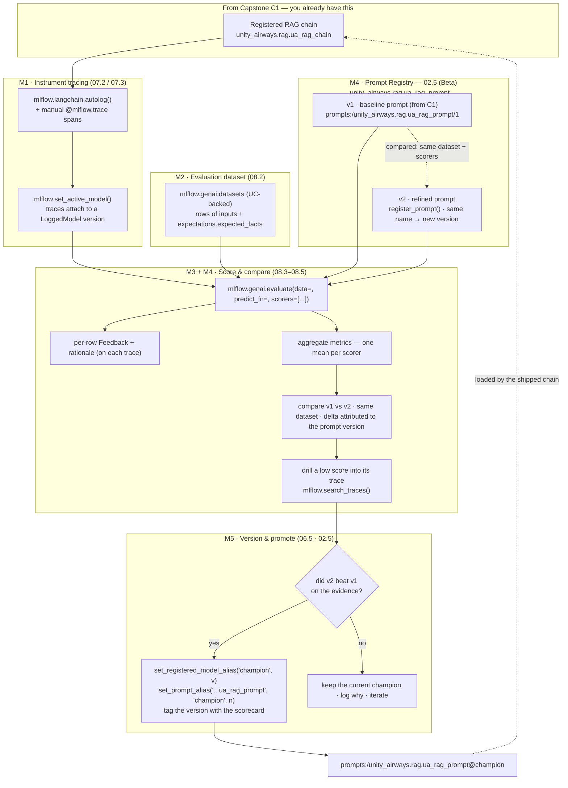
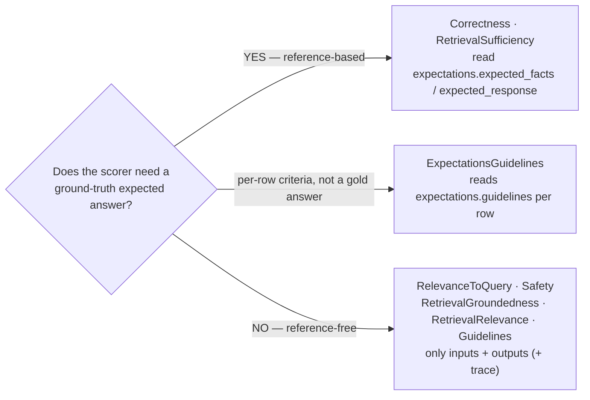

# Evaluate, Trace & Version the RAG App  ·  Capstone C2  ·  Build after P2 (Module 08)  ·  [Project]

> **Where this sits in the roadmap:** Capstone **C2**, built after Phase **P2** (Level 3, end of **Module 08**). Prerequisites: Modules **06–08 ✅** and the RAG chain you registered in **Capstone C1**. Next stop: **C3** (ship a governed, monitored agent).
> **What it extends:** C1 left you with a working, registered RAG chain — `unity_airways.rag.ua_rag_chain`. C2 does **not** rebuild that chain. It adds the MLOps rigor around it: tracing, evaluation, version comparison, and a defensible promotion. You finish with evidence, not vibes.

---

## 1. The scenario

The Unity Airways support bot works in a demo. A passenger asks *"Can I get a refund on a Basic Economy fare?"* and it answers. Nice.

Then your lead asks two questions you cannot answer yet:

- **Is it actually *good*?** Not "did it reply" — is the answer correct, grounded in real Unity Airways policy, on-topic, and safe? Across the *whole* set of questions people ask, not the one you cherry-picked for the demo?
- **Did the last change make it better or worse?** Someone bumped retrieval `k` from 3 to 5 last week. Did groundedness go up, or did you just add latency and hope?

Right now the honest answer to both is "I don't know." That is the gap C2 closes. Unity Airways is about to put this bot in front of customers making refund and rebooking decisions, and "looks fine to me" is not something you can stand behind in a promotion review. Before anything ships, you need a repeatable way to measure quality, attribute every score to a specific version, and prove that the build you promote beat the one before it.

---

## 2. What you'll build

**Objective:** turn the C1 chain into a **measured, versioned** asset with a promotion trail.

**Target:** by the end you will have produced, all pinned to the Unity Airways chain —

- a **trace-instrumented** chain (every request emits a full trace, attributed to a LoggedModel version),
- an **evaluation dataset** of Unity Airways Q&A with ground-truth `expected_facts`,
- a **scorer suite** that mixes ground-truth and reference-free scorers plus one custom code metric,
- a **version comparison** — two registered **prompt versions** (v1 vs v2 of `unity_airways.rag.ua_rag_prompt`) on the same dataset, one variable changed,
- a quality **scorecard** attached to the winning version, and
- a promoted **`ua_rag_chain@champion`** in Unity Catalog you can roll back in one line.

**The "version" you compare is a prompt version.** The two builds are two registered versions of one prompt — `unity_airways.rag.ua_rag_prompt`. **v1** is the safe baseline you registered in C1, and the chain already loads it by URI; **v2** is a single refined edit registered under the *same name*, so it becomes a new version rather than a new prompt. Both run against the **same** dataset with the **same** scorers, so the score delta is attributable to the prompt change alone — the difference between "we edited the prompt" and "the edit lifted groundedness by X on refund rows."

The through-line: Module 05 *built* the chain, Module 07 made it *observable*, Module 06 gave it a *version*, and Module 08 makes every change **decidable**. C2 is where those four wire together on one artifact.

---

## 3. Prerequisites

- **Modules 06–08 ✅** — MLflow 3 core (Experiments, Runs, LoggedModel, UC registry), tracing, and the evaluation stack. C2 assumes you can already run each piece; it asks you to assemble them.
- **The C1 chain registered** as `unity_airways.rag.ua_rag_chain` in Unity Catalog (`CATALOG="unity_airways"`, `SCHEMA="rag"`), loadable via `models:/...@champion` or a pinned version.
- **The C1 prompt registered** as `unity_airways.rag.ua_rag_prompt` (v1) in the MLflow Prompt Registry, loaded by the chain via `prompts:/unity_airways.rag.ua_rag_prompt/1`. C2 adds **v2** on top of it. The Prompt Registry is **Beta** on Databricks — `mlflow[databricks]>=3.1.0` and a UC schema.
- **MLflow ≥ 3.1** (`mlflow[databricks]`). Use **≥ 3.4** if you build a custom judge with `make_judge()`.
- **Compute + access:** serverless or a DBR ML runtime; UC rights to create a dataset and a model version in `unity_airways.rag`; a judge LLM endpoint (e.g. `databricks-claude-sonnet-4-5`).

> 📌 **IMPORTANT:** This is a **project brief**, not a lesson. The APIs live in the Module 06–08 explainers. C2 grades whether you can put them together into a promotion decision that holds up.

---

## 4. 🗺️ Target architecture

The end-to-end pipeline: take the C1 chain, instrument it, score it against a labeled dataset, compare two versions, diagnose the loser, and promote the winner behind a `@champion` alias.



*Takeaway: the dataset and the instrumented chain feed one `mlflow.genai.evaluate` call; the aggregates tell you which **prompt version** to prefer, the traces tell you why, and the `@champion` aliases — on the model and on the prompt — are the movable pointers serving reads.*

**The decision that shapes the scorer suite (M3)** — which scorers need a labeled answer:



*Takeaway: this fork decides which rows need labels. Reference-free scorers run on every row (and on live production traffic later); reference-based scorers only score rows that carry `expectations`.*

---

## 5. Milestones

Five milestones, each with acceptance criteria you can check. They map onto the architecture left to right.

### M1 — Instrument tracing  ·  (07.2 / 07.3)

Make every request observable and pin it to a version.

- Turn on `mlflow.langchain.autolog()`; add manual `@mlflow.trace` (function) or `mlflow.start_span(...)` (block) spans for any custom pre/post steps the autologger can't see.
- Ensure retrieval emits a `SpanType.RETRIEVER` span that outputs `mlflow.entities.Document` objects, not a raw JSON blob.
- Call `mlflow.set_active_model(name="ua_rag_chain_v1")` before you run, so traces bind to a LoggedModel version.

**Acceptance criteria:**
- One `chain.invoke(...)` produces a **single trace** with nested retriever / prompt / LLM spans.
- Retrieved docs render **as documents** in the trace (this is what lets retrieval scorers read context in M3).
- Traces are attributed to a LoggedModel version and are findable with `mlflow.search_traces(...)`.

### M2 — Build an evaluation dataset  ·  (08.2)

Assemble a dataset you can trust, from three sources: replayed C1 traces (real questions), expert-labeled policy answers (the gold standard), and hand-written edge cases (ambiguous, multi-part, conflicting-policy).

- Create it UC-backed with `mlflow.genai.datasets.create_dataset(name=f"{CATALOG}.{SCHEMA}.eval_dataset")` and grow it with `merge_records([...])`.
- Every row carries `inputs`. The reference rows carry `expectations.expected_facts` (or `expected_response`).

**Acceptance criteria:**
- `get_dataset(...)` returns a **versioned** dataset visible in Unity Catalog.
- ~20–40 Unity Airways Q&A rows spanning refund, rebooking, baggage, and fare-rules intents, across easy/hard difficulty.
- The refund / fare-rules rows have `expected_facts`; some rows are deliberately **unlabeled** (to prove reference-free scorers still run on them).

### M3 — Assemble the scorer suite  ·  (08.3 / 08.4)

Build one explicit `scorers=[...]` list that covers the quality dimensions and demonstrates the ground-truth split. Pin the judge `model=` for stable, comparable runs.

- **Ground-truth (reference-based):** `Correctness`, `RetrievalSufficiency` — both read `expectations.expected_facts` / `expected_response`.
- **Reference-free:** `RelevanceToQuery`, `RetrievalGroundedness`, `RetrievalRelevance`, `Safety`.
- **A `Guidelines` judge** — a global plain-English rule (professional Unity Airways support tone, no invented policy).
- **One `@scorer` code metric** — deterministic, no tokens: e.g. citation-present or a response-length band, returning `Feedback(value, rationale)`.

**Acceptance criteria:**
- The suite runs through `mlflow.genai.evaluate(...)`; every applicable scorer writes a per-row `Feedback` with a rationale.
- The ground-truth scorers **only score labeled rows** — the unlabeled rows are skipped for `Correctness` / `RetrievalSufficiency`. That skip is the visible proof of the requirement.
- The `@scorer` returns a numeric value + rationale and shows up as a per-row column.

### M4 — Register a refined prompt v2, evaluate v1 vs v2 & compare; diagnose a regression  ·  (08.5 · 02.5)

The one variable you move is the **prompt version**. Register a refined **v2** of `unity_airways.rag.ua_rag_prompt` with `mlflow.genai.register_prompt(name="unity_airways.rag.ua_rag_prompt", template=...)` — the **same name** means a new version, not a new prompt — keeping the `{{context}}` / `{{question}}` variables. Load v1 and v2 by URI (`mlflow.genai.load_prompt("prompts:/unity_airways.rag.ua_rag_prompt/1")` vs `.../2`), then evaluate both against the **same** dataset version with the **same** scorers. (The Prompt Registry is **Beta** on Databricks — `mlflow[databricks]>=3.1.0`, a UC schema.)

- Register the refined prompt under the same name (new version); write a `commit_message` that states the one intentional change (e.g. "require fare type before any refund-eligibility statement").
- Load each version by pinned URI and build the chain around it, so the only thing that differs between runs is the prompt version.
- Run each version in a named, tagged run (`mlflow.set_tag("prompt_version", "1")` / `"2"`), pinning the dataset version so only the prompt moves.
- Build a side-by-side metric table (v1 vs v2, one row per scorer).
- When a metric moves the wrong way, open the **traces that flipped** with `mlflow.search_traces(...)` and localize the fault to a span.

**Acceptance criteria:**
- **Two comparable eval runs**, each pinned to a specific prompt version (`prompts:/unity_airways.rag.ua_rag_prompt/1` vs `/2`), tagged, and run on one dataset version.
- A **v1 vs v2 comparison table** of aggregate metrics, with the score delta **attributed to the prompt version** — nothing else changed.
- At least **one regression diagnosed through a trace** — e.g. "v2 tightened refund wording but the retriever still pulled a baggage chunk on this refund row," named down to the span, not argued from the aggregate alone.

### M5 — Register the winner, set `@champion` (model **and** prompt), write a scorecard  ·  (06.5 · 02.5)

Turn the evidence into a governed promotion — on **both** movable pointers.

- Register the winning build as a new UC version (or reuse its LoggedModel), then `client.set_registered_model_alias(UC_MODEL, "champion", version)`.
- Promote the **winning prompt version** alongside it: `mlflow.genai.set_prompt_alias("unity_airways.rag.ua_rag_prompt", "champion", version=<n>)`. The shipped chain then loads `prompts:/unity_airways.rag.ua_rag_prompt@champion` — no hard-coded version number, so promoting or rolling back the prompt is a one-line pointer move, not a redeploy.
- Write the **scorecard** as version tags: the eval scores, the eval **dataset version**, the **winning prompt version**, the approver, and a change ticket.

**Acceptance criteria:**
- `mlflow.langchain.load_model("models:/unity_airways.rag.ua_rag_chain@champion")` loads the **winner**, and that chain loads its prompt by alias — `prompts:/unity_airways.rag.ua_rag_prompt@champion` — not a pinned number or an inline string.
- The version carries scorecard tags (e.g. `eval_correctness`, `eval_groundedness`, `eval_safety`, `dataset_version`, `prompt_version`, `approver`, `change_ticket`).
- A **one-line rollback** is demonstrable on either pointer: repoint the model or prompt alias to the previous version, no redeploy, and every `@champion` consumer follows.

---

## 6. The scorer suite — the ground-truth vs reference-free split (load-bearing)

M3 lives or dies on this table. Get it wrong and either your `Correctness` scores are meaningless (no labels to compare against) or you waste labeling effort on scorers that never read a label. Verified against the Module 08.4 explainer and the Databricks built-in-judges reference.

| Scorer (`mlflow.genai.scorers`) | Reads | Needs ground truth? | Decides |
|---|---|---|---|
| `RelevanceToQuery` | `inputs`, `outputs` | **No** — reference-free | Does the answer address the question? |
| `Safety` | `inputs`, `outputs` | **No** — reference-free | Toxic / harmful / PII-leaking content? |
| `RetrievalGroundedness` | `inputs`, `outputs`, trace | **No** — reference-free | Is the answer supported by retrieved context? |
| `RetrievalRelevance` | `inputs`, `outputs`, trace | **No** — reference-free | Are the retrieved docs relevant to the request? |
| `Guidelines` | `inputs`, `outputs` + global rule | **No** — reference-free | Does the answer meet a plain-English rule? |
| `ExpectationsGuidelines` | `inputs`, `outputs`, `expectations.guidelines` | **No factual answer**, but needs **per-row guidelines** | Does the answer meet this row's specific rule? |
| `Correctness` | `inputs`, `outputs`, `expectations` | **Yes** — `expected_facts` / `expected_response` | Is the answer factually right vs. the label? |
| `RetrievalSufficiency` | `inputs`, `outputs`, `expectations`, trace | **Yes** — `expected_facts` / `expected_response` | Did retrieval fetch **enough** to produce the expected facts? |

Three buckets to carry in your head:

- **Reference-free (no labels):** `RelevanceToQuery`, `Safety`, `RetrievalGroundedness`, `RetrievalRelevance`, plain `Guidelines`. Run these on any row and on live production traffic.
- **Needs per-row criteria (not a gold answer):** `ExpectationsGuidelines`.
- **Needs a ground-truth answer:** `Correctness` **and** `RetrievalSufficiency`.

> ⚠️ **GOTCHA:** `RetrievalSufficiency` is the one people misfile. It is **reference-based** — it checks whether retrieval fetched enough to support the *expected* facts, so it needs `expected_facts` / `expected_response` just like `Correctness`. Treat "needs the `expectations` field" (three scorers, counting `ExpectationsGuidelines`) and "needs a factual gold answer" (two scorers) as related-but-different tests.

Illustrative shape of the harness call (the runnable notebook comes later):

```python
import mlflow
from mlflow.genai.scorers import (
    Correctness, RetrievalSufficiency,          # reference-based — need expectations
    RelevanceToQuery, RetrievalGroundedness,    # reference-free
    RetrievalRelevance, Safety, Guidelines,     # reference-free
    scorer,
)
from mlflow.entities import Feedback

eval_model = "databricks:/databricks-claude-sonnet-4-5"   # pin the judge LLM

@scorer(name="cites_policy")                              # deterministic code metric — no tokens
def cites_policy(outputs) -> Feedback:
    text = outputs if isinstance(outputs, str) else outputs.get("response", "")
    hit = any(k in str(text) for k in ("Fare Rules", "§", "policy"))
    return Feedback(value=1.0 if hit else 0.0,
                    rationale="cites a policy reference" if hit else "no policy citation")

ua_scorers = [
    RelevanceToQuery(model=eval_model),
    RetrievalGroundedness(model=eval_model),
    RetrievalRelevance(model=eval_model),
    Safety(model=eval_model),
    Guidelines(name="professional_tone",
               guidelines="Professional, courteous Unity Airways support tone; no invented policy.",
               model=eval_model),
    Correctness(model=eval_model),          # scores only rows with expectations
    RetrievalSufficiency(model=eval_model), # scores only rows with expectations
    cites_policy,
]

results = mlflow.genai.evaluate(
    data=eval_dataset,             # rows of inputs / (expectations)
    predict_fn=rag_chain_predict_fn,
    scorers=ua_scorers,            # explicit — MLflow 3.x auto-selects nothing
)
```

> 📌 **IMPORTANT:** The entry point is `mlflow.genai.evaluate(data=, predict_fn=, scorers=[...])` with an **explicit** scorer list. Do **not** use `mlflow.evaluate(model_type="databricks-agent")` (the deprecated MLflow-2 path) or an imagined `agents.evaluate()` (never existed). Agents get evaluated with this same call.

---

## 7. Deliverables

| # | Deliverable | Done when |
|---|---|---|
| D1 | **Evaluation dataset** | UC-backed, versioned `unity_airways.rag.eval_dataset` with labeled and unlabeled rows across intents |
| D2 | **Scorer suite** | one explicit `scorers=[...]` list mixing reference-based, reference-free, a `Guidelines` judge, and one `@scorer` |
| D3 | **Comparison table** | v1 vs v2 aggregate metrics, one row per scorer, same dataset version; the one variable changed is the **prompt version** (`prompts:/unity_airways.rag.ua_rag_prompt/1` vs `/2`) |
| D4 | **Quality scorecard** | eval scores + dataset version + approver + change ticket attached as tags to the promoted version |
| D5 | **`ua_rag_chain@champion`** + prompt **`@champion`** | the winning model version promoted via the alias **and** the winning prompt promoted with `prompts:/unity_airways.rag.ua_rag_prompt@champion`; both loadable and rollback-able in one line |

---

## 8. Grading rubric

| Criterion | Not yet | Meets | Exceeds |
|---|---|---|---|
| **Dataset quality & coverage** | A handful of happy-path rows, no labels, one intent | ~20–40 rows across the main intents; refund/fare rows have `expected_facts`; some rows unlabeled | Difficulty bands, curated edge cases (ambiguous, multi-part, conflicting policy), sourced partly from replayed traces; versioned with lineage |
| **Ground-truth vs reference-free scorer choice** | Calls `Correctness` with no `expectations`, or hand-labels rows for `Safety`; misfiles `RetrievalSufficiency` as reference-free | Correct split applied: `Correctness` + `RetrievalSufficiency` on labeled rows only; reference-free scorers on all rows | Split is structural in code (two lists), judge `model=` pinned, and the reference-free set is explicitly the one reused for production monitoring |
| **Trace-driven diagnosis** | Argues from aggregates only ("groundedness dropped, must be the model") | Opens the flipped traces and names the failing span for at least one regression | Ties the fault to a specific chunk/retrieval decision, adds it to a persisted failure table, and proposes the targeted fix (retriever vs prompt) |
| **Defensible promotion decision** | Promotes on vibes, or changes two variables at once | One variable changed, same dataset version, tagged runs; promotes the winner with a stated reason | Promotion states a hypothesis proved out ("k=5 lifted groundedness on refund rows, latency flat"), with stop-the-line thresholds (safety/schema) checked before promoting |
| **Prompt versioning discipline** (02.5) | Prompt hard-coded in the chain / notebook; "v2" is an untracked edit, not a registry version | Refined prompt registered as a new version of `unity_airways.rag.ua_rag_prompt` (same name); v1 vs v2 compared on the same dataset; winner promoted with a `@champion` alias | Chain loads the prompt **only** by `prompts:/unity_airways.rag.ua_rag_prompt@champion`; the eval delta is explicitly attributed to the prompt version; rollback is a one-line alias move with the previous version noted |
| **Reproducibility** | No pinned versions; scores can't be reproduced | Dataset version, model version, and scorer definitions all pinned; runs tagged | Scorecard tags capture the full provenance (dataset version, approver, ticket) so a future incident review answers "which version, who approved, and why" from the registry alone |

---

## 9. Stretch goals

- **Human-in-the-loop labeling (08.6).** Stand up a Labeling Session with a label schema, push the traces that scored low (or got a thumbs-down) into a Review App, and let a policy owner label them. Their `expected_response` labels become fresh ground truth for the next `Correctness` run.
- **Metric calibration vs human labels (08.8).** Take a slice of human-labeled traces, run `RetrievalGroundedness` on the same traces, and measure judge-vs-human agreement. If they diverge, tighten the rubric, pin/swap the judge model, or move the threshold before you gate a release on that judge's number.
- **Traditional metrics comparison (08.10).** Add ROUGE / BLEU / exact-match as cheap first-pass filters (`mlflow.log_metric(...)`), then show a case where a high overlap score sits on a **hallucinated** answer, so it's clear why n-gram metrics are never the promotion gate for a policy-answering RAG app.

---

## 10. How this maps to the certification

| Exam domain | What C2 exercises | Modules |
|---|---|---|
| **Evaluation** (Domain 5 / 7 — Monitoring & evaluation) | `mlflow.genai.evaluate` with explicit `scorers`; the `inputs`/`outputs`/`expectations` schema; which judges need ground truth; scoring the trace; NLG metrics vs LLM judges | 08.1–08.4, 08.7, 08.10 |
| **Governance / Monitoring** | UC aliases + tags (not stages) as the lifecycle; **prompt versioning + a `@champion` alias in the Prompt Registry**; the scorecard as an audit trail; the same scorers reused for production monitoring | 06.5, **02.5**, and forward to Module 13 |
| **MLOps** | LoggedModel + `set_active_model`; tracing as the evidence layer; evidence-driven promotion (one variable, pinned versions, tagged runs); rollback by repointing the alias | 06, 07, 08.5, 08.9 |

The single highest-value fact this project drills: MLflow 3 evaluation is `mlflow.genai.evaluate(data=, predict_fn=, scorers=[...])` with an explicit list, `Correctness` and `RetrievalSufficiency` are the two reference-based built-ins, and UC promotion is an **alias**, never a stage. The prompt that drives the chain is governed the same way — a versioned UC asset promoted by `prompts:/unity_airways.rag.ua_rag_prompt@champion` (Module 02.5).

---

## 📝 Notes

- _Space for your own notes as you work through the capstone._
- Design the `predict_fn` and the dataset schema together, on paper, before running anything. The most common failure is an eval run that finishes with **zero traces** because the row schema doesn't match what `predict_fn` expects. Validate one row locally first.
- Keep the seed dataset small on purpose so it's cheap to run after every change; grow it as feedback arrives.

**Self-check (5 questions)**
1. Write the MLflow 3 evaluation call for the Unity Airways chain with all its arguments, and name the two paths you must **not** use instead.
2. Which two built-in scorers are reference-based, and what field must each labeled row carry? Which retrieval scorer do people wrongly file as reference-free?
3. In M4, you compare v1 and v2. What is the one rule that keeps the comparison fair, and what tool do you use to diagnose the single row that flipped?
4. In M5, how do you express "this version is live," and how do you roll back without a redeploy or a client change?
5. What five things belong on the quality scorecard so a future incident review can answer "which version, who approved it, and why" from the registry alone?

---

## Sources

- 🧭 **Module 08 — Evaluating GenAI applications** (`modules/08-evaluating-genai/module.md`, `eval-harness.md`, `llm-as-judge.md`): the Evaluation Harness `mlflow.genai.evaluate(data=, predict_fn=, scorers=[...])`; the four building blocks (datasets, scorers, runs, feedback); the dataset schema (`inputs`/`outputs`/`expectations`) and reserved keys (`expected_facts`/`expected_response`/`guidelines`/`expected_retrieved_context`) via `mlflow.genai.datasets`; code scorers (`@scorer` → `Feedback`); the built-in judges and the ground-truth split (`Correctness` + `RetrievalSufficiency` reference-based; `RelevanceToQuery`/`Safety`/`RetrievalGroundedness`/`RetrievalRelevance`/`Guidelines` reference-free; `ExpectationsGuidelines` needs per-row guidelines); run comparison, trace-driven diagnosis, and the evidence-driven / MEP discipline.
- 🧭 **Module 07 — MLflow tracing** (`modules/07-mlflow-tracing/tracing.md`): `mlflow.langchain.autolog()`; manual `@mlflow.trace` and `mlflow.start_span(...)`; the `SpanType.RETRIEVER` schema and `mlflow.entities.Document`; `mlflow.set_active_model(...)` binding traces to a LoggedModel version; `mlflow.search_traces(...)` for diagnosis.
- 🧭 **Module 06 — MLflow for GenAI core** (`modules/06-mlflow-core/uc-model-registry.md`, `mlflow-2-to-3.md`): three-level UC registration (`mlflow.set_registry_uri("databricks-uc")` → `mlflow.register_model` → `catalog.schema.model`); `set_registered_model_alias`, `set_model_version_tag`, `set_registered_model_tag`; aliases + tags **replace deprecated stages**; load by `models:/name@champion`; rollback by repointing the alias.
- 🧭 **Module 02 — Prompt engineering** (`modules/02-prompt-engineering/prompt-registry.md`, ★02.5): the MLflow Prompt Registry SDK — `mlflow.genai.register_prompt` / `load_prompt` / `set_prompt_alias` / `search_prompts`; immutable versions vs mutable aliases; URIs `prompts:/unity_airways.rag.ua_rag_prompt/<version>` and `prompts:/unity_airways.rag.ua_rag_prompt@champion`; `{{context}}` / `{{question}}` template variables; **Beta on Databricks** (`mlflow[databricks]>=3.1.0`, UC schema).
- 🧭 Naming cross-check: `.claude/skills/genai-teacher/references/naming-conventions.md` §1 (MLflow 3 GenAI surface: `mlflow.genai.evaluate` with explicit `scorers`; scorer names; `inputs`/`outputs`/`expectations`; LoggedModel + `set_active_model`; UC registration; `@mlflow.trace`/`autolog`) and §9 (no `agents.evaluate()`; no `mlflow.evaluate(model_type=...)`; MLflow-2 judge names are legacy).
- 📘 B1 — *Practical MLflow for Generative AI on Databricks*, Ch 2 (evidence-driven development, MEP), Ch 5 (tracing), Ch 6 (evaluation) — via the Module 06–08 explainers above. *(O'Reilly Early Release, RAW & UNEDITED; APIs cross-checked against current MLflow + Databricks docs.)*
- 📗 B2 — *Databricks Certified Generative AI Engineer Associate Study Guide*, Ch 6 (registry/aliases/tags), Ch 8 (evaluation, ground-truth judges, RAG dimensions, NLG metrics) — via the Module 06 and 08 explainers.
