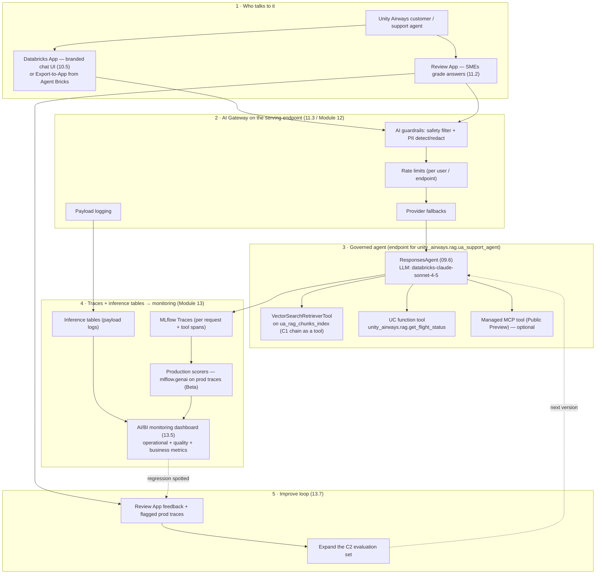
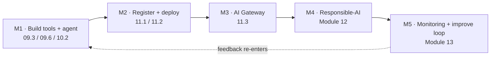

# Ship a Governed, Monitored Agent  ·  Capstone C3  ·  Build after P4 (Module 13)  ·  [Project]

> **You are here:** End of **Level 5 / Module 13 (Phase P4)**. This capstone deliberately spans **P3 (build the agent)** and **P4 (deploy, govern, monitor)** so the Unity Airways assistant actually ships — a real serving endpoint behind guardrails, with a monitoring dashboard and a feedback loop, not another notebook demo.
> **Prerequisites:** Modules **09–13 ✅** (built on 03–08); **C1** — the registered RAG chain and the AI Search index `unity_airways.rag.ua_rag_chunks_index`; **C2** — the evaluated, versioned chain with a `@champion` alias in Unity Catalog and a quality scorecard; workspace **agent + Model Serving entitlements**.
> **What this is:** a **project brief**, not a lesson. It gives you a scenario, a target architecture, five milestones with acceptance criteria, deliverables, and a grading rubric. The runnable notebook ships once P4 is built.

## The scenario

Unity Airways already has a policy Q&A bot — the RAG chain you built in C1 and hardened in C2. It answers "what is the Basic Economy refund rule?" from the policy documents, with citations. Support leadership now wants more:

- **One assistant, two kinds of question.** Customers do not separate "policy" from "operations." In one breath they ask *"My flight UA118 tonight — is it delayed, and if it's cancelled can I get a refund?"* That needs a **document lookup** (refund policy) **and** a **live record lookup** (flight status) chosen turn by turn — a tool-using **agent**, not a fixed chain.
- **Safe enough to put in front of customers.** No leaked PII, no unsafe replies, no runaway spend, and a hard cap on request rate. Legal and the security review will ask exactly this.
- **Observable in production.** When answer quality slips or latency spikes, the team should see it on a dashboard the same day — not hear it from an angry customer a week later.
- **A way to keep improving.** Real questions the assistant fumbles should flow back into the evaluation set so the next version is measurably better.

So the job is to turn the C1/C2 knowledge base into a **governed, monitored, tool-using agent** — and ship it.

## What you'll build

Pick **one** of two paths to the same governed outcome (both are graded on the same rubric):

- **Path A — custom `ResponsesAgent` (the code path).** A tool-using agent authored on **`ResponsesAgent`** (from `mlflow.pyfunc`) that wraps the C1 RAG chain as a **retriever tool**, adds a **`get_flight_status` UC-function tool**, and optionally a **managed MCP tool**. Register to Unity Catalog as `unity_airways.rag.ua_support_agent`, deploy with `agents.deploy(...)`, then put it behind **AI Gateway** and stand up monitoring.
- **Path B — low-code (Agent Bricks + a Databricks App).** An **Agent Bricks Knowledge Assistant** over the same documents/index, optionally routed by a **Multi-Agent Supervisor** that also reaches a Genie Agent for flight-status questions, fronted by a **Databricks App** for the support team. Same governance and monitoring requirements apply.

Both paths end at the same place: a **governed serving endpoint behind AI Gateway guardrails, with a monitoring dashboard and a Review App feedback loop.**

> 📌 **IMPORTANT:** This capstone **extends C1/C2 — it does not rebuild them.** The RAG retrieval and the evaluation harness already exist. Here you wrap the chain as one tool inside a larger agent, add a second (structured) tool, then spend most of your effort on **deploy → govern → monitor**, which is the part a POC usually skips and a production system cannot.

## Prerequisites (check before you start)

| Need | From | Verify |
|---|---|---|
| AI Search index `unity_airways.rag.ua_rag_chunks_index` | C1 (Modules 04–05) | Index shows **online** in the AI Search UI |
| A registered, evaluated RAG chain with `@champion` + a scorecard | C2 (Modules 06–08) | `models:/unity_airways.rag.ua_rag_chain@champion` loads; C2 scorecard on hand |
| An operational flight-status table + a UC function over it | Module 09.3 | `unity_airways.rag.get_flight_status(...)` returns a row via `execute_function` |
| `ResponsesAgent` authoring + Model-as-Code packaging | Module 09.6 | You can log `agent.py` with `resources=[...]` and pass `mlflow.models.predict` |
| Deploy / serving / gateway / monitoring topics | Modules 11–13 | See the **verify note** below — these are the P4 modules |
| Agent + Model Serving entitlements; rights on `unity_airways.rag` | Workspace admin | `USE CATALOG` + `USE SCHEMA` + `CREATE MODEL`; can create a serving endpoint |

## 🗺️ Target architecture

The whole system in one picture: a user talks to a UI, every request passes through **AI Gateway** on the serving endpoint, the **`ResponsesAgent`** reasons and calls its tools, and every call is captured as traces and inference-table rows that feed a monitoring dashboard and production scorers. Mirrored in the HTML explainer.



*Takeaway: the agent is the brain, but the graded work is the ring around it — the gateway that keeps it safe, the tables that make it observable, and the loop that makes it better.*

> ⚠️ **GOTCHA — Modules 11–13 are the P4 build; APIs are described at altitude here.** Milestones **M1–M2** rest on Modules 09–10, which are **built and approved**, so their APIs are exact. Milestones **M3 (AI Gateway), M4 (responsible-AI), and M5 (monitoring)** live in Modules **11.3, 12, and 13** — **not yet authored**. This brief names the controls and cites `naming-conventions.md` §6 (AI Gateway) plus the ROADMAP topic list, but it **does not invent** gateway/guardrail/monitoring function or parameter names. Treat every M3–M5 API as **"confirm in the P4 module / current docs"**; the runnable notebook lands with those modules.

## Milestones & acceptance criteria

Five milestones carry you across the P3→P4 line. Each has a concrete **done** test.

### M1 — Build the tools and assemble the agent  ·  [P3]  ·  09.3 / 09.6 / 10.2
- **Path A:** build (or reuse) the three-part tool set — the **`VectorSearchRetrieverTool`** over `unity_airways.rag.ua_rag_chunks_index` (the C1 chain, now a tool), the **`get_flight_status`** UC function wrapped with `UCFunctionToolkit`, and optionally a managed MCP tool. Assemble them into a **`ResponsesAgent`** in `agent.py` ending in `mlflow.models.set_model(...)`.
- **Path B:** stand up an **Agent Bricks Knowledge Assistant** over the same index/docs, and (optionally) a **Multi-Agent Supervisor** routing policy questions to the KA and flight-status questions to a Genie Agent.
- **Acceptance:** `predict()` (or the KA chat) answers a **policy** question *and* a **flight-status** question correctly; the **MLflow trace** shows the right tool firing for each; for Path A the `resources=[DatabricksServingEndpoint, DatabricksVectorSearchIndex, DatabricksFunction]` list names every service the agent reaches, and `mlflow.models.predict(..., env_manager="uv")` passes.

```python
# Path A — package the tool-using agent (grounded in Module 09.6, built & approved)
import mlflow
from mlflow.models.resources import (
    DatabricksServingEndpoint, DatabricksVectorSearchIndex, DatabricksFunction,
)
with mlflow.start_run():
    logged_agent = mlflow.pyfunc.log_model(
        python_model="agent.py",           # ResponsesAgent, Model-as-Code
        name="agent",
        resources=[
            DatabricksServingEndpoint(endpoint_name="databricks-claude-sonnet-4-5"),
            DatabricksVectorSearchIndex(index_name="unity_airways.rag.ua_rag_chunks_index"),
            DatabricksFunction(function_name="unity_airways.rag.get_flight_status"),
        ],
        pip_requirements=["mlflow", "databricks-langchain", "langgraph"],
    )
```

### M2 — Register and deploy  ·  [P3→P4]  ·  11.1 / 11.2
- Register the agent to Unity Catalog as **`unity_airways.rag.ua_support_agent`** and set a **`@champion`** alias (the same alias mechanic you used for the chain in C2 / 06.5).
- Deploy with **`agents.deploy(...)`** → a Model Serving endpoint **+ a Review App + a feedback model**, with tracing and inference tables enabled. (Path B: publish the KA/Supervisor and wrap it in a **Databricks App**, 10.5.)
- **Acceptance:** the endpoint reaches **Ready** and answers a smoke query with the same answer `predict()` gave; the **Review App URL** is live and an SME can leave a rating; `@champion` points at the deployed version.

```python
# M2 — register + deploy (grounded in 09.6 / 06.5; agents.deploy is the 11.1/11.2 topic)
from mlflow import MlflowClient
from databricks import agents

mlflow.set_registry_uri("databricks-uc")
UC_MODEL = "unity_airways.rag.ua_support_agent"
registered = mlflow.register_model(logged_agent.model_uri, UC_MODEL)
MlflowClient().set_registered_model_alias(UC_MODEL, "champion", registered.version)
agents.deploy(UC_MODEL, registered.version)   # → serving endpoint + Review App + feedback model
```

### M3 — Put it behind AI Gateway  ·  [P4]  ·  11.3
- Enable **AI Gateway** on the endpoint and configure the four controls: **guardrails** (safety), **rate limits**, **provider fallbacks**, and **usage + payload logging** to inference tables.
- **Acceptance:** requests past the configured quota are rejected (rate limit enforced); payload logging is writing an **inference table**; a **fallback** provider is configured and documented; the gateway config is captured as a deliverable.
- **Verify note:** AI Gateway control set is named in `naming-conventions.md` §6; the **exact config surface (UI vs API) and parameter names are covered in Module 11.3** — confirm there / in current docs before wiring. Do not assume a specific gateway API from this brief.

### M4 — Responsible-AI controls  ·  [P4]  ·  Module 12
- Turn on **AI guardrails** (safety filtering) and **PII detection/redaction**, add **input validation**, and run the agent as a **least-privilege service principal** (deploy-as-SP) with only `EXECUTE` on the model plus the scoped grants it needs.
- **Acceptance:** an unsafe or PII-bearing prompt is **blocked or redacted** (not passed through); the endpoint runs as an **SP identity**, not a person; a short **responsible-AI checklist** (guardrails on, PII handling, data classification, audit trail) is filled in.
- **Verify note:** guardrails/PII (§6 marks PII detection/redaction **Preview**) and service-principal + UC-grant mechanics are **Module 12** topics (12.1–12.3, 12.8). Confirm exact toggles and grant syntax there; this brief states the requirement, not the API.

### M5 — Production monitoring + the improve loop  ·  [P4]  ·  Module 13
- Stand up production monitoring: **inference tables** feeding an **AI/BI monitoring dashboard** with three metric families — **operational** (latency p50/p95, request volume, error rate), **quality** (production **scorers** from `mlflow.genai` run on live traces), and **business** (e.g. deflection / resolution). Close the loop: **Review App feedback and flagged production traces expand the C2 evaluation set** (the "Improve" step).
- **Acceptance:** the dashboard renders all three metric families; a **deliberately seeded regression** (e.g. a bad prompt version) shows up as a scorer drop and/or an alert; at least a handful of production examples flow back into the eval set and re-running C2's evaluation reflects them.
- **Verify note:** production monitoring reuses the **same scorers/judges** as offline eval and is **Beta** (§1); inference tables, the AI/BI dashboard, alerts, and the improve loop are **Module 13** (13.2, 13.5, 13.6, 13.7). Confirm the monitoring config API and dashboard template in that module / current docs.



## Deliverables

Hand in all six:

1. **A deployed agent serving endpoint** (Path A) **or an App URL** (Path B) that answers policy *and* flight-status questions, plus the **Review App URL**.
2. **AI Gateway configuration** — guardrails, rate limits, provider fallbacks, and payload logging, captured as config/export or annotated screenshots.
3. **A guardrail / responsible-AI policy** — the PII and safety stance, the service-principal identity, UC grants, and a filled responsible-AI checklist.
4. **An AI/BI monitoring dashboard** showing operational + quality + business metrics over live traffic.
5. **A short reliability & safety report** (1–2 pages): uptime, p50/p95 latency, guardrail-hit rate, scorer trend vs the C2 baseline, one seeded-regression incident with the rollback (repoint `@champion`), and open risks.
6. **The updated evaluation set** — the C2 dataset grown with production examples, and the re-run scorecard.

## Grading rubric

Score each criterion. **Meets** is the bar to ship; **Exceeds** is what you show a customer.

| Criterion | Not yet | Meets | Exceeds |
|---|---|---|---|
| **Tool correctness & governance** | One tool, or the wrong tool fires; missing `resources`; two-level names | Retriever + `get_flight_status` both fire correctly; `resources=[...]` complete; three-level UC names; agent registered | Adds a managed MCP tool or Supervisor routing; tool descriptions tuned so selection is reliable across tricky mixed questions |
| **Safe deployment** | Deploys from `runs:/...`; no alias; runs as a person; no Review App | `agents.deploy()` endpoint Ready; `@champion` set on the deployed version; Review App live | Champion/Challenger rollout plan; one-line rollback demonstrated by repointing the alias; deploy-as-service-principal |
| **Guardrails effective** | No gateway; PII/unsafe content passes through; no rate limit | AI Gateway on with guardrails, rate limits, fallbacks, payload logging; a PII/unsafe prompt is blocked or redacted | Least-privilege SP, tuned guardrail policy, provider fallback tested under an induced failure, filled responsible-AI checklist |
| **Monitoring catches regressions** | No dashboard; quality invisible until a complaint | Dashboard shows operational + quality + business metrics on live traffic | A seeded regression is caught by a scorer drop and/or an alert before any user reports it; anomaly alerting wired |
| **Feedback loop closed** | Feedback goes nowhere | Review App feedback + flagged traces feed the eval set; C2 evaluation re-run | Automated improve loop; measurable quality gain vs the C2 baseline; the next version promoted on evidence |

## Stretch goals

- **Multi-agent Supervisor (10.3).** Front the agent with a **Multi-Agent Supervisor** (GA) that routes structured questions to a Genie Agent and unstructured ones to the Knowledge Assistant — one entry point, specialist agents behind it.
- **Batch `ai_query` (11.5 / 11.10).** Run the agent or a scorer over a table of historical questions with **`ai_query`** for offline quality sweeps and regression testing at scale.
- **Cost caps via Unity AI Gateway budgets.** Put a spend threshold / hard cap on the endpoint with **Unity AI Gateway** budgets. *(Unity AI Gateway — budgets and MCP-service governance — is **Beta** per §6; teach it as the direction of travel and confirm current status.)*

## How this maps to the certification

C3 is the capstone for the **production half** of the exam blueprint. It exercises four domains end to end (domain names/numbering per ROADMAP Track C — confirm the current blueprint at exam time):

| Exam domain (blueprint) | ROADMAP modules | Where C3 exercises it |
|---|---|---|
| **App development** — designing & building agents (Domains 1 & 3) | 01, 02, 05, **09**, **10** | **M1** — tools, `ResponsesAgent` / Agent Bricks, mixed-question routing |
| **Deployment & operations** (Domain 4) | **11**, 04 | **M2 / M3** — register, `agents.deploy()`, `@champion`, AI Gateway, endpoints |
| **Governance** (Domain 6) | **12** | **M4** — guardrails, PII, service-principal identity, UC grants, audit trail |
| **Monitoring & evaluation** (Domain 7) | 08, **13** | **M5** — inference tables, production scorers, dashboard, improve loop |

## 📝 Notes
- _Space for your own notes — decisions, endpoint names, gateway config, dashboard link, incident log._

**Self-check (5 questions)**
1. Which C1/C2 artifact becomes a **tool** inside this agent, and which brand-new tool joins it? Name the three `resources=[...]` entries the deployed agent needs.
2. What does `agents.deploy(...)` create beyond the serving endpoint, and how does the **Review App** differ in audience from a **Databricks App**?
3. Name the four AI Gateway controls in M3 and the one production artifact payload logging writes into.
4. In M5, what three metric families belong on the monitoring dashboard, and how does a flagged production answer make the *next* agent version better?
5. A regression hits the live agent. Give the one-line rollback, and say why callers need no change. (Hint: it is the same move you learned in 06.5 / C2.)

## Sources
- 🔗 **C1 — Unity Airways Support RAG Knowledge Base** (Modules 00–05): the AI Search index `unity_airways.rag.ua_rag_chunks_index` and the registered RAG chain this capstone wraps as a retriever tool.
- 🔗 **C2 — Evaluate, Trace & Version the RAG App** (Modules 06–08): the trace-instrumented, evaluated chain, the `@champion` alias, and the quality scorecard that becomes the monitoring baseline and the improve-loop target.
- 📄 **Module 09 explainers (built & approved)** — `modules/09-agent-fundamentals/create-tools.md` (09.3: `VectorSearchRetrieverTool`, `UCFunctionToolkit`, `unity_airways.rag.get_flight_status`, `system.ai.python_exec`) and `responsesagent.md` (09.6: `ResponsesAgent` from `mlflow.pyfunc`, Model-as-Code `set_model`, `resources=[DatabricksServingEndpoint, DatabricksVectorSearchIndex, DatabricksFunction]`, register to `unity_airways.rag.ua_support_agent`, hand off to `agents.deploy(...)`).
- 📄 **Module 10 explainers (built & approved)** — `modules/10-agent-bricks/knowledge-assistant.md` (10.2: Agent Bricks Knowledge Assistant, GA; the low-code counterpart) and `databricks-apps.md` (10.5: a Databricks App fronting the endpoint; the `agents.deploy()` Review App vs a Databricks App distinction; `agents_<catalog>-<schema>-<model>` endpoint naming).
- 🧭 **Naming cross-check** — `.claude/skills/genai-teacher/references/naming-conventions.md`: §2 (`ResponsesAgent` recommended over `ChatAgent`/`ChatModel`; `agents.deploy()` creates endpoint + Review App + feedback model; **Agent Bricks Knowledge Assistant GA / Multi-Agent Supervisor GA**; **managed MCP Public Preview**), §4 (served model `databricks-claude-sonnet-4-5`), and **§6 (AI Gateway — guardrails, rate limits, PII detection/redaction (Preview), payload logging → inference tables, fallbacks; Unity AI Gateway budgets/MCP governance is Beta)**, §1 (production monitoring reuses the same scorers/judges — Beta).
- 🗺️ **ROADMAP — Level 5 topic list (P4, not yet authored)** — Module **11** (11.1 Model Serving, 11.2 Review App, **11.3 AI Gateway**, 11.5/11.10 `ai_query`), Module **12** (12.1–12.3 guardrails/PII, 12.8 service principals), Module **13** (13.2 inference tables, 13.5 AI/BI monitoring dashboard, 13.6 alerts, 13.7 improve loop). C3 references these at altitude; **exact APIs are covered when those modules are built** — verify at authoring time.
