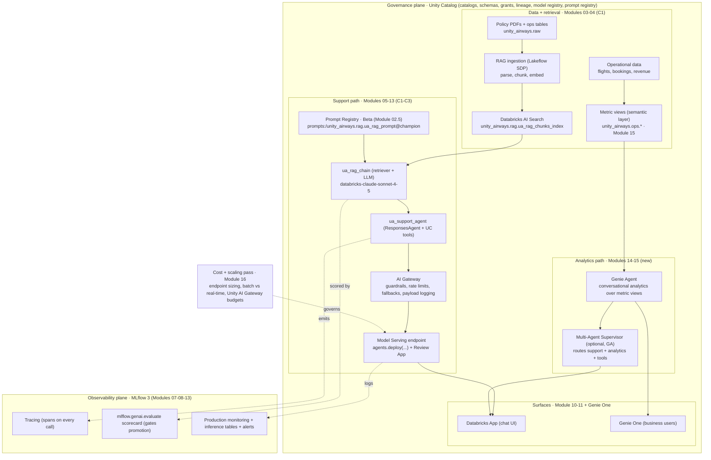

# Unity Airways GenAI Platform — End-to-End Reference Solution  ·  Capstone C4 — FINAL (★ 17.7)  ·  [Capstone]

> **You are here:** Roadmap Level 7 → **Module 17.7 (the final capstone)**. This is the last thing you build. It stitches C1–C3 into one governed platform and adds the layers the earlier capstones did not touch: Genie analytics (14), business semantics / metric views (15), cost and scaling (16), and reference architecture (17), plus cert-readiness (Track C) and FDE delivery assets (Track D).
> **Prerequisites:** **all Modules 00–17 ✅** and the artifacts from **Capstones C1, C2, and C3** (the registered `ua_rag_chain`, its eval scorecard and `@champion` version, and the deployed `ua_support_agent`). If any of those is missing, finish it first — C4 assembles them, it does not re-derive them.

## TL;DR
- **One platform, two front doors.** A support agent (RAG + tools) for customers and agents, and a self-serve analytics experience (Genie over governed metrics) for ops and finance. Both sit on the same Unity Catalog governance plane and the same MLflow 3 observability plane.
- **You assemble, you don't rebuild.** C1 gave you retrieval + a registered `ua_rag_chain`. C2 gave you tracing, evaluation, and a `@champion` version. C3 gave you the deployed, guardrailed, monitored `ua_support_agent`. C4 wires them together and adds the missing layers.
- **The new layers are analytics and architecture.** Metric views (Module 15) become the single source of truth for numbers; a Genie Agent (Module 14) answers business questions against them; a cost/performance pass (Module 16) right-sizes it; a reference architecture (Module 17) makes it defensible to a review board.
- **The deliverable is something a board can sign off on.** You hand over a running platform plus an architecture one-pager, a production-readiness checklist, a cert-domain readiness map, and a stakeholder demo script.
- **It proves you are exam-ready.** Every one of the 8 certification domains maps to a component you built. If you can walk the platform, you can pass the exam.

## The scenario

Unity Airways has three GenAI proofs-of-concept that each work on their own and none of which anyone trusts in production:

- A **support RAG chatbot** that answers fare, baggage, and refund questions from policy PDFs.
- A **support agent** that also looks up a booking and checks a flight status through tools.
- A pile of **dashboards** that ops and finance keep asking data engineering to re-slice by hand.

The architecture review board will not sign off on three disconnected demos. They want **one governed platform**:

- A **support agent** (RAG + tools) that is evaluated, deployed, monitored, and cost-managed.
- A **self-serve analytics experience** for ops and finance that answers questions like "what was on-time performance for the Denver hub last week, by aircraft type?" without a data engineer in the loop, and returns the *same* number the finance dashboard shows.
- Both governed by Unity Catalog, both observable through MLflow 3 traces and monitoring, both inside a spend budget, all presentable on one architecture one-pager.

Your job is to deliver that platform and defend it.

## What you'll build

The full reference solution, stitched from the layers you already have plus the ones this capstone adds:

- **Data + retrieval (C1, Modules 03–04):** the RAG ingestion pipeline landing chunks in Delta, embedded and served through the `ua_rag_chunks_index` on Databricks AI Search.
- **Reasoning (C1/C3, Modules 05, 09):** the registered `ua_rag_chain` and the tool-using `ua_support_agent` (a `ResponsesAgent`) that retrieves, calls UC-function tools, and answers with citations.
- **Serving + governance (C3, Modules 06, 11, 12):** the agent registered in Unity Catalog, deployed with `agents.deploy(...)`, fronted by **AI Gateway** (guardrails, rate limits, payload logging, fallbacks).
- **Observability + quality (C2, Modules 07, 08, 13):** MLflow 3 tracing on every call, an `mlflow.genai.evaluate(...)` scorecard gating promotion, and production monitoring reading inference tables.
- **Analytics (new — Modules 14, 15):** **metric views** over Unity Airways operational data as the governed semantic layer, and a **Genie Agent** that answers business questions against them.
- **Architecture, cost, and delivery (new — Modules 16, 17, Tracks C/D):** a right-sized, budgeted deployment; a reference architecture; and the FDE hand-over kit.

Delivered with three artifacts the board actually reads: an **architecture one-pager**, a **production-readiness checklist**, and a **cert-domain readiness map**.

## Prerequisites

| You need | From | Canonical name |
|---|---|---|
| Chunked policy data + retrieval index | C1 (Modules 03–04) | `unity_airways.rag.ua_rag_chunks_index` |
| Registered RAG chain with a live alias | C1/C2 (Modules 05, 06) | `unity_airways.rag.ua_rag_chain` → `@champion` |
| Trace instrumentation + eval scorecard | C2 (Modules 07, 08) | MLflow 3 traces + `mlflow.genai.evaluate` run |
| Deployed, guardrailed, monitored agent | C3 (Modules 09–13) | `unity_airways.rag.ua_support_agent` via `agents.deploy` |
| Operational data in Unity Catalog | Module 00 | `unity_airways.ops.*` (flights, bookings, revenue) |
| All Modules 00–17 marked ✅ | ROADMAP | — |

> 📌 **IMPORTANT:** C4 is the capstone at the *end* of the roadmap. It presumes the intermediate capstones are done and their artifacts exist under `unity_airways`. Reuse the exact names above so the platform is one coherent thing, not a fresh copy.

## 🗺️ Target architecture

The whole platform on one diagram: a Unity Catalog governance plane and an MLflow 3 observability plane wrapping two application paths — the support agent and the Genie analytics experience — surfaced to users through Databricks Apps and Genie One. Mirrored in the HTML explainer.

*Takeaway: the two application paths are different, but the governance plane (Unity Catalog) and the observability plane (MLflow 3) are shared. That sharing is what turns three demos into one platform.*

> The chain loads its prompt from the MLflow Prompt Registry (`prompts:/unity_airways.rag.ua_rag_prompt@champion`) — versioned and promoted like a model, never a hardcoded string. Prompt Registry is **Beta on Databricks**.

## Milestones

Five integrative milestones. Each has acceptance criteria you can check off. Work them in order; M1 is mostly assembly, M2–M4 add the new layers, M5 packages it for hand-over and the exam.

### M1 — Assemble the platform from C1–C3 [Hands-on]

Stand up the support experience end to end from the artifacts you already have: ingestion → `ua_rag_chunks_index` → `ua_rag_chain` → `ua_support_agent` → `agents.deploy` behind AI Gateway, with MLflow 3 tracing, an eval scorecard, and monitoring live. The chain and agent load their prompt from the MLflow Prompt Registry (`prompts:/unity_airways.rag.ua_rag_prompt@champion`) rather than a hardcoded string, so prompt changes are versioned and promoted the same way models are — one change-management and reproducibility story for both (Prompt Registry is **Beta on Databricks**).

**Acceptance criteria**
- The deployed `ua_support_agent` answers Unity Airways policy questions **with citations** and calls at least one UC-function tool (booking or flight-status lookup).
- The agent version is registered in Unity Catalog and promoted via the **`@champion`** alias (no run URIs in production).
- Prompts are governed via the **Prompt Registry** (`@champion` alias), versioned alongside models — the chain loads `prompts:/unity_airways.rag.ua_rag_prompt@champion`, not a hardcoded string.
- An `mlflow.genai.evaluate(...)` scorecard (Correctness, RetrievalGroundedness, Safety, at minimum) is attached to the champion version and clears your promotion threshold.
- Tracing is on for every request; **AI Gateway** guardrails, rate limits, and payload logging to inference tables are configured; a monitoring view reads those tables.

### M2 — Add the Genie analytics layer (Modules 14–15) [Hands-on]

Give ops and finance a self-serve door. Build **metric views** over Unity Airways operational data (the governed semantic layer from Module 15), then create a **Genie Agent** (Module 14) that answers business questions against those metric views. Optionally register the Genie Agent as a tool under a **Multi-Agent Supervisor** so one entry point routes both support and analytics questions.

**Acceptance criteria**
- At least two **metric views** exist under `unity_airways.ops.*` (for example on-time performance and revenue), each with measures, dimensions, and **agent metadata** (synonyms, display names) so Genie can read them (Module 15.6).
- A **Genie Agent** answers a set of ops/finance questions grounded in those metric views, and the numbers **reconcile with the metric-view definitions** — one source of truth, not a second query path.
- **Verified answers** are configured for the highest-value questions; access to the Genie Agent and its underlying data is governed by Unity Catalog grants.
- (Optional) A Multi-Agent Supervisor routes a mixed question ("why was the Denver hub delayed and what's our refund policy for delays?") across the analytics and support paths.

> ⚠️ **GOTCHA:** Modules 14–17 are not built yet in this curriculum. Treat their exact APIs, YAML keys, and UI paths here as **placeholders to confirm** when those phases land. The metric-view and Genie details in this brief are at architecture altitude, grounded in the ROADMAP topic names and `naming-conventions.md` — verify the concrete syntax against current docs before you code M2–M4.

### M3 — Cost, performance, and scaling pass (Module 16) [Theory + Hands-on]

Make the platform affordable and predictable before the board asks. Right-size the serving endpoints, decide batch vs real-time per workload, set concurrency/scaling, and put a spend budget on it.

**Acceptance criteria**
- A documented **endpoint-sizing decision** for each served workload: pay-per-token vs provisioned throughput, and why (latency target, traffic shape, cost).
- A **batch vs real-time** call per workload: interactive support goes real-time; bulk enrichment or backfills go through `ai_query(...)` batch inference.
- Measured **p50/p95 latency and cost-per-1k requests** against a target, plus autoscaling / concurrency settings that hold under a load test.
- A **budget** with alerts. Note **Unity AI Gateway** budgets and hard spend caps as the go-forward control (Beta — confirm availability).

### M4 — Reference architecture + architecture one-pager (Module 17) [Theory + Hands-on]

Turn the running system into something a review board can read and challenge. Produce the end-to-end reference architecture and a single-page diagram.

**Acceptance criteria**
- A **reference architecture** that shows the 5-phase GenAI lifecycle (Develop → Evaluate → Deploy → Monitor → Improve) as structure, with **MLflow Traces as the shared integration artifact** across support and analytics.
- The **architecture one-pager** shows both planes (governance + observability), the data → index → agent → serving → monitor flow, and the parallel Genie analytics path — on one page, legible from across a room.
- Trade-offs are written down: real-time vs batch, alias vs pinned version, provisioned vs pay-per-token, Knowledge Assistant vs custom `ResponsesAgent`, single agent vs Multi-Agent Supervisor.
- You can survive a mock **architecture-review Q&A** (governance, failure modes, cost, rollback).

### M5 — Cert-readiness + FDE delivery kit (Tracks C and D) [Theory + Hands-on]

Prove exam-readiness and package the platform for a customer hand-over.

**Acceptance criteria**
- A **cert-domain readiness map**: each of the 8 exam domains points to the concrete platform component that demonstrates it (see *Cert mapping* below); no domain is unbacked.
- The FDE delivery assets exist and are usable: **architecture one-pager**, **POC scorecard**, **production-readiness checklist** (built with the `databricks-one-pager` skill / Track D).
- A **stakeholder demo script**: a 10-minute walk that shows a support answer with citations, a Genie analytics answer that matches the dashboard, a trace, an eval scorecard, and the cost budget.
- The production-readiness checklist is all-green or every red item has a named owner and date.

## Deliverables

1. **The running platform** — deployed `ua_support_agent` behind AI Gateway, a Genie Agent over `unity_airways.ops.*` metric views, both governed and observed, inside a budget.
2. **Architecture one-pager** — the whole platform on one page, board-ready.
3. **Production-readiness checklist** — governance, security, observability, cost, rollback, and on-call, with owners.
4. **Cert-readiness map** — 8 exam domains → the component that proves each.
5. **Stakeholder demo script** — the 10-minute narrated walk-through.

## Grading rubric

Score each criterion **Not yet / Meets / Exceeds**. "Meets" is the bar for a passing capstone; "Exceeds" is what you show a customer.

| Criterion | Not yet | Meets | Exceeds |
|---|---|---|---|
| **End-to-end coherence** | Demos run separately; names don't line up | One platform on shared `unity_airways` names; support + analytics both live | A single supervised entry point routes both paths; hand-off is seamless |
| **Governance + observability** | Grants ad hoc; little tracing | UC grants least-privilege; MLflow 3 traces on every call; monitoring reads inference tables | Lineage + audit demonstrated end to end; alerts fire and feed the Improve loop |
| **Analytics correctness (metric views)** | Genie queries raw tables; numbers drift from dashboards | Genie answers off **metric views**; numbers reconcile with the semantic layer | Verified answers + agent metadata tuned; business users self-serve without DE help |
| **Cost-awareness** | No sizing or budget | Endpoint sizing justified; batch vs real-time chosen; a budget with alerts | Measured p50/p95 + cost-per-1k under target; Unity AI Gateway hard caps in place |
| **Architecture clarity** | No diagram, or unreadable | One-pager shows both planes and both paths; trade-offs written | Survives a live review-board Q&A on failure modes, cost, and rollback |
| **Cert-domain coverage** | Gaps across domains | All 8 domains mapped to a real component | Each mapping includes the exact API/name and where it lives in the platform |

## Stretch goals

- **Genie One surface.** Put the Genie Agent (and the support app) behind **Genie One** so business users get one governed entry point with account-level discovery. (Genie One, formerly "Databricks One" — core GA, Domains Preview; confirm.)
- **Multi-region.** Deploy serving + index in a second region for latency or residency; document the failover story.
- **Evaluation-driven CI.** Gate every promotion on an `mlflow.genai.evaluate(...)` run inside a Lakeflow Job so a regression can't reach `@champion`.
- **Unity AI Gateway budgets.** Move spend control onto Unity AI Gateway hard caps per team, plus MCP-service governance (Beta — verify).

## Cert mapping

This is the capstone that proves exam readiness. Every domain in the Databricks Certified Generative AI Engineer Associate blueprint maps to a component you built. (Domain → module chain from ROADMAP Track C.)

| Exam domain | Modules | Where it lives in the platform |
|---|---|---|
| **1 — Designing GenAI applications** | 01, 02, 09 | The support-agent design: prompt templates, tool selection, and the choice of `ResponsesAgent` + supervisor topology (M1, M4) |
| **2 — Data prep for RAG** | 03, 04 | The ingestion pipeline → chunking → embeddings → `ua_rag_chunks_index` on Databricks AI Search (M1, from C1) |
| **3 — Building applications (Python / LangChain)** | 05, 09 | `ua_rag_chain` (`databricks-langchain`) and the `ua_support_agent` tools (M1) |
| **4 — Deploying + integrating** | 11, 04 | `agents.deploy(...)`, AI Gateway, Model Serving, batch `ai_query`, Genie/App surfaces (M1, M2, M3) |
| **5 — Models with MLflow + Unity Catalog** | 06, 07 | UC Model Registry (`@champion`), MLflow 3 tracing and LoggedModel across the platform (M1, M4) |
| **6 — Governance** | 12, 02.5 | AI Gateway guardrails + PII handling, UC grants and lineage on models, functions, data, and metric views, plus prompt versions in the MLflow Prompt Registry (`@champion`, Beta) (M1, M2) |
| **7 — Monitoring + evaluation** | 08, 13 | `mlflow.genai.evaluate` scorecard, production monitoring, inference tables, alerts, the Improve loop (M1, M5) |
| **8 — Scaling (Vector Search + Mosaic AI)** | 04, 16 | Index + endpoint sizing, provisioned throughput, batch inference, budgets (M3) |

> 💡 **TIP:** Walk the review board along this table in order. Each row is a live artifact you can click into. If a row has no component behind it, that's your remaining study gap — the capstone doubles as your readiness self-check.

## 📝 Notes
- _Space for your own notes: which milestone is furthest along, which cert domain is thinnest, what the board pushed back on._

**Self-check (5 questions)**
1. Name the two shared planes that turn three separate demos into one platform, and one component that sits on each.
2. Why must the Genie Agent answer off **metric views** rather than querying `unity_airways.ops` tables directly? What breaks if it doesn't?
3. For the support endpoint vs a nightly enrichment job, which goes real-time and which goes batch (`ai_query`), and why (M3)?
4. Which exam domain does the `@champion` alias + MLflow 3 tracing demonstrate, and where in the platform do you point to prove it?
5. A regression reaches production. Walk the rollback: what do you repoint, what stays untouched, and which plane tells you it happened?

## How this maps to the certification
- C4 is the **integrative** capstone: it does not add a domain, it demonstrates **all 8** at once against a running system (see *Cert mapping*). Where C1 proved Domains 2–3, C2 proved 5 and 7, and C3 proved 4 and 6, **C4 proves the whole blueprint end to end** and adds the scaling story (Domain 8) and the analytics/semantic-layer material that shows up in design and governance questions.
- Treat the platform as your mock exam: if you can answer any domain question by pointing at a component, you're ready. If you have to hand-wave, that's the topic to revisit.

## Sources
- 🗺️ **`ROADMAP.md`** — Capstone table (C1–C4), the mapping "C4 realizes the ★ 17.7 Capstone," Module 17.7 ("Designing an end-to-end enterprise GenAI reference architecture (capstone) · all"), and the per-module topic lists for 14 (Genie), 15 (metric views), 16 (cost/scaling), 17 (reference architectures).
- 🎓 **ROADMAP Track C** — the 8 exam domains and their module chains (C.2–C.9), used verbatim for the cert-readiness map.
- 🧰 **ROADMAP Track D** — FDE delivery toolkit (D.4 reusable assets: architecture one-pager, POC scorecard, production-readiness checklist; D.6 reference architectures by use case).
- 🧭 **`naming-conventions.md`** — current product names used throughout: MLflow 3 `mlflow.genai.evaluate` and tracing (§1), `ResponsesAgent` + `agents.deploy` + Multi-Agent Supervisor GA (§2), Databricks AI Search / SDK `databricks-vectorsearch` (§3), Model Serving pay-per-token vs provisioned throughput (§4), `ai_query` batch (§5), AI Gateway + Unity AI Gateway budgets Beta (§6), **Genie Agents** (formerly Genie Spaces) and **Genie One** (formerly Databricks One) (§7).
- 📘 **B1 — *Practical MLflow for Generative AI on Databricks*** — Ch 2 (the 5-phase GenAI lifecycle) and Ch 10 (MLflow Traces as the shared integration artifact, MCP as the bridge) ground the Module 17 reference-architecture milestone. *(O'Reilly Early Release — RAW & UNEDITED; verify against current docs.)*
- 📗 **B2 — *Databricks Certified Generative AI Engineer Associate Study Guide*** — Ch 9 (Mosaic AI architecture, scaling, cost) grounds Module 16; Ch 10 (exam blueprint) grounds the cert map.
- 📄 **Module 02.5 — MLflow Prompt Registry** (`prompt-registry.md`): prompt versioning, `@champion` alias, `mlflow.genai.register_prompt` / `load_prompt` / `set_prompt_alias`; **Beta on Databricks**. Grounds the prompt-governance element of the platform's change-management story (C1 registers `unity_airways.rag.ua_rag_prompt` v1; C2 versions it and promotes `@champion`; C4 governs it at platform level).
- 🏗️ **Prior capstones (this project):** C1 `capstone-1-rag-knowledge-base`, C2 `capstone-2-eval-trace-version`, C3 `capstone-3-governed-agent` — the source of `ua_rag_chunks_index`, `ua_rag_chain`, `@champion`, and `ua_support_agent`.
- ⚠️ **Verify-before-build note:** Modules 11–17 are **not yet authored** in this curriculum. The M2–M4 details (metric-view YAML, Genie Agent APIs, AI Gateway budget config, endpoint-sizing knobs) are held at architecture altitude and grounded in ROADMAP topic names + `naming-conventions.md`. Confirm the exact APIs and UI paths against current Databricks docs when those phases are built; do not treat the placeholders here as final syntax.
