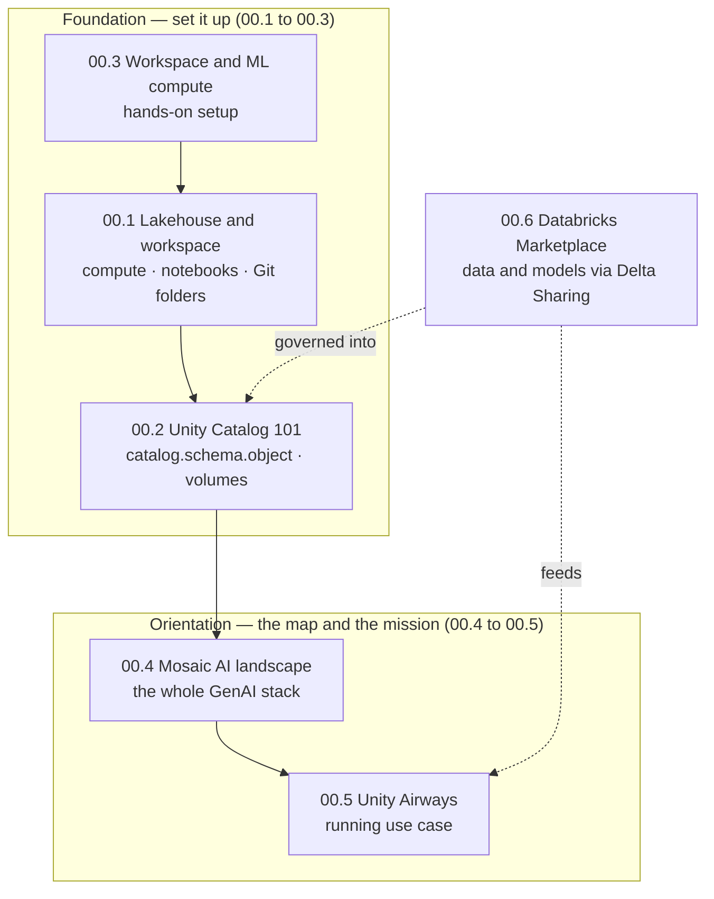
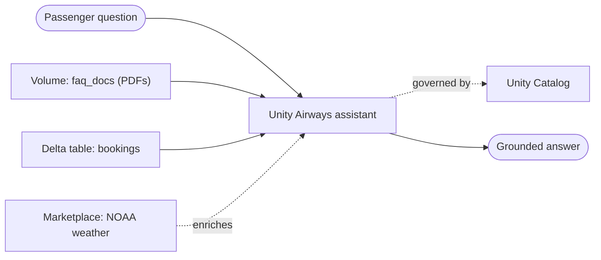

# Databricks Platform Foundations for GenAI  ·  Module 00  ·  [Theory + Hands-on]

> **You are here:** Roadmap Level 0 → Module 00 (Orientation and Environment).
> **Prerequisites:** none. This is the root module — everything else in the roadmap builds on it.

This is the **module explainer**: one numbered entry per topic (00.1 → 00.6). Topic 00.4 (the Mosaic AI
product landscape) is the **cornerstone** and also has its own deep-dive pair — see
[`mosaic-ai-landscape.md`](mosaic-ai-landscape.md) / `.html`.

---

## TL;DR
- You can't build GenAI on Databricks until the **platform plumbing** is in place: a **Lakehouse workspace**, **compute**, **Unity Catalog** governance, and a way to **find data and models**.
- The **Lakehouse** is one platform that stores raw and structured data together (Delta), governs it (Unity Catalog), and runs every workload (SQL, ML, GenAI) on shared **compute**.
- **Unity Catalog** is the governance spine: a single **three-level namespace** `catalog.schema.object` for tables, **volumes** (files), functions, models, and vector indexes — with permissions, lineage, and audit built in.
- **Mosaic AI** is Databricks' umbrella for building, serving, and governing AI — a *stack of modular pieces*, not one product. Every later module is a deep dive into one box on that map.
- **Unity Airways** (the book's airline-assistant use case) is the running example we build against, and **Databricks Marketplace** is how you pull in ready-made data and models (for example, NOAA weather data) without building pipelines.

## The problem
- A customer says *"we want a GenAI assistant over our data."* Before any prompt or model, you need a place to **run code**, a place to **store and govern data**, and a way to **find** the data and models you'll use.
- New Databricks users get stuck on the basics: *Which compute do I pick? Where do my files live? Why can't my notebook see that table? How do I get sample data to demo with?*
- If the foundation is wrong (no governance, files scattered in DBFS, wrong compute), everything downstream — RAG, agents, evaluation, serving — inherits the mess.

## Why the naive approach fails
- **"Just spin up any cluster and read from DBFS."** That skips governance. You lose access control, lineage, and audit — non-negotiable the moment real data or a customer POC is involved.
- **"Store the PDFs and models wherever."** Without **Unity Catalog volumes** and the **three-level namespace**, nobody can find, secure, or trace your assets across workspaces.
- **"Build every dataset from scratch."** Slow. **Databricks Marketplace** gives you governed, ready-to-query datasets and models in minutes via Delta Sharing — no ingestion pipeline.
- **"Learn each GenAI product in isolation."** You end up reaching for code (Agent Framework) when a no-code option (Agent Bricks, Genie) would close the deal faster. You need the **map** first.

## What it is
- **Plain-language definition:** Module 00 is the **environment setup and mental map** for GenAI on Databricks — the workspace, compute, Unity Catalog governance, the Mosaic AI product landscape, the running use case, and Marketplace for data/model discovery.
- **Mental model:** think of a **workshop**. The **Lakehouse workspace** is the building, **compute** is the power, **Unity Catalog** is the locked, labeled shelving, **Mosaic AI** is the set of tools on the wall, **Unity Airways** is the project on the bench, and **Marketplace** is the hardware store next door.

## Why it matters (for a Databricks FDE)
- Customers constantly ask *"what do I use for X?"* — you must place the right component instantly and defend a reference architecture on a whiteboard.
- Every POC starts here: a governed workspace + compute + a catalog/schema + a volume for files is the minimum viable footprint.
- Governance (Unity Catalog) is an FDE differentiator. Competing "notebook + vector DB" stacks can't match lineage + access control + audit out of the box.
- Marketplace lets you **demo in an hour** with credible public data instead of waiting on the customer's data access.

---

## Core concepts (shared vocabulary for the whole roadmap)
- **Lakehouse** — one platform that unifies a data lake (cheap open storage) with a data warehouse (governed tables and BI). Storage format is **Delta Lake**; governance is **Unity Catalog**.
- **Workspace** — the web environment where you work: notebooks, Catalog Explorer, Compute, Jobs and Pipelines, Marketplace, Serving. One account can have many workspaces.
- **Compute** — the engine that runs your code. **Serverless** (Databricks manages it, starts in seconds) or **classic** (you configure the cluster; the **ML runtime** preloads ML/GenAI libraries).
- **Notebook** — a multi-language document of cells (`%python`, `%sql`, `%md`) attached to compute. **Git folders** version them with GitHub/Azure DevOps.
- **Unity Catalog (UC)** — account-level governance. One **metastore** per region; a **three-level namespace** `catalog.schema.object`.
- **Volume** — a UC object that governs **non-tabular files** (PDFs, images, JSON) at path `/Volumes/<catalog>/<schema>/<volume>/...`. This is where RAG source documents live.
- **Mosaic AI** — the umbrella for Databricks' AI build/serve/govern stack (models, retrieval, agents, evaluation, serving), governed by UC and the AI Gateway.
- **Databricks Marketplace** — an open exchange (built on **Delta Sharing**) to discover and instantly access datasets, AI models, notebooks, and apps as a **read-only catalog**.

## 🗺️ Visual map

**How the six topics fit together** — the foundation (00.1–00.3) sits under the map and use case (00.4–00.5), and Marketplace (00.6) feeds data and models in:



---

## How it works — the six topics

### 00.1 Databricks Lakehouse and workspace basics  ·  [Theory + Hands-on]
- **Mechanism.** The **Lakehouse** keeps your data in cheap open storage as **Delta** tables, then adds warehouse-grade governance and performance on top. You work in a **workspace**: a left sidebar with **Workspace** (files/notebooks), **Catalog** (data), **Compute**, **Jobs and Pipelines**, **Marketplace**, and **Serving**.
- **Compute choices.**
  - **Serverless compute** — on-demand, auto-managed, starts in seconds. Best default for learning and most GenAI notebooks.
  - **Classic compute** — you pick node types and the **Databricks Runtime**. Use the **ML runtime** when you need preinstalled ML/GenAI libraries or GPUs. The cert book creates a classic ML cluster named `genai-exam-cluster`.
  - **SQL warehouses** — compute tuned for SQL/BI and AI Functions.
- **Notebooks and Git folders.** A notebook is cells attached to compute; switch language per cell with magics (`%sql`, `%md`). **Git folders** connect a repo so notebooks are versioned and reviewable.
- **Why it matters.** This is where every hands-on task runs. Picking serverless removes cluster-tuning friction; the ML runtime saves you from `pip`-installing the whole stack.
- **How to do it on Databricks.** Sidebar **Compute → Create** (or just attach a notebook to **Serverless**) → **Workspace → Create → Notebook** → attach → run a cell.

```python
# [Hands-on] Confirm the workspace can run code (book Step 13, environment_check)
print("Databricks environment is ready")
```

**How to verify it worked** — the cell returns without error and the notebook shows an attached, running compute in the top bar.

### 00.2 Unity Catalog 101  ·  [Theory]
- **Mechanism.** Unity Catalog is one **governance layer** across all workspaces in a region. Assets live in a **three-level namespace**: `catalog.schema.object`. A **metastore** (one per region, at the account level) is the top container; inside it, **catalogs → schemas → objects**.
- **Securable objects UC governs.** tables (managed or external), **views**, **volumes** (non-tabular files), **functions**, **registered models**, and **vector search indexes** — all under the same namespace and permission model.
- **Volumes.** The object type for **files** you can't put in a table — PDFs, images, JSON. Managed volumes store data in UC-managed storage; external volumes point at existing cloud paths. Access files at `/Volumes/<catalog>/<schema>/<volume>/...`. This is the home for RAG source documents (Module 03).
- **The governance model — three pillars (📗B2 Ch6).**
  - **RBAC** — `GRANT`/`REVOKE` privileges (`USE CATALOG`, `USE SCHEMA`, `SELECT`, `READ VOLUME`, `EXECUTE`) decide who can see or use each object.
  - **Lineage** — UC automatically links models and tables back to the data and runs that produced them.
  - **Audit logging** — every registration, grant, and access is recorded with timestamp and user.
- **Why it matters.** A model or index registered as `catalog.schema.name` is discoverable, access-controlled, and traceable everywhere — the reason UC is the backbone of GenAI on Databricks.

```sql
-- [Theory→illustration] The three-level namespace and a governance grant
SELECT * FROM main.airways.bookings;                 -- catalog.schema.table
GRANT READ VOLUME ON VOLUME main.airways.faq_docs     -- file governance
  TO `data-scientists`;
```

### 00.3 Setting up a workspace and ML compute  ·  [Hands-on]
- **Mechanism.** Provision a workspace (AWS, Azure, or GCP), then create compute and a first notebook. On Azure the book walks the portal: **Try Databricks → sign in → create workspace**, choosing the **Premium** pricing tier (required for **Unity Catalog** and governance features).
- **Steps (book Ch1, Steps 5–13, adapted).**
  1. Create the workspace (Premium tier so Unity Catalog is available).
  2. Sidebar **Compute → Create compute**; for classic, name it (e.g. `genai-exam-cluster`), pick an **ML runtime**, choose a small node type to control cost, **Create**, wait for **Running**. Or skip straight to **Serverless**.
  3. **Workspace → Create → Notebook**, name it `environment_check`, language **Python**, attach to the compute.
  4. Run `print("Databricks environment is ready")`.
- **How to verify it worked.** The message prints with no error; the notebook shows attached, running compute. If it hangs, confirm the cluster is **Running** and the notebook is attached to it (book TIP).
- **Trade-off.** Classic ML clusters give library and GPU control but cost start-up time; serverless removes that friction and is the recommended default for this roadmap.

### 00.4 The Mosaic AI product landscape  ·  [Theory]  ·  ★ cornerstone
- **Mechanism.** **Mosaic AI** is not one product; it's a **stack of modular pieces** that snap together over the UC/Delta foundation: **Models** (Foundation Model APIs, external models, Model Serving) → **Retrieval** (AI Search / Vector Search, AI Functions) → **Application and agents** (AI Playground, Agent Framework, Agent Bricks, MCP, Databricks Apps) → **Consumption** (AI/BI Genie, metric views). Two spines cut across every layer: **governance** (Unity Catalog + AI Gateway) and **quality/ops** (MLflow, Tracing, Evaluation, Monitoring).
- **Why it matters.** This is the map for the whole roadmap — every later module is a deep dive into one box. It lets you place the right component in a customer conversation instantly.
- **Branding note.** Databricks is trending **away from the "Mosaic AI" name** toward plain "Databricks / AI / Genie" branding; some surfaces (Agent Framework, Vector Search) still say "Mosaic AI." Teach current names, verify the page title.
- **Deep dive.** Full treatment, diagrams, and the request-journey flow live in [`mosaic-ai-landscape.md`](mosaic-ai-landscape.md).

### 00.5 The "Unity Airways" running use case  ·  [Theory]
- **Mechanism.** The book's running example is **Unity Airways**, a mock airline whose **customer-support assistant** helps travelers **book/reschedule/cancel** flights and **answer policy questions** (baggage, refunds, lounge access, disruption waivers).
- **Two deliberate data types** (to mirror real projects): **structured booking records** in a **Delta table** (`booking_id`, `pnr`, `status`, travel dates) and **unstructured FAQ documents** as **PDFs** (chunked and indexed for retrieval).
- **Why it matters.** It's a ready-made **POC scaffold**: swap the FAQ PDFs for a customer's policy docs and the booking table for their records, and the architecture is identical. Every later concept (RAG, agents, evaluation, monitoring) attaches to this one story.
- **Worked mapping.** Question *"Can I change my flight next week, and will I be charged?"* → retrieval finds the change/fee policy (Vector Search over PDFs) + a tool looks up the reservation (Delta table) → the assistant returns a grounded answer, fully traced.

### 00.6 Discovering data and models via Databricks Marketplace  ·  [Theory + Hands-on]
- **Mechanism.** **Databricks Marketplace** is an open exchange (built on **Delta Sharing**) where providers publish **datasets, AI models, notebooks, and apps**. In a UC-enabled workspace, a product is shared to you as a **read-only catalog** — no copy, no pipeline.
- **Consumer flow (verified in docs).**
  1. Open **Marketplace** (sidebar icon, or `marketplace.databricks.com`).
  2. Filter for **Free** / **Instantly available** listings (for example, search *NOAA* or *weather*).
  3. Open the listing → **Get instant access** → accept terms. Under **More options** you can rename the catalog it installs into.
  4. **Get instant access** again to finalize → **Open** → the data appears as a read-only catalog in **Catalog Explorer**.
  5. Query it with the three-part namespace `catalog.schema.table|volume|view`.
- **How to verify it worked.** The new read-only catalog shows in Catalog Explorer and a `SELECT` against `catalog.schema.table` returns rows.
- **Why it matters.** You can demo with credible public data (weather, geography, economics) in minutes, and the same flow pulls in **AI models** — matching the exam skill "select a model from a model hub or marketplace based on model cards."

---

## Worked example (Unity Airways)
Putting Module 00 to work to stand up the Unity Airways footprint:

1. **00.3** — provision a Premium workspace; attach a notebook to **Serverless** (or a `genai-exam-cluster` ML cluster).
2. **00.2** — create governed homes: `CREATE CATALOG main; CREATE SCHEMA main.airways;` then a **volume** `main.airways.faq_docs` for the FAQ PDFs and a Delta table `main.airways.bookings` for records.
3. **00.6** — from **Marketplace**, pull a public **NOAA / weather** dataset (read-only catalog) to enrich a demo (e.g., weather-driven disruption context).
4. **00.4 / 00.5** — you now have the foundation the Mosaic AI landscape sits on, filled in with airline data — ready for RAG (Module 03+) and agents (Module 09+).



## Uses, edge cases and limitations
| Use it when | Be careful when | Better move |
|---|---|---|
| Standing up any GenAI POC | Workspace is not **Premium** | UC/governance needs Premium+ — check before you build |
| Files/PDFs for RAG | Storing docs in DBFS root | Use a **UC volume** (`/Volumes/...`) for governance and lineage |
| Need demo data fast | Building a custom ingestion pipeline | Pull a governed dataset from **Marketplace** (Delta Sharing) |
| Interactive notebooks | Long-lived classic cluster idling | Prefer **serverless**; auto-stops, no tuning |
| Registering models/indexes | Using the workspace Model Registry on a UC workspace | Register to UC: `catalog.schema.name` |

## Common mistakes / gotchas
| Mistake | Why it hurts | Better move |
|---|---|---|
| Skipping Unity Catalog, reading from DBFS | No access control, lineage, or audit | Put every asset under `catalog.schema.object` |
| Confusing metastore, catalog, and schema | Broken references, "table not found" | Learn the order: metastore → catalog → schema → object |
| Treating "Mosaic AI" names as fixed | Names churn (e.g., Vector Search → AI Search) | Verify the current product/page name before quoting it |
| Assuming Marketplace copies data | It's **shared** read-only via Delta Sharing | You query it in place; you can't write to it |
| Hardcoding a served-model endpoint name | Endpoint catalogs change | Confirm on the supported-models page at authoring time |

> 📌 **IMPORTANT:** Unity Catalog's **three-level namespace** `catalog.schema.object` is the single most important idea in Module 00 — tables, **volumes**, functions, models, and vector indexes all live there and inherit its permissions, lineage, and audit.

> 💡 **TIP:** For this roadmap, default to **serverless compute** (no cluster tuning) and put every RAG document in a **UC volume**. It removes two of the most common beginner blockers in one move.

> ⚠️ **GOTCHA (names change — verify against docs):** The book Ch1 setup is **Azure-portal-specific** and uses a **classic ML cluster**; current Databricks leads with **serverless** and cross-cloud sign-up. Also, Databricks is moving **away from "Mosaic AI"** branding (e.g., "Databricks Vector Search" is surfaced as **AI Search**). Always confirm the live product name before a customer conversation.

## 📝 Notes
*(your space)*
-
-

**Self-check (5 questions)**
1. What are the three levels of the Unity Catalog namespace, and name three object types that live in it.
2. When would you pick **serverless** compute over a **classic ML cluster**, and vice versa?
3. Which UC object governs **non-tabular files** (like FAQ PDFs), and what is the path to read them?
4. Describe the **Get instant access** flow in Marketplace — where does the data end up and how do you query it?
5. Why are **Unity Catalog** and the **AI Gateway** called "cross-cutting spines" in the Mosaic AI landscape?

## How this maps to the certification
- Module 00 is **foundational** — it underpins every exam domain rather than being one.
- Direct hits: **Governance** (8%) — Unity Catalog access control, lineage, audit; **Design Applications** (14%) — "select a model from a model hub or **marketplace** based on model cards"; **Assembling and Deploying** (22%) — "register the model to Unity Catalog."
- Exam domain weights (📗B2 Table 1-2): Design 14% · Data Prep 14% · **Application Development 30%** · Assembling and Deploying 22% · Governance 8% · Evaluation and Monitoring 12%.

## Sources
- 📗 **B2** — *Databricks Certified GenAI Engineer Associate Study Guide*, Ch1: "Setting Up Your Databricks Workspace" (Steps 1–13: sign-up, Premium tier, `genai-exam-cluster`, `environment_check`), Table 1-2 exam domain weights; Ch6: "Registering Models with Unity Catalog," three-level namespace `catalog.schema.model_name`, governance pillars (RBAC, lineage, audit).
- 📘 **B1** — *Practical MLflow for GenAI on Databricks*, Ch1: "Introducing the Book's Core Use Case" (Unity Airways; booking records + FAQ PDFs). *(Early Release — verify against docs.)*
- 🌐 Docs — Compute: `docs.databricks.com/aws/en/compute/` (serverless vs classic). Volumes: `docs.databricks.com/aws/en/volumes/` (`/Volumes/<catalog>/<schema>/<volume>/...`, managed vs external). Marketplace: `docs.databricks.com/aws/en/marketplace/` and `.../marketplace/get-started-consumer` (Get instant access, read-only catalog, Delta Sharing). Generative AI landing: `docs.databricks.com/aws/en/generative-ai/generative-ai`.
- 🔗 Cornerstone deep-dive: [`mosaic-ai-landscape.md`](mosaic-ai-landscape.md) (Topic 00.4).
