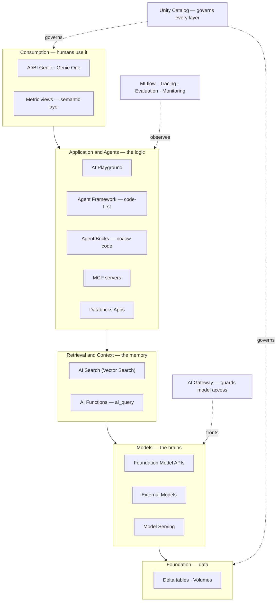
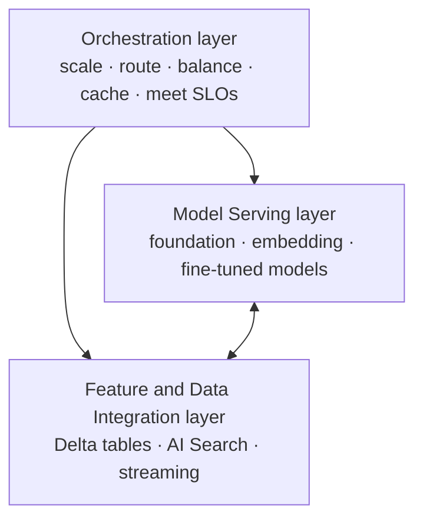
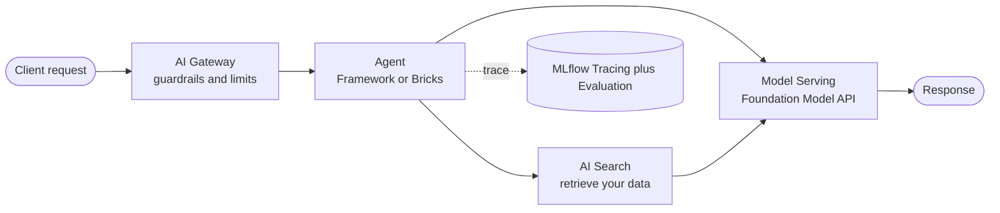
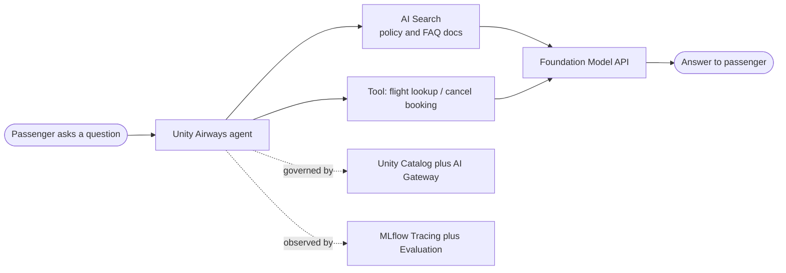

# The Mosaic AI Product Landscape — Where Each Piece Fits  ·  Module 00 · Topic 00.4  ·  [Theory]  ·  ★ Cornerstone

> **You are here:** Roadmap Module 00 → 00.4. **Prereqs:** 00.1 (workspace basics), 00.2 (Unity Catalog 101) — helpful, not required.

This is the **cornerstone deep-dive** for Topic 00.4. It is also summarized as an entry in the
[module explainer](module.md). Read it once; you'll reuse this map for the entire roadmap.

---

## TL;DR
- **Mosaic AI** is Databricks' umbrella for building, serving, and governing AI. It is **not one product** — it's a **stack of modular pieces** that snap together.
- The cleanest way to hold it in your head: **5 layers** (data → models → retrieval → apps/agents → consumption) plus **2 cross-cutting spines** (governance and quality/ops).
- The cert book frames the same thing as a **3-layer infrastructure view**: **Model Serving**, **Feature/Data integration**, and **Orchestration**.
- Business users consume it through **AI/BI Genie** and a **semantic layer** (metric views).
- 📌 Every later module in this roadmap is a **deep dive into one box** on this map.

## The problem
- A customer describes a GenAI need — *"a chatbot over our docs," "an agent that books tickets," "let analysts ask questions in plain English."* You have seconds to place the right Databricks components.
- The Databricks AI surface is **big and fast-moving**: models, retrieval, agents, evaluation, serving, governance, BI. Without a map, it reads as a bag of loosely related product names.
- Get the placement wrong and you either **over-engineer** (hand-coded agent when a no-code assistant would win) or **under-govern** (a slick demo with no access control, lineage, or observability).

## Why the naive approach fails
- **"Learn each product on its own."** You memorize names but can't compose them. The value is in how the boxes connect, not any single box.
- **"Pick tools bottom-up from a feature list."** You end up choosing by hype, not by the customer's skills and timeline. The right first question is *which layer does this problem live in?*
- **"Ignore the spines."** Governance (Unity Catalog + AI Gateway) and quality/ops (MLflow, Tracing, Evaluation, Monitoring) aren't optional add-ons — they touch **every** layer. Skip them and the POC can't graduate to production.

## What it is
- **Plain-language definition:** the Mosaic AI landscape is the **reference map** of Databricks' GenAI stack — the layers a request passes through and the two spines that govern and observe every layer.
- **Mental model:** a **restaurant kitchen**. Ingredients (data) sit in a governed pantry; the stove and ovens (models) cook; the recipe cards and pantry runner (retrieval) fetch the right context; the chef (agent/app) orchestrates; the dining room (Genie/BI) is where guests consume. Health inspection (governance) and the expediter checking every plate (quality/ops) run across the whole kitchen.

## Why it matters (for a Databricks FDE)
- Customers constantly ask *"what do I use for X?"* — this map lets you answer in one breath and **draw a reference architecture** on a whiteboard, defending *why* each piece is there.
- It prevents the classic mistake of **reaching for code** (Agent Framework) when a **no-code** option (Agent Bricks / Genie) closes the deal faster.
- It gives you a **shared structure** for the entire roadmap: each module snaps onto one region of this landscape.

---

## Core concepts — the mental model
Think of any GenAI app on Databricks as **5 layers + 2 cross-cutting spines**:

- **🧱 Foundation (data and governance)** — Unity Catalog, Delta tables, volumes. *Everything else is governed here.*
- **🧠 Models** — the "brains" that generate text and embeddings.
- **📚 Retrieval and context** — gives the model *your* data (RAG).
- **🛠️ Application and agents** — the logic that ties models + tools + retrieval into something useful.
- **📊 Consumption** — how humans actually use it (chat UI, natural-language analytics).
- **🔐 Governance spine (cross-cutting)** — Unity Catalog + AI Gateway sit *across* every layer.
- **🔬 Quality and Ops spine (cross-cutting)** — MLflow / Tracing / Evaluation / Monitoring sit *across* every layer.

## 🗺️ Visual map

**The landscape, layer by layer** (dashed arrows = the two spines that touch every layer):

---

## The pieces, by layer

**🧠 Models layer**
- **Foundation Model APIs** — state-of-the-art models **hosted by Databricks** (pay-per-token or provisioned throughput).
- **External Models** — third-party models (OpenAI, Anthropic, Google) called through Databricks with **unified governance**.
- **Custom / fine-tuned models** — your own models packaged with MLflow.
- **Model Serving** — one **scalable REST endpoint** family that serves *all* of the above (autoscaling, GPU, dynamic batching, versioning, A/B).

**📚 Retrieval and context layer**
- **Databricks AI Search** (formerly Vector Search) — builds an **embedding index** over your docs and does **similarity search** for RAG. The SDK is still `databricks-vectorsearch`.
- **AI Functions** — call models straight from **SQL** (`ai_query`, `ai_parse_document`, `ai_extract`, …) for batch or inline inference.
- **Feature/function serving + Delta tables** — supply structured context.

**🛠️ Application and agents layer**
- **AI Playground** — **no-code** place to chat with models, attach tools, and prototype.
- **Agent Framework** — **code-first** authoring of agents and tools via the **`ResponsesAgent`** interface, then `agents.deploy()`.
- **Agent Bricks** — **no/low-code** agents: **Knowledge Assistant**, **Multi-Agent Supervisor**, **Information Extraction**, **Custom LLM**.
- **MCP servers** — a **standard interface** to expose tools/data to agents (Databricks offers managed MCP servers for Genie, AI Search, UC functions).
- **Databricks Apps** — host the **web UI** for your app or agent.

**📊 Consumption layer**
- **AI/BI Genie** (Genie Agents) and **Genie One** — let **business users ask questions in natural language** over governed data.
- **Unity Catalog metric views** — the **semantic layer** (KPIs, synonyms) that makes Genie and agents answer *consistently*.

**🔐 Governance spine (cross-cutting)**
- **Unity Catalog** — governs **data, features, models, functions, and vector indexes**, with lineage and access control.
- **AI Gateway** (and newer **Unity AI Gateway**) — governs and monitors model access: **rate limits, guardrails, payload logging, usage tracking, provider fallbacks**.

**🔬 Quality and Ops spine (cross-cutting)**
- **MLflow** — experiment tracking, **Model Registry in Unity Catalog**, Prompt Registry, "models from code."
- **MLflow Tracing** — see *every step* an agent took (observability).
- **Agent Evaluation** — `mlflow.genai.evaluate()` with LLM-as-a-judge scorers to score quality.
- **Monitoring / inference tables** — production metrics and feedback.

---

## How it works — deep dive

### The cert book's 3-layer view (memorize this)
From 📗B2 Ch9 (*"Overview of Mosaic AI Architecture"*), Mosaic AI is the **orchestration backbone** with **three core layers**:

| Layer | Role |
|---|---|
| **Model serving layer** | Hosts foundation, embedding, and fine-tuned models behind scalable API endpoints (inference + embeddings). |
| **Feature and data integration layer** | Supplies models with current context from **Delta tables, AI Search indexes, or streaming pipelines**. |
| **Orchestration layer** | **Scales resources, balances workloads, routes requests, caches responses**, and holds SLOs (autoscaling, load distribution). |

### A request's journey
A client prompt flows through the AI Gateway to an agent, which may call the retrieval index and business logic, then forwards enriched input to a served model — while orchestration handles autoscaling and every step is traced:

### How you *invoke* each piece (concrete handles)
- Model — query a **Model Serving endpoint** (REST) or a Foundation Model API.
- Retrieval — an **AI Search index** queried by the agent's retriever tool.
- Agent — built with **Agent Framework** (`ResponsesAgent`), deployed with `agents.deploy(...)` (📘B1 Ch7 shows single-line deploy).
- Governance — traffic flows through the **AI Gateway**; assets live in **Unity Catalog** (`catalog.schema.object`).
- Quality — **MLflow** logs the run; **Tracing** records the spans; **Agent Evaluation** scores it.

---

## Worked example (Unity Airways)
The book's running use case is **Unity Airways**, an airline support assistant. Where each piece fits:

| Need | Mosaic AI piece |
|---|---|
| The assistant "brain" | **Foundation Model APIs** via **Model Serving** |
| Answer from airline policies / FAQs | **AI Search** index over policy docs |
| Look up a flight, cancel a booking | **Agent Framework** tools (API-calling, structured lookup) |
| Tie it all together | **Agent Framework** agent (or **Agent Bricks → Knowledge Assistant** for no-code) |
| Block unsafe input/output, rate-limit | **AI Gateway** guardrails |
| Govern the docs, model, index | **Unity Catalog** |
| See why the bot gave a bad answer | **MLflow Tracing** |
| Prove quality before release | **Agent Evaluation** (`mlflow.genai.evaluate()`) |
| Ops asks "what's our deflection rate?" | **AI/BI Genie** + **metric views** |

## Uses, edge cases and limitations
| Use it when | Be careful when | Better move |
|---|---|---|
| Placing components in a customer design | Treating Mosaic AI as one product | Reason **by layer** first, then pick the box |
| Chatbot over docs | Jumping straight to custom code | Try **Agent Bricks / Playground** before hand-coding |
| Production ambitions | Demoing with no spine | Wire **UC + AI Gateway** and **MLflow/Tracing** from day one |
| Quoting a product name to a customer | Names have churned | Verify the **current** name (Vector Search → AI Search, etc.) |

## Common mistakes / gotchas
| Mistake | Why it hurts | Better move |
|---|---|---|
| Skipping the governance/ops spines | POC can't reach production | Treat UC + AI Gateway + MLflow as part of the architecture, not extras |
| Code-first agent for a simple Q&A bot | Slower, more to maintain | Start with **Knowledge Assistant** (Agent Bricks) |
| Saying "Mosaic AI Vector Search" as if fixed | Branding is shifting | Say **AI Search**; SDK is still `databricks-vectorsearch` |
| Assuming `agents.evaluate()` exists | No such function | Evaluate with **`mlflow.genai.evaluate()`** |

> 📌 **IMPORTANT:** Mosaic AI is a **stack of modular pieces**, not a single product. Learn the **layers** first, then the boxes. **Unity Catalog** (governance) and the **AI Gateway + MLflow/Tracing** (ops) are **cross-cutting** — they touch *every* layer.

> 💡 **TIP (field):** When a customer says *"we want a chatbot over our docs,"* the minimum viable stack is **four boxes** — AI Search → Foundation Model API → Agent Framework/Bricks → Model Serving — all governed by Unity Catalog. Enable **dynamic batching** on serving endpoints for many short requests: more throughput, lower cost, minimal latency hit (📗B2 Ch9).

> ⚠️ **GOTCHA (names change — verify against docs):** Databricks is trending **away from "Mosaic AI"** toward "Databricks / AI / Genie" branding; the current Generative AI landing page leads with "Build AI agents" and doesn't say "Mosaic AI." Still, **"Mosaic AI Agent Framework"** and **"Mosaic AI Vector Search"** appear in places. **"Databricks Vector Search"** is now surfaced as **"AI Search"** (SDK unchanged: `databricks-vectorsearch`); **"MLflow AI Gateway"** evolved into the **Databricks / Unity AI Gateway**. Confirm the live page title before quoting a name.

---

## 📝 Notes
*(your space)*
-
-

**Self-check (5 questions)**
1. What are the **three core layers** of the Mosaic AI architecture (per the cert book)?
2. Which two "spines" are **cross-cutting** across all layers, and what does each govern or provide?
3. When would you choose **Agent Bricks** over the **Agent Framework**?
4. In the Unity Airways assistant, which piece answers questions from **policy documents**, and which serves the **LLM**?
5. What does the **AI Gateway** add that raw Model Serving does not?

## How this maps to the certification
- Primarily **Domain 8 in the roadmap crosswalk — Scaling with Vector Search and Mosaic AI** (📗B2 Ch9: Mosaic AI architecture, model serving at scale).
- Acts as the **map for the whole exam**: every other domain (design, RAG, deploy, govern, monitor) is a deep dive into one region of this landscape.

## Sources
- 📗 **B2** — *Databricks Certified GenAI Engineer Associate Study Guide*, Ch9 "Scaling Applications with Mosaic AI" → "Overview of Mosaic AI Architecture" (three-layer view), "Model Serving at Scale" (request journey, dynamic batching TIP).
- 📘 **B1** — *Practical MLflow for GenAI on Databricks*, Ch7 (Agent Framework, `agents.deploy()`). *(Early Release — verify against docs.)*
- 🌐 Docs — **Generative AI** landing (`docs.databricks.com/aws/en/generative-ai/generative-ai`): AI agents, Model Serving, Foundation Model APIs, AI Gateway. **Agent Framework** (`.../generative-ai/agent-framework/author-agent`): `ResponsesAgent`. **AI Search** (`.../vector-search/vector-search`): formerly Vector Search; SDK `databricks-vectorsearch`. **Genie** (`.../genie/`) and **Genie One** (`.../genie-one/`).
- 📎 Naming/branding cross-check: `.claude/skills/genai-teacher/references/naming-conventions.md` (§2 Agent Framework/Bricks, §3 AI Search, §6 AI Gateway, §7 Genie, §8 branding trend).
- 🔗 Module overview: [`module.md`](module.md).
