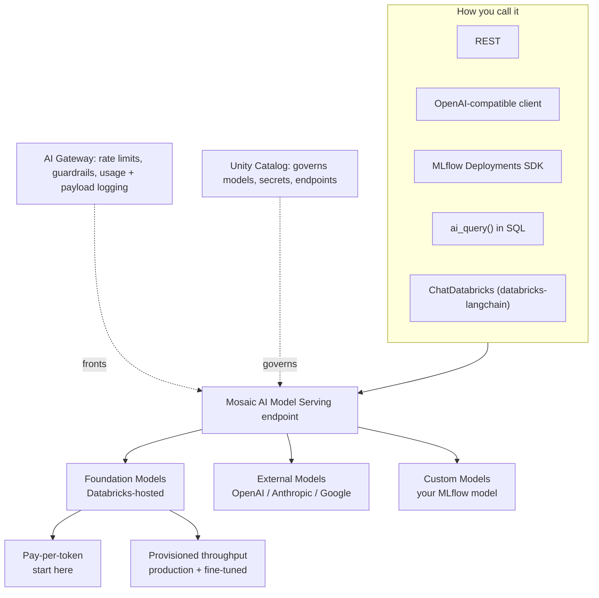
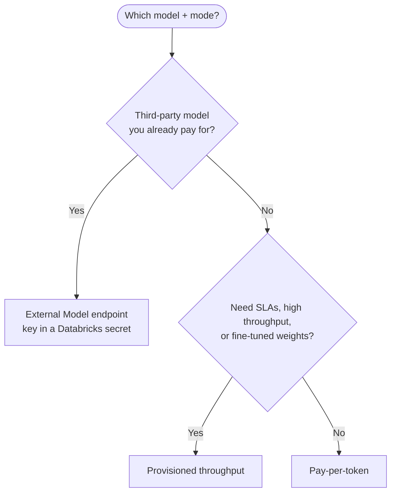
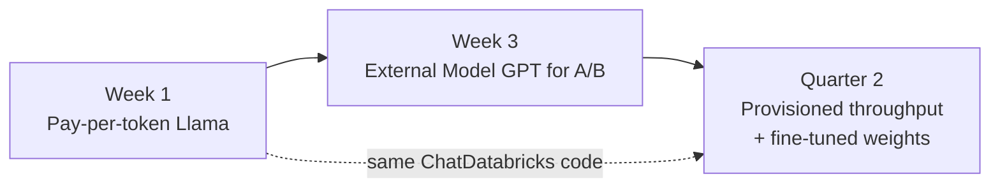

# Foundation Model APIs and External Models on Databricks  ·  Module 01 · Topic 01.6  ·  ★ Cornerstone  ·  [Theory + Hands-on]

> **You are here:** Roadmap Module 01 → 01.6 (the module cornerstone).
> **Prerequisites:** 01.2 (tokens, context window, temperature), 01.5 (cost/latency/quality). A Databricks workspace with serverless or an ML runtime, and permission to query Model Serving.
> **Next up:** Module 02 — Prompt engineering.

## TL;DR
- **Mosaic AI Model Serving** is the single surface for reaching any model on Databricks. It has **three endpoint families**: **Foundation Models** (Databricks-hosted), **External Models** (governed proxy to third parties), and **Custom Models** (your own).
- The **Foundation Model APIs** give you Databricks-hosted models in **two modes**: **pay-per-token** (start here) and **provisioned throughput** (production, guarantees, fine-tuned weights).
- **External Models** let you call OpenAI / Anthropic / Google *through* Databricks, so keys, rate limits, and logs are governed in one place.
- You call all of them the same way: **REST**, the **OpenAI-compatible client**, the **MLflow Deployments SDK**, `ai_query()` in **SQL**, or **`ChatDatabricks`** from **`databricks-langchain`**.
- **Endpoint names churn.** Treat any specific name here as a dated snapshot and confirm on the supported-models page before you commit.

## The problem
- A Unity Airways team wants to prototype a support assistant this week and move it to production next quarter. They need one model *now* with zero infra, and a path to guaranteed throughput and their own fine-tuned weights *later* — without rewriting the app.
- They also want to compare a Databricks-hosted Llama against OpenAI's GPT for one step, but security won't allow API keys scattered across notebooks, and finance wants one place to see spend.

## Why the naive approach fails
- **"Just call the OpenAI API directly from the notebook."** Now the key lives in a notebook, there is no central rate limit, no usage log, no fallback, and Unity Catalog governs none of it. Security and finance both object.
- **"Stand up our own GPU endpoint for a hosted open model."** For a prototype that is weeks of undifferentiated work. Pay-per-token gives you the same model in one call.
- **"Pick provisioned throughput on day one."** You pay for reserved capacity before you know your traffic. Pay-per-token is the cheaper way to learn the shape of the workload.

## What it is
- **Plain-language definition:** Model Serving is a **managed REST layer** in front of models. The **Foundation Model APIs** are the Databricks-hosted slice of it; **External Models** are the same layer wrapping someone else's API. You get one auth model, one governance model, one logging model, whatever is behind the endpoint.
- **Mental model:** think of Model Serving as a **power strip**. Foundation Models are the outlets Databricks wires for you; External Models are an extension cord to another building; Custom Models are outlets you wire yourself. Your app plugs into the strip and never cares which outlet it uses.

## Why it matters (for a Databricks FDE)
- You can promise a customer a **prototype today and production later on the same code**, just by changing the endpoint behind it.
- You can put **one governance story** — Unity Catalog + AI Gateway — around every model, hosted or third-party.
- You can give a precise, current answer to "how do we call a model here?" instead of hand-waving.

## Core concepts
- **Model Serving endpoint:** a named REST endpoint (`https://<workspace-host>/serving-endpoints/<name>/invocations`) that accepts a request and returns a model response.
- **Foundation Model APIs:** Databricks-hosted foundation models exposed through Model Serving.
  - **Pay-per-token:** billed by tokens consumed; instant to use; the docs call it "the easiest way to start" and note it is **not designed for high-throughput** apps.
  - **Provisioned throughput:** reserved capacity with **performance guarantees**, support for **fine-tuned / custom weights**, and stronger security/compliance (e.g., HIPAA). The docs recommend it for **all production workloads**.
- **External Models:** a serving endpoint whose backend is a third-party provider. You set a `provider`, a `task`, and a provider config that reads the API key from a **Databricks secret**.
- **Task type (endpoint route):** `llm/v1/chat`, `llm/v1/completions`, or `llm/v1/embeddings` — the schema the endpoint speaks.
- **AI Gateway:** the policy layer on serving endpoints — rate limits, guardrails, usage tracking, and payload logging to inference tables. It fronts both hosted and external endpoints.
- **`databricks-langchain` / `ChatDatabricks`:** the LangChain integration for Databricks chat/embedding endpoints. The package is `databricks-langchain`; the import is `from databricks_langchain import ChatDatabricks`.

## 🗺️ Visual map

**The three families and how you reach them:**



**Choosing a mode:**



## How it works — deep dive

### Pay-per-token Foundation Model APIs
- **Mechanism:** Databricks hosts the model and a shared endpoint. You send a chat request naming the served-model endpoint; you are billed per input + output token.
- **Why it matters:** zero setup, so it is the fastest path from idea to a working call and the cheapest way to evaluate several models.
- **Trade-off:** shared capacity means no throughput guarantee; the docs steer high-throughput/production traffic to provisioned throughput.

### Provisioned throughput
- **Mechanism:** you reserve serving capacity for a model family (a base model or your fine-tuned weights), measured in throughput bands. The endpoint is dedicated.
- **Why it matters:** predictable latency and throughput, support for **custom/fine-tuned weights**, and compliance controls for regulated workloads.
- **Trade-off:** you pay for reserved capacity whether or not it is busy — right-size it against real traffic.

### External Models
- **Mechanism:** you create a serving endpoint with `served_entities[].external_model` set — a `name` (the provider's model, e.g. `gpt-4o`), a `provider` (`openai`, `anthropic`, `cohere`, `amazon-bedrock`, `google-cloud-vertex-ai`, `databricks-model-serving`, or `custom`), a `task` (`llm/v1/chat` etc.), and a `<provider>_config` whose API key reads from a Databricks secret: `"{{secrets/<scope>/<key>}}"`.
- **Why it matters:** third-party models get the **same governance** (rate limits, logging, unified auth) as hosted ones, and the key never sits in notebook code.
- **Trade-off:** you still depend on the provider's availability, quotas, and data policy — Databricks governs *access*, not the provider's model.

### Custom Models (for context)
- **Mechanism:** you log a model to MLflow, register it in Unity Catalog, and serve it on the same endpoint surface.
- **Why it matters:** open-source / fine-tuned / classic models share one serving and governance story with foundation models. (Deep-dive lives in Module 11.)

## How to do it on Databricks

Below is the smallest useful version of each path. Replace `databricks-meta-llama-3-3-70b-instruct` with a **current** endpoint from the supported-models page.

**1) LangChain — `ChatDatabricks` (recommended for app code):**
```python
# %pip install -U databricks-langchain
from databricks_langchain import ChatDatabricks

llm = ChatDatabricks(endpoint="databricks-meta-llama-3-3-70b-instruct", temperature=0)
print(llm.invoke("In one sentence, what is a Foundation Model API?").content)
```

**2) OpenAI-compatible client (works because FM APIs speak the OpenAI schema):**
```python
# %pip install -U openai
from openai import OpenAI
from databricks.sdk import WorkspaceClient

w = WorkspaceClient()
client = OpenAI(
    api_key=w.tokens.create(comment="fmapi", lifetime_seconds=600).token_value,
    base_url=f"{w.config.host}/serving-endpoints",
)
resp = client.chat.completions.create(
    model="databricks-meta-llama-3-3-70b-instruct",
    messages=[{"role": "user", "content": "Say hello in 5 words."}],
    temperature=0,
)
print(resp.choices[0].message.content)
```

**3) MLflow Deployments SDK:**
```python
from mlflow.deployments import get_deploy_client

client = get_deploy_client("databricks")
r = client.predict(
    endpoint="databricks-meta-llama-3-3-70b-instruct",
    inputs={"messages": [{"role": "user", "content": "Name one benefit of pay-per-token."}],
            "temperature": 0},
)
print(r["choices"][0]["message"]["content"])
```

**4) SQL — `ai_query()` for batch/inline inference:**
```sql
SELECT ai_query(
  'databricks-meta-llama-3-3-70b-instruct',
  'Classify the sentiment of this review as positive, negative, or neutral: "Flight was delayed but staff were kind."'
) AS sentiment;
```

**5) Create an External Model endpoint (OpenAI via a governed proxy):**
```python
# The documented config shape: served_entities[].external_model with a provider config
# whose key reads from a Databricks secret. MLflow Deployments takes it as a plain dict.
from mlflow.deployments import get_deploy_client

client = get_deploy_client("databricks")
client.create_endpoint(
    name="openai-gpt-4o-proxy",
    config={
        "served_entities": [{
            "name": "gpt-4o",
            "external_model": {
                "name": "gpt-4o",          # provider's model name (verify current)
                "provider": "openai",      # openai | anthropic | google-cloud-vertex-ai | ...
                "task": "llm/v1/chat",     # route schema
                # key stored as a Databricks secret, never in code
                "openai_config": {"openai_api_key": "{{secrets/genai_demo/openai_api_key}}"},
            },
        }]
    },
)
```
Then query `openai-gpt-4o-proxy` with the **same** ChatDatabricks / OpenAI-client / `ai_query` code as a hosted model.

**How to verify it worked**
- **Serving UI:** open **Serving** in the workspace; the endpoint shows **Ready**, with request/latency charts.
- **Response shape:** a chat response has `choices[0].message.content`; a non-empty string means the call round-tripped.
- **Governance:** if AI Gateway usage tracking / payload logging is on, requests appear in the usage system tables / inference table for the endpoint.
- **External Model:** a successful call proves the secret resolved and the provider accepted the key — without the key ever appearing in your code.

## Worked example (Unity Airways)
- **Week 1 (prototype):** call `databricks-meta-llama-3-3-70b-instruct` **pay-per-token** via `ChatDatabricks` to answer FAQs. No infra, per-token cost, instant iteration.
- **Week 3 (compare):** stand up an **External Model** endpoint for GPT to A/B one hard intent, key held as a secret, spend and latency visible in one place.
- **Quarter 2 (production):** switch the same app to **provisioned throughput** for guaranteed latency at peak booking hours, and (if they fine-tune on airline transcripts) serve those **custom weights** through the same endpoint surface. The app code barely changes — only the endpoint name does.



## Uses, edge cases and limitations
| Use it when | Be careful when | Better move |
|---|---|---|
| Prototyping, evals, moderate traffic | You need guaranteed throughput/SLA | Provisioned throughput |
| You must call OpenAI/Anthropic under governance | Key sprawl, no central logging | External Model + Databricks secret |
| Batch scoring a Delta table | Looping row-by-row in Python | `ai_query()` in SQL at scale |
| One model behind app code | You want to swap models later | Keep the endpoint name in config, not code |

## Common mistakes / gotchas
| Mistake | Why it hurts | Better move |
|---|---|---|
| `from langchain_databricks import ...` | Wrong/deprecated package | `from databricks_langchain import ChatDatabricks` (package `databricks-langchain`) |
| Hardcoding `databricks-dbrx-instruct` | No longer a listed pay-per-token model | Verify names on the supported-models page |
| Putting the provider key in code | Leaks secrets, no rotation | `openai_api_key="{{secrets/<scope>/<key>}}"` |
| Choosing provisioned throughput on day one | Pay for idle capacity | Start pay-per-token; move when traffic is known |
| Assuming external = hosted for data policy | Provider sees the payload | Confirm the provider's data handling; use guardrails |

> 📌 **IMPORTANT:** All three families share **one endpoint surface, one auth model, one governance model**. Design your app against "a serving endpoint," keep the endpoint **name in config**, and you can move pay-per-token → provisioned throughput → custom weights without a rewrite.

> 💡 **TIP:** Foundation Model APIs speak the **OpenAI schema**, so existing OpenAI-client code and many LangChain/LlamaIndex integrations work by just changing `base_url` and the model name. Great for lifting a proof-of-concept onto Databricks.

> ⚠️ **GOTCHA:** Served-model endpoint names and pay-per-token availability **change frequently** (models get added and retired, e.g. DBRX dropped from the list). Never treat a name in a book, blog, or this lesson as permanent — open the **supported-models** doc at authoring time.

## 📝 Notes
*(your space)*
-
-

**Self-check (5 questions)**
1. Name the three Model Serving endpoint families and give a one-line reason to pick each.
2. What are the two Foundation Model API modes, and which does Databricks recommend for production — and why?
3. In an External Model endpoint, where does the provider API key come from, and why does that matter for security?
4. Give two different ways to call a Foundation Model API from Databricks, and one reason you'd prefer `ai_query()` for a large table.
5. Which package and import give you `ChatDatabricks`, and what is the common wrong version people write?

## How this maps to the certification
- **Domain 4 — Deploying and integrating GenAI applications** (📗 B2 Ch5): Model Serving endpoints, Foundation Model APIs, external models, batch inference with `ai_query`.
- **Domain 1 — Designing GenAI applications** (📗 B2 Ch2): choosing hosted vs external and the cost/latency/quality trade-off that drives pay-per-token vs provisioned throughput.

## Sources
- 🌐 Databricks docs — **Foundation Model APIs** (`/aws/en/machine-learning/foundation-model-apis/`): two modes (pay-per-token vs provisioned throughput); request via REST, OpenAI client, Foundation Models APIs Python SDK, MLflow Deployments SDK, and UI.
- 🌐 Databricks docs — **Supported foundation models** (`/aws/en/machine-learning/foundation-model-apis/supported-models`): current endpoint-name snapshot (verify live); embedding endpoints `databricks-gte-large-en`, `databricks-bge-large-en`; DBRX no longer listed.
- 🌐 Databricks docs — **External models** (`/aws/en/generative-ai/external-models/`): `served_entities` + `external_model`; `provider`, `task` (`llm/v1/chat` / `completions` / `embeddings`), `<provider>_config`; secret reference `"{{secrets/scope/key}}"`.
- 🌐 Databricks docs — **Model Serving** (`/aws/en/machine-learning/model-serving/`): three endpoint families; **AI Gateway** (`/aws/en/ai-gateway/`) for rate limits, guardrails, usage + payload logging.
- 🌐 Databricks docs — **LangChain on Databricks** (`/aws/en/large-language-models/langchain`): `databricks-langchain`, `ChatDatabricks`, `DatabricksEmbeddings`.
- 📘 **B1** — *Practical MLflow for GenAI on Databricks* (Early Release), Ch7–8: agents on serving endpoints, AI Gateway. *(Early Release — verify against docs.)*
- 📗 **B2** — *GenAI Engineer Associate Study Guide*, Ch2 (model selection) and Ch5 (deployment & serving).
- 📎 `.claude/skills/genai-teacher/references/naming-conventions.md` — current naming (verified July 2026; re-verify live).
