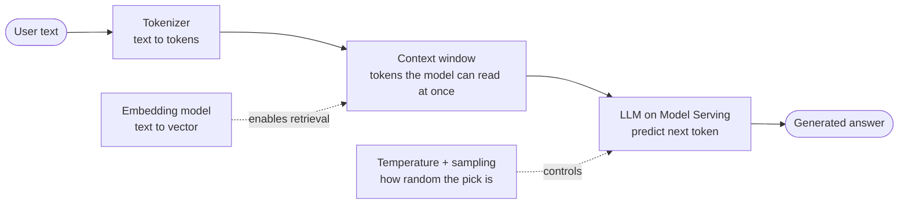
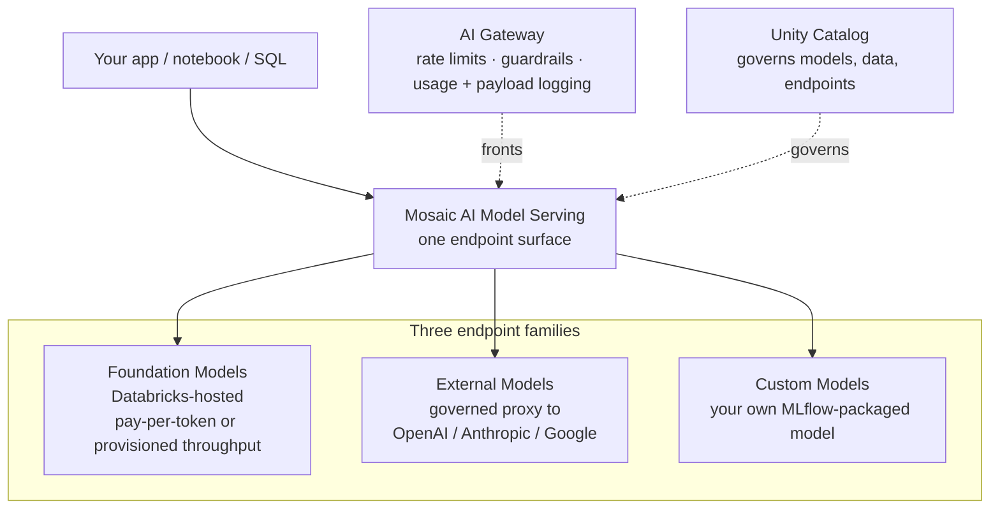
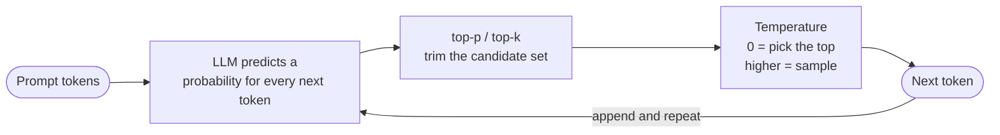
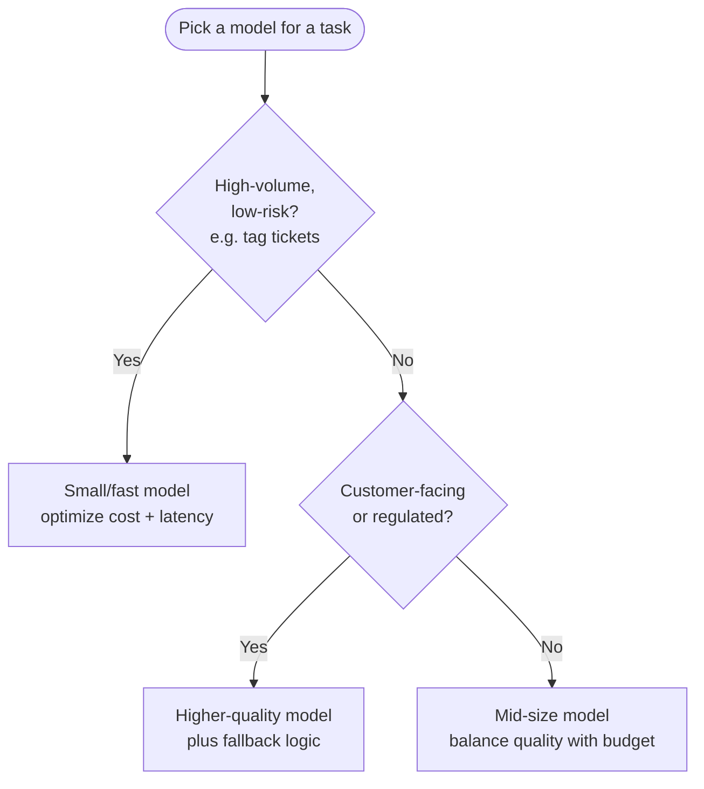
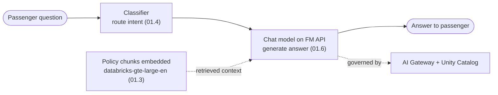

# GenAI and LLM Fundamentals  ·  Module 01  ·  Topics 01.1–01.6  ·  [Theory + Hands-on]

> **You are here:** Roadmap Module 01 → Topics 01.1 to 01.6.
> **Prerequisites:** Module 00 (light) — a workspace, Unity Catalog basics, and a running notebook. Concept-first; can overlap Module 00.
> **Next up:** Module 02 — Prompt engineering.

This module is the concept foundation for everything that follows. Before you build a RAG app, evaluate an agent, or ship a Genie space, you need a working mental model of what a large language model (LLM) actually does, how it is different from the ML you may already know, and how you reach one on Databricks. Each topic below is a numbered entry. Topic **01.6 (Foundation Model APIs and external models)** is the cornerstone and has its own deep-dive: [`foundation-model-apis.md`](foundation-model-apis.md).

---

## TL;DR
- **Generative AI** produces new content (text, code, embeddings) from a prompt; **traditional ML** mostly predicts a label or number for a row. Same math family, different job.
- An **LLM** turns your text into **tokens**, reads up to a **context window** of them, and predicts the next token over and over. **Temperature** and **sampling** control how random that choice is.
- **Embeddings** turn text into vectors so a machine can measure *meaning* by distance. They are the engine behind semantic search and RAG.
- Choosing a model is a three-way trade-off: **cost, latency, quality**. Read the **model card** to catch risk, bias, and licensing before you deploy.
- On Databricks you reach models through **Model Serving**, and specifically the **Foundation Model APIs** (pay-per-token or provisioned throughput) and **External Models** (a governed proxy to OpenAI, Anthropic, Google, and others).

## The problem
- A customer says "we want a chatbot over our policies." If you can't quickly explain tokens, context limits, embeddings, and the cost/latency/quality trade-off, you can't size the project, pick a model, or defend the architecture.
- Field engineers lose deals by reaching for the wrong tool: a giant model where a small one would do, a general model where a model card already warns it fails on the customer's language, or a raw prompt where retrieval was the real fix.

## Why the naive approach fails
- "Just send the whole document to the LLM" breaks the moment the document is longer than the **context window** — the input is silently truncated and the model answers from partial or missing text.
- "Pick the biggest model" burns budget and adds latency for tasks a 8B model handles fine, and it still hallucinates if you never grounded it in your data.
- "It looked good in three tries" is not a selection criterion. Model cards and metadata exist precisely so you can reject a model on documented risk, not vibes.

## Why it matters (for a Databricks FDE)
- You translate business problems into the right **task type**, the right **model tier**, and the right **serving mode** — on a whiteboard, in real time.
- You can name the exact Databricks handle for each idea: a **Model Serving endpoint**, a **Foundation Model API**, an **External Model**, an embedding endpoint like `databricks-gte-large-en`.
- You set correct expectations on cost and latency before the customer is surprised by a bill or a slow chatbot.

---

## 🗺️ Visual map

**How a prompt becomes an answer** — the path every topic in this module sits on:

**Where the model lives on Databricks** — the three Model Serving families you choose between:

---

## 1. Generative AI vs traditional ML  ·  01.1  ·  [Theory]

**What it is (plain language).** Traditional (predictive/discriminative) ML learns to answer a fixed question about a row of data: *is this email spam?*, *what will this house sell for?* It outputs a **label** or a **number**. Generative AI learns the shape of language (or images, code, audio) so well that it can **produce new content** one piece at a time: a summary, a JSON object, an answer, a vector.

- **Mental model:** predictive ML is a *sorter and estimator*; generative AI is a *writer and translator*.
- **Foundation model:** a large model pre-trained on a broad corpus that you adapt to many tasks with prompts instead of retraining. LLMs are foundation models for text.
- **Why the shift matters:** the book frames it as a change in what the engineer designs. You stop training a bespoke model per task and start **matching a business problem to a model capability and a prompt** (📗 B2 Ch2, "Designing Generative AI Applications").

| | Traditional ML | Generative AI (LLMs) |
|---|---|---|
| Output | Label or number | New content (text, code, embeddings) |
| Built by | Training a model per task | Prompting / adapting one foundation model |
| Data | Labeled rows | Broad pre-training corpus + your prompt/context |
| Typical Databricks tool | MLflow + classic ML | Model Serving + Foundation Model APIs |

> 💡 **TIP:** Generative and predictive are not rivals. A production system often uses a small classifier to *route* a request and an LLM to *respond* — the book's "classify → route → process" pattern.

## 2. LLMs, tokens, context windows, temperature and sampling  ·  01.2  ·  [Theory]

**What it is.** An LLM does not read characters or whole words. It reads **tokens** — words or word-pieces — and repeatedly predicts the **next token** given everything so far.

- **Token:** the unit an LLM reads and generates. Roughly ¾ of a word in English; punctuation and rare words split into more tokens. You are billed per token (input + output).
- **Context window (a.k.a. context length):** the **maximum number of tokens** the model can consider in one call — prompt + system message + retrieved context + the answer it is writing. The book's rule of thumb: small windows (e.g., 512 tokens) are faster and cheaper but truncate; large windows (8,000–32,000+) allow richer reasoning but cost more and run slower (📗 B2 Ch2).
- **Why truncation hurts:** if your prompt plus retrieved documents exceed the window, the input is cut off. The model then answers from partial context — a common source of hallucination and off-topic replies.
- **Temperature:** a knob (typically 0–1, sometimes up to 2) on how random the next-token pick is. **Low (0)** is near-deterministic — good for extraction, classification, SQL, JSON. **Higher** adds variety — good for brainstorming or marketing copy.
- **Sampling controls** narrow the candidate pool before the random pick: **top-p** (nucleus — keep the smallest set of tokens whose probabilities sum to *p*), **top-k** (keep the *k* most likely tokens). **`max_tokens`** caps how long the answer can get.

> 📌 **IMPORTANT:** For anything a downstream system will parse (JSON, SQL, labels), set **temperature = 0**. The book's agent and structured-output examples use `temperature=0` for exactly this reason.

## 3. Embeddings — what they are and why they matter  ·  01.3  ·  [Theory]

**What it is.** An **embedding** turns a piece of text into a list of numbers (a **vector**, often 384–1,536+ dimensions) positioned so that texts with **similar meaning sit close together**. A machine can then measure meaning as **distance**.

- **Why it matters:** keyword search matches letters; embeddings match *meaning*. "How do I reset my password?" and "account recovery steps" barely share words but land near each other in embedding space. This is the engine of **semantic search** and **RAG**.
- **Similarity metric:** closeness is scored with **cosine similarity** or **dot product** (the book uses cosine distance for retrieval). Direction, not raw length, usually carries the meaning.
- **Embedding model ≠ LLM:** an embedding model *encodes* text into vectors; an LLM *generates* text. RAG uses both — embeddings to find the right chunks, an LLM to write the answer from them.
- **On Databricks:** embeddings are served as their own endpoints. The safe general-purpose default is **`databricks-gte-large-en`** (also `databricks-bge-large-en`; `databricks-qwen3-embedding-0-6b` is emerging in Preview). Confirm current names on the supported-models page.

> ⚠️ **GOTCHA:** **Query and document embeddings must come from the same embedding model.** Mix two models and even identical meaning lands in different spaces, so retrieval quietly fails (📗 B2 Ch3, "Embedding mismatch"). Also check that the embedding model's context length fits your chunk size.

## 4. Model tasks ↔ use cases; reading model cards  ·  01.4  ·  [Theory]

**What it is.** Before you pick a model, name the **task type** — that decision drives the prompt, the output shape, and how you evaluate. The book's four foundational task types (📗 B2 Ch2, Table 2-2/2-3):

| Task type | Output | Use it when |
|---|---|---|
| **Text generation** | New free-form text | Content the input doesn't contain: summaries, emails, drafts |
| **Classification** | One label from a fixed set | Route / tag / triage: intent, sentiment, topic |
| **Extraction** | Structured fields (JSON/CSV) | Pull `claim_type`, ICD-10 codes, amounts from messy text |
| **Transformation** | Same meaning, new format | Plain English → SQL, bullets → email, translation |

- **Misalignment is a top failure.** Asking a model to "summarize" a clinical note when you needed *extraction* of diagnosis codes yields prose no downstream system can use (📗 B2 Ch2, "Use case: Misaligned task type").
- **Reading a model card.** A **model card** is a standardized document describing how a model was built and where it fails. Read it for: **training data sources** (bias, domain fit), **intended use cases** (using a model off-label is risky), **known limitations / biases** (weak non-English, hallucination tendencies), and **evaluation metrics by language/domain**.
- **On Databricks**, model metadata (context window, modalities, size, region, licensing) surfaces through **Model Serving** and **Unity Catalog**; third-party model cards live on Hugging Face. You filter on metadata first, then read the card for risk (📗 B2 Ch2, Table 2-7).

> 📌 **IMPORTANT:** On the exam and in the field, justify model choice with **documented metadata and model-card limitations**, not "it looked good in testing." Do not deploy a foundation model in a high-risk domain (health, finance, legal) without reviewing its card.

## 5. Balancing cost, latency, and quality  ·  01.5  ·  [Theory]

**What it is.** Model selection is a **three-way optimization**, not a hunt for the single "best" model (📗 B2 Ch2, "Balancing Cost, Latency, and Quality"):

- **Cost** — you pay per **token** (input + output) on pay-per-token/commercial APIs, or per **compute time** on hosted/provisioned setups. Model size drives it.
- **Latency** — time to first/last token. Driven by model size, hardware (GPU vs CPU), and task complexity. Critical for chatbots; less so for overnight batch.
- **Quality** — accuracy, coherence, low hallucination. Matters most in high-stakes, customer-facing, or regulated flows.

**Model size is the lever** (📗 B2 Ch2, Table 2-6): small (~3B) = cheap/fast, limited reasoning; medium (~7B) = balanced; large (13B+) = best quality, slower and pricier. Bigger is not always better — many production systems favour a smaller model plus good prompting/retrieval.

> 💡 **TIP:** The book's field moves: use **caching and batching** to cut cost on repeated or scheduled queries; add **fallback logic** (retry or route to a backup model) for customer-facing quality; and consider **dynamic routing** — a cheap model for easy queries, a strong one for hard ones.

## 6. Foundation Model APIs and external models on Databricks  ·  01.6  ·  ★ Cornerstone  ·  [Theory + Hands-on]

**What it is.** This is *how you actually reach a model on Databricks*. Everything runs through **Mosaic AI Model Serving**, which exposes three endpoint families:

- **Foundation Models** — state-of-the-art models **hosted by Databricks**, reached through the **Foundation Model APIs** in two modes:
  - **Pay-per-token** — easiest way to start; billed per token; great for exploration and moderate production. Not for high-throughput.
  - **Provisioned throughput** — recommended for production: reserved capacity, performance guarantees, fine-tuned/custom weights, stricter security (e.g., HIPAA).
- **External Models** — a **governed proxy** to third-party providers (OpenAI, Anthropic, Google, …). One Databricks endpoint, unified auth, rate limits, and logging, with the API key stored as a **Databricks secret**.
- **Custom Models** — your own MLflow-packaged model served on the same surface.

**How you call it (concrete handles):** REST, the **OpenAI-compatible client**, the **MLflow Deployments SDK**, `ai_query()` in SQL, and LangChain via **`ChatDatabricks`** from the **`databricks-langchain`** package. Served-model endpoint names (like `databricks-meta-llama-3-3-70b-instruct` or `databricks-claude-sonnet-4-5`) **change often — confirm on the supported-models page.**

This topic has a full deep-dive with the hands-on lab: **[`foundation-model-apis.md`](foundation-model-apis.md)** and the notebook **[`../../notebooks/01-genai-llm-fundamentals/01-module-lab.py`](../../notebooks/01-genai-llm-fundamentals/01-module-lab.py)**.

> ⚠️ **GOTCHA:** The LangChain integration package is **`databricks-langchain`** (`from databricks_langchain import ChatDatabricks`) — **not** `langchain-databricks` and **not** `langchain_community`. And **DBRX (`databricks-dbrx-instruct`) is no longer a listed pay-per-token model** — treat any specific endpoint name as a dated snapshot and verify.

---

## Worked example (Unity Airways)

The book's running use case is **Unity Airways**, an airline support assistant. Here is how Module 01's concepts show up before a single line of RAG is written:

| Decision | Module 01 concept | Choice for Unity Airways |
|---|---|---|
| What is the "brain"? | 01.6 Foundation Model APIs | A Databricks-hosted chat model via pay-per-token to prototype |
| Answer over policy PDFs later | 01.3 Embeddings | `databricks-gte-large-en` to embed policy chunks |
| "Cancel my booking" vs "Where's my gate?" | 01.4 Task types | Classification to route intent, generation to reply |
| Keep JSON stable for the booking API | 01.2 Temperature | `temperature = 0` for the extraction step |
| Fit a long policy into the prompt | 01.2 Context window | Pick a model whose window holds prompt + retrieved chunks |
| Real-time chat on a budget | 01.5 Cost/latency/quality | Start mid-size pay-per-token; add fallback + caching |
| Is this model safe for a regulated airline? | 01.4 Model card | Review training data, limitations, licensing before deploy |

---

## Uses, edge cases and limitations

| Use it when | Be careful when | Better move |
|---|---|---|
| Prototyping fast on a hosted model | You need high throughput / SLAs | Move from pay-per-token to **provisioned throughput** |
| Task is generation/summarization | You actually need structured fields | Use **extraction**, `temperature=0`, and a schema |
| One embedding model for corpus + queries | You swap embedding models mid-project | Re-embed everything; never mix models |
| Small model for high-volume tagging | Output feeds a high-stakes decision | Use a stronger model + review the model card |

## Common mistakes / gotchas

| Mistake | Why it hurts | Better move |
|---|---|---|
| Sending text longer than the context window | Silent truncation → wrong answers | Check the model's max context; chunk + retrieve |
| Leaving temperature high for JSON/SQL | Unparseable, inconsistent output | Set `temperature = 0` for structured tasks |
| Picking the biggest model by default | Wasted cost + latency | Match model size to task; add routing/fallback |
| Importing `langchain-databricks` | Wrong/deprecated package | `from databricks_langchain import ChatDatabricks` |
| Hardcoding an endpoint name from a blog | Names churn; endpoint may be retired | Confirm on the supported-models page |

---

## 📝 Notes
*(your space)*
-
-

**Self-check (5 questions)**
1. In one sentence each, how do generative AI and traditional ML differ in what they *output* and how they are *built*?
2. Your prompt plus retrieved documents total 10,000 tokens but the model's context window is 8,000. What happens, and what does it do to answer quality?
3. You are extracting `invoice_total` as JSON for a downstream system. What temperature do you set and why?
4. Why must the embedding model that encodes your documents be the *same* one that encodes the user's query?
5. Name the three Model Serving endpoint families, and the two modes of the Foundation Model APIs. When would you choose provisioned throughput over pay-per-token?

## How this maps to the certification
- **Domain 1 — Designing GenAI applications** (📗 B2 Ch2): task types, prompt/task alignment, model selection by cost/latency/quality, reading model cards. Topics 01.1, 01.2, 01.4, 01.5.
- **Domain 2 / Domain 8 — Data prep for RAG & Scaling** (📗 B2 Ch3, Ch9): embeddings, context length, similarity. Topic 01.3.
- **Domain 4 — Deploying & integrating** (📗 B2 Ch5): Model Serving, Foundation Model APIs, external models. Topic 01.6.

## Sources
- 📗 **B2** — *Databricks Certified Generative AI Engineer Associate Study Guide* (O'Reilly, Early Release), **Ch2** "Designing Generative AI Applications": task types & Table 2-2/2-3; "Embedding and Model Selection" (context length, model sizes, Table 2-6); "Reading Model Cards to Understand Risk and Bias" (Table 2-7); "Balancing Cost, Latency, and Quality." **Ch3** "Data Preparation for RAG": embeddings, cosine similarity, embedding mismatch, chunking (context-window constraints). **Ch9**: Mosaic AI scaling & model serving context.
- 🌐 Databricks docs — **Foundation Model APIs** overview (`/aws/en/machine-learning/foundation-model-apis/`): pay-per-token vs provisioned throughput; request via REST / OpenAI client / MLflow Deployments SDK / UI.
- 🌐 Databricks docs — **Foundation Model APIs supported models** (`/aws/en/machine-learning/foundation-model-apis/supported-models`): current endpoint-name snapshot (verify at authoring time); embedding endpoints `databricks-gte-large-en`, `databricks-bge-large-en`; DBRX no longer listed.
- 🌐 Databricks docs — **External models** (`/aws/en/generative-ai/external-models/`): `served_entities` + `external_model` config, `provider`, `task`, secret-based keys.
- 🌐 Databricks docs — **LangChain on Databricks** (`/aws/en/large-language-models/langchain`): `databricks-langchain`, `ChatDatabricks`.
- 📎 `.claude/skills/genai-teacher/references/naming-conventions.md` — current-vs-legacy naming (verified July 2026; re-verify live).
