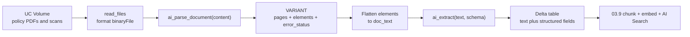
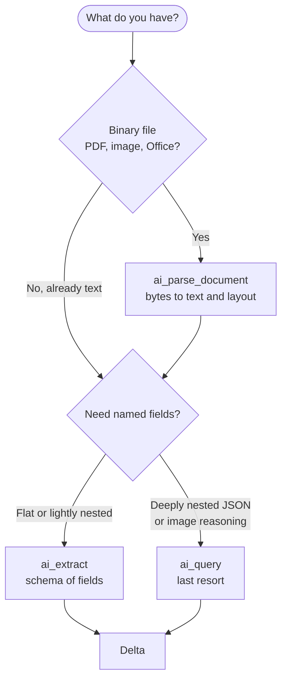

# Document parsing and extraction with AI Functions  ·  Module 03 · Topic 03.8  ·  [Theory + Hands-on]

> You are here: Roadmap Module 03 (Data preparation and chunking for RAG) → Topic 03.8.
> Prereqs: 00.2 (Unity Catalog volumes), 01.3 (embeddings, so you know where this feeds), and it pairs with 03.4 (content extraction from PDFs). Next after this: 03.9 (build the ingestion pipeline as a Lakeflow Spark Declarative Pipeline).

## TL;DR

- `ai_parse_document` turns a binary document (PDF, image, Office file) into structured text: pages, ordered elements (paragraphs, tables, titles, figures), bounding boxes, and per-page error flags. It runs as a plain SQL function.
- `ai_extract` pulls named fields out of text (or straight out of `ai_parse_document` output) using a schema you define. No prompt engineering, no endpoint wiring.
- Chain them: **volume PDF → `ai_parse_document` → text/layout → `ai_extract` → Delta table** that is ready to chunk and embed.
- Both are GA and billed under the `AI_FUNCTIONS` product. They run on **serverless** compute only (serverless SQL warehouse, or serverless notebook/job compute) — not on Pro or Classic SQL warehouses, not on classic clusters.
- This is the SQL-native alternative to writing your own `pypdf` / `unstructured` extraction code (Topic 03.4). It scales with the warehouse and keeps everything inside governed Delta and volumes.

## The problem  [Theory]

Unity Airways has years of passenger-policy documents sitting in a Unity Catalog volume: the contract of carriage, refund rules, baggage allowances, and a pile of scanned fare-rule sheets that started life as faxes. The support RAG assistant needs to answer questions grounded in these documents, so step one is getting clean, chunkable text out of every file — plus a few structured fields (effective date, fare class, refund window) so the pipeline can filter and route.

The files are messy in every way that matters:

- Mixed formats: native PDFs, scanned image-only PDFs, a few DOCX and PPTX exports.
- Multi-column layouts, headers and footers, page numbers, and tables that carry the actual fee schedules.
- Some scans are low-resolution or slightly rotated.

## Why the naive approach fails  [Theory]

The obvious move is a Python script: loop over files, run `pypdf` or `pdfminer`, concatenate the text. That breaks quickly and quietly:

- **Text-only extractors return nothing for scanned PDFs.** An image-only page has no text layer, so `pypdf` hands back an empty string and you never notice until retrieval quality tanks.
- **Reading order gets scrambled.** Multi-column pages come out interleaved; footers and page numbers land in the middle of a paragraph. That noise pollutes every chunk built from it.
- **Tables collapse into word soup.** Fee schedules lose their row/column structure, so the one thing a customer actually asks about ("what is the change fee?") becomes unretrievable.
- **You now own an OCR stack.** Adding Tesseract, tuning DPI, handling rotation, packaging system libraries onto every worker — that is a maintenance project, not a data-prep step.
- **It does not scale on its own.** A single-node Python loop over thousands of documents is slow and hard to parallelize without more engineering.

You want the parsing quality of a document-AI service with the simplicity of a SQL function, and you want the output to stay in Delta so the rest of the RAG pipeline (chunk → embed → index) just reads a table.

## What it is  [Theory]

**AI Functions** are built-in SQL (and PySpark `expr`) functions that call Databricks-hosted Foundation Models directly on table columns. Two of them cover document data prep:

- **`ai_parse_document(content)`** — input is the raw bytes of a document; output is a `VARIANT` describing the document: its pages, an ordered list of layout elements with their text and type, bounding boxes, and any per-page errors. It is Databricks' managed document-parsing model (OCR + layout), so you do not pick or host a model.
- **`ai_extract(content, schema)`** — input is text or a parsed-document `VARIANT`; output is a `VARIANT` of the fields you asked for. You describe *what* you want (field names, optionally types and descriptions) and it returns the values.

Both belong to the "Intelligent Document Processing" group of AI Functions, alongside `ai_classify` (route a document to a category) and `ai_prep_search` (Beta; shape parsed output for RAG).

> 📌 IMPORTANT: These are the recommended, task-specific functions for document prep. Reach for the general-purpose `ai_query` only when you need something they cannot do (for example, deeply nested JSON beyond `ai_extract`'s limits, or image-level reasoning). Do not hand-roll a prompt for parsing or field extraction when a task function exists.

## Why it matters (for a Databricks FDE)

- It removes the single most common RAG blocker at customer POCs: "our documents are PDFs and scans, how do we get text out?" The answer is one SQL function, not a library-selection debate.
- It keeps the whole pipeline governed and in-platform: source bytes in a UC volume, output in a UC Delta table, lineage intact, no data leaving to an external OCR API.
- It scales with compute you already understand (a serverless SQL warehouse or serverless job) instead of a bespoke Python cluster.
- It composes cleanly with the rest of the roadmap: the Delta output of 03.8 is the input to 03.9's pipeline, then Module 04's AI Search index.

## Core concepts  [Theory]

- **Binary ingestion:** you read documents with `read_files(..., format => 'binaryFile')` (SQL) or `spark.read.format("binaryFile")` (Python). Each row has a `path` and a `content` column of type `BINARY` — that `content` is what `ai_parse_document` consumes.
- **Element:** a single piece of the document — a text paragraph, a table, a title, a caption, a figure, a header/footer, a page number, or a footnote. Elements are returned in reading order, which is what fixes the scrambled-column problem.
- **`VARIANT`:** a semi-structured column type (like a governed JSON). Both functions return `VARIANT`; you navigate it with `:` path syntax (`parsed:document:elements`) and cast leaves with `::STRING`.
- **Schema (for `ai_extract`):** a JSON string that names the fields you want. Simple form is a JSON array of names; advanced form adds types (`string`, `integer`, `number`, `boolean`, `enum`), descriptions, and nesting.
- **Composability:** `ai_extract` accepts a `VARIANT` directly, so you can feed it the output of `ai_parse_document` without first flattening to text. In practice you often flatten to text anyway, because chunking needs plain text.
- **Serverless-only, region-limited:** both functions require serverless compute and are available in a subset of regions — verify the feature-region matrix for the customer's workspace before promising them.

## 🗺️ Visual map  [Theory]

The core pipeline — bytes in a volume become structured fields in Delta:



Which function does which job, and when to escape to `ai_query`:



## How it works — deep dive  [Theory]

### `ai_parse_document` — bytes to structured text

- **Signature:** `ai_parse_document(content [, options])`. `content` is `BINARY`. `options` is a `MAP<STRING, STRING>`.
- **Options (verified against the reference page):**
  - `version` — output schema version; `'2.0'` is the current documented value.
  - `imageOutputPath` — a UC volume path where rendered page images are written (useful when you also want the page images for a vision step).
  - `descriptionElementTypes` — which elements get an AI-generated description: `''` (none), `'figure'`, or `'*'` (all; default).
  - `pageRange` — 1-indexed pages/ranges, for example `'1,3,5-10'`.
- **Return shape (`VARIANT`):**

```
{
  "document": {
    "pages":    [ { "id": INT, "image_uri": STRING } ],
    "elements": [ { "id": INT, "type": STRING, "content": STRING,
                    "confidence": DOUBLE,
                    "bbox": [ { "coord": [INT], "page_id": INT } ],
                    "description": STRING } ]
  },
  "error_status": [ { "error_message": STRING, "page_id": INT } ],
  "metadata": { "id": STRING, "version": STRING }
}
```

- **Element `type` values:** `text`, `table`, `figure`, `title`, `caption`, `section_header`, `page_header`, `page_footer`, `page_number`, `footnote`. You can filter noise (drop `page_number`, `page_footer`) before chunking.
- **Formats:** PDF, JPG/JPEG, PNG, TIFF/TIF, DOC/DOCX, PPT/PPTX.
- **Limits:** max file size 100 MB; max 500 pages (a document over 500 pages fails immediately). Dense or low-resolution scans parse slowly.

> ⚠️ GOTCHA: The top-level error field is `error_status` — an **array** of per-page `{error_message, page_id}` objects (empty or absent on a clean parse), **not** a scalar `error`. Because it is an array, test the first element rather than the field itself: keep clean rows with `WHERE parsed:error_status[0] IS NULL` and route failures with `WHERE parsed:error_status[0] IS NOT NULL` to a diagnostics/quarantine table. Some older examples show `parsed:error` — that path is wrong against the current schema.

### `ai_extract` — text to named fields

- **Two versions, and this matters for how you read the output:**
  - **v2.1 (current, recommended):** `ai_extract(content, schema [, options])`. `schema` is a JSON **string** — either a simple array of field names, or an advanced object with types and descriptions.
  - **v1 (legacy):** `ai_extract(content, labels [, options])`, where `labels` is an `ARRAY<STRING>`. This returns a flat `STRUCT` of string fields.
- **`content`:** `VARIANT` or `STRING` — raw text, or the `VARIANT` straight from `ai_parse_document`.
- **`options` (`MAP<STRING, STRING>`):** `version`, `instructions` (task context to improve accuracy), `enableCitations`, `enableConfidenceScores`.
- **v2.1 return shape (`VARIANT`):**

```
{
  "response": {
     "<field_name>": { "value": ..., "citation_ids": [...], "confidence_score": ... },
     ...
  },
  "error_message": null,
  "metadata": { ... }
}
```

- **Schema limits:** types are `string`, `integer`, `number`, `boolean`, `enum`; up to 500 enum values; max 128 fields; up to 7 nesting levels; field names up to 150 characters; input context up to 128,000 tokens.

> ⚠️ GOTCHA: In the current v2.1 output, each extracted field is an **object** (`value`, and optionally `citation_ids` / `confidence_score`), not a bare scalar. So the value path looks like `result:response:effective_date:value::STRING`. The legacy v1 form (a `labels` array) returns flat string fields instead. Always inspect the returned `VARIANT` once and confirm the exact path before you hardcode it across a pipeline.

### Composing the two

`ai_extract` can take the `ai_parse_document` `VARIANT` directly. In a RAG pipeline you usually still flatten elements to a single `doc_text` string first, because chunking (03.9) and embedding (Module 04) work on text. So the pattern is: parse → keep the `VARIANT` for auditing → flatten to text → extract fields from text → write text and fields to Delta.

## How to do it on Databricks  [Hands-on]

Set two learner variables for your governed location, then run four steps. Replace `unity_airways` / `rag` / the volume path with your own.

### Step 1 — Parse every document in the volume

```sql
-- Serverless SQL warehouse (or serverless notebook). Learner-set: catalog + schema + volume.
CREATE OR REPLACE TABLE unity_airways.rag.policy_parsed AS
SELECT
  path,
  ai_parse_document(content) AS parsed          -- BINARY in, VARIANT out
FROM read_files(
  '/Volumes/unity_airways/rag/policy_docs/',
  format => 'binaryFile'
);
```

**How to verify it worked:** every row should have a non-null parse and an empty `error_status`, and you should see real text in the first element.

```sql
SELECT
  path,
  parsed:metadata:version::STRING              AS schema_version,
  parsed:error_status                          AS errors,           -- empty/absent array when clean
  parsed:document:pages[0]:id::INT             AS first_page_id,
  parsed:document:elements[0]:content::STRING  AS first_text_block
FROM unity_airways.rag.policy_parsed
LIMIT 10;
```

If `errors` is non-empty for some rows (`parsed:error_status[0]` is non-null), those files failed (unsupported, corrupt, over 500 pages, or region issue) — keep them in a separate quarantine table to review.

### Step 2 — Flatten elements to clean text

`explode()` does not accept a raw `VARIANT`, so cast the elements array with `variant_get(..., 'ARRAY<VARIANT>')` first. Here we concatenate element text in reading order and drop obvious noise.

```sql
CREATE OR REPLACE TABLE unity_airways.rag.policy_text AS
SELECT
  path,
  concat_ws('\n',
    transform(
      variant_get(parsed, '$.document.elements', 'ARRAY<VARIANT>'),
      e -> variant_get(e, '$.content', 'STRING')
    )
  ) AS doc_text
FROM unity_airways.rag.policy_parsed
WHERE parsed:error_status[0] IS NULL;
```

**How to verify it worked:** `doc_text` should be non-empty and readable for scanned files too (that is the OCR win over `pypdf`).

```sql
SELECT path, length(doc_text) AS chars, left(doc_text, 300) AS preview
FROM unity_airways.rag.policy_text
ORDER BY chars ASC
LIMIT 10;   -- shortest first surfaces near-empty parses to inspect
```

### Step 3 — Extract structured fields

Start with a simple schema (field names only), then move to a typed schema for cleaner values.

```sql
-- Simple schema: a JSON array of field names.
SELECT
  path,
  ai_extract(
    doc_text,
    '["policy_title", "effective_date", "refund_window_days", "fare_class"]'
  ) AS fields
FROM unity_airways.rag.policy_text
LIMIT 5;
```

```sql
-- Typed schema + instructions for better accuracy.
CREATE OR REPLACE TABLE unity_airways.rag.policy_extracted AS
SELECT
  path,
  doc_text,
  ai_extract(
    doc_text,
    '{
       "policy_title":       {"type": "string"},
       "effective_date":     {"type": "string", "description": "effective date as yyyy-mm-dd"},
       "refund_window_days": {"type": "integer"},
       "fare_class":         {"type": "enum", "labels": ["Economy", "Premium", "Business", "First"]},
       "change_fee_usd":     {"type": "number"}
     }',
    map('instructions', 'These are Unity Airways passenger policy documents.')
  ) AS fields
FROM unity_airways.rag.policy_text;
```

### Step 4 — Land a clean Delta table ready for chunking

Pull the fields out of the `VARIANT` into typed columns. Confirm the value path against your output first (see the v2.1 gotcha above).

```sql
CREATE OR REPLACE TABLE unity_airways.rag.policy_structured AS
SELECT
  path,
  doc_text,
  fields:response:policy_title:value::STRING          AS policy_title,
  fields:response:effective_date:value::STRING        AS effective_date,
  fields:response:refund_window_days:value::INT       AS refund_window_days,
  fields:response:fare_class:value::STRING            AS fare_class,
  fields:response:change_fee_usd:value::DOUBLE        AS change_fee_usd,
  fields:error_message::STRING                        AS extract_error
FROM unity_airways.rag.policy_extracted;
```

**How to verify it worked:** counts line up and fields look sane.

```sql
SELECT
  count(*)                                   AS docs,
  count(policy_title)                        AS got_title,
  count_if(extract_error IS NOT NULL)        AS extraction_errors,
  count_if(refund_window_days IS NOT NULL)   AS got_refund_window
FROM unity_airways.rag.policy_structured;
```

`policy_structured` now has clean `doc_text` plus governed metadata columns — exactly what 03.9 chunks and Module 04 embeds.

> 💡 TIP: The same functions work from PySpark with `expr("ai_parse_document(content)")` inside a `withColumn`, which is handy when your pipeline is already a Python job. SQL and PySpark call the identical function; pick whichever matches the surrounding code.

## Worked example — Unity Airways  [Hands-on]

The support team has 1,200 policy files in `/Volumes/unity_airways/rag/policy_docs/`: native PDFs of the contract of carriage, DOCX baggage guides, and roughly 300 scanned fare-rule sheets.

1. **Parse (Step 1).** `ai_parse_document` handles all three formats in one query. The scanned sheets — which `pypdf` returned empty for in the customer's old script — now come back with full text because the managed model runs OCR. Two files land in `error_status`: one is a 640-page merged archive (over the 500-page cap) and one is a digitally signed PDF that parses poorly. Both go to a review table.
2. **Flatten (Step 2).** Elements arrive in reading order, so the two-column contract of carriage no longer interleaves. Filtering out `page_number` and `page_footer` elements keeps chunk noise down.
3. **Extract (Step 3).** A typed schema pulls `effective_date`, `refund_window_days`, and `fare_class`. The `enum` type on `fare_class` keeps values inside the four cabins instead of free text like "coach" vs "economy."
4. **Land (Step 4).** `policy_structured` holds `doc_text` plus the metadata columns. Downstream, retrieval can filter by `fare_class` and only chunk documents whose `effective_date` is current.

The payoff: the messy-PDF blocker is gone, the 300 scans are searchable, and the fee tables survived as structured elements — all without a line of OCR plumbing.

## Uses, edge cases and limitations  [Theory]

| Situation | Guidance |
|---|---|
| Native + scanned PDFs, Office files | Ideal. One `ai_parse_document` call covers PDF, JPG/JPEG, PNG, TIFF, DOC/DOCX, PPT/PPTX. |
| Documents over 500 pages or 100 MB | Not supported — split them first, or they fail immediately. |
| Non-Latin scripts (Japanese, Korean), heavy handwriting, digital signatures | Quality is lower; validate a sample before committing. |
| You need the page images for a vision model | Set `imageOutputPath` to a volume so rendered images are saved. |
| Deeply nested output (arrays of line items beyond 7 levels / 128 fields) | Exceeds `ai_extract` limits — fall back to `ai_query` with `responseFormat`. |
| Near-real-time single-document parsing | AI Functions are batch-oriented; for per-request latency use a serving endpoint / agent instead. |
| Pro or Classic SQL warehouse, classic cluster | Not supported — use a serverless SQL warehouse or serverless notebook/job. |

## Common mistakes and gotchas

- **Wrong compute.** These functions no longer run on Pro/Classic SQL warehouses or classic clusters. If you get a "function not found" or an entitlement error, check that you are on serverless and on a recent runtime.
- **Wrong error path.** `error_status` is an array, so filter on `parsed:error_status[0]` — not the scalar `parsed:error`.
- **`explode` on a `VARIANT`.** Cast first: `variant_get(parsed, '$.document.elements', 'ARRAY<VARIANT>')`.
- **Hardcoding the extract value path.** v2.1 wraps each field as an object (`:value`); v1 returns flat scalars. Inspect once, then commit.
- **NULL inputs.** If `content` or `doc_text` is NULL, the function returns NULL. Filter with `WHERE ... IS NOT NULL` so NULLs do not masquerade as extraction failures.
- **Assuming region availability.** Both functions are region-limited. Confirm the feature-region matrix for the target workspace before you demo.

## 📌 IMPORTANT / 💡 TIP / ⚠️ GOTCHA

> 📌 IMPORTANT: Prefer the task-specific functions (`ai_parse_document`, `ai_extract`, `ai_classify`) for document data prep. `ai_query` is the fallback for cases they cannot handle, not the default.

> 💡 TIP: Keep the parsed `VARIANT` in its own table (Step 1) even after you flatten to text. It is your audit trail — bounding boxes and element types let you explain *why* a chunk says what it says, and you can re-derive text later without re-parsing (re-parsing costs money).

> ⚠️ GOTCHA (docs vs skill/books): Compute and runtime requirements moved. The current docs require **serverless** and list **DBR 18.2+** for AI Functions generally, while the `ai_parse_document` reference page lists **17.3+**. Older material (including the study guide, which predates these functions) says any SQL warehouse and lower runtimes. Teach the current requirement and re-verify the exact minimum at authoring time — it has been rising.

## 📝 Notes

Space for your own notes as you work through the lab.

**5-question self-check:**

1. What are the input and output types of `ai_parse_document`, and which top-level field tells you a page failed to parse?
2. Name three element `type` values you would drop before chunking, and why.
3. What is the difference between the v2.1 `schema` form and the legacy v1 `labels` form of `ai_extract`, and how does it change the way you read a field's value?
4. Why must you cast with `variant_get(..., 'ARRAY<VARIANT>')` before calling `explode` on parsed elements?
5. Which compute can run these functions today, and which cannot? What are the file-size and page limits for `ai_parse_document`?

## How this maps to the certification

- **Exam domain:** Domain 2 — Data preparation for RAG (see Track C, C.3). AI Functions for parsing and extraction are the SQL-native path for turning documents into chunkable, governed text.
- **Book anchor:** 📗 B2 Ch3 covers content extraction from PDFs/images and the "choose the right approach" decision. The books predate `ai_parse_document` / `ai_extract`, so this topic is grounded docs-first — treat the AI Functions docs as the source of truth and the book as background on *why* extraction quality matters for retrieval.

## Sources

- 🌐 Enrich data using AI Functions (overview; compute requirements, function list, billing) — `docs.databricks.com/aws/en/large-language-models/ai-functions` (verified July 2026: serverless-only; DBR 18.2+; `ai_parse_document`/`ai_extract`/`ai_classify` billed under the `AI_FUNCTIONS` product).
- 🌐 `ai_parse_document` reference (signature, options, output schema, element types, formats, 100 MB / 500-page limits, DBR 17.3+, GA) — `docs.databricks.com/aws/en/sql/language-manual/functions/ai_parse_document`.
- 🌐 `ai_extract` reference (v2.1 `schema` vs v1 `labels`, output shape with `value`/`citation_ids`/`confidence_score`, schema limits, 128k-token context, GA) — `docs.databricks.com/aws/en/sql/language-manual/functions/ai_extract`.
- 📗 B2 Ch3 — Data preparation for RAG: content extraction from PDFs/images (background; predates AI Functions).
- 📎 `.claude/skills/genai-teacher/references/naming-conventions.md` §5 (AI Functions; July 2026 snapshot — re-verify live).
