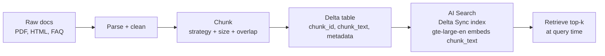
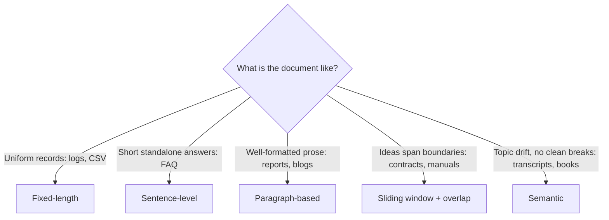

# Chunking strategies: fixed, sentence, paragraph, sliding-window, and semantic  ·  Module 03 · Topics 03.2 (★ cornerstone) + 03.3  ·  [Theory + Hands-on]

> **You are here:** Roadmap Module 03 → 03.2 (cornerstone deep-dive), also folding in 03.3 (overlap and granularity). The module hub has the short version; this page is the deep dive.
> **Prerequisites:** 00.2 Unity Catalog basics, 01.3 Embeddings (what a vector is and why context length matters). Module 03.1 (where chunking fits in the RAG pipeline) is the natural lead-in. You do not need Vector Search built yet — that is Module 04.

## TL;DR
- **Chunking** is splitting documents into small, retrievable units before you embed and index them. It is the first real quality lever in a RAG pipeline, and it is mostly irreversible once the index is built.
- There are five strategies worth knowing: **fixed-length**, **sentence-level**, **paragraph-based**, **sliding-window** (overlap), and **semantic**. Each trades simplicity against how well it preserves meaning.
- **Granularity** (chunk size) and **overlap** (shared text between neighbors) are the two dials. Smaller chunks raise precision but can drop recall; overlap protects ideas that straddle a boundary at the cost of storage and compute.
- Pick chunk size against **two ceilings**: the embedding model's context window (per chunk) and the generation model's context window (k chunks + prompt). For `databricks-gte-large-en` the ceiling is 8192 tokens, but you target far smaller (roughly 200–500 tokens) so embeddings stay sharp.
- On Databricks you land chunks in a **Delta table** (chunk id, chunk text, metadata), then point a **Databricks AI Search** Delta Sync index at that table with managed `databricks-gte-large-en` embeddings.

## The problem
- Unity Airways wants an assistant that answers "Can I get a refund on a Basic Economy fare?" from its own policy documents: the Conditions of Carriage, fare rules, and a customer FAQ.
- You cannot paste every document into the prompt. LLMs have a fixed context window, and stuffing 400 pages of policy into every call is slow, expensive, and drowns the answer in noise.
- So RAG retrieves only the *relevant* pieces at query time. But retrieval can only ever return the pieces you decided to create up front. If a refund rule got split in half when you chopped the document, the retriever can only hand the model half a rule.
- That splitting step is chunking. Get it wrong and every downstream component — embeddings, retrieval, the model's answer — inherits the damage.

## Why the naive approach fails
- The naive move is **fixed-length splitting by character or token count** with no overlap: "cut every 1000 characters." It is one line of code and it is where most people start.
- It ignores sentence and paragraph boundaries, so chunks routinely start or end mid-thought. A refund rule that reads "...refunds are available **within 24 hours** of booking for..." gets cut at "within 24 hours", and the qualifying clause lands in the next chunk.
- At retrieval time the model gets a chunk that looks relevant but is missing its own condition. It then answers confidently and wrong. That is the exact failure mode Unity Airways is trying to avoid.
- Fixed-length is genuinely fine for *uniform* content (log lines, CSV rows) where every slice carries the same kind of information. It breaks on prose, procedures, and legal language, which is most of what an enterprise actually has.

The fix is not one clever splitter. It is choosing a strategy that matches the document, adding overlap where meaning spans boundaries, and sizing chunks against the models that will consume them.

## What it is
- **Plain-language definition:** Chunking is the deliberate division of a source document into smaller units ("chunks") that are each embedded, indexed, and retrieved on their own.
- **Mental model:** you are pre-deciding the *unit of answer*. A chunk is the smallest thing your retriever can hand the model. Design chunks so that one good chunk is enough to answer a typical question.
- Two knobs control everything:
  - **Granularity** — how big each chunk is (tokens, characters, or sentences).
  - **Overlap** — how much text adjacent chunks share, so an idea cut at a boundary still appears whole in a neighbor.

## Why it matters (for a Databricks FDE)
- Chunking is the earliest and cheapest place to fix retrieval quality. Reranking, better prompts, and bigger models cannot recover information you destroyed at the chunking step.
- It is a recurring customer conversation: "our RAG bot gives vague or wrong answers" is very often a chunking problem, not a model problem.
- It is on the certification (Domain 2 — Data preparation for RAG) and it is the direct setup for Module 04 (embeddings and AI Search): the Delta table you produce here is the source table for the vector index.
- The decisions are semi-permanent. Re-chunking means rebuilding the index and re-embedding everything, so getting the strategy right early saves real money and time.

## Core concepts
- **Chunk** — one retrievable unit of text plus its metadata (source, section, ids).
- **Granularity / chunk size** — the amount of content per chunk. Fine-grained = small chunks; coarse = large chunks.
- **Overlap** — text repeated between neighboring chunks so boundary-spanning ideas survive. Comes in two forms: **fixed overlap** (repeat a set number of tokens, e.g., stride of 80 on a 100-token window) and **dynamic overlap** (content-aware boundaries; in modern practice this is usually achieved by semantic splitting rather than literal token repetition).
- **Precision vs recall (retrieval):** *precision* = how much of what you retrieved is relevant; *recall* = how much of the relevant material you managed to retrieve. Smaller chunks tend to raise precision and can hurt recall; larger chunks do the reverse.
- **Context window (two of them):** the **embedding model** window caps how many tokens per chunk get embedded (`databricks-gte-large-en` = 8192; `databricks-bge-large-en` = 512). The **generation model** window caps how many retrieved chunks plus prompt fit in one request.
- **Semantic dilution** — when a chunk is too large, its single embedding vector tries to represent several unrelated ideas at once and gets fuzzy, which lowers retrieval precision. This is why you stay well under the embedding ceiling.

## 🗺️ Visual map

**Where chunking sits in the data-prep pipeline** (this is the diagram mirrored in the HTML explainer):



*Takeaway: chunking happens before embeddings and sets the ceiling on everything after it. The retriever can only return units you created here.*

**Choosing a strategy by document shape:**



*Takeaway: there is no universal best strategy. Match the strategy to the document; a real corpus usually needs more than one.*

## How it works — deep dive

### Fixed-length chunking
- **Mechanism:** cut the text into equal blocks by a set number of tokens, characters, or words, ignoring sentence and paragraph boundaries.
- **Why use it:** simplest and fastest to automate; predictable chunk counts and costs.
- **Best for:** uniform, evenly structured content — log files, CSV rows, sensor records — where each slice carries the same kind of information.
- **Trade-off:** high risk of splitting a definition or a procedure mid-thought, which produces chunks that are hard to interpret alone. Add overlap to soften this.

### Sentence-level chunking
- **Mechanism:** group a fixed number of complete sentences per chunk (say 3–5), so every chunk is grammatically whole.
- **Why use it:** preserves grammatical integrity and keeps each chunk focused and standalone.
- **Best for:** moderately structured content with self-contained statements — news articles, FAQs, knowledge-base entries.
- **Trade-off:** can lose broader context when a single idea spans several sentences or a multi-step instruction gets separated.

### Paragraph-based chunking
- **Mechanism:** treat each paragraph as a chunk, relying on the document's existing paragraph breaks.
- **Why use it:** paragraphs already mark natural units of thought, so chunks stay human-readable and conceptually coherent.
- **Best for:** well-formatted prose — reports, blogs, academic papers, whitepapers.
- **Trade-off:** paragraph sizes vary a lot. Short paragraphs may lack context; long ones can blow past the model's token limit and dilute the embedding.

### Sliding-window chunking (overlap)
- **Mechanism:** create overlapping chunks by moving a window forward by a **stride** smaller than the window. A 500-token window with a 100-token overlap starts each new chunk 400 tokens after the last, so the last 100 tokens repeat.
- **Why use it:** an idea cut at a boundary still appears whole in the neighboring chunk, so retrieval does not lose it.
- **Best for:** question-answering and any content where meaning spans sentences or paragraphs — legal clauses, technical manuals.
- **Trade-off:** overlap multiplies the number of chunks stored and embedded, raising storage and compute cost. More chunks also means a bigger search space.

### Semantic chunking
- **Mechanism:** use NLP/embeddings to detect where the *meaning* shifts — topic changes, discourse markers, heading levels — and split there instead of at a fixed size. In practice a library embeds each sentence and starts a new chunk when consecutive sentences drift apart in vector space (a percentile threshold on the distance).
- **Why use it:** chunks align with actual topics, so each one is contextually rich and self-contained. This is the "dynamic overlap" idea done properly: instead of repeating tokens, you let meaning decide the boundary.
- **Best for:** long-form unstructured content with gradual topic drift — meeting transcripts, doctor-patient notes, books.
- **Trade-off:** most expensive and complex. It embeds a lot of text just to decide boundaries, adding preprocessing time and cost, and it produces variable chunk sizes that complicate indexing.

### Controlling granularity and overlap (Topic 03.3)
- **Granularity is a continuum, not three buckets.** As chunk size grows, retrieval precision tends to drop while context coverage rises and per-query latency falls (fewer, larger chunks to scan). Medium chunks are the usual production default because they balance all three.
- The book's rule of thumb: **small chunks favor precision, large chunks favor coverage/recall**, and **overlap preserves meaning across boundaries**. Start medium and tune from there.
- **How to pick a size against the embedding model:** the model's context window is the hard ceiling. A chunk longer than `databricks-gte-large-en`'s 8192 tokens is silently truncated at embed time, so its tail never gets represented. With `databricks-bge-large-en` that ceiling is only 512 tokens, which forces smaller chunks. But the ceiling is not the target — oversized chunks cause semantic dilution and weaker precision, so target roughly 200–500 tokens and keep a wide margin below the ceiling.
- **Then budget the generation model too.** If you retrieve k = 5 chunks of 500 tokens, that is 2500 tokens of context before you add the system prompt, the question, and room to answer. That sum must fit the generation model's window. Chunk size, overlap, and retrieval depth (k) are tuned together, not independently.

## How to do it on Databricks

> **[Hands-on]** These snippets run on serverless or a DBR ML runtime. Set `CATALOG`/`SCHEMA` to a Unity Catalog location you can write to. Splitters come from the open-source `langchain-text-splitters` package; the Databricks integration package `databricks-langchain` supplies `DatabricksEmbeddings`; the vector index uses the `databricks-vectorsearch` SDK.

**0. Install and set variables:**

```python
%pip install -U langchain-text-splitters langchain-experimental databricks-vectorsearch databricks-langchain tiktoken
dbutils.library.restartPython()
```

```python
CATALOG = "unity_airways"   # a catalog you can write to
SCHEMA  = "rag"             # a schema you can write to
EMBED_ENDPOINT = "databricks-gte-large-en"   # 8192-token context, 1024-dim (verify on Serving > supported models)
```

**1. Recursive / fixed-size splitting (the workhorse).** `RecursiveCharacterTextSplitter` tries the biggest natural boundary first (paragraph), then falls back to line, sentence, and word — so it behaves like paragraph-based chunking that degrades gracefully to fixed-length. `chunk_overlap` gives you the sliding window.

```python
from langchain_text_splitters import RecursiveCharacterTextSplitter

splitter = RecursiveCharacterTextSplitter(
    chunk_size=1200,        # characters (~300 English tokens at ~4 chars/token)
    chunk_overlap=200,      # sliding-window overlap carries context across boundaries
    separators=["\n\n", "\n", ". ", " ", ""],  # paragraph -> line -> sentence -> word
)
chunks = splitter.split_text(policy_text)   # policy_text = one document's cleaned text
print(len(chunks), "chunks")
```

**2. Token-precise sizing (size against the embedding ceiling).** Character counts only approximate tokens. `TokenTextSplitter` counts tokens directly, which is what the embedding and generation windows actually measure.

```python
from langchain_text_splitters import TokenTextSplitter

token_splitter = TokenTextSplitter(chunk_size=300, chunk_overlap=50)  # 300 tokens per chunk
chunks = token_splitter.split_text(policy_text)
```

**How to verify it worked (size check against the 8192 ceiling):**

```python
import tiktoken
enc = tiktoken.get_encoding("cl100k_base")   # a close proxy for token budgeting
lengths = [len(enc.encode(c)) for c in chunks]
print("max:", max(lengths), "avg:", round(sum(lengths)/len(lengths)))
assert max(lengths) < 8192, "chunk exceeds gte-large-en context window; it will be truncated"
```

**3. Semantic chunking (meaning-aware boundaries).** `SemanticChunker` embeds sentences and splits where consecutive sentences drift apart. It uses Databricks-hosted embeddings, so no external key is needed.

```python
from langchain_experimental.text_splitter import SemanticChunker
from databricks_langchain import DatabricksEmbeddings

embeddings = DatabricksEmbeddings(endpoint=EMBED_ENDPOINT)
semantic_splitter = SemanticChunker(embeddings, breakpoint_threshold_type="percentile")
docs = semantic_splitter.create_documents([long_transcript])  # e.g., a support-call transcript
semantic_chunks = [d.page_content for d in docs]
```

**4. Write chunks to a Delta table (the index source).** The table needs a non-null primary key, the text column to embed, and any metadata you will filter or cite on. A deterministic hash makes a stable id.

```python
from pyspark.sql import functions as F

rows = [("conditions_of_carriage", i, c) for i, c in enumerate(chunks)]
df = (
    spark.createDataFrame(rows, ["doc_id", "chunk_index", "chunk_text"])
    .withColumn("chunk_id", F.sha2(F.concat_ws("::", "doc_id", F.col("chunk_index").cast("string")), 256))
    .withColumn("source", F.lit("conditions_of_carriage"))
)

table = f"{CATALOG}.{SCHEMA}.policy_chunks"
df.write.mode("overwrite").saveAsTable(table)

# Delta Sync indexes require Change Data Feed on the source table
spark.sql(f"ALTER TABLE {table} SET TBLPROPERTIES (delta.enableChangeDataFeed = true)")
```

**5. Build a Databricks AI Search Delta Sync index with managed embeddings.** You point the index at the Delta table and name the text column; Databricks embeds it with `gte-large-en` and keeps the index in sync.

```python
from databricks.vector_search.client import VectorSearchClient   # package: databricks-vectorsearch

vsc = VectorSearchClient()
index = vsc.create_delta_sync_index(
    endpoint_name="unity-airways-vs",                 # an existing vector search endpoint
    index_name=f"{CATALOG}.{SCHEMA}.policy_chunks_index",
    source_table_name=table,
    primary_key="chunk_id",
    embedding_source_column="chunk_text",             # the chunk text gets embedded
    embedding_model_endpoint_name=EMBED_ENDPOINT,
    pipeline_type="TRIGGERED",
)
```

**How to verify it worked (does one chunk answer the question?):**

```python
results = index.similarity_search(
    query_text="Can I get a refund on a Basic Economy fare?",
    columns=["chunk_id", "source", "chunk_text"],
    num_results=3,
)
for row in results["result"]["data_array"]:
    print(row[-1], "|", row[2][:160], "...")   # score, then chunk preview
```

If the top chunk contains the *whole* refund rule (condition included), your chunk size and overlap are working. If the condition is missing, increase overlap or move to a coarser, boundary-aware strategy for that document type.

## Worked example (Unity Airways)
Unity Airways has three document types, and no single strategy fits all of them. That is the real lesson.

- **FAQ** ("How do I reset my booking password?") — short, self-contained answers. Use **sentence-level or small chunks (roughly 100–200 tokens)** so a query retrieves exactly the one answer and nothing else. Fine-grained wins here because precision matters and each answer is independent.
- **Conditions of Carriage / fare rules** — dense, cross-referenced legal clauses where "refund eligibility" depends on "fare type" defined three clauses away. Use **paragraph-based chunking with larger chunks (roughly 300–500 tokens) and overlap**, so a clause and its qualifying conditions stay together. Coarse granularity is not just acceptable here, it is necessary.
- **Recorded support-call transcripts** — topics drift from booking to baggage to refunds with no clean breaks. Use **semantic chunking** so each chunk is one topic, and the retriever can surface just the refund discussion without the small talk.

You run the appropriate splitter per document type, write all chunks into the one `policy_chunks` table with a `source` column, and build a single AI Search index over it. The `source` metadata lets you filter or cite later. When a customer disputes an answer, you trace it to the exact chunk that was retrieved and see immediately whether the chunk was complete.

## Uses, edge cases and limitations
| Use it when | Watch out when | Better move |
|---|---|---|
| You need retrieval to return focused, relevant units | The corpus is one document type and you reach for one splitter for everything | Segment by document type; chunk each with the fitting strategy |
| Documents are large and varied | Chunks approach the embedding window (8192 for gte-large-en) | Target 200–500 tokens; keep a wide margin so embeddings stay sharp |
| Ideas span boundaries (contracts, manuals) | You use zero overlap on prose | Add overlap (sliding window) or use semantic chunking |
| Cost and latency matter at scale | You over-chunk with heavy overlap | Fewer, medium chunks; reserve semantic chunking for genuinely messy text |
| You will filter or cite results | You drop metadata during chunking | Carry `source`, `doc_id`, section headers into the chunk row |

## Common mistakes / gotchas
| Mistake | Why it hurts | Better move |
|---|---|---|
| Fixed-length, zero-overlap on prose | Splits definitions and procedures mid-thought; model answers from half a rule | Recursive splitter with overlap, or a boundary-aware strategy |
| Sizing chunks to the embedding ceiling (e.g., 8000 tokens) | Semantic dilution; one vector blurs many ideas; precision falls | Target 200–500 tokens, well under the ceiling |
| Forgetting the generation window | k chunks + prompt overflow the model; retrieval silently truncated | Budget k x chunk_size + prompt against the generation model window |
| No overlap on cross-referenced legal text | A clause loses its condition at the boundary | Overlap, or coarser paragraph chunks that keep the clause whole |
| Semantic chunking everywhere | Expensive; embeds everything twice; slow ingestion | Use it only for messy long-form text; simpler strategies elsewhere |
| Dropping metadata | Can't filter or cite; can't debug a bad answer | Keep `source`/`doc_id`/section on every chunk |

> 📌 **IMPORTANT:** Chunking is the ceiling on RAG quality. The retriever can only ever return the units you create here, so no reranker, prompt, or bigger model can recover an idea you split in half. Fix retrieval quality at the chunking step first.

> 💡 **TIP:** Start medium — around 200–300 tokens with about 10–20% overlap — then measure retrieval with precision, recall, or mean reciprocal rank (MRR) and adjust. Use smaller chunks (100–200 tokens) for FAQ-style facts and larger (300–500) for contracts and policies. Match the dial to the document, not to a global default.

> ⚠️ **GOTCHA:** The book's Example 3-1 (fixed-length) uses `from langchain.text_splitter import CharacterTextSplitter` — current LangChain moved splitters to their own package: `from langchain_text_splitters import ...` (`pip install langchain-text-splitters`). Its **semantic** examples (Examples 3-2 and 3-4) use a different library — **LlamaIndex** (`llama_index`'s `SemanticSplitterNodeParser`) with `OpenAIEmbedding()`. On Databricks, swap the embedder for `DatabricksEmbeddings(endpoint="databricks-gte-large-en")` from `databricks-langchain` and keep everything governed and key-free. Books lag the product; verify imports against current docs.

## 📝 Notes
- _Space for your own notes._

**Self-check (5 questions)**
1. Name the five chunking strategies and give one document type where each is the right default.
2. What is the difference between granularity and overlap, and what does each one trade off in retrieval?
3. `databricks-gte-large-en` has an 8192-token context window. Why would you still target 200–500 token chunks instead of chunks near 8000 tokens?
4. You retrieve k = 6 chunks of 400 tokens each. Which two model windows constrain this, and how do you keep the request from overflowing?
5. Why is choosing zero overlap on a cross-referenced legal contract risky, and what are two fixes?

## How this maps to the certification
- **Domain 2 — Data preparation for RAG** is where this lives. The exam expects you to *apply a chunking strategy for a given document structure* and *select a chunking strategy based on the model and retrieval needs* — exactly the "match strategy to document, size against the context window" reasoning above.
- Exam-focus points to remember (from B2 Ch3): fixed-length is simple but risks breaking semantic meaning; sentence- and paragraph-based preserve linguistic structure; sliding window improves continuity at the cost of storage and compute; semantic prioritizes meaning for unstructured content. Smaller chunks improve precision but may reduce recall; larger chunks improve coverage but add noise; overlap preserves meaning across boundaries; chunk size must fit the model's context window.

## Sources
- 📗 **B2 — *Databricks Certified Generative AI Engineer Associate Study Guide*, Ch 3** ("Chunking Data for RAG"): "Chunking Strategies and When to Use Them" (fixed-length, sentence-level, paragraph-based, sliding window, semantic; Table 3-1 pros/cons), "Controlling Overlap and Granularity" (fixed vs dynamic overlap; TIP on 100–300 token starting range), "Impact of Chunking on Retrieval" (retrieval relevance, response coherence, latency; Table 3-2 chunk-size trade-offs; Figure 3-3), and "Applying Chunking Strategy Based on Model Constraints" (Table 3-3, context-window alignment). Primary source for this topic.
- 🌐 Databricks Docs — Build an unstructured data pipeline for RAG: `docs.databricks.com/aws/en/generative-ai/tutorials/ai-cookbook/quality-data-pipeline-rag` (recommended chunking approaches: fixed-size, paragraph, format-specific/Markdown, semantic; chunks stored in a Delta table backing an AI Search index with managed embeddings).
- 🌐 Databricks Docs — AI Search retrieval quality guide: `docs.databricks.com/aws/en/vector-search/vector-search-retrieval-quality` (how chunking choices affect retrieval quality).
- 🌐 Databricks Docs — Foundation Model APIs supported models: `docs.databricks.com/aws/en/machine-learning/foundation-model-apis/supported-models` (`databricks-gte-large-en` = 8192-token context, 1024-dim; `databricks-bge-large-en` = 512-token context, 1024-dim).
- 🌐 LangChain Docs — text splitters (`langchain-text-splitters` package): `RecursiveCharacterTextSplitter`, `TokenTextSplitter`, `CharacterTextSplitter`; `SemanticChunker` in `langchain-experimental`.
- 🌐 Databricks — `databricks-vectorsearch` SDK: `VectorSearchClient.create_delta_sync_index` with `embedding_source_column` + `embedding_model_endpoint_name` for managed embeddings; Delta Sync requires Change Data Feed on the source table.
