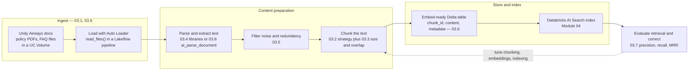
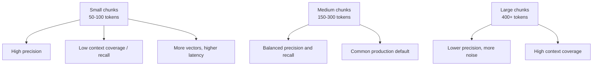

# Data Preparation and Chunking for RAG  ·  Module 03  ·  Topics 03.1–03.9  ·  [Theory + Hands-on]

> **You are here:** Roadmap Module 03 → Data preparation & chunking for RAG (all topics 03.1–03.9). This is the start of the RAG spine (03 → 04 → 05).
> **Prerequisites:** Module 00 (Unity Catalog, Volumes, Delta) and Module 01.3 (embeddings — what they are and why they matter). Next stop after this module is **Module 04 — Embeddings & Databricks AI Search**.

This page is the **module hub**. It carries one numbered entry per topic. Two topics are the module's cornerstones (★) and have their own deep-dive pages:
- **03.2 — Chunking strategies** → `chunking-strategies.md` / `chunking-strategies.html`
- **03.8 — Document parsing with AI Functions** → `ai-parse-extract.md` / `ai-parse-extract.html`

Everything below rides one running use case: **Unity Airways**, an airline building a customer-support knowledge base from policy PDFs and FAQ documents.

---

## TL;DR
- RAG quality is decided **before** a single vector is created. Chunking, cleaning, and structuring the source data set the ceiling on everything downstream.
- **Chunking** breaks big documents into small, self-contained units so retrieval returns the right passage, not a whole manual. The strategy (fixed, sentence, paragraph, sliding-window, semantic) and the **size + overlap** are the two biggest levers.
- Real documents are messy: scanned PDFs, boilerplate headers, cookie banners, repeated footers. You **extract** text with the right library and **filter** the noise before chunking.
- The output of data prep is an **embed-ready Delta table** — one row per chunk, plus metadata (source doc, chunk index, timestamp) — which becomes the source for the Module 04 vector index.
- On Databricks you can do most of this **SQL-natively with AI Functions** (`ai_parse_document`, `ai_extract`) and run the whole ingestion with **Lakeflow Declarative Pipelines** (built on the open-source Spark Declarative Pipelines framework, SDP) — incremental, governed, serverless.

## The problem
- Unity Airways drops 4,000 policy PDFs, scanned refund forms, and an internal FAQ export into a RAG chatbot. In the demo it answers "what's the checked-bag fee?" perfectly.
- In production, an agent asks "Can I get a refund if I miss my connection?" and the bot returns a 12-page fare-rules PDF chunk that buries the answer in the middle, or a chunk that stops mid-sentence at "refunds are not available unless…".
- The retrieval is technically "working" — it returns something similar. But the chunks are the wrong shape, full of headers and page numbers, or split so the meaning is gone. The model can only be as good as the passage it's handed.
- This is **Exam Domain 2 (Data preparation for RAG)** and the most common root cause an FDE finds when a customer says "our RAG app hallucinates."

## Why the naive approach fails
- **"Just embed the whole document."** Whole documents overflow the model's context window and drown the answer in unrelated text. Retrieval returns the document, not the passage.
- **"Split every N characters."** Fixed-length splitting is fast but cuts definitions, procedures, and sentences in half. A chunk that ends at "Step 2: Check the" is useless in isolation.
- **"Feed the raw PDF text."** Scanned PDFs come out as garbled OCR; digital PDFs carry repeated headers, footers, page numbers, and legal boilerplate that dominate similarity search and push out the real content.
- **"One chunk size fits all."** Tiny chunks give high precision but miss context (low recall) and explode the number of vectors to scan. Huge chunks cover everything but dilute relevance. There is a trade-off you have to tune, not guess.
- **"Dump the chunks in a file and move on."** Without a governed, query-ready store you lose incremental updates, lineage, and the ability to re-index only what changed.

## What it is
- **Plain-language definition:** RAG data preparation is the set of steps that turn raw, messy source documents into small, clean, well-labeled text units stored in a query-ready table, so a retriever can hand the model exactly the right context at question time.
- **Mental model:** it is an assembly line — **ingest → parse/extract → clean/filter → chunk → store as Delta → index**. Each station is cheap to get wrong and expensive to debug later, because a bad chunk silently degrades every answer that depends on it.

## Why it matters (for a Databricks FDE)
- Chunking and cleaning are the **cheapest, highest-leverage** fixes for a struggling RAG app — usually before you touch the embedding model, the retriever, or the LLM.
- Customers ask "why does our chatbot miss obvious answers?" The answer is almost always upstream: coarse chunks, unfiltered noise, or a parser that mangled the tables. This module gives you the diagnostic path.
- Databricks has a differentiated story here — **AI Functions** (parse/extract without managing libraries), **Delta** (governed, incremental, time-traveled chunk store), **Unity Catalog** (Volumes for source files, governance for the tables), and **Lakeflow Declarative Pipelines** (one declarative ingestion pipeline). Knowing where each fits is the FDE value-add.
- It is heavily weighted on the certification (**Domain 2**, 📗B2 Ch3).

## Core concepts
- **RAG pipeline** — ingestion → content preparation (clean + chunk) → embedding → vector retrieval → response generation. Data prep is the "content preparation" stage, before embeddings.
- **Chunking** — dividing a document into retrievable units, each ideally one self-contained idea.
- **Chunking strategy** — how you decide the boundaries: fixed-length, sentence-level, paragraph-based, sliding-window (overlap), or semantic (meaning-aware). See 03.2.
- **Granularity** — the size of a chunk (tokens/characters/sentences). **Overlap** — how much adjacent chunks share. See 03.3.
- **Content extraction** — pulling clean text out of PDFs, images, and office docs (text parsing vs OCR). See 03.4.
- **Content filtering** — removing redundancy (boilerplate, repeated headers) and noise (page numbers, HTML tags, watermarks). See 03.5.
- **Embed-ready Delta table** — the output: one row per chunk with metadata, ready to feed a vector index. See 03.6.
- **Retrieval metrics** — precision, recall, and mean reciprocal rank (MRR) that tell you whether your prep is working, and which knob to turn. See 03.7.
- **AI Functions** — SQL-native GenAI functions (`ai_parse_document`, `ai_extract`) that parse and structure documents at scale without pip installs. See 03.8.
- **Lakeflow Declarative Pipelines** — the declarative, incremental way to run the whole ingestion as bronze → silver Delta tables. See 03.9.

## 🗺️ Visual map

**The RAG data-prep pipeline and where each topic fits:**



*Takeaway: data prep is everything left of the AI Search index. Get the shape and cleanliness of the chunks right here, and Module 04's retrieval has something good to work with. The dashed line is the reality — you iterate on chunking based on retrieval metrics.*

**Chunk size is a continuum, not a setting** (this is the single most tested trade-off):



*Takeaway: smaller = sharper but blinkered; larger = fuller but noisier. Start medium (150–300 tokens) and tune with the 03.7 metrics.*

---

## 03.1 RAG pipeline overview — where chunking fits  ·  [Theory]

Retrieval-augmented generation is a **system-level pattern**: instead of relying only on what the model learned in training, you retrieve relevant content at question time and inject it into the prompt. That makes answers grounded and up to date.

A RAG system has distinct stages, and a weakness in any one degrades the whole:
- **Document ingestion** — get the raw files into the platform (for Unity Airways, policy PDFs and FAQ exports landing in a Unity Catalog Volume).
- **Content preparation** — clean and **chunk** the text. This is where Module 03 lives.
- **Embedding generation** — turn each chunk into a vector (Module 04).
- **Vector-based retrieval** — find the chunks most similar to the query (Module 04).
- **Response generation** — the LLM answers using the retrieved chunks (Module 05).

Chunking happens in content preparation, **before** embeddings, and it "shapes what the retrieval system can return." Because everything downstream can only work with the chunks you produce, chunking has a **cascading effect** on retrieval accuracy, latency, and answer quality.

> 📌 **IMPORTANT:** Retrieval can only return a chunk that exists. If a fact is split across two chunks, or buried in a noisy chunk, no amount of embedding-model or LLM tuning downstream will fully recover it. Fix the shape of the data first.

---

## 03.2 ★ Chunking strategies: fixed, sentence, paragraph, sliding-window, semantic  ·  [Theory + Hands-on]

> **This is a module cornerstone.** Full walkthrough (each strategy, runnable code, decision guidance, Unity Airways worked example) is in `chunking-strategies.md` / `chunking-strategies.html`. Summary here.

Not all chunking is equal. Each strategy trades simplicity against how well it preserves meaning:

| Strategy | Best for | Pros | Cons |
|---|---|---|---|
| **Fixed-length** | Logs, structured/CSV data | Simple, fast, predictable | Breaks sentences and context mid-thought |
| **Sentence-level** | Articles, FAQs | Preserves grammar; standalone units | Loses broader context across sentences |
| **Paragraph-based** | Reports, blogs, whitepapers | Human-readable; natural idea boundaries | Paragraph sizes vary a lot |
| **Sliding-window (overlap)** | QA systems, legal/technical docs | Maintains continuity across boundaries | Resource-intensive (more chunks stored) |
| **Semantic** | Books, transcripts, complex docs | Meaning-aware, adaptive boundaries | Complex; needs embeddings/NLP |

- **Fixed-length** splits on a token/character count and ignores boundaries — great for uniform data (server logs), risky for prose (splits a refund procedure mid-step).
- **Sentence** and **paragraph** chunking preserve linguistic structure; ideal for the Unity Airways FAQ, where each Q&A is a self-contained unit.
- **Sliding-window** intentionally overlaps chunks so an idea spanning a boundary still appears whole in an adjacent chunk (good for dense policy language with cross-references).
- **Semantic** uses embeddings/NLP to split at topic shifts. Most powerful for long unstructured content; in practice you use a library rather than hand-rolling it.

> 💡 **TIP:** In production you often **combine** strategies — for example, paragraph-based chunking followed by a sliding window to smooth out variable paragraph lengths. The deep-dive shows this.

> ⚠️ **GOTCHA:** The book's semantic-chunking examples (Examples 3-2 and 3-4) use **LlamaIndex** — `llama_index`'s `SemanticSplitterNodeParser` with `OpenAIEmbedding()`. On Databricks, point the embedder at a **Databricks endpoint** (`databricks-gte-large-en`) or use `DatabricksEmbeddings` from `databricks-langchain` — don't wire a RAG demo to OpenAI keys when a governed in-platform embedding endpoint is available.

---

## 03.3 Controlling overlap and granularity; impact on retrieval  ·  [Theory]

Two knobs decide how content is divided: **granularity** (chunk size) and **overlap** (shared content between adjacent chunks).

**Granularity.** Chunk size determines how much context the model receives.
- Too **large** → the chunk carries unrelated content that distracts the model and dilutes the embedding.
- Too **small** → key context is excluded; retrieval and generation both suffer.
- The ideal size depends on document structure: a **product FAQ** (Unity Airways) suits fine-grained, question-answer-sized chunks; a **legal contract** needs coarser, paragraph-level chunks because clauses cross-reference each other.
- Mind the **context window** — most LLMs accept ~4k–8k+ tokens including the prompt and system instructions. If retrieved chunks don't leave room, they get truncated or dropped.

**Overlap.** Repeating a portion of one chunk in the next preserves continuity when meaning spans a boundary.
- **Fixed overlap** repeats a set number of tokens (e.g., 100-token chunks moving forward 80 tokens = 20-token overlap). Simple; good for uniform data.
- **Dynamic overlap** uses content-aware rules (extend to finish a sentence, stretch to keep a related idea together). In modern RAG this shows up as **semantic** chunking rather than explicit token repetition.

**Impact on retrieval** (the exam's favorite trade-off):
- Smaller chunks → **higher precision**, but **lower recall** and **more vectors to scan** (higher latency).
- Larger chunks → **higher context coverage**, but **lower precision** (more noise) and lower latency.
- **Medium chunks are the common production default.**

> 💡 **TIP:** Start at **150–300 tokens** with a small overlap, then adjust using the retrieval metrics in 03.7. Use larger chunks (300–500 tokens) for interlinked content like contracts/policies, smaller (100–200 tokens) for short distinct facts like FAQs.

---

## 03.4 Content extraction from PDFs and images; choosing the right Python package  ·  [Hands-on]

Enterprise documents arrive as digital PDFs, scanned images, and Office files. Before you can chunk anything, you have to get **clean, readable text** out — and the right tool depends on the document.

| Library / tool | Best used for | Strengths | Limitations |
|---|---|---|---|
| **pdfplumber** | Digitally generated PDFs | Preserves layout, tables, page structure | Fails on scanned/image-only PDFs |
| **PyPDF2** | Simple text extraction | Lightweight and fast | Loses layout; weak on complex docs |
| **pytesseract** (Tesseract OCR) | Scanned PDFs and images | Open-source OCR; broad language support | Sensitive to scan quality and noise |
| **Azure Form Recognizer** | Forms, invoices, structured PDFs | Extracts tables and key-value pairs | Cloud dependency; usage cost |

**The production pattern is layered:** try text-based parsing first (it preserves structure and is cleaner), and fall back to OCR only when the extracted text is empty or unusable. That minimizes cost while keeping quality high.

```python
# Layered extraction: text-first, OCR fallback (book Example 3-10, condensed)
import pdfplumber, pytesseract
from PIL import Image

def extract_text_from_pdf(pdf_path):
    text = ""
    with pdfplumber.open(pdf_path) as pdf:
        for page in pdf.pages:
            page_text = page.extract_text()
            if page_text:                      # digital PDF: keep the clean text
                text += page_text + "\n"
        if not text.strip():                   # scanned PDF: no text came out -> OCR
            text = "\n".join(
                pytesseract.image_to_string(page.to_image().original)
                for page in pdf.pages)
    return text
```

**How to verify it worked:** print the first few hundred characters. Digital PDFs give readable prose; if you see garbled characters, the source was scanned and you needed the OCR branch. For Unity Airways, the typed policy PDFs parse cleanly, but the **scanned refund forms** only yield text through OCR.

> ⚠️ **GOTCHA:** OCR output is often noisy (misread characters, stray markup). Always clean it (03.5) before chunking, or the noise pollutes your embeddings.

> 💡 **TIP:** On Databricks you increasingly don't manage these libraries at all — `ai_parse_document` (03.8) does layout-aware parsing of PDFs, images, and Office docs as a SQL function. Use the open-source libraries when you need full local control; reach for AI Functions for scale and simplicity.

---

## 03.5 Content filtering — removing redundancy and noise  ·  [Theory + Hands-on]

Before chunking, clean the text. Two problems to remove:
- **Redundancy** — repeated boilerplate: duplicated paragraphs, recurring headers, templated disclaimers, legal text on every page.
- **Noise** — non-semantic artifacts: page numbers, HTML tags, timestamps, watermarks, navigation menus, cookie notices, ads from web-scraped pages.

Why it matters: if every Unity Airways help article carries the same nav menu and "last updated" line, those phrases appear in **nearly every chunk**. A query then retrieves chunks matched on boilerplate instead of the actual answer — precision collapses.

```python
# Regex noise removal (book Example 3-6)
import re
def clean_text(text):
    text = re.sub(r'<[^>]+>', '', text)                          # strip HTML tags
    text = re.sub(r'This document is confidential.*?\n', '',
                  text, flags=re.IGNORECASE)                     # repeated disclaimers
    text = re.sub(r'Page \d+ of \d+', '', text)                  # page numbers
    text = re.sub(r'Last updated: .*?\n', '', text)              # timestamps
    return text
```

**How to verify it worked:** diff a cleaned article against the raw one — the boilerplate should be gone and the substantive text intact. Better yet, re-run retrieval after cleaning and watch precision rise (03.7).

> 💡 **TIP:** Always eyeball a handful of source documents **before** writing removal rules. Noise follows implicit, org-specific patterns; a regex tuned to one document set can silently delete real content in another.

> ⚠️ **GOTCHA:** Over-aggressive filtering is its own failure mode. A rule that strips "Section 3.2 …" headers might remove clause labels a legal query depends on. Clean conservatively and check recall didn't drop.

---

## 03.6 Converting to Delta for querying  ·  [Hands-on]

Once text is clean and chunked, store it in a format built for large-scale, low-latency querying: **Delta Lake**. Each chunk becomes a **row**, with metadata alongside it — source document ID, chunk index, timestamp, and (later) the embedding vector.

**Why Delta for a RAG chunk store:**
- **Query efficiency** — predicate pushdown, data skipping/indexing, and caching keep retrieval fast at scale.
- **Incremental updates** — when one policy changes, `MERGE` (upsert) only the affected chunks instead of rewriting the whole corpus. Essential when documents evolve.
- **Auditability and version control** — the transaction log records every change; **time travel** lets you query a prior state for debugging or A/B comparisons across dataset versions.
- **Compatibility** — Delta integrates with MLflow, and it is the source Databricks **AI Search** syncs from (a Delta Sync index reads directly from the table).

```python
# Chunks -> Delta, Unity-Catalog-first (modernized from book Example 3-9)
from pyspark.sql.functions import monotonically_increasing_id, current_timestamp, lit

chunks = ["Chunk 1: How to change a flight...", "Chunk 2: Refund eligibility rules..."]

df = (spark.createDataFrame([(i, c) for i, c in enumerate(chunks)],
                            ["chunk_id", "content"])
        .withColumn("source_doc", lit("unity_airways_policy.pdf"))   # metadata for traceability
        .withColumn("ingested_at", current_timestamp()))

# Write to a governed UC managed table, not a DBFS mount
df.write.format("delta").mode("overwrite").saveAsTable(f"{CATALOG}.{SCHEMA}.ua_rag_chunks")
```

**How to verify it worked:** `SELECT count(*), min(chunk_id), max(chunk_id) FROM {CATALOG}.{SCHEMA}.ua_rag_chunks` and spot-check a row — content should be a clean, self-contained chunk with its metadata populated.

> ⚠️ **GOTCHA:** The book's example writes to a **DBFS mount** (`/mnt/delta/rag_chunks`). On current Databricks, prefer a **Unity Catalog managed table** (`catalog.schema.table`) and keep source files in a **UC Volume**. UC gives you governance, lineage, and the namespace AI Search expects. Treat the book's `/mnt/...` path as legacy.

> 💡 **TIP:** Always include metadata columns (source doc title, chunk number, source URI). They make downstream debugging ("which document did this wrong answer come from?") and metadata-filtered retrieval (Module 04.4) possible.

---

## 03.7 Evaluating retrieval quality; corrective techniques  ·  [Theory + Hands-on]

You can't tune data prep by vibes. Use retrieval metrics computed against a small **labeled validation set** (queries with known-relevant chunk IDs):

| Metric | What it measures | Formula |
|---|---|---|
| **Precision** | Of the chunks retrieved, how many are relevant | relevant retrieved / total retrieved |
| **Recall** | Of all relevant chunks, how many were retrieved | relevant retrieved / total relevant |
| **MRR** (mean reciprocal rank) | How high the first relevant chunk ranks | 1 / rank of first relevant chunk |

MRR matters because the LLM usually sees only the top few chunks — if the first useful chunk is result #5, the answer suffers even though retrieval "found" it.

Treat metrics as **diagnostic signals**, each pointing to a specific fix:

| Metric is low | Likely cause | Corrective action |
|---|---|---|
| **Precision** | Noisy chunks, boilerplate, chunks too broad | Better filtering (03.5); add **reranking**; tighter chunks |
| **Recall** | Chunks too small, coverage gaps, embedding mismatch | Adjust chunk size (03.3); improve ingestion; align embeddings |
| **MRR** | Poor ranking of top results | Tune ranking; apply **cross-encoder reranking** (Module 04.9) |

```python
# Offline retrieval eval on a labeled set (book Example 3-12)
from sklearn.metrics import precision_score
relevant_docs = {"doc1", "doc3", "doc5", "doc6"}      # gold standard
retrieved_docs = ["doc1", "doc2", "doc4", "doc5"]     # what the system returned

true_labels = [1 if d in relevant_docs else 0 for d in retrieved_docs]
predicted_labels = [1] * len(retrieved_docs)
precision = precision_score(true_labels, predicted_labels)
recall = len(set(retrieved_docs) & relevant_docs) / len(relevant_docs)
print("Precision:", round(precision, 2), "Recall:", round(recall, 2))
```

**Corrective techniques** when retrieval has gaps: revisit chunking (switch to semantic/paragraph, add overlap); align/fine-tune the embedding model to your domain vocabulary; enhance the indexing pipeline so tables/figures aren't dropped; **query expansion/rewriting** (synonyms, LLM rephrase, spelling normalization for OCR text); and **hybrid search** (combine BM25 keyword matching with dense vectors) as a safety net when semantic search misses exact terms.

**How to verify it worked:** re-run the same validation set after a change and compare precision/recall/MRR. Do this **offline before deploying** so you don't ship a regression that only surfaces once users complain.

> ⚠️ **GOTCHA:** Don't over-optimize one metric. Pushing precision too high often drops recall (and vice versa). Balance for the use case — high recall for compliance/legal, high precision for customer-facing answers.

---

## 03.8 ★ Document parsing and extraction with AI Functions  ·  [Theory + Hands-on]

> **This is a module cornerstone.** Full walkthrough (`ai_parse_document` output schema, `ai_extract` schemas, `ai_prep_search`, the batch pipeline, Unity Airways worked example) is in `ai-parse-extract.md` / `ai-parse-extract.html`. Summary here.

The book's approach (03.4/03.5) uses open-source libraries you install and manage. Databricks adds a **SQL-native** path: **AI Functions** call foundation models directly on table columns — no endpoint setup, no pip installs, optimized for batch.

- **`ai_parse_document(content)`** — parses layout-aware text, tables, and figure descriptions from unstructured documents — PDF, image, and Office files (e.g. DOCX, PPTX). Input is a **binary** column (read files from a UC Volume with `format("binaryFile")`). Returns a **VARIANT** with `document` (a `pages` array and an `elements` array), `metadata`, and `error_status`. **GA.**
- **`ai_extract(text, ARRAY(...))`** — pulls named fields from text/documents using a schema you define (e.g., `refund_amount`, `booking_reference`, `policy_date`). Returns a struct. **GA.**
- **`ai_prep_search`** — transforms parsed-document output into search-ready chunks for AI Search / RAG. **Beta** — verify before relying on it.

```sql
-- Parse Unity Airways policy PDFs straight from a UC Volume, SQL-native
SELECT path,
       ai_parse_document(content) AS parsed
FROM READ_FILES('/Volumes/unity_airways/rag/landing/policies/', format => 'binaryFile');
```

**How to verify it worked:** the `parsed` column returns a VARIANT; drill in with `parsed:document.pages` and `parsed:error_status`. `error_status` is an **array** of per-page errors, so check its first element rather than the field itself: keep rows whose first error element is null (`WHERE parsed:error_status[0] IS NULL` — a clean parse) and route rows where `error_status[0]` is non-null to a quarantine table before chunking.

> ⚠️ **GOTCHA — runtime requirement (verify):** the two live doc pages disagree on the minimum runtime — the AI Functions overview lists **DBR 18.2+** (or serverless environment v3+), while the `ai_parse_document` reference page lists **DBR 17.3+**. Confirm against your workspace's docs at build time; the deep-dive tracks the exact number. Either way it needs a **recent DBR or serverless** — not a Classic/Pro SQL warehouse.

> 💡 **TIP:** Prefer a **task-specific** function over `ai_query`. Use `ai_parse_document`/`ai_extract` for document prep here; save general `ai_query` for batch inference at scale (Modules 11/16).

---

## 03.9 Building the RAG ingestion pipeline as a Lakeflow Declarative Pipeline  ·  [Hands-on]

Everything above becomes repeatable and production-grade when you run it as a **Lakeflow Declarative Pipeline** — the declarative, incremental way to build Delta tables. (Lakeflow Declarative Pipelines is the successor to **Delta Live Tables / DLT**; existing DLT code still runs.)

Structure the ingestion as a small **medallion** flow:
- **Bronze** — stream raw files in from the UC Volume with **Auto Loader** (`FROM STREAM read_files(...)`). Append-only, adds `_metadata.file_path`.
- **Silver** — parse (`ai_parse_document`), clean (03.5), and chunk (03.2/03.3) into the **embed-ready** table.

```sql
-- Bronze: incrementally ingest raw Unity Airways docs from a UC Volume
CREATE OR REFRESH STREAMING TABLE ua_docs_bronze
AS SELECT *, _metadata.file_path AS source_path, current_timestamp() AS ingested_at
FROM STREAM READ_FILES('/Volumes/unity_airways/rag/landing/', format => 'binaryFile');

-- Silver: parse the raw bytes into structured content (chunking added downstream)
CREATE OR REFRESH STREAMING TABLE ua_docs_parsed
AS SELECT source_path, ai_parse_document(content) AS parsed, ingested_at
FROM STREAM(ua_docs_bronze);
```

**Why Lakeflow Declarative Pipelines for RAG ingestion:** it's **incremental** (only new/changed files are processed — pairs perfectly with Delta upserts), **serverless** by default, **Unity-Catalog-first**, and it gives you automatic lineage and data-quality expectations. When Unity Airways publishes a revised baggage policy, the pipeline reprocesses just that file and the AI Search Delta Sync index picks up the change.

**How to verify it worked:** after a run, check the pipeline status and validate the output tables (row counts > 0, no empty content, `error_status` filtered). The full runnable pipeline lives in the module lab and `03-9-sdp-ingestion.py`.

> 📌 **IMPORTANT:** Use `CREATE OR REFRESH STREAMING TABLE` / `MATERIALIZED VIEW` for Lakeflow Declarative Pipelines — **not** `CREATE OR REPLACE`. In Python, `from pyspark import pipelines as dp` (not the legacy `import dlt`).

> ⚠️ **GOTCHA:** For file ingestion in a streaming table you must use `FROM STREAM read_files(...)` — `FROM read_files(...)` alone is a batch read and fails with "cannot create streaming table from batch query."

---

## Worked example (Unity Airways, end to end)

One knowledge base, all nine topics:

1. **Ingest (03.1, 03.9):** policy PDFs, scanned refund forms, and the FAQ export land in `/Volumes/unity_airways/rag/landing/`. A Lakeflow Declarative Pipelines bronze table streams them in with Auto Loader.
2. **Parse/extract (03.4, 03.8):** typed policy PDFs parse cleanly; scanned refund forms need OCR — or one `ai_parse_document` call handles both. `ai_extract` pulls `booking_reference` and `refund_amount` where useful.
3. **Filter (03.5):** strip the site nav, "last updated" lines, and page numbers so they don't pollute every chunk.
4. **Chunk (03.2, 03.3):** the FAQ gets sentence/paragraph chunks (each Q&A stands alone); dense fare-rules policies get paragraph chunks with a sliding-window overlap so cross-referenced clauses stay together. Start at ~200 tokens.
5. **Store (03.6):** write one row per chunk to `unity_airways.rag.ua_rag_chunks` with `source_doc`, `chunk_id`, `ingested_at`. This Delta table is the embed-ready source.
6. **Index + evaluate (03.7 → Module 04):** Module 04 builds an AI Search Delta Sync index on the table. Run a labeled validation set; if "miss my connection → refund?" has low precision, the fix traces back to noisy chunks or coarse granularity — tune and re-measure.

---

## Uses, edge cases and limitations

| Use it when | Be careful when | Better move |
|---|---|---|
| Documents are large/unstructured | Content is already short, atomic records | Fixed-length or per-record chunks are fine; don't over-engineer |
| Source has scanned pages | OCR output is noisy | Clean aggressively (03.5); consider `ai_parse_document` |
| Corpus changes over time | You rebuild the whole index each time | Delta upserts + Lakeflow Declarative Pipelines incremental; Delta Sync index |
| Exact terms matter (SKUs, codes) | Pure semantic search misses them | Add hybrid (keyword + vector) search (03.7 / Module 04.8) |
| Legal/interlinked content | Chunks too fine split clauses | Coarser paragraph chunks with overlap |

## Common mistakes / gotchas
- Embedding whole documents instead of chunks (context overflow, buried answers).
- Fixed-length splitting on prose that breaks sentences and procedures.
- Skipping the cleaning step, so boilerplate dominates similarity search.
- Guessing chunk size once instead of tuning it against precision/recall/MRR.
- Writing chunks to a DBFS mount instead of a governed **UC table** + **Volume**.
- Using `CREATE OR REPLACE` (standard SQL) instead of `CREATE OR REFRESH` (Lakeflow Declarative Pipelines), or the legacy `import dlt`.
- Wiring semantic chunking to OpenAI keys when `databricks-gte-large-en` is available in-platform.

## 📝 Notes
- _Space for your own notes as you work through the module._

**Self-check (5 questions)**
1. In the RAG pipeline, at which stage does chunking happen, and why does getting it wrong cascade downstream?
2. Name the five chunking strategies and give the best-fit document type for each.
3. Explain the granularity trade-off: what happens to precision, recall, and latency as chunk size grows? Where does the common default sit?
4. You extract text from a mix of typed and scanned PDFs. Describe the layered extraction pattern and why text-first-then-OCR is preferred.
5. Retrieval shows 60% precision and 30% recall. What does each number suggest, and which corrective levers would you pull first?

## How this maps to the certification
- **Domain 2 — Data preparation for RAG** (📗B2 Ch3) is this module end to end: chunking strategies, overlap/granularity, extraction (parsing/OCR/hybrid), noise filtering, converting to Delta, and evaluating retrieval with precision/recall/MRR plus corrective techniques.
- Track C mapping: **C.3 (Domain 2 → Modules 03, 04)**. 03.8 (AI Functions) and 03.9 (Lakeflow Declarative Pipelines) are the Databricks-native additions the exam expects you to recognize even where the book uses open-source libraries.

## Sources
- 📗 B2 — *Databricks Certified Generative AI Engineer Associate Study Guide*, Ch 3 "Preparing and Chunking Data for RAG": RAG Pipeline Overview and Where Chunking Fits; Chunking Strategies and When to Use Them (Table 3-1); Controlling Overlap and Granularity (Tables 3-2, 3-3); Content Filtering and Extraction (Example 3-6, Table 3-4); Converting to Delta Format (Example 3-9); Evaluating Retrieval Quality (Examples 3-11, 3-12; Tables 3-5, 3-6, 3-7).
- 🌐 Databricks Docs — AI Functions overview (`docs.databricks.com/aws/en/large-language-models/ai-functions`): `ai_parse_document`, `ai_extract` (GA), `ai_prep_search` (Beta), runtime requirements.
- 🌐 Databricks Docs — `ai_parse_document` reference (`docs.databricks.com/aws/en/sql/language-manual/functions/ai_parse_document`): syntax, VARIANT output schema (`document`/`pages`/`elements`, `metadata`, `error_status`), runtime.
- 🌐 Databricks Docs — Lakeflow Declarative Pipelines (`docs.databricks.com/aws/en/ldp/`): `CREATE OR REFRESH STREAMING TABLE`, `read_files()` / Auto Loader ingestion.
- 🌐 Databricks Docs — Databricks AI Search (formerly Vector Search) (`docs.databricks.com/aws/en/vector-search/vector-search`): Delta Sync index from a Delta table; SDK remains `databricks-vectorsearch`. (Consumed in Module 04.)
