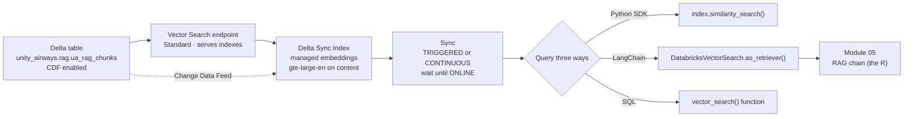
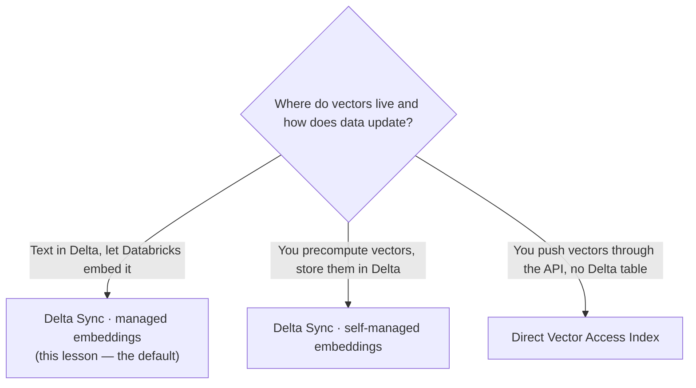

# Creating and querying a Databricks AI Search index  ·  Module 04 · Topic 04.3 (★ cornerstone)  ·  [Theory + Hands-on]

> **You are here:** Roadmap Module 04 → 04.3 (cornerstone deep-dive). The module hub has the short version; this page is the deep dive, and it is the hands-on payoff for the whole module.
> **Prerequisites:** 03.2 Chunking (you need the chunk table), 04.1 Embeddings (what a vector is, 1024 dims, cosine similarity), 04.2 Databricks AI Search overview (endpoint vs index vocabulary). You should already have the Module 03 table `unity_airways.rag.ua_rag_chunks` with Change Data Feed enabled.

## TL;DR
- A **Databricks AI Search index** turns your chunk table into a queryable vector store. You build it in two objects: a **Vector Search endpoint** (the compute that serves indexes) and an **index** (the searchable data structure on top of a Delta table).
- The easiest and most common shape is a **Delta Sync Index with Databricks-managed embeddings**: you point it at `unity_airways.rag.ua_rag_chunks`, name the `content` column, and Databricks embeds every chunk with `databricks-gte-large-en` and keeps the index in sync as the table changes.
- The source Delta table must have **Change Data Feed (CDF) enabled** so the index can track inserts, updates, and deletes. `pipeline_type` picks how sync runs: **TRIGGERED** (you call sync, cheaper) or **CONTINUOUS** (near-real-time, always-on compute).
- You query the same index **three ways**: the Python SDK `index.similarity_search(...)`, a LangChain `DatabricksVectorSearch(...).as_retriever()`, and the SQL `vector_search()` function. All three hit the identical index.
- The SDK is still **`databricks-vectorsearch`** (`from databricks.vector_search.client import VectorSearchClient`) even though the product is now called AI Search. The retriever you build here is handed straight to Module 05, where it becomes the "R" in a RAG chain.

## The problem
- Unity Airways has its policy corpus chunked and landed in one governed Delta table, `unity_airways.rag.ua_rag_chunks`. Each row is a chunk: `chunk_id`, `content`, `source_doc`, `chunk_index`, `ingested_at`.
- A table full of text is not searchable by meaning. `SELECT ... WHERE content LIKE '%refund%'` finds the word "refund" but misses a chunk that says "money back within 24 hours" — different words, same intent.
- The assistant needs to answer "Can I get a refund on a Basic Economy fare?" by finding the *semantically* closest chunks, not the ones that happen to share keywords.
- That is what an AI Search index does: it stores an embedding vector per chunk and, at query time, returns the chunks whose vectors are nearest to the question's vector.

## Why the naive approach fails
- The naive move is to **compute embeddings yourself in a notebook, hold them in a pandas DataFrame or a Python list, and loop over them with cosine similarity** at query time. It works in a demo with 50 chunks.
- It falls apart on a real corpus:
  - **No persistence.** The vectors live in a notebook session. Restart the cluster and they are gone; every app instance recomputes them.
  - **Linear scan.** Brute-force cosine over hundreds of thousands of vectors is slow. Vector indexes use approximate nearest neighbor (ANN) structures to search in milliseconds.
  - **No freshness.** When a policy PDF changes and you re-chunk, your hand-rolled store has no idea. You rebuild everything by hand.
  - **No governance.** The vectors sit outside Unity Catalog, so you lose lineage, access control, and the ability to share the index across teams.
- AI Search fixes all four: it persists the index, does ANN search, keeps the index synced to the Delta table through Change Data Feed, and governs the index as a Unity Catalog object.

## What it is
- **Plain-language definition:** a Databricks AI Search index is a managed, governed copy of your text data stored as vectors, kept in sync with a source Delta table, and queryable by semantic similarity.
- Two objects, and beginners conflate them:
  - **Endpoint** — the compute resource that hosts and serves one or more indexes. You create it once and reuse it. Think of it as the "server."
  - **Index** — the searchable structure built over one Delta table. Many indexes can live on one endpoint. Think of it as one "table" on that server.
- **Delta Sync Index with managed embeddings** is the default: Databricks reads your text column, calls the embedding endpoint for you, writes the vectors, and re-syncs when the source table changes. You never hold a vector yourself.

## Why it matters (for a Databricks FDE)
- This is the retrieval engine under every RAG demo, Knowledge Assistant, and agent-with-tools you will build or troubleshoot for a customer.
- "Our bot can't find the right document" is usually one of three things you own here: wrong index type, an index that never finished syncing, or querying columns that were not synced. Knowing the object model lets you diagnose fast.
- It is squarely on the certification (Domain 3 — Application development / retrieval) and it is the direct input to Module 05 (build the RAG chain) and Module 10 (Agent Bricks / apps).
- The choices are cheap to get right and expensive to get wrong: an index over the wrong column, or a Standard endpoint where you needed Storage-optimized, means a rebuild.

## Core concepts
- **Vector Search endpoint** — compute that serves indexes. Types: **Standard** (low latency, real-time apps) and **Storage-optimized** (>1B vectors, cheaper at scale, higher latency). Creation is asynchronous; you wait for `ONLINE`.
- **Index types (three):**
  - **Delta Sync Index, managed embeddings** — you give text; Databricks embeds and syncs. (This lesson.)
  - **Delta Sync Index, self-managed embeddings** — you precompute vectors into a column; Databricks syncs them.
  - **Direct Vector Access Index** — no Delta table; you push and delete vectors through the API yourself. For real-time or streaming writes.
- **Managed embeddings** — Databricks calls the embedding model (`databricks-gte-large-en`, 1024-dim, 8192-token context) so indexing and query-time embedding always use the *same* model. Mismatched embed models silently wreck relevance.
- **Change Data Feed (CDF)** — a Delta table property that records row-level inserts/updates/deletes. A Delta Sync Index **requires** it on the source table so it can incrementally re-embed only what changed.
- **`pipeline_type`** — **TRIGGERED** (sync runs when you call it; compute spins up, processes, spins down; cheapest for batch updates) vs **CONTINUOUS** (a streaming pipeline keeps the index fresh within seconds; always-on compute, higher cost).
- **`primary_key`** — the unique row id the index uses to add/replace/delete vectors (`chunk_id` for us).
- **`embedding_source_column`** — the text column to embed (`content`). For self-managed you instead give `embedding_vector_column` + `embedding_dimension`.
- **Similarity search** — embed the query with the same model, compare to stored vectors, return top `num_results`. Each result carries a similarity score.

## 🗺️ Visual map

**Create → sync → query, and where the retriever goes next** (mirrored in the HTML explainer):



*Takeaway: one index, three front doors. CDF is the wire that keeps the index honest as the table changes.*

**Choosing an index type:**



*Takeaway: start with managed Delta Sync. Reach for self-managed only when you need a custom or external embedding model, and Direct Access only when you need to write vectors in real time.*

## How it works — deep dive

### The endpoint (the server) [Theory]
- An endpoint is a compute resource that hosts indexes. You do not build one per index — you build one per environment or team and put several indexes on it.
- **Standard** endpoints target low-latency, interactive retrieval (real-time apps, agents). **Storage-optimized** endpoints handle very large corpora (>1B vectors) more cheaply, trading a little latency.
- Creation is **asynchronous**. `create_endpoint(...)` returns before the endpoint is ready; you poll `get_endpoint(...)` for state `ONLINE`, or use the blocking helper `create_endpoint_and_wait(...)`.

### The Delta Sync Index with managed embeddings [Theory]
- You hand the index four things: the **source table**, the **primary key**, the **text column** to embed, and the **embedding model endpoint**. Databricks does the rest.
- On creation it runs an **initial sync**: it reads the table, embeds every row's `content` with `databricks-gte-large-en`, and builds the ANN structure. Querying before this finishes returns empty or partial results.
- Because embeddings are managed, the **same model** is used to embed the chunks and (later) each query. That consistency is the single biggest lever on relevance, and managed mode removes the chance to get it wrong.

### Why Change Data Feed is required [Theory + Hands-on]
- A Delta Sync Index does not re-embed the whole table on every change — that would be wasteful. It reads the **Change Data Feed** to find exactly which rows were inserted, updated, or deleted, then re-embeds only those.
- So the source table must have `delta.enableChangeDataFeed = true` **before** (or when) you build the index. The Module 03 table `ua_rag_chunks` already has it on; if it did not, index creation would fail with a CDF error.
- Verify with: `SHOW TBLPROPERTIES unity_airways.rag.ua_rag_chunks (delta.enableChangeDataFeed)`.

### TRIGGERED vs CONTINUOUS [Theory]
| | TRIGGERED | CONTINUOUS |
|---|---|---|
| How sync runs | You call `index.sync()` (or a job does) | Streaming pipeline, always on |
| Freshness | As fresh as your last sync | Seconds behind the table |
| Compute cost | Spins up, works, spins down | Sustained compute |
| Use when | Corpus updates in batches (nightly re-chunk) | Docs change constantly and staleness hurts |
- For Unity Airways policy docs that change occasionally, **TRIGGERED** is the right default. Move to CONTINUOUS only if a customer genuinely needs near-real-time freshness and will pay for the standing compute.

### The three query paths [Hands-on]
- **Python SDK `similarity_search`** — lowest-level, returns a dict you parse. Best for notebooks, batch jobs, and custom Python agents.
- **LangChain retriever** — wraps the index in a standard LangChain `VectorStore`/`Retriever`. Best when you are assembling a chain (Module 05) and want the retriever to drop into `RetrievalQA` or an LCEL pipeline.
- **SQL `vector_search()`** — a table-valued function you call from any SQL surface (a query, a view, a dashboard, an `ai_query` batch job). Best for analysts and SQL-native pipelines.
- All three embed the query with the index's model and return the top matches plus a score. They are three doors into one index, not three indexes.

## How to do it on Databricks

> **[Hands-on]** Runs on serverless or a DBR ML runtime with MLflow ≥ 3.1. You need write access to the `unity_airways.rag` schema and permission to create a Vector Search endpoint. The Module 03 table `ua_rag_chunks` already exists with CDF enabled.

**0. Install and set variables:**

```python
%pip install -U databricks-vectorsearch databricks-langchain
dbutils.library.restartPython()
```

```python
CATALOG = "unity_airways"
SCHEMA  = "rag"
SOURCE_TABLE   = f"{CATALOG}.{SCHEMA}.ua_rag_chunks"          # chunk_id, content, source_doc, chunk_index, ingested_at
INDEX_NAME     = f"{CATALOG}.{SCHEMA}.ua_rag_chunks_index"
ENDPOINT_NAME  = "unity-airways-vs"
EMBED_ENDPOINT = "databricks-gte-large-en"                    # 1024-dim, 8192-token context
```

**1. Confirm Change Data Feed is on the source table** (a Delta Sync Index needs it):

```python
# Should return delta.enableChangeDataFeed = true. If missing, turn it on:
spark.sql(f"ALTER TABLE {SOURCE_TABLE} SET TBLPROPERTIES (delta.enableChangeDataFeed = true)")
spark.sql(f"SHOW TBLPROPERTIES {SOURCE_TABLE} (delta.enableChangeDataFeed)").show(truncate=False)
```

**2. Create the Vector Search endpoint** (Standard). Creation is asynchronous; the `_and_wait` helper blocks until it is `ONLINE`:

```python
from databricks.vector_search.client import VectorSearchClient   # package: databricks-vectorsearch

vsc = VectorSearchClient()   # picks up notebook/workspace auth automatically

# Create once and reuse. STANDARD = low latency; STORAGE_OPTIMIZED for >1B vectors.
if not vsc.endpoint_exists(ENDPOINT_NAME):
    vsc.create_endpoint_and_wait(name=ENDPOINT_NAME, endpoint_type="STANDARD")
```

**3. Create the Delta Sync Index with managed embeddings.** You name the `content` column and the embedding model; Databricks embeds every chunk and keeps the index synced:

```python
index = vsc.create_delta_sync_index_and_wait(
    endpoint_name=ENDPOINT_NAME,
    index_name=INDEX_NAME,
    source_table_name=SOURCE_TABLE,
    primary_key="chunk_id",                       # unique row id used to add/replace/delete vectors
    embedding_source_column="content",            # THIS column gets embedded
    embedding_model_endpoint_name=EMBED_ENDPOINT, # managed embeddings: Databricks calls gte-large-en
    pipeline_type="TRIGGERED",                    # you call .sync(); cheaper than CONTINUOUS
)
```

**How to verify it worked (index is online):**

```python
# create_delta_sync_index_and_wait already blocked until the first sync finished.
# To re-fetch a handle later and confirm readiness:
index = vsc.get_index(endpoint_name=ENDPOINT_NAME, index_name=INDEX_NAME)
index.wait_until_ready()                 # blocks until ONLINE
print(index.describe()["status"])        # inspect detailed status
```

**4. Re-sync after the table changes** (TRIGGERED indexes do not auto-update):

```python
# After a nightly re-chunk writes new rows into ua_rag_chunks:
index.sync()   # reads Change Data Feed, embeds only new/changed chunks, applies deletes
```

**5a. Query — Python SDK `similarity_search`:**

```python
results = index.similarity_search(
    query_text="Can I get a refund on a Basic Economy fare?",
    columns=["chunk_id", "source_doc", "content"],   # only columns you ask for come back
    num_results=5,
)
for row in results["result"]["data_array"]:
    # row is [chunk_id, source_doc, content, score] — score is always last
    print(round(row[-1], 3), "|", row[1], "|", row[2][:120], "...")
```

**5b. Query — LangChain retriever** (this is the object handed to Module 05):

```python
from databricks_langchain import DatabricksVectorSearch

# For a managed-embeddings index, DatabricksVectorSearch auto-detects the embed model.
vector_store = DatabricksVectorSearch(
    endpoint=ENDPOINT_NAME,
    index_name=INDEX_NAME,
    columns=["chunk_id", "source_doc", "content"],
)
retriever = vector_store.as_retriever(search_kwargs={"k": 5})

docs = retriever.invoke("Can I change my Basic Economy booking?")
for d in docs:
    print(d.metadata.get("source_doc"), "|", d.page_content[:120], "...")
```

**5c. Query — SQL `vector_search()` function** (any SQL surface; DBR/SQL warehouse):

```sql
SELECT *
FROM vector_search(
  index => 'unity_airways.rag.ua_rag_chunks_index',
  query_text => 'What is the checked baggage allowance on Basic Economy?',
  num_results => 5
);
-- Returns your synced columns plus a similarity score column.
-- (Databricks Runtime 15.2 and below use `query =>` instead of `query_text =>`.)
```

**How to verify retrieval is good (not just working):** read the top chunk. If it contains the *whole* answer (rule plus its condition), your chunking from Module 03 and this index are in good shape. If the top chunks are all near-duplicates or off-topic, revisit chunk size/overlap upstream — the index faithfully returns whatever you indexed.

### Briefly: the other two index types [Theory + Hands-on]
- **Self-managed embeddings (Delta Sync).** You precompute vectors into an `embedding ARRAY<FLOAT>` column (e.g., using a custom or external model), then build the index over that column instead of the text column:

```python
vsc.create_delta_sync_index(
    endpoint_name=ENDPOINT_NAME,
    index_name=f"{CATALOG}.{SCHEMA}.ua_rag_chunks_sm_index",
    source_table_name=f"{CATALOG}.{SCHEMA}.ua_rag_chunks_embedded",  # has your embedding column
    primary_key="chunk_id",
    embedding_vector_column="embedding",   # you filled this in yourself
    embedding_dimension=1024,              # must match your model
    pipeline_type="TRIGGERED",
)
```
Use it when you need an embedding model Databricks does not host, or must match an existing offline embedding pipeline. You own the "same model for index and query" discipline yourself.

- **Direct Vector Access Index.** No Delta table and no sync — you push and delete vectors through the API. Good for real-time or streaming writes where waiting for a Delta sync is too slow:

```python
index = vsc.create_direct_access_index(
    endpoint_name=ENDPOINT_NAME,
    index_name=f"{CATALOG}.{SCHEMA}.ua_rag_direct_index",
    primary_key="chunk_id",
    embedding_dimension=1024,
    embedding_vector_column="embedding",
    schema={"chunk_id": "string", "content": "string",
            "source_doc": "string", "embedding": "array<float>"},
)
index.upsert([
    {"chunk_id": "c1", "content": "…", "source_doc": "faq", "embedding": [0.01, 0.02, "…1024 floats…"]},
])
```

## Worked example (Unity Airways)
- The policy corpus is chunked and sitting in `unity_airways.rag.ua_rag_chunks` (from Module 03), CDF on, one row per chunk with `content`, `source_doc`, `chunk_index`, `ingested_at`.
- You create one endpoint, `unity-airways-vs`, and one managed Delta Sync Index, `ua_rag_chunks_index`, embedding `content` with `databricks-gte-large-en`, keyed on `chunk_id`, `pipeline_type="TRIGGERED"`.
- A customer asks "Can I get a refund on a Basic Economy fare?" All three query paths return the same top chunks — the refund clause from the Conditions of Carriage and the matching fare-rule chunk — each with a similarity score and its `source_doc` so you can cite it.
- Overnight, legal updates the fare-rules PDF. Your re-chunk job overwrites the affected rows in `ua_rag_chunks`; you call `index.sync()`; the index re-embeds only those rows via CDF. Retrieval is current again without a full rebuild.
- Tomorrow, Module 05 takes the `retriever` object from 5b, stuffs the top chunks into a prompt, and sends it to a chat model — the "R" and the "G" of RAG connected.

## Uses, edge cases and limitations
| Use it when | Watch out when | Better move |
|---|---|---|
| You have a governed chunk table and want semantic retrieval | You forgot CDF on the source table | `ALTER TABLE … SET TBLPROPERTIES (delta.enableChangeDataFeed = true)` before creating the index |
| Text lives in Delta and you want zero embedding plumbing | You need a model Databricks does not host | Self-managed embeddings Delta Sync |
| Corpus updates in batches | You need sub-second freshness on constant writes | CONTINUOUS pipeline, or Direct Vector Access |
| One endpoint, many indexes across a team | You spin up an endpoint per index | Reuse one endpoint; indexes are cheap, endpoints are compute |
| You will cite results | You only sync the text column | Include `source_doc`/`chunk_id` in `columns` so they come back with results |
| Real-time vector writes (streaming ingest) | You force it through Delta Sync and fight latency | Direct Vector Access Index with `upsert` |

## Common mistakes / gotchas
| Mistake | Why it hurts | Better move |
|---|---|---|
| Querying before the index is `ONLINE` | Empty or partial results that look like a "no match" bug | `index.wait_until_ready()` / use the `_and_wait` create helpers |
| Expecting a TRIGGERED index to auto-update | Stale answers after the table changed | Call `index.sync()` (or schedule it) after each batch write |
| Missing Change Data Feed on the source | Index creation fails, or sync cannot track changes | Enable CDF on the Delta table up front |
| Asking for columns you did not sync | "Column not found" or missing fields in results | Request only synced columns; include everything you need to cite |
| Different embed model for index vs query | Vectors live in different spaces; relevance collapses | Managed embeddings guarantee one model; with self-managed, enforce it yourself |
| Installing `databricks-ai-search` / using `AISearchClient` | Those do not exist; the rebrand did not rename the package | `pip install databricks-vectorsearch`; `from databricks.vector_search.client import VectorSearchClient` |
| One endpoint per index | Wastes compute and quota | Reuse a single endpoint for many indexes |

> 📌 **IMPORTANT:** An AI Search index is only ever as good as the chunks under it. The index reliably returns the nearest vectors to a query, so a bad answer is almost always upstream — chunking (Module 03) or the wrong index/columns — not the search itself. Debug retrieval by reading the top chunk before you touch the model.

> 💡 **TIP:** Build the endpoint once per environment and reuse it. Start every index as **managed embeddings, TRIGGERED** — it is the cheapest, most governed default — and only move to self-managed or CONTINUOUS when a concrete requirement forces it. Always put `source_doc` and `chunk_id` in your query `columns` so every retrieved chunk is citable.

> ⚠️ **GOTCHA:** The Study Guide (B2 Ch9, Examples 9-1 to 9-4) teaches a **simplified, conceptual** client — `client.create_index(index_type="managed", delta_table_name=…)` and `client.query(index_name=…, query_text=…, k=5)` — and even says "exact client APIs may vary by workspace configuration." The **real** `databricks-vectorsearch` SDK is different: `vsc.create_delta_sync_index(source_table_name=…, embedding_source_column=…, embedding_model_endpoint_name=…, pipeline_type=…)` and `index.similarity_search(query_text=…, columns=[…], num_results=…)`. Teach the real API. The book's `k=` is `num_results=`, and there is no `index_type="managed"` string — you pick the type by calling `create_delta_sync_index` vs `create_direct_access_index`.

## 📝 Notes
- _Space for your own notes._

**Self-check (5 questions)**
1. What is the difference between a Vector Search endpoint and an index, and why do you usually create one endpoint but many indexes?
2. Name the three index types and give one situation where each is the right choice.
3. Why must the source Delta table have Change Data Feed enabled, and what does the index use it for?
4. `pipeline_type="TRIGGERED"` vs `"CONTINUOUS"`: what does each cost and when would you pick CONTINUOUS?
5. You ask for `columns=["chunk_id", "content"]` in `similarity_search`; the result rows have a fourth value. What is it, and where does it sit in the row?

## How this maps to the certification
- **Domain 3 — Application development** (retrieval and RAG assembly) is the home for this topic. The exam expects you to create a Vector Search index over a Delta table, choose managed vs self-managed embeddings and the right index type, and query it — including recognizing that the same embedding model must be used for indexing and querying.
- Exam-focus points (from B2 Ch9): an index needs a primary key and an embedding column of the correct dimension; managed indexes refresh from the Delta table while direct-access indexes depend on your ETL; check readiness with index-metadata operations before querying; and the `columns` argument controls what a query returns. Remember the conceptual-vs-real API gap in the gotcha above.

## Sources
- 📗 **B2 — *Databricks Certified Generative AI Engineer Associate Study Guide*, Ch 9** ("Building RAG with Vector Search"): "Creating a basic Vector Search index" (Example 5-8 / 9-1, `VectorSearchClient`), "Index creation essentials and best practices" (primary key + embedding column, readiness via `list_indexes()`/`get_index()`, managed vs direct-access lifecycle), and "Querying a Vector Search Index" (Examples 9-3/9-4, `columns` + `k` + metadata filters). Note: the book's client is simplified and self-flagged as approximate — see the ⚠️ GOTCHA.
- 🌐 Databricks Python SDK reference — `databricks-vectorsearch` (`api-docs.databricks.com/python/vector-search`): confirms `VectorSearchClient.create_endpoint` / `create_endpoint_and_wait`, `create_delta_sync_index` / `create_delta_sync_index_and_wait`, `create_direct_access_index`, `get_index`; and `VectorSearchIndex.similarity_search`, `sync`, `upsert`, `wait_until_ready`. Verified live.
- 🌐 Databricks Docs — Databricks AI Search (formerly Vector Search): `docs.databricks.com/aws/en/vector-search/vector-search` (endpoint types Standard vs Storage-optimized; index types Delta Sync managed/self-managed and Direct Vector Access; Delta Sync requires Change Data Feed; `pipeline_type` TRIGGERED vs CONTINUOUS).
- 🌐 Databricks Docs — SQL `vector_search()` table-valued function: `docs.databricks.com/…/sql/language-manual/functions/vector_search` (`index =>`, `query_text =>` / `query_vector =>`, `num_results =>`; DBR ≤ 15.2 uses `query =>`). Verified live.
- 🌐 Databricks — `databricks-langchain` integration: `DatabricksVectorSearch` and `.as_retriever()`; `DatabricksEmbeddings`. Import is `from databricks_langchain import …` (not `langchain-databricks`).
- 🧭 Naming cross-check: `.claude/skills/genai-teacher/references/naming-conventions.md` §3 (AI Search rebrand; SDK still `databricks-vectorsearch`; no `databricks-ai-search`/`AISearchClient`) and §5 (`vector_search` SQL function is GA).
