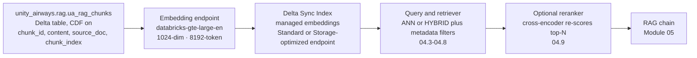
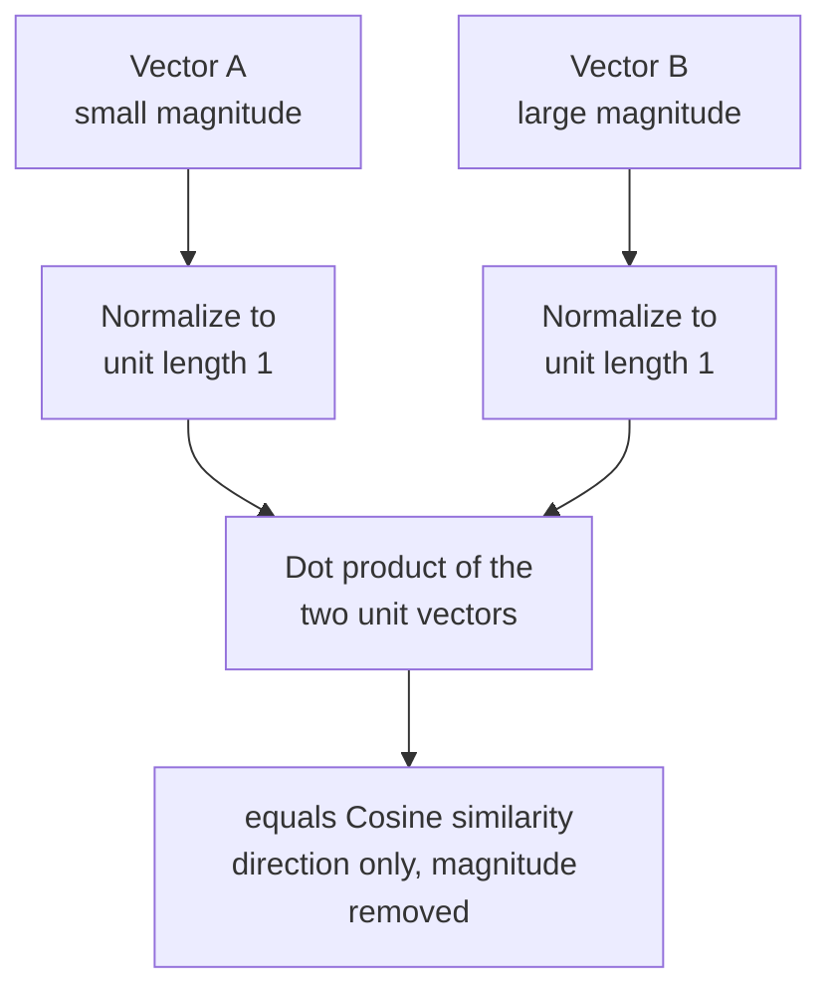

# Embeddings and Databricks AI Search  ·  Module 04  ·  Topics 04.1–04.9  ·  [Theory + Hands-on]

> **You are here:** Roadmap Module 04 → Embeddings and Databricks AI Search (all topics 04.1–04.9). This is the middle of the RAG spine (03 → **04** → 05).
> **Prerequisites:** Module 03 (the embed-ready Delta table `unity_airways.rag.ua_rag_chunks` with Change Data Feed enabled) and Module 01.3 (what embeddings are). Next stop after this module is **Module 05 — Building and versioning a RAG chain**, which consumes the retriever this module hands off.

This page is the **module hub**. It carries one numbered entry per topic. Two topics are the module's cornerstones (★) and have their own deep-dive pages:
- **04.3 — Creating and querying a Vector Search index** → `create-query-index.md` / `create-query-index.html`
- **04.9 — Reranking retrieved results** → `reranking.md` / `reranking.html`

Everything below rides one running use case: **Unity Airways**, the airline whose policy PDFs and FAQ we chunked in Module 03. This module turns those chunks into a searchable index and hands a **retriever** to the RAG chain in Module 05.

> 📌 **Product name:** the product is **Databricks AI Search** (formerly Databricks Vector Search / "Mosaic AI Vector Search"). It is **GA**. The Python SDK package, however, is still **`databricks-vectorsearch`** — there is no `databricks-ai-search` package and no `AISearchClient` class. This is the single most common naming trap in the module.

---

## TL;DR
- **AI Search** stores the embedding of every chunk and, at query time, returns the chunks whose vectors are closest to the query's vector. Closeness is a **similarity metric** — cosine (direction) or dot-product (direction plus magnitude); once vectors are normalized the two are identical.
- The **embedding model** decides how good that closeness is. On Databricks the safe default is **`databricks-gte-large-en`** (1024-dimensional vectors, 8192-token context) — pick it first and make sure your chunks fit its context length.
- The workhorse index is a **Delta Sync Index with managed embeddings**: point it at `ua_rag_chunks`, name the text column and the embedding endpoint, and Databricks embeds and keeps the index in sync as the Delta table changes (Change Data Feed makes that incremental).
- You query the index with **ANN** (semantic) or **HYBRID** (semantic plus keyword) search, optionally **filter on metadata** (e.g. only refund policies), and can add a **reranker** as a second stage to push the single most relevant chunk to the top.
- The module's output is a **retriever object** — `DatabricksVectorSearch(...).as_retriever()` from the **`databricks-langchain`** package — that Module 05 drops straight into a RAG chain.

## The problem
- Module 03 left Unity Airways with a clean Delta table, `unity_airways.rag.ua_rag_chunks`: one row per chunk, columns `chunk_id, content, source_doc, chunk_index, ingested_at`. That table cannot answer a question. It is just rows of text.
- A support agent types "Can I rebook for free if my connection is cancelled?" There is a chunk that answers it — but it says "involuntary re-accommodation" and never uses the words "rebook" or "free". A plain `WHERE content LIKE '%rebook%'` finds nothing.
- The system needs to match on **meaning**, not on shared words, and it needs to do that over hundreds of thousands of chunks in tens of milliseconds, staying fresh as policies change.
- That is what an AI Search index does — and getting the embedding model, index type, endpoint, and query mode right is the difference between a retriever that feeds the LLM the right passage and one that quietly hands it the wrong one.

## Why the naive approach fails
- **"Keyword search is fine."** Keyword (BM25) matching misses paraphrases and synonyms — the exact case above. It is great for codes and proper nouns, useless for "the answer is worded differently than the question." You want semantic search, or a hybrid of both.
- **"Embed everything with whatever model is handy."** Embedding quality is model-specific. A model with a 512-token context silently truncates a 700-token policy chunk, so half the clause never gets embedded. Match the model's context length to your chunk size (04.2).
- **"Recompute all the vectors on every document change."** Re-embedding the whole corpus nightly is slow and expensive. A Delta Sync index reads the source table's **Change Data Feed** and re-embeds only the rows that changed (04.3, 04.7).
- **"One endpoint type for everything."** A Standard endpoint gives low latency; a Storage-optimized endpoint holds billions of vectors and indexes far faster at lower cost but higher latency. Choosing wrong means either overpaying or missing your latency budget (04.6, 04.7).
- **"Top-k similarity is good enough."** Bi-encoder similarity is fast but coarse. When the truly relevant chunk lands at rank 4, the LLM may never see it. A reranker fixes the ordering (04.9).

## What it is
- **Plain-language definition:** Databricks AI Search is a managed vector database. You give it a Delta table with a text column; it embeds that text into vectors, stores them on a serving endpoint, and at query time returns the rows whose vectors are nearest the query's vector.
- **Mental model:** it is a librarian who has read every chunk and filed each one by *meaning* rather than by title. Ask a question and the librarian walks to the right shelf instantly, hands you a few candidate passages, and — if you add a reranker — reads them again to put the best one on top.
- **Where it sits:** AI Search is the bridge between the embed-ready table (Module 03) and the RAG chain (Module 05). It turns "rows of text in Delta" into "a retriever the LLM can call."

## Why it matters (for a Databricks FDE)
- Retrieval quality is the second-biggest lever on RAG accuracy after chunking. When a customer says "the chatbot gives confident wrong answers," the cause is often here: wrong embedding model, no metadata filter, ANN-only where hybrid was needed, or no reranking.
- Databricks has a differentiated, governed story: managed embeddings (no model to host), **Delta Sync** (the index stays current with the table automatically), **Unity Catalog** governance over the index, and a one-line **retriever** for LangChain. Knowing which knob solves which failure is the FDE value-add.
- It is heavily tested. Retrieval fundamentals map to **exam Domain 2** and endpoint/deployment choices to **Domain 4** (📗B2 Ch9, Ch5).

## Core concepts
- **Embedding** — a fixed-length list of numbers (for `databricks-gte-large-en`, 1024 of them) that captures a chunk's meaning. Similar meanings land near each other in this space. See 04.1, 04.2.
- **Similarity metric** — how "near" is measured: **cosine** (angle/direction only) or **dot-product** (direction and magnitude). Normalize the vectors and the two become identical. See 04.1.
- **Embedding model / context length** — the model that produces vectors. Its **context length** (gte-large-en: 8192 tokens; bge-large-en: 512 tokens) caps how big a chunk it can read without truncation. See 04.2.
- **Index** — the searchable vector structure built over `ua_rag_chunks`. See 04.3, 04.7.
- **Endpoint** — the compute that hosts one or more indexes: **Standard** or **Storage-optimized**. See 04.6, 04.7.
- **Delta Sync** — the index tracks the source Delta table's Change Data Feed and re-embeds only changed rows. See 04.3, 04.7.
- **Metadata filter** — restrict results by column value (e.g. `source_doc = 'baggage_policy'`). See 04.4.
- **Retriever** — the object a chain calls to fetch chunks; produced with `databricks-langchain`. See 04.5.
- **Search mode** — **ANN** (semantic), **HYBRID** (semantic + BM25 keyword), or **FULL_TEXT** (keyword only, Beta). See 04.8.
- **Reranker** — a second-stage cross-encoder that re-scores the top candidates for precise ordering. See 04.9.

## 🗺️ Visual map

**The Module 04 retrieval pipeline — from the Module 03 table to the Module 05 chain:**



*Takeaway: the Delta Sync index calls the embedding endpoint for you — you never manually embed the `content` column. Everything left of the RAG chain is Module 04. The reranker is optional but is the cheapest fix for "the right chunk was retrieved but ranked too low."*

**Why cosine and dot-product agree once you normalize** (the single most tested idea in 04.1, mirrors Book Fig 9-1):



*Takeaway: cosine ignores magnitude; dot-product does not. Scale both vectors to length 1 and dot-product becomes numerically identical to cosine. That is why embedding models trained for dot-product usually output normalized vectors.*

---

## 04.1 AI Search fundamentals — cosine vs dot-product, normalization  ·  [Theory]

Vector search retrieves by **meaning**. Each chunk is embedded into a point in high-dimensional space; the query is embedded the same way; the index returns the chunks whose points are nearest. "Nearest" needs a **similarity metric**, and two dominate.

**Cosine similarity** measures the **angle** between two vectors — their *direction* — and ignores their length.
- Example from the book: `A = (2, 2)` and `B = (4, 4)` point the same way, so cosine(A, B) = **1.0** even though B is twice as long. `C = (2, -2)` points opposite, so cosine = **-1.0**.
- Because it throws away magnitude, cosine is the standard choice for **semantic search and RAG**: a short FAQ answer and a long policy paragraph that mean the same thing score as highly similar.

**Dot-product similarity** multiplies matching components and sums them — it measures **direction *and* magnitude**.
- Same vectors: `A · B = (2×4) + (2×4) = 16`, but `A · A = (2×2) + (2×2) = 8`. Dot-product ranks B as *more similar to A than A is to itself*, purely because B is longer.
- That makes raw dot-product unstable when vector lengths vary — a long, "popular" vector can outrank a better semantic match. It is useful when magnitude deliberately encodes signal (popularity, confidence).

**Normalization** rescales a vector to **unit length (1)** without changing its direction (`normalized A = A / |A|`). The key identity:

> **dot-product(normalized A, normalized B) = cosine similarity(A, B)**

Once every vector has length 1, magnitude is gone and dot-product measures only direction — exactly what cosine does. This is why models trained for dot-product often emit normalized vectors, and why the two metrics are interchangeable for ranking on normalized data.

| Metric | Measures | Sensitive to magnitude | Typical use |
|---|---|---|---|
| **Cosine similarity** | Direction (angle) | No | Semantic search, RAG, unit-vector models |
| **Dot-product** | Direction and magnitude | Yes | Ranking where length encodes importance |
| **Normalized dot-product** | Direction only (= cosine) | No (after normalizing) | Systems that normalize before search |

> 📌 **IMPORTANT:** For Unity Airways semantic retrieval, think in **cosine** terms. AI Search applies the appropriate metric for the embedding model — you rarely set it by hand — but the exam expects you to know *why* cosine suits text and *when* normalization makes dot-product equivalent.

---

## 04.2 Choosing an embedding model and context length  ·  [Theory]

The embedding model is the lens through which every query and chunk is seen. Two properties decide the fit: **quality on your text** and **context length** (how many tokens it can read before it truncates).

Databricks hosts foundation embedding endpoints you can use without deploying anything:

| Endpoint | Dimensions | Context length | Status | Notes |
|---|---|---|---|---|
| **`databricks-gte-large-en`** | 1024 | **8192 tokens** | GA | **Safe default.** Long context comfortably covers 150–500-token RAG chunks. |
| **`databricks-bge-large-en`** | 1024 | **512 tokens** | GA | Solid general English model, but the short context truncates larger chunks. |
| **`databricks-qwen3-embedding-0-6b`** | verify | verify | **Preview** | Emerging option; confirm dimensions/context and availability before relying on it. |

How to choose:
- **Start with `databricks-gte-large-en`.** It is the general-purpose default, and its 8192-token context means your Module 03 chunks fit whole.
- **Match context length to chunk size.** If a chunk is longer than the model's context, the tail is silently dropped and never embedded. With `bge-large-en` (512 tokens) a 700-token policy chunk loses roughly a third of its text — a subtle, hard-to-spot recall bug.
- **Query and index must use the same model.** The query vector and the stored vectors have to live in the same space and dimension, so the query is embedded with the same endpoint the index uses. (Managed-embeddings indexes handle this for you.)
- Domain-specialized or fine-tuned embeddings can help on jargon-heavy corpora, but only reach for them once gte-large-en's retrieval metrics (03.7) prove insufficient.

> 💡 **TIP:** Dimension count (1024 for both gte- and bge-large-en) sets storage and compute cost per vector. Higher dimensions can capture more nuance but cost more to store and scan. gte-large-en's 1024 dims are a good balance for enterprise RAG.

> ⚠️ **GOTCHA:** Don't mix models between build and query time. If the index was built with `databricks-gte-large-en`, querying with `bge-large-en` embeddings returns garbage — different spaces, and possibly a dimension mismatch error.

---

## 04.3 ★ Creating and querying a Vector Search index  ·  [Hands-on]

> **This is a module cornerstone.** The full walkthrough — endpoint creation and states, Delta Sync managed vs self-managed specs, `columns_to_sync`, TRIGGERED vs CONTINUOUS, sync/verify, and the Unity Airways worked example — is in `create-query-index.md` / `create-query-index.html`. Summary here.

Two objects, then a query. Create an **endpoint** (the compute), create an **index** on it (pointed at `ua_rag_chunks`), sync, and query.

```python
# %pip install databricks-vectorsearch   # package name unchanged despite the "AI Search" rebrand
from databricks.vector_search.client import VectorSearchClient   # NOT AISearchClient

CATALOG, SCHEMA = "unity_airways", "rag"
vsc = VectorSearchClient()

# 1) Endpoint — Standard for low-latency serving (see 04.6/04.7 for Storage-optimized)
vsc.create_endpoint_and_wait(name="unity-airways-vs", endpoint_type="STANDARD")

# 2) Delta Sync Index with MANAGED embeddings — Databricks embeds the content column for you
index = vsc.create_delta_sync_index_and_wait(
    endpoint_name="unity-airways-vs",
    index_name=f"{CATALOG}.{SCHEMA}.ua_rag_chunks_index",
    source_table_name=f"{CATALOG}.{SCHEMA}.ua_rag_chunks",
    primary_key="chunk_id",
    embedding_source_column="content",                       # text to embed
    embedding_model_endpoint_name="databricks-gte-large-en", # the 04.2 default
    pipeline_type="TRIGGERED",                               # cheaper; sync on demand
    columns_to_sync=["chunk_id", "content", "source_doc", "chunk_index"],
)
```

```python
# 3) Query it — ANN semantic search
results = index.similarity_search(
    query_text="Can I rebook for free if my connection is cancelled?",
    columns=["chunk_id", "content", "source_doc"],
    num_results=5,
)
for row in results["result"]["data_array"]:
    print(row[-1], row[1][:80])   # last column is the similarity score
```

You can also query an index from **SQL** with the built-in **`vector_search()`** function, which is handy for analysts and for `ai_query`-style batch retrieval.

**How to verify it worked:** `vsc.get_index(...).describe()` (or the CLI `databricks vector-search indexes get-index`) until state is **ONLINE**; then run the query above and confirm the top row is a relevant re-accommodation/rebooking chunk. For a TRIGGERED pipeline, call `index.sync()` after the source table changes.

> ⚠️ **GOTCHA:** A Delta Sync index requires **Change Data Feed** on the source table — which Module 03 already enabled on `ua_rag_chunks`. Without it, the index cannot track incremental changes. `primary_key` must be unique (our `chunk_id`), and only columns listed in `columns_to_sync` are returnable in query results.

---

## 04.4 Metadata filtering on queries  ·  [Hands-on]

Semantic similarity finds the right *kind* of passage; a **metadata filter** restricts *which* rows are eligible before ranking. For Unity Airways that means "only search the baggage policy" or "only chunks ingested this year."

The filter **syntax depends on the endpoint type**:
- **Standard endpoint** → dictionary filters (`filters_json` as a JSON string via the SDK).
- **Storage-optimized endpoint** → SQL-like string filters via the `databricks-vectorsearch` `filters` parameter.

```python
# Storage-optimized endpoint: SQL-like filter string
results = index.similarity_search(
    query_text="checked bag allowance",
    columns=["chunk_id", "content", "source_doc"],
    num_results=5,
    filters="source_doc = 'baggage_policy' AND chunk_index < 20",
)

# Standard endpoint (databricks-sdk): dictionary / JSON filter
# filters_json='{"source_doc": "baggage_policy"}'
```

Why it matters:
- **Precision** — filtering to `source_doc = 'baggage_policy'` stops a fare-rules chunk from ever competing for a baggage question.
- **Governance and freshness** — filter by tenant, language, or `ingested_at` to enforce access boundaries or serve only current policy.
- **Cheaper reranking** — a tight candidate set means the 04.9 reranker has less to re-score.

> 💡 **TIP:** Filters only work on columns you synced. That is why 04.3 listed `source_doc` and `chunk_index` in `columns_to_sync` — plan your filter columns when you build the index, not after.

> ⚠️ **GOTCHA:** Mixing filter syntaxes is the top filtering bug: a SQL-like string on a Standard endpoint (or a JSON dict on a Storage-optimized one) silently returns unfiltered results or errors. Match the syntax to the endpoint type.

---

## 04.5 Retrievers and embedding models together  ·  [Theory + Hands-on]

A **retriever** wraps the index behind one method the chain can call, so Module 05 never touches the raw query API. On Databricks this comes from the **`databricks-langchain`** package (not `langchain-databricks`, not `langchain_community`).

```python
# %pip install databricks-langchain
from databricks_langchain import DatabricksVectorSearch, DatabricksEmbeddings

# For a MANAGED-embeddings index the retriever needs no separate embeddings object:
vs = DatabricksVectorSearch(
    endpoint="unity-airways-vs",
    index_name="unity_airways.rag.ua_rag_chunks_index",
    columns=["chunk_id", "content", "source_doc"],
)
retriever = vs.as_retriever(search_kwargs={"k": 5})

docs = retriever.invoke("Can I rebook for free if my connection is cancelled?")
```

- **Managed-embeddings index:** the index owns the embedding model, so the retriever just passes text — no `DatabricksEmbeddings` needed.
- **Self-managed / Direct Vector Access index:** you must embed the query yourself. `DatabricksEmbeddings(endpoint="databricks-gte-large-en")` gives you the same model the index used, so query and document vectors stay in one space.
- The retriever is the **hand-off artifact**: Module 05 plugs this exact object into a LangChain RAG chain and logs it with the chain as a dependent resource.

**How to verify it worked:** `retriever.invoke(...)` returns LangChain `Document` objects whose `page_content` is the chunk text and whose `metadata` carries `source_doc`/`chunk_index`. If metadata is empty, the columns weren't synced (04.3).

> 📌 **IMPORTANT:** `ChatDatabricks`, `DatabricksVectorSearch`, and `DatabricksEmbeddings` all live in **`databricks-langchain`**. Getting the package right here is what makes the Module 05 chain import cleanly.

---

## 04.6 Tuning for latency and cost; endpoint optimization  ·  [Theory + Hands-on]

Retrieval sits on the hot path of every RAG answer, so its latency and cost are the app's latency and cost. The levers:

- **Endpoint type (biggest lever).** **Standard** serves low-latency queries; **Storage-optimized** holds far more vectors (>1B), indexes faster, and costs substantially less, at the price of higher query latency. Pick Standard for interactive chat, Storage-optimized for very large or cost-sensitive corpora. (Full comparison in 04.7.)
- **`num_results` (k).** Return only what the LLM will actually read. Fetching 50 when the prompt uses 5 wastes latency and tokens. A common pattern: retrieve a wider set only to feed a reranker (04.9), then keep the top few.
- **`columns_to_sync`.** Sync only the columns you query on or return. Fewer/narrower columns mean a smaller index and faster reads.
- **Pipeline type.** **TRIGGERED** syncs on demand (cheaper; good for periodic policy updates). **CONTINUOUS** keeps the index live as the table changes (higher cost; use only when staleness is unacceptable).
- **Query mode cost.** HYBRID roughly doubles the work of ANN. Use it where exact terms matter (04.8), not as a blanket default.

> 💡 **TIP:** Right-size before you scale. For Unity Airways' modest chunk count, a **Standard** endpoint with **TRIGGERED** sync and `k=5` is the cheap, fast default. Move to Storage-optimized only when the corpus grows past what a Standard endpoint serves comfortably or when indexing time starts to hurt.

> ⚠️ **GOTCHA:** CONTINUOUS pipelines keep compute warm to react to every change — real money if the source table is churny but the freshness isn't needed. Default to TRIGGERED and a scheduled sync unless the use case truly needs near-real-time updates.

---

## 04.7 Index and endpoint types  ·  [Theory + Hands-on]

Two independent choices: which **index type** (how vectors get in and stay current) and which **endpoint type** (the compute that serves them).

**Index types:**

| Index type | Embeddings | Sync | Status | Best for |
|---|---|---|---|---|
| **Delta Sync (managed)** | Databricks computes from a text column | Auto from Delta CDF | GA | Easiest — the Unity Airways default |
| **Delta Sync (self-managed)** | You precompute and store a vector column | Auto from Delta CDF | GA | Custom/fine-tuned embedding models |
| **Direct Vector Access** | You provide, via CRUD API | Manual upsert/delete | GA | Real-time updates, no Delta source |
| **Full-text search** | None (keyword only) | — | **Beta** | Pure keyword lookup without vectors |

**Endpoint types:**

| Endpoint type | Latency | Capacity | Cost | Status |
|---|---|---|---|---|
| **Standard** | Low (tens of ms) | Up to hundreds of millions of vectors | Higher per query | GA |
| **Storage-optimized** | Higher | **>1B vectors**, faster indexing | Substantially lower | GA |

- **Delta Sync managed** is the right call whenever your source is a governed Delta table (it is — `ua_rag_chunks`) and you're happy with a Databricks-hosted embedding model. It is the least code and stays current automatically.
- **Delta Sync self-managed** keeps the auto-sync but lets you supply vectors from a model Databricks doesn't host.
- **Direct Vector Access** trades auto-sync for CRUD control — use it when data arrives outside Delta or needs sub-second upserts.
- **Full-text search** (Beta) is keyword-only; treat it as a building block for hybrid-style needs, and verify Beta status before production.

> 📌 **IMPORTANT:** Delta Sync (managed) index + Standard endpoint is the "start here" combination for Unity Airways. Change either only for a concrete reason: self-managed for a custom model, Direct Vector Access for non-Delta/real-time data, Storage-optimized for billion-scale or cost pressure.

---

## 04.8 Hybrid search — keyword plus vector  ·  [Theory + Hands-on]

Pure semantic (ANN) search matches meaning but can miss an **exact token** that has to appear — a booking reference like `UA-8842`, a fare class `Q`, an IATA code `SFO`. **Hybrid search** runs ANN *and* BM25 keyword scoring and merges the results, so you get semantic recall plus exact-term precision. Hybrid search is **GA**.

```python
# Hybrid: semantic + keyword. Great when the query carries codes or proper nouns.
results = index.similarity_search(
    query_text="baggage fee for fare class Q on flight UA-8842",
    columns=["chunk_id", "content", "source_doc"],
    query_type="HYBRID",     # "ANN" (default) or "HYBRID"
    num_results=10,
)
```

- **Use ANN (default)** for conceptual, paraphrased questions — most support queries.
- **Use HYBRID** when the query contains identifiers, acronyms, or technical terms that must literally match. Start with ANN; switch to HYBRID once you see relevant chunks missed because they don't share vocabulary with the query.
- Hybrid costs roughly **2x** ANN and (like FULL_TEXT) caps results at 200 — enough headroom for a candidate set feeding a reranker.
- For a **self-managed** index with no attached model, hybrid needs **both** a `query_vector` (ANN component) and `query_text` (BM25 component). Managed indexes take just `query_text`.

> 💡 **TIP:** Hybrid is the natural safety net for the "exact terms matter" gap flagged back in 03.7. Pair it with a metadata filter (04.4) to keep the candidate set both precise and on-topic.

---

## 04.9 ★ Reranking retrieved results  ·  [Theory + Hands-on]

> **This is a module cornerstone.** The full walkthrough — bi-encoder vs cross-encoder mechanics, wiring a reranker via a Model Serving endpoint or in the chain, latency/quality trade-offs, and the Unity Airways worked example — is in `reranking.md` / `reranking.html`. Summary here.

Retrieval with an embedding model is a **bi-encoder**: query and chunk are embedded *separately*, then compared with one cheap similarity score. That is fast and scales to millions of vectors, but the score is coarse — the genuinely best chunk sometimes lands at rank 3 or 4. Since the LLM usually reads only the top few, a mis-ordered top-k quietly hurts answers (this is the **MRR** problem from 03.7).

**Reranking** adds a precise **second stage**:
1. Retrieve a **wider** candidate set (e.g. top 25–50) with fast ANN or HYBRID search.
2. A **cross-encoder** reranker reads each *(query, chunk) pair together* and outputs a relevance score. Reading both texts jointly is far more accurate than comparing two independent embeddings — but far too slow to run over the whole corpus, which is exactly why you only run it on the small candidate set.
3. Reorder and keep the top **k** (e.g. 5) for the prompt.

- **Why it helps:** it directly fixes ranking — pushes the single most relevant chunk to position 1 so the LLM sees it. Biggest payoff when candidates are close in embedding space or when precision at rank 1 matters (customer-facing answers).
- **On Databricks:** run the reranker as a stage after retrieval — behind a **Model Serving endpoint** (a hosted/custom cross-encoder) or inside the chain — over the candidate set from 04.3–04.8. The exact reranker model options and current managed-reranking surface are covered in the deep-dive; **live re-check pending** for the newest product names, so confirm at build time and don't hard-code an unverified endpoint name.

> ⚠️ **GOTCHA:** Reranking adds a network hop and per-pair compute — real latency. Rerank a *small* candidate set (tens, not thousands) and cache where you can. It improves ordering, not recall: if a relevant chunk never made the candidate set, the reranker can't rescue it — fix chunking (03) or search mode (04.8) first.

---

## Worked example (Unity Airways, end to end)

From the Module 03 table to a retriever Module 05 can use:

1. **Source (from 03):** `unity_airways.rag.ua_rag_chunks` — one row per chunk, CDF on, columns `chunk_id, content, source_doc, chunk_index, ingested_at`.
2. **Model (04.2):** pick `databricks-gte-large-en` — 8192-token context comfortably covers the ~200-token chunks.
3. **Index (04.3, 04.7):** create a **Delta Sync managed** index `unity_airways.rag.ua_rag_chunks_index` on a **Standard** endpoint, `primary_key="chunk_id"`, embed `content`, sync `source_doc` and `chunk_index`, TRIGGERED pipeline.
4. **Query (04.1, 04.8):** "Can I rebook for free if my connection is cancelled?" → ANN finds the "involuntary re-accommodation" chunk despite zero shared keywords. A booking-code query switches to HYBRID.
5. **Filter (04.4):** for a baggage question, add `filters="source_doc = 'baggage_policy'"` so fare-rules chunks can't compete.
6. **Rerank (04.9):** retrieve top 30, cross-encoder re-scores, keep top 5 — the exact refund clause moves to rank 1.
7. **Hand off (04.5):** wrap the index in `DatabricksVectorSearch(...).as_retriever(search_kwargs={"k": 5})` and pass that retriever to the **Module 05** RAG chain.

---

## Uses, edge cases and limitations

| Use it when | Be careful when | Better move |
|---|---|---|
| Questions are worded differently than the docs | Query hinges on exact codes/IDs | Add HYBRID search (04.8) |
| Source is a governed Delta table | You use a model Databricks doesn't host | Delta Sync self-managed index (04.7) |
| Corpus changes over time | You rebuild the whole index each time | Delta Sync + CDF re-embeds only changes (04.3) |
| Right chunk retrieved but ranked low | Candidate chunk was never retrieved | Fix chunking (03)/search mode first, then rerank (04.9) |
| Latency budget is tight, corpus is modest | You default everything to CONTINUOUS + Storage-optimized | Standard endpoint + TRIGGERED sync (04.6) |
| Answers must respect access/tenant boundaries | You forgot to sync the filter column | Plan `columns_to_sync` up front (04.3, 04.4) |

## Common mistakes / gotchas
- Writing `databricks-ai-search` or `AISearchClient` — the package is **`databricks-vectorsearch`**, the client is **`VectorSearchClient`**.
- Using `langchain_community` / `langchain-databricks` instead of **`databricks-langchain`** for `DatabricksVectorSearch`, `DatabricksEmbeddings`, `ChatDatabricks`.
- Embedding chunks with a short-context model (`bge-large-en`, 512 tokens) that truncates them — mismatch between chunk size and model context (04.2).
- Querying with a different embedding model than the index was built with (wrong space / dimension mismatch).
- Mixing filter syntaxes: SQL-like string on a Standard endpoint, or JSON dict on a Storage-optimized one (04.4).
- Filtering or returning a column that wasn't in `columns_to_sync` (04.3).
- Forgetting the source table needs **Change Data Feed** for a Delta Sync index.
- Defaulting to CONTINUOUS sync and Storage-optimized when TRIGGERED + Standard is cheaper and fast enough (04.6).
- Reranking a huge candidate set (slow) or expecting reranking to fix recall (it only fixes ordering) (04.9).

## 📝 Notes
- _Space for your own notes as you work through the module._

**Self-check (5 questions)**
1. What does cosine similarity measure that dot-product does not ignore, and what single operation makes them numerically equal?
2. Why does `databricks-gte-large-en`'s 8192-token context matter when your chunks are ~200 tokens — and when would `bge-large-en` bite you?
3. Give the minimum spec to create a Delta Sync managed index on `ua_rag_chunks`: which parameters, and what must be true of the source table?
4. When do you switch from ANN to HYBRID search, and roughly what does it cost?
5. A relevant chunk is retrieved but ranked 4th, so the LLM misses it. Which stage fixes this, how does it work, and what can it *not* fix?

## How this maps to the certification
- **Domain 2 — Data preparation for RAG** (📗B2 Ch3, Ch9): similarity metrics (cosine/dot-product/normalization), choosing an embedding model and context length, building and querying the index, metadata filtering, retrievers. Track C mapping: **C.3 (Domain 2 → Modules 03, 04)**.
- **Domain 4 — Deploying and integrating** (📗B2 Ch5, Ch9): endpoint types, index types, latency/cost tuning, hybrid search, reranking as a deployed stage. Track C mapping: **C.5 (Domain 4 → Modules 11, 04)**.
- Exam trap the guide calls out explicitly: *normalized dot-product = cosine similarity* — know why models trained for dot-product normalize, and when the two metrics differ.

## Sources
- 📗 B2 — *Databricks Certified Generative AI Engineer Associate Study Guide*, Ch 9 "Vector Search Fundamentals": Cosine Similarity, Dot-Product Similarity, and Vector Normalization (the `A=(2,2)`/`B=(4,4)` example, Figure 9-1, Table 9-1, "normalized dot product = cosine similarity"); Indexing and Similarity Search; Retrievers and Embedding Models. Ch 3 (chunking/context length), Ch 5 (scaling/serving optimization).
- 🌐 Databricks Docs — Databricks AI Search (formerly Vector Search): `docs.databricks.com/aws/en/generative-ai/vector-search` — index types (Delta Sync managed/self-managed, Direct Vector Access, Full-text Beta), endpoint types (Standard, Storage-optimized), SDK `databricks-vectorsearch` / `VectorSearchClient`, managed embeddings, Change Data Feed requirement. *(Live re-check pending — fetch blocked at authoring time; verified against the project naming cheat-sheet §3.)*
- 🌐 Databricks Docs — Create and query a Vector Search index; `vector_search()` SQL function; hybrid search (`query_type="HYBRID"`, GA). *(Live re-check pending.)*
- 🌐 `databricks-langchain` integration — `DatabricksVectorSearch`, `DatabricksEmbeddings`, `ChatDatabricks`; `.as_retriever()`. *(Live re-check pending.)*
- 📎 Project cheat-sheet — `.claude/skills/genai-teacher/references/naming-conventions.md` §3 (Databricks AI Search): current names, GA/Beta status, and the `databricks-vectorsearch` / `databricks-langchain` naming rules honored throughout this module.
