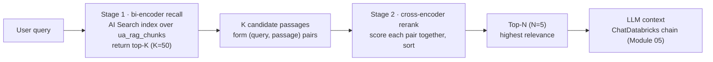
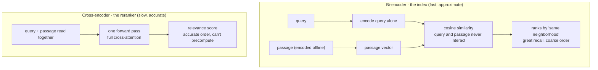

# Reranking retrieved results: two-stage retrieval with a cross-encoder  ·  Module 04 · Topic 04.9 (★ cornerstone)  ·  [Theory + Hands-on]

> **You are here:** Roadmap Module 04 → 04.9 (cornerstone deep-dive). This is the last stop in Module 04 and the bridge into Module 05 (building the RAG chain).
> **Prerequisites:** 04.1 AI Search fundamentals (cosine vs dot-product), 04.3 creating and querying an index, 04.5 retrievers and embedding models together, and ideally 04.8 hybrid search. You should already have the Module 04 Delta Sync index over `unity_airways.rag.ua_rag_chunks`. You do not need the Module 05 chain built yet — this page hands off to it.

## TL;DR
- Your embedding retriever (a **bi-encoder**) is tuned for **recall**: it casts a wide net and gets the relevant passages *somewhere* in the top results. But it ranks by raw vector similarity, and similarity is only a rough proxy for "which passage actually answers this question." So the best passage is often **not** rank 1.
- **Reranking** is a cheap fix: a second, more careful model re-scores the passages the retriever already found and reorders them so the truly relevant ones rise to the top.
- The production shape is **two-stage retrieval**: stage 1 = fast bi-encoder recall (top-K, e.g. K = 50 from AI Search); stage 2 = a **cross-encoder** re-scores each `(query, passage)` pair and returns the top-N (e.g. N = 5) for the LLM.
- The retriever owns **recall**, the reranker owns **precision**, and the LLM gets fewer but higher-quality chunks. You only pay the reranker's cost on a small candidate set, never on the whole corpus.
- Reranking earns its latency when queries are ambiguous, multi-part, or domain-specific, or when chunks are large or overlapping so several look equally relevant. It is not worth it for simple lookups on a tight latency budget.

## The problem
- Unity Airways' assistant answers "Can I get a refund on a Basic Economy fare?" from the policy chunks you indexed in Modules 03 and 04.
- You query the AI Search index and it returns the 5 most similar chunks. The answer looks plausible, but it is subtly wrong: it quotes the *general* refund policy, not the Basic Economy exception.
- When you look closer, the chunk that actually contains the Basic Economy rule *was* retrieved — it came back at rank 7. Your chain only passed the top 5 to the model, so the one chunk that mattered never made it into the prompt.
- The retrieval was not the failure. The **ordering** was. The index found the right passage but scored six weaker passages above it.

## Why the naive approach fails
- The naive setup is "retrieve top-N by vector similarity and send those N straight to the LLM." It is the default in every quickstart and it is where most RAG apps start.
- The embedding model is a **bi-encoder**: it turns the query into one vector and each document into its own vector *separately*, then compares them with cosine or dot-product. The query and the document never actually "read" each other.
- That separate encoding is exactly what makes the index fast — every document vector is computed once, offline, so at query time you only do an approximate-nearest-neighbor lookup over millions of vectors in milliseconds. But it also makes the score coarse. A passage that shares vocabulary and topic with the query can easily outscore the passage that genuinely answers it.
- So similarity ranking optimizes for "is this in the right neighborhood," which is great for recall and wrong for precision. Push N up to catch the good passage and you flood the prompt with noise (and blow the generation context budget). Keep N small and you drop the good passage. Either way the LLM answers from the wrong chunks.

The fix is not a bigger embedding model or a bigger N. It is a **second pass** that scores relevance properly, but only on the handful of candidates worth the effort.

## What it is
- **Plain-language definition:** Reranking is a postprocessing step that takes the top-K results from your vector search and re-scores them with a more careful model that reads the query and each passage *together*, then reorders the list so the most relevant passages come first.
- **Mental model:** the retriever is a fast librarian who grabs a shelf of books that look about right. The reranker is a careful reader who skims each one against your actual question and puts the best three on top of the pile. You would not ask the careful reader to skim the whole library, which is why reranking runs only on the shelf the librarian already pulled.
- **Two roles, split on purpose:**
  - **Bi-encoder retriever** = recall. Wide net, cheap, runs over the whole index.
  - **Cross-encoder reranker** = precision. Careful scoring, expensive per item, runs only on top-K.

## Why it matters (for a Databricks FDE)
- It is one of the highest-leverage, lowest-effort quality wins in a RAG pipeline. You do not re-chunk, re-embed, or rebuild the index — you add one scoring step between the retriever and the chain.
- "Our RAG bot retrieves the right document but still answers wrong" is a common customer complaint, and it is very often a ranking problem, not a retrieval or model problem. Reranking is the direct fix.
- It composes cleanly with the rest of Module 04: hybrid search (04.8) widens the candidate net (recall), reranking sharpens the order (precision). They solve different halves of the same problem.
- It is a named exam objective ("Explain the role of reranking in the information retrieval process"), and it is the natural close to Module 04 before you assemble the chain in Module 05.

## Core concepts
- **Bi-encoder** — the embedding model behind the index (e.g. `databricks-gte-large-en`). Encodes query and document into vectors *independently*, so documents can be embedded once and searched fast. Query and document never interact, so the relevance signal is approximate.
- **Cross-encoder** — a model that takes the query and one passage **together** in a single forward pass and outputs one relevance score. Because it sees both at once (full cross-attention between query and passage tokens), it judges relevance far more accurately than comparing two separate vectors. The cost: you cannot precompute anything, so it runs one forward pass per `(query, passage)` pair at query time.
- **Two-stage retrieval** — stage 1 recall (bi-encoder, top-K), stage 2 precision (cross-encoder rerank, top-N). Also called retrieve-then-rerank.
- **K (recall depth)** — how many candidates stage 1 returns. Bigger K raises the chance the best passage is in the pool, at more reranking work. Typical range 20–100; start at 50.
- **N (context depth)** — how many reranked passages you send to the LLM. Typical range 3–10; start at 5. N must fit the generation model's context window alongside the prompt.
- **Recall → precision trade-off** — stage 1 maximizes recall (don't miss the good passage); stage 2 maximizes precision (put it first). Splitting them lets you be greedy on recall (large K) without drowning the LLM, because stage 2 trims back to N.
- **MRR (mean reciprocal rank)** — a retrieval metric that rewards putting the first relevant passage high in the list. Because the LLM usually sees only the top few chunks, MRR is the metric reranking moves most.
- **LLM-based scoring** — an alternative reranker where you ask an LLM to judge each passage's relevance (or pick between two). More flexible on nuanced intent, but slower and more expensive than a cross-encoder, so it is usually reserved for the hardest cases.

## 🗺️ Visual map

**Two-stage retrieval: query → retriever top-K → reranker → top-N → LLM** (this is the diagram mirrored in the HTML explainer):



*Takeaway: the reranker never touches the whole index. It only re-orders the small pool the retriever already found, so you get precision without paying cross-encoder cost at corpus scale.*

**Why the best passage is often not rank 1 — bi-encoder vs cross-encoder:**



*Takeaway: separate encoding is what makes the index fast and also what makes its ranking approximate. The cross-encoder gives up precomputation to gain accuracy, which is only affordable on top-K.*

## How it works — deep dive

### Stage 1 — bi-encoder recall (the retriever you already built)
- **Mechanism:** the AI Search index holds one precomputed vector per chunk. At query time it embeds the query with the same model and returns the K nearest vectors by cosine/dot-product. This is the Module 04 retriever.
- **Why it is stage 1:** it is the only stage cheap enough to run over the entire corpus. Millions of vectors, millisecond lookup.
- **What to tune:** raise K so the good passage is reliably *in* the pool. You are optimizing recall here, not order — messy ordering is fine because stage 2 fixes it. If recall itself is weak (the good passage never shows up even at K = 100), that is a chunking, embedding, or hybrid-search problem, not a reranking problem.

### Stage 2 — cross-encoder rerank (the new step)
- **Mechanism:** for each of the K candidates, build a `(query, passage)` pair, run it through the cross-encoder, and get one relevance score. Sort by score, keep the top-N.
- **Why it is more accurate:** the cross-encoder reads the query and the passage in the same forward pass, so it can weigh how the passage's specific claims answer the specific question — something two independent vectors cannot capture.
- **Why it only runs on top-K:** one forward pass per pair means cost scales with the number of candidates. K = 50 pairs is cheap; 5 million pairs is impossible. Reranking is affordable precisely because stage 1 already narrowed the field.
- **What to tune:** K (how many you re-score) and N (how many survive). Larger K = better chance of surfacing the best passage, higher rerank latency. Smaller N = tighter, less noisy context for the LLM.

### Recall then precision — why split the job
- The retriever "focuses on recall, the reranker focuses on precision, and the language model benefits from receiving fewer but higher-quality chunks" (B2 Ch3). Splitting the concerns avoids the inefficient design of running an expensive relevance model over the whole corpus.
- It also makes the pipeline easy to evaluate and debug: measure recall at stage 1 (is the good passage in the top-K?) and MRR/precision at stage 2 (did it end up near the top?). Each metric points at a different fix.

### Cross-encoder vs LLM-as-reranker
- **Cross-encoder** (e.g. an `ms-marco` model): a small classification model fine-tuned to score query-passage relevance. Fast enough for top-K at interactive latency, cheap, no external key. This is the practical default in most Databricks RAG pipelines.
- **LLM-based scoring:** prompt a served LLM to rate each passage's relevance or to choose the better of two. Handles subtle, multi-part intent, but adds real latency and token cost per candidate. Reach for it only when a cross-encoder is not discriminating enough.

## How to do it on Databricks

> **[Hands-on]** These snippets run on serverless or a DBR ML runtime. The retriever uses `DatabricksVectorSearch` from `databricks-langchain` over your Module 04 index; the cross-encoder is a portable, provider-neutral example served in-process. `CATALOG`/`SCHEMA` point at Unity Catalog objects you can read.

**0. Install and set variables:**

```python
%pip install -U databricks-vectorsearch databricks-langchain sentence-transformers
dbutils.library.restartPython()
```

```python
CATALOG = "unity_airways"
SCHEMA  = "rag"
VS_ENDPOINT = "unity-airways-vs"                     # your AI Search endpoint
INDEX = f"{CATALOG}.{SCHEMA}.ua_rag_chunks_index"    # Module 04 Delta Sync index over ua_rag_chunks
K = 50   # stage-1 recall depth (cast a wide net)
N = 5    # stage-2 passages that reach the LLM
QUERY = "Can I get a refund on a Basic Economy fare?"
```

**1. Stage 1 — bi-encoder recall via the Module 04 retriever.** `as_retriever(search_kwargs={"k": K})` returns the top-K candidates. Tune `k` for recall, not order.

```python
from databricks_langchain import DatabricksVectorSearch

vs = DatabricksVectorSearch(
    endpoint=VS_ENDPOINT,
    index_name=INDEX,
    columns=["chunk_id", "source_doc", "content"],   # what each retrieved Document carries
)
retriever = vs.as_retriever(search_kwargs={"k": K})  # top-K for stage-1 recall

candidates = retriever.invoke(QUERY)                 # K LangChain Documents, ordered by similarity
print(len(candidates), "candidates from stage 1")
```

**2. Stage 2 — cross-encoder rerank (the portable pattern).** Score each `(query, passage)` pair with a cross-encoder, sort, and keep the top-N. `CrossEncoder.predict` takes a list of pairs and returns one score per pair.

```python
from sentence_transformers import CrossEncoder

# A small, well-known open cross-encoder used here as an illustrative example.
# It runs in-process on the cluster; no external key. Swap in whichever reranker you standardize on.
reranker = CrossEncoder("cross-encoder/ms-marco-MiniLM-L-6-v2")

pairs  = [(QUERY, d.page_content) for d in candidates]   # pair the query with each candidate passage
scores = reranker.predict(pairs)                          # one relevance score per pair

ranked = sorted(zip(candidates, scores), key=lambda x: x[1], reverse=True)  # best first
top_n  = [doc for doc, _ in ranked[:N]]                   # the N passages the LLM will actually see
```

**How to verify it worked (did the ordering actually improve?):**

```python
# Compare what the LLM would have seen BEFORE vs AFTER reranking.
before = [d.page_content[:80] for d in candidates[:N]]           # naive top-N by similarity
after  = [d.page_content[:80] for d, _ in ranked[:N]]            # reranked top-N
for i, (b, a) in enumerate(zip(before, after), 1):
    print(f"{i}. before: {b}\n   after : {a}\n")
# Success looks like: the passage containing the full Basic Economy refund rule is now in `after`
# (and near the top) even if it was rank 6-7 in `before`.
```

**3. Feed the reranked top-N into the Module 05 RAG chain.** Wrap the two stages in one function and plug it into an LCEL chain as the context source for `ChatDatabricks`.

```python
from databricks_langchain import ChatDatabricks
from langchain_core.prompts import ChatPromptTemplate
from langchain_core.output_parsers import StrOutputParser
from langchain_core.runnables import RunnableLambda, RunnablePassthrough

def retrieve_and_rerank(question: str):
    cands = retriever.invoke(question)                                  # stage 1: top-K
    scores = reranker.predict([(question, d.page_content) for d in cands])
    ranked = sorted(zip(cands, scores), key=lambda x: x[1], reverse=True)
    return [d for d, _ in ranked[:N]]                                   # stage 2: top-N

def format_docs(docs):
    return "\n\n".join(d.page_content for d in docs)

prompt = ChatPromptTemplate.from_messages([
    ("system", "Answer using ONLY the context. If the answer is not in the context, say you do not know.\n\nContext:\n{context}"),
    ("user", "{question}"),
])
llm = ChatDatabricks(endpoint="databricks-claude-sonnet-4-5")           # confirm on the supported-models page

chain = (
    {"context": RunnableLambda(retrieve_and_rerank) | format_docs,
     "question": RunnablePassthrough()}
    | prompt | llm | StrOutputParser()
)
answer = chain.invoke(QUERY)
print(answer)
```

**Optional — serve the reranker as an endpoint.** Running the cross-encoder in-process is the simplest start. For a production chain you package the reranker as an MLflow model and deploy it to **Model Serving** (custom-model endpoints are GA), so the chain calls a governed, independently scalable endpoint instead of loading the model on every worker. Whether you also expose it through AI Gateway is a governance choice.

## Worked example (Unity Airways)
The refund question is the classic case. Reranking changes the answer, not just the order.

- **Stage 1 (recall):** the query "Can I get a refund on a Basic Economy fare?" retrieves K = 50 chunks. Both the general "Refunds" clause and the specific "Basic Economy is non-refundable except within 24 hours" clause are in the pool — but the general clause scores higher on vector similarity because it repeats the words "refund" and "fare" more often. The specific clause lands at rank 7.
- **Naive top-5:** the chain passes ranks 1–5 to the model. The Basic Economy exception (rank 7) is dropped. The model answers from the general policy and tells the customer they can get a refund. Wrong, and in a regulated domain, costly.
- **Stage 2 (precision):** the cross-encoder reads each `(query, passage)` pair. It recognizes that the passage naming "Basic Economy" and "non-refundable" directly answers the question and scores it highest. After reranking, that clause is rank 1.
- **Reranked top-5:** the model now sees the exception first and answers correctly, with the right caveat about the 24-hour window.

This is also where reranking and overlapping chunks interact. Because Module 03 used sliding-window overlap on the Conditions of Carriage, several near-duplicate chunks look equally relevant to the retriever. The reranker breaks the tie by picking the chunk that most directly answers the question, so the LLM gets the cleanest single passage instead of three overlapping fragments.

## Uses, edge cases and limitations
| Use it when | Watch out when | Better move |
|---|---|---|
| Retrieval finds the right passage but ranks it low (low MRR) | You have a strict end-to-end latency budget | Cache, shrink K, or serve the reranker on a warm endpoint |
| Queries are ambiguous, multi-part, or domain-specific | Recall itself is broken (good passage never in top-K) | Fix chunking/embeddings/hybrid search first — rerank can't recover what stage 1 missed |
| Chunks are large or overlapping so several look equal | The corpus is tiny and the top result is already reliable | Skip reranking; the extra pass buys little |
| You need higher precision without re-indexing | Very high QPS where per-query cost compounds | Batch, quantize, or reserve reranking for hard queries |
| The LLM only sees a small N | You set K too low to save time | Raise K so the good passage is in the pool; that is the whole point |

## Common mistakes / gotchas
| Mistake | Why it hurts | Better move |
|---|---|---|
| Reranking to improve recall | Reranking only reorders what stage 1 returned; it cannot add missing passages | Raise K, fix chunking/embeddings, or add hybrid search for recall |
| Setting K = N (rerank only what you'd send anyway) | Nothing to reorder; the reranker has no candidates to promote | K should be several times N (e.g. K = 50, N = 5) |
| Running the cross-encoder over the whole corpus | One forward pass per pair; corpus-scale reranking is infeasible | Only ever rerank the top-K candidate set |
| Ignoring the added latency | A per-candidate forward pass can dominate query time | Measure it; tune K; serve/batch the reranker; use it selectively |
| Assuming a specific Databricks-hosted reranker exists | Product surface changes fast; a wrong endpoint name breaks the chain | Verify the current native option in docs; otherwise use the portable pattern |
| Confusing reranking with hybrid search | They fix different halves — recall vs order | Use hybrid for candidates (04.8), rerank for precision (04.9); they stack |

> 📌 **IMPORTANT:** Reranking improves **ordering, not coverage**. The reranker can only reorder the passages stage 1 already retrieved. If the answer isn't in the top-K, no reranker can put it in the prompt. So tune the retriever for recall first (raise K, fix chunking/embeddings, consider hybrid search), then rerank for precision.

> 💡 **TIP:** Start with K = 50 and N = 5, then tune by measuring **MRR** on a small labeled query set — that is the metric reranking moves most. Reranking "improves precision significantly but can introduce latency," so apply it selectively on a small candidate set (the book uses the top ~100). If latency matters, shrink K or move the cross-encoder onto a warm Model Serving endpoint.

> ⚠️ **GOTCHA — verify the native option before shipping:** Databricks' retrieval stack changes quickly. This lesson teaches the **portable cross-encoder pattern** (retrieve top-K, score `(query, passage)` pairs, keep top-N) because it works on any stack and is exactly what B2 Ch3 shows. Before production, check the **current** Databricks docs for a native reranking option — for example, whether AI Search exposes a built-in rerank/query parameter, or whether Databricks hosts a managed reranker endpoint. Prefer a governed native option if it exists, but do **not** assume a `databricks-*-reranker` endpoint name — confirm it on the supported-models page. (Live doc re-check pending: my authoring-time fetch of the AI Search query docs returned no content.)

> ⚠️ **GOTCHA — naming and imports:** The product is **Databricks AI Search** (formerly Vector Search), but the SDK is still `databricks-vectorsearch` — there is no `databricks-ai-search` package. The retriever and chat model come from **`databricks-langchain`** (`from databricks_langchain import DatabricksVectorSearch, ChatDatabricks`), **not** `langchain-databricks` or `langchain_community`. Served-model endpoint names (like the `ChatDatabricks` LLM) change; confirm on the Foundation Model APIs supported-models page.

## 📝 Notes
- _Space for your own notes._

**Self-check (5 questions)**
1. Why does a bi-encoder retriever optimize recall but rank imperfectly, and why is that acceptable as stage 1?
2. What does a cross-encoder do differently from the embedding model, and why can it only run on the top-K rather than the whole index?
3. You retrieve K = 50 and send N = 5 to the LLM. What is each number doing, and what breaks if you set K = N = 5?
4. A customer says "retrieval finds the right doc but the answer is still wrong." How do you tell whether reranking will help, and which metric confirms it?
5. How do hybrid search (04.8) and reranking (04.9) divide the work, and why do they stack rather than compete?

## How this maps to the certification
- The exam guide lists the objective **"Explain the role of reranking in the information retrieval process"** (B2, exam-objectives section). Expect a conceptual question on *why* reranking helps and *where* it sits, not a coding question.
- Frame the answer as the exam does: the retriever focuses on **recall**, the reranker on **precision**, and the LLM benefits from fewer, higher-quality chunks. Reranking is a **postprocessing** step over a small candidate set (a cross-encoder or fine-tuned BERT variant), and low **MRR** is the signal that ranking — not coverage — is the problem (B2 Ch3, Table 3-6).
- This lives in the RAG data-preparation / retrieval-quality material (B2 Ch3), alongside precision, recall, MRR, and the corrective techniques for retrieval gaps.

## Sources
- 📗 **B2 — *Databricks Certified Generative AI Engineer Associate Study Guide*, Ch 3** ("Data Preparation for RAG" → "Evaluating Retrieval Quality"): "Reranking: Improving relevance" with **Example 3-11** (`from transformers import pipeline; reranker = pipeline("text-classification", model="cross-encoder/ms-marco-MiniLM-L-6-v2")`, then score `f"{query} [SEP] {chunk}"` and `sorted(..., reverse=True)`), the TIP "reranking improves precision significantly but can introduce latency; use it selectively on a small candidate set (e.g., the top 100 chunks)"; "The role of reranking in retrieval" (retriever = recall, reranker = precision); "Common reranking approaches" (cross-encoder reads query + chunk together; lightweight LLM-based scoring as the alternative); "When reranking matters most" (ambiguous/domain-specific queries; large or overlapping chunks); "Practical considerations for using reranking" (retrieve many fast, rerank a smaller subset; MRR); Table 3-6 (low MRR → "Tune ranking logic and apply cross-encoder reranking"). Primary source. *Note: Example 3-11 uses the HuggingFace `transformers` pipeline; this lesson shows the equivalent `sentence_transformers.CrossEncoder.predict` form, which is the more common way to call the same model.*
- 📗 **B2 — exam objectives** (Ch 1 / objectives list): "Explain the role of reranking in the information retrieval process."
- 🌐 Databricks Docs — Databricks AI Search (formerly Vector Search) query and retriever APIs: `docs.databricks.com/aws/en/generative-ai/vector-search` and the create/query index guide. *SDK `databricks-vectorsearch`; retriever `DatabricksVectorSearch` from `databricks-langchain`; hybrid search via `query_type="HYBRID"`.* **Live re-check pending** — verify whether a native rerank parameter or managed reranker endpoint exists at authoring time (fetch returned no content).
- 🌐 Databricks Docs — Foundation Model APIs supported models: `docs.databricks.com/aws/en/machine-learning/foundation-model-apis/supported-models` (confirm the `ChatDatabricks` endpoint name before use; names change).
- 🌐 `sentence-transformers` — `CrossEncoder` cross-encoder API (`CrossEncoder(model).predict([(query, passage), ...])`); model `cross-encoder/ms-marco-MiniLM-L-6-v2` as an illustrative open reranker. Verify current version against the library docs.
