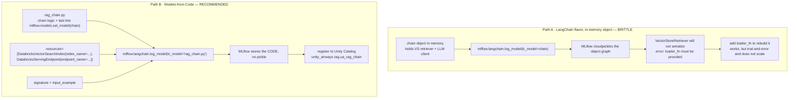
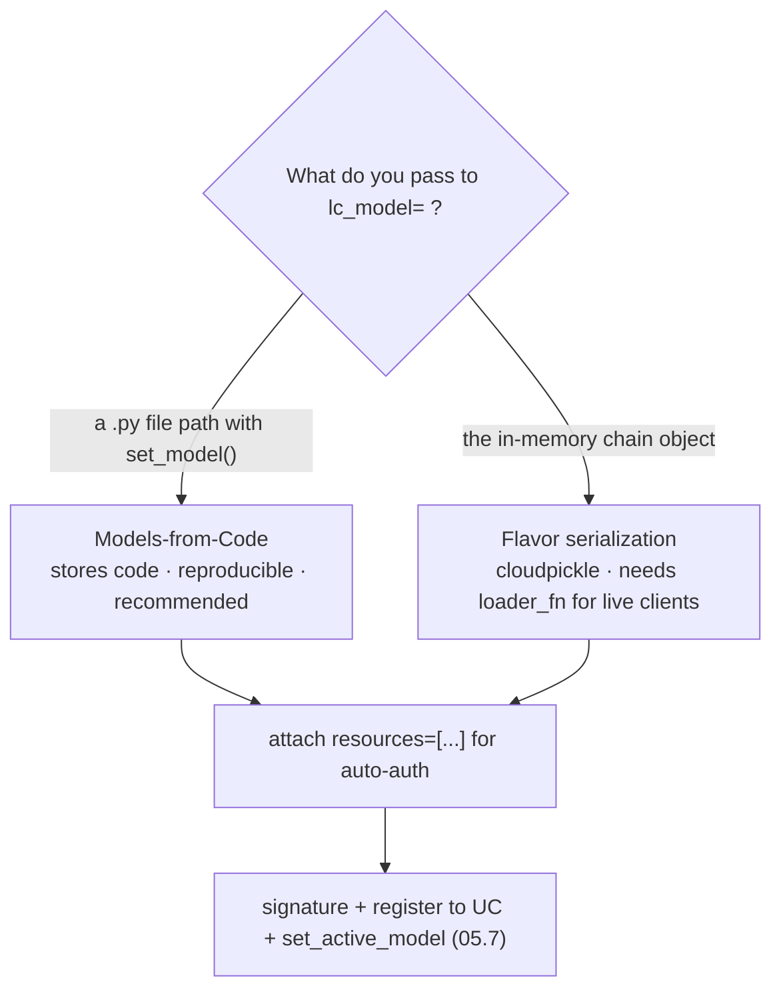

# Logging a chain as Model-as-Code vs the LangChain flavor  ·  Module 05 · Topic 05.6 (★ cornerstone)  ·  [Theory + Hands-on]

> **You are here:** Roadmap Module 05 → 05.6 (cornerstone deep-dive). This is the crux of MLflow 3 chain packaging: *how* you hand your finished RAG chain to MLflow so it logs, reloads, and deploys the same every time.
> **Prerequisites:** 05.2 (LangChain ↔ Databricks: `ChatDatabricks`, `DatabricksVectorSearch`), 05.3 (you have a working RAG chain object), 05.5 (model signatures and dependent resources — the pieces you attach here), and 04.3 (the index `unity_airways.rag.ua_rag_chunks_index` the retriever points at). You should already have a runnable `chain` in a notebook.

## TL;DR
- MLflow can log a LangChain chain **two ways**, and both go through the same call `mlflow.langchain.log_model(...)`. The difference is what you hand to `lc_model=`.
- **The brittle way:** pass the **in-memory `chain` object**. MLflow tries to serialize it with cloudpickle. Your `DatabricksVectorSearch` retriever holds a live client and does **not** pickle — logging fails with a `VectorStoreRetriever ... loader_fn must be provided` error, and the `loader_fn` workaround gets messy fast.
- **The recommended way — Models-from-Code:** put the chain logic in a **`.py` file** whose last line is `mlflow.models.set_model(chain)`, then log by pointing `lc_model="rag_chain.py"`. MLflow stores the **code**, not a pickle. At load time it re-runs the script and rebuilds the chain fresh, so there is nothing fragile to unpickle.
- Attach **dependent resources** so the deployed model gets scoped credentials automatically: `resources=[DatabricksVectorSearchIndex(index_name=...), DatabricksServingEndpoint(endpoint_name=...)]`. This is "automatic authentication passthrough."
- Add a **signature** + **input example**, then **register to Unity Catalog** with `mlflow.set_registry_uri("databricks-uc")` and `mlflow.register_model(...)`. Topic 05.7 builds on this with **LoggedModel** and `mlflow.set_active_model()`.

## The problem
- You finished the Unity Airways RAG chain in 05.3: a `DatabricksVectorSearch` retriever feeds top chunks into a prompt, and `ChatDatabricks("databricks-claude-sonnet-4-5")` writes the answer. It runs in your notebook.
- A chain that only runs in your notebook is not a product. You need to **log** it so a teammate, a serving endpoint, or next month's you can reload the exact same chain and get the exact same behavior.
- A GenAI app is not one trained object with frozen weights. It is a **compound system**: API calls to a Vector Search index for retrieval and to a Foundation Model serving endpoint for generation, wired together by LangChain.
- So "save the model" means something different here. Traditional ML froze parameters into a file. A RAG chain has no weights to freeze — it has **live connections** that must be re-established wherever it runs.

## Why the naive approach fails
- The naive move is the one every MLflow tutorial teaches for scikit-learn: hand the trained object to `log_model` and let MLflow serialize it.

```python
# The naive path — pass the in-memory chain object
logged = mlflow.langchain.log_model(lc_model=chain, ...)
```

- Under the hood, MLflow **cloudpickles** the object graph, the same way it pickles a scikit-learn model. That is fine for a bag of numbers. It is not fine for a chain that holds a live retriever client.
- Your retriever is a `DatabricksVectorSearch`, whose base class is LangChain's `VectorStoreRetriever`. It wraps an open connection to the Vector Search endpoint. LangChain **cannot natively serialize it**, so MLflow throws (verbatim from B1 Ch4):

```
MlflowException: Failed to save runnable sequence: ... 'VectorStoreRetriever --
For VectorStoreRetriever models, a `loader_fn` must be provided.'
```

- The documented workaround is a **`loader_fn`**: a function MLflow calls at load time to rebuild the pieces it could not pickle.

```python
def load_retriever(persist_directory):
    return DatabricksVectorSearch(index_name=..., columns=[...]).as_retriever(...)

logged = mlflow.langchain.log_model(lc_model=chain, loader_fn=load_retriever, ...)
```

- It works, but it does not scale. You discover *which* components are unserializable by **trial and error** — log, read the traceback, move that piece into the `loader_fn`, log again. Every new non-serializable dependency (a second retriever, a tool, a custom client) restarts the loop. The book calls this out directly: it is cumbersome and error-prone for anything beyond a toy chain.
- Root cause in one line: **you are trying to freeze live objects.** The fix is to stop freezing objects and start saving the recipe.

## What it is
- **Models-from-Code** is the MLflow approach where you log the **source code that builds your model** instead of a serialized snapshot of the model object.
- You write the chain in a plain `.py` file. The last line calls `mlflow.models.set_model(chain)`, which tells MLflow: *this variable is the model to log.*
- When you log, `lc_model=` points at the **file path**, not the object. MLflow copies the `.py` (plus any helper files and config) into the run. Nothing gets pickled.
- When the model is loaded — in a notebook, a job, or a serving endpoint — MLflow **re-executes the script**, which rebuilds the retriever and the LLM client fresh against the live services. There is no fragile pickle to restore, so there is nothing to fail.
- The LangChain **flavor** (`mlflow.langchain.log_model`) is not a competitor to Models-from-Code — it is the *door* both approaches use. `lc_model=chain` is the serialization path; `lc_model="rag_chain.py"` is the Models-from-Code path. Same function, two inputs.

## Why it matters (for a Databricks FDE)
- This is the single most common wall a customer hits when they move a RAG demo toward production: "logging my chain throws a serialization error." The answer is almost always "log it as code," and now you can explain *why* in one sentence.
- Reproducibility is the whole point of MLflow. Code-as-model gives you a deployable artifact that reconnects to Vector Search and the serving endpoint anywhere, with credentials handled for you.
- It is directly on the certification (Domain 4 — deployment and operations: package, log, register, deploy a chain/agent). The exam expects you to know Models-from-Code is the recommended packaging path and that dependent resources drive deployment-time auth.
- Get it right once and Module 05.7 (versioning), Module 11 (deploy to Model Serving), and the whole agent track (`ResponsesAgent` + `mlflow.models.set_model`) all reuse the exact same pattern.

## Core concepts
- **LangChain flavor** — `mlflow.langchain.log_model(...)`, MLflow's built-in packaging for LangChain objects. Handles the MLmodel metadata, conda/pip environment, and the `python_function` wrapper so the chain can be loaded and served generically.
- **Serialization / cloudpickle** — MLflow's default way to persist a model object as bytes. Works for self-contained objects (weights); breaks on objects holding live clients or connections (a VS retriever, a serving-endpoint client).
- **`loader_fn`** — the escape hatch for the serialization path: a callback MLflow runs at load time to rebuild whatever it could not pickle. Necessary with `lc_model=chain`; unnecessary with Models-from-Code.
- **Models-from-Code** — log the **code file**, not the object. Entry point is `mlflow.models.set_model(<model>)` as the file's last executable line. Reproducible because loading re-runs the code.
- **`mlflow.models.set_model(model)`** — declares which object in the script is the model. MLflow ignores everything else in the file for the purpose of "what is the model."
- **`lc_model=` (path vs object)** — a string path to a `.py` file selects Models-from-Code; an in-memory object selects serialization. This one argument is the whole fork.
- **`mlflow.pyfunc.log_model(python_model="chain.py", ...)`** — the generic (non-LangChain) Models-from-Code equivalent, used for `ResponsesAgent`/custom Python models. Same idea, different flavor.
- **Dependent resources** — `DatabricksVectorSearchIndex`, `DatabricksServingEndpoint` (and friends) from `mlflow.models.resources`, passed as `resources=[...]`. They record which Databricks services the chain calls so deployment can mint **scoped, short-lived credentials** (automatic authentication passthrough).
- **Signature + input example** — `infer_signature(model_input, model_output)` describes the expected request/response shape; the input example is a sample request saved with the model. Both are validated at load and serve time.
- **UC registration** — `mlflow.set_registry_uri("databricks-uc")` then `mlflow.register_model("runs:/<run_id>/model", "catalog.schema.name")` promotes the logged model into Unity Catalog for governance, versioning, and deployment.
- **LoggedModel / `set_active_model()`** — new in MLflow 3; links a model *version* to its traces, evals, and metrics. Covered in 05.7; you will see the hook (`model_id=...`) here.

## 🗺️ Visual map

**Two logging paths: in-memory object (pickle, brittle) vs code file (set_model, reproducible)** — mirrored in the HTML explainer:



*Takeaway: same door (`mlflow.langchain.log_model`), two inputs. Hand it the object and you fight the pickler; hand it a code file and MLflow keeps the recipe.*

**Which input do you hand `log_model`?**



*Takeaway: prefer the code-file input. Reach for the object input only for a tiny, fully serializable chain, and expect a `loader_fn` the moment a live client appears.*

## How it works — deep dive

### Why live objects do not pickle [Theory]
- cloudpickle snapshots an object's state into bytes. It can only capture things that are, in effect, data: numbers, strings, plain Python structures, and objects whose classes opt into serialization.
- A `DatabricksVectorSearch` retriever is not data — it is a **handle to a running service**. It carries a client, auth context, and connection state that only make sense while a session is alive. There is no meaningful "byte snapshot" of an open connection.
- LangChain marks `VectorStoreRetriever` as not natively serializable for exactly this reason, so MLflow refuses rather than silently pickling something that would break on load.
- The same logic applies to serving-endpoint clients, tool clients, and most agent components. In GenAI, the interesting objects are almost always live — which is why "pickle the object" is the wrong default here even though it is the right default for classic ML.

### `set_model` and the code file [Theory + Hands-on]
- In a `.py` file you build the chain exactly as you did in the notebook, then end with:

```python
mlflow.models.set_model(model=chain)   # last line: "THIS is the model"
```

- `set_model` does not log anything. It **registers the object as the model within the script's namespace** so that, when MLflow executes the file, it knows which variable to treat as the model. (Verified: B1 Ch4 — "The `set_model` method is to tell MLflow that this is the model to be logged.")
- Logging then points at the file. MLflow copies the file into the run and records a `python_function` loader that will re-run it later:

```python
logged = mlflow.langchain.log_model(lc_model="rag_chain.py", ...)
```

- **Loading re-executes the script.** `mlflow.langchain.load_model(uri)` runs `rag_chain.py` again, which constructs a brand-new retriever and LLM client against the live services. Nothing is unpickled, so the fragile step is simply gone.
- Sanity-check the file before logging by importing and invoking it, so you catch import or config errors while you can still see them:

```python
from rag_chain import chain
chain.invoke(model_config.get("input_example"))
```

### The two inputs to one function [Theory]
| | `lc_model=chain` (object) | `lc_model="rag_chain.py"` (code path) |
|---|---|---|
| What MLflow stores | a cloudpickle of the object graph | the `.py` source (plus `code_paths`, `model_config`) |
| Live clients (VS retriever, LLM) | must be rebuilt via `loader_fn` | rebuilt automatically when the script re-runs |
| Failure mode | serialization error on non-picklable pieces | import/syntax error you catch by running the file |
| Scales to complex agents | poorly (loader_fn grows) | yes (recommended for agents too) |
| Status | valid, legacy default | GA, **recommended** |
- Both produce a standard MLmodel with a `langchain` flavor and a `python_function` flavor, so downstream loading and serving are identical. The only thing that changes is how the model got into the artifact.
- The generic equivalent for non-LangChain code is `mlflow.pyfunc.log_model(python_model="chain.py", ...)` — same Models-from-Code idea, used when you author with `ResponsesAgent` or a custom `PythonModel`.

### Dependent resources and auto-auth [Theory + Hands-on]
- Your chain calls two Databricks services at runtime: the Vector Search **index** (retrieval) and the Foundation Model **serving endpoint** (generation). When the model runs inside a serving endpoint, it needs credentials for both.
- You do not hardcode secrets. You **declare the resources**, and Databricks provisions scoped, short-lived credentials on deploy — the book's "automatic authentication passthrough":

```python
from mlflow.models.resources import DatabricksVectorSearchIndex, DatabricksServingEndpoint

resources = [
    DatabricksVectorSearchIndex(index_name="unity_airways.rag.ua_rag_chunks_index"),
    DatabricksServingEndpoint(endpoint_name="databricks-claude-sonnet-4-5"),
]
```

- Pass `resources=resources` to `log_model`. MLflow writes them into the MLmodel metadata; deployment reads that list and grants the endpoint exactly those permissions and nothing more.
- Get the list wrong and the symptom is a **permission/auth error at inference time**, not at logging time — the model logs fine and only fails when deployed and asked to retrieve or generate. Declare every service the chain touches.

### Signature, then register to Unity Catalog [Hands-on]
- A **signature** pins the input/output shape so requests are validated at load and serve time:

```python
from mlflow.models import infer_signature
signature = infer_signature(model_input=example_request, model_output=example_answer)
```

- **Register to UC** so the model is governed and deployable. Point the registry at Unity Catalog, then register the run's model under a three-level name:

```python
mlflow.set_registry_uri("databricks-uc")
mlflow.register_model("runs:/<run_id>/model", "unity_airways.rag.ua_rag_chain")
```

- Shortcut: pass `registered_model_name="unity_airways.rag.ua_rag_chain"` straight to `log_model` to log and register in one shot (that is what B1 Ch4 does). The standalone `mlflow.register_model` is handy when you want to log first and register a chosen run later.

## How to do it on Databricks

> **[Hands-on]** Runs on serverless or a DBR ML runtime with **MLflow ≥ 3.1**. You need the RAG chain from 05.3, read access to the index `unity_airways.rag.ua_rag_chunks_index`, and rights to register a model in `unity_airways.rag`.

**0. Install and set variables:**

```python
%pip install -U mlflow databricks-langchain databricks-vectorsearch
dbutils.library.restartPython()
```

```python
CATALOG   = "unity_airways"
SCHEMA    = "rag"
INDEX     = f"{CATALOG}.{SCHEMA}.ua_rag_chunks_index"   # from Module 04.3
LLM       = "databricks-claude-sonnet-4-5"              # chat model the chain calls
UC_MODEL  = f"{CATALOG}.{SCHEMA}.ua_rag_chain"          # where we register
```

**1. Move the chain into a `.py` file.** Create `rag_chain.py` next to your notebook. Build the chain exactly as in 05.3, then declare it with `set_model` on the last line:

```python
# rag_chain.py  — the entire chain lives here, no notebook state
import mlflow
from databricks_langchain import ChatDatabricks, DatabricksVectorSearch
from langchain_core.prompts import ChatPromptTemplate
from langchain_core.runnables import RunnablePassthrough
from langchain_core.output_parsers import StrOutputParser

# Read config so the file has no hardcoded names (MLflow injects model_config at load)
cfg        = mlflow.models.ModelConfig(development_config="rag_chain_config.yml")
index_name = cfg.get("index_name")
llm_name   = cfg.get("llm_endpoint")

retriever = DatabricksVectorSearch(
    index_name=index_name,
    columns=["chunk_id", "source_doc", "content"],
).as_retriever(search_kwargs={"k": 5})

prompt = ChatPromptTemplate.from_messages([
    ("system", "Answer using only the context.\n\nContext:\n{context}"),
    ("user", "{question}"),
])
llm = ChatDatabricks(endpoint=llm_name, temperature=0)

chain = (
    {"context": retriever, "question": RunnablePassthrough()}
    | prompt | llm | StrOutputParser()
)

mlflow.models.set_model(model=chain)   # ← the crucial line: THIS is the model
```

**How to verify the file works** (catch errors before logging):

```python
from rag_chain import chain
print(chain.invoke("Can I get a refund on a Basic Economy fare?")[:200])
```

**2. Build the signature and declare dependent resources:**

```python
from mlflow.models import infer_signature
from mlflow.models.resources import DatabricksVectorSearchIndex, DatabricksServingEndpoint

example_q = "Can I change my Basic Economy booking?"
signature = infer_signature(model_input=example_q, model_output="A short grounded answer.")

# These drive automatic-auth passthrough when the model is deployed.
resources = [
    DatabricksVectorSearchIndex(index_name=INDEX),   # retrieval
    DatabricksServingEndpoint(endpoint_name=LLM),    # generation
]
```

**3. Log as Models-from-Code** — `lc_model=` is the **path to the file**, not the object:

```python
import mlflow

with mlflow.start_run() as run:
    logged = mlflow.langchain.log_model(
        lc_model="rag_chain.py",                 # ← code file, NOT the chain object
        model_config="rag_chain_config.yml",     # config injected at load time
        signature=signature,
        input_example=example_q,
        resources=resources,                     # auto-auth on deploy
        pip_requirements=["mlflow>=3.1", "databricks-langchain", "databricks-vectorsearch"],
        # code_paths=["helpers/"],               # add if rag_chain.py imports local helpers
        registered_model_name=UC_MODEL,          # log + register to UC in one shot
    )

print(logged.model_uri)   # runs:/<run_id>/model
```

**How to verify it worked** (reload and invoke — this re-executes the code, not a pickle):

```python
loaded = mlflow.langchain.load_model(logged.model_uri)
print(loaded.invoke("What is the checked baggage allowance on Basic Economy?")[:200])
```

**4. Register separately (alternative to `registered_model_name=`)** — log first, choose the run, register later:

```python
mlflow.set_registry_uri("databricks-uc")
mv = mlflow.register_model(f"runs:/{run.info.run_id}/model", UC_MODEL)
print(mv.name, mv.version)   # unity_airways.rag.ua_rag_chain, 1
```

**5. Contrast — the brittle object path (so you recognize the error):**

```python
# DON'T ship this. Shown so you know the failure and the workaround.
with mlflow.start_run():
    mlflow.langchain.log_model(lc_model=chain, signature=signature, resources=resources)
# -> MlflowException: ... 'VectorStoreRetriever ... a `loader_fn` must be provided.'
# Fix A (messy): add loader_fn=load_retriever to rebuild the retriever at load time.
# Fix B (do this): log the .py file as in step 3.
```

**6. Forward-ref to 05.7 — attach a LoggedModel version:**

```python
# New in MLflow 3: name a version, then link the logged model to it via model_id.
active = mlflow.set_active_model(name="ua_rag_chain_v1")
# ...then pass model_id=active.model_id into log_model(...) — full treatment in 05.7.
```

## Worked example (Unity Airways)
- The chain from 05.3 answers policy questions: `DatabricksVectorSearch` on `unity_airways.rag.ua_rag_chunks_index` retrieves the top 4 chunks, `ChatDatabricks("databricks-claude-sonnet-4-5")` writes the grounded answer.
- **First attempt (object path):** you call `mlflow.langchain.log_model(lc_model=chain, ...)`. It fails with the `VectorStoreRetriever ... loader_fn must be provided` error, because the retriever holds a live Vector Search client that cloudpickle cannot freeze.
- **Fix that scales:** you move the chain into `rag_chain.py`, end it with `mlflow.models.set_model(model=chain)`, and log with `lc_model="rag_chain.py"`. MLflow stores the code. No pickle, no `loader_fn`.
- You attach `resources=[DatabricksVectorSearchIndex(index_name="unity_airways.rag.ua_rag_chunks_index"), DatabricksServingEndpoint(endpoint_name="databricks-claude-sonnet-4-5")]`, add a signature and input example, and register as `unity_airways.rag.ua_rag_chain`.
- You reload with `mlflow.langchain.load_model(...)`; MLflow re-runs the script, rebuilds a fresh retriever and LLM client, and the chain answers exactly as it did in the notebook.
- When Module 11 deploys this UC model to a serving endpoint, the declared resources let Databricks mint scoped credentials so the endpoint can reach the index and the LLM — no secrets in the code.

## Uses, edge cases and limitations
| Use it when | Watch out when | Better move |
|---|---|---|
| Logging any chain that holds a live client (VS retriever, serving-endpoint LLM, tools) | You pass the in-memory object and hit a serialization error | Log the `.py` file with `set_model` (Models-from-Code) |
| You want a reproducible, deployable artifact | `rag_chain.py` imports local helper modules | Pass `code_paths=["helpers/"]` so they ship with the model |
| The chain reads names/params that change per environment | You hardcode index/endpoint names in the file | Read them via `mlflow.models.ModelConfig` and pass `model_config=` |
| Deploying to Model Serving later | You forgot a resource the chain calls | List every service in `resources=[...]` or auth fails at inference |
| A genuinely tiny, fully serializable chain (no live clients) | It grows and adds a retriever | Object path is fine now; expect to switch to code-as-model soon |
| Authoring an agent (`ResponsesAgent`) | You reach for the LangChain flavor | Use `mlflow.pyfunc.log_model(python_model="agent.py", ...)` — same idea |

## Common mistakes / gotchas
| Mistake | Why it hurts | Better move |
|---|---|---|
| `lc_model=chain` for a chain with a retriever | Serialization fails: `VectorStoreRetriever ... loader_fn must be provided` | `lc_model="rag_chain.py"` with `set_model` on the last line |
| Forgetting `mlflow.models.set_model(...)` in the file | MLflow does not know which object is the model; load fails | Make it the **last executable line** of the script |
| Passing the file path but leaving notebook-only state in it | The script cannot rebuild itself outside the notebook | The `.py` must be self-contained — imports + config, no stray globals |
| Omitting `resources=[...]` | Model logs fine, then throws an **auth error at inference** once deployed | Declare `DatabricksVectorSearchIndex` + `DatabricksServingEndpoint` (and any others) |
| Hardcoding `index_name` / endpoint in the file | Breaks across dev/stage/prod; not reproducible | Read via `ModelConfig` and pass `model_config=` at log time |
| Registering to the workspace registry | UC governance/deployment expects a three-level name | `mlflow.set_registry_uri("databricks-uc")` then `catalog.schema.name` |
| `import langchain_databricks` / `langchain_community` | Wrong package; classes differ | `from databricks_langchain import ChatDatabricks, DatabricksVectorSearch` |
| Piling more pieces into a `loader_fn` to force the object path | Trial-and-error, brittle, does not scale | Stop; switch to Models-from-Code |

> 📌 **IMPORTANT:** The whole lesson is one fork in one function. `mlflow.langchain.log_model(lc_model=...)` behaves completely differently depending on whether you pass an **object** (serialize, fragile) or a **file path** (store code, reproducible). For any real chain with a retriever or a serving-endpoint client, pass the file path.

> 💡 **TIP:** Make the `.py` file the source of truth even during development — build the chain there, `from rag_chain import chain`, and invoke it in the notebook. You get the same object to iterate on, and logging is then a one-line `lc_model="rag_chain.py"` with nothing left to convert. Read all environment-specific names via `mlflow.models.ModelConfig` so the same file logs cleanly in dev, stage, and prod.

> ⚠️ **GOTCHA:** Missing `resources` is a silent trap. The model **logs and registers without complaint** and only fails when it is deployed and actually tries to call Vector Search or the LLM — an auth error, not a logging error. Always declare every Databricks service the chain touches. (Class names and kwargs — `DatabricksVectorSearchIndex(index_name=...)`, `DatabricksServingEndpoint(endpoint_name=...)`, imported from `mlflow.models.resources` — are confirmed in B1 Ch4; re-verify against current MLflow docs, since resource classes are added over time.)

## 📝 Notes
- _Space for your own notes._

**Self-check (5 questions)**
1. `mlflow.langchain.log_model(lc_model=chain)` fails with a `VectorStoreRetriever` error. In one sentence, why — and what is the fix that scales?
2. What does `mlflow.models.set_model(model=chain)` do, and where in the `.py` file must it go?
3. Explain why Models-from-Code is reproducible: what happens at *load* time that does not happen with the pickled-object path?
4. You deploy the model and retrieval throws an auth error, even though logging and registration succeeded. What did you most likely forget, and what fixes it?
5. Give the two lines that register the logged run's model into Unity Catalog as `unity_airways.rag.ua_rag_chain`.

## How this maps to the certification
- **Domain 4 — Deployment and operations** owns this topic: package and log a chain/agent, attach dependent resources, register to Unity Catalog, and prepare for Model Serving. The exam expects you to recognize **Models-from-Code as the recommended packaging path** and to know that dependent resources drive deployment-time authentication.
- Exam-focus points (from B1 Ch4): a GenAI app is a compound system, not a single serialized object; the object path fails on non-serializable components and needs a `loader_fn`; `mlflow.models.set_model` marks the model in a code file; `resources=[...]` enables automatic authentication passthrough; UC registration uses `mlflow.set_registry_uri("databricks-uc")` + a `catalog.schema.name`. LoggedModel/`set_active_model` (05.7) is the MLflow-3 versioning layer on top.

## Sources
- 📘 **B1 — *Practical MLflow for Generative AI on Databricks*, Ch 4** ("Packaging and Logging the RAG Chain and Artifacts" → "Logging Model as Code"): the serialization failure (`VectorStoreRetriever ... loader_fn must be provided`), the `loader_fn` workaround, `mlflow.models.set_model(model=chain)` in `rag_chain.py`, logging with `lc_model=<script path>` + `code_paths` + `model_config`, `infer_signature`, and `resources=[DatabricksServingEndpoint(endpoint_name=...), DatabricksVectorSearchIndex(index_name=...)]` from `mlflow.models.resources` for automatic authentication passthrough. *(O'Reilly Early Release — RAW & UNEDITED; verify APIs against current docs.)*
- 🌐 MLflow Docs — **Models from Code**: `mlflow.org/docs/latest/ml/model/models-from-code/` — confirms `mlflow.models.set_model()` as the entry point and that flavor logging (`mlflow.langchain.log_model`, `mlflow.pyfunc.log_model`) accepts a code path. `set_model` presence verified live.
- 🌐 MLflow API — `mlflow.models.resources` (`DatabricksVectorSearchIndex`, `DatabricksServingEndpoint`) and `mlflow.models.infer_signature`. Class names/kwargs grounded in B1 Ch4; live doc re-check pending (docs page is JS-rendered — re-verify at authoring time).
- 🌐 Databricks Docs — register/deploy an agent to Unity Catalog: `mlflow.set_registry_uri("databricks-uc")` → `mlflow.register_model("runs:/<run_id>/model", "catalog.schema.name")`.
- 🧭 Naming cross-check: `.claude/skills/genai-teacher/references/naming-conventions.md` §1 (Models-from-Code `mlflow.models.set_model()` GA/recommended; flavor logging still valid; LoggedModel + `set_active_model()` new in MLflow 3) and §9 (LangChain integration is `databricks-langchain`).
