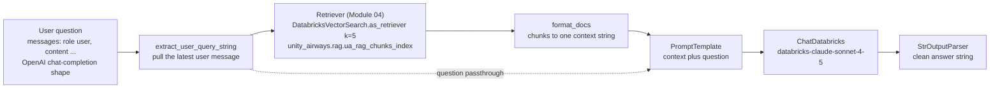
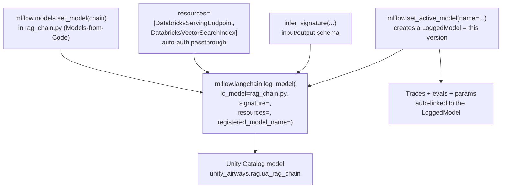

# Building and Versioning a RAG Chain  ·  Module 05  ·  Topics 05.1–05.7  ·  [Theory + Hands-on]

> **You are here:** Roadmap Module 05 → Building and versioning a RAG chain (all topics 05.1–05.7). This is the top of the RAG spine (03 → 04 → **05**).
> **Prerequisites:** Module 04 (the AI Search retriever handed off from `unity_airways.rag.ua_rag_chunks_index`), Module 02 (prompt engineering), and Module 06 (MLflow basics — experiments, runs, the model registry). Next stop after this module is **Module 09 — Agents**, which upgrades this chain into an agent with tools; deployment lands in **Module 11**.

This page is the **module hub**. It carries one numbered entry per topic. Two topics are the module's cornerstones (★) and have their own deep-dive pages:
- **05.3 — LLM-only app → full RAG chain** → `rag-chain.md` / `rag-chain.html`
- **05.6 — Logging "Model as Code" vs LangChain flavor** → `model-as-code.md` / `model-as-code.html`

Everything below rides one running use case: **Unity Airways**, the airline whose policy PDFs we chunked in Module 03 and indexed in Module 04. This module wires the Module 04 **retriever** to an LLM, turns it into a versioned, registered **RAG chain**, and hands that to the agent work in Module 09.

> 📌 **Two naming rules that this whole module depends on:**
> 1. The LangChain integration package is **`databricks-langchain`** — `from databricks_langchain import ChatDatabricks, DatabricksVectorSearch, DatabricksEmbeddings`. It is **not** `langchain-databricks` and **not** `langchain_community`.
> 2. We are on **MLflow ≥ 3.1**. The recommended way to log a chain is **Models-from-Code** (`mlflow.models.set_model()`), and each app version is a **LoggedModel** created with `mlflow.set_active_model()` — both are new/GA in MLflow 3.

---

## TL;DR
- A **RAG chain** is a small pipeline: take the user's question, use the Module 04 **retriever** to pull the most relevant chunks, stuff those chunks into a **prompt**, send the prompt to an LLM (**`ChatDatabricks`**), and parse the answer back to a string. LangChain wires these steps together with **LCEL** (the `|` pipe operator).
- Build it incrementally: start with an **LLM-only** baseline (just `ChatDatabricks`, no retrieval), see it answer without grounding, then add the retriever to get a **full RAG chain**. Compare the two versions in MLflow. That is topic 05.3.
- Keep **config out of code** in a YAML file (`ModelConfig`): the LLM endpoint, the index name, `k`, the prompt template. Swapping a config file becomes a new, reproducible experiment.
- To ship it, MLflow **packages** the chain: a **signature** (input/output schema) and a list of **dependent resources** (`DatabricksServingEndpoint`, `DatabricksVectorSearchIndex`) so the deployed chain can auto-authenticate to the serving endpoint and the index.
- Log it as **Models-from-Code** (`mlflow.models.set_model()` in a `.py` script) — the recommended path that sidesteps the serialization errors you hit with the older flavor-logging approach. **Register** the result to Unity Catalog as `unity_airways.rag.ua_rag_chain`, and let **`mlflow.set_active_model()`** version each iteration and link it to its traces and evals.

## The problem
- Module 04 handed us a **retriever**: one call, `retriever.invoke("...")`, returns the five most relevant Unity Airways policy chunks. That is not an application. It returns raw passages, not answers.
- A support agent still needs the system to *read* those chunks and *write* a grounded answer: "Yes — if Unity Airways cancels your connection, you're re-accommodated on the next available flight at no charge, per the involuntary re-accommodation policy."
- So we need to glue three things together — **retrieve → prompt → generate** — into one object that takes a question and returns an answer, reliably, the same way every time.
- And because this object will change constantly (new prompt wording, different `k`, a new model), we need to **version** it, **package** it so it runs outside the notebook, and **register** it in Unity Catalog so it can be governed and deployed. That packaging-and-versioning half is where most of the Databricks-specific value (and most of the exam questions) live.

## Why the naive approach fails
- **"Just paste the chunks into a prompt by hand."** Fine for one demo query. It breaks the moment you want to loop over an eval set, serve the app, or change the prompt — there's no reusable object, no schema, no version history.
- **"Hard-code the endpoint and index names in the chain code."** Now every experiment is a code edit, and you can't tell which config produced which result. Separate config into a **YAML** (`ModelConfig`) so a version is "this code + this config file."
- **"Log the chain with plain `pickle` / cloudpickle."** A RAG chain isn't a pickleable object — it's a *system* of live services (a Vector Search index, a serving endpoint). The `VectorStoreRetriever` inside it isn't natively serializable, so flavor logging throws `Failed to save runnable sequence`. You either bolt on a `loader_fn` workaround or, better, switch to **Models-from-Code** (05.6).
- **"Deploy it and let it figure out auth."** A chain loaded on a serving endpoint has no notebook credentials. Unless you declared its **dependent resources** at log time, it can't reach the index or the LLM and fails at inference. You must pass `resources=[...]` (05.5).
- **"Name versions `v1`, `v2` in a spreadsheet."** Manual, error-prone, and it can't link a version to the traces and metrics it produced. MLflow 3's **LoggedModel** does that automatically (05.7).

## What it is
- **Plain-language definition:** a RAG chain is a function `question → answer` assembled from small steps — a retriever, a prompt template, an LLM, and an output parser — connected with LangChain's pipe operator so the output of one step feeds the next.
- **Mental model:** a relay race. The question is the baton. Runner 1 (the retriever) fetches supporting evidence; runner 2 (the prompt) writes the instructions and staples the evidence to the question; runner 3 (`ChatDatabricks`) reads it and answers; runner 4 (the parser) hands you a clean string. MLflow films the whole race so you can replay any version later.
- **Where it sits:** the chain consumes the Module 04 retriever and produces a **registered UC model** (`unity_airways.rag.ua_rag_chain`). Module 09 wraps this pattern in an agent (tools, multi-turn); Module 11 serves it; Module 08 evaluates it.

## Why it matters (for a Databricks FDE)
- This is the moment "we have a vector index" becomes "we have an app." Customers get stuck exactly here: the retrieval works in a notebook but they can't package, register, or serve it, or they hit the serialization error and give up.
- The Databricks-specific muscle is the **MLflow 3 packaging story**: signatures, `resources=` for auto-auth passthrough, Models-from-Code, UC registration, and LoggedModel versioning. Knowing which of those solves which failure ("it works in the notebook but 401s when served" → you forgot `resources`) is the FDE value-add.
- It maps to **exam Domain 3 — Building applications** (📗B2 Ch4) and the MLflow packaging/versioning content in 📘B1 Ch4.

## Core concepts
- **Chain / LCEL** — a sequence of steps composed with LangChain Expression Language's `|` operator. `RunnableParallel` runs two branches at once (fetch context *and* pass the question through). See 05.1.
- **`ChatDatabricks`** — LangChain wrapper over a model-serving endpoint (a Foundation Model like `databricks-claude-sonnet-4-5`). From `databricks_langchain`. See 05.2.
- **`DatabricksVectorSearch` / retriever** — the Module 04 hand-off object; `.as_retriever(search_kwargs={"k":5})`. See 05.2.
- **`PromptTemplate`** — a string with `{context}` and `{question}` placeholders that turns retrieved chunks + the question into one instruction. See 05.1, 05.3.
- **`ModelConfig`** — loads a YAML of endpoint names, index name, `k`, and prompt so config lives outside code. See 05.3.
- **Memory / context manager** — keeps earlier turns available so follow-ups make sense; types are buffer, summary, entity. See 05.4.
- **Model signature** — the declared input/output schema of the chain (`infer_signature`). See 05.5.
- **Dependent resources** — `DatabricksServingEndpoint` + `DatabricksVectorSearchIndex`, passed as `resources=[...]`, so a served chain auto-authenticates. See 05.5.
- **Models-from-Code** — `mlflow.models.set_model()` at the bottom of a `.py` chain script; the recommended logging path. See 05.6.
- **LangChain flavor logging** — `mlflow.langchain.log_model(lc_model=chain, ...)`; still valid, but serialization-prone. See 05.6.
- **LoggedModel + `set_active_model`** — the MLflow 3 version object that links a chain version to its traces, evals, and metrics. See 05.7.
- **UC registration** — `mlflow.set_registry_uri("databricks-uc")` and a `catalog.schema.model` name (`unity_airways.rag.ua_rag_chain`). See 05.5–05.7.

## 🗺️ Visual map

**The RAG chain flow — from a question to a grounded answer, on the Module 04 retriever:**



*Takeaway: the chain runs two branches in parallel — one fetches and formats context through the Module 04 retriever, the other passes the raw question through — then merges them into the prompt. The retriever is exactly the object Module 04 built; Module 05 does not re-create it.*

**The log → register → version path to Unity Catalog (MLflow 3):**



*Takeaway: `set_active_model` opens a version and becomes the anchor for that version's traces/evals; `log_model` packages the code (via `set_model`), the signature, and the resources, then registers it to UC. Every arrow into `log_model` is a thing the served chain needs to run outside the notebook.*

---

## 05.1 What is a "chain"? RAG chain anatomy  ·  [Theory]

A **chain** is an ordered set of steps where each step's output feeds the next. LangChain builds them with **LCEL** — LangChain Expression Language — using the `|` pipe operator, the same idea as a Unix pipe.

A **RAG chain** is a chain with a retrieval step in the middle. Its anatomy, in order:

1. **Input** arrives in OpenAI chat-completion shape: `{"messages": [{"role": "user", "content": "How do I book flights with Unity Airways?"}]}`.
2. **Extract the query** — a helper (`extract_user_query_string`) pulls the latest user message out of `messages`.
3. **Retrieve** — that query text goes to the Module 04 retriever, which returns the top-`k` chunks.
4. **Format context** — a helper (`format_docs`) flattens those chunks into one context string.
5. **Prompt** — a `PromptTemplate` combines `{context}` and `{question}` into a single instruction for the LLM.
6. **Generate** — `ChatDatabricks` sends the prompt to the model endpoint and returns a response.
7. **Parse** — `StrOutputParser` turns the model's message object into a plain string.

The clever part is that steps 2–4 (build context) and "pass the question through" run **in parallel** as a `RunnableParallel`, because the prompt needs both the context *and* the original question. In LCEL that looks like:

```python
from operator import itemgetter
from langchain_core.runnables import RunnableLambda
from langchain_core.output_parsers import StrOutputParser

chain = (
    {
        "context":  itemgetter("messages") | RunnableLambda(extract_user_query_string)
                    | retriever | RunnableLambda(format_docs),
        "question": itemgetter("messages") | RunnableLambda(extract_user_query_string),
    }
    | prompt
    | model            # ChatDatabricks
    | StrOutputParser()
)
```

The generic chain components (📗B2 Ch4) generalize beyond RAG: a **prompt template**, an **LLM wrapper / model runner**, an **output parser**, and a **memory / context manager** (05.4). RAG just adds the retriever.

> 📌 **IMPORTANT:** The chain's *input contract* is `{"messages": [...]}`, not a bare string. That shape is what makes the chain drop-in compatible with chat UIs and, later, with agent/serving payloads. Design your helpers to read `messages`.

> 💡 **TIP:** `chain.get_graph().draw_mermaid_png()` renders the LCEL graph as an image — a fast way to sanity-check that your parallel branches wired up the way you think.

---

## 05.2 LangChain ↔ Databricks integration: `ChatDatabricks`, `DatabricksVectorSearch`  ·  [Hands-on]

Two classes from **`databricks-langchain`** do all the Databricks wiring. Prerequisites: serverless (or a notebook cluster), a Foundation Model endpoint, and the Module 04 Vector Search index online.

**`ChatDatabricks`** wraps a model-serving endpoint as a LangChain chat model:

```python
# %pip install databricks-langchain
from databricks_langchain import ChatDatabricks

model = ChatDatabricks(
    endpoint="databricks-claude-sonnet-4-5",   # a Foundation Model endpoint
    temperature=0,
    max_tokens=1000,
)
print(model.invoke("How do I book flights with Unity Airways?").content)
```

**`DatabricksVectorSearch`** wraps the Module 04 index and hands back the retriever:

```python
from databricks_langchain import DatabricksVectorSearch

vs = DatabricksVectorSearch(
    endpoint="unity-airways-vs",
    index_name="unity_airways.rag.ua_rag_chunks_index",
    columns=["chunk_id", "content", "source_doc"],   # metadata returned per chunk
)
retriever = vs.as_retriever(search_kwargs={"k": 5})   # the SAME object Module 04 built
docs = retriever.invoke("Can I rebook for free if my connection is cancelled?")
```

- For a **managed-embeddings** index (our case), the retriever just passes query *text* — no separate embeddings object needed.
- For a **self-managed / Direct Vector Access** index, add `DatabricksEmbeddings(endpoint="databricks-gte-large-en")` so the query lands in the same vector space as the documents.

**How to verify it worked:** `model.invoke(...)` returns a message whose `.content` is text; `retriever.invoke(...)` returns LangChain `Document` objects with `page_content` (the chunk) and `metadata` (`source_doc`, etc.). Empty metadata means the columns weren't synced back in 04.3.

> ⚠️ **GOTCHA:** Served-model endpoint names **churn**. The book uses `databricks-claude-3-7-sonnet`; this module standardizes on `databricks-claude-sonnet-4-5`. Always confirm the exact name on the current **supported-models** page (`docs.databricks.com/.../foundation-model-apis/supported-models`) before hard-coding it — a wrong name is a silent 404 at invoke time.

---

## 05.3 ★ LLM-only app → full RAG chain  ·  [Hands-on]

> **This is a module cornerstone.** The full walkthrough — the LLM-only baseline, the `rag_chain_config.yml` layout, the complete LCEL chain, invoking with the `messages` shape, and the side-by-side version comparison in MLflow — is in `rag-chain.md` / `rag-chain.html`. Summary here.

Build in two steps so you can *measure* what retrieval buys you.

**Step 1 — LLM-only baseline.** Turn on tracing, open a version, ask the model with no context:

```python
import mlflow
from databricks_langchain import ChatDatabricks

mlflow.langchain.autolog()                                  # auto-trace every call
mlflow.set_active_model(name="llm_only")                    # a LoggedModel = this version
model = ChatDatabricks(endpoint="databricks-claude-sonnet-4-5", temperature=0)
print(model.invoke("How do I book flights with Unity Airways?").content)
```

The answer is confident but ungrounded — it doesn't know Unity Airways' actual policy.

**Step 2 — Full RAG chain.** Move config into YAML, build the retriever + prompt + chain, open a new version:

```python
from mlflow.models import ModelConfig
config = ModelConfig(development_config="../conf/rag_chain_config.yml")
databricks_resources = config.get("databricks_resources")   # endpoint + index names
retriever_config     = config.get("retriever_config")       # index, columns, k
llm_config           = config.get("llm_config")             # prompt, temperature, max_tokens

mlflow.set_active_model(name="rag_chain")                    # new version to compare against llm_only
# ... build model, retriever, prompt, and the LCEL chain from 05.1 ...
chain.invoke({"messages": [{"role": "user",
                            "content": "Can I rebook for free if my connection is cancelled?"}]})
```

Now the answer cites the involuntary re-accommodation policy. Both versions show up in the MLflow **Versions** tab, and every question is logged as a **trace** under its version, so you can compare `llm_only` vs `rag_chain` on the same questions.

**How to verify it worked:** open the experiment's **Traces** tab, enable the **Version** column, and confirm the `rag_chain` trace shows the retriever (`VectorStoreRetriever`) *and* `ChatDatabricks` as child spans — proof the context step actually ran before generation.

> 💡 **TIP:** Separating config into YAML is what makes a "version" reproducible: a version is *this code + this config file*. Changing `k` from 5 to 10 or swapping the prompt is a one-line config edit and a fresh `set_active_model` — no code change.

---

## 05.4 Memory and context management  ·  [Theory + Hands-on]

The chain in 05.1 is **stateless** — it answers each question from scratch. Real conversations need **memory**: a context manager that preserves earlier turns so a follow-up like "How about with 16 GB RAM?" builds on "Show me laptops under $1,000" instead of starting over.

**Short-term vs long-term:**
- **Short-term** memory lives inside one conversation (the recent turns).
- **Long-term** memory persists facts across sessions (stored outside the chain — e.g. a table or a store keyed by user).

**Memory types (📗B2 Ch4):**

| Type | What it keeps | Best for |
|---|---|---|
| **Buffer memory** | The last few turns verbatim (exact wording) | Short conversations; technical-support or form-filling bots where precise recall of the latest statements matters |
| **Conversation summary memory** | A running summary that condenses old turns while keeping intent | Long conversations where the topic matters more than exact phrasing (e.g. a triage bot summarizing symptoms) |
| **Entity memory** | Key named entities (people, dates, orgs, order IDs) across turns | Personalized flows — "John Smith", "order #12345" reused later; CRM bots, virtual assistants |

**Injection pattern.** Memory feeds the chain by adding history to the prompt. Give the `PromptTemplate` a `{chat_history}` slot and populate it before generation, alongside `{context}` and `{question}`:

```python
prompt = PromptTemplate(
    template=("You are a Unity Airways assistant. Conversation so far:\n{chat_history}\n\n"
              "Use this context if helpful:\n{context}\n\n"
              "Answer the question: {question}"),
    input_variables=["chat_history", "context", "question"],
)
```

- For a bounded window, keep the **last N turns** (buffer) to stay inside the context length.
- For long chats, **summarize** older turns so token cost doesn't grow without limit.
- History affects **retrieval too**: a bare follow-up ("what about business class?") may need the earlier turn's subject folded in before it's sent to the retriever, or the query returns off-topic chunks.

> ⚠️ **GOTCHA:** Memory grows tokens, and tokens cost money and latency — and eventually overflow the model's context window. Buffer everything and a long chat silently truncates or errors. Cap the window or switch to summary memory for anything beyond a few turns.

---

## 05.5 Packaging and logging: model signatures, dependent resources  ·  [Theory + Hands-on]

A chain that runs in your notebook won't run on a serving endpoint unless MLflow **packages** everything it needs. Two pieces are mandatory before logging.

**1. Model signature** — the declared input/output schema. It validates requests, documents usage, and is required at log time:

```python
from mlflow.models import infer_signature

signature = infer_signature(
    model_input=config.get("input_example"),    # the {"messages":[...]} shape
    model_output=config.get("output_example"),  # a string answer
)
```

**2. Dependent resources** — the Databricks services the chain calls. Declaring them enables **automatic authentication passthrough**: Databricks provisions short-lived credentials so the *deployed* chain can reach the LLM endpoint and the index without you wiring secrets:

```python
from mlflow.models.resources import DatabricksServingEndpoint, DatabricksVectorSearchIndex

dependent_resources = [
    DatabricksServingEndpoint(endpoint_name="databricks-claude-sonnet-4-5"),
    DatabricksVectorSearchIndex(index_name="unity_airways.rag.ua_rag_chunks_index"),
]
```

Then log with the LangChain flavor, passing the signature, the resources, an input example, and pinned pip requirements:

```python
with mlflow.start_run():
    logged = mlflow.langchain.log_model(
        lc_model=chain,
        signature=signature,
        resources=dependent_resources,       # <-- auto-auth for serving
        input_example=config.get("input_example"),
        pip_requirements="../requirements.txt",
        name="ua_rag_chain",
    )
```

To register into Unity Catalog, point the registry at UC and use a three-level name:

```python
mlflow.set_registry_uri("databricks-uc")
# either pass registered_model_name=... to log_model, or:
mlflow.register_model(logged.model_uri, "unity_airways.rag.ua_rag_chain")
```

**How to verify it worked:** in the MLflow UI, open the version's **Artifacts → MLmodel** file and confirm it lists your `signature`, a `resources:` block naming the serving endpoint and the vector-search index, and the `langchain` flavor. Then `mlflow.langchain.load_model(logged.model_uri).invoke(config.get("input_example"))` should reproduce the notebook answer.

> ⚠️ **GOTCHA:** Flavor logging tries to *serialize* the chain object, and the `VectorStoreRetriever` inside `DatabricksVectorSearch` is **not natively serializable** — you'll see `Failed to save runnable sequence ... a loader_fn must be provided`. The old fix is a `loader_fn(persist_directory)` that rebuilds the retriever at load time. The better fix is Models-from-Code (05.6), which avoids serialization entirely.

> 📌 **IMPORTANT:** If a served chain works in the notebook but returns auth errors once deployed, the cause is almost always a missing `resources=[...]`. Declare every endpoint and index the chain touches.

---

## 05.6 ★ Logging "Model as Code" vs LangChain flavor  ·  [Theory + Hands-on]

> **This is a module cornerstone.** The full walkthrough — why serialization breaks for GenAI systems, the `rag_chain.py` script layout, `code_paths` for helper modules, `model_config`, `registered_model_name`, and the loaded-model sanity test — is in `model-as-code.md` / `model-as-code.html`. Summary here.

There are two ways to log the chain. Both call `mlflow.langchain.log_model`; the difference is **what you pass as `lc_model`**.

| | **LangChain flavor logging** | **Models-from-Code** (recommended) |
|---|---|---|
| `lc_model=` | the chain **object** | a **path to a `.py` script** |
| How MLflow captures it | **serializes** the object (cloudpickle) | **saves the source code** |
| Failure mode | non-serializable pieces (`VectorStoreRetriever`) break → need a `loader_fn` | none — code is just saved and re-run |
| Scales to complex apps | poorly (trial-and-error to isolate unpicklable parts) | yes |
| Status | valid, still supported | **GA, recommended for chains/agents** |

**Models-from-Code** means you put the chain in a script and mark it with **`mlflow.models.set_model()`** on the last line:

```python
# rag_chain.py
import mlflow
from mlflow.models import ModelConfig
# ... build model, retriever, prompt, chain (from 05.1) ...
mlflow.models.set_model(model=chain)     # <-- tells MLflow "THIS is the model to log"
```

Then log the **script path** instead of the object:

```python
logged = mlflow.langchain.log_model(
    lc_model="rag_chain.py",                       # a path, not the chain object
    code_paths=["helpers/"],                        # helper modules the script imports
    model_config="../conf/rag_chain_config.yml",    # config saved alongside the model
    signature=signature,
    resources=dependent_resources,
    pip_requirements="../requirements.txt",
    registered_model_name="unity_airways.rag.ua_rag_chain",   # register to UC
)
```

- **`code_paths`** ships helper modules (`extract_user_query_string`, `format_docs`) with the model and prepends them to the path at load time.
- **`model_config`** saves the YAML with the model, so the loaded chain reads the same endpoint/index/prompt.
- **`set_model()` is the crucial line** — without it MLflow doesn't know which object in the script is the model.

**How to verify it worked:** the version's **Artifacts** now include the `rag_chain.py` source, the `helpers/` folder, and the config — not a pickle. Load and invoke it to confirm parity with the notebook.

> 📌 **IMPORTANT:** A GenAI app is a *system of services*, not a trainable object with weights. That's why the traditional serialize-the-object approach is a poor fit and Models-from-Code is the Databricks-recommended default for chains and agents.

> ⚠️ **GOTCHA (scope):** This module stops at LangChain **chains**. Authoring agents with `ResponsesAgent` — which *also* uses `mlflow.models.set_model()` — is **Module 09**, not here. Same logging primitive, different authoring interface.

---

## 05.7 MLflow app versioning for chains  ·  [Hands-on]

A GenAI app changes constantly, and you need to compare iterations objectively rather than by "vibe check." MLflow 3 versions each iteration as a **LoggedModel**.

- **`mlflow.set_active_model(name=...)`** creates (or reuses) a **LoggedModel** — a metadata hub for one version. It's **new in MLflow 3**. Everything logged after it — traces, params, evals, the model artifact — links to that version automatically.

```python
active = mlflow.set_active_model(name="rag_chain")
print(active.name, active.model_id)

app_params = {
    "model_name":       databricks_resources.get("model_name"),
    "retriever_config": retriever_config.get("parameters"),   # e.g. {"k": 5}
    "llm_config":       llm_config.get("llm_parameters"),     # temperature, max_tokens
}
mlflow.log_model_params(model_id=active.model_id, params=app_params)
```

- In the MLflow UI, the **Versions** tab lists each version (`llm_only`, `rag_chain`, `rag_chain_with_artifacts`, …) with its params; the **Traces** tab shows which version produced each answer.
- **For real reproducibility**, a logical name isn't enough — you also need the exact code, config, data, and runtime. The book's guidance: use the **Git commit hash** as the LoggedModel name (or a tracked param) and record the **Databricks Runtime version** and the source **Delta table version** as metadata. That ties an answer back to the precise code + data that produced it.
- Versioning is also the foundation for **evaluation** (Module 08): scorers and judges attach metrics to a specific LoggedModel, so you can say "version `rag_chain` scores higher on correctness than `llm_only`" with numbers, then promote the winner.

**How to verify it worked:** the Versions tab shows your version with the logged params; clicking it reveals its traces and (later) eval metrics, all scoped to that `model_id`.

> 💡 **TIP:** Name versions by Git SHA rather than `v1`/`v2`. It makes "which commit produced this trace?" a one-glance answer and survives across machines and teammates.

---

## Worked example (Unity Airways, end to end)

From the Module 04 retriever to a registered, versioned chain:

1. **Retriever (from 04):** `DatabricksVectorSearch(endpoint="unity-airways-vs", index_name="unity_airways.rag.ua_rag_chunks_index", columns=["chunk_id","content","source_doc"]).as_retriever(search_kwargs={"k":5})`.
2. **Baseline (05.3):** `set_active_model("llm_only")` + `ChatDatabricks("databricks-claude-sonnet-4-5")` — answers "How do I book with Unity Airways?" without grounding.
3. **Config (05.3):** put endpoint, index, `k=5`, prompt into `rag_chain_config.yml`, load with `ModelConfig`.
4. **Chain (05.1):** LCEL — parallel `context` (extract → retriever → `format_docs`) and `question` branches → `PromptTemplate` → `ChatDatabricks` → `StrOutputParser`. `set_active_model("rag_chain")`.
5. **Memory (05.4):** add a `{chat_history}` slot (buffer of last N turns) so follow-ups like "and for business class?" keep context.
6. **Package (05.5):** `infer_signature(...)` + `resources=[DatabricksServingEndpoint("databricks-claude-sonnet-4-5"), DatabricksVectorSearchIndex("unity_airways.rag.ua_rag_chunks_index")]`.
7. **Log as code (05.6):** `mlflow.models.set_model(chain)` in `rag_chain.py`; `mlflow.langchain.log_model(lc_model="rag_chain.py", code_paths=["helpers/"], model_config=..., signature=..., resources=..., registered_model_name="unity_airways.rag.ua_rag_chain")`.
8. **Version (05.7):** each iteration is a LoggedModel via `set_active_model`; log params; compare `llm_only` vs `rag_chain` in the Versions/Traces tabs. Hand the registered model to **Module 09 / 11**.

---

## Uses, edge cases and limitations

| Use it when | Be careful when | Better move |
|---|---|---|
| You need grounded answers over your own docs | The question hinges on exact codes/IDs | Use HYBRID retrieval upstream (04.8) before blaming the chain |
| You want to compare app iterations objectively | You track versions in a spreadsheet | `set_active_model` LoggedModels + Traces (05.7) |
| You'll serve the chain outside the notebook | You forgot `resources=[...]` | Declare every endpoint + index for auto-auth (05.5) |
| The chain has non-serializable parts | You fight flavor-logging serialization errors | Models-from-Code with `set_model()` (05.6) |
| Config changes often (prompt, `k`, model) | Config is hard-coded in the chain | Externalize to YAML via `ModelConfig` (05.3) |
| Conversations need follow-up context | You buffer unlimited history | Cap the window or use summary memory (05.4) |
| You need tools, planning, multi-turn agent behavior | You try to bolt it onto a plain chain | Move to `ResponsesAgent` in **Module 09** |

## Common mistakes / gotchas
- Importing from `langchain_community` or `langchain-databricks` instead of **`databricks-langchain`** for `ChatDatabricks` / `DatabricksVectorSearch`.
- Hard-coding a served-model name that has since changed — confirm on the supported-models page (`databricks-claude-sonnet-4-5` here; the book's `databricks-claude-3-7-sonnet` is older).
- Feeding the chain a bare string when its contract is `{"messages":[{"role":"user","content":"..."}]}`.
- Flavor-logging a chain with a `VectorStoreRetriever` and hitting `Failed to save runnable sequence` — add a `loader_fn`, or (better) switch to Models-from-Code.
- Forgetting `resources=[...]` — the chain works in the notebook but can't authenticate to the endpoint/index once served.
- Omitting `mlflow.models.set_model()` from the chain script — MLflow doesn't know which object is the model.
- Hard-coding config in code so no two experiments are comparable — externalize to YAML.
- Letting buffer memory grow unbounded until it overflows the context window.
- Treating agent authoring (`ResponsesAgent`) as part of this module — that's Module 09.

## 📝 Notes
- _Space for your own notes as you work through the module._

**Self-check (5 questions)**
1. Write the LCEL for a RAG chain's two parallel branches. Why does the `question` branch exist separately from `context`, and what merges them?
2. Which package do `ChatDatabricks` and `DatabricksVectorSearch` come from, and what is the chain's input shape?
3. You log a chain with `mlflow.langchain.log_model(lc_model=chain, ...)` and get `Failed to save runnable sequence`. What caused it and what are your two fixes?
4. Name the two things you must define before logging so a *served* chain can run, and say what each one does.
5. What does `mlflow.set_active_model()` create, why is it useful for versioning, and what would you use as the version name for real reproducibility?

## How this maps to the certification
- **Domain 3 — Building applications (Python/LangChain)** (📗B2 Ch4): chain components (prompt template, LLM wrapper, output parser, memory), assembling pipelines, `ChatDatabricks` / `DatabricksVectorSearch`. Track C mapping: **C.4 (Domain 3 → Modules 05, 09)**.
- **MLflow packaging & versioning for GenAI** (📘B1 Ch4): signatures, dependent resources / auto-auth, Models-from-Code vs flavor logging, UC registration, LoggedModel versioning. Feeds Domain 4 (deploying/integrating) in Modules 11/08.
- Exam-relevant traps this module calls out: the **`databricks-langchain`** import (not `langchain-databricks`), **Models-from-Code** as the recommended chain-logging path, and **`resources=[...]`** as the reason a served chain can (or can't) authenticate.

## Sources
- 📘 B1 — *Practical MLflow for Generative AI on Databricks* (O'Reilly Early Release, RAW & UNEDITED), Ch 4 "Building GenAI Apps": `ChatDatabricks` and `DatabricksVectorSearch` from `databricks_langchain`; the LCEL RAG chain (parallel `context`/`question` branches, `extract_user_query_string`, `format_docs`, `PromptTemplate`, `StrOutputParser`, Fig 4-6); LLM-only vs full RAG chain; `ModelConfig` YAML config; `mlflow.set_active_model` / LoggedModel versioning; `infer_signature`; dependent resources `DatabricksServingEndpoint` / `DatabricksVectorSearchIndex` from `mlflow.models.resources` (pp. 155, 161); LangChain flavor logging + `loader_fn` serialization issue; Models-from-Code `mlflow.models.set_model()`; UC registration via `registered_model_name`.
- 📗 B2 — *Databricks Certified Generative AI Engineer Associate Study Guide*, Ch 4 "Application Development": AI pipelines and chain components; prompt templates; **memory / context managers** — buffer, conversation summary, entity memory (pp. 70–74).
- 🌐 MLflow Docs — Models-from-Code (`mlflow.models.set_model()`): `mlflow.org/docs/latest/ml/model/models-from-code/` *(verified live at authoring — `set_model` present).*
- 🌐 MLflow Docs — `mlflow.set_active_model()` (MLflow 3 LoggedModel): `mlflow.org/docs/latest/api_reference/python_api/mlflow.html` *(verified live at authoring).* Dependent-resource classes under `mlflow.models.resources` — module confirmed live; exact class names `DatabricksServingEndpoint` / `DatabricksVectorSearchIndex` confirmed against B1 Ch4 code (live class-page re-check pending).
- 🌐 `databricks-langchain` — `ChatDatabricks`, `DatabricksVectorSearch`, `DatabricksEmbeddings` (`api-docs.databricks.com/python/databricks-ai-bridge/latest/databricks_langchain.html`) *(verified live at authoring).*
- 📎 Project cheat-sheet — `.claude/skills/genai-teacher/references/naming-conventions.md` §1 (MLflow 3: Models-from-Code, LoggedModel, `set_active_model`), §4 (served-model names churn), §9 (`databricks-langchain` import rule).
