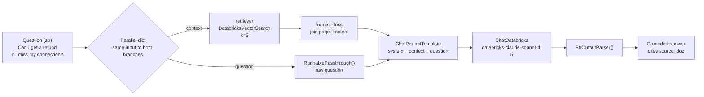
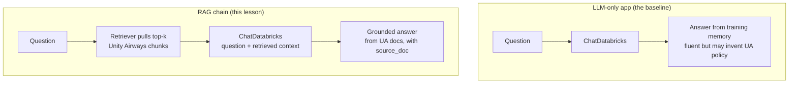

# From an LLM-only app to a full RAG chain  ·  Module 05 · Topic 05.3 (★ cornerstone)  ·  [Hands-on]

> **You are here:** Roadmap Module 05 → 05.3 (cornerstone deep-dive). This is the hands-on payoff for the whole module: you take the retriever from Module 04 and wire it to a chat model so the app answers from Unity Airways' own documents.
> **Prerequisites:** 05.1 (RAG chain anatomy — what "chain" means), 05.2 (`ChatDatabricks` and `DatabricksVectorSearch` from `databricks-langchain`), 04.3 (you have the AI Search index `unity_airways.rag.ua_rag_chunks_index` on endpoint `unity-airways-vs`, built over `content`, keyed on `chunk_id`).

## TL;DR
- An **LLM-only app** is one line: `llm.invoke("...")`. It answers from what the model memorized in training, so it invents a plausible-sounding Unity Airways policy that may be wrong. That is the hallucination you are here to fix.
- A **RAG chain** puts a retrieval step in front of the model: fetch the most relevant chunks from your AI Search index, paste them into the prompt as **context**, and tell the model to answer *only* from that context.
- You assemble it with **LCEL** (LangChain Expression Language) — the `|` pipe operator. The whole chain is `{"context": retriever | format_docs, "question": RunnablePassthrough()} | prompt | llm | StrOutputParser()`.
- Turn on `mlflow.langchain.autolog()` once, and every `chain.invoke(...)` becomes a **trace** you can open in the MLflow UI to see exactly which chunks were retrieved and what the model did with them.
- The `chain` object you build here is a real, runnable Python object. Module 05.5/05.6 logs and registers *this exact object* with MLflow "Model as Code" — so getting the chain right now is the foundation for packaging and deployment later.

## The problem
- Unity Airways wants a customer-facing assistant that answers real policy questions: "Can I get a refund if I miss my connection?", "What is the checked-baggage allowance on Basic Economy?"
- A raw foundation model (Claude, Llama, GPT) has never seen Unity Airways' Conditions of Carriage. It was trained on the public internet, which has a thousand different airlines' policies and none of Unity Airways' specifics.
- Ask it the refund question and it answers **confidently** — it will describe a refund policy in fluent, official-sounding language. The problem: that policy is a statistical average of every airline it read, not Unity Airways' actual rule. It might be off by a fee, a window, or a fare class.
- For a policy assistant, a confident wrong answer is worse than "I don't know." You need the model to answer from *your* documents, with a citation you can check.

## Why the naive approach fails
- **Naive fix #1: just tell the model in the system prompt.** "You are Unity Airways' assistant, be accurate." This changes tone, not knowledge. The model still has no access to the actual policy text, so it still makes things up — now in a more authoritative voice.
- **Naive fix #2: paste the whole policy manual into the prompt.** The Conditions of Carriage, fare rules, and baggage tables are tens of thousands of tokens. You blow past the context window, you pay for every token on every call, and the model's accuracy *drops* as the relevant sentence gets buried in noise ("lost in the middle").
- **Naive fix #3: fine-tune the model on the policies.** Expensive, slow to update (a policy PDF changes and your fine-tune is stale), and it bakes facts into weights where you cannot cite or audit them. Fine-tuning teaches *style and format*, not *current facts*.
- The move that works is **retrieval**: at question time, pull only the handful of chunks that actually answer *this* question and put just those in the prompt. Cheap, current, and citable. That is RAG.

## What it is
- **RAG = Retrieval-Augmented Generation.** Retrieve relevant text, then let the model generate an answer grounded in it.
- A **chain** is a sequence of steps wired together so the output of one feeds the next. LangChain's **LCEL** lets you write that sequence with the `|` pipe, like a Unix pipeline: `retriever | format_docs`, or `prompt | llm | parser`.
- The RAG chain has three moving parts you already own or will write:
  - the **retriever** (Module 04) — turns a question into the top-k chunks,
  - a **prompt template** — a fill-in-the-blanks message with slots for `{context}` and `{question}`,
  - the **chat model** — `ChatDatabricks` pointing at a served foundation model.
- LCEL glues them, plus a tiny `format_docs` function (join the chunks into one string) and a `StrOutputParser` (pull the plain text out of the model's message object).

## Why it matters (for a Databricks FDE)
- This is the single most common thing a customer asks you to build or debug: "our bot gives wrong/generic answers." Nine times out of ten the fix is here — add retrieval, or fix how the chain feeds context to the model.
- The `chain` object is the unit of everything downstream: **05.5** logs it with a signature and dependent resources, **05.6** registers it as "Model as Code," **06** evaluates it with `mlflow.genai.evaluate()`, and **10** wraps it in an agent or app. Get the chain shape right and the rest of the module clicks into place.
- It is squarely on the certification (Domain 3 — Application development): assembling a retriever, prompt, and LLM into a working RAG pipeline and reasoning about each stage.
- `mlflow.langchain.autolog()` turns the chain into an observable system for free — you can show a customer *exactly* which chunk produced an answer, which is how you win trust and diagnose bad retrieval fast.

## Core concepts
- **LCEL (LangChain Expression Language)** — the `|` operator composes any two "runnables" so the left one's output becomes the right one's input. Every piece here (retriever, prompt, model, parser, plain functions) is a runnable.
- **`RunnablePassthrough()`** — a runnable that returns its input unchanged. In the chain it forwards the raw question string straight into the `{question}` slot while the retriever branch does its own work.
- **The parallel dict `{"context": ..., "question": ...}`** — when a step is a Python dict of runnables, LCEL runs each value on the *same* input and produces a dict of results. Here both branches get the question: one turns it into context, the other passes it through. This dict feeds the prompt's two slots.
- **`retriever | format_docs`** — the retriever takes the question and returns a list of `Document` objects; `format_docs` joins their `.page_content` into one string so it can drop into the prompt as text.
- **`ChatPromptTemplate`** — builds the actual messages sent to the model from a `system` instruction (answer only from context, cite the source) and a `human` message carrying `{context}` and `{question}`.
- **`StrOutputParser()`** — the model returns a message object with `.content` plus metadata; the parser extracts just the answer string, so `chain.invoke(...)` returns clean text.
- **`ChatDatabricks(endpoint=...)`** — LangChain wrapper over a Databricks Model Serving endpoint. Same object for the LLM-only baseline and the RAG chain; only what you feed it changes.
- **`mlflow.langchain.autolog()`** — one call that makes every LangChain invoke emit an MLflow **trace**: inputs, outputs, and each span (retriever, prompt, model) with timings.

## 🗺️ Visual map

**The LCEL RAG chain: question → retriever → format_docs → prompt → ChatDatabricks → parser → answer** (mirrored in the HTML explainer):



*Takeaway: the pipe reads left to right. The only "trick" is the parallel dict — it sends the question down two branches at once, then hands both results to the prompt.*

**LLM-only baseline vs the RAG chain** (what retrieval actually changes):



*Takeaway: same model, same question. The only difference is the retrieval step that injects real Unity Airways text before the model speaks.*

## How it works — deep dive

### Start with the baseline so the gap is obvious [Hands-on]
- Before building anything clever, prove the problem. Instantiate `ChatDatabricks` and ask it the policy question directly.
- The answer will be smooth and specific — and that is exactly the trap. The model is pattern-matching on "airline refund policy," not reading Unity Airways' rule. Without the documents it has no way to be right except by luck.
- This baseline is also your **control**: once RAG is wired up, run the same question through both and watch the answer change from generic to grounded.

### The retriever is the "R" — reused, not rebuilt [Hands-on]
- You already created the AI Search index in Module 04. Here you only wrap it as a LangChain retriever with `DatabricksVectorSearch(...).as_retriever(...)`.
- `search_kwargs={"k": 5}` asks for the 5 nearest chunks. `k` is a real dial: too small and you miss the chunk with the answer; too large and you pad the prompt with noise and cost. Start at 5 and tune with evaluation (Module 06).
- Put `source_doc` (and `chunk_id`) in `columns` so every retrieved `Document` carries its origin in `.metadata`. That is what lets the model cite, and what lets *you* debug which document produced an answer.

### `format_docs` — from Documents to a prompt string [Hands-on]
- A retriever returns a `list[Document]`, but a prompt slot needs a single string. `format_docs` bridges that: join each document's `.page_content` with blank lines.
- Keep it simple to start. Later you can include the `source_doc` inline (e.g., prefix each chunk with its filename) so the model can name its source in the answer.

### The prompt is where grounding is enforced [Theory + Hands-on]
- The system message does the heavy lifting: *"Answer only from the context. If the context does not contain the answer, say you don't know. Cite the source."* This instruction is what converts "a model with some extra text" into "a model that stays on the documents."
- The `{context}` slot receives the joined chunks; the `{question}` slot receives the user's question. `ChatPromptTemplate.from_messages([...])` turns both into the message list the chat model expects.
- Grounding is a prompt-plus-retrieval property, not magic. If retrieval misses, even a perfect prompt cannot ground the answer — which is why you debug retrieval first.

### LCEL wiring — reading the pipe [Theory]
- `{"context": retriever | format_docs, "question": RunnablePassthrough()}` is one step: a parallel dict. LCEL feeds the **same** chain input (the question string) into both values.
  - `"context"` branch: question → `retriever` → list of Documents → `format_docs` → context string.
  - `"question"` branch: question → `RunnablePassthrough()` → the same question string, untouched.
- The dict's output `{"context": "...", "question": "..."}` flows into `prompt`, which fills its two slots. `prompt` → `llm` sends the messages to the model. `llm` → `StrOutputParser()` extracts the text.
- Because the input to the chain is a plain string and `RunnablePassthrough()` forwards it, you call `chain.invoke("Can I get a refund if I miss my connection?")` — a bare string, not a dict.

### Tracing makes it observable [Hands-on]
- `mlflow.langchain.autolog()` (call it once, early) hooks LangChain so every `invoke` writes an MLflow trace. No per-call code.
- Open the trace in the MLflow Experiment UI and you see nested spans: the retriever span (with the exact chunks and scores it returned), the prompt span (the fully rendered messages), and the model span (response plus token counts and latency).
- This is how you answer "why did the bot say that?" in seconds — read the retriever span. If the right chunk is not there, the bug is in retrieval/chunking (Modules 03–04), not the model.

## How to do it on Databricks

> **[Hands-on]** Runs on serverless or a DBR ML runtime with **MLflow ≥ 3.1**. You need the Module 04 index `unity_airways.rag.ua_rag_chunks_index` online on endpoint `unity-airways-vs`, and access to a chat serving endpoint. `CATALOG="unity_airways"`, `SCHEMA="rag"`.

**0. Install and set variables:**

```python
%pip install -U databricks-langchain databricks-vectorsearch mlflow
dbutils.library.restartPython()
```

```python
CATALOG        = "unity_airways"
SCHEMA         = "rag"
VS_ENDPOINT    = "unity-airways-vs"
INDEX_NAME     = f"{CATALOG}.{SCHEMA}.ua_rag_chunks_index"
CHAT_ENDPOINT  = "databricks-claude-sonnet-4-5"   # confirm on the supported-models page before naming
```

**1. Turn on tracing first**, so even the baseline call is traced:

```python
import mlflow
mlflow.langchain.autolog()   # every LangChain .invoke() now emits an MLflow trace
```

**2. The LLM-only baseline — watch it answer without your documents:**

```python
from databricks_langchain import ChatDatabricks

llm = ChatDatabricks(endpoint=CHAT_ENDPOINT, temperature=0)   # temperature=0 = deterministic

print(llm.invoke("Can I get a refund if I miss my connection?").content)
# Fluent, official-sounding — but it's a generic airline policy, NOT Unity Airways'.
# This is the hallucination RAG fixes.
```

**How to verify the gap:** the answer will sound authoritative yet mention no Unity Airways specifics (no fare-class names, no actual window). That is your motivation for retrieval.

**3. Build the retriever** (wrap the Module 04 index):

```python
from databricks_langchain import DatabricksVectorSearch

vector_store = DatabricksVectorSearch(
    endpoint=VS_ENDPOINT,
    index_name=INDEX_NAME,
    columns=["chunk_id", "content", "source_doc"],   # source_doc so answers are citable
)
retriever = vector_store.as_retriever(search_kwargs={"k": 5})   # top 5 nearest chunks

# Sanity check the retriever alone before wiring it into a chain:
for d in retriever.invoke("Can I get a refund if I miss my connection?"):
    print(d.metadata.get("source_doc"), "|", d.page_content[:100], "...")
```

**4. Write `format_docs` and the prompt:**

```python
from langchain_core.prompts import ChatPromptTemplate

def format_docs(docs):
    # retriever returns Documents; the prompt needs one string
    return "\n\n".join(d.page_content for d in docs)

prompt = ChatPromptTemplate.from_messages([
    ("system",
     "You are the Unity Airways policy assistant. Answer the question using ONLY the "
     "context below. If the context does not contain the answer, say you don't know. "
     "Cite the source_doc you used.\n\n"
     "Context:\n{context}"),
    ("human", "{question}"),
])
```

**5. Assemble the RAG chain with LCEL:**

```python
from langchain_core.output_parsers import StrOutputParser
from langchain_core.runnables import RunnablePassthrough

chain = (
    {"context": retriever | format_docs, "question": RunnablePassthrough()}
    | prompt
    | llm
    | StrOutputParser()
)
```

**6. Invoke it with a bare string** (because `RunnablePassthrough()` forwards the input):

```python
answer = chain.invoke("Can I get a refund if I miss my connection?")
print(answer)
# Now grounded in the Conditions of Carriage chunks, and it names the source_doc.
```

**How to verify it worked:** the answer now uses Unity Airways' actual language and cites a `source_doc`. Open the trace in the MLflow UI (**Experiments → your experiment → Traces**): the retriever span should show the refund/connection chunks. If the answer is still generic, read that span — the fix is upstream in retrieval, not in the model.

**7. Hand-off note:** `chain` is a runnable object. In **05.5** you log it with a signature and its dependent resources (the serving endpoint + the index); in **05.6** you register it as "Model as Code" so it deploys reproducibly. Keep this object around.

## Worked example (Unity Airways)
- **Baseline:** `llm.invoke("Can I get a refund if I miss my connection?")` returns a smooth paragraph about missed-connection refunds — invented, not Unity Airways'.
- **Retriever:** the same question against `ua_rag_chunks_index` returns the Conditions-of-Carriage chunk covering missed connections and the fare-rules chunk, each with its `source_doc`.
- **Chain:** `format_docs` joins those chunks into `{context}`; the prompt tells the model to answer only from context and cite the source; `ChatDatabricks` generates; `StrOutputParser` returns clean text.
- **Result:** `chain.invoke("Can I get a refund if I miss my connection?")` answers with Unity Airways' real rule and names the document — an answer a customer-service agent could stand behind.
- **Trace:** because `autolog()` is on, the whole run is one trace. You can show the customer the retriever span that produced the answer — provenance, not a black box.
- **Next module use:** this `chain` object goes straight into 05.5 (logging) and 06 (evaluation).

## Uses, edge cases and limitations
| Use it when | Watch out when | Better move |
|---|---|---|
| The app must answer from your own, changing documents | Facts live in a database/table, not text | Add a SQL/Genie tool or an agent (Module 10), not just vector retrieval |
| You want citations and auditability | You need multi-step reasoning or tool calls | Graduate to an agent (`ResponsesAgent`); a linear chain can't branch |
| One question → one grounded answer | The question needs conversation history | Add memory / history (05.4); a bare chain is stateless |
| Retrieval reliably finds the answer chunk | Top chunks are off-topic or near-duplicates | Fix chunking (03) / index columns (04); the chain only relays what retrieval finds |
| Prototyping in a notebook | You need it deployed and versioned | Log as Model-as-Code and deploy (05.5/05.6, 10) |

## Common mistakes / gotchas
| Mistake | Why it hurts | Better move |
|---|---|---|
| Calling `chain.invoke({"question": "..."})` when the chain expects a string | `RunnablePassthrough()` forwards the *whole* input to `{question}`, so a dict lands there literally | Invoke with a bare string, or restructure the input branch to match your input shape |
| `format_docs` returns the Document list, not a string | The prompt renders `[Document(...), ...]` into `{context}` — ugly and token-heavy | Join `d.page_content` into one string |
| No "answer only from context" instruction | The model blends context with its own memory and drifts back to hallucinating | Put the grounding rule in the system message |
| Forgetting `StrOutputParser()` | `chain.invoke` returns a message object, not text; downstream code breaks | End the pipe with `StrOutputParser()` |
| `k` too low | The answer chunk never gets retrieved, so the model truthfully says "I don't know" | Raise `k`, then tune with evaluation (06) |
| Omitting `source_doc` from `columns` | You cannot cite or trace which document answered | Include `source_doc` (and `chunk_id`) in the retriever's `columns` |
| Wrong import root — `langchain_community` / `langchain-databricks` | Those are stale; classes may be missing or deprecated | `from databricks_langchain import ChatDatabricks, DatabricksVectorSearch`; LCEL primitives from `langchain_core` |

> 📌 **IMPORTANT:** The LLM-only baseline and the RAG chain use the **same model**. RAG does not make the model smarter — it changes *what the model sees*. All the quality comes from putting the right chunks in the prompt. So when a RAG answer is wrong, suspect retrieval (chunking, `k`, index columns) before you touch the prompt or swap the model.

> 💡 **TIP:** Build the chain incrementally and test each piece with `.invoke()` before piping: run `retriever.invoke(q)`, then `(retriever | format_docs).invoke(q)`, then `prompt.invoke({"context": "...", "question": q})`, then the whole chain. When something breaks, you already know which link failed. Keep `temperature=0` while developing so runs are reproducible.

> ⚠️ **GOTCHA:** Book 1 (Ch 4) builds the same chain in a **production-shaped** variant: the input is an OpenAI-style `{"messages": [...]}` object, and each branch starts with `itemgetter("messages") | RunnableLambda(extract_user_query_string)` to pull the latest user turn, using `PromptTemplate` and `RunnableLambda(format_docs)`. That shape is what a deployed chat endpoint receives in production. This lesson — and the 05.6 packaging deep-dive, which logs this exact chain — use the simpler **string-in** form (`RunnablePassthrough()` + `ChatPromptTemplate`) so the LCEL wiring is clear — same chain, simpler input contract. Also note the book pins `endpoint="databricks-claude-3-7-sonnet"`; the model catalog moves fast, so confirm the current name (e.g., `databricks-claude-sonnet-4-5`) on the supported-models page before you run.

## 📝 Notes
- _Space for your own notes._

**Self-check (5 questions)**
1. In `{"context": retriever | format_docs, "question": RunnablePassthrough()}`, what input does each branch receive, and what does `RunnablePassthrough()` do?
2. Why must the chain end with `StrOutputParser()`, and what does `chain.invoke(...)` return without it?
3. You get a fluent but wrong answer from the RAG chain. What do you inspect first, and where in the MLflow trace do you look?
4. What is the job of `format_docs`, and what breaks if it returns the raw `Document` list?
5. Why do you invoke this particular chain with a bare string rather than a dict, and what would change if the input were `{"messages": [...]}`?

## How this maps to the certification
- **Domain 3 — Application development** owns this topic. The exam expects you to assemble a retriever, a prompt template, and an LLM into a working RAG pipeline, and to reason about each stage (retrieval → context formatting → prompting → generation → parsing).
- Exam-relevant points: RAG grounds a general model in your data at query time (vs fine-tuning, which changes weights); the prompt must instruct the model to answer from context; retrieval quality (chunking, `k`, embedding match) drives answer quality; and tracing/observability is how you evaluate and debug the pipeline. The `databricks-langchain` integration (`ChatDatabricks`, `DatabricksVectorSearch`) is the Databricks-native way to build it.

## Sources
- 📘 **B1 — *Practical MLflow for Generative AI on Databricks*, Ch 4** ("LangChain and Databricks Integration" → "LLM-only Application" → "Full RAG Chain Application"): `ChatDatabricks(endpoint=..., temperature=, max_tokens=)` + `.invoke(...).content` for the baseline; `DatabricksVectorSearch(...).as_retriever(search_kwargs=...)`; the LCEL chain `{"context": ... | format_docs, "question": ...} | prompt | model | StrOutputParser()`; `mlflow.langchain.autolog()` + `mlflow.set_active_model(...)` for tracing/versioning. Note: O'Reilly Early Release (RAW & UNEDITED) — the book uses the `{"messages": [...]}` input shape and `endpoint="databricks-claude-3-7-sonnet"`; verified imports live from the book's own code (`from databricks_langchain import ChatDatabricks, DatabricksVectorSearch`; `from langchain_core.prompts import PromptTemplate`; `from langchain_core.output_parsers import StrOutputParser`; `from langchain_core.runnables import RunnableLambda`).
- 🌐 LangChain docs — LCEL and core primitives: `ChatPromptTemplate` in `langchain_core.prompts`, `StrOutputParser` in `langchain_core.output_parsers`, `RunnablePassthrough` in `langchain_core.runnables` (`python.langchain.com/api_reference/core/`). *Live re-check pending — verified against Book 1 Ch4 code, which imports the same `langchain_core` submodules.*
- 🌐 Databricks — `databricks-langchain` integration: `ChatDatabricks` (wrapper over a Model Serving endpoint) and `DatabricksVectorSearch` (wrapper over an AI Search index). Import is `from databricks_langchain import …` — **not** `langchain-databricks` or `langchain_community`.
- 🌐 MLflow — LangChain autologging / tracing: `mlflow.langchain.autolog()` records each `invoke` as a trace with retriever/prompt/model spans (`mlflow.org/docs/latest/genai/tracing/`).
- 🧭 Naming cross-check: `.claude/skills/genai-teacher/references/naming-conventions.md` §2 (LangChain import is `databricks-langchain`), §3 (AI Search; SDK still `databricks-vectorsearch`), §4 (served-model names churn — confirm `databricks-claude-sonnet-4-5` on the supported-models page).
