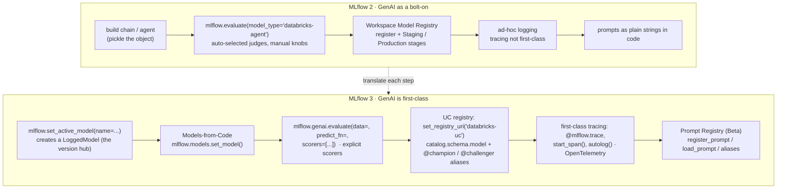
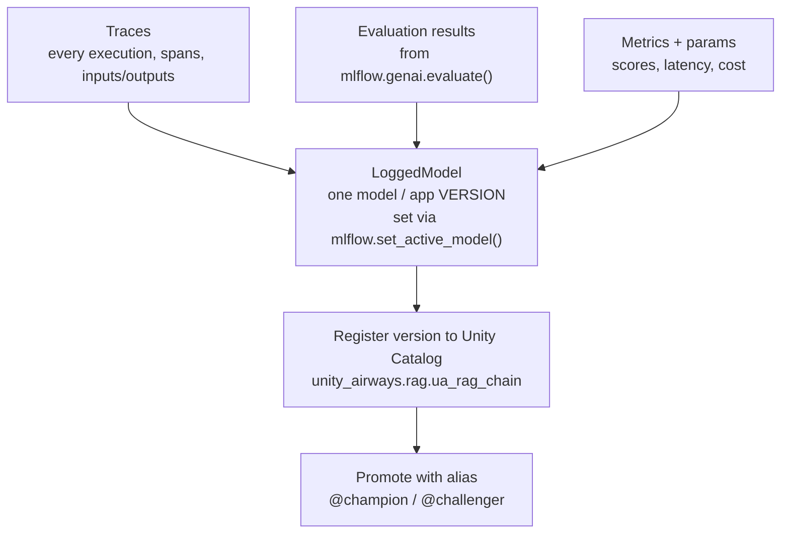

# From MLflow 2 to MLflow 3 — what changed for GenAI  ·  Module 06 · Topic 06.2 (★ cornerstone)  ·  [Theory]

> **You are here:** Roadmap Module 06 → 06.2 (cornerstone deep-dive). This is the single most important accuracy topic in the module: the two books teach MLflow the way it looked in the 2.x era, and MLflow 3 renamed or replaced most of the GenAI surface. This lesson is your migration map so you never teach a dead API.
> **Prerequisites:** 06.1 (Experiments, Runs, Model Registry — the core tracking objects that *carry over*). None of the MLflow-3 GenAI surface requires deep prior knowledge; that is the point of reading this before 06.3–06.8.

## TL;DR
- MLflow 3 **keeps** the core tracking model you already know — Experiments, Runs, params, metrics, artifacts — so migration from 2.x is mostly additive, not a rewrite. (Verified: B1 Ch1, "it still preserves its core tracking concepts, making migration from 2.x quick and simple.")
- What is **new for GenAI**: a first-class **LoggedModel** (a model/app version that links its own traces, evals, and metrics via `mlflow.set_active_model()`), a rewritten **`mlflow.genai.evaluate()`** stack, **first-class OpenTelemetry-based tracing**, **Models-from-Code** packaging, a **UC-first registry with aliases** instead of stages, and a **Prompt Registry** (Beta).
- The trap: the MLflow book predates the `mlflow.genai` surface, so it shows **MLflow-2-style APIs** (for example `mlflow.evaluate(model_type="databricks-agent")`). Those are *former* names. Teach and write the MLflow-3 names.
- Two APIs to never get wrong: GenAI eval is **`mlflow.genai.evaluate(...)`** (not `mlflow.evaluate(model_type=...)`, and there is **no** `agents.evaluate()`); and you must now pass **`scorers=[...]` explicitly** — MLflow 3 does not auto-select judges for you.
- Registry moved: **`mlflow.set_registry_uri("databricks-uc")`**, three-level names like `unity_airways.rag.ua_rag_chain`, and **`@champion`/`@challenger` aliases** replace the old `Staging`/`Production` stages.

## The problem
- You are learning MLflow from *Practical MLflow for GenAI* (B1) and the certification guide (B2). Both are excellent for the mental model — but the MLflow book is an O'Reilly Early Release, and it lags the shipped product.
- When you copy an API straight out of the book into a Databricks notebook running **MLflow ≥ 3.1**, some calls throw, some are deprecated, and some quietly behave differently than the text describes.
- A Databricks Field Engineer hits this in front of customers. A customer says "the docs show `mlflow.genai.evaluate` but my notebook uses `mlflow.evaluate(model_type='databricks-agent')` — which is right?" You need to answer instantly and correctly.
- So the real problem is not "how do I use MLflow." It is "**which MLflow am I looking at**, and how do I translate the 2.x pattern in front of me into the 3.x pattern that actually runs today."

## Why the naive approach fails
- The naive move is to trust the book's API names because the book is the assigned source of truth for concepts.
- That works for **concepts** (what a Run is, why you log metrics). It breaks for **GenAI APIs**, because the biggest jump in the whole platform — MLflow 2 → 3 — happened *after* the book's GenAI examples were written.
- Concrete failures you will see if you paste 2.x GenAI code into a 3.x runtime:
  - `mlflow.evaluate(model_type="databricks-agent", ...)` — the `model_type`/`evaluator_config` path for GenAI is gone; the GenAI entry point is now `mlflow.genai.evaluate(...)`.
  - `agents.evaluate(...)` — this function **never existed** under that literal name; people invent it by analogy. Do not teach it.
  - Relying on MLflow to **auto-pick judges** — in 3.x you must pass `scorers=[...]` yourself, or you evaluate nothing.
  - Registering a model with no registry URI and then setting a **`Production` stage** — on Databricks the registry is Unity Catalog, names are three-level, and promotion is done with **aliases**, not stages.
- Root cause in one line: **the books froze the 2.x GenAI vocabulary; the product moved on.** The fix is a translation table you carry in your head — which is what this topic builds.

## What it is
- **MLflow 3** is the release line that reorients MLflow around GenAI: experiment tracking, observability, and performance evaluation for LLM apps and agents, while preserving the classic-ML tracking core. (B1 Ch1.)
- Think of it as three layers:
  - **Unchanged core (carries over):** Experiments, Runs, params, metrics, artifacts, `log_model`, signatures. Your 06.1 knowledge is still valid.
  - **New GenAI identity + observability:** **LoggedModel** as a first-class version object, **tracing** as a first-class citizen, and **Models-from-Code** as the recommended way to package chains/agents.
  - **Rewritten GenAI workflows:** the `mlflow.genai.*` namespace — `evaluate`, `scorers`, `judges`, `labeling`, `datasets`, and the **Prompt Registry** — plus a **UC-first registry** with aliases.
- On Databricks specifically, the managed MLflow *is the same open-source package* plus a governance layer (Unity Catalog), so everything here applies whether you run OSS MLflow or Managed MLflow — the registry location and governance are what differ. (B1 Ch1, "Open Source vs. Databricks Implementations.")

## Why it matters (for a Databricks FDE)
- **Credibility.** The fastest way to lose a technical audience is to demo a deprecated API. This topic is your inoculation against that.
- **Every later module rides on it.** Evaluation (Module 08), tracing/observability (Module 07), deployment and monitoring (Modules 11+) all assume the MLflow-3 names. Learn the map once here and the rest of the roadmap stops surprising you.
- **It is the crux of book-vs-docs conflict.** CLAUDE.md's no-hallucination rule says "when books conflict with current docs, prefer docs and flag the difference." This lesson *is* that flag, written down, for the one place it matters most.
- **Certification.** The exam is written against the current product. Knowing `mlflow.genai.evaluate()`, UC aliases, and LoggedModel is worth real points in Domains 3 and 4.

## Core concepts
- **Tracking core (unchanged):** an **Experiment** groups **Runs**; a Run logs params, metrics, tags, and artifacts. MLflow 3 does not change this — it builds on top of it.
- **LoggedModel (new in MLflow 3):** a first-class object representing one **version of a model or GenAI app**. It becomes the hub that **links that version to its traces, evaluation results, and metrics**. You activate it with `mlflow.set_active_model(name=...)` so subsequent traces and evals attach to it. (Grounded: naming-conventions §1; B1 Ch4 shows `active_model_info = mlflow.set_active_model(name=logged_model_name)`.)
- **`mlflow.genai.evaluate()`:** the GenAI evaluation entry point. Signature shape: `evaluate(data=, predict_fn=, scorers=[...])`. Replaces the MLflow-2 `mlflow.evaluate(model_type="databricks-agent"/"question-answering")`.
- **Scorers and judges:** deterministic or LLM-based graders. Built-in scorers live in **`mlflow.genai.scorers`**; LLM judges in **`mlflow.genai.judges`**; you build custom ones with **`@scorer`** and **`make_judge()`**. In 3.x you **must pass `scorers=[...]` explicitly**.
- **Tracing (first-class):** instrument code with **`@mlflow.trace`**, open manual spans with **`mlflow.start_span()`**, or auto-capture a library with **`mlflow.<lib>.autolog()`** (openai, langchain, anthropic, …). Traces are **OpenTelemetry-compatible** and follow GenAI semantic conventions.
- **Models-from-Code:** package a chain/agent by logging the **code that builds it** (`mlflow.models.set_model()`), not a pickle. Recommended over cloudpickle for GenAI. (Full treatment in Module 05.6.)
- **UC-first registry + aliases:** point the registry at Unity Catalog with **`mlflow.set_registry_uri("databricks-uc")`**, register under a **three-level name** `catalog.schema.model`, and promote with **`@champion`/`@challenger` aliases** (plus tags) instead of the old `Staging`/`Production` **stages**.
- **Prompt Registry (Beta on Databricks):** version prompts as first-class objects — `register_prompt`, `load_prompt`, `search_prompts`, `set_prompt_alias`; URIs like `prompts:/name/1` or `prompts:/name@alias`; `{{variable}}` templates.
- **Former (MLflow 2) vocabulary you will still see in the book:** `mlflow.evaluate(model_type=...)`, auto-selected judges, `request`/`response`/`expected_response` dataset columns, workspace Model Registry, `Staging`/`Production` stages, prompts as plain strings. Recognize them; translate them.

## 🗺️ Visual map

**MLflow 2 GenAI flow vs MLflow 3 GenAI flow** — the migration at a glance (mirrored in the HTML explainer):



*Takeaway: the core tracking spine is the same; the GenAI workflow around it was rebuilt. Read left, write right.*

**What links to what: the LoggedModel graph (new in MLflow 3)** — why the version object matters:



*Takeaway: in MLflow 2 traces, evals, and metrics floated loose around a Run. In MLflow 3 they all hang off one LoggedModel version, so "which version produced this trace / this score" has a definite answer.*

## How it works — deep dive

### 1. LoggedModel becomes first-class [Theory]
- In MLflow 2, a GenAI "model" was mostly a logged artifact under a Run. There was no single object that tied a *version* of your app to the traces it produced and the evals it scored.
- MLflow 3 introduces **LoggedModel**: a first-class version object. You call **`mlflow.set_active_model(name="ua_rag_chain_v1")`**, and from then on the traces you capture and the evals you run **attach to that version**.
- Why it matters: debugging and comparison get a stable anchor. "Version `@champion` regressed on groundedness" is answerable because the score, the traces, and the version are one linked unit.
- Trade-off: it is one more concept to set up, and if you forget `set_active_model`, your traces/evals still record but are not linked to a named version — you lose the tidy lineage. (Grounded: naming-conventions §1 "LoggedModel + set_active_model() — didn't exist in MLflow 2"; B1 Ch4 usage. Live doc re-check pending — the MLflow logged-model page is JS-rendered.)

### 2. GenAI evaluation was rewritten [Theory]
- **MLflow 2 (book style):** `mlflow.evaluate(model=..., model_type="databricks-agent" or "question-answering", extra_metrics=[...], evaluator_config=...)`. MLflow picked default judges for the `model_type`; you tuned "manual knobs." (B1 Ch1 describes exactly this: "the more automated judge selection in version 2, where there were more manual knobs and steps.")
- **MLflow 3 (current):** `mlflow.genai.evaluate(data=, predict_fn=, scorers=[...])`. The mapping is mechanical:
  - `model=` → `predict_fn=` (a callable that produces outputs),
  - `extra_metrics=` → `scorers=[...]`,
  - `model_type=` / `evaluator_config=` → **removed**.
- **You must pass `scorers=[...]` explicitly.** 3.x does not auto-select — if you pass nothing, you measure nothing.
- Where the graders live now:
  - Built-in **scorers** in `mlflow.genai.scorers` — e.g. `Correctness`, `Guidelines`, `RelevanceToQuery`, `Safety`, `RetrievalGroundedness`, `RetrievalRelevance`, `RetrievalSufficiency`.
  - **Judges** in `mlflow.genai.judges`; custom logic via **`@scorer`** and **`make_judge()`**.
- **There is no `agents.evaluate()`.** Agents are evaluated with the same `mlflow.genai.evaluate()`. (naming-conventions §2 + §9.)
- Dataset fields changed too: the old `request` / `response` / `expected_response` / `retrieved_context` columns become **`inputs` / `outputs` / `expectations`**, and `retrieved_context` is now read from **traces**.

### 3. Tracing is first-class and OpenTelemetry-based [Theory]
- MLflow 2 could log inputs/outputs, but tracing a multi-step chain was ad-hoc.
- MLflow 3 makes tracing a core feature: capture spans automatically or by hand.
  - **`@mlflow.trace`** decorates a function so each call becomes a span.
  - **`mlflow.start_span()`** opens a manual span for finer control.
  - **`mlflow.<lib>.autolog()`** auto-instruments a whole library (`mlflow.langchain.autolog()`, `mlflow.openai.autolog()`, …).
- Traces are **OpenTelemetry-compatible** and follow GenAI semantic conventions, so they interoperate with standard observability tooling. On Databricks, high-volume trace ingestion and production monitoring build on this. (B1 Ch1 "Comprehensive Tracing" + "Tracing and Observability"; naming-conventions §1.)
- Why it matters: RAG and agent apps are opaque without a span tree. Tracing turns "the answer was wrong" into "the retriever returned the wrong chunk at span 3."

### 4. Models-from-Code over pickling [Theory]
- MLflow 2's default was to serialize the model object (cloudpickle). For GenAI apps that hold **live clients** (a Vector Search retriever, a serving-endpoint LLM), pickling is fragile and often fails.
- MLflow 3 recommends **Models-from-Code**: log the `.py` that *builds* the chain, ending with `mlflow.models.set_model(chain)`. Loading re-runs the code and rebuilds live clients fresh.
- Flavor logging (`mlflow.langchain.log_model`, `mlflow.pyfunc.log_model`) still exists and is still valid — it is the *door*; Models-from-Code is the recommended *input*. (Full mechanism: Module 05.6. Grounded: naming-conventions §1.)

### 5. UC-first registry and aliases replace stages [Theory]
- **MLflow 2 / OSS mental model:** a **Workspace Model Registry** with a two-level name and lifecycle **stages** — `None` → `Staging` → `Production` → `Archived` — moved by "stage transitions."
- **MLflow 3 on Databricks:** the registry is **Unity Catalog**.
  - Point at it: `mlflow.set_registry_uri("databricks-uc")`.
  - Register under a **three-level name**: `catalog.schema.model`, e.g. `unity_airways.rag.ua_rag_chain`.
  - Promote with **aliases** — `@champion`, `@challenger` — plus **tags** for metadata. Aliases are *mutable pointers* to immutable versions; tags carry status/labels.
- Why the change: aliases + UC give governance, lineage, and multi-workspace access that stages never did, and they decouple "which version is live" from a rigid three-stage ladder. (B1 Ch1 "Model Registry from MLflow server to Databricks Unity Catalog"; aliases confirmed B1 pp.17, 38; naming-conventions §2.)
- Watch out: the classic-ML **stage** vocabulary still appears in older tutorials and the OSS workspace registry. On Databricks/UC, translate stages → aliases.

### 6. Prompt Registry is a new surface [Theory]
- In MLflow 2, prompts were plain strings or run params — untracked and hard to compare.
- MLflow 3 adds a **Prompt Registry**: prompts are versioned, first-class objects.
  - `register_prompt(...)`, `load_prompt(...)`, `search_prompts(...)`, `set_prompt_alias(...)`.
  - Reference by URI: `prompts:/name/1` (version) or `prompts:/name@alias`.
  - Templates use `{{variable}}` placeholders; versioning is Git-inspired/commit-based with aliases for safe promotion. (B1 Ch1 "Management of Iterative Prompts and Models"; B1 pp.89–90.)
- **Status: Beta on Databricks** (UC-backed schema; needs `mlflow[databricks]>=3.1`). Teach it as a real surface but label the maturity.

## MLflow 2 → MLflow 3 mapping (carry this table)

| MLflow 2 concept / API (former — often in the book) | MLflow 3 concept / API (teach this) | Status |
|---|---|---|
| `mlflow.evaluate(model_type="databricks-agent" / "question-answering")` | `mlflow.genai.evaluate(data=, predict_fn=, scorers=[...])` | GA |
| Auto-selected judges; `extra_metrics=`; `databricks.agents.evals.metric` / `.judges` | Explicit `scorers=[...]`; built-ins in `mlflow.genai.scorers`; judges in `mlflow.genai.judges`; custom via `@scorer` + `make_judge()` | GA |
| `agents.evaluate(...)` (commonly assumed — never existed) | Evaluate agents with the same `mlflow.genai.evaluate()` | GA (no such function as `agents.evaluate`) |
| Eval-dataset fields `request`, `response`, `expected_response`, `retrieved_context` | `inputs`, `outputs`, `expectations`; `retrieved_context` read from traces | GA |
| Ad-hoc input/output logging; tracing not first-class | First-class tracing: `@mlflow.trace`, `mlflow.start_span()`, `mlflow.<lib>.autolog()` (OpenTelemetry) | GA |
| No version object linking traces/evals/metrics | **LoggedModel** + `mlflow.set_active_model()` links a version to its traces, evals, metrics | GA (new in MLflow 3) |
| Pickle / cloudpickle the model object | **Models-from-Code**: `mlflow.models.set_model()` (flavor logging still valid) | GA (recommended) |
| Workspace Model Registry; two-level name | UC registry: `mlflow.set_registry_uri("databricks-uc")`; three-level `catalog.schema.model` | GA |
| Lifecycle **stages** `Staging` / `Production` + stage transitions | **Aliases** `@champion` / `@challenger` + tags | GA |
| Prompts as plain strings / run params | **Prompt Registry**: `register_prompt` / `load_prompt` / `search_prompts` / `set_prompt_alias`; `prompts:/name@alias` | Beta on Databricks |
| "Lakehouse Monitoring for generative AI" (MLflow 2 monitoring) | Production monitoring that **reuses the same scorers/judges** as offline eval | Beta |

## How to do it on Databricks (the translation, in code)

> **[Theory]** These snippets are illustrative *contrasts* — old (do not ship) vs new — not a runnable notebook flow. Assume **MLflow ≥ 3.1** on serverless or a DBR ML runtime, with `CATALOG="unity_airways"`, `SCHEMA="rag"`.

**Evaluation — translate the entry point:**

```python
# ── MLflow 2 (book style) — deprecated GenAI path ──
import mlflow
mlflow.evaluate(
    model=my_chain,
    model_type="databricks-agent",      # gone for GenAI in 3.x
    data=eval_df,                        # request / response / expected_response
)

# ── MLflow 3 (current) ──
import mlflow
from mlflow.genai.scorers import Correctness, RelevanceToQuery, RetrievalGroundedness

results = mlflow.genai.evaluate(
    data=eval_df,                        # inputs / outputs / expectations
    predict_fn=my_chain.invoke,          # was model=
    scorers=[Correctness(), RelevanceToQuery(), RetrievalGroundedness()],  # MUST be explicit
)
```

**Version identity — link traces/evals to a LoggedModel:**

```python
# New in MLflow 3: name the version, then everything links to it.
active = mlflow.set_active_model(name="ua_rag_chain_v1")
# ...run/trace/eval the app; traces + eval results attach to this LoggedModel version.
```

**Tracing — instrument instead of hand-logging:**

```python
import mlflow

mlflow.langchain.autolog()               # auto-capture the whole chain as spans

@mlflow.trace                            # or trace a specific function
def retrieve(question: str):
    return retriever.invoke(question)
```

**Registry — UC name + alias instead of stage:**

```python
# ── MLflow 2 / OSS workspace registry (stages) ──
# client.transition_model_version_stage(name="ua_rag_chain", version=1, stage="Production")

# ── MLflow 3 on Databricks (UC + aliases) ──
mlflow.set_registry_uri("databricks-uc")
mv = mlflow.register_model("runs:/<run_id>/model", "unity_airways.rag.ua_rag_chain")

from mlflow import MlflowClient
MlflowClient().set_registered_model_alias(
    name="unity_airways.rag.ua_rag_chain", alias="champion", version=mv.version,
)
```

**How you'd verify the translation is right** (conceptual check, no run needed):
- If a snippet calls `mlflow.evaluate(model_type=...)` or `agents.evaluate(...)`, it is 2.x — rewrite to `mlflow.genai.evaluate(...)`.
- If it sets a `stage="Production"`, it is workspace-registry — rewrite to a UC three-level name + `@champion` alias.
- If prompts are inline strings you want to version, reach for the Prompt Registry (Beta).

## Worked example (Unity Airways)
- You inherited a notebook that logs and evaluates the Unity Airways RAG chain the **MLflow-2** way: it pickles the chain, calls `mlflow.evaluate(model_type="databricks-agent")`, and pushes the model to the workspace registry with a `Production` stage.
- On the current **MLflow ≥ 3.1** runtime, three things bite: pickling the chain (live Vector Search retriever) is fragile, `model_type="databricks-agent"` is not the GenAI path anymore, and the workspace-stage promotion is not how UC works.
- You translate it:
  - Package with **Models-from-Code** (`mlflow.models.set_model(chain)` in `rag_chain.py`) — Module 05.6.
  - Name the version: `mlflow.set_active_model(name="ua_rag_chain_v1")` so traces and eval results link to that **LoggedModel**.
  - Turn on tracing: `mlflow.langchain.autolog()`.
  - Evaluate with `mlflow.genai.evaluate(data=eval_df, predict_fn=chain.invoke, scorers=[Correctness(), RetrievalGroundedness(), Safety()])`.
  - Register to UC as `unity_airways.rag.ua_rag_chain` and promote by setting the **`@champion`** alias — no stages.
- Same app, same answers. The difference is that "which version, scored how, from which traces" is now one linked, governed story instead of scattered 2.x artifacts.

## Uses, edge cases and limitations
| Use the MLflow-3 pattern when | Watch out when | Better move |
|---|---|---|
| Building or evaluating any GenAI app/agent today | You copied `mlflow.evaluate(model_type=...)` from the book | Rewrite to `mlflow.genai.evaluate(data=, predict_fn=, scorers=[...])` |
| You want traces, evals, metrics tied to one version | You forgot `mlflow.set_active_model()` | Call it before running; otherwise lineage is not linked to a named version |
| Promoting a model on Databricks | You reach for `Staging`/`Production` stages | Use UC three-level name + `@champion`/`@challenger` aliases |
| Classic ML (sklearn, XGBoost) tracking | You assume everything changed | The tracking core is unchanged; only the GenAI surface is new |
| Versioning prompts | You treat Prompt Registry as GA | It is **Beta on Databricks** — label maturity, expect changes; needs `mlflow[databricks]>=3.1` |
| Production monitoring of a deployed app | You expect the MLflow-2 "Lakehouse Monitoring for GenAI" | Use MLflow-3 production monitoring (Beta) that reuses the same scorers/judges |

## Common mistakes / gotchas
| Mistake | Why it hurts | Better move |
|---|---|---|
| Teaching `mlflow.evaluate(model_type="databricks-agent")` as current | It is the deprecated 2.x GenAI path; misleads the audience | `mlflow.genai.evaluate(data=, predict_fn=, scorers=[...])` |
| Inventing `agents.evaluate()` | No such function exists; pure hallucination | Evaluate agents with `mlflow.genai.evaluate()` |
| Calling `mlflow.genai.evaluate()` with no `scorers` | 3.x does not auto-select — you measure nothing | Pass `scorers=[...]` explicitly from `mlflow.genai.scorers` / `mlflow.genai.judges` |
| Using `Staging`/`Production` stages on Databricks | UC does not use stages; promotion won't behave as expected | `mlflow.set_registry_uri("databricks-uc")` + three-level name + aliases |
| Registering with a two-level name | UC requires `catalog.schema.model` | `unity_airways.rag.ua_rag_chain` |
| Skipping `set_active_model()` | Traces/evals don't link to a version; you lose comparison lineage | Set the active LoggedModel first |
| Treating the old dataset columns (`request`/`response`) as current | 3.x eval expects `inputs`/`outputs`/`expectations` | Rename fields; read `retrieved_context` from traces |
| Assuming Prompt Registry / production monitoring are GA | They are Beta; enrollment/behavior can change | Label Beta; confirm on current docs before a customer demo |

> 📌 **IMPORTANT:** MLflow 3 **keeps** your tracking core (Experiments, Runs, params, metrics, artifacts) and **adds/rewrites** the GenAI layer. The two facts to never get wrong: GenAI eval is **`mlflow.genai.evaluate(data=, predict_fn=, scorers=[...])`** (there is **no** `agents.evaluate()` and `mlflow.evaluate(model_type="databricks-agent")` is the former path), and you must pass **`scorers=[...]` explicitly**.

> 💡 **TIP · field:** Keep the mapping table above open when you read the MLflow book. When you hit a GenAI API in the text, translate it before you type it: `mlflow.evaluate(model_type=...)` → `mlflow.genai.evaluate(...)`, `stage="Production"` → `@champion` alias, inline prompt → Prompt Registry. The book is right about *why*; the docs are right about *what to call it*.

> ⚠️ **GOTCHA:** LoggedModel, first-class tracing, and Models-from-Code are **new in MLflow 3** and required for the clean lineage story — but **Prompt Registry, production monitoring, and Unity AI Gateway are Beta/Preview**. Don't present Beta features as GA in front of a customer, and re-verify status at authoring time, since Databricks GenAI names and maturity churn fast. (LoggedModel live-doc re-check pending — the MLflow logged-model page is JS-rendered; grounded here in naming-conventions §1 + B1 Ch4.)

## 📝 Notes
- _Space for your own notes._

**Self-check (5 questions)**
1. Name three things that **carry over unchanged** from MLflow 2 to MLflow 3, and three things that are **new or rewritten** for GenAI.
2. A notebook calls `mlflow.evaluate(model_type="databricks-agent", data=df)`. Rewrite it as the MLflow-3 equivalent, and say what you must not forget to pass.
3. What is a **LoggedModel**, which function activates it, and what does it link together?
4. On Databricks/UC, how do you promote model version 3 of `unity_airways.rag.ua_rag_chain` to production without using stages?
5. Which of these are **Beta** (not GA): Prompt Registry, `mlflow.genai.evaluate`, first-class tracing, production monitoring?

## How this maps to the certification
- **Domain 3 (evaluation & monitoring)** and **Domain 4 (deployment & operations)** both assume the MLflow-3 vocabulary: `mlflow.genai.evaluate()` with explicit scorers, tracing for observability, UC registration with aliases, and LoggedModel-based lineage.
- Exam-relevant translations to memorize: eval entry point (`mlflow.genai.evaluate`, not `mlflow.evaluate(model_type=...)`, no `agents.evaluate`); UC registry + aliases (not stages); tracing decorators/autolog; Models-from-Code as the recommended packaging path. Getting the *former-vs-current* naming right is exactly what the exam tests when it lists plausible-looking wrong APIs.

## Sources
- 📘 **B1 — *Practical MLflow for Generative AI on Databricks*, Ch 1** ("From MLflow 2 to MLflow 3": preserves core tracking concepts, migration from 2.x "quick and simple"; "Advanced GenAI Evaluation" names `mlflow.genai.evaluate()` and contrasts it with MLflow-2 "automated judge selection … more manual knobs"; "Comprehensive Tracing" / "Tracing and Observability" incl. OpenTelemetry; "Model Registry from MLflow server to Databricks Unity Catalog"; "Management of Iterative Prompts and Models" → Prompt Registry with commit-based versioning and aliases). Also B1 Ch4 for `mlflow.set_active_model(name=...)` / LoggedModel usage and B1 pp.17/38 for `@champion` aliases + tags. *(O'Reilly Early Release — RAW & UNEDITED; the book predates the full `mlflow.genai` surface, so verify API names against current docs.)*
- 🌐 MLflow Docs — **GenAI evaluation** (`mlflow.org/docs/latest/genai/eval-monitor/`): `mlflow.genai.evaluate` with `predict_fn=` and explicit `scorers=` verified live (curl). **Tracing** (`mlflow.org/docs/latest/genai/tracing/`): OpenTelemetry + autolog verified live (curl). **Prompt Registry** (`mlflow.org/docs/latest/genai/prompt-registry/`): `register_prompt` / `load_prompt` verified live (curl).
- 🌐 MLflow / Databricks Docs — **LoggedModel** (`docs.databricks.com/aws/en/mlflow/logged-model`): grounded in naming-conventions §1 and B1 Ch4; live-page grep returned empty (JS-rendered) — **live re-check pending**.
- 🧭 Naming cross-check: `.claude/skills/genai-teacher/references/naming-conventions.md` **§1** (the MLflow-2→3 map: `mlflow.genai.evaluate` vs `mlflow.evaluate(model_type=...)`; scorers/judges; `inputs`/`outputs`/`expectations`; tracing; LoggedModel + `set_active_model()`; Prompt Registry Beta; Models-from-Code; production monitoring Beta) and **§2 / §9** (register to Unity Catalog; no `agents.evaluate()`; UC aliases). Every MLflow-3 name in this lesson is grounded in §1/§2.
