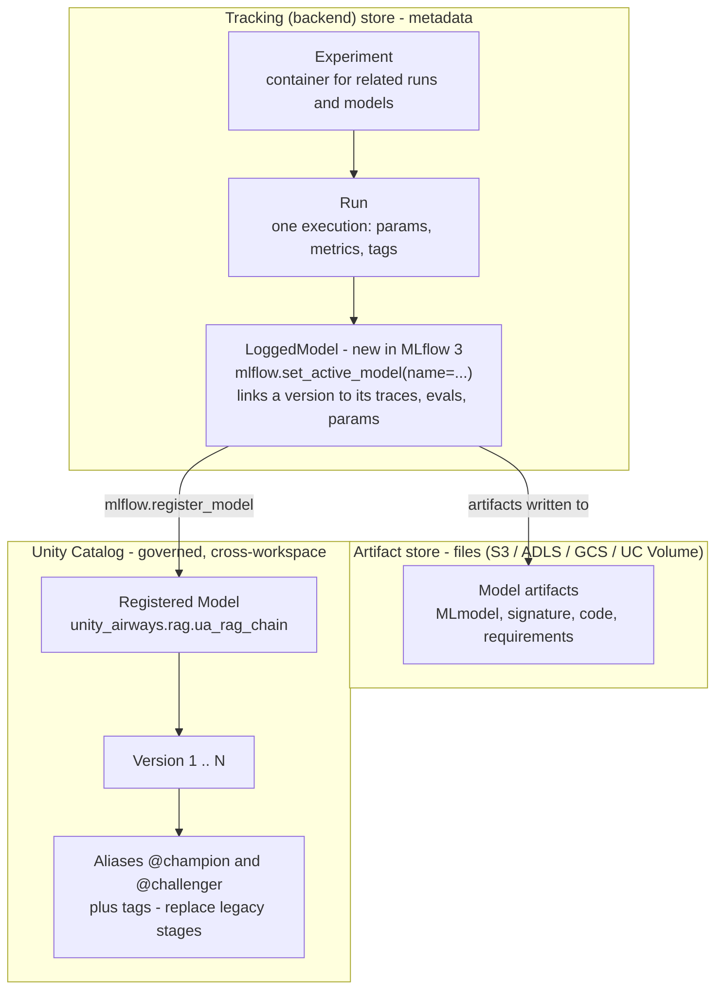
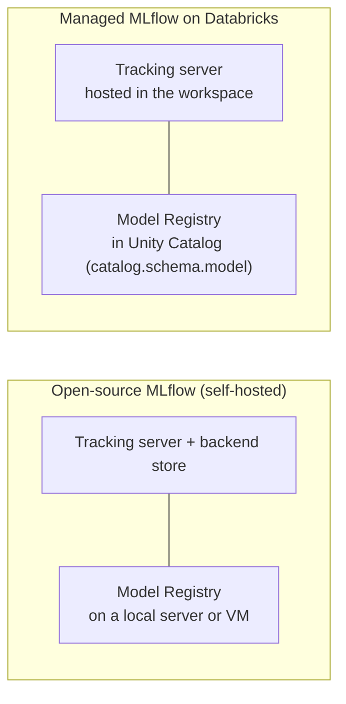

# MLflow for GenAI Core  ·  Module 06  ·  Topics 06.1–06.8  ·  [Theory + Hands-on]

> **You are here:** Roadmap Module 06 → MLflow for GenAI core (all topics 06.1–06.8). This is the backbone the whole track leans on — tracking, versioning, and governing GenAI apps.
> **Prerequisites:** Module 00–02 (platform + prompt basics). No deep prereqs; this module *formalizes* the MLflow ideas you already met in **Module 05.5–05.7** while building the RAG chain. Next stops: **Module 07 — MLflow Tracing** (goes deep on traces/spans) and **Module 08 — Evaluation** (goes deep on `mlflow.genai.evaluate()`).

This page is the **module hub**. It carries one numbered entry per topic. Two topics are the module's cornerstones (★) and have their own deep-dive pages:
- **06.2 — From MLflow 2 → MLflow 3 (what changed for GenAI)** → `mlflow-2-to-3.md` / `mlflow-2-to-3.html`
- **06.5 — Unity Catalog Model Registry (registration, aliases, tags)** → `uc-model-registry.md` / `uc-model-registry.html`

Everything below rides one running artifact: the **Unity Airways** RAG chain that Module 05 registered as **`unity_airways.rag.ua_rag_chain`** (`CATALOG="unity_airways"`, `SCHEMA="rag"`). Module 05 *used* MLflow to package and version that chain; Module 06 explains the machinery underneath — what an Experiment, Run, LoggedModel, and Registered Model actually are, and where their data lives.

> 📌 **The one rule that shapes this entire module — teach MLflow 3, not MLflow 2.**
> The MLflow book (📘B1) is an O'Reilly Early Release and predates the `mlflow.genai` surface, so it still shows MLflow-2 patterns (`mlflow.evaluate(...)`, stage transitions, `mlflow.sklearn.log_model(model, "name")`). We standardize on the **MLflow 3** names:
> - **`mlflow.set_active_model()`** creates a **LoggedModel** — new in MLflow 3, the hub that links an app version to its traces, evals, and metrics.
> - **`mlflow.models.set_model()`** (Models-from-Code) is the recommended way to log chains/agents, not pickling.
> - Register to UC with **`mlflow.set_registry_uri("databricks-uc")`** and a three-level name `catalog.schema.model`. **Aliases** (`@champion`/`@challenger`) plus **tags** replace the legacy **stages**.
> - Evaluate with **`mlflow.genai.evaluate()`** (Module 08), *not* `mlflow.evaluate(model_type="databricks-agent")`.

---

## TL;DR
- **MLflow** is the open-source platform that turns messy GenAI iteration into a tracked, reproducible, governable process. Its three core objects are **Experiments** (containers), **Runs** (one execution, with params/metrics/tags), and the **Model Registry** (where a finished model gets versioned and promoted).
- **MLflow 3** kept those core concepts but bolted on a GenAI layer: **Tracing**, **`mlflow.genai.evaluate()`**, the **Prompt Registry**, and the **LoggedModel** — the object `mlflow.set_active_model()` creates to tie one app version to its traces and evals. This is topic 06.2 (★).
- **Open-source vs Managed:** it's the *same* pip package either way (no vendor lock-in). Databricks manages the tracking server and moves the registry into **Unity Catalog**, adding governance, lineage, and cross-workspace sharing for free.
- The **Unity Catalog Model Registry** uses a three-level name (`unity_airways.rag.ua_rag_chain`), promotes versions with **aliases** (`@champion`) and **tags** — not stages — and inherits UC's access control and audit. This is topic 06.5 (★).
- Under the hood MLflow splits storage in two: a **backend (tracking) store** for metadata — experiments, runs, params, metrics, LoggedModels — and an **artifact store** for files (the model, signature, plots). **Nested runs** let one parent run group its children.

## The problem
- A GenAI team iterates constantly: new prompt wording, a different `k`, a swapped model, a re-chunked corpus. Each change produces a slightly different app. Without a system, "which version answered this way, and what produced it?" becomes unanswerable within a week.
- The Unity Airways assistant has to be **trustworthy** — a support bot that quotes refund policy can't be a black box. Regulated-industry reality means you need an **auditable history**: what code, what data, what config, what model produced a given answer.
- You also need to **compare** iterations objectively (is `rag_chain` actually better than `llm_only`?) and **promote** a winner to production in a controlled, reversible way — then hand a governed, named artifact to serving.
- That is the job MLflow does. Module 05 leaned on it to ship `unity_airways.rag.ua_rag_chain`; this module explains the objects and storage that made that possible.

## Why the naive approach fails
- **"Track it in a spreadsheet / notebook comments."** Manual, error-prone, and it can't link a version to the traces and metrics it produced. The moment two people iterate in parallel, the record diverges from reality.
- **"Just re-run the notebook when we need to reproduce."** Data drifts, library versions move, the endpoint name changes. Without recording the environment, params, code version, and **data version**, "reproducible" is a hope, not a guarantee.
- **"Keep models in the workspace registry, promote with stages."** Workspace-scoped registries don't share across workspaces and can't inherit Unity Catalog governance. And **stages** (`Staging`/`Production`) are the deprecated MLflow-2 model — MLflow 3 + UC use **aliases + tags**, which are more flexible and auditable.
- **"Pickle the model and stash it on DBFS."** For a GenAI *system of services* pickling breaks (you saw this in 05.6). And a bare file has no signature, no lineage, no access control, and no version history.
- **"Use `mlflow.evaluate(model_type='databricks-agent')` like the book shows."** That's the MLflow-2 entry point. On MLflow 3 the GenAI evaluation surface is **`mlflow.genai.evaluate()`** (Module 08).

## What it is
- **Plain-language definition:** MLflow is a system of record for the ML/GenAI lifecycle. You *log* what you did into an **Experiment** (grouped into **Runs**), MLflow stores the metadata and files, and when a build is good you *register* it into the **Model Registry** to version, govern, and promote it.
- **Mental model:** a lab notebook that fills itself in. Every experiment is a lab notebook; every run is a dated page recording the recipe (params), the results (metrics), and the samples (artifacts). The registry is the shelf of finished, labeled products you ship from — with a sign-out sheet (access control) and a change log (versions + aliases).
- **Where it sits:** MLflow is the connective tissue across the whole track. Module 05 packaged the chain with it; Module 07 reads its **traces**; Module 08 attaches **evals** to its LoggedModels; Module 11 serves the **registered** model.

## Why it matters (for a Databricks FDE)
- This is the layer customers most often get *conceptually* wrong. They know how to call an LLM; they don't know why their team can't reproduce last week's result or promote a model safely. The FDE value-add is naming the right object for the right job: *"you want a LoggedModel per app version, register to UC, promote with an alias, not a stage."*
- The **MLflow 2 → 3 gap** is the single biggest source of stale advice, because both project books lag it. Being able to say "the book's `mlflow.evaluate` / stages are MLflow-2; here's the MLflow-3 replacement" is exactly what keeps a customer out of a dead end.
- It maps to **exam Domain 5/6 — Governing and managing models** (📗B2 Ch6 "Managing Models with MLflow and Unity Catalog") and the MLflow foundations in 📘B1 Ch1.

## Core concepts
- **Experiment** — the top-level container that groups related **Runs** (and, in MLflow 3, LoggedModels) for one model, task, or project. Created/selected with `mlflow.set_experiment(...)`. See 06.1.
- **Run** — one tracked execution. Logs **params** (inputs like `k`, temperature), **metrics** (numbers like correctness), **tags** (labels like dataset version), and **artifacts** (files). Opened with `mlflow.start_run()`. See 06.1, 06.3.
- **Artifact** — any file MLflow stores for a run/model: the serialized model or code, the **signature**, `requirements.txt`, plots. Lives in the **artifact store**. See 06.3, 06.8.
- **LoggedModel** — **new in MLflow 3.** A first-class version object created by `mlflow.set_active_model(name=...)` that links one app/model version to its traces, evals, params, and artifacts. This is what makes GenAI versioning coherent. See 06.2, 06.5.
- **Model Registry** — the promotion system: register a finished model, get **versions**, and move them through the lifecycle. On Databricks it lives in **Unity Catalog**. See 06.1, 06.5.
- **Registered Model (UC)** — a three-level name `catalog.schema.model` (e.g. `unity_airways.rag.ua_rag_chain`) governed by Unity Catalog. See 06.5.
- **Alias / tag** — `@champion`, `@challenger` (a movable pointer to one version) and key/value tags — the **MLflow-3 replacement for stages**. See 06.5, 06.6.
- **Managed MLflow** — Databricks-hosted MLflow: same OSS package, plus a managed tracking server and a UC-backed registry with governance. See 06.4.
- **Backend (tracking) store vs artifact store** — metadata (experiments, runs, params, metrics, LoggedModels) lives in the backend store; files live in the artifact store. See 06.8.
- **Nested run** — a child run created with `mlflow.start_run(nested=True)` under a parent, for grouping (e.g. a sweep). See 06.8.
- **Reproducibility metadata** — environment/library versions, code (notebook) version, and source **Delta table version** logged so a result can be recreated exactly. See 06.7.

## 🗺️ Visual map

**The MLflow 3 object model — Experiment → Run → LoggedModel → UC Registered Model, and where the two stores sit:**



*Takeaway: metadata (left/top) and files (middle) are stored separately; registration promotes a LoggedModel into a governed UC Registered Model, where aliases point at the version you want to serve.*

**Open-source vs Managed MLflow — same package, different homes for the tracking server and registry (mirrors 📘B1 Fig 1-10):**



*Takeaway: you run the identical `mlflow` pip package either way. Databricks just hosts the server and moves the registry into Unity Catalog, so governance and cross-workspace sharing come for free.*

---

## 06.1 What is MLflow? Experiments, Runs, Model Registry  ·  [Theory]

MLflow is an open-source platform (first released June 2018) for managing the ML/GenAI lifecycle: tracking experiments, packaging reproducible code, and centrally managing models. Three objects form its spine (📘B1 Ch1):

- **Experiment** — the primary unit for organizing work. It's a container for related **Runs**, grouped around one model, task, or project. You pick one with `mlflow.set_experiment("/Users/.../unity_airways_rag")`.
- **Run** — one execution nested inside an Experiment. A run records **model metadata** (params/hyperparameters), **model artifacts** (files), **metrics**, **tags**, and **library requirements**. These live in the run's artifacts section and can be retrieved to reproduce or audit the result.
- **Model Registry** — once a run produces a satisfactory model, you **register** it. That transitions it from an experimental asset to a production-ready candidate, with **version control**, **lineage** (each version links back to the run / LoggedModel / notebook that produced it), **production-ready workflows** (aliases + tags), and **governance** (access control).

```python
import mlflow

mlflow.set_experiment("/Users/you@co.com/unity_airways_rag")   # container
with mlflow.start_run(run_name="rag_chain_k5"):                # one execution
    mlflow.log_param("k", 5)                                   # an input
    mlflow.log_metric("correctness", 0.86)                     # a result
    mlflow.set_tag("dataset_version", "policies_v3")           # a label
```

> 📌 **IMPORTANT:** Organize Experiments around a **business problem or app goal** (the Unity Airways assistant), not around code changes. That makes downstream governance and comparison meaningful instead of a pile of `train_final_v2` runs.

> 💡 **TIP:** In MLflow 3 you'll often skip raw `start_run` bookkeeping for GenAI and let `mlflow.set_active_model()` + autologging create the LoggedModel and its traces for you (06.2). Runs still exist underneath.

---

## 06.2 ★ From MLflow 2 → MLflow 3 (what changed for GenAI)  ·  [Theory]

> **This is a module cornerstone.** The full walkthrough — the side-by-side API map, why the GenAI surface exists, and every book-lag trap — is in `mlflow-2-to-3.md` / `mlflow-2-to-3.html`. Summary here.

MLflow was built for classic ML (train a model, log accuracy, register a pickle). The industry's shift to GenAI opened a gap, so **MLflow 3** focused its upgrade on GenAI: state-of-the-art experiment tracking, **observability**, and **evaluation** — while **preserving the core tracking concepts**, so migrating from 2.x is quick. What's new and now the default path:

- **LoggedModel + `mlflow.set_active_model()`** — a first-class version object that links a model/app version to its traces, evals, and metrics. Did not exist in MLflow 2.
- **`mlflow.genai.evaluate(data=, predict_fn=, scorers=[...])`** — the GenAI evaluation entry point using LLM-as-a-judge for qualities like correctness, safety, relevance (Module 08).
- **Comprehensive Tracing** (`@mlflow.trace`, `mlflow.<lib>.autolog()`) — end-to-end spans for multi-step RAG/agent apps (Module 07).
- **Prompt Registry** — versioned, aliased prompt templates (Beta on Databricks).
- **Models-from-Code** (`mlflow.models.set_model()`) — log chains/agents as source, not pickles.

> ⚠️ **GOTCHA (book lag):** 📘B1 Ch1 presents **`mlflow.evaluate()`** as the "one-liner evaluation function" and shows `model_type` selection — that is the **MLflow-2** surface. For GenAI on MLflow 3, use **`mlflow.genai.evaluate()`** and pass `scorers=[...]` explicitly (3.x no longer auto-selects judges). Same book also frames versioning around **stages** ("staging vs production") — MLflow 3 + UC use **aliases + tags** instead (06.5).

---

## 06.3 Tracking experiments, params, metrics, artifacts  ·  [Hands-on]

MLflow tracking captures four things per run so a result can be reproduced and audited (📗B2 Ch6):

| What | Meaning | Example (Unity Airways) |
|---|---|---|
| **Parameters** | Inputs to the run | `k=5`, `temperature=0`, `endpoint="databricks-claude-sonnet-4-5"` |
| **Metrics** | Quantitative outputs | `correctness=0.86`, `groundedness=0.91` |
| **Tags** | Descriptive labels for organizing | `dataset_version="policies_v3"`, `git_sha=...` |
| **Artifacts** | Files produced by the run | the chain code, `MLmodel`, signature, `requirements.txt`, plots |

```python
import mlflow

mlflow.set_experiment("/Users/you@co.com/unity_airways_rag")
with mlflow.start_run(run_name="rag_chain_k5"):
    mlflow.log_param("k", 5)
    mlflow.log_param("temperature", 0)
    mlflow.log_metric("groundedness", 0.91)
    mlflow.set_tag("dataset_version", "policies_v3")
    mlflow.log_artifact("eval_report.html")     # any file
```

- **Artifacts** are the serialized model/code, the signature, plots, and preprocessed data. They live in the **artifact store** (backed by DBFS or cloud object storage / a UC Volume — see 06.8), separate from the metadata.
- **Autologging** does most of this for you: `mlflow.langchain.autolog()` captures the chain's calls and traces automatically (you used it in 05.3).

**How to verify it worked:** open the Experiment in the MLflow UI → the run shows your params under **Parameters**, numbers under **Metrics**, and files under **Artifacts**. Or read it back: `mlflow.get_run(run_id).data.params`.

> ⚠️ **GOTCHA (book lag):** 📗B2 Ch6 logs models the classic-ML way — `mlflow.sklearn.log_model(model, "rf_model")` with a **positional** artifact path. For GenAI on MLflow 3, prefer **Models-from-Code** (`mlflow.models.set_model()`, 05.6) and pass the model **name as a keyword** (`name="ua_rag_chain"`); the positional `artifact_path` argument is deprecated in MLflow 3.

---

## 06.4 Open-source vs Managed MLflow; workspaces ↔ catalogs  ·  [Theory]

Open-source MLflow and Databricks **Managed MLflow** are functionally the same — because Databricks imports the *same open-source package*, not a fork. That matters: **no vendor lock-in**, your code runs elsewhere unchanged. The difference is where things run and the governance layer on top (📘B1 Ch1, Fig 1-10):

| | **Open-source MLflow** | **Managed MLflow (Databricks)** |
|---|---|---|
| Tracking server | You deploy + maintain it (local or VM) | Hosted in the workspace, zero setup |
| Model Registry | On that server | In **Unity Catalog** (`catalog.schema.model`) |
| Governance | You build it | UC access control, lineage, audit out of the box |
| Collaboration | You design the sharing infra | Cross-workspace via UC by default |

**Workspaces ↔ catalogs.** A **workspace** is a Databricks deployment for a set of users; **Unity Catalog** is the centralized data/AI catalog (access control, auditing, lineage, discovery) that spans workspaces. Workspaces **bind** to catalogs (📘B1 Fig 1-9): a Prod ETL workspace and a Prod Analytics workspace can both bind to `prod_catalog` and share assets, while a Dev workspace binds only to `dev_catalog` and stays isolated. Because the registry lives in UC, a model registered in one workspace's catalog is reachable — with governance — from any workspace bound to it.

> 📌 **IMPORTANT:** "Managed MLflow" is not a different tool. It's the same `mlflow` package with the tracking server hosted and the registry moved into Unity Catalog. When a customer asks "do we lose portability?" the answer is no.

---

## 06.5 ★ Unity Catalog Model Registry — registration, aliases, tags  ·  [Theory + Hands-on]

> **This is a module cornerstone.** The full walkthrough — registration end to end, the alias promotion workflow, tags for metadata, and cross-workspace access — is in `uc-model-registry.md` / `uc-model-registry.html`. Summary here.

On Databricks the Model Registry **is** Unity Catalog. Models get a **three-level name** `catalog.schema.model`, inherit UC's governance, and are reachable across workspaces. You point MLflow at UC once, then register:

```python
import mlflow
from mlflow import MlflowClient

mlflow.set_registry_uri("databricks-uc")                       # registry = Unity Catalog

# register a logged model into UC (three-level name)
mlflow.register_model(
    model_uri="runs:/<run_id>/model",                          # or logged.model_uri
    name="unity_airways.rag.ua_rag_chain",
)

# promote a version with an ALIAS (not a stage)
client = MlflowClient()
client.set_registered_model_alias(
    name="unity_airways.rag.ua_rag_chain", alias="champion", version=3)
client.set_model_version_tag(
    name="unity_airways.rag.ua_rag_chain", version=3,
    key="eval_passed", value="true")
```

- **Versions** auto-increment on each register. Each version links back to the run / LoggedModel / notebook that produced it (lineage).
- **Aliases** (`@champion`, `@challenger`) are *movable pointers* to a specific version — load with `models:/unity_airways.rag.ua_rag_chain@champion`. Promoting is just re-pointing the alias; rollback re-points it back.
- **Tags** attach searchable key/value metadata (`eval_passed=true`, `owner=...`).

> ⚠️ **GOTCHA (book lag):** older MLflow used **stages** (`None`/`Staging`/`Production`/`Archived`) and `transition_model_version_stage(...)`. In UC those are **removed** — use **aliases + tags**. If a book or old snippet calls stage transitions, translate it to `set_registered_model_alias(...)`.

> 💡 **TIP:** Standardize two aliases per model: **`@champion`** (serving now) and **`@challenger`** (the candidate under evaluation). Your serving endpoint targets `@champion`; promotion is a one-line alias move once the challenger's evals win (Module 08).

---

## 06.6 Model lifecycle, governance & access control  ·  [Theory]

Registering a model is the start of a governed lifecycle, not the end (📗B2 Ch6). The Registry + Unity Catalog together give you:

- **Version control** — compare iterations, run several versions in parallel, roll back cleanly.
- **Lineage & traceability** — every version is linked to the run/LoggedModel/notebook (and, on Databricks, the data) that produced it, so you can trace exactly how an answer was generated.
- **Controlled promotion** — move a version from experimental → candidate → production by moving an **alias**, in an auditable way. Gate promotion on recorded **evaluation** evidence (Module 08), never on a demo.
- **Governance & access control** — UC enforces **fine-grained RBAC** (who can read, register a version, or set an alias) and keeps **audit logs** of access. This is what makes a GenAI deployment defensible in a regulated setting.

**Lifecycle in one line for Unity Airways:** log a LoggedModel per iteration → register the good one to `unity_airways.rag.ua_rag_chain` → tag `eval_passed=true` → set `@challenger` → when evals beat `@champion`, move `@champion` → serving picks it up.

> 📌 **IMPORTANT:** Access control belongs to **Unity Catalog**, not MLflow itself. Grants like `EXECUTE` / `MANAGE` on the registered model, and who may set the `@champion` alias, are UC privileges. Design promotion so only a reviewer role can move the production alias.

---

## 06.7 Reproducibility, signatures, metadata, archiving/cleanup  ·  [Theory + Hands-on]

Reproducibility is MLflow's original reason to exist (📘B1 Ch1): recreate a result exactly, even months later. MLflow records the pieces automatically, but *true* reproducibility needs you to pin the rest:

- **Environment** — MLflow logs the libraries and versions used, plus `requirements.txt`, so the runtime can be rebuilt.
- **Code version** — a run launched from a notebook logs that notebook's version, so you can revisit the exact code.
- **Data version** — on Databricks, log the source **Delta table version** (Delta gives ACID + versioning) so "which data produced this?" has an answer.
- **Signature** — the model's declared input/output schema (`infer_signature(...)`), which validates requests and documents usage. Required at log time for served models (you set this up in 05.5).

```python
from mlflow.models import infer_signature

signature = infer_signature(model_input={"messages": [...]},   # the chain's input shape
                            model_output="a grounded answer string")
# log the signature with the model; record data + code lineage as tags/params
mlflow.set_tag("delta_source_version", "policies_delta@v7")
```

- **Archiving / cleanup** — old versions accumulate. Keep a tidy registry: tag deprecated versions, remove aliases from retired ones, and delete truly dead versions/experiments. Retention of traces and artifacts is a cost and governance decision, not an afterthought.

**How to verify it worked:** open the version's **Artifacts → `MLmodel`** file and confirm it lists your `signature` and pinned requirements; check the version's lineage panel shows the source notebook and run.

> 💡 **TIP:** Use the **Git commit SHA** as the LoggedModel name (or a tag) and record the Databricks Runtime version. Then "which commit + which data produced this trace?" is a one-glance answer that survives across teammates and machines.

---

## 06.8 MLflow internals — backend store, artifact store, nested runs  ·  [Theory + Hands-on]

MLflow separates *metadata* from *files*, which is why it scales and why the UI is fast:

- **Backend (tracking) store** — holds the structured metadata: experiments, runs, params, metrics, tags, and (MLflow 3) LoggedModels. Backed by a database (or a file store in local OSS). On Databricks this is the managed tracking server.
- **Artifact store** — holds the large files: the serialized model or code, the `MLmodel` file, the signature, plots, `requirements.txt`. Backed by DBFS or cloud object storage — **Amazon S3, ADLS, or GCS** — or a **UC Volume** on Databricks (📗B2 Ch6).
- When you call `mlflow.log_metric` it writes to the **backend** store; `mlflow.log_artifact` / `log_model` writes to the **artifact** store. The run's record in the backend store just *points* to its artifacts.

**Nested runs** let one parent run own a set of children — useful for sweeps or grouping related trials under one umbrella:

```python
with mlflow.start_run(run_name="k_sweep") as parent:           # parent run
    for k in (3, 5, 10):
        with mlflow.start_run(run_name=f"k={k}", nested=True):  # child run
            mlflow.log_param("k", k)
            mlflow.log_metric("groundedness", evaluate_k(k))
```

- In the GenAI world the same nesting idea shows up as **nested spans** inside a trace — a retriever span and an LLM span under one request span (Module 07 goes deep).

**How to verify it worked:** the MLflow UI shows the child runs indented under the parent; each child's `groundedness` is comparable in the runs table. Reading `mlflow.search_runs(...)` returns all of them with a shared `mlflow.parentRunId` tag.

> ⚠️ **GOTCHA:** because metadata and files live in different stores, deleting a run in the UI marks it deleted in the **backend** store but does **not** always purge its **artifacts** from object storage. Reclaiming that space is a separate cleanup step (06.7).

---

## Worked example (Unity Airways, end to end)

Tracing the Module 05 chain through the MLflow objects this module names:

1. **Experiment (06.1):** `mlflow.set_experiment("/Users/.../unity_airways_rag")` — the container for every RAG iteration.
2. **LoggedModel per version (06.2):** `mlflow.set_active_model(name="rag_chain")` creates the version hub; `mlflow.langchain.autolog()` streams its traces in.
3. **Track it (06.3):** log `k=5`, `temperature=0` as params; `groundedness`/`correctness` as metrics; `dataset_version` as a tag.
4. **Managed MLflow (06.4):** all of this lands on the workspace's hosted tracking server; the registry lives in the `unity_airways` catalog.
5. **Register + promote (06.5):** `mlflow.set_registry_uri("databricks-uc")` → `mlflow.register_model(..., name="unity_airways.rag.ua_rag_chain")` → `set_registered_model_alias(..., "challenger", version=3)`.
6. **Govern (06.6):** UC RBAC controls who can move `@champion`; promotion is gated on eval evidence.
7. **Reproducibility (06.7):** signature + pinned requirements + Delta source version + Git SHA recorded so the version is recreatable.
8. **Internals (06.8):** metadata sits in the backend store; the chain code + `MLmodel` + signature sit in the artifact store; a `k`-sweep used nested runs. Hand the `@champion` version to **Module 11 (serving)**.

---

## Uses, edge cases and limitations

| Use it when | Be careful when | Better move |
|---|---|---|
| You need reproducible, comparable GenAI iterations | You track versions in a spreadsheet | LoggedModel per version + Experiments (06.1–06.2) |
| You must govern who can promote/serve a model | You rely on the workspace registry | Register to **Unity Catalog** with a three-level name (06.4–06.5) |
| You want controlled promotion + rollback | You reach for `Staging`/`Production` stages | **Aliases + tags** — stages are removed in UC (06.5) |
| You need to reproduce a past result | You only kept the code | Log environment, **data (Delta) version**, and code version (06.7) |
| You're evaluating a GenAI app | You copy the book's `mlflow.evaluate(model_type=...)` | **`mlflow.genai.evaluate()`** on MLflow 3 (06.2, Module 08) |
| Object storage is filling up | You assume UI-delete frees space | Purge artifacts separately from backend records (06.7–06.8) |

## Common mistakes / gotchas
- Using `mlflow.evaluate(model_type="databricks-agent")` (MLflow 2) instead of **`mlflow.genai.evaluate()`** (MLflow 3).
- Promoting with **stages** — they're removed in Unity Catalog; use **aliases + tags**.
- Registering to the **workspace** registry instead of **Unity Catalog** (forgetting `mlflow.set_registry_uri("databricks-uc")` or a three-level name).
- Logging a GenAI chain by **pickling** or with a positional `artifact_path` — use **Models-from-Code** (`mlflow.models.set_model()`) and `name=`.
- Thinking "reproducible" means keeping the code, while ignoring the **data version** and library environment.
- Assuming a UI-deleted run frees artifact storage — the two **stores** are separate.
- Treating "Managed MLflow" as a fork — it's the **same package**; no lock-in.

## 📝 Notes
- _Space for your own notes as you work through the module._

**Self-check (5 questions)**
1. Name MLflow's three core objects and say what each one contains. Where does a **LoggedModel** fit, and which MLflow version introduced it?
2. Two GenAI things the book teaches the MLflow-2 way — name them and give the MLflow-3 replacement for each.
3. What's the difference between open-source and Managed MLflow, and what does "workspaces bind to catalogs" mean for a registered model?
4. Write the calls to register `unity_airways.rag.ua_rag_chain` to Unity Catalog and set version 3 as `@champion`. Why is that better than a stage transition?
5. What lives in the backend store vs the artifact store, and what does `mlflow.start_run(nested=True)` do?

## How this maps to the certification
- **Managing Models with MLflow and Unity Catalog** (📗B2 Ch6): track experiments/params/metrics; register + manage models in UC including **versioning and model aliases (lifecycle labels)**; governance and access controls; documentation, archiving, and maintenance of deployed models. These are the module's 06.3, 06.5, 06.6, 06.7 directly.
- **MLflow foundations for GenAI** (📘B1 Ch1): Experiments/Runs/Model Registry; the MLflow 2 → 3 evolution; open-source vs managed; UC Model Registry and workspace↔catalog binding.
- Exam-relevant traps this module calls out: **aliases (not stages)** in UC; **`mlflow.genai.evaluate()`** (not `mlflow.evaluate(model_type=...)`); register with **`set_registry_uri("databricks-uc")`** + three-level name; **LoggedModel/`set_active_model`** as the MLflow-3 versioning object.

## Sources
- 📘 B1 — *Practical MLflow for Generative AI on Databricks* (O'Reilly Early Release, RAW & UNEDITED), **Ch 1 "Introduction to MLflow for GenAI on Databricks"**: What is MLflow (experiment/model tracking, reproducibility, evaluation, collaboration); **Experiments / Runs / Model Registry** (Figs 1-6, 1-7, 1-8) — a run holds model metadata, artifacts, metrics, dependencies; Model Registry benefits (version control, lineage, aliases `@champion` + tags, governance); **From MLflow 2 to MLflow 3** (GenAI focus: `mlflow.genai.evaluate()`, tracing, Prompt Registry, LoggedModel); **Open Source vs Databricks / Open-source vs Managed MLflow** (same package, no lock-in; tracking server + registry locations, Fig 1-10; UC-backed registry, Fig 1-11); **workspaces ↔ catalogs** binding (Fig 1-9); Unity Airways use case (booking records + FAQ PDFs). Ch 2: nested steps / artifacts as document IDs and chunk IDs.
- 📗 B2 — *Databricks Certified Generative AI Engineer Associate Study Guide*, **Ch 6 "Managing Models with MLflow and Unity Catalog"**: experiment = container of runs; params/metrics/tags; Example 6-1 (`set_experiment`, `start_run`, `log_param`, `log_metric`); logging models + artifacts, artifact store backed by DBFS / S3 / ADLS / GCS, Example 6-2; Fig 6-1 (training run → artifact store → UC governance / RBAC); learning objectives (versioning + model aliases as lifecycle labels, governance, archiving/maintenance).
- 🌐 MLflow Docs — MLflow 3 GenAI (`mlflow.genai.evaluate`, tracing, LoggedModel / `mlflow.set_active_model`), Models-from-Code (`mlflow.models.set_model`), backend/artifact stores, nested runs (`mlflow.start_run(nested=True)`): `mlflow.org/docs/latest/`. *(Core store/nested-run terminology is long-standing MLflow; live doc-page re-check pending — see naming cheat-sheet §1 for the verified MLflow-3 API map.)*
- 🌐 Databricks Docs — Manage model lifecycle in Unity Catalog (registration, **model aliases**, tags): `docs.databricks.com/aws/en/machine-learning/manage-model-lifecycle/` *(model-aliases content verified live at authoring).*
- 📎 Project cheat-sheet — `.claude/skills/genai-teacher/references/naming-conventions.md` §1 (MLflow 3: `mlflow.genai.evaluate`, LoggedModel / `set_active_model`, Models-from-Code, register to UC), §9 (eval-API and aliases-not-stages pitfalls).
