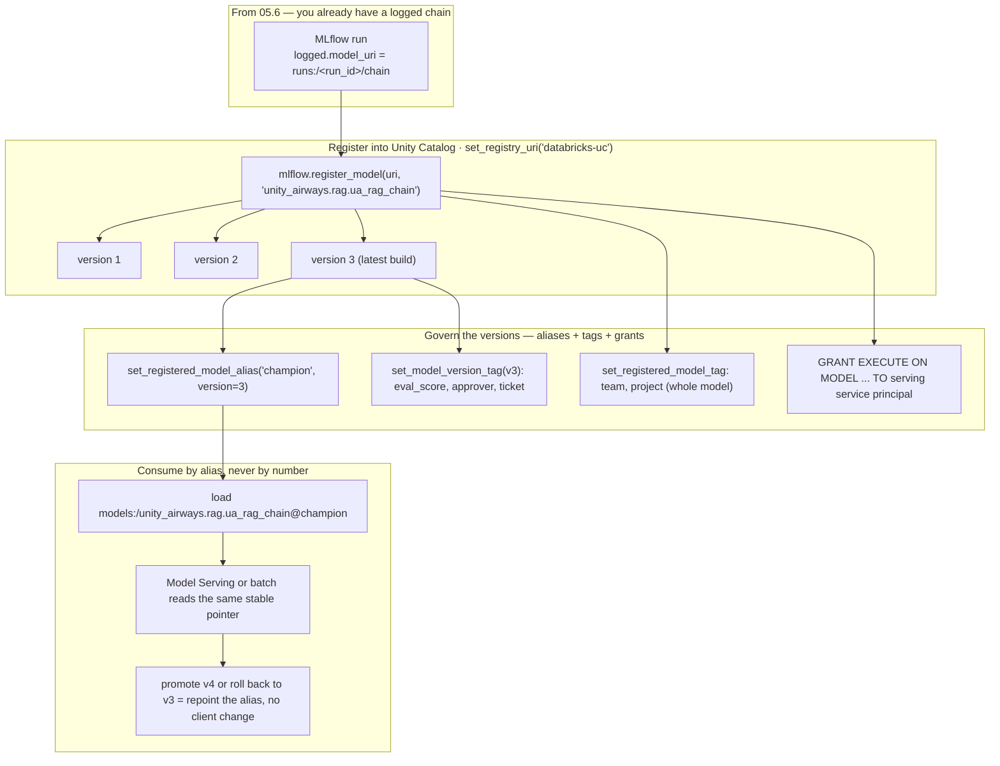
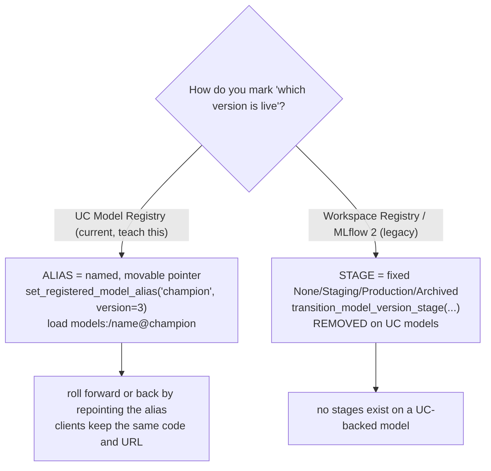

# Unity Catalog Model Registry — registration, aliases, tags  ·  Module 06 · Topic 06.5 (★ cornerstone)  ·  [Theory + Hands-on]

> **You are here:** Roadmap Module 06 → 06.5 (cornerstone deep-dive). You logged a RAG chain in Module 05.6. This is where that logged model stops being a run artifact and becomes a **governed, versioned, deployable** object in Unity Catalog — the thing your serving endpoint and your teammates actually point at.
> **Prerequisites:** 06.1 (MLflow experiments, runs, and the Model Registry idea), 06.3 (tracking runs), 06.4 (Managed MLflow; how workspaces map to catalogs), and **05.6** (you have a logged chain, `logged.model_uri = runs:/<run_id>/chain`). You should already have run `mlflow.langchain.log_model(...)` once.

## TL;DR
- **Point the registry at UC once:** `mlflow.set_registry_uri("databricks-uc")`. After that, every register call writes to **Unity Catalog**, not the old per-workspace registry. You get RBAC, lineage, and cross-workspace access for free.
- **Register with a three-level name:** `mlflow.register_model("runs:/<run_id>/chain", "unity_airways.rag.ua_rag_chain")`. The name is always `catalog.schema.model`. Each register call mints a **new integer version** (v1, v2, v3, …). Versions are immutable.
- **Aliases replace stages.** UC models have **no** `Staging`/`Production` stages — those were removed. Instead you set a named, movable pointer: `MlflowClient().set_registered_model_alias("unity_airways.rag.ua_rag_chain", "champion", 3)`, then load `models:/unity_airways.rag.ua_rag_chain@champion`. Roll forward or back by **repointing the alias** — no client code changes.
- **Tags carry metadata.** `set_registered_model_tag(...)` labels the whole model (team, project); `set_model_version_tag(...)` labels one version (eval score, approver, change ticket). Tags are your audit trail.
- **Governance is UC grants + lineage.** `GRANT EXECUTE ON MODEL ...` lets a serving service principal load the model; UC records who owns it and which data/run produced it.

## The problem
- In 05.6 you logged the Unity Airways RAG chain as Models-from-Code. `logged.model_uri` is `runs:/<run_id>/chain`. That URI works, but it is tied to **one run in one workspace**. It is not something a production endpoint should depend on.
- A run artifact answers "what did this experiment produce?" It does not answer the questions production actually asks:
  - Which build is the **approved** one right now?
  - Who is **allowed** to load and serve it?
  - When it broke last Tuesday, which **version** was live, who promoted it, and against which eval score?
  - How do I ship a new build **without** editing every app that calls the model?
- You need a place where the model has a **stable name**, an **immutable version history**, a **movable "this one is live" pointer**, **searchable metadata**, and **access control**. That place is the Unity Catalog Model Registry.

## Why the naive approach fails
- **Naive move 1 — deploy straight from `runs:/<run_id>/chain`.** The run URI pins you to a run id. Ship a fix and every consumer must learn the new run id and redeploy. There is no governance layer: anyone who can read the experiment can grab the model, and nothing records who promoted what.
- **Naive move 2 — use the old Workspace Model Registry with stages.** This is what most MLflow tutorials (and Book 2 Ch5) still show: register, then `transition_model_version_stage(version, stage="Production")` through the fixed ladder `None → Staging → Production → Archived`.
  - It is **per workspace** — the model is invisible to other workspaces, and governance is workspace-scoped ACLs, not Unity Catalog.
  - The **stages themselves are gone** on UC models. If you register to `databricks-uc` and then reach for a stage transition, there is no stage to transition to. The concept was removed, not renamed.

```python
# LEGACY — Workspace Model Registry / MLflow 2. Do NOT use on UC models.
client.transition_model_version_stage(
    name="ua_rag_chain", version=3, stage="Production"   # no stages in UC
)
```

- Root cause in one line: **a run artifact is an experiment output; production needs a governed, named, versioned object with a movable pointer.** UC Model Registry is that object, and its "which one is live" mechanism is **aliases**, not stages.

## What it is
- The **Unity Catalog Model Registry** is Databricks' governed home for trained/​logged models. It is the MLflow Model Registry **backed by Unity Catalog** instead of the per-workspace store.
- A **registered model** is a named container (`catalog.schema.model`) that holds an ordered list of **versions**. Registering a logged model creates version 1; registering again creates version 2, and so on. Versions never change once created.
- An **alias** is a human-named, movable pointer to exactly one version — for example `champion → version 3`. You load by alias (`models:/…@champion`) so consumers follow promotions automatically.
- A **tag** is a key/value label. It can live on the whole registered model (`set_registered_model_tag`) or on a single version (`set_model_version_tag`).
- **Governance** is inherited from Unity Catalog: three-level namespace, `GRANT`/`REVOKE` privileges (`EXECUTE`, `MANAGE`, ownership), lineage back to the producing run and data, and audit logs on every action.

> 📌 **IMPORTANT:** In the UC Model Registry, **model stages do not exist.** The lifecycle is expressed with **aliases + tags**. When a book or blog says "transition to the Production stage," translate it in your head to "set the `production` alias to this version." (Book 2 Ch6 states this directly; Book 2 Ch5's stage language is the legacy Workspace-registry framing.)

## Why it matters (for a Databricks FDE)
- This is the hand-off point from "a data scientist's run" to "a governed production asset." Almost every customer moving a GenAI demo toward production hits it, and the two things they get wrong are (a) still thinking in stages and (b) deploying from run URIs.
- Aliases are the operational knob that makes safe rollouts and instant rollbacks possible: repoint `champion` from v3 to v4 to promote; repoint back to v3 to roll back. Client integrations never change.
- UC grants are how you answer the security questionnaire: a serving endpoint's service principal gets `EXECUTE` on exactly one model, and nothing else.
- It is squarely on the certification (Domain 4 — deployment and operations, and governance). The exam expects three-level naming, `set_registry_uri("databricks-uc")`, and **aliases/tags in place of stages**.

## Core concepts
- **`mlflow.set_registry_uri("databricks-uc")`** — flips the registry target to Unity Catalog for the session. Do this before any register/alias/tag call. (Set the tracking URI to `databricks` too when running off-platform.)
- **Registered model** — the named object `catalog.schema.model` (e.g. `unity_airways.rag.ua_rag_chain`). Requires `USE CATALOG` on the catalog, `USE SCHEMA` on the schema, and `CREATE MODEL` on the schema to create.
- **Model version** — an immutable snapshot created by each `register_model` (or `registered_model_name=` at log time). Numbered v1, v2, v3, …
- **`mlflow.register_model(model_uri, name)`** — promotes a logged model into UC. `model_uri` is `runs:/<run_id>/<artifact_path>` or the MLflow 3 LoggedModel URI `models:/<model_id>`; `name` is the three-level string. Returns a `ModelVersion` with `.name` and `.version`.
- **Alias** — a named pointer to one version. Set with `MlflowClient().set_registered_model_alias(name, alias, version)`. Common names: `champion`, `challenger`, `staging`, `production`. Load with `models:/<name>@<alias>`; resolve with `get_model_version_by_alias(name, alias)`.
- **Stage (legacy)** — the removed `None/Staging/Production/Archived` ladder of the Workspace registry. Not present on UC models; do not teach `transition_model_version_stage` as current.
- **Registered-model tag** — `set_registered_model_tag(name, key, value)` labels the model as a whole (owner team, project, cost center).
- **Model-version tag** — `set_model_version_tag(name, version, key, value)` labels one version (eval score, approver, ticket, `lifecycle=archived`).
- **UC grant** — `GRANT EXECUTE ON MODEL <name> TO <principal>` gives permission to load/serve. Ownership or `MANAGE` is needed to set aliases/tags. Lineage and audit are automatic.

## 🗺️ Visual map

**Register → versions → alias @champion → load-by-alias → deploy, with tags and grants** — mirrored in the HTML explainer:



*Takeaway: registration gives you an immutable version history; the alias is the one movable thing everyone reads; tags and grants make it auditable and safe.*

**Aliases vs stages — the one distinction you must not get wrong:**



*Takeaway: an alias named `production` is just a string pointer — it is not the old Production stage. Same word, different mechanism.*

## How it works — deep dive

### Point the registry at Unity Catalog [Theory + Hands-on]
- One line switches the target: `mlflow.set_registry_uri("databricks-uc")`. Confirmed in 📘B1 (Ch1 and the agent-registration chapter) and 📗B2 Ch6.
- Why UC over the legacy Workspace Model Registry:
  - **Governance:** models are first-class UC securables. Access is `GRANT`/`REVOKE`, the same model you already use for tables and volumes, instead of workspace ACLs.
  - **Lineage:** UC links the registered model back to the run, the notebook/job, and (through the run) the data and index it used. Auditors trace experiment → model → endpoint.
  - **Cross-workspace:** a UC model lives in the metastore, so dev, staging, and prod workspaces on the same metastore can all see and govern it. Workspace-registry models were trapped in one workspace.
- Practical note: on a Databricks notebook the tracking URI is already `databricks`. Off-platform, set both `mlflow.set_tracking_uri("databricks")` and `mlflow.set_registry_uri("databricks-uc")`.

### Register and rack up versions [Theory + Hands-on]
- Registration takes a **logged** model and gives it a governed name:

```python
mlflow.set_registry_uri("databricks-uc")
mv = mlflow.register_model(
    model_uri=f"runs:/{run.info.run_id}/chain",   # from 05.6; or "models:/<model_id>"
    name="unity_airways.rag.ua_rag_chain",         # catalog.schema.model — always 3 levels
)
print(mv.name, mv.version)   # unity_airways.rag.ua_rag_chain 1
```

- The `model_uri` can be a run artifact URI (`runs:/<run_id>/<artifact_path>`) or, in MLflow 3, a **LoggedModel** URI (`models:/<model_id>`) from `logged.model_id`. Both resolve to the same stored artifacts.
- **Each register call = a new version.** Register the same name again next month and you get v2; the old v1 stays exactly as it was. Versions are immutable — that is what makes rollback trustworthy.
- **Shortcut:** pass `registered_model_name="unity_airways.rag.ua_rag_chain"` straight into `log_model(...)` to log and register in one shot (what 05.6 showed). Use standalone `register_model` when you want to log first, evaluate, then register a chosen run.
- Naming is not cosmetic. Three levels are required, and you need `USE CATALOG` + `USE SCHEMA` + `CREATE MODEL` on `unity_airways.rag` to create the model there.

### Aliases: the movable pointer that replaced stages [Theory + Hands-on]
- An alias is a name you attach to one version and can move whenever you want:

```python
from mlflow import MlflowClient
client = MlflowClient()

# "champion" now means version 3
client.set_registered_model_alias(
    name="unity_airways.rag.ua_rag_chain", alias="champion", version=3,
)

# Load whatever champion points at — no version number in the code
chain = mlflow.langchain.load_model("models:/unity_airways.rag.ua_rag_chain@champion")

# Resolve the alias to inspect it
mvc = client.get_model_version_by_alias("unity_airways.rag.ua_rag_chain", "champion")
print(mvc.version)   # 3
```

- **Promote / roll back = repoint.** `set_registered_model_alias(..., "champion", 4)` promotes v4; call it again with `3` to roll back. Every consumer that loads `@champion` follows along with zero code changes.
- **Alias names are free-form strings.** Teams commonly use `champion`/`challenger` for A/B, or `staging`/`production` for a promotion flow. A `production` alias is a pointer you created — it is **not** the removed Production stage. This is the single most common point of confusion.
- Rule of thumb (📘B1): **pin a version** (`models:/…/3`) when developing, testing, or debugging and you want deterministic reproduction; **use an alias** (`models:/…@champion`) in any environment where promotion and rollback should not require a redeploy.

> ⚠️ **GOTCHA:** Do not confuse the three `models:/` URI shapes. `models:/<name>/<version>` loads an exact version; `models:/<name>@<alias>` loads whatever the alias points at right now; `models:/<model_id>` loads an MLflow 3 LoggedModel by its id (a run-scoped logged model, not a registered-model version). Serving a `@alias` URI means the endpoint moves when you repoint; serving a `/version` URI freezes it.

### Tags: metadata that becomes your audit trail [Theory + Hands-on]
- Two scopes, two APIs:

```python
# Whole registered model — applies across all versions
client.set_registered_model_tag(
    name="unity_airways.rag.ua_rag_chain", key="team", value="ml-platform",
)

# One specific version — the promotion/audit record
client.set_model_version_tag(
    name="unity_airways.rag.ua_rag_chain", version=3,
    key="eval_correctness", value="0.91",
)
client.set_model_version_tag("unity_airways.rag.ua_rag_chain", 3, "approver", "s.banerjee")
client.set_model_version_tag("unity_airways.rag.ua_rag_chain", 3, "change_ticket", "CHG-2187")
```

- **Registered-model tags** describe the model as a product: owning team, project, cost center, data classification. They do not change per version.
- **Version tags** describe one build: its eval score, who approved it, the change/Jira/ServiceNow ticket that authorized the promotion, or `lifecycle=archived` to mark a retired version so nobody serves it by accident.
- Version tags are the durable link between "we promoted v3" and "here is the ticket and the eval that justified it." 📗B2 Ch6 uses exactly this pattern (`approval_ticket=CHG-2187`, `lifecycle=archived`).

### Governance: grants and lineage [Theory]
- The registered model is a UC securable, so access is SQL grants, not code:

```sql
-- A serving endpoint's service principal needs to LOAD the model
GRANT EXECUTE ON MODEL unity_airways.rag.ua_rag_chain TO `sp-ua-serving`;

-- Traversal privileges on the container objects
GRANT USE CATALOG ON CATALOG unity_airways TO `sp-ua-serving`;
GRANT USE SCHEMA  ON SCHEMA  unity_airways.rag TO `sp-ua-serving`;
```

- **`EXECUTE`** is the privilege to load/serve a model version. Setting or moving aliases and tags requires **ownership** or `MANAGE`. `USE CATALOG` and `USE SCHEMA` are needed to see the object at all.
- **Two levels of control (📗B2 Ch6, Table 5-3):** registry permissions decide who can register versions and repoint aliases; serving-endpoint permissions decide who can call the deployed model. Keep them separate — a data scientist proposes versions, an MLOps engineer moves the alias, the app team only queries the endpoint.
- **Lineage + audit** are automatic: UC shows the run and data behind each version and logs every register/alias/tag/grant action, which is what makes the whole thing auditable for compliance.

## How to do it on Databricks

> **[Hands-on]** Runs on serverless or a DBR ML runtime with **MLflow ≥ 3.1**. You need the logged chain from 05.6 (`logged.model_uri`), and rights to create a model in `unity_airways.rag` (`USE CATALOG` + `USE SCHEMA` + `CREATE MODEL`).

**0. Install and set variables:**

```python
%pip install -U mlflow databricks-langchain
dbutils.library.restartPython()
```

```python
import mlflow
from mlflow import MlflowClient

CATALOG  = "unity_airways"
SCHEMA   = "rag"
UC_MODEL = f"{CATALOG}.{SCHEMA}.ua_rag_chain"   # three-level name

mlflow.set_registry_uri("databricks-uc")        # point the registry at Unity Catalog
client = MlflowClient()
```

**1. Register the logged chain (creates version 1):**

```python
# run is the mlflow.start_run() from 05.6 where you logged the chain under artifact path "chain"
mv = mlflow.register_model(
    model_uri=f"runs:/{run.info.run_id}/chain",   # or f"models:/{logged.model_id}"
    name=UC_MODEL,
)
print(mv.name, mv.version)   # unity_airways.rag.ua_rag_chain 1
```

*How to verify:* `client.get_registered_model(UC_MODEL)` returns the model, and it appears in Catalog Explorer under `unity_airways.rag` → Models.

**2. Register a second build to see versioning (creates version 2, then 3):**

```python
# after improving rag_chain.py and re-logging as logged2 ...
mv2 = mlflow.register_model(f"runs:/{run2.info.run_id}/chain", UC_MODEL)  # -> version 2
mv3 = mlflow.register_model(f"runs:/{run3.info.run_id}/chain", UC_MODEL)  # -> version 3
```

**3. Set the `champion` alias to the approved version (this is the "promotion"):**

```python
client.set_registered_model_alias(name=UC_MODEL, alias="champion", version=3)
```

*How to verify:* 

```python
print(client.get_model_version_by_alias(UC_MODEL, "champion").version)   # 3
```

**4. Load by alias — the way apps and endpoints should reference the model:**

```python
chain = mlflow.langchain.load_model(f"models:/{UC_MODEL}@champion")
print(chain.invoke("Can I get a refund on a Basic Economy fare?")[:200])
```

**5. Tag the version (audit trail) and the model (ownership):**

```python
client.set_model_version_tag(UC_MODEL, 3, "eval_correctness", "0.91")
client.set_model_version_tag(UC_MODEL, 3, "approver", "s.banerjee")
client.set_model_version_tag(UC_MODEL, 3, "change_ticket", "CHG-2187")
client.set_registered_model_tag(UC_MODEL, "team", "ml-platform")
```

**6. Roll back in one line (no redeploy):**

```python
client.set_registered_model_alias(UC_MODEL, "champion", 2)   # champion now = v2
# every models:/...@champion consumer follows instantly; v3 is untouched for later
```

**7. Grant a serving service principal permission to load it (SQL cell or Catalog Explorer):**

```sql
GRANT USE CATALOG ON CATALOG unity_airways TO `sp-ua-serving`;
GRANT USE SCHEMA  ON SCHEMA  unity_airways.rag TO `sp-ua-serving`;
GRANT EXECUTE     ON MODEL   unity_airways.rag.ua_rag_chain TO `sp-ua-serving`;
```

**8. Contrast — the legacy stage call you must recognize but never use on UC:**

```python
# LEGACY / Workspace registry. On a UC model there is no stage to move to.
client.transition_model_version_stage(name="ua_rag_chain", version=3, stage="Production")
# Correct UC equivalent:
client.set_registered_model_alias(UC_MODEL, "production", 3)
```

## Worked example (Unity Airways)
- From 05.6 you have `logged.model_uri = runs:/<run_id>/chain` — the RAG chain that retrieves from `unity_airways.rag.ua_rag_chunks_index` and answers with `databricks-claude-sonnet-4-5`.
- You set the registry to UC and register it as `unity_airways.rag.ua_rag_chain`. That is **version 1**.
- Over two more iterations you register **v2** and **v3**. All three versions are frozen and inspectable.
- v3 passes your eval, so you point `champion → 3`, and tag v3 with `eval_correctness=0.91`, `approver=s.banerjee`, `change_ticket=CHG-2187`.
- Your serving endpoint (Module 11) loads `models:/unity_airways.rag.ua_rag_chain@champion`, so it always serves the approved build. The serving service principal has `EXECUTE` on just this model.
- A regression shows up in v3. You repoint `champion → 2`. Traffic is back on the known-good build in seconds, no app redeploy, and the tags/audit log show exactly what happened and who did it.

## Uses, edge cases and limitations
| Use it when | Watch out when | Better move |
|---|---|---|
| Promoting a logged chain into a governed, deployable object | You deploy straight from `runs:/<run_id>/...` | Register to UC and deploy from `models:/<name>@<alias>` |
| You need instant rollback / A-B promotion | You hard-code a version number in the app | Load by alias; repoint the alias to roll forward/back |
| Multiple workspaces (dev/stage/prod) share one metastore | Model lives in the old Workspace registry | UC model is metastore-scoped and visible across workspaces |
| You must prove who promoted what and why | Promotion has no record | `set_model_version_tag` with approver + change ticket |
| Restricting who can serve the model | Everyone in the workspace can load it | `GRANT EXECUTE ON MODEL` to just the serving principal |
| You want a frozen build for compliance | You point the endpoint at an alias | Serve a pinned `models:/<name>/<version>` URI instead |

## Common mistakes / gotchas
| Mistake | Why it hurts | Better move |
|---|---|---|
| Reaching for `Staging`/`Production` **stages** on a UC model | Stages were removed; the call has no valid target | Use `set_registered_model_alias(...)` and load `@alias` |
| Two-level or workspace-style model name | UC registration requires `catalog.schema.model` | Always register with the full three-level name |
| Forgetting `mlflow.set_registry_uri("databricks-uc")` | Registers to the wrong (legacy/workspace) registry | Set it once before any register/alias/tag call |
| Deploying from `runs:/<run_id>/...` | Ties prod to a run id; no governance, no rollback | Register, then deploy `models:/<name>@champion` |
| Confusing `@alias` with `/version` in the load URI | You freeze when you meant to follow, or vice-versa | `@alias` moves with promotions; `/version` is pinned |
| Tagging the model when you meant the version (or vice-versa) | Audit record lands at the wrong scope | `set_model_version_tag` for per-build facts; `set_registered_model_tag` for the product |
| Assuming read access implies serve access | Endpoint SP can't load the model → deploy fails | `GRANT EXECUTE ON MODEL` plus `USE CATALOG`/`USE SCHEMA` |
| Treating a `production` alias as "the Production stage" | They are different mechanisms; leads to stage-thinking | It is just a string pointer you set and move |

> 📌 **IMPORTANT:** The whole lesson reduces to three moves: **name it** (`catalog.schema.model`), **version it** (every register call), **point at it** (an alias, never a stage). Everything downstream — serving, rollback, audit — reads the alias.

> 💡 **TIP:** Standardize on alias names across the org (`champion` = live, `challenger` = the next candidate under eval). Put the eval score, approver, and change ticket on the **version** as tags at promotion time; you will thank yourself during the next incident review when you can answer "which version, who approved it, and why" from the registry alone.

> ⚠️ **GOTCHA:** Books lag here. 📗B2 **Ch5** (Example 5-5) still describes registration as enabling "controlled stage transitions" through staging/production **stages** — that is the legacy Workspace-registry / MLflow-2 framing. 📗B2 **Ch6** corrects it: "lifecycle management is implemented through aliases and tags rather than deprecated stages," and notes the exam may still use "stage" wording. Teach aliases + tags; recognize stage language as legacy. Method names (`set_registered_model_alias`, `set_registered_model_tag`, `set_model_version_tag`, `get_model_version_by_alias`) verified against the current MLflow client API.

## 📝 Notes
- _Space for your own notes._

**Self-check (5 questions)**
1. You logged a chain in 05.6. Give the two lines that point the registry at Unity Catalog and register it as `unity_airways.rag.ua_rag_chain`. What does a second register call produce?
2. UC models have no stages. How do you express "version 3 is the live one," and how do you then load it without hard-coding the number?
3. A regression hits the live build. In one line, how do you roll back, and why do the calling apps need no change?
4. Which API tags a whole registered model vs a single version, and what belongs on each? Give one realistic tag for the version at promotion time.
5. What UC privilege does a serving service principal need to load the model, and what two traversal grants must accompany it?

## How this maps to the certification
- **Domain 4 — Deployment and operations** (and the governance thread that runs through it) owns this topic: register a model/agent to Unity Catalog with a three-level name, manage versions, and use **aliases and tags in place of stages**.
- Exam-focus points: `mlflow.set_registry_uri("databricks-uc")`; `mlflow.register_model("runs:/<run_id>/<path>", "catalog.schema.model")`; each register creates a new immutable version; `set_registered_model_alias` + loading `models:/<name>@<alias>`; version vs registered-model tags; `GRANT EXECUTE ON MODEL` for serving; UC lineage/audit. The exam may still print "stage" wording (📗B2 Ch6 flags this) — mentally map it to aliases.

## Sources
- 📘 **B1 — *Practical MLflow for Generative AI on Databricks***, Ch 1 (MLflow: experiments, runs, Model Registry) and the agent-registration chapter: `mlflow.set_registry_uri("databricks-uc")`, three-level namespace `catalog.schema.model_name`, `mlflow.register_model(model_uri=..., name=UC_MODEL_NAME)`, registered models appearing in Catalog Explorer under `workspace.unity_airways`, and the load-by-alias vs load-by-version rule of thumb (alias for prod promotion/rollback without redeploy; version for deterministic dev/test). *(O'Reilly Early Release — RAW & UNEDITED; APIs verified against current docs.)*
- 📗 **B2 — *Databricks Certified Generative AI Engineer Associate Study Guide***, Ch 6 ("Model Registration and Deployment" → "Managing Versions with Aliases and Tags," "Lifecycle and Governance Mapping"): three-level UC registration, `MlflowClient().set_registered_model_alias(name, alias, version)`, `set_model_version_tag(...)` with `approval_ticket`/`lifecycle=archived`, "aliases and tags **replace deprecated stages**," and the two-level (registry + endpoint) governance responsibilities (Table 5-3). Ch 5 (Example 5-5/5-6/5-7) is the **legacy** stage-based framing, flagged as such.
- 🌐 MLflow Python API — `mlflow.client.MlflowClient`: `set_registered_model_alias`, `set_registered_model_tag`, `set_model_version_tag`, `get_model_version_by_alias`. Method names **verified live** against `mlflow.org/docs/latest/api_reference/python_api/mlflow.client.html`.
- 🌐 Databricks Docs — "Manage model lifecycle in Unity Catalog": UC Model Registry, aliases, and the `EXECUTE` privilege on a registered model. `EXECUTE` grant **verified live** at `docs.databricks.com/aws/en/machine-learning/manage-model-lifecycle/`.
- 🧭 Naming cross-check: `.claude/skills/genai-teacher/references/naming-conventions.md` §1 (register agent/model to UC via `set_registry_uri("databricks-uc")` → `register_model` → `catalog.schema.model`; Workspace Model Registry is legacy) and §2 (UC governs models, functions/tools, and data).
