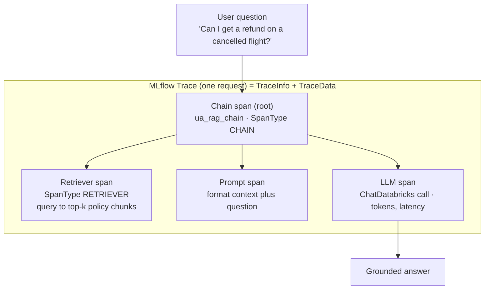
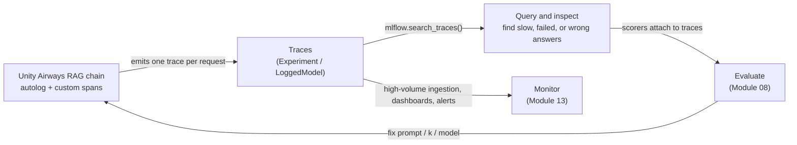

# MLflow Tracing & Observability  ·  Module 07  ·  Topics 07.1–07.5  ·  [Theory + Hands-on]

> **You are here:** Roadmap Module 07 → MLflow Tracing & observability (all topics 07.1–07.5). This is the module that lets you *see inside* a GenAI app — every step of every request.
> **Prerequisites:** **Module 05** (the RAG chain we observe) and **Module 06** (Experiments, Runs, and the MLflow-3 **LoggedModel** — traces attach to these). Next stops: **Module 08 — Evaluation** (scorers read from traces) and **Module 13 — production monitoring** (traces at scale).

This page is the **module hub**. It carries one numbered entry per topic. Two topics form a single combined cornerstone (★) and share their own deep-dive page:
- **07.2 + 07.3 — Automated tracing and manual tracing / custom spans** → `tracing.md` / `tracing.html`

Everything below observes one running artifact: the **Unity Airways** RAG chain that Module 05 registered as **`unity_airways.rag.ua_rag_chain`** (`CATALOG="unity_airways"`, `SCHEMA="rag"`). Every question the assistant answers produces **one Trace**, and inside it nested **Spans** for the retriever call and the `ChatDatabricks` LLM call. Those traces are the raw material Module 08 evaluates and Module 13 monitors.

> 📌 **The one rule that shapes this module — traces are the evidence, not a nice-to-have.**
> A GenAI app is a multi-step, probabilistic system. When it answers wrong or gets slow, the final output alone can't tell you *which step* broke. MLflow Tracing records each step so debugging is grounded in evidence. We standardize on the **MLflow 3** tracing surface:
> - **Automated:** `mlflow.langchain.autolog()` (also `mlflow.openai.autolog()`, `mlflow.anthropic.autolog()`) — one line, captures spans for 20+ libraries.
> - **Manual:** the `@mlflow.trace` decorator and `with mlflow.start_span(name=...) as span:` (`span.set_inputs(...)`, `span.set_outputs(...)`, `span.set_attributes(...)`).
> - **Query:** `mlflow.search_traces(...)` returns a pandas DataFrame you can filter by status, tags, and time.
> - Tracing is **OpenTelemetry-compatible** with GenAI semantic conventions, and `mlflow.set_active_model()` links every trace to a **LoggedModel** version (Module 06). Needs **MLflow ≥ 3.1**.

---

## TL;DR
- A **Trace** is the end-to-end journey of one request through your app. Internally `Trace = TraceInfo + TraceData`, where **TraceData** is a list of **Spans** (one per step) linked in a parent–child tree.
- A **Span** captures one operation — its inputs, outputs, attributes, and timing. Built-in **span types** organize them; the **RETRIEVER** span is special (a required schema so retrieved chunks display well and can be scored).
- Two ways to instrument, and they're the combined cornerstone (07.2 + 07.3): **automated** (`mlflow.<lib>.autolog()`, one line) and **manual** (`@mlflow.trace` + `mlflow.start_span(...)`) for steps autolog can't see. Full walkthrough in `tracing.md` / `tracing.html`.
- **Query** traces programmatically with `mlflow.search_traces(...)` (a DataFrame you can filter) or visually in the **Traces** tab of the MLflow experiment UI.
- **Trace-first development** is a discipline: instrument from the first working path so every workflow can explain its own results — then those traces feed **evaluation** (Module 08) and **production monitoring** (Module 13).

## The problem
- A Unity Airways customer asks *"Can I get a refund on a cancelled flight?"* and the assistant answers wrong. **Why?** The RAG chain did three things — retrieved chunks, built a prompt, called the LLM — and the final answer doesn't say which step failed.
- Was retrieval the problem (it pulled the baggage-policy chunk instead of the refund-policy chunk)? Was the prompt malformed? Did the LLM ignore the context it was given? From the output alone you can only guess.
- Latency has the same opacity. When someone reports "answers feel slower," you need to know *which component* dominates the time — the vector search, or the LLM call — before you can fix it.
- This is the job MLflow Tracing does. Module 05 *built* the chain; Module 07 makes it **observable** so failures become a one-glance answer instead of an argument from anecdotes.

## Why the naive approach fails
- **"Just add `print()` / logging."** Logging captures *discrete events* and doesn't inherently show the **relationships** between steps. Reconstructing one request's full journey from scattered log lines is painful, and per-step latency isn't captured — you'd have to derive it (📘B1 Ch5, Table 5-1).
- **"Eyeball the final answer."** The answer hides the two things you most need to see: the **retrieved chunks** and the **exact prompt** sent to the LLM. Without those, "the model hallucinated" and "retrieval fed it the wrong context" look identical.
- **"Wrap steps in ad-hoc timers."** Manual, brittle, and throwaway — those timers don't survive into production monitoring and they can't feed the evaluation harness. Tracing captures timing and metadata automatically, with no extra configuration.
- **"We'll add observability later, once it's in prod."** By then the failure modes are subtle and compound — retrieval returns empty context, a tool throws an error the model quietly ignores, an orchestration branch never fires (📘B1 Ch2). You can't debug what you never recorded.

## What it is
- **Plain-language definition:** MLflow Tracing records every step of a request as it flows through your GenAI app — capturing inputs, outputs, and metadata at each step — and stitches them into a hierarchy so you can see exactly how an output was produced. The goal is **observability**.
- **Mental model:** a **Trace** is the flight recorder for one request. A **Span** is one leg of that journey (retrieve → prompt → generate), nested under a root span. Open the trace and you replay the whole path, step by step, with timing on each.
- **Where it sits:** Tracing is the connective tissue between building and trusting. Module 05 built `ua_rag_chain`; Module 06 gave it a LoggedModel to attach to; Module 07 makes each run *legible*; Module 08 *scores* those traces; Module 13 *watches* them in production.

## Why it matters (for a Databricks FDE)
- This is the layer that turns "the bot is wrong sometimes" into a diagnosable engineering problem. Customers almost always know *that* their app misbehaves and almost never know *why* — a trace answers the why in seconds.
- Traces are the **substrate for everything downstream**. Module 08 scorers read the retrieved context straight from the RETRIEVER span; production monitoring (Module 13) is just tracing at high volume with dashboards and alerts. Get tracing right early and evaluation + monitoring come almost for free.
- It maps to **exam Domain 6 — Monitoring and observability** and to the "Develop → Monitor" phases of the lifecycle (📘B1 Ch5 primary; Ch2 for the trace-first mindset).

## Core concepts
- **Trace** — the record of one end-to-end request. `Trace = TraceInfo + TraceData`. See 07.1.
- **TraceInfo** — the trace's metadata: experiment ID, start time, duration, **status** (`OK` / `ERROR` / `IN_PROGRESS`), and custom **tags**. This is what you search on. See 07.1, 07.4.
- **TraceData** — the payload: a list of **Span** objects linked hierarchically. See 07.1.
- **Span** — one step in the app, with **inputs**, **outputs**, **attributes**, and **events**. A root span has children (parent–child tree). See 07.1, 07.2–07.3.
- **Span type** — a label that organizes spans (e.g. `CHAIN`, `LLM`, `PARSER`, `RETRIEVER`). The **RETRIEVER** type is special: it has a required schema so retrieved chunks render well in the UI and can be consumed by evaluation. See 07.1.
- **Automated tracing** — `mlflow.<lib>.autolog()` (`langchain`, `openai`, `anthropic`, …) auto-captures spans for supported libraries. See 07.2 (★).
- **Manual tracing** — the `@mlflow.trace` decorator (trace a function as a span) and `mlflow.start_span(...)` (a context manager for a custom span). See 07.3 (★).
- **`mlflow.search_traces()`** — query traces into a pandas DataFrame (one row per trace) or a list of `Trace` objects. See 07.4.
- **OpenTelemetry compatibility** — MLflow Tracing follows OpenTelemetry with GenAI semantic conventions, so traces interoperate with standard tooling. See 07.1.
- **LoggedModel link** — `mlflow.set_active_model()` (Module 06) ties each trace to a specific app **version**, so "which version produced this trace?" is answerable. See 07.2.
- **Trace-first development** — instrument from the first working path; treat any workflow that can't explain its results as suspect. See 07.5.

## 🗺️ Visual map

**A single request as a Trace tree — the Unity Airways RAG chain, one question in, nested Spans capturing each step:**



*Takeaway: the final answer is one node; the trace exposes the three steps that produced it, each with its own inputs, outputs, and timing. When the answer is wrong, you open the trace and see which span went sideways.*

**The observe → query → evaluate loop — traces are produced once and reused three ways:**



*Takeaway: you instrument once. The same traces power interactive debugging (`search_traces`), formal evaluation (Module 08 scorers), and production monitoring (Module 13).*

---

## 07.1 Tracing concepts — Trace & Span  ·  [Theory]

MLflow Tracing exists to give **detailed tracking and visualization** of requests as they propagate through a GenAI app, capturing key information at each step — with the goal of **observability** (📘B1 Ch5). For a RAG chain it records the input question, the query used for retrieval, the retrieved chunks, the prompt sent to the LLM, and the final response.

**Tracing is not the same as logging** (📘B1 Ch5, Table 5-1):

| | **Logging** | **Tracing** |
|---|---|---|
| **Purpose** | Captures discrete events within an app | Captures the **end-to-end journey** of one request |
| **Context** | Doesn't inherently show relationships between events | Maintains context across the whole request, showing each step's interactions |
| **Performance** | Latency isn't captured directly; logs must be post-processed | Captures key metrics (timing, tokens) **automatically**, no extra config |

They're complementary — in a served app you log operational events (auth, health checks) *and* trace each request's path through the components.

**The two-part anatomy of a Trace** (📘B1 Ch5, Fig 5-2):

- **`TraceInfo`** — metadata about the overall trace: the MLflow **experiment ID**, **start time**, **duration**, **status**, and custom **tags**. This is what makes a trace *searchable* later (07.4).
- **`TraceData`** — a list of **`Span`** objects, linked in a hierarchy so the flow of execution is easy to follow.
- In short: **`Trace = TraceInfo + TraceData`**, and `TraceData` contains the spans.

**What a Span holds:** each `Span` captures what happens at one step — **inputs**, **outputs**, **attributes**, and **events**. MLflow ships built-in **span types** (e.g. `CHAIN`, `LLM`, `PARSER`, `RETRIEVER`) that organize spans; you can define your own. They all behave the same — the type just differentiates operations.

> 📌 **IMPORTANT:** The **RETRIEVER** span is worth getting right. It has a required schema so the retrieved documents display in a user-friendly way in the UI **and** can be consumed by evaluation (Module 08 reads retrieved context from this span). Autolog sets it correctly for known retrievers; for a custom retriever, use `span_type=SpanType.RETRIEVER` and follow the schema.

> 💡 **TIP:** MLflow Tracing is **OpenTelemetry-compatible** and uses GenAI semantic conventions. If your org already standardizes on OpenTelemetry for microservices, GenAI traces slot into the same mental model — a trace with nested spans.

---

## 07.2 + 07.3 ★ Automated tracing and manual tracing / custom spans  ·  [Hands-on]

> **This is the module's combined cornerstone.** The full hands-on walkthrough — enabling autolog on the Module 05 chain, the `@mlflow.trace` decorator, `mlflow.start_span(...)` with `set_inputs`/`set_outputs`/`set_attributes`, custom `RETRIEVER` spans, and the Fluent-vs-Client-API decision — lives in `tracing.md` / `tracing.html`. Summary here.

MLflow gives you **two ways** to instrument a GenAI app, and real projects use both (📘B1 Ch5).

**07.2 Automated tracing `[Hands-on]`** — the easiest way to start. Add `mlflow.<flavour>.autolog()` at the top of your code and MLflow captures the traces for you. It integrates with 20+ popular libraries (LangChain, LangGraph, OpenAI, LlamaIndex, and more):

```python
import mlflow
mlflow.set_experiment("/Users/you@co.com/unity_airways_rag")
mlflow.set_active_model(name="ua_rag_chain")   # link traces to a LoggedModel version (Module 06)

mlflow.langchain.autolog()                      # one line — auto-captures spans for the LangChain chain
# mlflow.openai.autolog()    / mlflow.anthropic.autolog()  for those SDKs

answer = ua_rag_chain.invoke({"messages": [{"role": "user",
          "content": "Can I get a refund on a cancelled flight?"}]})
# -> one Trace is recorded automatically: retriever span + ChatDatabricks LLM span, nested under the chain
```

**07.3 Manual tracing / custom spans `[Hands-on]`** — for the steps autolog can't see (a re-ranker, a business-rule filter, a custom parser). Two Fluent-API tools:

- **`@mlflow.trace`** — decorate any function to trace it as a span (optionally set `name=` and `span_type=`).
- **`mlflow.start_span(...)`** — a context manager for a custom span; set its data explicitly.

```python
from mlflow.entities import SpanType

@mlflow.trace(span_type=SpanType.PARSER, name="normalize_question")
def normalize(q: str) -> str:
    return q.strip().lower()

with mlflow.start_span(name="policy_filter", span_type=SpanType.CHAIN) as span:
    span.set_inputs({"query": query_text})       # record inputs
    kept = [c for c in chunks if c.policy == "refund"]
    span.set_outputs({"kept": len(kept)})         # record outputs
    span.set_attributes({"filter_rule": "refund_only"})  # arbitrary metadata
```

**How to verify it worked:** open the Experiment → **Traces** tab. You should see one trace per `invoke`, and expanding it shows the nested spans (chain → retriever → LLM, plus your custom `policy_filter` span) with inputs, outputs, and per-span latency.

> ⚠️ **GOTCHA:** the high-level **Fluent APIs** (`@mlflow.trace`, `mlflow.start_span`) and the low-level **Client APIs** (manual `start_span`/`end_span` with explicit `parent_id`/trace IDs) **cannot be mixed** in one trace — they don't interoperate (📘B1 Ch5). Reach for the Client API only when you truly need fine-grained control (custom trace-ID management, no automatic parent–child detection). For almost everything, Fluent is the recommended path.

> 💡 **TIP:** Autolog and manual tracing compose — turn on `mlflow.langchain.autolog()` for the chain's built-in steps, then add a couple of `@mlflow.trace` spans around your custom Python glue. You get full coverage without hand-instrumenting the whole chain.

---

## 07.4 Querying traces  ·  [Hands-on]

Once traces are captured, you query them to find the ones worth investigating — the slow, the failed, the wrong. Two surfaces (📘B1 Ch5):

- **MLflow UI** — the **Traces** tab in the experiment. Filter with the fields defined in the `TraceInfo` schema (status, tags, version, time range), sort by request time, and pick columns to display.
- **Programmatically** — `mlflow.search_traces(...)` returns results as a **pandas DataFrame** (one row per trace) or a list of `Trace` objects, so you can post-process at scale.

```python
import mlflow

# Find failing, slow traces to triage
traces = mlflow.search_traces(
    filter_string="attributes.status = 'ERROR' AND attributes.execution_time_ms > 2000",
)
# traces is a pandas DataFrame — one row per trace; slice, group, export as needed
slow_failures = traces[["trace_id", "request", "execution_time_ms"]]
```

**Searchable fields** (📘B1 Ch5, Table 5-2): trace **metadata** (`metadata.*`), **tags** (`tags.*`), **status** (`OK` / `ERROR` / `IN_PROGRESS`), trace **name**, **timestamp** (ms since epoch, supports `< <= > >=`), and **execution time** (ms, numeric comparisons).

**Syntax rules that trip people up:**
- Prefix every field with its table — `attributes.`, `tags.`, or `metadata.`.
- Backtick fields with dots: `` tags.`mlflow.traceName` ``.
- String values use **single quotes only**: `'ERROR'`.
- Field names and values are **case sensitive**.
- **`AND` only — `OR` is not supported.**

**How to verify it worked:** `len(traces)` matches the count shown in the UI's Traces tab for the same filter, and each row's `execution_time_ms` respects your predicate.

> ⚠️ **GOTCHA (verify live):** the book's inline examples use a `traces.` prefix while its own syntax-rule table says `attributes.` / `tags.` / `metadata.` — the exact search-path prefixes and field set are an area MLflow is still refining. The book itself says to **check the latest MLflow docs** for current search fields and syntax before relying on a filter. *(Filter-prefix specifics: live re-check pending — see Sources.)*

---

## 07.5 Trace-first development as a discipline  ·  [Theory]

Tracing isn't a debugging tool you bolt on at the end — it's a **development discipline** you adopt from the first working path. The MLflow book frames a five-phase GenAI lifecycle — **Develop → Evaluate → Deploy → Monitor → Improve** — and tracing is what makes the whole loop honest (📘B1 Ch2, Fig 2-1):

- **Develop begins with a working skeleton** (a prompt, a model route, optional retrieval). From the **first coherent answer**, instrument the key steps with MLflow Tracing so every call records inputs, outputs, intermediate steps, timing, and metadata.
- *"The difference between debugging and guessing is whether those traces exist."* Instrumented early, development traces become the **raw material for an initial evaluation set** (Module 08).
- **Monitor** is where you learn what's true under real traffic. Real-world traces let you **replay the execution path**, see when tools were called, spot retries, and pinpoint the prompt or retriever tied to slow or off-topic answers (Module 13).
- The payoff is cultural: teams stop arguing from anecdotes and start pointing to **trace evidence**. Adopt "question any workflow that cannot explain its own results" as a habit.

> 📌 **IMPORTANT:** Observability gets *harder* as systems become compound — beyond a single prompt, failures turn subtle: retrieval returns empty context, a tool throws an error the model quietly ignores, an orchestration branch never executes (📘B1 Ch2). Trace-first development is the only way these stay visible instead of silent.

---

## Worked example (Unity Airways, end to end)

A wrong refund answer, traced from complaint to fix:

1. **A bad answer lands.** The assistant tells a customer refunds aren't possible on a cancelled flight — which is wrong per policy.
2. **Find it (07.4):** `mlflow.search_traces(filter_string="attributes.status = 'OK'")` filtered to recent traces, then locate the offending request by its text in the DataFrame.
3. **Open the trace (07.1):** expand the Trace tree — chain (root) → **retriever** span → prompt span → **LLM** span.
4. **Diagnose (07.2–07.3):** the RETRIEVER span shows it pulled the *baggage*-policy chunk, not the *refund*-policy chunk. Retrieval was the failure, not the LLM. Because `mlflow.langchain.autolog()` captured it, you didn't instrument anything by hand.
5. **Attribute the version:** the trace is linked via `mlflow.set_active_model()` to a specific **LoggedModel** version (06.2), so you know exactly which app version misbehaved.
6. **Feed evaluation (Module 08):** add this question to the eval dataset; a `RetrievalGroundedness`/`RetrievalRelevance` scorer reads the retrieved context straight from the trace.
7. **Fix and re-observe:** bump `k`, or re-chunk the policy corpus; re-run; confirm the new trace's retriever span now returns the refund chunk.
8. **Monitor (Module 13):** in production the same traces stream in at volume, with dashboards and alerts on error rate and per-span latency — so the next regression surfaces before a customer reports it.

---

## Uses, edge cases and limitations

| Use it when | Be careful when | Better move |
|---|---|---|
| You need to see *which step* of a multi-step app failed | You rely on `print()`/logging alone | Traces + spans — logging shows events, tracing shows the journey (07.1) |
| Your app uses a supported library (LangChain, OpenAI, …) | You hand-instrument everything | Start with `mlflow.<lib>.autolog()`, add manual spans only for custom glue (07.2–07.3) |
| You have custom Python steps (re-rankers, filters) | You expect autolog to see them | Add `@mlflow.trace` / `mlflow.start_span(...)` for those steps (07.3) |
| You want retrieved chunks to render + be scorable | You use a plain span for retrieval | Use `span_type=SpanType.RETRIEVER` and follow its schema (07.1) |
| You need to triage many requests | You scroll the UI by hand | `mlflow.search_traces(...)` → DataFrame, filter and group (07.4) |
| You're mixing tracing styles | You combine Fluent + low-level Client APIs | Pick one per trace — they don't interoperate (07.2–07.3) |

## Common mistakes / gotchas
- Treating **logging** as tracing — logs capture discrete events without the request-level relationships or automatic per-step timing.
- Using a generic span for retrieval instead of **`SpanType.RETRIEVER`**, so chunks don't render well and evaluation can't read them.
- **Mixing Fluent and Client tracing APIs** in one trace — they don't interoperate.
- Assuming `mlflow.search_traces` filters support `OR` — **only `AND`** is supported; field names/values are case sensitive; string literals need single quotes.
- Hardcoding a `search_traces` filter prefix without verifying — the exact search-path prefixes/fields are still being refined; check current MLflow docs.
- Forgetting `mlflow.set_active_model()` — traces still record, but they aren't linked to an app **version**, so "which version produced this?" loses its answer (Module 06).
- Adding observability only after go-live — compound failures (empty context, swallowed tool errors, dead branches) are invisible unless you instrumented from the first working path.

## 📝 Notes
- _Space for your own notes as you work through the module._

**Self-check (5 questions)**
1. What is a **Trace** vs a **Span**, and what are the two parts a Trace decomposes into (`Trace = ? + ?`)?
2. Name the two ways to instrument tracing in MLflow, give the exact API for each, and say when you'd need the manual one.
3. Why is the **RETRIEVER** span type special, and which downstream module depends on it?
4. Write a `mlflow.search_traces(...)` call that finds error traces slower than 2 seconds. Which operator is **not** allowed in the filter?
5. In one sentence, what does "trace-first development" mean, and why does the book say *"the difference between debugging and guessing is whether those traces exist"*?

## How this maps to the certification
- **Monitoring and observability** (exam Domain 6): using traces to observe real-world behavior, replay execution paths, and attribute latency/cost to steps; querying traces to triage failures. These are 07.1, 07.4, 07.5 directly.
- **Instrumentation for evaluation** (feeds Domain 5 / Module 08): traces are the input to scorers — retrieved context is read from the RETRIEVER span; automated + manual tracing (07.2–07.3) is what produces that input.
- Exam-relevant facts this module nails: `Trace = TraceInfo + TraceData`; **automated** (`mlflow.<lib>.autolog()`) vs **manual** (`@mlflow.trace`, `mlflow.start_span`) tracing; `mlflow.search_traces()` returns a DataFrame; the **RETRIEVER** span's special schema; OpenTelemetry compatibility.

## Sources
- 📘 B1 — *Practical MLflow for Generative AI on Databricks* (O'Reilly Early Release, RAW & UNEDITED), **Ch 5 "MLflow Tracing"** (primary): *Understanding MLflow Tracing* (purpose = detailed tracking + visualization for observability; RAG example — capture input, retrieval query, chunks, prompt, response; Fig 5-1); **logging vs tracing** (Table 5-1); **Trace** = `TraceInfo` + `TraceData` (Fig 5-2), TraceInfo metadata (experiment_id, start time, duration, status, tags), TraceData = list of `Span`; **Span** (inputs/outputs/attributes/events; built-in span types; **RETRIEVER** special schema); *Instrumenting Traces* — **Automated tracing** (`mlflow.<flavour>.autolog()`, 20+ libraries, `mlflow.langchain.autolog()`) and **manual tracing** (`@mlflow.trace` decorator, `mlflow.start_span(name=, span_type=)` with `set_inputs`/`set_outputs`/`set_attributes`); Fluent vs low-level Client APIs (Fig 5-13; WARNING they can't be mixed); **Querying Traces** — Traces tab + `mlflow.search_traces(filter_string=...)` returning a pandas DataFrame, searchable fields (Table 5-2), syntax rules (table prefixes, backticks, single quotes, case sensitive, AND only). **Ch 2**: the five-phase lifecycle (Develop → Evaluate → Deploy → Monitor → Improve, Fig 2-1); *"the difference between debugging and guessing is whether those traces exist"*; instrument from the first working path; development traces → initial evaluation set; compound-system observability failures.
- 🌐 MLflow Docs — MLflow 3 GenAI Tracing (concepts, `autolog`, `@mlflow.trace`, `start_span`, `search_traces`; OpenTelemetry + GenAI semantic conventions): `mlflow.org/docs/latest/genai/tracing/`. *(API names `autolog`, `@mlflow.trace`, `start_span`, `search_traces` verified live at authoring; exact `search_traces` filter-prefix/field set — live re-check pending, book flags it as evolving.)*
- 🌐 Databricks Docs — MLflow 3 tracing on Databricks and production monitoring: `docs.databricks.com/aws/en/mlflow3/genai/tracing/`.
- 📎 Project cheat-sheet — `.claude/skills/genai-teacher/references/naming-conventions.md` §1 (Tracing row: `@mlflow.trace`, `mlflow.start_span()`, `mlflow.<lib>.autolog()`, OpenTelemetry-compatible, GenAI semantic conventions; **LoggedModel** + `mlflow.set_active_model()` links a version to its traces).
</content>
</invoke>
