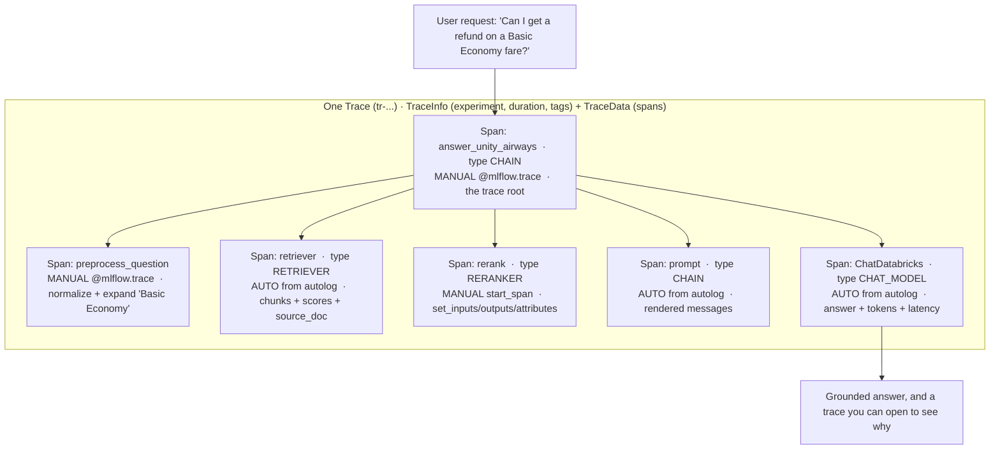
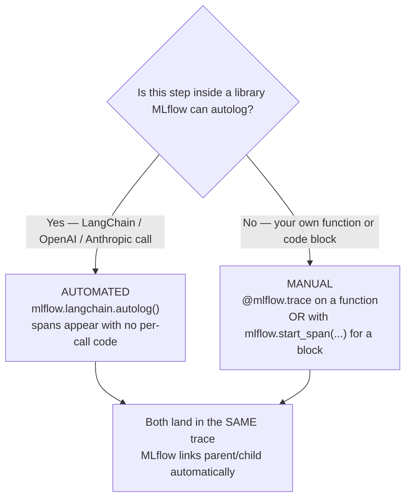

# Tracing a GenAI app — automated + manual  ·  Module 07 · Topics 07.2–07.3 (★ cornerstone)  ·  [Theory + Hands-on]

> **You are here:** Roadmap Module 07 → 07.2 (automated tracing) + 07.3 (manual tracing / custom spans), taught together as one deep-dive. You built the Unity Airways RAG chain in Module 05 and registered it as `unity_airways.rag.ua_rag_chain` in Module 06. Now you make every request through it *observable*, so you can see inside the box instead of guessing.
> **Prerequisites:** 05.3 (the `chain` object: retriever → prompt → `ChatDatabricks` → parser), 06.5 (the chain is a registered LoggedModel), and 07.1 (Trace and Span concepts — `Trace = TraceInfo + TraceData`, and `TraceData` is a list of `Span`s). MLflow ≥ 3.1.

## TL;DR
- **One line turns on automated tracing:** `mlflow.langchain.autolog()`. After that, every `chain.invoke(...)` emits a full **Trace** with nested **Spans** — a retriever span (with the exact chunks and scores), a prompt span (the rendered messages), and an LLM span (response, token counts, latency). No per-call code.
- **Sibling autologgers exist for the other SDKs:** `mlflow.openai.autolog()`, `mlflow.anthropic.autolog()`, plus LangGraph, LlamaIndex, and 20+ more. Call the one(s) that match the library your app uses.
- **Manual tracing adds spans for the code autolog can't see** — your own pre/post steps. Two fluent forms: the `@mlflow.trace` decorator on a function, and the `with mlflow.start_span(...) as span:` context manager for an arbitrary block, where you set `span.set_inputs(...)`, `span.set_outputs(...)`, and `span.set_attributes(...)`.
- **Auto and manual combine into ONE coherent trace.** MLflow auto-detects parent/child by call nesting, so a manual `preprocess_question` step, the autolog'd retriever/prompt/LLM, and a manual `rerank` block all show up under a single request tree.
- **`span_type` matters.** `SpanType.RETRIEVER` makes retrieved docs render specially in the UI (and is required for retrieval evaluation later). `mlflow.set_active_model(...)` links these traces to a **LoggedModel** version — the thread that Module 08 evaluation pulls on.

## The problem
- You shipped the Unity Airways policy assistant. A customer asks *"Can I get a refund on a Basic Economy fare?"* and the bot answers **confidently and wrong** — it quotes a refund window that isn't Unity Airways' actual rule.
- All you have is the input and the output. In between sits a compound system: a query goes to a retriever, top-k chunks get pasted into a prompt, the prompt goes to a model, the model writes an answer. Any one of those steps could be the culprit.
- Without a way to look inside, you are stuck guessing:
  - Did the retriever even fetch the refund chunk, or did it return baggage-policy chunks?
  - Was the chunk retrieved but buried so the model ignored it?
  - Did the prompt render correctly, or did `{context}` come through empty?
  - How slow was each step, and how many tokens did the model burn?
- A GenAI app is not one function you can `print()` your way through. It is a tree of calls across services. You need something that captures that whole tree per request. That is **tracing**.

## Why the naive approach fails
- **Naive move 1 — sprinkle `print()` / logging statements.** Logging captures *discrete events* ("retriever called", "got 5 docs"). It does not record the parent/child structure, so you cannot see that *this* LLM call belongs to *this* retrieval for *this* request. Under any concurrency the log lines interleave into noise.
- **Naive move 2 — log latency and token counts by hand.** You end up wrapping every step in `time.time()` and digging token usage out of each response object. Tracing captures duration and token metrics per span automatically, with no extra code.
- **Naive move 3 — rely on the LangChain callback prints.** They scroll past in the cell output and vanish. There is no searchable store, no timeline, no per-span inputs/outputs you can open a week later during an incident review.
- Root cause in one line: **logging captures events; tracing captures the end-to-end journey of one request with the relationships intact.** For a compound GenAI system, you need the journey.

| | Logging | Tracing |
|---|---|---|
| **Purpose** | discrete events inside the app | the end-to-end journey of one incoming request |
| **Context** | no inherent relationship between events | keeps parent/child context across every step |
| **Perf metrics** | latency/tokens must be derived by hand | captures duration and token metrics automatically |

*(Book 1, Table 5-1.)*

## What it is
- **MLflow Tracing** records detailed information for every step a request takes through your GenAI app, built on open standards (OpenTelemetry-compatible).
- A **Trace** = `TraceInfo` + `TraceData`:
  - **`TraceInfo`** — metadata about the whole trace: MLflow experiment id, start time, duration, status, and custom **tags** (used for searching/filtering later).
  - **`TraceData`** — a list of **`Span`** objects linked in a hierarchy.
- A **`Span`** captures one step: its `inputs`, `outputs`, `attributes` (arbitrary key/values), and `events`. Spans nest to form the request tree.
- **Two ways to create spans:**
  - **Automated tracing** — `mlflow.<library>.autolog()` instruments a supported library so its calls emit spans for free.
  - **Manual tracing** — you add spans yourself for your own code, with the **fluent APIs** (`@mlflow.trace` decorator, `mlflow.start_span()` context manager) or the **low-level client API** for fine-grained control.
- **`SpanType`** labels what a span *is* (`RETRIEVER`, `LLM`, `CHAIN`, `RERANKER`, …). It is mostly organizational, except **`RETRIEVER`**, which has a required output schema so retrieved documents render nicely and can be scored by evaluation.

> 📌 **IMPORTANT:** Best practice from Book 1 — **start with automated tracing, then layer manual tracing on top** to cover the steps autolog can't see (your custom pre/post logic). You rarely choose one or the other; you combine them.

## Why it matters (for a Databricks FDE)
- "Our bot gives wrong answers" is the single most common GenAI support call. Tracing is how you answer *why* in seconds instead of hours — you open the retriever span and see exactly which chunks fed the answer.
- It turns a black box into something you can show a customer: "here is the document that produced this sentence." That provenance is how GenAI apps earn trust in regulated conversations (refunds, baggage liability, fare rules).
- Traces are the raw material for everything downstream in this curriculum: **evaluation** (Module 08) scores the retriever and LLM spans; **monitoring** (Module 13) captures traces in production; the RETRIEVER span schema is what makes retrieval metrics computable at all.
- It is on the certification (Domain 2 — application observability, and Domain 4 — deployment/monitoring): enabling autolog, adding custom spans, span types, and reading a trace to diagnose a regression.

## Core concepts
- **`mlflow.langchain.autolog()`** — turns on automated tracing for LangChain/LCEL. Every `.invoke()` on a runnable now emits a trace with a span per step. Call it once, early.
- **Sibling autologgers** — `mlflow.openai.autolog()`, `mlflow.anthropic.autolog()`, plus LangGraph, LlamaIndex, DSPy, and more (20+). Match it to the SDK your app calls; you can enable several at once.
- **`@mlflow.trace`** — decorator that wraps a function in a span. Kwargs: `name=` (span name; defaults to the function name), `span_type=` (a `SpanType` value or any string), `attributes=` (a dict of metadata). The decorated function's arguments become the span inputs and its return value becomes the span outputs, automatically.
- **`mlflow.start_span(name=..., span_type=...)`** — context manager for tracing an arbitrary *block* of code (not a whole function). Inside it you call `span.set_inputs({...})`, `span.set_outputs({...})`, and `span.set_attributes({...})` yourself.
- **`mlflow.get_current_active_span()`** — grabs the span the current `@mlflow.trace` created, so you can add attributes from inside a decorated function.
- **`mlflow.update_current_trace(tags={...})`** — sets **trace-level** tags (on `TraceInfo`) for later search/filter. These show in the experiment's Traces tab, not in the per-span view.
- **`SpanType`** (`from mlflow.entities import SpanType`) — common built-ins: `RETRIEVER`, `LLM`, `CHAT_MODEL`, `CHAIN`, `AGENT`, `TOOL`, `EMBEDDING`, `RERANKER`, `PARSER`, `UNKNOWN` (newer releases add `EVALUATOR`, `GUARDRAIL`, `MEMORY`, `TASK`, `WORKFLOW` — the enum grows, so treat this list as non-exhaustive). Pass the enum or the equivalent string (`span_type="RETRIEVER"`).
- **`mlflow.entities.Document`** — the object a `RETRIEVER` span should output (`page_content`, `metadata`, `id`) so docs render as documents and can be evaluated. `Document.from_langchain_document(doc)` converts a LangChain `Document`.
- **`mlflow.set_active_model(name=...)`** — sets the active **LoggedModel**; traces produced afterward are associated with that model version. This is the link evaluation and monitoring follow back to "which build produced this trace."

## 🗺️ Visual map

**One request, one trace: automated spans (from `autolog()`) and manual spans (your pre/post steps) nested under a single root** — mirrored in the HTML explainer:



*Takeaway: `autolog()` gives you the retriever, prompt, and model spans for nothing. The manual decorator and context-manager spans slot in around them, and MLflow stitches the whole thing into one tree by call nesting.*

**Automated vs manual — when each one fires:**



*Takeaway: the decision is per step, not per app. Autolog covers the framework calls; manual covers the glue you wrote.*

## How it works — deep dive

### Automated tracing — one line, whole chain [Hands-on]
- `mlflow.langchain.autolog()` hooks LangChain's callback system. From that point, every runnable `.invoke()` writes a trace whose spans mirror the chain: the retriever, the prompt template, the chat model, the parser.
- You get, for free and per request:
  - the **retriever span** — the query it ran, the documents it returned, their relevance scores, and (because you put `source_doc` in the retriever `columns` in Module 05) their provenance;
  - the **prompt span** — the fully rendered messages, so you can confirm `{context}` was actually filled;
  - the **LLM span** — the response, token counts, and latency.
- Best practice (Book 1): begin here. Automated tracing gets you 80% of the visibility with one line. Only then do you add manual spans for the parts it misses.
- **Siblings for other stacks:** if your app calls OpenAI or Anthropic SDKs directly, enable `mlflow.openai.autolog()` or `mlflow.anthropic.autolog()`. You can turn on several at once — MLflow merges their spans into the same traces.

> ⚠️ **GOTCHA:** On **serverless compute**, GenAI autologging is **not** auto-enabled — you must explicitly call the `mlflow.<library>.autolog()` for each integration you want traced (Databricks docs). On classic ML runtimes some flavors auto-enable, but calling it explicitly is the portable habit.

### Manual tracing form 1 — the `@mlflow.trace` decorator [Hands-on]
- Use it to trace a *whole function* — typically one of your own helpers that autolog knows nothing about.
- The decorator captures the function's arguments as span **inputs** and its return value as span **outputs**, automatically:

```python
import mlflow
from mlflow.entities import SpanType

@mlflow.trace(span_type=SpanType.RETRIEVER, name="single_retriever_search",
              attributes={"vs_type": "databricks_vector_search"})
def search(query_text: str):
    span = mlflow.get_current_active_span()          # the span this decorator created
    span.set_attributes({"retriever_k": 5})          # add more attributes from inside
    return index.similarity_search(query_text=query_text, num_results=5)
```

- **Kwargs:** `name=` renames the span (default is the function name), `span_type=` sets the type (a `SpanType` or a string), `attributes=` attaches metadata up front. You can add more later with `get_current_active_span().set_attributes(...)`.
- **Verified:** `span_type` accepts either a built-in `SpanType` or a plain string, e.g. `@mlflow.trace(span_type="func", attributes={"key": "value"})` (MLflow docs). If you use multiple decorators, `@mlflow.trace` should be the **outermost** one so it sees the whole call.

### Manual tracing form 2 — the `mlflow.start_span()` context manager [Hands-on]
- Use it to trace an arbitrary *block* — when there is no single function to decorate, or you only want to trace part of one. You provide the span details yourself:

```python
def rerank(question, docs):
    with mlflow.start_span(name="rerank", span_type=SpanType.RERANKER) as span:
        span.set_inputs({"question": question, "n_candidates": len(docs)})
        ranked = sorted(docs, key=lambda d: score(question, d), reverse=True)[:3]
        span.set_outputs({"kept": [d.metadata["source_doc"] for d in ranked]})
        span.set_attributes({"reranker": "heuristic", "top_k": 3})
        return ranked
```

- Like the decorator, the context manager captures parent/child relationships, exceptions, and execution time, and it works alongside autolog. The difference: **you** set the name, inputs, and outputs.
- `span.set_inputs(...)` / `span.set_outputs(...)` take any JSON-serializable value (a dict, a string, a list). `span.set_attributes(...)` attaches metadata that shows on the span's Attributes tab.

> 💡 **TIP:** There is also a **low-level client API** (`MlflowClient().start_span(...)` / `end_span(...)`, threaded by `parent_id`) for fine-grained control when the fluent APIs don't fit — e.g. spans that start and end in different functions. It is more verbose; reach for it only when you need it, and verify the exact client-method signatures against current MLflow docs.

### Combining automated + manual into one trace [Hands-on]
- The payoff: wrap your steps in an outer `@mlflow.trace` orchestrator. Inside it, call your manual helpers *and* invoke the autolog'd LangChain pieces. MLflow detects the nesting and files everything under one root span.

```python
mlflow.langchain.autolog()                    # AUTO: retriever/prompt/LLM self-trace

@mlflow.trace                                  # MANUAL pre-step (default span type)
def preprocess_question(raw: str) -> str:
    return raw.strip().replace("BE fare", "Basic Economy fare")

@mlflow.trace(span_type=SpanType.CHAIN)        # MANUAL outer span = the trace root
def answer_unity_airways(raw_question: str) -> str:
    q = preprocess_question(raw_question)      # -> manual span (child)
    docs = retriever.invoke(q)                 # -> AUTO RETRIEVER span
    docs = rerank(q, docs)                     # -> manual RERANKER span (child)
    context = format_docs(docs)                # (reuse Module 05 helper)
    answer = (prompt | llm | StrOutputParser()).invoke(  # -> AUTO prompt + LLM spans
        {"context": context, "question": q}
    )
    return answer
```

- Notice you reused the **same** Module 05 components (`retriever`, `prompt`, `llm`, `format_docs`) — you just called them explicitly so a manual `rerank` could sit between retrieval and generation. If you don't need a mid-chain step, `chain.invoke(q)` inside the orchestrator works too and still nests its autolog subtree under the root.
- MLflow automatically links `preprocess_question`, the retriever, `rerank`, the prompt, and the model into one tree. You did not write any code to connect parent to child.
- **Parallelism note:** if you fan a step out with `ThreadPoolExecutor`, MLflow's tracing uses Python context variables and is thread-isolated by default. Copy the context into each worker so the child spans attach to the right trace:

```python
import contextvars
from concurrent.futures import ThreadPoolExecutor
with ThreadPoolExecutor(max_workers=2) as ex:
    futures = [ex.submit(contextvars.copy_context().run, worker, q) for q in queries]
```

### Span types, the RETRIEVER schema, and trace-level tags [Theory + Hands-on]
- Span types are mostly for organization and UI icons — **except `RETRIEVER`**, which is special. To render retrieved docs nicely *and* to let evaluation score retrieval later, a `RETRIEVER` span should output a list of `mlflow.entities.Document` (`page_content`, `metadata`, `id`), not a raw JSON blob:

```python
from mlflow.entities import Document
docs = [Document(page_content=row["content"],
                 metadata={"score": row["score"], "source_doc": row["source_doc"]},
                 id=str(row["chunk_id"])) for row in results]
```

- **Attributes vs tags — different scopes:**
  - `span.set_attributes({...})` (or the decorator's `attributes=`) → **span-level** metadata; shows on that span's Attributes tab.
  - `mlflow.update_current_trace(tags={...})` → **trace-level** tags on `TraceInfo`; used to search/filter traces in the experiment's Traces tab (they don't appear in the per-span view).

### Tying traces to a LoggedModel version [Theory + Hands-on]
- Call `mlflow.set_active_model(name="ua_rag_chain")` before you run. It sets the active **LoggedModel**; the traces you generate afterward are associated with that model version.

```python
active = mlflow.set_active_model(name="ua_rag_chain")
print(active.name, active.model_id)   # LoggedModel this session's traces attach to
```

- This is the connective tissue for the rest of the curriculum: Module 06 registered the chain as a LoggedModel; `set_active_model` stamps its traces with that identity; Module 08 evaluation then reads *those* traces to score *that* version. Without it, traces float free of any version.

> ⚠️ **GOTCHA:** `set_active_model` + `LoggedModel` are **new in MLflow 3** — the exact trace-to-LoggedModel linking semantics can differ across 3.x point releases and between serverless and classic runtimes. The API and its `.name`/`.model_id` return are confirmed; verify the precise linking behavior against current docs for your runtime before you depend on it in an evaluation pipeline.

## How to do it on Databricks

> **[Hands-on]** Runs on serverless or a DBR ML runtime with **MLflow ≥ 3.1**. You need the Module 05 `chain` (and its `retriever`, `prompt`, `llm`, `format_docs`) and the Module 06 registered model `unity_airways.rag.ua_rag_chain`. `CATALOG="unity_airways"`, `SCHEMA="rag"`.

**0. Install and set variables:**

```python
%pip install -U "mlflow[databricks]>=3.1" databricks-langchain databricks-vectorsearch
dbutils.library.restartPython()
```

```python
import mlflow
from mlflow.entities import SpanType, Document

CATALOG  = "unity_airways"
SCHEMA   = "rag"
UC_MODEL = f"{CATALOG}.{SCHEMA}.ua_rag_chain"
QUESTION = "Can I get a refund on a Basic Economy fare?"
```

**1. Turn on automated tracing and pin the version:**

```python
mlflow.langchain.autolog()                     # every LangChain .invoke() now traces
active = mlflow.set_active_model(name="ua_rag_chain")   # link traces to the LoggedModel
print(active.name, active.model_id)
```

*How to verify:* run `chain.invoke(QUESTION)` once, then open the cell's inline **MLflow Trace UI** (Summary / Details & Timeline). You should see nested spans for the retriever, prompt, and model — with zero tracing code in the chain.

**2. Read the automated trace to diagnose the wrong answer:**

```python
answer = chain.invoke(QUESTION)
print(answer)
# In the trace: open the RETRIEVER span. Did the refund/fare-rules chunk come back?
# If not, the bug is upstream in chunking/retrieval (Modules 03-04), not the model.
```

**3. Add a manual pre-step with the decorator:**

```python
@mlflow.trace                                   # default span type; name = function name
def preprocess_question(raw: str) -> str:
    # normalize the question before it reaches the chain
    return raw.strip().replace("BE fare", "Basic Economy fare")
```

**4. Add a manual mid-step with the context manager:**

```python
def rerank(question, docs):
    with mlflow.start_span(name="rerank", span_type=SpanType.RERANKER) as span:
        span.set_inputs({"question": question, "n_candidates": len(docs)})
        ranked = sorted(docs, key=lambda d: len(d.page_content))[:3]   # stand-in scorer
        span.set_outputs({"kept": [d.metadata.get("source_doc") for d in ranked]})
        span.set_attributes({"reranker": "heuristic", "top_k": 3})
        return ranked
```

**5. Orchestrate — one function, one trace, auto + manual interleaved:**

```python
from langchain_core.output_parsers import StrOutputParser

@mlflow.trace(span_type=SpanType.CHAIN)         # outer span = the trace root
def answer_unity_airways(raw_question: str) -> str:
    q = preprocess_question(raw_question)       # manual span
    docs = retriever.invoke(q)                  # AUTO RETRIEVER span
    docs = rerank(q, docs)                      # manual RERANKER span
    return (prompt | llm | StrOutputParser()).invoke(   # AUTO prompt + LLM spans
        {"context": format_docs(docs), "question": q}
    )

print(answer_unity_airways("Can I get a refund on a BE fare?"))
```

*How to verify:* open the newest trace. The tree should read `answer_unity_airways (CHAIN)` → `preprocess_question` → retriever `(RETRIEVER)` → `rerank (RERANKER)` → prompt → `ChatDatabricks (CHAT_MODEL)`. Auto and manual spans sit in one tree.

**6. Add trace-level tags for later search:**

```python
@mlflow.trace(span_type=SpanType.CHAIN)
def answer_tagged(raw_question: str) -> str:
    mlflow.update_current_trace(tags={"app": "ua-policy-bot", "channel": "web"})
    return answer_unity_airways(raw_question)
```

*How to verify:* go to **Experiments → your experiment → Traces**; the `app` and `channel` tags are filterable columns there (they don't appear on individual spans).

**7. Make the RETRIEVER span render as documents (needed for evaluation later):**

```python
@mlflow.trace(span_type=SpanType.RETRIEVER, name="ua_retriever")
def retrieve_as_documents(q: str):
    raw = retriever.invoke(q)                    # LangChain Documents
    return [Document.from_langchain_document(d) for d in raw]   # MLflow Documents
```

## Worked example (Unity Airways)
- **Symptom:** `chain.invoke("Can I get a refund on a Basic Economy fare?")` returns a confident but wrong refund window.
- **Automated trace:** with `mlflow.langchain.autolog()` on, one invoke produces a trace. You open the **RETRIEVER span** and see it returned baggage-allowance chunks, not the refund/fare-rules chunk. The model was never given the right text — so the bug is retrieval, not the model.
- **Manual spans:** you add `preprocess_question` (expands "BE fare" → "Basic Economy fare", which fixes the retrieval miss) as a `@mlflow.trace` span, and a `rerank` step as a `mlflow.start_span` block to push the fare-rules chunk to the top.
- **Combined trace:** the orchestrator `answer_unity_airways` is the root `CHAIN` span; under it sit the manual `preprocess_question`, the autolog'd retriever, the manual `rerank`, the prompt, and the `ChatDatabricks` span — one coherent request tree.
- **Versioned:** `mlflow.set_active_model(name="ua_rag_chain")` stamped every trace with the LoggedModel, so when Module 08 evaluates this build, it reads exactly these traces.
- **Result:** the answer is now grounded in the correct chunk, and the trace *proves* which document produced it — provenance you can show the customer.

## Uses, edge cases and limitations
| Use it when | Watch out when | Better move |
|---|---|---|
| Debugging "why did the bot say that?" | You only have input/output to look at | Enable `autolog()`; read the RETRIEVER span first |
| Instrumenting a LangChain/LCEL app | App calls raw OpenAI/Anthropic SDKs instead | Add `mlflow.openai.autolog()` / `mlflow.anthropic.autolog()` |
| Tracing your own pre/post helpers | Autolog can't see your custom code | `@mlflow.trace` on the function, or `start_span` for a block |
| Tracing part of a function / a bare block | There's no single function to decorate | `with mlflow.start_span(...)` and set inputs/outputs yourself |
| You want retrieval evaluated later | RETRIEVER span outputs a raw JSON blob | Output `mlflow.entities.Document`s so the schema is valid |
| Fanning a step across threads | Child spans land in the wrong/no trace | Copy context: `contextvars.copy_context().run(fn, ...)` |
| Attributing traces to a build | Traces float free of any version | `mlflow.set_active_model(name=...)` before running |

## Common mistakes / gotchas
| Mistake | Why it hurts | Better move |
|---|---|---|
| Expecting autolog on serverless without calling it | No traces appear; you assume tracing is "off" | Explicitly call `mlflow.<library>.autolog()` on serverless |
| Enabling the wrong autologger | LangChain autolog won't trace raw OpenAI SDK calls | Match the autologger to the SDK the app actually calls |
| A custom retriever span that returns raw JSON | Docs render as a blob; retrieval can't be evaluated | Set `span_type=RETRIEVER` and return `Document`s |
| Confusing span attributes with trace tags | You search for a tag on the span view and find nothing | `set_attributes` = span; `update_current_trace(tags=)` = trace |
| `@mlflow.trace` not the outermost decorator | Trace misses part of the function's execution | Put `@mlflow.trace` on top of custom decorators |
| Fanning out with threads and losing spans | Child spans isolated from the parent trace | `contextvars.copy_context().run(...)` per worker |
| Manual-only tracing (skipping autolog) | You hand-write spans the framework would give free | Autolog first, then add manual spans for the gaps |

> 📌 **IMPORTANT:** The whole lesson is two moves. **Turn on `autolog()`** to get the framework spans for free, then **add manual spans** (`@mlflow.trace` for a function, `start_span` for a block) for the code you wrote. MLflow merges both into one trace automatically — you never wire parent to child by hand.

> 💡 **TIP:** Make reading the trace your *first* debugging step, not your last. When a RAG answer is wrong, open the RETRIEVER span before you touch the prompt or swap the model — nine times out of ten the fault is that the right chunk was never retrieved, and the trace tells you that in one click.

> ⚠️ **GOTCHA:** Book 1 is an O'Reilly **Early Release (RAW & UNEDITED)** and predates parts of the MLflow 3 `mlflow.genai` surface. The tracing APIs it shows (`autolog()`, `@mlflow.trace`, `mlflow.start_span`, `SpanType`, `set_inputs`/`set_outputs`/`set_attributes`, `update_current_trace`, `mlflow.entities.Document`) are all still current and were re-verified live against `mlflow.org/docs/latest`. The low-level `MlflowClient` span API and the exact `set_active_model` → trace-linking semantics are the two spots to re-confirm for your runtime.

## 📝 Notes
- _Space for your own notes._

**Self-check (5 questions)**
1. Name the one line that enables automated tracing for your LangChain RAG chain, and list the three spans you expect to see per invoke.
2. You call OpenAI's SDK directly in one helper and LangChain in another. Which autologger(s) do you enable, and what happens if you enable only `mlflow.langchain.autolog()`?
3. Give the two fluent manual-tracing forms. When would you reach for the context manager instead of the decorator?
4. How do auto and manual spans end up in the *same* trace without you writing any linking code? What breaks this under `ThreadPoolExecutor`, and how do you fix it?
5. Why does `span_type=SpanType.RETRIEVER` matter beyond a nicer icon, and what does `mlflow.set_active_model(...)` connect a trace to?

## How this maps to the certification
- **Domain 2 (application development / observability)** and **Domain 4 (deployment and monitoring)** own this topic. The exam expects you to enable automated tracing, add custom spans, choose span types, and read a trace to find a regression.
- Exam-focus points: `mlflow.langchain.autolog()` (and the sibling `openai`/`anthropic` autologgers); `@mlflow.trace(name=, span_type=, attributes=)`; `mlflow.start_span()` with `set_inputs`/`set_outputs`/`set_attributes`; `Trace = TraceInfo + TraceData`, `TraceData` is a list of `Span`s; the special `RETRIEVER` span schema (`mlflow.entities.Document`); trace tags via `update_current_trace`; and `mlflow.set_active_model` to bind traces to a LoggedModel for evaluation.

## Sources
- 📘 **B1 — *Practical MLflow for Generative AI on Databricks*, Ch 5 ("MLflow Tracing for GenAI Application Observability")** and Ch 4 (Models-from-Code + `set_active_model`): logging-vs-tracing (Table 5-1); `Trace = TraceInfo + TraceData`, `Span` with inputs/outputs/attributes/events; automated tracing via `mlflow.<flavour>.autolog()` (LangChain, LangGraph, OpenAI, LlamaIndex, "20+ libraries"); manual tracing with the `@mlflow.trace` decorator (`name=`, `span_type=SpanType.RETRIEVER/PARSER/CHAIN`, `attributes=`), `mlflow.get_current_active_span()`, `mlflow.update_current_trace(tags=)`, and the `mlflow.start_span(name=..., span_type=SpanType.CHAIN)` context manager with `set_inputs`/`set_outputs`/`set_attributes`; combining auto + manual in one trace; `ThreadPoolExecutor` + `contextvars.copy_context()`; the special `RETRIEVER` span schema (`mlflow.entities.Document`); `mlflow.set_active_model(name=...)` → `.name`/`.model_id`. *O'Reilly Early Release — RAW & UNEDITED; every API re-verified against current docs.*
- 🌐 **MLflow docs — GenAI tracing / manual instrumentation** (`mlflow.org/docs/latest/genai/tracing/app-instrumentation/manual-tracing/`): `@mlflow.trace(name=, span_type=, attributes=)` with `span_type` as a `SpanType` **or a string**; `@mlflow.trace` outermost-decorator rule; `mlflow.start_span(name=...)` with `span.set_inputs/set_outputs`; `mlflow.get_current_active_span().set_attributes(...)`; `mlflow.update_current_trace(tags=)`; `ThreadPoolExecutor` + `contextvars.copy_context()`. **Verified live** (bounded curl, July 2026).
- 🌐 **MLflow API — `mlflow.entities.SpanType`** (`mlflow.org/docs/latest/api_reference/python_api/mlflow.entities.html`): enum values `AGENT, CHAIN, CHAT_MODEL, EMBEDDING, LLM, PARSER, RERANKER, RETRIEVER, TOOL, UNKNOWN`; `mlflow.entities.Document` represents retrieved docs in a `RETRIEVER` span, with `from_langchain_document(...)`. **Verified live** (bounded curl, July 2026).
- 🌐 **Databricks docs — automatic tracing** (`docs.databricks.com/aws/en/mlflow3/genai/tracing/app-instrumentation/automatic`): `mlflow.<library>.autolog()` traces 20+ frameworks; **on serverless you must enable it explicitly**; worked example combining `mlflow.openai.autolog()` + `mlflow.langchain.autolog()` + a manual `@mlflow.trace(span_type=SpanType.CHAIN)` in one trace; install `"mlflow[databricks]>=3.1"`. **Verified live** (bounded curl, July 2026).
- 🧭 Naming cross-check: `.claude/skills/genai-teacher/references/naming-conventions.md` §1 (Tracing = `@mlflow.trace`, `mlflow.start_span()`, `mlflow.<lib>.autolog()`; **LoggedModel + `mlflow.set_active_model()`** links a version to its traces/evals/metrics, new in MLflow 3; OpenTelemetry-compatible) and §2 (LangChain import is `databricks-langchain`; `ChatDatabricks`).
