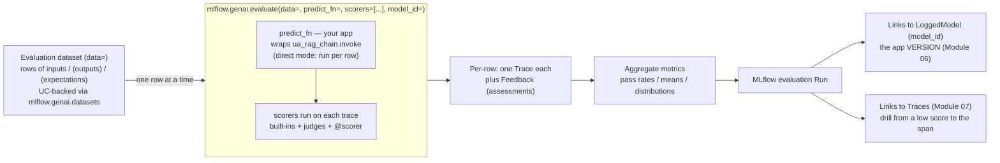
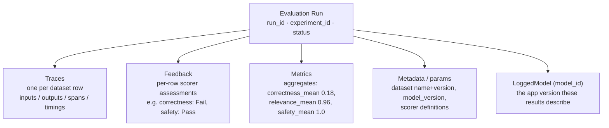

# The MLflow 3.x evaluation stack & Evaluation Harness  ·  Module 08 · Topic 08.1 (★ cornerstone)  ·  [Theory]

> **You are here:** Roadmap Module 08 → 08.1 (cornerstone deep-dive). This is the architecture lesson for the whole evaluation module: one API — the **Evaluation Harness** — and the objects it wires together. Get this map right and 08.2–08.10 are just filling in the boxes.
> **Prerequisites:** 06.2 (MLflow 2 → 3: why eval is now `mlflow.genai.evaluate`, not `mlflow.evaluate(model_type=...)`), 06.5 (LoggedModel + UC registration), and Module 07 (traces/spans — evaluation *scores the trace*). The thing being evaluated throughout is the Module 05 RAG chain, registered as **`unity_airways.rag.ua_rag_chain`** (`CATALOG="unity_airways"`, `SCHEMA="rag"`).

## TL;DR
- The **Evaluation Harness** is one call: **`mlflow.genai.evaluate(data=, predict_fn=, scorers=[...], model_id=)`**. It runs your app over a dataset, grades every row, aggregates the scores, and logs the whole thing as an MLflow run.
- Four arguments, four jobs: **`data`** = the evaluation dataset (rows of `inputs` / `outputs` / `expectations`), **`predict_fn`** = a callable wrapping your app (e.g. the RAG chain's `.invoke`), **`scorers`** = an *explicit* list of graders (3.x does **not** auto-select), **`model_id`** = the LoggedModel version the results attach to.
- Scorers come in **three families**: built-in scorers (`mlflow.genai.scorers`), LLM judges (`mlflow.genai.judges` / `make_judge()`), and custom code scorers (`@scorer`). One list can mix all three. (08.3 / 08.4 go deep.)
- The harness produces **per-row assessments + aggregate metrics**, packaged as an MLflow **evaluation run** whose results link to the **LoggedModel** version (Module 06) and to **traces** (Module 07) — so you can drill from a low aggregate score straight to the exact failing span.
- The trap: the MLflow book teaches the MLflow-2 shape, `mlflow.evaluate(model_type="databricks-agent")`, and there is **no** `agents.evaluate()`. Teach the MLflow-3 harness: `mlflow.genai.evaluate(...)` with explicit `scorers=[...]`.

## The problem
- You built the Unity Airways RAG chain in Module 05. It answers questions. But "it answers questions" is not a quality bar — you need to know *how often* it is correct, grounded, on-tone, and safe, and you need that number to move when you change a prompt or a retriever.
- Doing this by hand does not scale. You cannot eyeball 200 answers after every prompt tweak, remember last week's numbers, or prove to a customer that version 2 is better than version 1.
- Worse, a GenAI answer is not a single string you can diff against a gold answer. A wrong answer can come from a bad retrieval, a bad prompt, a hallucination, or a formatting post-processor — and the raw text alone does not tell you which.
- So the real problem is: **how do you turn "run the app and judge it" into a repeatable, recorded, comparable experiment** — one that captures not just the final text but the whole execution, and links every score back to a specific version of the app.

## Why the naive approach fails
- **Naive move 1 — a notebook of asserts.** You loop over questions, call the chain, and `assert "Manage Booking" in answer`. This breaks the moment the model phrases things differently, and it can only check surface strings, never groundedness or tone.
- **Naive move 2 — a spreadsheet of scores.** You paste answers into a sheet and rate them 1–5 by hand. It is slow, subjective, unversioned, and gone the next time someone asks "what did we score before the prompt change?"
- **Naive move 3 — copy the book's API.** The MLflow book (📘B1) predates `mlflow.genai`, so it shows `mlflow.evaluate(model_type="databricks-agent"/"question-answering")` with auto-selected judges. On **MLflow ≥ 3.1** that GenAI path is gone, and people often invent `agents.evaluate()` by analogy — which never existed.
- **Naive move 4 — score the text, not the trace.** If you feed a grader only the final answer, you cannot compute groundedness (it needs the *retrieved context*) or latency/cost (they come from *span timings and token counts*). You measure the tip of the iceberg.
- Root cause in one line: **evaluation of a GenAI app is an experiment over its execution, not a string comparison.** The Evaluation Harness exists to make that experiment one call, recorded with full lineage.

## What it is
- The **Evaluation Harness** is MLflow 3.x's unified entry point for evaluating GenAI apps: **`mlflow.genai.evaluate()`**. You give it a dataset, a way to run your app, and a list of scorers; it runs the app on each row, scores each result, aggregates, and logs an evaluation run with lineage back to your datasets, model version, and traces. (📘B1 Ch6: "MLflow 3.x provides a unified API for running these evaluations through `mlflow.genai.evaluate()`. It logs results with lineage that links back to datasets, model versions, and trace identifiers.")
- Think of it as a small assembly line with three inputs and two outputs:
  - **Inputs:** `data` (what to test on), `predict_fn` (how to run the app), `scorers` (how to grade). Plus `model_id` to say *which version* this is.
  - **Outputs:** per-row **traces + feedback** (the assessments), and **aggregate metrics** (pass rates, means, distributions) — all inside one MLflow **evaluation run**.
- It runs in **two modes** (both use the same call):
  - **Direct evaluation** — you pass `predict_fn`, and the harness *invokes your live app* per row, creating a fresh trace each time.
  - **Answer-sheet evaluation** — you pass precomputed `outputs` (and optional `expectations`) or existing traces; the app is **not** invoked, and the harness just scores what you gave it. (Good for regression tests and scoring curated production traces.)
- Crucially, in MLflow 3.x the harness **scores the trace, not just the text** — request, retrieved documents, tool calls, intermediate steps, final reply, timings, and token counts are all available to scorers. (📘B1 Ch6 NOTE: "Evaluate the trace, not just the text… Evaluations judge the execution, not a standalone string.")

## Why it matters (for a Databricks FDE)
- **It is the one API for the whole module.** Datasets (08.2), code scorers (08.3), judges (08.4), run comparison (08.5), human feedback (08.6) all plug into `mlflow.genai.evaluate()`. Learn the harness once and the rest is configuration.
- **Offline eval and production monitoring share it.** Because you wrap the app in a `predict_fn` (or `to_predict_fn()` for a Serving endpoint), the *same scorers* you use in development can run in production monitoring — one definition of "good," everywhere. (📘B1 Ch6.)
- **Credibility in front of a customer.** "Version 2 lifted groundedness from 0.71 to 0.86 on the same 200-row dataset, and here are the three traces that flipped" is a sentence that wins technical trust. Ad-hoc notebooks cannot produce it.
- **It is a top exam trap.** The certification is written against MLflow 3. Knowing the harness signature, explicit `scorers`, and that there is no `agents.evaluate()` is worth real points in the monitoring/evaluation domain.

## Core concepts
- **Evaluation Harness = `mlflow.genai.evaluate(data=, predict_fn=, scorers=[...], model_id=)`.** The single function that orchestrates a run. Everything below is one of its arguments or one of its outputs.
- **`data` — the evaluation dataset.** A managed dataset, a `list[dict]`, or a DataFrame whose rows carry **`inputs`** (what the app receives), optional **`outputs`** (precomputed answers, for answer-sheet mode), and optional **`expectations`** (ground truth / reference). Managed datasets are UC-backed via `mlflow.genai.datasets` (`create_dataset` / `get_dataset` / `search_datasets`). 08.2 goes deep.
- **`predict_fn` — the app wrapper.** A plain Python callable that takes a row's `inputs` and returns the app's output. For the RAG chain it wraps `ua_rag_chain.invoke`. For a deployed endpoint, wrap it with `to_predict_fn()`. Omit `predict_fn` and pass `outputs` instead to run in answer-sheet mode.
- **`scorers` — the graders (explicit list).** MLflow 3.x does **not** auto-pick judges; you pass a list. Three families:
  - **Built-in scorers** — `mlflow.genai.scorers`, e.g. `Correctness`, `RelevanceToQuery`, `Safety`, `RetrievalGroundedness`, `RetrievalRelevance`, `RetrievalSufficiency`, `Guidelines`. (08.3/08.4.)
  - **LLM judges** — `mlflow.genai.judges`, and custom judges built with **`make_judge()`**. (08.4.)
  - **Custom code scorers** — your own Python graded with the **`@scorer`** decorator. (08.3.)
- **`model_id` — the version anchor.** The id of the **LoggedModel** (Module 06) this evaluation belongs to, so the run's results attach to a named app version. Set the active model with `mlflow.set_active_model(name=...)` and the harness associates results with it.
- **Ground-truth-required vs reference-free scorers.** Some scorers need `expectations` (e.g. `Correctness` compares to a reference answer); others are **reference-free** and judge the trace alone (e.g. `Safety`, `RelevanceToQuery`, `RetrievalGroundedness` read the response and retrieved context). This determines which columns your dataset must carry. 08.2/08.4 go deep.
- **What the harness produces — one evaluation run with four parts** (📘B1 Ch6, Fig. 6-4):
  - **Traces** — one per dataset row (request, response, retrievals, intermediate steps, timings, token counts, tool calls).
  - **Feedback** — the per-row assessments your scorers generate, attached to each trace.
  - **Metrics** — aggregate statistics computed from the feedback (pass rates, means, distributions).
  - **Metadata / parameters** — dataset name + version, model/chain version, scorer definitions, environment.
- **Former (MLflow 2) vocabulary you will see in the book:** `mlflow.evaluate(model_type="databricks-agent"/"question-answering")`, auto-selected judges, `request`/`response`/`expected_response` columns. Recognize them; translate to the harness.

## 🗺️ Visual map

**The Evaluation Harness data flow** — dataset → `predict_fn` per row → scorers → per-row + aggregate → run linked to LoggedModel + traces (mirrored in the HTML explainer):



*Takeaway: three inputs go in (data, predict_fn, scorers), two outputs come out (per-row traces+feedback, aggregate metrics), and the run pins them to a version and its traces.*

**Anatomy of an evaluation run** — what the harness writes, and what it links to:



*Takeaway: aggregate metrics tell you WHEN something regressed; the linked traces tell you WHAT went wrong on which row.*

## How it works — deep dive

### 1. The four arguments, in order [Theory]
- **`data=`** — the rows to test on. Each row is a dict-like record with `inputs` (required), and optionally `outputs` and `expectations`. Pass a managed UC dataset object, a `list[dict]`, or a DataFrame. In direct mode you usually pass just `inputs` (the harness fills in `outputs` by running the app); in answer-sheet mode you pass `inputs` + `outputs` (+ optional `expectations`).
- **`predict_fn=`** — the callable the harness invokes per row in **direct mode**. It receives the row's `inputs` and returns the app output; MLflow captures a fresh trace around each call. Wrap `ua_rag_chain.invoke`; for a Serving endpoint use `to_predict_fn()`. Omit it entirely to run **answer-sheet mode** on precomputed `outputs`/traces. (📘B1 Ch6.)
- **`scorers=`** — the explicit list of graders. This is the single most common mistake to avoid: **3.x auto-selects nothing.** Pass an empty/omitted list and you measure nothing. Mix built-ins, judges, and `@scorer` functions freely.
- **`model_id=`** — the LoggedModel id these results belong to. It is how "this eval run" and "this app version" become one linked story, so a later regression is attributable to a specific version. (Confirmed as a parameter on the MLflow `mlflow.genai` API reference; concept grounded in naming-conventions §1 "LoggedModel + `set_active_model()`".)

### 2. Two evaluation modes [Theory]
- **Direct evaluation** (Fig. 6-5): inputs + app code (`predict_fn`) + scorers go into `mlflow.genai.evaluate()`; the harness runs `predict_fn` and the scorers concurrently and records outputs as traces plus feedback. Use it to test a **live** chain. Because you reuse the same scorers later in production monitoring, this keeps "what good means" consistent across dev and prod.
- **Answer-sheet evaluation** (Fig. 6-6): you provide `data` (precomputed `outputs`, optional `expectations`, or existing traces) and scorers — no app invocation. When you pass `inputs` + `outputs`, the harness *automatically constructs traces* from them, then runs the scorers on each trace. Use it for **regression testing, benchmarking, and promotion decisions** based on curated production traces. (📘B1 Ch6.)
- Same output either way: one evaluation run with traces, per-row feedback, and aggregate metrics.

### 3. Scoring the trace, not the text [Theory]
- The harness scores the **trace**, which carries the request, the retrieved documents, tool calls, intermediate steps, the final reply, timings, and token counts. That is why different scorer families read different parts:
  - **Groundedness / retrieval relevance** need the *retrieved context* from the trace.
  - **Safety / guidelines** read the *response* plus metadata.
  - **Latency / cost** come from *span timings and token counts*.
- This is the mechanism behind the drill-down: a low `RetrievalGroundedness` mean is not a mystery number — it points at the retrieval spans of the rows that failed. (📘B1 Ch6 NOTE.)

### 4. The three scorer families [Theory]
- **Built-in scorers** (`mlflow.genai.scorers`): ready-made graders for the common quality dimensions — correctness, relevance, safety, and the RAG-specific `RetrievalGroundedness` / `RetrievalRelevance` / `RetrievalSufficiency`. Instantiate and drop into the list. (08.3.)
- **LLM judges** (`mlflow.genai.judges`, and **`make_judge()`** for custom ones): use an LLM to grade a natural-language criterion ("Is the tone professional?"). `make_judge()` builds a reusable judge from your prompt/criteria. (08.4.)
- **Custom code scorers** (**`@scorer`**): plain Python for deterministic checks — regexes, length bounds, citation presence, JSON-schema validity. Decorate a function with `@scorer` and it becomes a first-class grader that returns feedback per row. (08.3.)
- All three return **feedback** in the same shape, so the harness aggregates them uniformly into metrics. You can put a built-in, a judge, and a `@scorer` in the *same* `scorers=[...]` list.

### 5. What links to what — lineage [Theory]
- Every evaluation run is logged with lineage back to **datasets** (which data, which version), the **LoggedModel** (`model_id` — which app version), and **trace identifiers** (which executions). (📘B1 Ch6.)
- This is what makes comparison trustworthy: pin the dataset version and the model/chain version, change exactly one variable, and the run records enough context to attribute the difference. (Run comparison is 08.5.)

### 6. How it differs from MLflow 2 [Theory]
- **MLflow 2 (book style):** `mlflow.evaluate(model=..., model_type="databricks-agent"/"question-answering", extra_metrics=[...])` — MLflow auto-selected judges for the `model_type`; you tuned "manual knobs."
- **MLflow 3 (current):** `mlflow.genai.evaluate(data=, predict_fn=, scorers=[...], model_id=)`. The mapping is mechanical: `model=` → `predict_fn=`, `extra_metrics=` → `scorers=`, and `model_type=` / `evaluator_config=` are **removed**. Judges are never auto-selected — you pass `scorers=[...]`.
- **There is no `agents.evaluate()`.** Agents are evaluated with the *same* `mlflow.genai.evaluate()`. The old "Agent Evaluation" via `mlflow.evaluate(model_type="databricks-agent")` is the former path. (naming-conventions §1, §2, §9.)
- Dataset fields moved too: the old `request` / `response` / `expected_response` / `retrieved_context` columns become **`inputs` / `outputs` / `expectations`**, with `retrieved_context` read from the trace.

## MLflow 2 → MLflow 3 evaluation mapping (carry this table)

| MLflow 2 (former — often in the book) | MLflow 3 Evaluation Harness (teach this) | Status |
|---|---|---|
| `mlflow.evaluate(model=, model_type="databricks-agent"/"question-answering")` | `mlflow.genai.evaluate(data=, predict_fn=, scorers=[...], model_id=)` | GA |
| `model=` (the app object) | `predict_fn=` (a callable wrapping the app), or `to_predict_fn()` for an endpoint | GA |
| `extra_metrics=[...]`; auto-selected judges | Explicit `scorers=[...]` from `mlflow.genai.scorers` / `mlflow.genai.judges` / `@scorer` | GA |
| `agents.evaluate(...)` (assumed — never existed) | Evaluate agents with the same `mlflow.genai.evaluate()` | GA (no such function) |
| Columns `request` / `response` / `expected_response` / `retrieved_context` | `inputs` / `outputs` / `expectations`; `retrieved_context` from traces | GA |
| Ad-hoc DataFrame only | UC-backed datasets via `mlflow.genai.datasets` (or `list[dict]` / DataFrame) | GA |
| No version anchor for eval results | `model_id` links results to a **LoggedModel** version | GA (MLflow 3) |
| Score the final text | Score the **trace** (retrievals, tool calls, timings, tokens) | GA |

## How to do it on Databricks (the harness, step by step)

> **[Theory]** These snippets are illustrative of the harness shape — not a runnable notebook flow (that is 08.3–08.5). Assume **MLflow ≥ 3.1** on serverless or a DBR ML runtime, with `CATALOG="unity_airways"`, `SCHEMA="rag"`, and the Module 05 chain registered as `unity_airways.rag.ua_rag_chain`.

**1. Load the three inputs** — the app, the dataset, the scorers:

```python
import mlflow
from mlflow.genai.datasets import get_dataset
from mlflow.genai.scorers import Correctness, RelevanceToQuery, RetrievalGroundedness, Safety

# The app under test: the Unity Airways RAG chain from Unity Catalog.
model_uri = f"models:/{CATALOG}.{SCHEMA}.ua_rag_chain@champion"
ua_rag_chain = mlflow.langchain.load_model(model_uri)

# data=  — the managed, UC-backed evaluation dataset (08.2 builds it).
eval_dataset = get_dataset(name=f"{CATALOG}.{SCHEMA}.eval_dataset")

# scorers=  — an EXPLICIT list; mix built-ins now, add judges/@scorer in 08.3-08.4.
ua_scorers = [Correctness(), RelevanceToQuery(), RetrievalGroundedness(), Safety()]
```

**2. Wrap the app in a `predict_fn`** — the harness calls this per row (direct mode):

```python
from typing import Dict

# Takes a row's inputs, returns the app output. Schema MUST match the dataset rows.
def rag_chain_predict_fn(question: str) -> Dict[str, str]:
    return ua_rag_chain.invoke({"messages": [{"role": "user", "content": question}]})
```

**3. Name the version, then run the harness** — results link to the LoggedModel + a run:

```python
# Anchor results to a LoggedModel version (Module 06).
mlflow.set_active_model(name="ua_rag_chain_v1")

with mlflow.start_run(run_name="ua_rag_eval_baseline"):
    mlflow.set_tag("model_version", "v1")
    eval_results = mlflow.genai.evaluate(
        data=eval_dataset,               # rows of inputs / (outputs) / (expectations)
        predict_fn=rag_chain_predict_fn, # direct mode: run the live chain per row
        scorers=ua_scorers,              # MUST be explicit — 3.x auto-selects nothing
    )
# -> one evaluation run: per-row traces + feedback, and aggregate metrics.
```

**How you'd verify it worked** (conceptual — full hands-on is 08.5):
- The run finishes with **one trace per dataset row**; zero traces means the dataset schema does not match what `predict_fn` expects — align column names and input types.
- The run shows **aggregate metrics** (a mean/pass rate per scorer) and, in a Databricks notebook, embeds the MLflow evaluation UI below the cell.
- You can open any row's **trace** from the run and see the request, retrieved documents, and the per-scorer feedback.

## Worked example (Unity Airways)
- You want a defensible quality baseline for the Unity Airways RAG chatbot before you start tuning prompts and retrievers.
- You assemble the three harness inputs: the registered chain (`unity_airways.rag.ua_rag_chain`), the UC-backed `eval_dataset` (rows of `inputs`, some with `expectations`), and an explicit `scorers` list — `Correctness` (needs the expected answer), plus reference-free `RelevanceToQuery`, `RetrievalGroundedness`, and `Safety`.
- You wrap the chain in `rag_chain_predict_fn` and call `mlflow.genai.evaluate(data=eval_dataset, predict_fn=rag_chain_predict_fn, scorers=ua_scorers)` inside a named run, after `mlflow.set_active_model(name="ua_rag_chain_v1")`.
- The harness runs the chain over every row (direct mode), captures a trace each, scores each trace, and logs the run. The aggregate comes back like `correctness_mean 0.18`, `relevance_mean 0.96`, `safety_mean 1.0` — telling you the answers are relevant and safe but frequently *wrong on the facts*.
- Because each feedback is attached to a trace, you open the failing rows and see the pattern: retrieval pulled the wrong policy chunk. Now "correctness is low" is actionable — it points at the retriever, not the prompt. (This drill-down is the payoff; regression diagnosis is 08.5.)
- Same call powers the next round: change one variable (say, temperature), keep the dataset and chain version fixed, tag the run, and compare.

## Uses, edge cases and limitations
| Use the harness when | Watch out when | Better move |
|---|---|---|
| You want a repeatable, recorded quality baseline for a GenAI app | You pass no `scorers` | Always pass `scorers=[...]` explicitly — 3.x auto-selects nothing |
| Testing a **live** chain end to end | You need to re-score existing outputs/traces | Use **answer-sheet mode**: pass `outputs`/traces, omit `predict_fn` |
| Scoring groundedness, latency, or tool-call correctness | You feed a scorer only the final text | Let the harness score the **trace** — retrieved context and timings live there |
| Attributing a score to a specific app version | You skip `model_id` / `set_active_model()` | Anchor the run to a LoggedModel so regressions are attributable |
| Comparing two runs (08.5) | You changed the dataset *and* the model at once | Pin dataset + model versions; change one variable per run |
| Reusing dev scorers in production monitoring | You assume monitoring needs a different API | The same scorers run in production monitoring (Beta) |

## Common mistakes / gotchas
| Mistake | Why it hurts | Better move |
|---|---|---|
| Teaching `mlflow.evaluate(model_type="databricks-agent")` as current | It is the deprecated MLflow-2 GenAI path | `mlflow.genai.evaluate(data=, predict_fn=, scorers=[...], model_id=)` |
| Inventing `agents.evaluate()` | No such function exists — pure hallucination | Evaluate agents with `mlflow.genai.evaluate()` |
| Calling the harness with no `scorers` | 3.x does not auto-select — you measure nothing | Pass an explicit `scorers=[...]` list |
| Dataset schema does not match `predict_fn` | Run finishes with **zero traces** | Validate inputs early; align column names + input types with the function signature (📘B1 Table 6-5) |
| `predict_fn` returns a dict on one call, a string on another | Scorers crash or misread | Normalize the output shape in a post-processor so scorers see a consistent structure |
| Using ground-truth scorers with no `expectations` | `Correctness` has nothing to compare against | Give the dataset `expectations`, or use reference-free scorers (`Safety`, `RelevanceToQuery`, `RetrievalGroundedness`) |
| Treating old columns `request`/`response`/`expected_response` as current | 3.x expects `inputs`/`outputs`/`expectations` | Rename fields; read `retrieved_context` from traces |
| Skipping `model_id` / a named version | Eval results are not tied to a version; comparison lineage is lost | `mlflow.set_active_model()` before the run |

> 📌 **IMPORTANT:** The Evaluation Harness is one call — **`mlflow.genai.evaluate(data=, predict_fn=, scorers=[...], model_id=)`**. `data` is the dataset (`inputs`/`outputs`/`expectations`), `predict_fn` wraps your app (the RAG chain's `.invoke`), `scorers` is an **explicit** list from three families (`mlflow.genai.scorers` built-ins, `mlflow.genai.judges` / `make_judge()`, and `@scorer`), and `model_id` anchors results to a LoggedModel version. There is **no** `agents.evaluate()`, and `mlflow.evaluate(model_type="databricks-agent")` is the former MLflow-2 path.

> 💡 **TIP · field:** Design the `predict_fn` and the dataset schema together, on paper, before you run anything. The single most common failure is a run that finishes with zero traces because the row schema does not match what `predict_fn` expects. Validate one row locally (`rag_chain_predict_fn(sample_question)`) before you evaluate 200.

> ⚠️ **GOTCHA:** In MLflow 3.x the harness scores the **trace**, not the raw answer string — so groundedness needs the retrieved context, and latency/cost need span timings and token counts. If you evaluate a bare string you silently lose those dimensions. Also: the built-in scorer set and production monitoring evolve fast (monitoring is **Beta**), so confirm scorer names on current docs before a customer demo.

## 📝 Notes
- _Space for your own notes._

**Self-check (5 questions)**
1. Write the Evaluation Harness call with all four arguments, and say in one line what each argument does.
2. What are the **three scorer families**, which module/decorator/function names each one, and can they share a single `scorers=[...]` list?
3. Direct mode vs answer-sheet mode: what is the difference, and which argument decides which mode you are in?
4. Name the **four parts** of an evaluation run the harness produces, and say which one you use to diagnose *what* went wrong versus *when*.
5. A notebook calls `mlflow.evaluate(model_type="databricks-agent", data=df)`. Rewrite it as the MLflow-3 harness call, and state the one thing you must not forget to pass.

## How this maps to the certification
- **Domain 7 — Monitoring & evaluation** (mapped in the roadmap to Modules 08 and 13, 📗B2 Ch8). The exam assumes the MLflow-3 evaluation vocabulary: `mlflow.genai.evaluate()` with explicit `scorers`, the `inputs`/`outputs`/`expectations` dataset shape, scoring the trace, and the three scorer families.
- High-value translations to memorize: the harness entry point (`mlflow.genai.evaluate`, **not** `mlflow.evaluate(model_type=...)`, and **no** `agents.evaluate()`); explicit scorers (nothing auto-selected); and the difference between ground-truth-required (`Correctness`) and reference-free (`Safety`, `RelevanceToQuery`, `RetrievalGroundedness`) scorers.

## Sources
- 📘 **B1 — *Practical MLflow for Generative AI on Databricks*, Ch 6** ("Running and Comparing Evaluations in MLflow": the evaluation run and its four components — Traces, Feedback, Metrics, Metadata; `mlflow.genai.evaluate()` "logs results with lineage that links back to datasets, model versions, and trace identifiers"; "Evaluation run structure" Fig. 6-4; "Evaluation Modes" — direct via `predict_fn`/`to_predict_fn`, answer-sheet Fig. 6-5/6-6; NOTE "Evaluate the trace, not just the text"; "Evaluating the Unity Airways RAG chatbot" — `get_dataset`, scorers, `rag_chain_predict_fn`, the `mlflow.genai.evaluate(data=, predict_fn=, scorers=)` run; Table 6-5 troubleshooting checklist). *(O'Reilly Early Release — RAW & UNEDITED; the book predates parts of the `mlflow.genai` surface, so API names are cross-checked against current docs.)*
- 🌐 MLflow Docs — **GenAI evaluation** (`mlflow.org/docs/latest/genai/eval-monitor/`): `mlflow.genai.evaluate` with `predict_fn=` and explicit `scorers=` verified live (curl). **`mlflow.genai` API reference** (`mlflow.org/docs/latest/api_reference/python_api/mlflow.genai.html`): `predict_fn` and **`model_id`** parameters verified live (curl).
- 🧭 Naming cross-check: `.claude/skills/genai-teacher/references/naming-conventions.md` **§1** (`mlflow.genai.evaluate(data=, predict_fn=, scorers=[...])`; scorers in `mlflow.genai.scorers`, judges in `mlflow.genai.judges`, custom via `@scorer` + `make_judge()`; `inputs`/`outputs`/`expectations`; datasets via `mlflow.genai.datasets`; LoggedModel + `set_active_model()`; score the trace; production monitoring Beta) and **§2 / §9** (no `agents.evaluate()`; evaluate agents with the same harness). Every scorer/judge/harness name in this lesson is grounded in §1; `model_id` is additionally verified against the live MLflow `mlflow.genai` API reference (naming-conventions §1 lists `data`/`predict_fn`/`scorers` but not `model_id`).
```
