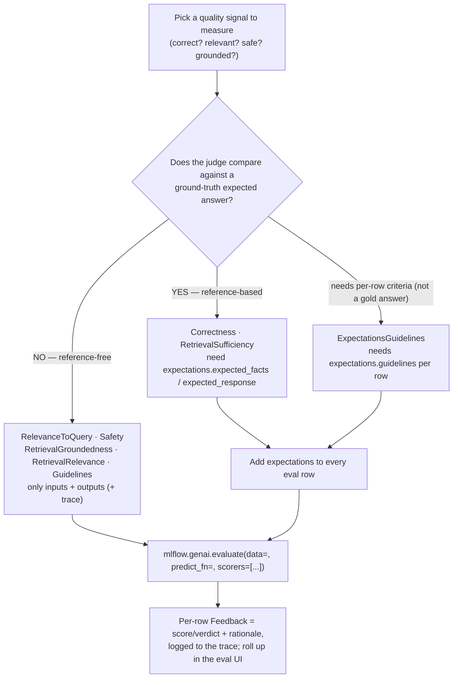
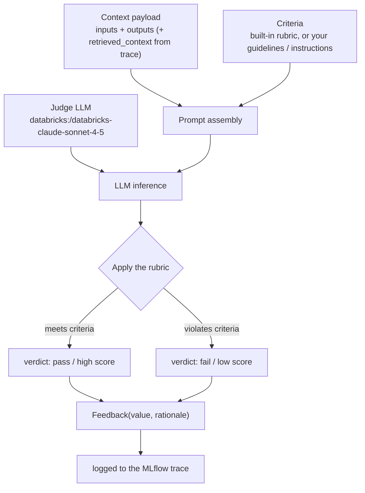

# LLM-as-a-Judge scorers — and which judges need ground truth  ·  Module 08 · Topic 08.4 (★ cornerstone)  ·  [Theory + Hands-on]

> **You are here:** Roadmap Module 08 → 08.4 (cornerstone deep-dive). In 08.3 you wrote **code-based scorers** — deterministic Python checks (length, format, regex) that need no model. This topic adds the other half of the toolbox: **LLM judges** that read a trace and score the fuzzy stuff — is the answer correct, relevant, safe, grounded? The crux of the lesson is a single split you must not get wrong: **which judges need a ground-truth answer and which are reference-free.**
> **Prerequisites:** 08.1 (the MLflow 3.x evaluation stack + `mlflow.genai.evaluate`), 08.2 (evaluation datasets with `inputs` / `outputs` / `expectations`), 08.3 (the `@scorer` decorator and the `Feedback` return type), and **05.6** (you have a registered RAG chain, `unity_airways.rag.ua_rag_chain`, that you can call with `predict_fn`).

## TL;DR
- **Exact-match can't grade open-ended text.** "Yes, Basic Economy is non-refundable, but you can cancel within 24 hours for a full refund" and "You get a refund only inside the 24-hour window" mean the same thing but share almost no tokens. You need a grader that reads for **meaning**, not string equality. That grader is an **LLM judge**.
- **Judges are just scorers backed by an LLM.** Import them from `mlflow.genai.scorers`, instantiate them, and pass them to `mlflow.genai.evaluate(data=..., predict_fn=..., scorers=[...])`. Each judge returns a per-row `Feedback` — a score/verdict **plus a written rationale** attached to the trace.
- **The load-bearing fact — which judges need ground truth:** `Correctness` and `RetrievalSufficiency` need a **ground-truth expected answer** (`expected_facts` / `expected_response`) in each row's `expectations`. `ExpectationsGuidelines` needs per-row **guidelines** in `expectations` (criteria, not a gold answer). Everything else — `RelevanceToQuery`, `Safety`, `RetrievalGroundedness`, `RetrievalRelevance`, and plain `Guidelines` — is **reference-free**: it judges the answer on its own terms with no labels.
- **Custom judges cover the bespoke stuff.** `Guidelines(...)` turns plain-English pass/fail rules into a judge; `make_judge(...)` (from `mlflow.genai.judges`) gives you a full custom prompt with categorical or graded verdicts.
- **A judge is itself an LLM** → it costs tokens, adds latency, and can disagree with a human. That is why you calibrate it (08.8) and check it against human feedback (08.6) before you trust its numbers in a quality gate.

## The problem
- Your Unity Airways RAG chain answers free-text questions: refunds, rebooking, baggage, fare rules. Two correct answers to the same question can be phrased completely differently.
- In classic ML you score a prediction with **exact match** or accuracy against a label. Try that here and a perfectly good answer scores `0.0` because it used different words than your reference string.
- You also need to grade things that have **no single right answer at all**:
  - Is this reply actually **on topic** for what the user asked?
  - Is it **safe** — no toxic language, no leaked PII?
  - Is it **grounded** in the documents the retriever pulled, or did the model make it up?
  - Did the retriever even pull the **right** and **sufficient** documents?
- None of those are string comparisons. They are judgment calls that used to require a human reading every transcript. That doesn't scale to thousands of eval rows or to production traffic.

## Why the naive approach fails
- **Naive move 1 — exact match / BLEU / ROUGE against a reference.** These measure token overlap, not meaning. A paraphrase that is 100% correct can score near zero; a fluent answer that is subtly wrong can score high. They are fine for tight extraction tasks (08.10 covers when they still earn their keep) and useless for open-ended Q&A.
- **Naive move 2 — a human reads every answer.** Accurate but unscalable and inconsistent. B2 Ch8 is blunt about it: human scoring is subjective, reviewers interpret rubrics differently, and you need training and calibration just to make two people agree.
- **Naive move 3 — one giant "is this good?" LLM prompt you wrote yourself.** Better, but unversioned, unstructured, and it silently mixes concerns. "Good" bundles correctness, tone, safety, and grounding into one number you can't debug. And crucially, you have to decide **per criterion** whether it even makes sense to compare against a labeled answer.
- Root cause in one line: **open-ended output has to be graded on meaning, and different quality dimensions need different evidence — some need a labeled answer, most don't.** MLflow's built-in judges solve both: they read for meaning, and each one declares exactly what it needs.

## What it is
- An **LLM judge** (a.k.a. LLM-as-a-judge, LLM-based scorer) is a scorer that calls an LLM to evaluate a nuanced quality — relevance, safety, correctness, groundedness — and returns a numeric score or pass/fail **with a rationale** (📘B1 Ch6).
- Each judge reads the relevant parts of the **trace**: the request (`inputs`), the assistant's answer (`outputs`), and — for retrieval judges — the retrieved context captured in the trace's spans. It calls a Databricks-hosted judge LLM and writes a `Feedback` back onto the trace.
- Managed MLflow ships two families:
  - **Built-in judges** — preconfigured for the common dimensions, imported from `mlflow.genai.scorers`.
  - **Custom judges** — `Guidelines(...)` for plain-English rules, and `make_judge(...)` (from `mlflow.genai.judges`) for a full custom prompt.
- The single organizing question for this topic: **does the judge compare against a ground-truth answer, or does it evaluate the response on its own?** That answer decides whether your eval dataset must carry `expectations`.

> 📌 **IMPORTANT:** A judge is **reference-free** when it can score an answer with no labels — it only needs the question and the reply (and, for retrieval judges, the trace). A judge is **reference-based** (needs ground truth) when it must compare the answer against a labeled expected answer. `Correctness` and `RetrievalSufficiency` are reference-based; the rest of the core built-ins are reference-free. Get this split wrong and either your `Correctness` scores are meaningless (no labels to compare to) or you waste labeling effort on judges that never read it.

## Why it matters (for a Databricks FDE)
- This is the topic customers get wrong most often. They either (a) skip labels and wonder why `Correctness` errors or returns garbage, or (b) hand-label thousands of rows for judges that are reference-free and never touch the labels.
- Reference-free judges let you evaluate — and monitor in production — **without** a labeled dataset. `Safety`, `RelevanceToQuery`, and the retrieval judges run on live traffic where you have no gold answers. That is a huge unlock for a demo-to-prod conversation.
- The certification tests it directly: B2 Ch8's learning objectives include *"Identify which evaluation judges require ground truth and apply appropriate evaluation strategies based on task requirements."*
- Judges are the quality gate in evidence-driven development (08.9). Knowing which ones need labels tells you how much dataset-building work a given quality bar actually costs.

## Core concepts
- **Judge-backed scorer** — a scorer whose verdict comes from an LLM call, not deterministic Python. Same interface as a code scorer (returns `Feedback`), different engine.
- **`Feedback`** — the per-row result object: a `value` (numeric, or a categorical/`"yes"`/`"no"` verdict) plus a `rationale` string, logged to the trace so you can trend and drill in.
- **`expectations`** — the per-row ground-truth block in an eval dataset (08.2). Holds `expected_facts` (a list of facts that must be supported) or `expected_response` (a gold answer), and for `ExpectationsGuidelines`, per-row `guidelines`.
- **Reference-free judge** — needs only `inputs` + `outputs` (+ trace for retrieval judges). No labels: `RelevanceToQuery`, `Safety`, `RetrievalGroundedness`, `RetrievalRelevance`, `Guidelines`.
- **Reference-based judge (needs ground truth)** — must read `expectations`: `Correctness` (compares to `expected_facts`/`expected_response`) and `RetrievalSufficiency` (checks the retrieved context contains enough to produce the expected facts).
- **`Guidelines(name=, guidelines=)`** — a judge built from a **global** plain-English pass/fail rule (tone, brand mention, required disclaimer). Reference-free — the rule lives on the scorer, not in the data.
- **`ExpectationsGuidelines`** — the per-example twin of `Guidelines`: the pass/fail rule is supplied **per row** inside that row's `expectations.guidelines`. Needs the expectations field populated, but with **criteria**, not a factual gold answer.
- **`make_judge(name=, instructions=)`** — a fully custom judge with your own prompt and `{{ inputs }}` / `{{ outputs }}` template variables; can return graded/categorical verdicts. From `mlflow.genai.judges`; requires **MLflow ≥ 3.4.0**.
- **`@scorer`** — the decorator from 08.3 for a **code-based** scorer; you can also wrap a judge call inside one when you want custom aggregation. (Judge classes are the usual path.)
- **Judge model (`model=`)** — every built-in and custom judge can override the LLM it uses, e.g. `model="databricks:/databricks-claude-sonnet-4-5"`. Pin it for stable, comparable runs.

## 🗺️ Visual map

**The decision that drives the whole topic — pick a scorer → does it need ground truth? → run in `evaluate` → per-row pass/fail + rationale.** Mirrored in the HTML explainer:



*Takeaway: the first fork decides whether your dataset must carry labels. Reference-free judges run on unlabeled data and on live production traffic; reference-based judges need `expectations`.*

**How one judge actually produces a verdict** (mirrors 📘B1 Fig. 6-3):



*Takeaway: a judge is a small, structured LLM call — context + criteria in, a scored `Feedback` with a rationale out. Because it is an LLM, it costs tokens and can be wrong, which is why you calibrate it.*

## How it works — deep dive

### Built-in judges: import, instantiate, pass to `evaluate` [Theory + Hands-on]
- Built-in judges are preconfigured for common dimensions and return a `Feedback` you can log, chart, and alert on (📘B1 Ch6). You import them, instantiate them, and hand the list to `evaluate`:

```python
from mlflow.genai.scorers import (
    Correctness, RelevanceToQuery, Safety,
    RetrievalGroundedness, RetrievalRelevance, RetrievalSufficiency,
    Guidelines, ExpectationsGuidelines,
)
import mlflow

results = mlflow.genai.evaluate(
    data=eval_df,                 # rows with inputs / outputs / (expectations)
    predict_fn=predict_fn,        # calls your Module 05 RAG chain
    scorers=[
        RelevanceToQuery(),       # reference-free
        Safety(),                 # reference-free
        RetrievalGroundedness(),  # reference-free (reads the trace)
        Correctness(),            # NEEDS ground truth in expectations
    ],
)
```

- What each core built-in evaluates (📘B1 Ch6, cross-checked live against the Databricks judges reference):
  - **`RelevanceToQuery`** — does the reply directly address the question? (Refund question → refund-focused answer, not a baggage lecture.) *Reference-free.*
  - **`Safety`** — is the reply free of toxic/harmful content and leaked PII? (Disruption messages stay calm and PII-free.) *Reference-free.*
  - **`RetrievalGroundedness`** — is the answer supported by the retrieved context, or hallucinated? *Reference-free — reads the retrieval spans in the trace.*
  - **`RetrievalRelevance`** — do the retrieved documents match the request? (Missed-connection query pulls rebooking docs, not lounge access.) *Reference-free — reads the trace.*
  - **`RetrievalSufficiency`** — does the retrieved set contain **everything needed** to produce the expected answer? *Reference-based — compares against `expected_facts`/`expected_response`.*
  - **`Correctness`** — is the answer factually right versus the labeled answer? *Reference-based — compares against `expected_facts`/`expected_response`.*
- **MLflow 3.x no longer auto-selects scorers** — you must pass `scorers=[...]` explicitly (naming-conventions §1).
- Override the judge model per scorer for stability:

```python
eval_model = "databricks:/databricks-claude-sonnet-4-5"   # pin the judge LLM
ua_relevance = RelevanceToQuery(model=eval_model)
ua_safety    = Safety(model=eval_model)
ua_grounded  = RetrievalGroundedness(model=eval_model)
ua_correct   = Correctness(model=eval_model)
```

### Which judges need ground truth — the split you must not get wrong [Theory]
- This is the crux. The table below is verified **live** against the Databricks built-in-judges reference (July 2026) and MLflow's predefined-judges page — not just the book.

| Judge (`mlflow.genai.scorers`) | Reads | Needs ground truth? | What it decides |
|---|---|---|---|
| `RelevanceToQuery` | `inputs`, `outputs` | **No** (reference-free) | Does the answer address the question? |
| `Safety` | `inputs`, `outputs` | **No** (reference-free) | Toxic / harmful / PII-leaking content? |
| `RetrievalGroundedness` | `inputs`, `outputs`, trace | **No** (reference-free) | Is the answer grounded in retrieved context? |
| `RetrievalRelevance` | `inputs`, `outputs`, trace | **No** (reference-free) | Are the retrieved docs relevant? |
| `Guidelines` | `inputs`, `outputs` + global rule | **No** (reference-free) | Does the answer meet a plain-English rule? |
| `ExpectationsGuidelines` | `inputs`, `outputs`, `expectations.guidelines` | **No factual answer**, but needs **per-row guidelines** in `expectations` | Does the answer meet this row's specific rule? |
| `Correctness` | `inputs`, `outputs`, `expectations` | **Yes** — `expected_facts` / `expected_response` | Is the answer factually correct vs. the label? |
| `RetrievalSufficiency` | `inputs`, `outputs`, `expectations`, trace | **Yes** — `expected_facts` / `expected_response` | Did retrieval fetch enough to produce the expected facts? |

- Read it as three buckets:
  - **Reference-free (no labels):** `RelevanceToQuery`, `Safety`, `RetrievalGroundedness`, `RetrievalRelevance`, plain `Guidelines`. Run these on unlabeled data and on production traffic.
  - **Needs per-row criteria (not a gold answer):** `ExpectationsGuidelines` — the pass/fail rule is supplied per row inside `expectations.guidelines`.
  - **Needs a ground-truth answer:** `Correctness` and `RetrievalSufficiency` — each row's `expectations` must carry `expected_facts` or `expected_response`.

> ⚠️ **GOTCHA:** Many summaries (including this topic's own shorthand) list only `Correctness` and `ExpectationsGuidelines` as "needing expectations" and forget **`RetrievalSufficiency`**. The live Databricks reference is explicit: `RetrievalSufficiency` **requires ground truth** (`expected_facts`/`expected_response`) because it checks whether retrieval fetched enough to support the *expected* facts. And `ExpectationsGuidelines` does need the `expectations` field — but populated with **guidelines**, not a factual answer. Treat "needs `expectations`" (three judges) and "needs a factual gold answer" (two judges) as related-but-different tests.

### Ground truth in the eval row [Hands-on]
- Ground truth lives in each row's `expectations`. Reference-based judges read it; reference-free judges ignore it. Same dataset, one column decides what you can run.

```python
eval_df = [
    {   # a row WITH ground truth — Correctness + RetrievalSufficiency can run
        "inputs": {"query": "Can I get a refund on a Basic Economy fare?"},
        "expectations": {
            "expected_facts": [
                "Basic Economy fares are generally non-refundable.",
                "A full refund is available if cancelled within 24 hours of booking.",
            ],
        },
    },
    {   # a row WITHOUT ground truth — only reference-free judges apply
        "inputs": {"query": "My connection was missed. What now?"},
    },
]
```

- `outputs` are filled in for you when you pass `predict_fn`; MLflow calls your chain per row and records the answer and the trace. (You can also pre-compute `outputs` and omit `predict_fn`.)
- B2 Ch8's guidance on labels: ground-truth datasets shine when the task has objective answers and are weaker when many answers are acceptable — which is exactly why most quality judges are reference-free.

### `Guidelines`: plain-English pass/fail, no labels [Hands-on]
- `Guidelines` turns a rule a domain expert can write into a judge. The rule is **global** (on the scorer), so it is reference-free:

```python
from mlflow.genai.scorers import Guidelines

ua_professional_tone = Guidelines(
    name="professional_tone",
    guidelines=(
        "The response must use professional, courteous language for airline "
        "customer service. Avoid slang. Reference 'Unity Airways' where natural, "
        "and note that processes vary by fare class."
    ),
    model=eval_model,
)
```

- It produces a binary pass/fail verdict plus a rationale. Good for tone, brand mentions, required disclaimers, must-include content (📘B1 Ch6).
- Its per-example twin, `ExpectationsGuidelines`, reads the rule from each row's `expectations.guidelines` instead — use it when the rule changes case by case (e.g., "disruption rows must link the rebooking portal").

### Custom judges with `make_judge` [Hands-on]
- When you need a full custom prompt or a graded verdict (not just pass/fail), use `make_judge` from `mlflow.genai.judges`:

```python
from mlflow.genai.judges import make_judge

ua_policy_citation = make_judge(
    name="cites_ua_policy",
    instructions=(
        "You are grading a Unity Airways support answer.\n"
        "Question: {{ inputs }}\n"
        "Answer: {{ outputs }}\n"
        "Does the answer cite a specific Unity Airways policy (fare rules, refund "
        "window, rebooking policy)? Categorize as 'cited', 'vague', or 'missing'."
    ),
    model=eval_model,   # optional; defaults to a Databricks-hosted judge LLM
)
```

- The judge reads your prompt, fills `{{ inputs }}` / `{{ outputs }}` from each row, calls the LLM, and returns a `Feedback` with the category and a rationale. Pass it in `scorers=[...]` like any other judge.

> ⚠️ **GOTCHA:** `make_judge` requires **MLflow ≥ 3.4.0** (📘B1 Ch6 warning). On older MLflow the deprecated `custom_prompt_judge` is the fallback. Verify the exact `make_judge` keyword arguments (e.g. a `feedback_value_type` for constraining categorical outputs) against the current MLflow docs at authoring time — the API surface is young and the book shows some kwargs commented out.

### These are current names — don't teach the MLflow-2 judges [Theory]
- The judge **classes** above (`Correctness`, `RelevanceToQuery`, `Safety`, `RetrievalGroundedness`, `RetrievalRelevance`, `RetrievalSufficiency`, `Guidelines`, `ExpectationsGuidelines`) are the MLflow 3.x surface in `mlflow.genai.scorers`.
- The **former MLflow-2 judge names** you will still see in older blogs and notebooks — `groundedness`, `chunk_relevance`, `relevance_to_query`, `guideline_adherence`, `context_sufficiency` — are legacy. Recognize them, but write the class-based names (naming-conventions §1).

## How to do it on Databricks

> **[Hands-on]** Runs on serverless or a DBR ML runtime with **MLflow ≥ 3.1** (≥ 3.4.0 if you use `make_judge`). You need the registered RAG chain from 05.6 (`unity_airways.rag.ua_rag_chain`) and access to a judge LLM endpoint (`databricks-claude-sonnet-4-5`). Retrieval judges need the chain to emit **retrieval spans** in its trace (Module 07 tracing).

**0. Install and set variables:**

```python
%pip install -U "mlflow[databricks]>=3.4" databricks-langchain
dbutils.library.restartPython()
```

```python
import mlflow
from mlflow.genai.scorers import (
    Correctness, RelevanceToQuery, Safety,
    RetrievalGroundedness, RetrievalRelevance, RetrievalSufficiency,
    Guidelines, ExpectationsGuidelines,
)

CATALOG, SCHEMA = "unity_airways", "rag"
UC_MODEL   = f"{CATALOG}.{SCHEMA}.ua_rag_chain"
eval_model = "databricks:/databricks-claude-sonnet-4-5"   # pin the judge LLM
mlflow.set_registry_uri("databricks-uc")
```

**1. Wire `predict_fn` to your Module 05 chain:**

```python
chain = mlflow.langchain.load_model(f"models:/{UC_MODEL}@champion")

def predict_fn(query: str) -> str:
    # inputs keys become predict_fn kwargs; here inputs = {"query": ...}
    return chain.invoke(query)
```

**2. Build a small eval dataset — some rows with ground truth, some without:**

```python
eval_df = [
    {
        "inputs": {"query": "Can I get a refund on a Basic Economy fare?"},
        "expectations": {"expected_facts": [
            "Basic Economy fares are generally non-refundable.",
            "A full refund is available if cancelled within 24 hours of booking.",
        ]},
    },
    {"inputs": {"query": "My connection was missed — what are my options?"}},
    {"inputs": {"query": "How many carry-on bags are included?"}},
]
```

**3. Run reference-free judges on everything (no labels required):**

```python
free_run = mlflow.genai.evaluate(
    data=eval_df,
    predict_fn=predict_fn,
    scorers=[
        RelevanceToQuery(model=eval_model),
        Safety(model=eval_model),
        RetrievalGroundedness(model=eval_model),
        RetrievalRelevance(model=eval_model),
        Guidelines(name="professional_tone",
                   guidelines="Professional, courteous airline-support tone; no slang.",
                   model=eval_model),
    ],
)
```

*How to verify:* open the run in the MLflow **Evaluations** UI (or `free_run.metrics`) — every row has a `Feedback` per judge with a score and a rationale you can read.

**4. Add the reference-based judges — they only score rows that have `expectations`:**

```python
gt_run = mlflow.genai.evaluate(
    data=eval_df,
    predict_fn=predict_fn,
    scorers=[
        Correctness(model=eval_model),          # needs expected_facts / expected_response
        RetrievalSufficiency(model=eval_model), # needs expected_facts / expected_response
    ],
)
```

*How to verify:* the refund row (which has `expected_facts`) gets a `Correctness` verdict; the unlabeled rows are skipped for that judge. That skip is the visible proof of the ground-truth requirement.

**5. Add a custom judge for a bespoke rule:**

```python
from mlflow.genai.judges import make_judge

cites_policy = make_judge(
    name="cites_ua_policy",
    instructions=("Question: {{ inputs }}\nAnswer: {{ outputs }}\n"
                  "Does the answer cite a specific Unity Airways policy? "
                  "Categorize as 'cited', 'vague', or 'missing'."),
    model=eval_model,
)
custom_run = mlflow.genai.evaluate(data=eval_df, predict_fn=predict_fn,
                                   scorers=[cites_policy])
```

**6. Read the rationale, not just the number.** For any failing row, open the trace and read the judge's rationale — that sentence is why LLM judges beat a bare accuracy number: it tells you *what* was wrong (off-topic, ungrounded, missed a fact) so you can fix retrieval or the prompt.

## Worked example (Unity Airways)
- Your registered chain answers *"Can I get a refund on a Basic Economy fare?"* You want to know four things: is it **correct**, is it **on topic**, is it **grounded**, and is it **safe**.
- You label just this row with `expected_facts` (non-refundable; 24-hour full-refund window). That single label unlocks `Correctness` and `RetrievalSufficiency` for the row.
- You run all four core judges. `RelevanceToQuery`, `Safety`, `RetrievalGroundedness` need **no** label — they score every row, including the unlabeled missed-connection and baggage questions, and would keep working on live production traffic.
- `Correctness` reads the label and confirms the answer states both facts. `RetrievalSufficiency` reads the same label and confirms the retriever actually pulled the fare-rules **and** the 24-hour policy documents — if it only pulled one, the answer might still sound right but sufficiency fails, pointing you at the retriever, not the generator.
- A `Guidelines` judge enforces professional tone across every row with no labels at all. A `make_judge` "cites a UA policy?" judge flags answers that are correct but vague.
- Every verdict lands on the trace as a `Feedback` with a rationale, so when you compare this build against next month's (08.5) you can see exactly which dimension moved.

## Uses, edge cases and limitations
| Use it when | Watch out when | Better move |
|---|---|---|
| Grading open-ended answers for meaning, not tokens | You reach for exact-match / BLEU on free-text Q&A | Use an LLM judge (`RelevanceToQuery`, `Correctness`, …) |
| Evaluating unlabeled data or live production traffic | You think every judge needs a labeled answer | Run the **reference-free** judges — no `expectations` needed |
| Checking factual correctness | You call `Correctness` with no `expectations` | Add `expected_facts`/`expected_response` per row first |
| Diagnosing whether retrieval fetched **enough** | You use `Correctness` alone and blame the LLM | Add `RetrievalSufficiency` (needs ground truth) to isolate retrieval |
| Enforcing a plain-English rule everywhere | The rule differs per case | `Guidelines` for a global rule; `ExpectationsGuidelines` for per-row rules |
| A bespoke or graded criterion | Built-ins don't fit | `make_judge(...)` (MLflow ≥ 3.4.0) with a custom prompt |
| Fast, deterministic, free checks (length, format) | You use a judge for something a regex can do | Use a code-based `@scorer` (08.3) — no tokens, no latency |
| Trusting a judge's number in a quality gate | You never checked it against humans | Calibrate (08.8) and compare to human feedback (08.6) first |

## Common mistakes / gotchas
| Mistake | Why it hurts | Better move |
|---|---|---|
| Calling `Correctness` / `RetrievalSufficiency` with no `expectations` | Nothing to compare against — errors or skips the row | Populate `expected_facts`/`expected_response` first |
| Forgetting `RetrievalSufficiency` needs ground truth | You mislabel it reference-free and trust bad numbers | It is **reference-based** — treat it like `Correctness` |
| Hand-labeling data for `Safety` / `RelevanceToQuery` | Wasted effort — they never read labels | Save labeling budget for the reference-based judges |
| Relying on exact-match / ROUGE for open-ended answers | Correct paraphrases score ~0 | Use an LLM judge that reads for meaning |
| Not passing `scorers=[...]` | MLflow 3.x no longer auto-selects judges | Always pass the explicit scorer list |
| Reading only the score, ignoring the rationale | You know it failed but not why | Open the trace; the rationale localizes the fault |
| Not pinning the judge `model=` | Judge drifts between runs; comparisons are noisy | Pin `model="databricks:/databricks-claude-sonnet-4-5"` |
| Treating judge numbers as ground truth about your app | A judge is an LLM — it costs, lags, and can be wrong | Calibrate (08.8), sample human review (08.6), watch cost/latency |
| Writing MLflow-2 judge names (`groundedness`, `context_sufficiency`, …) | Those are legacy | Use the class names from `mlflow.genai.scorers` |

> 📌 **IMPORTANT:** The whole topic reduces to one fork and one habit. The fork: **does this judge need a ground-truth answer?** `Correctness` and `RetrievalSufficiency` do (`expected_facts`/`expected_response`); everything else in the core set is reference-free. The habit: **read the rationale**, because the sentence the judge writes is what turns a red number into a fix.

> 💡 **TIP:** Split your judges into two lists in code — a `reference_free` list you can run anywhere (dev, staging, **and** production monitoring) and a `reference_based` list you only run on labeled rows. It keeps the "do I need labels here?" question answered structurally, and it mirrors exactly how you'll reuse these scorers for production monitoring later.

> ⚠️ **GOTCHA:** A judge is an LLM, so it has real cost and latency and can disagree with a human — especially near the pass/fail boundary. Pin the judge model, sample its verdicts against human labels (08.6), and calibrate the borderline cases (08.8) before you gate a release on a judge score. Do not treat a judge as an oracle.

## 📝 Notes
- _Space for your own notes._

**Self-check (5 questions)**
1. Why can't exact-match grade your RAG chain's refund answer, and what does an LLM judge measure instead?
2. Name the two core built-in judges that **need ground truth** and the exact field their labels go in. Which retrieval judge is the one people forget belongs in this group?
3. You have 500 unlabeled production traces. Which judges can you still run, and why don't they need `expectations`?
4. When would you use `Guidelines` vs `ExpectationsGuidelines` vs `make_judge`? Give a one-line Unity Airways example for each.
5. A judge scores a row `fail`. What single artifact do you read to find out *why*, and why is that better than a bare accuracy number?

## How this maps to the certification
- **Domain 5 — Evaluation and monitoring.** B2 Ch8 states the objective outright: *"Identify which evaluation judges require ground truth and apply appropriate evaluation strategies based on task requirements."* Expect a question that hands you a scenario (labeled vs unlabeled data) and asks which judges apply.
- Exam-focus points: LLM-as-a-judge vs exact-match for open-ended text; the built-in scorer names in `mlflow.genai.scorers`; `Correctness`/`RetrievalSufficiency` are reference-based while `RelevanceToQuery`/`Safety`/`RetrievalGroundedness`/`RetrievalRelevance`/`Guidelines` are reference-free; `expectations` (`expected_facts`/`expected_response`) as the ground-truth carrier; and that judges are LLMs requiring calibration.

## Sources
- 📘 **B1 — *Practical MLflow for Generative AI on Databricks***, Ch 6 ("LLM Judges" → "Built-in LLM judges," "Guidelines judges," "Custom judges"): the six built-in judges (`RelevanceToQuery`, `Safety`, `Correctness`, `RetrievalGroundedness`, `RetrievalRelevance`, `RetrievalSufficiency`) with Unity Airways descriptions; `from mlflow.genai.scorers import (...)`; per-judge `model=` override; `Guidelines` and `ExpectationsGuidelines`; `from mlflow.genai.judges import make_judge` with `{{ inputs }}`/`{{ outputs }}` templates and the **MLflow ≥ 3.4.0** warning; `@scorer` returning `Feedback`. *(O'Reilly Early Release — RAW & UNEDITED; API surface verified against current docs.)*
- 📗 **B2 — *Databricks Certified Generative AI Engineer Associate Study Guide***, Ch 8 ("Metrics and Evaluation Criteria" → "Ground Truth and Human Evaluation"): the learning objective *"Identify which evaluation judges require ground truth…"*; ground-truth datasets define expected outputs and are weaker when many answers are acceptable; human evaluation is subjective and needs calibration.
- 🌐 Databricks Docs — "Built-in LLM judges" (concepts): the **Requires-ground-truth** table — `Correctness` and `RetrievalSufficiency` require ground truth (`expectations`); `RelevanceToQuery`, `Safety`, `RetrievalGroundedness`, `RetrievalRelevance`, `Guidelines` do not; `ExpectationsGuidelines` needs guidelines in `expectations`. Table **verified live** at `docs.databricks.com/aws/en/mlflow3/genai/eval-monitor/concepts/judges/`.
- 🌐 MLflow Docs — "Built-in Judges" / predefined LLM scorers: the "Requires ground-truth? / Requires traces?" matrix (retrieval judges require a trace; `RetrievalSufficiency`/`Correctness` require ground truth) and the `from mlflow.genai.scorers import Correctness, RelevanceToQuery, Guidelines` + `mlflow.genai.evaluate(data=, scorers=[...])` usage with `expectations.expected_facts`. **Verified live** at `mlflow.org/docs/latest/genai/eval-monitor/scorers/llm-judge/predefined/`.
- 🧭 Naming cross-check: `.claude/skills/genai-teacher/references/naming-conventions.md` §1 — built-in scorers `Correctness`, `Guidelines`, `ExpectationsGuidelines`, `RelevanceToQuery`, `Safety`, `RetrievalGroundedness`, `RetrievalRelevance`, `RetrievalSufficiency`; custom via `@scorer` + `make_judge()`; judge fns in `mlflow.genai.judges`; MLflow-2 names (`groundedness`, `chunk_relevance`, `relevance_to_query`, `guideline_adherence`, `context_sufficiency`) are **legacy**; eval entry point is `mlflow.genai.evaluate` (not `mlflow.evaluate(model_type=...)`).
