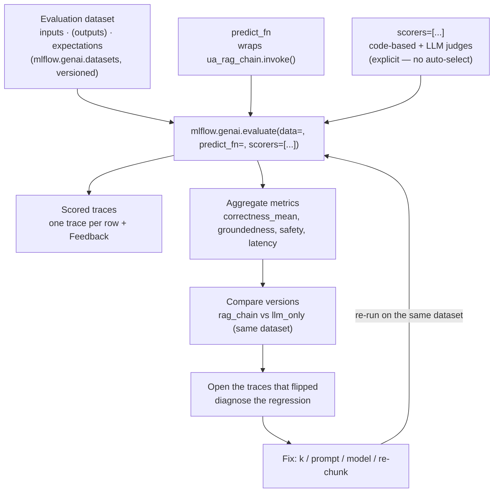
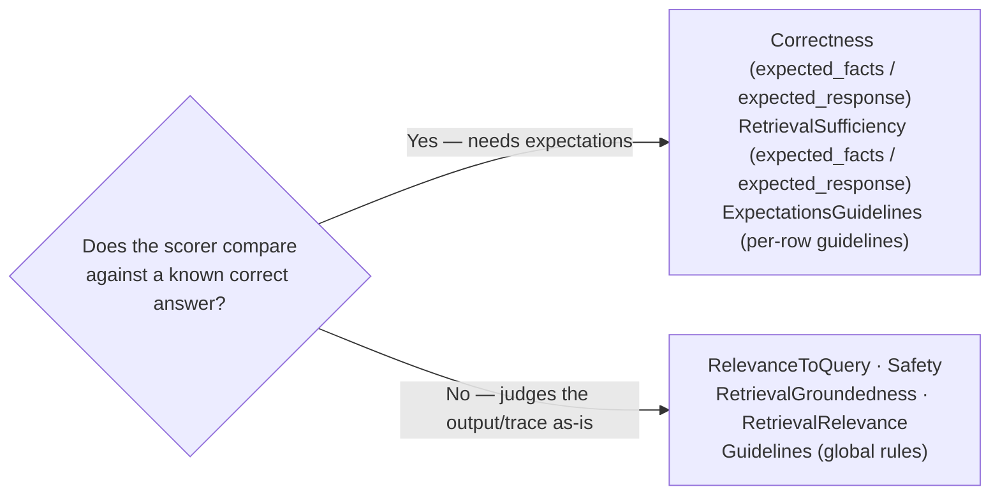

# Evaluating GenAI Applications  ·  Module 08  ·  Topics 08.1–08.10  ·  [Theory + Hands-on]

> **You are here:** Roadmap Module 08 → Evaluating GenAI applications (all topics 08.1–08.10). This is where a GenAI app *earns the right to be deployed* — you replace "looks good to me" with evidence.
> **Prerequisites:** **Module 05** (the RAG chain we score — `unity_airways.rag.ua_rag_chain`), **Module 06** (Experiments, Runs, and the **LoggedModel** version that results attach to), and **Module 07** (Traces — scorers read retrieved context straight from them). Next stops: **Module 09–10** (agents you also evaluate with the same harness) and **Module 13 — production monitoring** (the *same* scorers, watching live traffic).

This page is the **module hub**. It carries one numbered entry per topic (08.1–08.10). Two topics are cornerstones (★) with their own deep-dive pages:
- **08.1 ★ — The MLflow 3.x evaluation stack and the Evaluation Harness** → `eval-harness.md` / `eval-harness.html`
- **08.4 ★ — LLM-as-a-Judge scorers; which judges need ground truth** → `llm-as-judge.md` / `llm-as-judge.html`

Everything below scores one running artifact: the **Unity Airways** RAG chain that Module 05 registered as **`unity_airways.rag.ua_rag_chain`** (`CATALOG="unity_airways"`, `SCHEMA="rag"`). We build a small dataset of Unity Airways Q&A, run **`mlflow.genai.evaluate(...)`**, and compare the `rag_chain` LoggedModel against the `llm_only` baseline from Module 06. The Module 07 traces feed the scorers; the results link back to the LoggedModel version.

> 📌 **The one rule that shapes this module — in MLflow 3.x you name the scorers, the harness never guesses.**
> The single most common mistake carried over from the book era is calling the old `mlflow.evaluate(model_type="databricks-agent")`. That is gone. The MLflow 3 GenAI surface is:
> - **Entry point:** `mlflow.genai.evaluate(data=, predict_fn=, scorers=[...])`. You **must** pass `scorers=[...]` explicitly — 3.x no longer auto-selects a metric bundle. There is **no** `agents.evaluate()`.
> - **Scorers** live in `mlflow.genai.scorers`; **judge functions** in `mlflow.genai.judges`; you build custom ones with the **`@scorer`** decorator or **`make_judge()`**.
> - **Dataset fields** are `inputs` / `outputs` / `expectations`. `expectations` is the ground-truth column, and only *some* scorers need it (08.4).
> - It scores the **trace**, not just the final string — so retrieval scorers can read the RETRIEVER span from Module 07. Needs **MLflow ≥ 3.1** (custom `make_judge` needs **≥ 3.4**).

---

## TL;DR
- **Evaluation** turns "the bot seems fine" into a number you can defend. For GenAI it is multi-dimensional — grounded, useful, safe, on-policy, fast, cheap — not one accuracy score.
- The MLflow 3.x stack has **four building blocks**: **datasets** (versioned `inputs`/`outputs`/`expectations`), **scorers** (code-based + LLM judges), **evaluation runs** (bind one dataset + one candidate + one scorer set), and **feedback** (assessments attached to traces). The **Evaluation Harness** is the machinery that ties them together (08.1 ★).
- You run everything through **`mlflow.genai.evaluate(data=, predict_fn=, scorers=[...])`**. Two modes: **direct** (harness calls your app via `predict_fn`) and **answer-sheet** (you pass precomputed outputs or existing traces).
- **Scorers** come in two kinds: **code-based** (`@scorer` → `Feedback`, deterministic, free, run every request) and **LLM judges** (`RelevanceToQuery`, `Safety`, `Correctness`, `RetrievalGroundedness`, …) for meaning and nuance (08.4 ★). Some judges need ground-truth `expectations`; many do not.
- **Compare** two versions on the *same* dataset (`rag_chain` vs `llm_only`), read the aggregate metrics, then open the **traces that flipped** to diagnose *why* (08.5). Close the loop with human feedback (08.6) and calibration against human labels (08.8). Traditional text metrics — BLEU, ROUGE, perplexity, exact-match — have a narrow place (08.10).

## The problem
- A Unity Airways passenger asks *"My flight UA217 was delayed in Tokyo — am I eligible for a refund?"* You change the retrieval `k`, or swap the model, or tighten the prompt. **Did the app get better or worse?**
- For classical ML a single held-out metric (AUC, RMSE) settles it. For GenAI the answer is multi-dimensional: was the reply **grounded** in the retrieved policy, **relevant** to the actual question, **safe**, **on-brand**, and did it stay **within cost and latency**? (📘B1 Ch6).
- Worse, the failure modes hide from the final string. "The model hallucinated a fee waiver" and "retrieval fed it the wrong policy chunk" produce similar-looking wrong answers. You cannot promote a change on vibes.
- Module 05 *built* the chain, Module 07 made it *observable*; Module 08 makes every change **decidable** — promote or discard, backed by evidence tied to a specific version.

## Why the naive approach fails
- **"Eyeball a few answers."** Does not scale, is not reproducible, and quietly drifts as the reviewer's mood changes. Two people disagree and there is no record to point to.
- **"Use one accuracy number."** GenAI quality is not one number. A change can lift relevance while dropping groundedness; a single score hides the trade-off (📘B1 Ch6; 📗B2 — RAG evaluation).
- **"Reuse `mlflow.evaluate(model_type=\"databricks-agent\")`."** That MLflow-2 "Agent Evaluation" path is superseded. The MLflow 3 entry point is `mlflow.genai.evaluate(...)`, and it will **not** silently pick metrics for you — pass `scorers=[...]` (cheat-sheet §1; §9).
- **"Score the text string."** Retrieval quality, groundedness, latency, and cost all live in the **trace**, not the string. MLflow 3.x scores the trace so a groundedness scorer can read the exact retrieved chunks (📘B1 Ch6, *Evaluate the trace, not just the text*).
- **"Grade with an LLM judge and trust it blindly."** A judge is itself a model with opinions. Uncalibrated, it over- or under-scores. You must align it with a small set of human labels before you rely on it (08.8; 📘B1 Ch2).

## What it is
- **Plain-language definition:** GenAI evaluation is a repeatable system that runs your app (or replays saved outputs) over a curated dataset, applies a fixed set of **scorers**, and logs per-row scores plus aggregate metrics with full lineage back to the dataset, the traces, and the app version.
- **Mental model:** think of a school exam. The **dataset** is the question paper (with an answer key for some questions — `expectations`). The **scorers** are the graders (some are strict rubrics/code, some are experienced human-like judges). The **evaluation run** is one sitting of the exam by one candidate version. **Feedback** is the margin notes real users and experts add later.
- **Where it sits:** the Develop → **Evaluate** → Deploy → Monitor → Improve loop (📘B1 Ch2). The same scorers you write here run again in production monitoring (Module 13) — you build the instrument once.

## Why it matters (for a Databricks FDE)
- This is the layer that lets a customer **ship changes with confidence** instead of fear. "We tightened retrieval and groundedness went from 0.71 to 0.89 on the refund slice, with latency flat" is a sentence that wins a promotion review.
- Every scorer you register is reused **offline and online** — the checks that gate a release are the exact ones monitoring alerts on. That alignment (no metric drift between dev and prod) is a Databricks selling point you should be able to demo.
- It maps to **exam Domain 7 — Monitoring and evaluation** (📗B2) and the "Evaluate" phase of the lifecycle (📘B1 Ch2, Ch6 primary).

## Core concepts
- **Evaluation Harness** — the MLflow machinery that supplies inputs, invokes the app, runs the scorers, and logs results with lineage. One harness runs in a notebook or a production job. See 08.1 ★.
- **Evaluation dataset** — a versioned table of examples with `inputs`, optional `outputs`, and optional `expectations` (ground truth). UC-backed via `mlflow.genai.datasets`. See 08.2.
- **Scorer** — a function that turns a raw prediction into a measurable `Feedback` (value + rationale). Two kinds: **code-based** (08.3) and **LLM judges** (08.4 ★).
- **Ground truth (`expectations`)** — the answer key: `expected_facts`, `expected_response`, `guidelines`, `expected_retrieved_context`. Only some scorers need it. See 08.4.
- **Evaluation run** — one execution binding a dataset version + a candidate build + a scorer set; logs traces, feedback, aggregate metrics, and metadata. See 08.5.
- **Direct vs answer-sheet mode** — `predict_fn` (call the live app) vs precomputed outputs / existing traces. See 08.1, 08.5.
- **Feedback / Assessment** — human or automated judgment attached to a trace; `Feedback` (what the app produced) and `Expectations` (what correct looks like). See 08.6.
- **Calibration** — aligning a judge's thresholds with human labels so scores are trustworthy. See 08.8.
- **Minimum Evaluable Product (MEP)** — the smallest useful *and* measurable slice: one representative journey plus the scorers to judge future changes against it. See 08.9.
- **Traditional NLG metrics** — BLEU, ROUGE, BERTScore, perplexity, exact-match: cheap, reference-based, and blind to grounding. See 08.10.

## 🗺️ Visual map

**The evaluation loop — a dataset plus the app run through the harness, out come per-row scores and an aggregate you compare across versions, then you fix and re-run:**



*Takeaway: you change one variable, re-run against a fixed dataset, and let the aggregate point you to the rows that moved. The traces explain the why.*

**Which scorers need the answer key — the ground-truth decision (08.4):**



*Takeaway: reference-free judges (relevance, safety, groundedness) run on any row; reference-based judges (correctness) need an `expectations` answer key, so building ground truth is worth the effort for the rows that matter most.*

---

## 08.1 ★ The MLflow 3.x evaluation stack and the Evaluation Harness  ·  [Theory]

> **Cornerstone.** Full deep-dive — the four building blocks, the harness internals, direct vs answer-sheet modes, `predict_fn`/`to_predict_fn`, and the "evaluate the trace, not the text" principle — lives in `eval-harness.md` / `eval-harness.html`. Summary here.

MLflow 3.x turns evaluation into a **governed workflow** built from four building blocks that "work together as a continuous system" (📘B1 Ch6):

| Building block | What it is | API home |
|---|---|---|
| **Datasets** | Versioned tables of examples (`inputs` / `outputs` / `expectations`) that mirror real traffic | `mlflow.genai.datasets` |
| **Scorers** | Functions that turn a prediction into a measurable metric — code-based **and** LLM judges, combinable in one run | `mlflow.genai.scorers`, `mlflow.genai.judges` |
| **Evaluation runs** | One execution binding a dataset + candidate build + scorer set; tracked with full lineage | `mlflow.genai.evaluate()` |
| **Feedback** | Quality assessments (automated or human) stored on the trace so evidence stays linked | `mlflow.log_feedback`, labeling |

The **Evaluation Harness** is the standardized framework that automates supplying inputs, invoking the app, and computing metrics — "eliminating the need for manual, case-by-case checks" (📘B1 Ch6). Because it integrates with tracking and model management, the *same* logic runs across dev, staging, and production.

You call it one way:

```python
import mlflow

eval_results = mlflow.genai.evaluate(
    data=eval_dataset,             # inputs / outputs / expectations
    predict_fn=rag_chain_predict_fn,  # direct mode: harness invokes the app
    scorers=unity_airways_scorers,    # REQUIRED — you name them; no auto-select
)
```

- **Direct mode** — pass a `predict_fn()` (wrap the app) or `to_predict_fn()` (wrap a Model Serving endpoint). The harness runs the app *and* the scorers concurrently, recording fresh traces + feedback.
- **Answer-sheet mode** — pass precomputed `outputs` or existing `Trace` objects; the harness only runs the scorers. Good for regression testing and promotion decisions on curated production traces.

> 📌 **IMPORTANT:** MLflow 3.x scores the **trace**, not a standalone string. Groundedness and retrieval relevance need the retrieved context; safety and guidelines use the response plus metadata; latency and cost come from span timings and tokens. In direct mode MLflow creates a fresh trace via `predict_fn`; in answer-sheet mode you supply existing traces (📘B1 Ch6).

> ⚠️ **GOTCHA:** Do **not** reach for `mlflow.evaluate(model_type="databricks-agent")` or an imagined `agents.evaluate()`. Neither is the MLflow 3 path. The entry point is `mlflow.genai.evaluate(...)` with an explicit `scorers=[...]` (cheat-sheet §1, §9).

---

## 08.2 Building and managing evaluation datasets  ·  [Theory + Hands-on]

A strong evaluation begins with a dataset you can trust — "a continuously evolving reflection of what users actually ask," not a benchmark frozen in time (📘B1 Ch6). Build it from **three sources**:

1. **Production/development traces** — real queries captured by Module 07 tracing; anchors evaluation in reality.
2. **Expert-labeled cases** — canonical answers and disclosures from a policy owner (the gold standard for correctness/groundedness).
3. **Curated edge cases** — hand-written stressors: ambiguous "Can I change it?", multi-part requests, conflicting documents, tool timeouts.

**The dataset schema** (📘B1 Ch6, Table 6-1):

| Column | Required | Purpose | Example |
|---|---|---|---|
| `inputs` | Yes | What the app receives | `{"question": "My flight UA217 was delayed in Tokyo. Am I eligible for a refund?"}` |
| `outputs` | Only for answer-sheet mode | Precomputed app response | `{"response": "Lite tickets cannot be changed after 24 hours. See Fare Rules §3.1."}` |
| `expectations` | Optional | Ground-truth answer key (reserved keys below) | `{"expected_facts": ["Refund depends on fare type", "Waiver WX-2025 applies only to the affected segment"]}` |

**Reserved `expectations` keys** consumed by built-in scorers (📘B1 Ch6, Table 6-4):

| Key | Used by | Meaning |
|---|---|---|
| `expected_facts` | `Correctness` judge | Facts that should appear |
| `expected_response` | `Correctness` judge | Exact/similar expected answer |
| `guidelines` | `Guidelines` / `ExpectationsGuidelines` judge | Natural-language rules to follow |
| `expected_retrieved_context` | retrieval/document-recall scorer | Documents that should be retrieved |

**Hands-on — create and version a UC-backed dataset** with the `mlflow.genai.datasets` SDK:

```python
from mlflow.genai.datasets import create_dataset, get_dataset, delete_dataset

CATALOG, SCHEMA = "unity_airways", "rag"

# Create a versioned, UC-governed dataset (replaces ad-hoc CSVs)
eval_dataset = create_dataset(name=f"{CATALOG}.{SCHEMA}.eval_dataset")

# Append rows; every change auto-creates a new dataset version with lineage
eval_dataset = eval_dataset.merge_records([
    {"inputs": {"question": "My flight UA217 was delayed in Tokyo. Am I eligible for a refund?"},
     "expectations": {"expected_facts": ["Refund depends on fare type",
                                         "Waiver WX-2025 applies only to the affected segment"]}},
    {"inputs": {"question": "Can I change a Lite fare booked yesterday to next Friday?"},
     "expectations": {"guidelines": "Cite Fare Rules §3.1; state no change allowed for Lite."}},
])
```

**How to verify it worked:** `get_dataset(name=f"{CATALOG}.{SCHEMA}.eval_dataset")` returns the dataset and its version; the table appears in Unity Catalog with lineage to the experiment.

> 💡 **TIP:** Keep the seed set **small on purpose** — it should be cheap to run frequently so it catches regressions early (📘B1 Ch2). Grow it as feedback arrives; retire cases that no longer reflect current policy.

> ⚠️ **GOTCHA:** The evaluation-dataset SDK has limits (📘B1 Ch6): **max 2,000 records** per dataset, **≤ 20 expectation fields** per entry, and no Customer-Managed Encryption Keys yet. For long-term reproducibility, prefer archiving over hard-deleting — a hard purge leaves the lineage reference on the run but you can no longer resolve it back to the table. *(Exact current limits: live re-check pending.)*

---

## 08.3 Scorers — code-based scorers  ·  [Hands-on]

A **scorer** turns a raw prediction into a measurable metric: "A response is just text until a scorer says 'this is relevant,' 'that is unsafe,' or 'please add the phone number'" (📘B1 Ch6). **Code-based scorers** are lightweight Python functions decorated with `@scorer` that return a `Feedback` value — deterministic, no token cost, reproducible, ideal for continuous checks and regression tests.

```python
from mlflow.genai.scorers import scorer
from mlflow.entities import Feedback

@scorer(name="response_length")
def ua_response_length_scorer(outputs) -> Feedback:
    response = outputs if isinstance(outputs, str) else outputs.get("response", "")
    word_count = len(str(response).split())
    if word_count < 5:
        return Feedback(value=0.0, rationale=f"Response too short ({word_count} words)")
    elif word_count > 120:
        return Feedback(value=0.5, rationale=f"Response quite long ({word_count} words)")
    return Feedback(value=1.0, rationale=f"Appropriate length ({word_count} words)")
```

**What good code-based scorers check:** schema/structure validity, exact match, presence of a phone number or date, flight-code format, and business rules such as price limits or refund eligibility. Each returns a **value + rationale** that shows up in the MLflow UI.

**Design principles** (📘B1 Ch6):
- **Single point of truth** — one scorer measures one thing (`contact_info_present`, not "tone + contacts + length").
- **Stable interface** — deterministic; normalize text first (treat `1-800-UNITY-AIR` and `1800 Unity Air` alike); parse dates rather than string-match.
- **Interpretable scale** — map to 0.0–1.0 with a documented meaning ("0.9 = production-ready for this dimension").
- **Deterministic first, judgment second** — if code can check it, use code. Save LLM judges for what truly needs interpretation. "A regex should not be replaced by an LLM to find a phone number."

**How to verify it worked:** feed a known-short and known-long string; confirm the `value` and `rationale` match, then confirm the metric appears per-row in the evaluation run.

> 💡 **TIP:** Code-based scorers can also report **operational** signals — read span timings/tokens from the trace and emit a normalized latency or cost value that feeds SLO dashboards (📘B1 Ch6).

---

## 08.4 ★ LLM-as-a-Judge scorers; which judges need ground truth  ·  [Theory + Hands-on]

> **Cornerstone.** Full deep-dive — built-in judges, `Guidelines` vs `ExpectationsGuidelines`, custom judges with `make_judge()`, model pinning, and the ground-truth decision — lives in `llm-as-judge.md` / `llm-as-judge.html`. Summary here.

**LLM judges** (a.k.a. LLM-as-a-judge / LLM-based scorers) use an LLM to grade nuanced qualities — relevance, safety, correctness — where rigid rules run out. Each judge reads the **full trace** (request, retrieved context, response) and returns a numeric score plus a rationale (📘B1 Ch6).

**Built-in judges** (import from `mlflow.genai.scorers`):

| Judge | Judges | Needs `expectations`? |
|---|---|---|
| `RelevanceToQuery` | Does the reply address the question asked? | No |
| `Safety` | Toxic/harmful content, PII disclosure | No |
| `RetrievalGroundedness` | Is the answer supported by retrieved context (vs speculation)? | No |
| `RetrievalRelevance` | Do the retrieved docs match the request? | No |
| `RetrievalSufficiency` | Do retrieved docs contain everything needed to answer? | **Yes** — `expected_facts` / `expected_response` |
| `Correctness` | Does the answer match the ground-truth key? | **Yes** — `expected_facts` / `expected_response` |
| `Guidelines` | Global pass/fail rules (tone, brand, disclaimers) | No (rules in the judge) |
| `ExpectationsGuidelines` | Per-row rules supplied in the dataset | **Yes** — `guidelines` in `expectations` |

```python
from mlflow.genai.scorers import (
    RelevanceToQuery, Safety, RetrievalGroundedness, Correctness, Guidelines,
)

eval_model = "databricks:/databricks-claude-sonnet-4-5"   # override + pin the judge model for stability

ua_relevancy_scorer   = RelevanceToQuery(model=eval_model)
ua_safety_scorer      = Safety(model=eval_model)
ua_groundedness_scorer = RetrievalGroundedness(model=eval_model)
ua_correctness_scorer = Correctness(model=eval_model)

# A Guidelines judge encodes plain-language brand rules
ua_professional_tone = Guidelines(
    name="professional_tone",
    guidelines="Use professional, courteous airline-support language; reference 'Unity Airways'.",
    model=eval_model,
)
```

For full control (categorical verdicts mapped to ordinal scores), build a **custom judge** with `make_judge()`:

```python
from mlflow.genai.judges import make_judge

ua_coherence = make_judge(
    name="coherence",
    instructions=(
        "Evaluate if the response is coherent and follows airline policy.\n"
        "Question: {{ inputs }}\nResponse: {{ outputs }}\n"
        "Categorize the response as 'coherent', 'somewhat coherent', or 'incoherent'."
    ),
)
```

> 📌 **IMPORTANT — the ground-truth split (the core 08.4 fact), in three buckets:** (1) **Needs a ground-truth expected answer** (`expected_facts` / `expected_response` in `expectations`): **`Correctness`** *and* **`RetrievalSufficiency`** — the retrieval judge people forget belongs here, because it checks whether retrieval fetched enough to support the *expected* facts. (2) **Needs per-row `guidelines`** in `expectations` (criteria, not a factual answer key): **`ExpectationsGuidelines`**. (3) **Reference-free** (no labels): **`RelevanceToQuery`, `Safety`, `RetrievalGroundedness`, `RetrievalRelevance`, and plain `Guidelines`** — judge the output/trace as-is, so run them on every production trace. Invest in an `expected_facts`/`expected_response` answer key only for the rows where `Correctness` and `RetrievalSufficiency` matter most.

> ⚠️ **GOTCHA:** Judges are Databricks-hosted LLMs by default; pass `model=` to override and **pin** it for reproducibility. `make_judge()` needs **MLflow ≥ 3.4** (older versions used the now-deprecated `custom_prompt_judge`). And do not use the MLflow-2 names — `groundedness`, `chunk_relevance`, `relevance_to_query`, `guideline_adherence`, `context_sufficiency` are the **old** identifiers (cheat-sheet §1).

---

## 08.5 Running and comparing evaluation runs; diagnosing regressions with traces  ·  [Hands-on]

An **evaluation run** binds one dataset version, one candidate build, and one scorer set, and logs four things: **traces** (one per row), **feedback** (per-scorer), **metrics** (aggregates like `correctness_mean`), and **metadata** (dataset/model versions, scorer versions) (📘B1 Ch6, Fig 6-4).

**Hands-on — the direct-mode `predict_fn` and the run:**

```python
import mlflow
from mlflow.genai.datasets import get_dataset
from mlflow.genai.scorers import RelevanceToQuery, RetrievalGroundedness, Correctness

CATALOG, SCHEMA = "unity_airways", "rag"
eval_dataset = get_dataset(name=f"{CATALOG}.{SCHEMA}.eval_dataset")

# Load the registered chain (Module 05) and wrap it so the harness can call it
loaded_chain = mlflow.langchain.load_model(
    f"models:/{CATALOG}.{SCHEMA}.ua_rag_chain/{MODEL_VERSION}")

def rag_chain_predict_fn(question: str) -> dict:
    return loaded_chain.invoke({"messages": [{"role": "user", "content": question}]})

unity_airways_scorers = [RelevanceToQuery(),
                         RetrievalGroundedness(),
                         Correctness(),                 # needs expectations
                         ua_response_length_scorer]     # registered custom @scorer (08.3)

with mlflow.start_run(run_name="ua_rag_eval"):
    mlflow.set_tag("candidate", "rag_chain")   # tag so runs are comparable later
    res_rag = mlflow.genai.evaluate(
        data=eval_dataset,
        predict_fn=rag_chain_predict_fn,
        scorers=unity_airways_scorers,
    )
```

**Comparing `rag_chain` vs the `llm_only` baseline** — the fundamental rule is: **fix the dataset version, pin everything, change one variable per run, tag it** (📘B1 Ch6). Run the same block with a `predict_fn` that hits the Module 06 `llm_only` baseline (no retrieval) and `mlflow.set_tag("candidate", "llm_only")`. Then in the MLflow UI filter by the `candidate` tag, select both runs, and read the headline metrics side by side.

**Diagnosing a regression with traces:** if a metric moves the wrong way, "open the traces that flipped — those are your most informative examples" (📘B1 Ch6). Common failure signatures (Table 6-5):

| Symptom | What to check | Fast fix |
|---|---|---|
| Run finishes with **zero traces** | Data schema vs `predict_fn` signature, column names/types | Validate inputs early; align the schema to the function |
| Scorer crashes on some rows | Missing fields / unexpected types | Defensive checks; return a neutral value + rationale; log the exception as feedback |
| Output shape varies by call | Sometimes a dict, sometimes a string | Normalize outputs in a post-processor so scorers get a consistent shape |
| Slow performance | Span timings inside traces | If retrieval dominates → check index health + context size; if judge calls dominate → smaller judge for canaries, larger for release candidates |

**How to verify it worked:** the run's aggregate metrics table shows one column per scorer; expanding a low-scoring row opens its trace so you can see whether retrieval or generation failed.

> 💡 **TIP:** Sharpen comparisons with **difficulty bands** (easy/medium/hard, so gains on easy questions don't hide regressions on hard ones), **bootstrap confidence intervals** on scalar scorers, and a **persisted table of past failures** re-checked each run (📘B1 Ch6).

---

## 08.6 Capturing human-in-the-loop feedback  ·  [Theory + Hands-on]

Even the best scorer suite misses nuance — tone, empathy, subtle factual gaps. The final step is to bring human judgment in **with structure**, so it becomes evaluation data, not folklore (📘B1 Ch6). MLflow stores it as an **Assessment** attached to a **Trace**, in two types:
- **`Feedback`** — what the app produced (a thumbs-up, a note on tone, "did it include the refund hotline?"). Quantitative or qualitative.
- **`Expectations`** — what correct looks like (an ideal response or expected facts). These become the answer key for `Correctness`.

Every Assessment records a **source** (human / LLM judge / code-based scorer) — that is how you separate noisy thumbs-down clicks from expert sign-off.

**Hands-on — capture an end-user thumbs-up/down against a trace:**

```python
import mlflow
from mlflow.entities.assessment import AssessmentSource, AssessmentSourceType

def log_end_user_feedback(trace_id: str, satisfied: bool, rationale=None, user_id=None):
    mlflow.log_feedback(
        trace_id=trace_id,
        name="user_feedback",
        value=satisfied,
        rationale=rationale,
        source=AssessmentSource(source_type=AssessmentSourceType.HUMAN, source_id=user_id),
    )
```

**Domain-expert review at scale — Labeling Sessions** (a curated queue of traces reviewed against a label schema; each session is also an MLflow Run):

```python
from mlflow.genai.label_schemas import create_label_schema, InputCategorical, InputText
from mlflow.genai.labeling import create_labeling_session

accuracy_schema = create_label_schema(
    name="response_accuracy", type="feedback",
    title="Is the response factually accurate?",
    input=InputCategorical(options=["Accurate", "Partially Accurate", "Inaccurate"]),
    overwrite=True)
ideal_schema = create_label_schema(
    name="expected_response", type="expectation",
    title="What would be the ideal response?", input=InputText(), overwrite=True)

session = create_labeling_session(
    name="refund_policy_review",
    label_schemas=[accuracy_schema.name, ideal_schema.name])
session.add_traces(mlflow.search_traces(
    filter_string="assessments.user_feedback = false", max_results=20))
print("Share with experts:", session.url)   # Review App link
```

**How to verify it worked:** after the first entries, a `user_feedback` column appears in the Logs/Traces table; filter it to `false` to isolate problem cases. Expert labels then build the ground-truth `expectations` for future correctness runs.

> ⚠️ **GOTCHA:** Treat user comments as personal data. If policy forbids storing raw text, record only a **category code** (e.g. "Missing waiver detail") plus a **hashed session id** so the Assessment stays useful without exposing sensitive content (📘B1 Ch6). Developer feedback is opinionated — treat it as *advisory* until a designated reviewer signs off.

---

## 08.7 Qualitative assessment: quality, safety, hallucination rubrics  ·  [Theory]

Not everything reduces to a code check. Quality, safety, and hallucination risk are judged against **rubrics** — plain-language rules an LLM judge (or a human) applies consistently.

- **Quality rubric** — relevance, coherence, helpfulness, completeness, tone. Express as a `Guidelines` judge: "professional airline-support tone; directly answers the question; includes next steps." A custom `make_judge()` can return `coherent` / `somewhat coherent` / `incoherent` mapped to a score (08.4).
- **Safety rubric** — no toxic/harmful content, no PII disclosure, no invented fee waivers. The built-in `Safety` judge covers the general case; add domain non-negotiables as guidelines ("never promise a refund not in policy") (📘B1 Ch2, Ch6).
- **Hallucination rubric** — the GenAI-specific risk: an answer that sounds confident but is not supported by retrieved context. This is exactly **groundedness** — `RetrievalGroundedness` checks the answer against the retrieved policy chunks; a low score is your hallucination signal (📗B2 — RAG evaluation, Table 6-2: grounding "reduces hallucination risk").

Book 2 frames the common RAG evaluation **dimensions**: *response relevance* (prevents off-topic replies), *grounding* (reduces hallucination), *consistency* (stable answers to similar questions), and *retrieval quality* (were the right docs fetched) — and notes these are **application-driven, not purely statistical** (📗B2, Table 6-2).

> 📌 **IMPORTANT:** A rubric is only as good as its wording. Vague criteria ("be helpful") produce noisy judge scores. Write the rubric the way you would brief a new support agent: concrete, testable, tied to a real outcome. Link each rubric to the scorer it drives so a prompt edit is evaluated against an explicit expectation (📘B1 Ch2).

---

## 08.8 Calibrating evaluation metrics (e.g., groundedness)  ·  [Theory + Hands-on]

A judge is a model with opinions, and a threshold is a product decision. **Calibration** aligns both with a small set of human labels so a "0.9 groundedness" means what you think it means.

**How to calibrate a threshold** (📘B1 Ch6, worked example): label ~100 past answers as Helpful/Unhelpful, plot the distribution, and set decision bands. For a response-length scorer the book lands on **Pass = 40–110 words, Review band = 25–39 or 111–140, Fail = < 25 or > 140**, then records those ranges *with the scorer version* and validates **per slice** (Lite fares, multi-segment itineraries).

**How to calibrate a judge** (e.g. groundedness): 
1. Take a sample of traces and get **human groundedness labels** (grounded / not).
2. Run `RetrievalGroundedness` on the same traces.
3. Measure **agreement** between judge and humans; if they diverge, the judge is mis-scoring — refine the instructions, pin/swap the judge model, or adjust the pass threshold.
4. Re-check agreement. "Calibrate it with small human-reviewed samples so you do not over-trust a single model's opinion" (📘B1 Ch2).

**Hands-on sketch:**

```python
# 1) human-labeled slice as ground truth (from a Labeling Session, 08.6)
# 2) run the judge on the same traces
judged = mlflow.genai.evaluate(data=labeled_slice,
                               scorers=[RetrievalGroundedness(model=eval_model)])
# 3) compare judge value vs human label per row; compute agreement rate
#    low agreement -> tighten the rubric, pin the model, or move the threshold
```

**How to verify it worked:** judge-vs-human agreement is high on your slice, and the same judge no longer flips verdicts on borderline rows after you fix the rubric/threshold.

> 💡 **TIP:** Version thresholds like code — a **patch** = clearer rationale, **minor** = adjusted thresholds/stopwords, **major** = new interpretation or output scale (run old + new in parallel at a low sample rate before switching) (📘B1 Ch6).

---

## 08.9 Evidence-driven development and the Minimum Evaluable Product (MEP)  ·  [Theory]

The **Develop** phase does not end at the first green check — it ends when one realistic path runs end to end **and leaves behind the scaffolding to measure whether the next change helps or hurts** (📘B1 Ch2).

- **The MEP is the smallest slice that is both useful and measurable.** Not every tool, intent, or edge case — **one representative user journey** that exercises the core contracts, plus the evidence to judge future changes against that same journey.
- For Unity Airways, the first path might answer *"Can I change my flight tomorrow?"*: one booking-lookup tool, one policy-citation step, one grounded response. Trace it, export a few requests into a small dataset, and attach **two scorers**: **structure validity** and **groundedness with citation**. Now any change immediately shows whether it improved quality, raised cost, slowed latency, or broke a contract.
- **Every evaluation run should test a claim you can say out loud** — "tightening the refund prompt raises groundedness on refund intents while leaving helpfulness flat." Framing the change as a hypothesis stops evaluation from becoming an open-ended search for a good story.
- The disciplined loop: **state a hypothesis → run representative scenarios → inspect the trace graph → evaluate on a fixed seed set with fixed scorers → compare to a baseline → promote or discard on evidence, not vibes** (📘B1 Ch2). Set **stop-the-line thresholds**: safety violations, schema breakage, or material drops in key scorers block promotion.

> 📌 **IMPORTANT:** Evidence-driven development is a culture, not a tool. Teams that adopt the MEP stop arguing from anecdotes and start pointing to trace evidence, controlled comparisons, and domain-aligned metrics. The goal is a loop that is "intentionally boring": small, comparable, reversible changes with a trail your future self can follow.

---

## 08.10 Traditional text-eval metrics — BLEU, ROUGE, perplexity, exact-match (vs LLM judges)  ·  [Theory]

Before LLM judges, text generation was scored with **reference-based NLG metrics**. They still have a place — cheap, deterministic, comparable — but they are blind to grounding and hallucination (📗B2 — RAG evaluation).

| Metric | What it measures | Needs | Good for | Blind to |
|---|---|---|---|---|
| **ROUGE** | Recall-oriented n-gram **overlap** with a reference | Reference answer(s) | Summarization | Meaning; paraphrase |
| **BLEU** | Precision-oriented n-gram overlap | Reference answer(s) | Machine translation | Meaning; paraphrase |
| **BERTScore** | **Semantic** similarity via contextual embeddings | Reference answer(s) | Paraphrase-tolerant comparison | Factual grounding |
| **Perplexity** | How well a language model predicts a text (lower = better) | Token probabilities | Intrinsic LM fluency/fit | Task correctness; grounding |
| **Exact-match** | Binary string equality with the reference | Exact reference | Extractive QA, closed-form answers | Anything phrased differently |

- **When to use them:** you have clean reference answers and the task is close to translation/summarization/extractive-QA (BLEU, ROUGE, BERTScore); or you want an intrinsic fluency signal (perplexity); or the answer is a single canonical token/string (exact-match).
- **When to prefer LLM judges:** open-ended RAG answers where "correct" can be phrased many ways, where grounding and safety matter, and where n-gram overlap punishes a good paraphrase. "These metrics provide quantitative signals but do not fully capture grounding or hallucination risk in RAG systems — teams combine automated metrics with retrieval-specific checks and qualitative review" (📗B2).
- **Logging in MLflow:** they are ordinary metrics — `mlflow.log_metric("rouge_score", 0.78)`, `mlflow.log_metric("bert_score", 0.84)`. The exam-relevant point is that MLflow enables **consistent tracking and comparison** of *any* metric, not the internal math (📗B2).

> ⚠️ **GOTCHA:** For the Unity Airways chatbot, a high BLEU/ROUGE against one reference answer can still be a **hallucination** if the reply invents a policy the reference happened to phrase similarly. Use these metrics as a cheap first filter, never as the promotion gate for a policy-answering RAG app.

---

## Worked example (Unity Airways, end to end)

Promoting a retrieval change with evidence, not vibes:

1. **State the hypothesis (08.9):** "Raising retrieval `k` from 3 to 5 will lift groundedness on refund intents without hurting relevance or latency."
2. **Build/version the dataset (08.2):** 40 Unity Airways rows from Module 07 traces + expert-labeled refund cases, with `expected_facts` for the refund rows. Stored at `unity_airways.rag.eval_dataset`.
3. **Assemble scorers (08.3, 08.4):** `RelevanceToQuery`, `Safety`, `RetrievalGroundedness`, `Correctness`, plus the code-based `response_length` and a `Guidelines` tone judge — `scorers=[...]` passed explicitly.
4. **Baseline run:** `mlflow.genai.evaluate(data=, predict_fn=rag_chain_predict_fn, scorers=...)` on `ua_rag_chain` at the current version; tag `candidate=rag_chain`, `k=3`.
5. **Compare vs `llm_only` (08.5):** run the same dataset + scorers against the Module 06 `llm_only` baseline (no retrieval), tag `candidate=llm_only`. Groundedness collapses for `llm_only` — it has no context to ground in. This is the evidence that retrieval earns its keep.
6. **Candidate run:** re-run `rag_chain` with `k=5`, tag `k=5`. Groundedness on refund rows rises 0.71 → 0.89; relevance flat; latency +40ms (within envelope).
7. **Diagnose the one row that flipped the wrong way (08.5):** open its trace — the RETRIEVER span pulled a baggage chunk. Add it to the failure table.
8. **Calibrate (08.8):** confirm the groundedness judge agrees with human labels on the refund slice before trusting the 0.89.
9. **Promote:** the hypothesis held; promote the `k=5` LoggedModel version. The decision links to the exact dataset version, runs, and traces.
10. **Monitor (Module 13):** the same scorers now watch production traffic; a groundedness drop alerts before a customer complains.

---

## Uses, edge cases and limitations

| Use it when | Be careful when | Better move |
|---|---|---|
| You need to decide if a change helped | You eyeball a few answers | `mlflow.genai.evaluate(...)` on a fixed dataset with fixed scorers (08.1, 08.5) |
| You want reference-free quality signals | You assume the harness picks metrics | Pass `scorers=[...]` explicitly (08.1) |
| You have an answer key for key rows | You demand ground truth for everything | `expectations` only where correctness matters; reference-free judges elsewhere (08.4) |
| Grounding/hallucination is the risk | You rely on BLEU/ROUGE | `RetrievalGroundedness` reads the trace; NLG metrics are blind to grounding (08.7, 08.10) |
| You trust a judge's number | The judge is uncalibrated | Calibrate against human labels first (08.8) |
| You need to compare two versions | You change two variables at once | Fix the dataset, pin versions, change one thing, tag the run (08.5) |
| A metric regressed | You argue from aggregates alone | Open the flipped traces — they explain the why (08.5) |

## Common mistakes / gotchas
- Calling `mlflow.evaluate(model_type="databricks-agent")` or an imagined `agents.evaluate()` — the MLflow 3 path is `mlflow.genai.evaluate(...)` with explicit `scorers=[...]`.
- Forgetting that `scorers=[...]` is **required** — 3.x does not auto-select a metric bundle.
- Using MLflow-2 judge names (`groundedness`, `chunk_relevance`, `relevance_to_query`, `guideline_adherence`, `context_sufficiency`) instead of `RetrievalGroundedness`, `RetrievalRelevance`, `RelevanceToQuery`, `Guidelines`, `RetrievalSufficiency`.
- Expecting `Correctness` to work without `expectations` — it needs the answer key; reference-free judges do not.
- Scoring the text string and losing retrieval/latency/cost signals that live in the **trace**.
- Trusting an LLM judge's score without calibrating it against human labels (08.8).
- Changing two variables in one run, or comparing against a moving dataset — comparisons become meaningless.
- Treating BLEU/ROUGE as a promotion gate for a policy-answering RAG app — they miss hallucination.

## 📝 Notes
- _Space for your own notes as you work through the module._

**Self-check (5 questions)**
1. Write the MLflow 3 evaluation call for the Unity Airways chain. Which argument is mandatory that MLflow 2 used to infer, and what are the two `mlflow.genai.evaluate` modes?
2. Name the four building blocks of the MLflow 3.x evaluation stack and which API home each lives in.
3. Which built-in judges need `expectations` (ground truth) and which do not? Give two examples of each.
4. You compare `rag_chain` vs `llm_only` and groundedness drops for one. What rule keeps the comparison fair, and where do you look to diagnose a single row that flipped?
5. When would you reach for BLEU/ROUGE/exact-match over an LLM judge, and why are they the wrong promotion gate for a RAG policy assistant?

## How this maps to the certification
- **Monitoring and evaluation** (exam Domain 7): defining evaluation dimensions, running `mlflow.genai.evaluate`, comparing runs, and reading metrics + artifacts to make promotion decisions (📗B2). MLflow is "about visibility and comparison, not the exact scoring method."
- **Evaluation is application-driven** (📗B2, Table 6-2): relevance, grounding (hallucination risk), consistency, retrieval quality — logged as metrics/artifacts under a tracked run.
- Exam-relevant facts this module nails: `mlflow.genai.evaluate(data=, predict_fn=, scorers=[...])`; built-in scorer/judge names; `inputs`/`outputs`/`expectations`; which judges need ground truth; NLG metrics (ROUGE recall, BLEU precision, BERTScore semantic) vs LLM judges; the MEP discipline.

## Sources
- 📘 B1 — *Practical MLflow for Generative AI on Databricks* (O'Reilly Early Release, RAW & UNEDITED), **Ch 6 "Evaluating GenAI Applications with MLflow"** (primary): the modern evaluation landscape and **four building blocks** (Datasets, Scorers, Evaluation runs, Feedback; Fig 6-1); **Evaluation Harness**; `mlflow.genai.evaluate()` (scores complete outputs, intermediate components via RETRIEVER spans, or static data); **dataset schema** `inputs`/`outputs`/`expectations` (Tables 6-1/6-2/6-3) and reserved `expectations` keys `expected_facts`/`expected_response`/`guidelines`/`expected_retrieved_context` (Table 6-4); dataset SDK `mlflow.genai.datasets` (`create_dataset`/`get_dataset`/`delete_dataset`/`merge_records`; 2,000-record + 20-field limits); **code-based scorers** (`@scorer` → `Feedback`) and design principles; **LLM judges** built-in (`RelevanceToQuery`, `Safety`, `Correctness`, `RetrievalGroundedness`, `RetrievalRelevance`, `RetrievalSufficiency`), `Guidelines`/`ExpectationsGuidelines`, custom `make_judge()` (needs MLflow ≥ 3.4; `custom_prompt_judge` deprecated); scorer lifecycle (`register`/`start`/`stop`/`update`/`delete`; `get_scorer`/`list_scorers`); **evaluation run structure** (Fig 6-4) and **modes** (direct `predict_fn`/`to_predict_fn` vs answer-sheet; Figs 6-5/6-6); **comparing runs** (fix dataset, pin version, change one variable, tag) and **troubleshooting** (Table 6-5); **human feedback** (Assessment = `Feedback` + `Expectations`; `mlflow.log_feedback` with `AssessmentSource`/`AssessmentSourceType.HUMAN`; Labeling Sessions via `mlflow.genai.label_schemas` + `mlflow.genai.labeling`). **Ch 2**: evidence-driven development, the **Minimum Evaluable Product**, the disciplined iteration loop, threshold calibration against human labels.
- 📗 B2 — *Databricks Certified Generative AI Engineer Associate Study Guide*, **Evaluating RAG Model Performance Using MLflow**: common evaluation dimensions (relevance, grounding/hallucination, consistency, retrieval quality; Table 6-2); NLG metrics **ROUGE** (recall n-gram), **BLEU** (precision, translation), **BERTScore** (semantic embeddings) and their limits; logging via `mlflow.log_metric`/`mlflow.log_artifact`; exam framing "visibility and comparison, not the exact scoring method." *(Perplexity and exact-match are standard NLG/QA metrics taught here as context; B2 explicitly covers ROUGE/BLEU/BERTScore.)*
- 🌐 MLflow Docs — MLflow 3 GenAI evaluation (`mlflow.genai.evaluate`, scorers, judges, `make_judge`): `mlflow.org/docs/latest/genai/eval-monitor/`. *(Built-in scorer names `Correctness`, `Guidelines`, `RetrievalGroundedness`, `Safety` and `predict_fn` confirmed live at authoring; `RelevanceToQuery`/`make_judge` per B1 + cheat-sheet — live re-check pending.)*
- 🌐 Databricks Docs — MLflow 3 GenAI evaluation & judges: `docs.databricks.com/aws/en/mlflow3/genai/eval-monitor/concepts/judges/`.
- 📎 Project cheat-sheet — `.claude/skills/genai-teacher/references/naming-conventions.md` §1 (eval rows: `mlflow.genai.evaluate(data=, predict_fn=, scorers=[...])`; scorers in `mlflow.genai.scorers`, judges in `mlflow.genai.judges`, custom via `@scorer` + `make_judge()`; built-in scorer names; `inputs`/`outputs`/`expectations`; no `agents.evaluate`) and §9 (do-not-get-wrong pitfalls).
