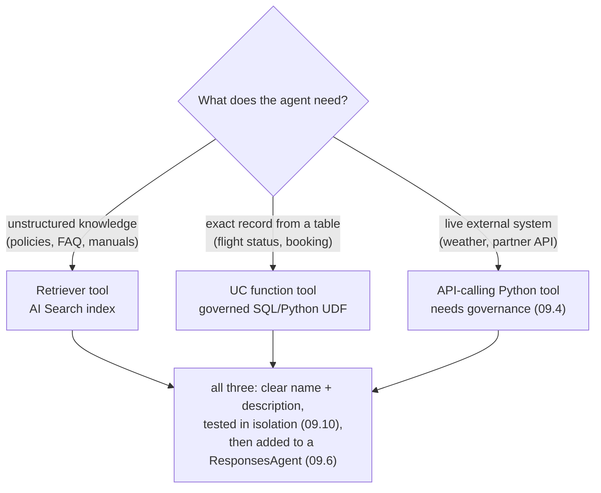

# Creating agent tools — retriever, structured-data lookup, API-calling  ·  Module 09 · Topic 09.3 (★ cornerstone)  ·  [Hands-on] (+ [Theory])

> **You are here:** Roadmap Module 09 → 09.3 (cornerstone deep-dive). An LLM on its own can only talk. Tools are the hands you give it — the moment it can *look things up* and *act*. This topic builds the three tool types the Unity Airways support agent needs and assembles them into one list an agent can call.
> **Prerequisites:** 09.1 (agents vs AI agents), 09.2 (agent development lifecycle), and Modules 04–05 — you already have the retriever/index `unity_airways.rag.ua_rag_chunks_index` from your RAG work. Helpful: 06.x (MLflow logging/registration) since a tool-using agent gets packaged the same way.
> **Feeds into:** 09.4 (tool safety and governance), 09.5 (tool ordering and planning), 09.6 (packaging the tool list into a `ResponsesAgent`), 09.10 (testing tools before you deploy).

## TL;DR
- An **agent tool** is a function the LLM is allowed to call. You give it a **name**, a **clear description**, and a **typed input schema**; the LLM reads the description and decides when to call it. Description quality is what makes tool selection work.
- **Three tool types cover almost everything.** A **retriever tool** searches unstructured docs (AI Search index). A **structured-data lookup tool** runs an exact query against a governed table (a **Unity Catalog function**). An **API-calling tool** is a plain Python function that reaches an external system.
- **Retriever:** `VectorSearchRetrieverTool(index_name="unity_airways.rag.ua_rag_chunks_index", ...)` from `databricks_langchain` wraps your Module 04/05 index as a tool. *(Class + kwargs from 📘B1 Ch7 — Early Release; confirm the current signature in docs.)*
- **Structured lookup:** write `CREATE FUNCTION unity_airways.rag.get_flight_status(...)` in SQL, then expose it with `UCFunctionToolkit(function_names=["unity_airways.rag.get_flight_status"])`. UC functions are governed, reusable, and testable on their own. Databricks also ships the built-in `system.ai.python_exec` code-execution tool you can add the same way.
- **API tool:** a normal Python function wrapped as a LangChain `StructuredTool` with a Pydantic `args_schema`. External calls leave the Databricks trust boundary, so they need governance (that is 09.4).
- **Assemble, then test, then package.** Collect all three into one `tools` list, `bind_tools(...)` it to `databricks-claude-sonnet-4-5`, and **test each tool in isolation (09.10)** before it goes into the `ResponsesAgent` (09.6). Every call shows up in MLflow Traces.

## The problem
- Your Unity Airways chatbot can answer "what is the baggage policy?" from the RAG chain you built in Module 05. That is one skill: search the policy docs.
- Real customers ask harder things:
  - *"Is flight UA123 on the 20th delayed?"* — that answer lives in an **operational table**, not in a policy PDF. Retrieval over documents will not find it.
  - *"Will weather delay my flight out of Singapore tonight?"* — that answer lives in a **live external API**. It is not in your lakehouse at all.
  - *"Am I allowed a refund, and what is my current booking status?"* — that needs **both** a policy lookup **and** a record lookup, chosen turn by turn.
- A single retrieval step cannot do this. The model needs to *decide*, per question, whether to search docs, query a table, or call an API — and it can only do that if you hand it those capabilities as **tools**.

## Why the naive approach fails
- **Naive move 1 — stuff everything into the prompt.** Paste the flight schedule and today's weather into the system prompt. It goes stale in minutes, blows the context window, and still can't look up a booking the model has never seen. Prompts are for instructions, not for live data (this is exactly the tools-vs-prompt line drawn in 09.4).
- **Naive move 2 — one giant do-everything function.** Write a single Python function that branches on the question and does retrieval, SQL, and HTTP inside it. The LLM can't see inside it to reason about *which* path to take, you can't test the pieces separately, and nothing is governed or reusable.
- **Naive move 3 — hard-code the retrieval call.** Always run vector search, then answer. That is a fixed RAG chain, not an agent. It fails the moment the right answer is a table row or an API response, because the model was never given the choice.
- Root cause in one line: **the model can only use capabilities you expose as discrete, described, typed tools** — so build them as separate tools, describe each one well, and let the LLM pick.

## What it is
- A **tool** is a callable the LLM can invoke: `{name, description, input schema, function body}`. The LLM never runs your code directly — it *emits a request* ("call `get_flight_status` with these args"), your runtime executes it, and the result goes back into the conversation.
- The **description is the API the LLM sees.** It reads descriptions to choose a tool and reads the input schema to fill the arguments. Vague or overlapping descriptions are the number-one cause of wrong tool calls.
- On Databricks the three practical tool types are:
  - **Retriever tool** — wraps an **AI Search** (Vector Search) index so the agent can pull relevant unstructured chunks (policies, FAQs, manuals).
  - **Structured-data lookup tool** — a **Unity Catalog function** (SQL or Python UDF) the agent calls to get exact rows from a governed table.
  - **API-calling tool** — a Python function that calls an external service (weather, partner systems), wrapped with a typed schema.
- You gather them into a **tool list**, bind it to a chat model, and (in 09.6) package the whole thing as a `ResponsesAgent` and register it to Unity Catalog.

## Why it matters (for a Databricks FDE)
- This is the step where a demo RAG bot becomes an actual **agent**. Nearly every customer agent conversation you build will mix "search the docs" with "look up a record" and "call a system."
- **UC functions as tools is the Databricks-native superpower.** The same `CREATE FUNCTION` a data engineer writes for a dashboard becomes an agent tool with governance, lineage, and permissions already attached. No new security surface, no bespoke microservice.
- **Tool descriptions are a field skill.** When a customer's agent "keeps calling the wrong tool," the fix is almost always the description and the schema, not the model. Knowing that saves days.
- It is on the certification: the exam expects you to recognize retrieval tools, UC-function tools, and that tool metadata (name + description) drives selection.

## Core concepts
- **Tool** — a named, described, typed function the LLM may call. Name + description drive *selection*; the input schema drives *argument filling*.
- **`VectorSearchRetrieverTool`** (`from databricks_langchain import VectorSearchRetrieverTool`) — wraps an AI Search index as a retriever tool. Key kwargs: `index_name` (three-level UC name), `num_results`, `tool_description`. *(Verified in 📘B1 Ch7; confirm current signature in docs.)*
- **Unity Catalog function** — a SQL/Python UDF created with `CREATE FUNCTION catalog.schema.name(...)`. The `COMMENT` on the function and each parameter becomes the tool description the LLM reads. Governed by UC grants.
- **`UCFunctionToolkit`** (`from databricks_langchain import UCFunctionToolkit`) — takes `function_names=[...]` and returns a **list** of LangChain tools (`.tools`), one per function. Pass a `client=DatabricksFunctionClient()`.
- **`system.ai.python_exec`** — a built-in Databricks UC function that runs LLM-generated Python in a sandbox. Expose it exactly like your own function: `UCFunctionToolkit(function_names=["system.ai.python_exec"])`. Instant code interpreter.
- **`DatabricksFunctionClient`** (`from unitycatalog.ai.core.databricks import DatabricksFunctionClient`) — executes UC functions directly (`client.execute_function(...)`); how you unit-test a function before wrapping it.
- **`StructuredTool`** (`from langchain.tools import StructuredTool`) — wraps a plain Python function as a tool with a Pydantic `args_schema` so inputs are typed and validated (LLMs hallucinate types otherwise).
- **`args_schema` / Pydantic `BaseModel`** — declares the tool's inputs and their types; the LLM fills these fields.
- **Tool list + `bind_tools`** — `llm.bind_tools(tools)` tells the model which tools exist. `ChatDatabricks(endpoint="databricks-claude-sonnet-4-5")` is the model.
- **MLflow Traces** — every tool call is a span (inputs, outputs, latency). This is how you *see* which tool fired and what it returned.

## 🗺️ Visual map

**Three tool types → one tool list → the agent picks and calls → observed in traces** — mirrored in the HTML explainer:

```mermaid
flowchart TB
  subgraph SRC["Three tool types you build"]
    r["Retriever tool<br/>VectorSearchRetrieverTool<br/>unity_airways.rag.ua_rag_chunks_index"]
    s["Structured-data lookup<br/>UC function get_flight_status<br/>via UCFunctionToolkit"]
    a["API-calling tool<br/>Python fn to external API<br/>wrapped as StructuredTool"]
  end
  subgraph LIST["Assemble one tool list"]
    tl["one tools list:<br/>retriever + get_flight_status + weather"]
  end
  r --> tl
  s --> tl
  a --> tl
  subgraph AGENT["Agent / LLM decides (bind_tools)"]
    llm["databricks-claude-sonnet-4-5<br/>reads each tool_description"]
    pick["picks the right tool<br/>and fills the args schema"]
    call["runtime runs the tool,<br/>returns the result"]
    ans["LLM composes a grounded answer"]
  end
  tl --> llm --> pick --> call --> ans
  subgraph OBS["Observe and verify"]
    tr["MLflow Traces:<br/>each tool call = a span"]
    nxt["test each tool alone (09.10)<br/>then package in ResponsesAgent (09.6)"]
  end
  call --> tr
  ans --> nxt
```

*Takeaway: you build three small, well-described tools; the LLM does the choosing; traces let you check it chose right.*

**Which tool type for which job:**



*Takeaway: match the tool type to where the answer actually lives — documents, a table, or an outside system.*

## How it works — deep dive

### Tool 1 — the retriever tool [Hands-on]
- You already built and queried an AI Search index in Modules 04–05. Instead of calling it directly in a fixed chain, you wrap it as a tool the agent can call *when it decides retrieval is needed*.
- `VectorSearchRetrieverTool` does the wrapping. Minimum viable form:

```python
from databricks_langchain import VectorSearchRetrieverTool

retriever_tool = VectorSearchRetrieverTool(
    index_name="unity_airways.rag.ua_rag_chunks_index",  # your Module 04/05 index
    num_results=5,                                        # top-k chunks to return
    tool_description=(
        "Search Unity Airways policy and FAQ documents about flight cancellations, "
        "refunds, baggage rules, and travel policies. Use this for 'what is the policy' "
        "or 'am I allowed to' questions."
    ),
)
```

- **Why the description is so specific:** the LLM reads `tool_description` to decide whether *this* tool answers the question. Say what it covers, when to call it, and the keywords a user might use. Do not let it overlap with your other tools, or the model gets confused about which to pick.
- **Trade-off / gotcha:** the minimal call above assumes a Delta Sync index with managed embeddings. Self-managed-embedding or multi-column indexes may need extra kwargs (e.g. a text/columns spec or an embedding model). Confirm the current signature in the docs before you assert them.

### Tool 2 — the structured-data lookup tool (UC function) [Hands-on]
- Documents can't tell you if flight UA123 is delayed. That is a **row in a table**. On Databricks the clean way to expose a table lookup to an agent is a **Unity Catalog function** — governed, versioned, and reusable.
- Step A — create the function in SQL. The `COMMENT`s are not decoration; they become the description the LLM reads:

```sql
CREATE OR REPLACE FUNCTION unity_airways.rag.get_flight_status(
  in_flight_number STRING COMMENT 'IATA flight code, e.g. UA123',
  in_flight_date   STRING COMMENT 'Scheduled departure date, YYYY-MM-DD (UTC)'
)
RETURNS TABLE
COMMENT 'Return the live status, gate, and times for one Unity Airways flight on a date. Use for "is flight X on time / delayed / cancelled" questions.'
RETURN (
  SELECT flight_number, status, departure_gate,
         scheduled_departure, estimated_departure
  FROM   unity_airways.rag.flight_status_records   -- illustrative ops table
  WHERE  flight_number = in_flight_number
    AND  flight_date   = in_flight_date
);
```

- Step B — test the function directly (before it is ever a tool):

```python
from unitycatalog.ai.core.databricks import DatabricksFunctionClient

client = DatabricksFunctionClient()
result = client.execute_function(
    function_name="unity_airways.rag.get_flight_status",
    parameters={"in_flight_number": "UA123", "in_flight_date": "2026-07-20"},
)
print(result.value)   # you see the row(s) before trusting an agent with it
```

- Step C — wrap it as a tool with `UCFunctionToolkit`:

```python
from databricks_langchain import UCFunctionToolkit

uc_toolkit = UCFunctionToolkit(
    function_names=["unity_airways.rag.get_flight_status"],  # can list several
    client=client,
)
flight_tool = uc_toolkit.tools[0]   # toolkit.tools is a LIST — one tool per function
flight_tool.invoke({"in_flight_number": "UA123", "in_flight_date": "2026-07-20"})
```

- **Why UC functions win here:** grants (`GRANT EXECUTE ON FUNCTION ...`), lineage, and reuse come for free — the same function can back a dashboard *and* the agent. Change the SQL once; every caller gets it.
- **The built-in code tool:** Databricks ships `system.ai.python_exec`, a sandboxed Python executor. Add it the same way — `UCFunctionToolkit(function_names=["system.ai.python_exec"])` — when the agent needs to compute (date math, unit conversions) rather than look something up. *(Confirmed in the naming cheat-sheet §2.)*

### Tool 3 — the API-calling tool [Hands-on]
- Some answers live outside Databricks entirely. Weather is the classic flight example: to warn about delays, the agent calls a live forecast API.
- Step A — declare the inputs with Pydantic so the LLM fills them correctly:

```python
from pydantic import BaseModel, Field

class AirportWeatherInput(BaseModel):
    latitude: float = Field(description="Airport latitude in decimal degrees")
    longitude: float = Field(description="Airport longitude in decimal degrees")
```

- Step B — write the Python function that calls the API, **with error handling** so a failed call doesn't crash the agent:

```python
import requests
from typing import Any

def get_airport_weather(latitude: float, longitude: float) -> dict[str, Any]:
    """Fetch the short-term weather forecast for an airport location.
    Returns hourly temperature, rain, and precipitation probability."""
    try:
        resp = requests.get(
            "https://api.open-meteo.com/v1/forecast",
            params={
                "latitude": latitude,
                "longitude": longitude,
                "hourly": "temperature_2m,rain,precipitation_probability",
            },
            timeout=10,
        )
        resp.raise_for_status()
        return resp.json()["hourly"]
    except Exception as e:
        # return a readable error so the LLM can recover, not a stack trace
        return {"error": f"weather lookup failed: {e}"}
```

- Step C — wrap it as a `StructuredTool`:

```python
from langchain.tools import StructuredTool

weather_tool = StructuredTool(
    name="get_airport_weather",
    func=get_airport_weather,
    description="Get the hourly weather forecast for an airport by latitude/longitude. "
                "Use to check whether weather may delay a flight.",
    args_schema=AirportWeatherInput,   # secures the input types
)
weather_tool.invoke({"latitude": 1.3667, "longitude": 103.8})   # Singapore
```

- **Why `args_schema`:** it constrains what the LLM may pass. Without it, the model can invent wrong types and the call fails. The book calls this out explicitly.
- **Governance flag (→ 09.4):** an API tool leaves the Databricks trust boundary — network egress, secrets/keys, rate limits, and possibly PII in the request. Keep keys in secrets, prefer governed connections, and read 09.4 before shipping one. This is the tool type most likely to cause a security review.

### Assemble, bind, and hand off [Hands-on]
- Gather every tool into one list. `UCFunctionToolkit.tools` is already a list, so extend with it and append the others:

```python
tools = []
tools.extend(uc_toolkit.tools)   # structured lookups: get_flight_status, ...
tools.append(retriever_tool)     # unstructured retrieval
tools.append(weather_tool)       # external API
```

- Bind the list to the chat model. Binding is what makes the tools visible to the LLM:

```python
from databricks_langchain import ChatDatabricks

llm = ChatDatabricks(endpoint="databricks-claude-sonnet-4-5")
llm_with_tools = llm.bind_tools(tools)   # the model can now request any of these tools
```

- Start **small and well-defined** (📘B1): a few high-impact tools beat a sprawling toolbox. This `tools` list is exactly what you feed the `ResponsesAgent` in **09.6**, and each tool is what you test in isolation in **09.10** before packaging.

## How to do it on Databricks

> **[Hands-on]** Serverless or a DBR ML runtime. You need: the AI Search index `unity_airways.rag.ua_rag_chunks_index` (Modules 04–05); rights on `unity_airways.rag` to `CREATE FUNCTION` and `EXECUTE`; and the served model `databricks-claude-sonnet-4-5`.

**0. Install and set variables:**

```python
%pip install -U databricks-langchain databricks-vectorsearch unitycatalog-ai langchain requests
dbutils.library.restartPython()
```

```python
CATALOG = "unity_airways"
SCHEMA  = "rag"
INDEX   = f"{CATALOG}.{SCHEMA}.ua_rag_chunks_index"
```

**1. Retriever tool** — wrap the index (see code above). *How to verify:* `retriever_tool.invoke({"query": "refund on a Basic Economy fare?"})` returns chunks, and the call appears in the MLflow Trace UI as a retriever span.

**2. Structured-data lookup** — run the `CREATE FUNCTION` SQL, then `client.execute_function(...)`. *How to verify:* the function shows up under `unity_airways.rag` → Functions in Catalog Explorer, and `execute_function` returns the expected row before you ever wrap it.

**3. Wrap the function** with `UCFunctionToolkit` and `.invoke(...)`. *How to verify:* `uc_toolkit.tools` has one entry per function name; `flight_tool.invoke({...})` returns the same row `execute_function` did.

**4. API tool** — define the Pydantic schema, the function, and the `StructuredTool`. *How to verify:* `weather_tool.invoke({"latitude": 1.3667, "longitude": 103.8})` returns forecast data (or a clean `{"error": ...}` on failure, not a crash).

**5. Assemble + bind** — build `tools` and `llm.bind_tools(tools)`. *How to verify:* ask the bound model a mixed question and inspect the trace — the right tool should fire.

```python
resp = llm_with_tools.invoke("Is flight UA123 on 2026-07-20 delayed, and can I get a refund if it is?")
# expect tool calls to get_flight_status (status) and the retriever (refund policy)
print(resp.tool_calls)   # shows which tools the model chose and with what args
```

*How to verify the whole thing:* open **MLflow Traces** for the run and confirm each tool call is a span with sensible inputs and outputs. That trace view is also your evidence in 09.10 that the tools work before packaging.

## Worked example (Unity Airways)
- A customer asks: *"My flight UA123 on the 20th — is it delayed? If it's cancelled, can I get a refund? And is the weather in Singapore going to be a problem?"*
- The agent has three tools bound. Turn by turn it:
  1. Calls **`get_flight_status`** (UC function) with `in_flight_number="UA123"`, `in_flight_date="2026-07-20"` → gets `status="DELAYED"`, gate, times.
  2. Calls the **retriever tool** with a query about refund eligibility on delays/cancellations → gets the relevant policy chunks from `unity_airways.rag.ua_rag_chunks_index`.
  3. Calls **`get_airport_weather`** with Singapore's coordinates → gets the forecast, sees rain probability.
- It composes one grounded answer: the flight is delayed, here is the refund rule that applies, and weather may add further delay.
- You didn't script that sequence. You gave the model three well-described tools and it chose. The **MLflow Trace** shows all three calls, their arguments, and their results — which is exactly what you review in 09.10 and monitor in production.

## Uses, edge cases and limitations
| Use it when | Watch out when | Better move |
|---|---|---|
| Agent needs unstructured knowledge (policies, FAQ) | You always retrieve, even for record lookups | Make retrieval a *tool* the LLM picks, not a fixed step |
| Agent needs exact rows from a governed table | You query the table with bespoke Python in the agent | Wrap it as a UC function — governance and reuse for free |
| Agent must compute, not just look up | You hand-build a code sandbox | Add the built-in `system.ai.python_exec` tool |
| Agent needs live external data | You call the API with no error handling | Return a clean error dict; keep the agent alive |
| Two tools sound similar to the model | Descriptions overlap | Rewrite descriptions so each has one clear, distinct purpose |
| External API in the loop | Keys in code, no egress review | Secrets + governed connection; take it through 09.4 first |

## Common mistakes / gotchas
| Mistake | Why it hurts | Better move |
|---|---|---|
| Vague or overlapping `tool_description` | LLM calls the wrong tool or none | One clear purpose per tool; say when to use it and the keywords |
| No `args_schema` on the API tool | LLM passes wrong types; call fails | Declare a Pydantic `BaseModel` and pass `args_schema=` |
| Wrapping a UC function you never tested | Agent fails on a bad query you didn't catch | `client.execute_function(...)` first, then wrap (09.10) |
| Two-level function name | UC needs three levels | Always `catalog.schema.function` (`unity_airways.rag.get_flight_status`) |
| API tool with no error handling | One outage crashes the whole agent | `try/except` → return `{"error": ...}` the LLM can read |
| Assuming the minimal retriever kwargs always work | Self-managed/multi-column indexes need more | Confirm the current `VectorSearchRetrieverTool` signature in docs |
| Live data pasted into the prompt instead of a tool | Goes stale, bloats context, still can't look up new records | Expose it as a tool; keep prompts for instructions (09.4) |
| Giant do-everything tool | LLM can't reason about which path; untestable | Split into small, single-purpose tools |

> 📌 **IMPORTANT:** A tool is only as good as its **name + description + input schema** — that trio is the entire interface the LLM sees. Match the **tool type to where the answer lives**: documents → retriever tool, a table → UC function, an outside system → API tool. Then let the model choose.

> 💡 **TIP:** Put the effort into the `COMMENT`s (UC functions) and `tool_description`/`Field(description=...)` text. When an agent misbehaves in the field, fix the descriptions and schema before you touch the model or the prompt — that is usually the actual bug. Start with 2–4 sharp tools, not a dozen fuzzy ones.

> ⚠️ **GOTCHA:** Library names trip people up. The LangChain integration package is **`databricks-langchain`** (`from databricks_langchain import ...`), *not* `langchain-databricks`. The Vector Search SDK is still **`databricks-vectorsearch`** despite the "AI Search" rebrand. And the `VectorSearchRetrieverTool` class + kwargs shown here come from 📘B1 Ch7 (an O'Reilly Early Release) — the pattern is right, but confirm the exact current signature against docs before you assert it to a customer.

## 📝 Notes
- _Space for your own notes._

**Self-check (5 questions)**
1. Name the three tool types and, for each, say where the answer lives (documents / table / external system). Which Unity Airways question maps to each?
2. Which two things does the LLM read to decide *whether* to call a tool and *how* to fill its arguments? What breaks if two tools have similar descriptions?
3. Write the outline of a UC function tool: the `CREATE FUNCTION` shape, why the `COMMENT`s matter, and the two lines that wrap it with `UCFunctionToolkit` and call it.
4. Why does the API tool need a Pydantic `args_schema` and a `try/except`? What is `system.ai.python_exec` and how do you add it?
5. After you build the three tools, what do you do *before* packaging them into a `ResponsesAgent` (09.6), and where do you see each tool call happen?

## How this maps to the certification
- **Domain 2 — Application development** (agent tooling) owns this topic: creating and exposing tools, and understanding that tool **name + description** drive selection.
- Exam-focus points: retrieval tools over a Vector Search / AI Search index; **Unity Catalog functions as tools** and the toolkit that wraps them; typed inputs for custom tools; the built-in `system.ai.python_exec`; and the principle that tools (not prompts) carry live data and actions (links to 09.4). The exam may phrase these as "how does an agent access X" — the answer is "a tool."

## Sources
- 📘 **B1 — *Practical MLflow for Generative AI on Databricks*, Ch 7** ("Creating Tools" → *Vector Retriever Tool*, *Structured Data Lookup Tool*, *API Calling Tool*, and *Extending the Chatbot with Tools*): `from databricks_langchain import VectorSearchRetrieverTool` with `index_name`/`num_results`/`tool_description`; `CREATE OR REPLACE FUNCTION ... RETURNS TABLE ... RETURN (SELECT ...)` with parameter `COMMENT`s; `DatabricksFunctionClient().execute_function(...)`; `from databricks_langchain import UCFunctionToolkit` with `function_names=[...]` returning `.tools`; `StructuredTool(name=, func=, description=, args_schema=)` over a Pydantic `BaseModel`; and grouping tools into one list. *(O'Reilly Early Release — RAW & UNEDITED; class names/kwargs verified against the book, confirm current signatures in docs.)*
- 📗 **B2 — *Databricks Certified Generative AI Engineer Associate Study Guide*, Ch 4** (agent tools and tool-calling loops): retriever tools return text chunks; reasoning-and-tool-calling in a step-by-step loop; tool selection driven by tool metadata.
- 🧭 Naming cross-check: `.claude/skills/genai-teacher/references/naming-conventions.md` §2 — **Tools:** `UCFunctionToolkit` (`from databricks_langchain import UCFunctionToolkit`), UC functions as tools, built-in **`system.ai.python_exec`**, retrieval tools via AI Search; §9 — import is **`databricks-langchain`** (`ChatDatabricks`, `UCFunctionToolkit`), Vector Search SDK stays **`databricks-vectorsearch`**.
- 🌐 Databricks Docs — "Create custom AI agent tools" (`docs.databricks.com/aws/en/generative-ai/agent-framework/create-custom-tool`) and the unstructured-retrieval-tools page: UC-function tools, `UCFunctionToolkit`, `VectorSearchRetrieverTool`. *(Live fetch returned no static text — JS-rendered page; treat as live re-check pending, grounded on 📘B1 Ch7 + the naming cheat-sheet.)* `databricks_langchain` namespace confirmed live via the public `databricks/databricks-ai-bridge` repo.
