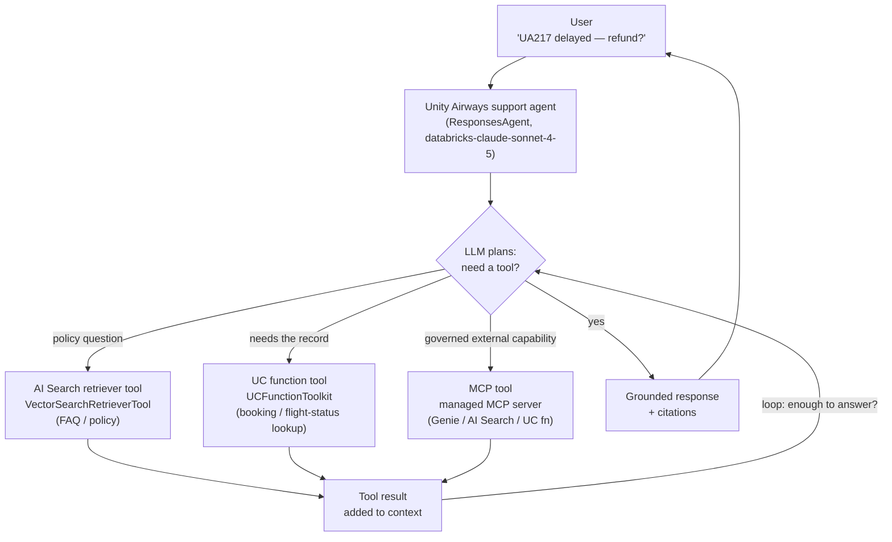
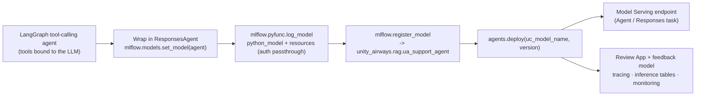

# Agent Fundamentals and Tools (Mosaic AI Agent Framework)  ·  Module 09  ·  Topics 09.1–09.11  ·  [Theory + Hands-on]

> **You are here:** Roadmap Module 09 → Agent fundamentals and tools (all topics 09.1–09.11). This is where the **Unity Airways** assistant grows up: the Module 05 RAG chain becomes one *tool* among several, and an LLM decides when to call it.
> **Prerequisites:** **Module 04** (the AI Search index the retriever tool wraps), **Module 05** (the RAG chain we turn into a retrieval tool — `unity_airways.rag.ua_rag_chain`), **Module 06** (LoggedModel + UC registration), **Module 07** (tracing — every tool call and plan step shows up as a span), and **Module 08** (the same `mlflow.genai.evaluate()` harness now scores tool choice and multi-turn behavior). Next stops: **Module 10** (Agent Bricks / low-code agents — referenced only here) and **Module 11** (serving, Review App, AI Gateway).

This page is the **module hub**. It carries one numbered entry per topic (09.1–09.11). Two topics are cornerstones (★) with their own deep-dive pages:
- **09.3 ★ — Creating tools: vector retriever, structured-data lookup, API-calling** → `create-tools.md` / `create-tools.html`
- **09.6 ★ — Packaging with ResponsesAgent and registering in Unity Catalog** → `responsesagent.md` / `responsesagent.html`

Everything below builds one running artifact: a **Unity Airways support agent**. It wraps the Module 05 FAQ retrieval into a **`VectorSearchRetrieverTool`**, adds a **UC function tool** for a structured booking / flight-status lookup, packages the whole thing with **`ResponsesAgent`**, registers it to **`unity_airways.rag.ua_support_agent`** (`CATALOG="unity_airways"`, `SCHEMA="rag"`), and deploys it with `agents.deploy(...)`. The chat model is `databricks-claude-sonnet-4-5`; tool wiring uses `databricks-langchain`; MLflow is ≥ 3.1.

> 📌 **The one rule that shapes this module — author with `ResponsesAgent`, not the older interfaces.**
> Databricks agent authoring has a clear order of preference, and the books trail the product here:
> - **Authoring interface:** **`ResponsesAgent`** (MLflow) is the **recommended** interface. `ChatAgent` is being **superseded**; `ChatModel` is **legacy**. The migration path is `ChatModel` → `ChatAgent` → `ResponsesAgent`. `ResponsesAgent` uses the OpenAI **Responses** schema and gives you auto-tracing, streaming, and tool / multi-agent history for free. `SplitChatMessagesRequest` and `StringResponse` are **deprecated**.
> - **Log it from code:** register the agent object with **`mlflow.models.set_model()`** (Models-from-Code, Module 05.6) — no pickling.
> - **Tools are governed:** wrap retrieval with **`VectorSearchRetrieverTool`** and UC functions with **`UCFunctionToolkit`** (both from `databricks_langchain`); Unity Catalog governs the models, the functions, and the data behind them.
> - **Deploy in one call:** `from databricks import agents; agents.deploy(uc_model_name, version)` creates a **Model Serving endpoint + a Review App + a feedback model**, and turns on tracing, inference tables, and monitoring.

---

## TL;DR
- An **agent** turns a fixed RAG pipeline into a system that **decides what to do next**. The Module 05 chain always retrieves then answers; the agent lets an LLM choose *whether* to retrieve, look up a booking, or call an API — then loop until it has enough to reply.
- **Three words, three levels of autonomy** (09.1): a **traditional agent** follows hardcoded if-else rules; an **AI agent** uses an LLM to pick tools at runtime; an **agentic AI** system routes between several specialized agents. More flexible means less predictable, so guardrails matter.
- **Tools** are how an agent acts on the world (09.3 ★). You build three flavors: a **vector retriever** (`VectorSearchRetrieverTool`), a **structured-data lookup** (a UC `CREATE FUNCTION` wrapped by `UCFunctionToolkit`), and an **API-calling tool** (a LangChain `StructuredTool` with a Pydantic input schema). Clear names and descriptions are what let the LLM pick the right one.
- **Package once, govern everywhere** (09.6 ★): wrap the agent in **`ResponsesAgent`**, register it with `mlflow.models.set_model()`, log resources for auth passthrough, register to `unity_airways.rag.ua_support_agent`, then `agents.deploy(...)` → Serving endpoint + Review App.
- **MCP** (Model Context Protocol) standardizes tools across agents and platforms (09.8). On Databricks, **managed MCP servers** (Public Preview, some GA) expose Vector Search, UC functions, and Genie behind one UC-governed URL (09.11) — you get the tool without maintaining a server.

## The problem
- The Module 05 chain answers policy questions well, but a passenger asks: *"My flight UA217 to Tokyo is delayed — can I still make my connection, and is my booking refundable?"* That needs the **FAQ policy** (retrieval), the **live booking record** (a database lookup), and possibly a **weather / status API** — in the right order, chosen on the fly.
- A single retrieve-then-generate chain cannot do this. It always retrieves, even when the question is "what's my booking status" (retrieval returns nothing useful), and it has no way to reach the booking table at all.
- The book frames it plainly: the Chapter 4 FAQ chain "wouldn't be able to answer" a flight-status question "as it is not connected to flight data" (📘B1 Ch7). We need a system that connects to data and *decides* how to use it.
- This is the leap from a **chain** (predefined, ordered steps) to an **agent** (dynamic flow chosen at runtime). It unlocks harder tasks, but it also introduces new failure modes: wrong tool, wrong order, runaway loops, and unsafe actions.

## Why the naive approach fails
- **"Just add more if-else branches."** That is the traditional-agent era — brittle rules that break the moment a user phrases things differently, and a maintenance nightmare as intents multiply (📘B1 Ch7).
- **"Let the LLM answer from memory."** No grounding, no live data. It will confidently invent a refund policy or a flight time. Tools exist precisely so the agent acts on real data instead of training-set memory.
- **"Bolt tools on with vague descriptions."** If two tools overlap or the descriptions are fuzzy, the LLM picks the wrong one. "Clear naming and descriptions matter a lot… having similar tools can confuse the supervisor agent about which one to pick" (📘B1 Ch7).
- **"Pickle the LangGraph object and ship it."** Logging with the plain LangChain flavor "would need a lot of input/output custom functions to be supported by most deployment patterns" (📘B1 Ch7). `ResponsesAgent` handles the structured request/response contract and streaming so deployment just works.
- **"Reach for `ChatModel` / `ChatAgent` because the tutorial did."** Those are legacy / superseded. New agents should target `ResponsesAgent` so they get the current schema, tracing, and multi-agent support.

## What it is
- **Plain-language definition:** an **AI agent** is an LLM given a set of **tools** and a loop. On each turn the LLM reads the conversation, decides whether to call a tool (and which one, with what arguments), reads the tool's result, and repeats until it can answer. On Databricks you build it with the **Mosaic AI Agent Framework** and MLflow.
- **Mental model:** a capable support rep. They read your question (the LLM plan), look things up in the manual (retriever tool), pull your record from the system (UC function tool), maybe check an outside service (API / MCP tool), and only then reply — governed by company policy (Unity Catalog + guardrails).
- **Where it sits:** the loop is **user → agent (`ResponsesAgent`) → { LLM plans → tool calls } → response**. The agent is packaged, registered to Unity Catalog, and deployed to a Serving endpoint with a Review App. The same MLflow lifecycle you learned for the RAG chain (log → register → evaluate → deploy → monitor) applies, now with tools in the middle.

## Why it matters (for a Databricks FDE)
- This is the moment a demo stops being "a chatbot over docs" and becomes "an assistant that *does things*" — checks bookings, triggers a cancellation, alerts on weather. That is the story that wins agent projects.
- Every piece is **governed by Unity Catalog**: the model, the UC functions used as tools, the AI Search index, and (with managed MCP) the tool servers. You can show a customer one permission model across data, tools, and the agent — a genuine Databricks differentiator.
- One deploy call (`agents.deploy`) gives them the endpoint, a stakeholder **Review App**, tracing, inference tables, and monitoring hooks. That is the full inner loop of AgentOps in a single line.
- It maps to **exam Domain 3 — Application Development** (Agent Framework, tools, multi-stage reasoning, planning agent chains) with deployment / monitoring threads into later domains (📗B2 Ch2, Ch4).

## Core concepts
- **Agent vs chain** — a chain runs predefined ordered steps; an agent chooses actions at runtime based on reasoning. Agents trade consistency and latency for autonomy and adaptability (📘B1 Ch7, Table 7-1). See 09.1.
- **Tool** — an executable capability the LLM can call: retrieval, a database lookup, an API call, code execution. Each has a **name + description + input schema** the LLM reads to decide when to use it. See 09.3 ★.
- **`VectorSearchRetrieverTool`** — wraps a Databricks AI Search index as a retrieval tool (`databricks_langchain`). See 09.3.
- **UC function tool** — a `CREATE FUNCTION` in Unity Catalog, wrapped by **`UCFunctionToolkit`**, for governed structured-data lookups (plus the built-in `system.ai.python_exec` for code). See 09.3, 09.4.
- **`ResponsesAgent`** — the recommended MLflow authoring interface (OpenAI Responses schema; auto-tracing, streaming, multi-agent history). See 09.6 ★.
- **Multi-stage reasoning** — breaking a task into focused stages (extract → reason → respond), implemented as **tool ordering** (fixed sequence) or **agent planning** (dynamic). See 09.5.
- **Context engineering** — deciding what goes into the LLM's limited context window each turn: system prompt, trimmed history, retrieved knowledge, user metadata. See 09.7.
- **MCP (Model Context Protocol)** — an open standard (Anthropic, 2024) for exposing tools/resources to any agent in a discoverable way. **Managed MCP** servers are Databricks-hosted and UC-governed. See 09.8, 09.11.
- **Agents-as-tools / multi-agent orchestration** — wrap a deployed agent behind a tool interface so a supervisor agent can delegate to it. See 09.9.
- **Tool testing** — unit tests for wrappers plus LLM-judge scorers (e.g. right-tool-usage) that check tool choice against a validation set *before* packaging. See 09.10.

## 🗺️ Visual map

**The agent loop — the LLM plans, calls the right tool, reads the result, and repeats until it can answer:**



*Takeaway: the same conversation can trigger zero, one, or several tool calls in any order. The LLM decides; Unity Catalog governs what it is allowed to touch; MLflow traces every hop.*

**The package → register → deploy path — one `ResponsesAgent`, one UC model, one `agents.deploy` call:**



*Takeaway: authoring, governance, and deployment are one straight line. Register to Unity Catalog first (`mlflow.set_registry_uri("databricks-uc")`), then a single `agents.deploy` stands up the endpoint and the stakeholder Review App together.*

---

## 09.1 Agents vs AI Agents vs Agentic AI — definitions  ·  [Theory]

Three terms, one axis: **how much the system decides for itself** (📘B1 Ch7, Fig 7-1).

| Level | Who decides the flow | Unity Airways example |
|---|---|---|
| **Traditional agent** | Hardcoded **if-else** rules and menus; the user picks an option, then fills in fields | "Press 1 to check schedule, 2 to check reservation" → query a fixed table |
| **AI agent** | An **LLM** reads a free-text question and **chooses which tool** to call | *"What is the flight schedule for Singapore to Japan today?"* → LLM calls the schedule tool |
| **Agentic AI** | A **supervisor** routes between **multiple specialized agents**, splitting a query and sending parts to the best-tuned agent | *"What is the **best** flight for Singapore to Japan today?"* → LLM delegates to a Flight Recommender agent |

- The shift from traditional to AI agent removes the brittle rule tree: "agents infused with LLM… avoid the reliance on if-else hardcoded rules" and understand a query without forcing the user to format input (📘B1 Ch7).
- Agentic AI adds a layer: the supervisor "can choose between multiple AI agents… splitting the questions and passing them to the right agent." This moves from descriptive answers ("what flights exist") to prescriptive ones ("which flight is best").
- **Agents vs chains** (📘B1 Ch7, Table 7-1): agents have **dynamic control flow, higher autonomy, better adaptability**, but **lower consistency and higher latency** (10 seconds to minutes, since the supervisor can loop). Chains are deterministic, consistent, and fast — better for predictable, repeatable tasks.

> ⚠️ **GOTCHA:** More autonomy means less predictability. The book's own note: AI/agentic systems "can become less controlled or predictable, potentially allowing overly permissive behaviors. It is crucial to design appropriate guardrails and restrict certain options" (📘B1 Ch7). Pick the *simplest* pattern that solves the task — a chain if a chain will do.

---

## 09.2 Agent development lifecycle  ·  [Theory]

Building an agent follows the same MLflow lifecycle as any GenAI app, with orchestration frameworks doing the wiring (📘B1 Ch7).

- **Choose an orchestration framework.** MLflow 3.x integrates **LangChain, LangGraph, OpenAI, DSPy, LlamaIndex** and more (flavors list at `mlflow.org/docs/latest/genai/flavors/`). The book uses **LangGraph** (state + nodes + edges) to model the tool-calling loop, and **`databricks-langchain`** to reach Databricks-hosted LLMs.
- **Iterate with observability.** MLflow's **automatic tracing** (Module 07) captures every plan step and tool call so you can debug a multi-step agent. The **Prompt Registry** versions the system prompt so you can iterate on agent quality without fear of regressions.
- **Evaluate every layer.** Any MLflow-logged model can be dropped into `mlflow.genai.evaluate()` (Module 08); a custom `predict_fn` lets you evaluate tool selection, supervisor routing, and formatting — not just the final string.
- **Swap models freely.** The **AI Gateway** abstracts providers (OpenAI, Anthropic, Databricks) behind one endpoint so you benchmark models by changing an endpoint name, not code (📘B1 Ch7; deeper in Module 11.3).
- **The loop:** design tools → build the agent (LangGraph) → trace and debug → evaluate against a baseline → package with `ResponsesAgent` → register to UC → deploy → monitor. Start small and grow: "start with a small, well-defined toolset… later iterate into a more extensive agentic system."

---

## 09.3 ★ Creating tools: vector retriever, structured-data lookup, API-calling  ·  [Hands-on]

> **Cornerstone.** Full deep-dive — all three tool types end to end, `resources` for auth passthrough, and how tool descriptions drive selection — lives in `create-tools.md` / `create-tools.html`. Summary here.

Tools let the agent "do more than just respond to a query using knowledge that [the] LLM was trained on" (📘B1 Ch7). The Unity Airways support agent needs three:

**1. Vector retriever tool** — wrap the Module 05 AI Search index `unity_airways.rag.ua_rag_chunks_index` so the agent retrieves policy on demand:

```python
from databricks_langchain import VectorSearchRetrieverTool

vector_retriever_tool = VectorSearchRetrieverTool(
    index_name="unity_airways.rag.ua_rag_chunks_index",      # the Module 04/05 AI Search index
    num_results=5,
    tool_description=("Search Unity Airways FAQ about flight cancellation, "
                      "travel policies, and baggage rules."),
)
```

**2. Structured-data lookup tool** — a Unity Catalog function for governed flight-status lookups, wrapped by `UCFunctionToolkit`:

```sql
CREATE OR REPLACE FUNCTION unity_airways.rag.get_flight_status(
  in_flight_number STRING COMMENT 'IATA flight code, e.g. UA123',
  in_flight_date   STRING COMMENT 'Scheduled departure date, YYYY-MM-DD (UTC)'
)
RETURNS TABLE
COMMENT 'Return the live status, gate, and times for one Unity Airways flight on a date. Use for "is flight X on time / delayed / cancelled" questions.'
RETURN (
  SELECT flight_number, status, departure_gate,
         scheduled_departure, estimated_departure
  FROM   unity_airways.rag.flight_status_records   -- illustrative ops table
  WHERE  flight_number = in_flight_number
    AND  flight_date   = in_flight_date
);
```

```python
from databricks_langchain import UCFunctionToolkit
from unitycatalog.ai.core.databricks import DatabricksFunctionClient

client = DatabricksFunctionClient()
toolkit = UCFunctionToolkit(
    function_names=["unity_airways.rag.get_flight_status"], client=client)
```

**3. API-calling tool** — a LangChain `StructuredTool` with a Pydantic input schema (secures the input types an LLM might otherwise hallucinate):

```python
from pydantic import BaseModel
from langchain.tools import StructuredTool

class Localization(BaseModel):
    latitude: float
    longitude: float

weather_tool = StructuredTool(
    name="get_weather_forecast",
    func=get_weather_forecast,                       # your Python function
    description="Get weather forecast given latitude and longitude.",
    args_schema=Localization,
)

tools = []
tools.extend(toolkit.tools)
tools.extend([vector_retriever_tool, weather_tool])
```

**How to verify it worked:** call each tool directly before wiring it in — `vector_retriever_tool.invoke({"query": "Can my battery pack go in cabin baggage?"})` returns ranked docs; `toolkit.tools[0].invoke({"in_flight_number": "UA123", "in_flight_date": "2026-07-20"})` returns flight-status rows; `weather_tool.invoke({"latitude": 1.3667, "longitude": 103.8})` returns forecast data. Each call also shows up as a span in the MLflow Trace UI.

> 💡 **TIP:** The `tool_description` (and the SQL `COMMENT`) is the agent's instruction manual. Write it like you would brief a new rep: what the tool does, when to call it, and key keywords. Vague or overlapping descriptions are the #1 cause of wrong-tool bugs.

---

## 09.4 Tool design for safety, governance; tools vs prompt instructions  ·  [Theory]

A tool is *executable* and *governed*; a prompt instruction is only *advisory text*. Knowing which to reach for is a design decision.

- **Tools give you enforcement.** A UC function runs under Unity Catalog permissions — the agent can only touch tables/rows the function (and the caller's identity) is granted. A prompt saying "only look at this customer's bookings" is a suggestion the LLM may ignore; a `WHERE primary_contact_email LIKE user_email` clause is a boundary it cannot cross.
- **Constrain the input.** Use a **structured input schema** (`StructuredTool` + Pydantic, or the UC function signature) so the LLM must produce well-typed arguments. "Knowing how to secure the input type of our tool is a good practice… especially when using LLM as they could hallucinate and generate wrong input types" (📘B1 Ch7).
- **Handle failure inside the tool.** "It is a good practice to incorporate error handling within functions so that the LLM knows how to react in case of tool failure" (📘B1 Ch7). Return a clear error the LLM can reason about, not an unhandled exception.
- **Keep the toolset small and non-overlapping.** Each tool = one clear purpose. Overlap confuses tool selection; a lean toolset is safer and cheaper.
- **Tools vs prompt instructions — a rule of thumb:** put **capabilities and hard constraints in tools** (retrieval, lookups, actions, row filters); put **style, tone, and soft policy in the prompt** ("cite Fare Rules", "professional airline tone"). Anything that must *always* hold — auth, PII scope, refund eligibility — belongs behind a tool or a guardrail, not in prose.

> 📌 **IMPORTANT:** Agentic systems are "less controlled or predictable" than chains, so safety is designed, not assumed (📘B1 Ch7). Restrict the tool surface, validate inputs, scope UC grants to the agent's service principal, and layer AI Gateway guardrails at serving time (Module 11.3 / 12). A tool the agent cannot misuse is worth more than a prompt asking it not to.

---

## 09.5 Multi-stage reasoning and tool ordering; planning agent chains  ·  [Theory + Hands-on]

Complex tasks are more reliable when broken into **focused stages** — "each prompt does one thing well" (📗B2 Ch2). The classic shape is **extract → reason → respond**. There are two ways to implement it.

- **Tool ordering (fixed sequence).** You "explicitly define each stage in a fixed sequence." Best when the steps never change — like a recipe: bake before you frost. In LangChain this is `SimpleSequentialChain` / `SequentialChain` (or `RouterChain` to branch on input type; `RunnableSequence` for more control).

```python
from langchain.chains import LLMChain, SimpleSequentialChain
# extract_chain -> summary_chain, output of stage 1 feeds stage 2
chain = SimpleSequentialChain(chains=[extract_chain, summary_chain], verbose=True)
```

- **Agent planning (dynamic).** When "you often can't predict how many steps are needed or which tools the system should use," a **planning agent** "combines reasoning with tool selection to make dynamic decisions about what to do next, step by step" (📗B2 Ch2). It begins with a goal, uses tools as needed, and stops when the answer is good enough. LangChain patterns: **ReAct (Reason + Act)** and **plan-and-execute**. This is exactly the LangGraph loop the Unity Airways agent uses (`should_continue` routes back to tools or ends).

**When to use which** (📗B2 Ch2, Fig 2-3 — Sequential Tool Ordering vs Planning Agent Reasoning):

| | Tool ordering | Planning agent |
|---|---|---|
| Flow | Fixed, known in advance | Decided at runtime from context |
| Best for | Stable pipelines (extract → summarize) | Troubleshooting, research, branching lookups |
| Predictability | High | Lower (needs guardrails + step limits) |
| Unity Airways fit | "Summarize this policy" | "Why is my trip disrupted and what are my options?" |

> 💡 **TIP:** Default to tool ordering when the steps are known — it is cheaper, faster, and easier to test. Reach for a planning agent only when the path genuinely varies per query. Cap the loop (max tool calls) so a planning agent can't spin.

---

## 09.6 ★ Packaging with ResponsesAgent; register in Unity Catalog  ·  [Hands-on]

> **Cornerstone.** Full deep-dive — the `ResponsesAgent` class, `predict` / `predict_stream`, `resources` for auth passthrough, pre-deploy checks, and UC registration — lives in `responsesagent.md` / `responsesagent.html`. Summary here.

MLflow's **`ResponsesAgent`** is "a specialized interface for serving generative AI models that handle structured responses with tool calling" and works with any framework via the OpenAI Responses schema (📘B1 Ch7). Wrap the LangGraph agent, register it as the model from code, then log and register to UC.

```python
from mlflow.types.responses import (
    ResponsesAgentRequest, ResponsesAgentResponse, ResponsesAgentStreamEvent)
from mlflow.pyfunc import ResponsesAgent

class LangGraphResponsesAgent(ResponsesAgent):
    def __init__(self, agent):
        self.agent = agent
    def predict(self, request: ResponsesAgentRequest) -> ResponsesAgentResponse:
        outputs = [e.item for e in self.predict_stream(request)
                   if e.type == "response.output_item.done"]
        return ResponsesAgentResponse(output=outputs, custom_outputs=request.custom_inputs)
    # predict_stream(...) yields ResponsesAgentStreamEvent for streaming

import mlflow
mlflow.langchain.autolog()                          # trace every run
responses_agent = LangGraphResponsesAgent(agent)
mlflow.models.set_model(responses_agent)            # Models-from-Code (Module 05.6)
```

Log with **resources** so Databricks configures auth passthrough for every tool, then register to Unity Catalog:

```python
from mlflow.models.resources import DatabricksFunction

resources = []
resources.extend(vector_retriever_tool.resources)   # the AI Search index
for fn in toolkit.tools:                             # each UC function tool
    resources.append(DatabricksFunction(function_name=fn.name))

with mlflow.start_run():
    logged = mlflow.pyfunc.log_model(
        name="agent", python_model="agent.py",
        pip_requirements=["databricks-langchain", "langgraph", "backoff"],
        resources=resources)

# Pre-deploy check: rebuilds the env and runs the model
mlflow.models.predict(model_uri=f"runs:/{logged.run_id}/agent",
                      input_data={"input": [{"role": "user", "content": "Refund for UA217?"}]},
                      env_manager="uv")

mlflow.set_registry_uri("databricks-uc")             # register to UC, not workspace registry
UC_MODEL_NAME = "unity_airways.rag.ua_support_agent" # catalog.schema.model
registered = mlflow.register_model(model_uri=logged.model_uri, name=UC_MODEL_NAME)
```

**How to verify it worked:** `mlflow.models.predict()` returns a structured response without env errors (proves the packaged agent loads and runs), and the model appears under `unity_airways.rag` in Catalog Explorer with a version number.

> ⚠️ **GOTCHA:** Log with **`mlflow.pyfunc.log_model` + `ResponsesAgent`**, not the plain `mlflow.langchain` flavor — the LangChain flavor "would need a lot of input/output custom functions to be supported by most deployment patterns" (📘B1 Ch7). And use `mlflow.set_registry_uri("databricks-uc")` so the three-level name `catalog.schema.model` registers to Unity Catalog. Don't fall back to `ChatAgent`/`ChatModel` — `ResponsesAgent` is the go-forward interface.

---

## 09.7 Context engineering  ·  [Theory]

An LLM has a **fixed context window**, and an agent conversation fills it fast (📘B1 Ch7). Context engineering is deciding *what* to put in front of the model each turn.

- **What competes for the window:** the system prompt, the running **conversation history**, retrieved knowledge, and user metadata/preferences. Pass the whole history every turn and you hit "token limit errors or very long latencies."
- **Keep endpoints stateless.** Agent endpoints "are preferred to remain stateless"; the **application backend** is responsible for fetching the right history (usually from a database keyed by user/session) and passing it in. LangGraph keeps history in state, but you must still manage its size.
- **Techniques to fit the window** (📘B1 Ch7):
  - **Truncate to recent turns** — invoke the model on `state[-5:]` (last five messages) instead of the full state.
  - **Pass just the last user query to a tool** — works well for retrieval and text-to-SQL tools that don't need the whole conversation.
  - **Summarize periodically** — replace old turns with a short running summary plus the latest message.
  - **LLM query rewriting** — use an LLM to rephrase a vague follow-up into a standalone query ("Can I have an aisle seat?" → "Passenger X requested a seat change for booking A1234 to an aisle seat").
- The goal: "select only the most relevant parts of the conversation… This approach not only prevents token limit restrictions but also helps focus the model's attention on what matters most… and avoid hallucination or mis-retrieval."

> 💡 **TIP:** Different tools want different context. Give a retrieval tool just the reformulated query; give the answer-composing LLM the trimmed history plus retrieved chunks. Tailoring context per tool beats one global truncation rule.

---

## 09.8 MCP servers as tools  ·  [Theory + Hands-on]

**Model Context Protocol (MCP)** is "an open standard, open-source framework introduced by Anthropic in 2024 to help AI applications access external tools and data sources through standardized protocols" (📘B1 Ch7). An MCP server wraps APIs/databases/code behind one consistent, discoverable interface any MCP-capable agent can consume.

**MCP server vs a framework-specific (LangChain) tool** (📘B1 Ch7, Table 7-2):

| | MCP server | Python-package tool (e.g. LangChain) |
|---|---|---|
| Core idea | Standard protocol; one server, many clients | Framework-specific glue code for one project |
| Best for | Many agents/vendors/platforms reusing a capability | A single app or prototype |
| Reuse | High — consistent schema, capability listing, error semantics | Low — coupled to LangChain and that codebase |
| Overhead | Higher — you run and version a service | Lower — code runs in-process |
| Latency | One extra hop + protocol translation | In-process, fewer moving parts |

- The book's rule of thumb: "Use an MCP server when you want a standardized and reusable interface… that many agents and platforms can consume. Use a LangChain tool when you're optimizing for one specific GenAI app or prototype and don't need cross-platform reuse yet."
- **Managed vs external:** **managed** MCP servers are hosted by the platform (Databricks) with secure defaults, built-in auth, and centralized updates; **external** MCP servers are self- or third-party-hosted for maximum flexibility with more maintenance. See 09.11 for the managed Databricks servers.

**Hands-on sketch** — wrap a Databricks managed MCP server as a LangChain `BaseTool` (full pattern in the book): a small `MCPTool(BaseTool)` class adds auth and calls the server via `DatabricksMCPClient`; `create_langchain_tool_from_mcp(...)` maps the MCP tool's input schema to a Pydantic model. Once wrapped, it plugs into the agent like any other tool.

> ⚠️ **GOTCHA:** MCP on Databricks is **Public Preview** (some surfaces GA) — label it as such in customer material and verify enrollment before promising it in a production timeline.

---

## 09.9 Multi-agent orchestration and agents-as-tools  ·  [Theory + Hands-on]

Once you have one deployed agent, you can treat it as a **tool** for another agent — the building block of multi-agent (agentic AI) systems (📘B1 Ch7).

- **The pattern:** a **supervisor** agent holds the conversation and delegates sub-tasks to **specialist** agents (each an endpoint) exposed as tools. Unity Airways example: the support agent handles policy + bookings, and when the user asks "which flight is *best*", it delegates to a deployed **Flight Recommender** agent.
- **Agents-as-tools in code** — because the specialist is a Serving endpoint, you call it with `ChatDatabricks` and wrap it in a `Tool`:

```python
from databricks_langchain import ChatDatabricks
from langchain.tools import Tool

def get_flight_recommendation(state):
    user_msg = state[-1:]                             # latest user query only (09.7)
    flight_agent = ChatDatabricks(endpoint="flight_recommender_agent_endpoint")
    response = flight_agent.invoke(user_msg)
    return {"messages": [m for m in response.content if m.get("role") == "assistant"]}

recommender_tool = Tool(
    name="flight_recommendation_agent",
    func=get_flight_recommendation,
    description="Get real-time flight recommendations based on the user input.")
```

- **Why it scales:** each specialist is independently built, evaluated, versioned, and governed. The supervisor's job is routing and composition. This is the DIY version of what **Agent Bricks' Multi-Agent Supervisor** does as a managed product (Module 10.3 — referenced only).

> 💡 **TIP:** Give each sub-agent a crisp tool description and a narrow remit, exactly like any other tool (09.4). A supervisor with three sharp specialists beats one sprawling agent with fifteen overlapping tools.

---

## 09.10 Testing agent tools before packaging and deploy  ·  [Hands-on]

Test tools *before* you package the agent — silent tool failures are expensive to debug in production (📘B1 Ch7). This pairs directly with 09.3.

- **Unit tests first.** "Tool development benefits from unit tests for key components, such as tool wrappers, API call handlers, and data transformation logic." Deterministic checks catch schema drift, bad parsing, and API-shape changes cheaply.
- **LLM-judge evaluation for tool behavior.** Build a **validation dataset** that carries more than a question and expected answer — it also records, per query (📘B1 Ch7):
  - the **documents** expected back (vector-search tool),
  - the **correct inputs** (e.g. lat/long for the weather tool, dates for a lookup),
  - the **correct set of tools** that should fire (orchestrator / tool-choice evaluation).
- **A right-tool-usage scorer** — a custom `@scorer` that checks the agent picked the expected tool, using a guidelines judge:

```python
from mlflow.genai.scorers import scorer
from mlflow.genai.judges import meets_guidelines

@scorer
def right_tool_usage_scorer(inputs, outputs, expectations):
    return meets_guidelines(
        name="Right tool usage",
        guidelines="The response must use the correct tool named in expected_tool.",
        context={"response": outputs, "expected_response": expectations["expected_tool"]})
```

- Run these through `mlflow.genai.evaluate()` (Module 08) so tool tests live in the *same* harness as answer-quality tests. "This process of evaluating each component of the AI system is crucial for comparing overall agent versions, tracking improvements, and preventing regressions."

**How to verify it worked:** the evaluation run shows a per-row `Right tool usage` score; a failing row's trace reveals which tool the agent wrongly chose (or skipped) so you can fix the description or the toolset.

> 📌 **IMPORTANT:** Test the **tool layer** and the **orchestration layer** separately. A tool can be perfect while the agent still calls it at the wrong time — right-tool-usage scoring catches that, and it must pass before you package with `ResponsesAgent`.

---

## 09.11 Managed MCP servers on Databricks (Vector Search, UC functions, Genie)  ·  [Theory + Hands-on]

Databricks hosts **managed MCP servers** so you get standardized, UC-governed tools without building or maintaining a server (📘B1 Ch7; naming cheat-sheet §2).

- **What's available (managed):** MCP servers for **Databricks Vector Search (AI Search)**, **Unity Catalog functions**, **Genie**, and **Databricks SQL** — plus support for **custom / external** MCP servers.
- **Governed and authenticated by default.** They are "hosted and maintained by a cloud provider or platform (such as Databricks), offering secure defaults, built-in authentication, automatic scalability, and centralized updates" (📘B1 Ch7). Access flows through Unity Catalog, so the same grants that protect the index/function protect the tool.
- **The URL pattern** points at a UC namespace (from the book's Vector Search example):

```python
from databricks.sdk import WorkspaceClient

ws = WorkspaceClient()
host = ws.config.host
# managed MCP server for the AI Search index in a given catalog.schema
MANAGED_MCP_SERVER_URL = f"{host}/api/2.0/mcp/vector-search/unity_airways/rag"

from databricks_mcp import DatabricksMCPClient
mcp_tools = DatabricksMCPClient(server_url=MANAGED_MCP_SERVER_URL,
                                workspace_client=ws).list_tools()
```

- Wrap the discovered tool (09.8 pattern) and add it to the agent. Behind Genie's managed MCP you reach structured-data Q&A; behind the UC-functions server you reach your governed `CREATE FUNCTION` tools; behind Vector Search you reach retrieval — all through one protocol.
- **Why prefer managed:** you skip server maintenance, access control wiring, and scaling, and you get a reusable interface many agents can share.

> ⚠️ **GOTCHA:** Managed MCP is **Public Preview** (some surfaces GA) — verify the exact server URLs and enrollment on the current docs before you commit them to a customer plan. Confirm the specific catalog/schema in the URL points at where your index/function actually lives.

---

## Worked example (Unity Airways support agent, end to end)

Turning the Module 05 chain into a deployed, governed agent:

1. **Frame the leap (09.1):** the FAQ chain can't answer "is my delayed booking refundable?" because it isn't connected to flight/booking data. We need an AI agent that chooses tools.
2. **Design a small toolset (09.3 ★):** wrap the AI Search index `unity_airways.rag.ua_rag_chunks_index` in a `VectorSearchRetrieverTool`; add a UC function `unity_airways.rag.get_flight_status` via `UCFunctionToolkit`; add a weather `StructuredTool`. Keep it to three, non-overlapping.
3. **Govern the tools (09.4):** the UC function's `WHERE` clause scopes rows; Pydantic schemas type the inputs; each tool handles its own errors. Hard constraints live in tools, tone lives in the prompt.
4. **Build the loop (09.2, 09.5):** a LangGraph tool-calling agent — `agent` node calls the LLM, `should_continue` routes to `tools` or ends. This is planning-agent reasoning, not a fixed order.
5. **Engineer context (09.7):** pass only the reformulated last query to the retriever; trim history to recent turns for the composing LLM; keep the endpoint stateless.
6. **Test before packaging (09.10):** unit-test each tool, then run `mlflow.genai.evaluate()` with a validation set that records expected docs, inputs, and the expected tool per query; the `right_tool_usage_scorer` must pass.
7. **Package with `ResponsesAgent` (09.6 ★):** wrap the LangGraph agent, `mlflow.models.set_model(...)`, log with `resources` for auth passthrough, run the `mlflow.models.predict()` pre-check.
8. **Register to UC (09.6 ★):** `mlflow.set_registry_uri("databricks-uc")` → `mlflow.register_model(... name="unity_airways.rag.ua_support_agent")`.
9. **Deploy (Module 11):** `agents.deploy("unity_airways.rag.ua_support_agent", version)` → Serving endpoint + Review App + feedback model, with tracing, inference tables, and monitoring on.
10. **Extend (09.8, 09.9, 09.11):** swap the hand-wrapped tools for **managed MCP** servers, and delegate "best flight" queries to a deployed **Flight Recommender** agent used as a tool — the step from AI agent to agentic AI.

---

## Uses, edge cases and limitations

| Use it when | Be careful when | Better move |
|---|---|---|
| The task needs live data or actions, not just retrieval | A chain would do the job | Ship the simpler chain — agents cost latency and predictability (09.1) |
| The LLM should choose tools at runtime | You bolt on vague/overlapping tools | Clear names + descriptions; keep the toolset small (09.3, 09.4) |
| A hard constraint must always hold | You put it in the prompt | Enforce it in a UC function / guardrail, not prose (09.4) |
| Steps are known in advance | You reach for a planning agent anyway | Use tool ordering — cheaper, faster, testable (09.5) |
| Deploying a new agent | You use `ChatModel` / `ChatAgent` | Author with `ResponsesAgent` (09.6) |
| A capability is reused across agents | You hand-code a LangChain tool each time | Expose it via a (managed) MCP server (09.8, 09.11) |
| History overflows the context window | You pass the full conversation every turn | Truncate / summarize / rewrite per tool (09.7) |

## Common mistakes / gotchas
- Reaching for `ChatModel` or `ChatAgent` on a new agent — `ResponsesAgent` is the recommended interface; the migration path is `ChatModel` → `ChatAgent` → `ResponsesAgent`.
- Using deprecated `SplitChatMessagesRequest` / `StringResponse` instead of the Responses schema types (`ResponsesAgentRequest` / `ResponsesAgentResponse`).
- Logging the LangGraph object with the plain `mlflow.langchain` flavor instead of `mlflow.pyfunc.log_model` + `ResponsesAgent` (breaks most deployment patterns).
- Forgetting `mlflow.set_registry_uri("databricks-uc")` — the agent lands in the workspace registry instead of Unity Catalog's three-level namespace.
- Vague or overlapping `tool_description` / SQL `COMMENT` — the LLM picks the wrong tool.
- Putting a hard constraint (auth, PII scope, refund rules) in the prompt instead of a governed tool/guardrail.
- Passing the entire conversation history every turn → token-limit errors and slow, unfocused responses.
- Skipping tool-choice testing — a perfect tool called at the wrong moment still fails the user.
- Treating **managed MCP** as GA — it is Public Preview (some surfaces GA); verify before committing.

## 📝 Notes
- _Space for your own notes as you work through the module._

**Self-check (5 questions)**
1. Describe the difference between a traditional agent, an AI agent, and an agentic AI system, with a Unity Airways example of each. What does an agent trade for its extra autonomy (Table 7-1)?
2. Name the three tool types you build for the Unity Airways support agent and the exact class/mechanism for each. Which package do `VectorSearchRetrieverTool` and `UCFunctionToolkit` come from?
3. What is the recommended agent authoring interface, and what is the full migration path from the legacy ones? Why log with `mlflow.pyfunc.log_model` + `ResponsesAgent` rather than the LangChain flavor?
4. When would you use tool ordering vs a planning agent (09.5)? Give the LangChain construct for the fixed-sequence case.
5. What does `agents.deploy(...)` create beyond the endpoint? Name two ways context engineering keeps an agent inside the LLM's context window.

## How this maps to the certification
- **Application Development** (exam Domain 3): building agents with the **Agent Framework**, creating and describing **tools**, **multi-stage reasoning** (tool ordering vs planning agent chains), and prompt/agent structure (📗B2 Ch2, Ch4).
- **Agent evaluation and monitoring** threads: evaluating tool selection and multi-turn behavior with `mlflow.genai.evaluate()` (Module 08), then inference tables + agent monitoring after deploy (📗B2).
- Exam-relevant facts this module nails: agent vs chain trade-offs (Table 7-1); `VectorSearchRetrieverTool` / `UCFunctionToolkit` / `StructuredTool`; UC functions as governed tools; `ResponsesAgent` as the recommended interface (`ChatModel` → `ChatAgent` → `ResponsesAgent`); `mlflow.models.set_model()`; register via `mlflow.set_registry_uri("databricks-uc")` + `mlflow.register_model`; `agents.deploy` → Serving endpoint + Review App; MCP (Anthropic 2024) and managed MCP servers (Public Preview).

## Sources
- 📘 B1 — *Practical MLflow for Generative AI on Databricks* (O'Reilly Early Release, RAW & UNEDITED), **Ch 7 "Developing Agents with MLflow"** (primary): agents vs AI agents vs agentic AI (Fig 7-1) and **agents vs chains** (Table 7-1); MLflow agent lifecycle + orchestration flavors (LangChain, LangGraph, DSPy, LlamaIndex); **creating tools** — `VectorSearchRetrieverTool` (`index_name`/`num_results`/`tool_description`), UC `CREATE FUNCTION` + `UCFunctionToolkit` (`function_names`/`client`) via `DatabricksFunctionClient`, `StructuredTool` + Pydantic `args_schema`, `system.ai.python_exec`; **LangGraph** state/nodes/edges tool-calling agent (`bind_tools`, `should_continue`, `ToolNode`); **testing tools** (unit tests + validation dataset + `right_tool_usage_scorer` with `meets_guidelines`); **`ResponsesAgent`** (`ResponsesAgentRequest`/`Response`/`StreamEvent`, `predict`/`predict_stream`, `mlflow.models.set_model`), logging with `mlflow.pyfunc.log_model` + `resources` (`mlflow.models.resources.DatabricksFunction`), pre-deploy `mlflow.models.predict()`, register via `mlflow.set_registry_uri("databricks-uc")` + `mlflow.register_model`; **context engineering** (context-window management, truncation, summarization, query rewrite, stateless endpoints); **MCP servers as tools** (Table 7-2; managed vs external; `DatabricksMCPClient`, managed MCP URL `{host}/api/2.0/mcp/vector-search/{catalog}/{schema}`); **multi-agent orchestration / agents-as-tools** (`ChatDatabricks` + `Tool`). **Ch 8**: `agents.deploy(model_name, model_version, scale_to_zero, environment_vars, deploy_feedback_model)` → Serving endpoint + Review App; Mosaic AI Agent Framework.
- 📗 B2 — *Databricks Certified Generative AI Engineer Associate Study Guide*, **Ch 2 (Multi-stage reasoning)**: `extract → reason → respond`; **tool ordering** (`SimpleSequentialChain`/`SequentialChain`/`RouterChain`/`RunnableSequence`) vs **planning agent chains** (ReAct, plan-and-execute; Fig 2-3); **Ch 4**: using the Agent Framework to develop agentic systems, agent prompt templates exposing available functions.
- 🌐 Databricks Docs — Agent Framework author-agent (`ResponsesAgent`, `ChatAgent` superseded, `ChatModel` legacy): `docs.databricks.com/aws/en/generative-ai/agent-framework/author-agent`; deploy-agent (`agents.deploy`): `.../deploy-agent`; create-custom-tool (`UCFunctionToolkit`, UC functions, `system.ai.python_exec`): `.../create-custom-tool`; managed MCP: `docs.databricks.com/aws/en/generative-ai/mcp/managed-mcp`. *(Live curl re-check of `VectorSearchRetrieverTool` retriever-tool doc and managed-MCP page returned empty at authoring — live re-check pending; retriever-tool class verified against 📘B1 Ch7 p266 `from databricks_langchain import VectorSearchRetrieverTool`.)*
- 📎 Project cheat-sheet — `.claude/skills/genai-teacher/references/naming-conventions.md` §2 (AI Agents): `ResponsesAgent` recommended (`ChatModel`→`ChatAgent`→`ResponsesAgent`; `SplitChatMessagesRequest`/`StringResponse` deprecated); `UCFunctionToolkit` from `databricks_langchain`; register to UC then `agents.deploy` → endpoint + Review App; **managed MCP servers Public Preview** (some GA) for Genie, AI Search, Databricks SQL, UC functions. Databricks Apps deployment increasingly recommended for new use cases (Module 10.5).
