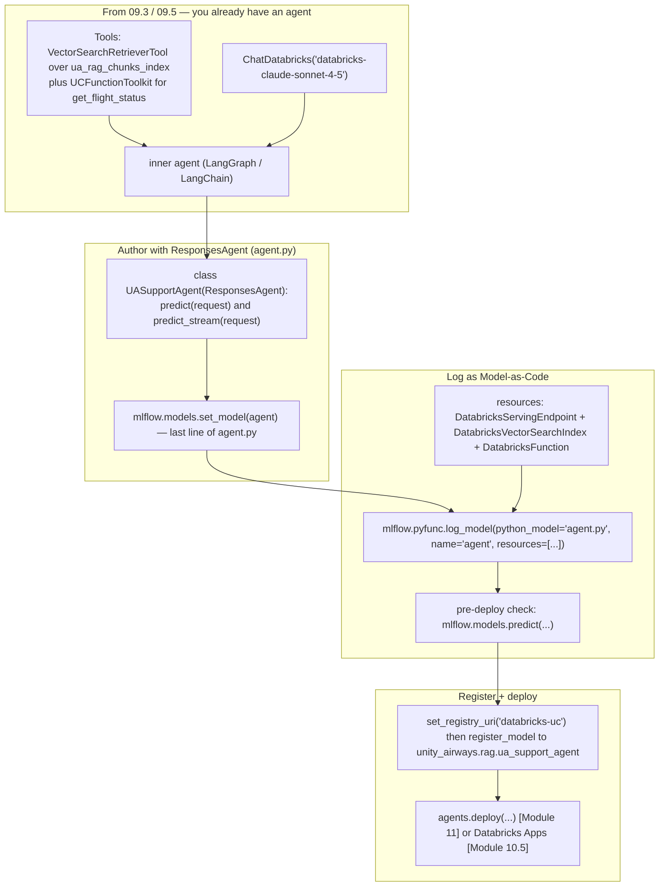
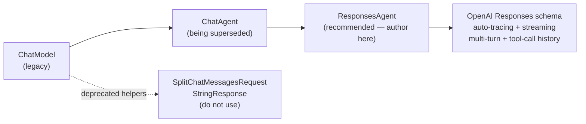

# Packaging an agent with ResponsesAgent and registering in Unity Catalog  ·  Module 09 · Topic 09.6 (★ cornerstone)  ·  [Hands-on]

> **You are here:** Roadmap Module 09 → 09.6 (cornerstone deep-dive). You built the tools in 09.3 (a Vector Search retriever tool over `unity_airways.rag.ua_rag_chunks_index` and a UC function tool `unity_airways.rag.get_flight_status`) and wired the reasoning loop in 09.5. This is where that in-memory agent stops being a notebook object and becomes a **packaged, governed, deployable** model in Unity Catalog.
> **Prerequisites:** 09.3 (creating tools), 09.5 (multi-stage reasoning / tool ordering), **05.6** (Model-as-Code + `mlflow.models.set_model` + dependent resources — you reuse the exact same pattern here), and 06.5 (UC Model Registry: three-level names and `set_registry_uri("databricks-uc")`).

## TL;DR
- **`ResponsesAgent` is the recommended way to author an agent for deployment on Databricks.** It is MLflow's framework-agnostic interface built on the OpenAI **Responses** schema. You get automatic tracing, streaming, multi-turn conversation history, and tool-call history for free. The lineage is `ChatModel` (legacy) → `ChatAgent` (being superseded) → **`ResponsesAgent`** (author new agents here).
- **You subclass it and implement one method.** `predict(self, request: ResponsesAgentRequest) -> ResponsesAgentResponse` runs the agent and returns structured output. Optionally add `predict_stream(...)` to yield `ResponsesAgentStreamEvent`s for token streaming. The class wraps whatever framework your agent is built in (LangGraph, plain Python, etc.).
- **Log it as Model-as-Code** (the 05.6 pattern): put the agent in an `agent.py` file whose last line is `mlflow.models.set_model(agent)`, then `mlflow.pyfunc.log_model(python_model="agent.py", name="agent", resources=[...])`. MLflow stores the *code*, re-runs it at load time, and rebuilds the agent fresh — nothing fragile to unpickle.
- **Declare the Databricks services the agent calls** in `resources=[...]` so deployment mints scoped credentials automatically: `DatabricksServingEndpoint` (the LLM), `DatabricksVectorSearchIndex` (the retriever index), `DatabricksFunction` (the UC function tool).
- **Register to Unity Catalog** with a three-level name — `unity_airways.rag.ua_support_agent` — then hand off to deployment (`agents.deploy(...)` in Module 11, or Databricks Apps in Module 10.5).

## The problem
- After 09.3 and 09.5 you have a working agent object in a notebook. It calls `databricks-claude-sonnet-4-5`, retrieves policy chunks from `unity_airways.rag.ua_rag_chunks_index`, and looks up live flight status through the UC function `unity_airways.rag.get_flight_status`.
- A notebook object is not a product. To serve it behind an endpoint, a teammate, a review app, or a Databricks App has to be able to **load the exact same agent and get the exact same behavior** — with the right credentials for the LLM, the index, and the function it calls.
- Serving infrastructure also needs a **stable request/response contract**. An endpoint cannot guess how to send a multi-turn conversation, stream tokens back, or surface intermediate tool calls unless the agent speaks a schema the platform understands.
- So "package the agent" means three things at once: pin a reproducible **build**, adopt a **standard I/O schema** the serving stack speaks, and record which **governed resources** the agent touches so auth is handled for you.

## Why the naive approach fails
- **Naive move 1 — serve the raw framework object.** A LangGraph or LangChain agent holds live clients (a Vector Search connection, a chat-model client). Cloudpickle chokes on those, exactly as you saw with the RAG chain in 05.6. Even if it pickled, the serving stack would not know its input/output shape.
- **Naive move 2 — hand-roll a `pyfunc` wrapper with your own JSON contract.** You *can* subclass `mlflow.pyfunc.PythonModel` and invent your own request/response dicts. But then **you** own multi-turn history, streaming, tool-call surfacing, and tracing — and your custom schema will not match what the Databricks review app, AI Playground, or a chat UI expect. It works in a demo and breaks the moment someone needs conversation state or streamed tokens.
- **Naive move 3 — reach for `ChatModel` or `ChatAgent` because a blog shows them.** Both still exist, but `ChatModel` is legacy and `ChatAgent` is being superseded. Authoring a new agent on them means adopting an interface that is on its way out and missing the newest Responses-schema features.

```python
# LEGACY authoring interfaces — recognize them, but author new agents on ResponsesAgent.
class MyAgent(mlflow.pyfunc.ChatModel):     # oldest — legacy
    ...
class MyAgent(mlflow.pyfunc.ChatAgent):      # being superseded
    ...
```

- Root cause in one line: **serving needs a reproducible build with a standard, streaming, tool-aware I/O contract — and a record of the resources it calls.** `ResponsesAgent` + Model-as-Code + `resources=[...]` is exactly that package.

## What it is
- **`ResponsesAgent`** is an MLflow authoring class (`from mlflow.pyfunc import ResponsesAgent`) that defines a standardized serving interface for GenAI agents. It is the **recommended** way to author agents for Databricks Model Serving and Agent Framework.
- It is **framework-agnostic**: it wraps an agent built in *any* framework (LangGraph, LangChain, OpenAI SDK, raw Python). "Wrapping" means it translates your agent's I/O to the **OpenAI Responses API** schema, so any chat UI or app already built for that schema can call your agent with no rewrite.
- You implement `predict` (and optionally `predict_stream`). The request and response are **typed**: `ResponsesAgentRequest` in, `ResponsesAgentResponse` out — both imported from `mlflow.types.responses`.
- Because inputs/outputs are structured messages, you get **conversation history, model-usage tracking, tool-call history, and metadata** handled inside a standard framework rather than in your own glue code. With `mlflow.langchain.autolog()` (or the relevant autolog), each run is **traced** automatically — every step, input, output, and tool call.
- You then **log it as Model-as-Code** and **register it to Unity Catalog**, reusing the packaging pattern from 05.6. The difference from 05.6 is the flavor: a chain logs via `mlflow.langchain.log_model`; a `ResponsesAgent` logs via `mlflow.pyfunc.log_model(python_model="agent.py", ...)`.

> 📌 **IMPORTANT:** Author new agents on **`ResponsesAgent`**. Treat `ChatAgent` and `ChatModel` as a **migration path you should recognize, not build on** (`ChatModel` → `ChatAgent` → `ResponsesAgent`). The old request/response helpers `SplitChatMessagesRequest` and `StringResponse` are **deprecated** — do not use them for new work.

## Why it matters (for a Databricks FDE)
- This is the hand-off point from "an agent that runs in my notebook" to "a governed agent a customer can deploy." Almost every agent POC hits it, and the two things people get wrong are (a) authoring on a legacy interface and (b) forgetting to declare resources, so deployment fails auth.
- The Responses schema is what makes the agent portable. A customer's existing OpenAI-compatible chat frontend, the Databricks review app, and the AI Playground all speak it — so packaging correctly means zero integration rewrite downstream.
- Declaring `resources=[...]` is how you answer the security question "what can this agent reach?" Deployment reads that list and provisions **scoped, short-lived credentials** for exactly the LLM endpoint, index, and function the agent uses — nothing more (automatic authentication passthrough).
- It is squarely on the certification (Domain 4 — deployment and operations, and Domain 3 — building apps). The exam expects you to know `ResponsesAgent` is the current authoring interface, Model-as-Code packaging, dependent resources, and three-level UC registration.

## Core concepts
- **`ResponsesAgent`** — MLflow's recommended agent-authoring base class (`mlflow.pyfunc.ResponsesAgent`). Framework-agnostic; uses the OpenAI Responses schema; gives tracing, streaming, and multi-turn/tool history.
- **`ResponsesAgentRequest`** (input, from `mlflow.types.responses`) — the standardized input for serving agents. Holds structured messages in `input` (system / user / assistant roles, tool calls, function arguments — i.e. the conversation history), plus optional `custom_inputs` and a `context` (which can carry `conversation_id` and `user_id`).
- **`ResponsesAgentResponse`** (output, same module) — holds a list of `output` items (generated messages, tool-call results) plus an optional `custom_outputs` dict for extra metadata or diagnostics.
- **`ResponsesAgentStreamEvent`** — the unit yielded by `predict_stream`. Events carry a `type` (e.g. `"response.output_item.done"` for a completed item) and the `item`/delta payload.
- **`predict(self, request) -> ResponsesAgentResponse`** — the one required method. Runs the wrapped agent and returns the final structured output. A common implementation collects the completed events from `predict_stream` and packages them.
- **`predict_stream(self, request) -> Generator[ResponsesAgentStreamEvent, None, None]`** — optional but recommended. Yields events as the agent produces them, enabling token-by-token streaming. The `create_text_delta(...)` helper on the base class builds text-delta events.
- **`mlflow.models.set_model(agent)`** — the Model-as-Code entry point. As the last executable line of `agent.py`, it declares which object is the model. (Same call you used for the chain in 05.6.)
- **`mlflow.pyfunc.log_model(python_model="agent.py", name="agent", resources=[...], pip_requirements=[...])`** — logs the agent by pointing at the code file (not a pickled object). Stores the code, environment, and the resource list.
- **Dependent resources** — classes from `mlflow.models.resources` naming the Databricks services the agent calls: `DatabricksServingEndpoint(endpoint_name=...)`, `DatabricksVectorSearchIndex(index_name=...)`, `DatabricksFunction(function_name=...)`. Drive deployment-time scoped auth.
- **UC registration** — `mlflow.set_registry_uri("databricks-uc")` then `mlflow.register_model(model_uri=..., name="unity_airways.rag.ua_support_agent")` — promotes the logged agent into Unity Catalog as a versioned, governed model (06.5).
- **`agents.deploy(...)`** — `from databricks import agents` — the deploy step (Module 11): spins up a serving endpoint + review app + feedback model. Databricks Apps (Module 10.5) is the other deployment surface. Forward-referenced here, not taught in this topic.

## 🗺️ Visual map

**The packaging pipeline: author the ResponsesAgent → `set_model` in `agent.py` → `log_model` with resources → register to UC → deploy** — mirrored in the HTML explainer:



*Takeaway: the agent object never gets pickled. You wrap it in a ResponsesAgent, point `set_model` at it, log the code plus the resource list, verify with a load-and-predict, then register the governed version.*

**Authoring interfaces — author on the current one, recognize the legacy path:**



*Takeaway: the arrow of history points at `ResponsesAgent`. Recognize the older classes in customer code; do not author new agents on them.*

## How it works — deep dive

### Why ResponsesAgent over the older interfaces [Theory]
- MLflow shipped three agent-authoring interfaces over time. `ChatModel` came first and is now **legacy**; `ChatAgent` improved on it and is now **being superseded**; `ResponsesAgent` is the **current, recommended** interface.
- `ResponsesAgent` earns the recommendation on three counts:
  - **Framework-agnostic wrapping.** It adapts *any* underlying agent to the OpenAI Responses API spec, so existing chat UIs and OpenAI-compatible clients connect with no integration rewrite.
  - **Batteries included.** Structured messages give you conversation history, usage tracking, and tool-call history without hand-rolling them; autolog captures full traces.
  - **Streaming and multi-turn are first-class.** `predict_stream` yields incremental events; the request carries prior turns so the agent has context.
- The deprecated `SplitChatMessagesRequest` / `StringResponse` request-response helpers belong to the older interfaces. Do not reach for them.

> ⚠️ **GOTCHA:** The two project books were written against the earlier surface. 📘B1 Ch7 actually uses `ResponsesAgent` (good), but you will see `ChatModel`/`ChatAgent` in older blogs and in 📗B2. When a customer's code subclasses `ChatModel` or `ChatAgent`, that is legacy — the migration target is `ResponsesAgent`.

### Author the agent: subclass and implement predict [Hands-on]
- Create a class that inherits `ResponsesAgent`, store your framework agent, and implement `predict`. The typed signature is the contract the serving stack relies on:

```python
from typing import Generator
from mlflow.pyfunc import ResponsesAgent
from mlflow.types.responses import (
    ResponsesAgentRequest, ResponsesAgentResponse, ResponsesAgentStreamEvent,
)

class UASupportAgent(ResponsesAgent):
    def __init__(self, agent):
        self.agent = agent   # the LangGraph / LangChain agent from 09.5

    def predict(self, request: ResponsesAgentRequest) -> ResponsesAgentResponse:
        # collect the completed items produced by the streaming path
        outputs = [
            event.item
            for event in self.predict_stream(request)
            if event.type == "response.output_item.done"
        ]
        return ResponsesAgentResponse(output=outputs, custom_outputs=request.custom_inputs)
```

- `ResponsesAgentRequest` gives you `request.input` — the structured message list (system/user/assistant roles, tool calls). `predict` returns a `ResponsesAgentResponse(output=[...])`; `custom_outputs` is optional metadata you can pass back.
- A clean pattern (the one 📘B1 Ch7 uses) is to make `predict` **drive `predict_stream`** and keep only the `"response.output_item.done"` events — the finished items, not partial tokens.

### Add streaming with predict_stream [Hands-on]
- `predict_stream` takes the same request and yields `ResponsesAgentStreamEvent`s. Inside it you call your framework's native streaming API and translate each chunk to a Responses event:

```python
    def predict_stream(
        self, request: ResponsesAgentRequest
    ) -> Generator[ResponsesAgentStreamEvent, None, None]:
        # convert incoming Responses messages to your framework's format,
        # stream from the agent, and convert each chunk back to a Responses event.
        for chunk in self._run_agent_streaming(request.input):
            yield ResponsesAgentStreamEvent(
                **self.create_text_delta(delta=chunk.text, item_id=chunk.id)
            )
        # emit a completed item event at the end of each output
        yield ResponsesAgentStreamEvent(type="response.output_item.done", item=final_item)
```

- `create_text_delta(delta=..., item_id=...)` is a helper on the base class for building token-delta events. The exact conversion helpers between your framework and the Responses schema (e.g. LangGraph message ↔ Responses item) are functions **you write** — 📘B1 Ch7 calls them `_responses_to_cc()` and `_langchain_to_responses()`.

> 💡 **TIP:** Implement `predict_stream` even if your first consumer does not stream. `predict` can then be a three-line wrapper over it (collect the `done` events), you avoid duplicating agent logic in two methods, and you are ready the moment a chat UI wants token streaming.

### Wire in the tools and the LLM [Hands-on]
- The agent inside the wrapper is the one you built in 09.3/09.5. Its two tools and its LLM come straight from `databricks-langchain`:

```python
from databricks_langchain import ChatDatabricks, VectorSearchRetrieverTool, UCFunctionToolkit

LLM_ENDPOINT = "databricks-claude-sonnet-4-5"
INDEX        = "unity_airways.rag.ua_rag_chunks_index"
UC_FUNCTION  = "unity_airways.rag.get_flight_status"

# tool 1 — Vector Search retriever over the policy/FAQ index (09.3)
retriever_tool = VectorSearchRetrieverTool(
    index_name=INDEX,
    num_results=5,
    tool_description="Search Unity Airways policies and FAQ: cancellations, baggage, refunds.",
)

# tool 2 — UC function as a structured lookup tool (09.3)
uc_toolkit = UCFunctionToolkit(function_names=[UC_FUNCTION])

llm   = ChatDatabricks(endpoint=LLM_ENDPOINT)
tools = [retriever_tool, *uc_toolkit.tools]
# `agent` = your LangGraph/LangChain reasoning loop over (llm, tools) from 09.5
```

- `VectorSearchRetrieverTool` and `UCFunctionToolkit` both come from `databricks-langchain` (not `langchain_community`, not `langchain-databricks`). `UCFunctionToolkit` returns a *list* of tools in `.tools`.

### Log as Model-as-Code with resources [Hands-on]
- Put everything above plus the `UASupportAgent` class in one `agent.py`, ending with `mlflow.models.set_model(...)`:

```python
# ... tools, llm, agent, and UASupportAgent defined above (all in agent.py) ...
import mlflow
mlflow.langchain.autolog()                 # automatic tracing for the LangChain/LangGraph steps
responses_agent = UASupportAgent(agent)
mlflow.models.set_model(responses_agent)   # <-- last line: this object is the model
```

- Then log from a driver notebook by pointing at the file. Declare the resources so deployment can mint scoped credentials:

```python
import mlflow
from mlflow.models.resources import (
    DatabricksServingEndpoint, DatabricksVectorSearchIndex, DatabricksFunction,
)

with mlflow.start_run():
    logged_agent = mlflow.pyfunc.log_model(
        python_model="agent.py",          # Model-as-Code: log the code, not the object
        name="agent",
        resources=[
            DatabricksServingEndpoint(endpoint_name="databricks-claude-sonnet-4-5"),
            DatabricksVectorSearchIndex(index_name="unity_airways.rag.ua_rag_chunks_index"),
            DatabricksFunction(function_name="unity_airways.rag.get_flight_status"),
        ],
        pip_requirements=["mlflow", "databricks-langchain", "langgraph"],
    )
```

- Every service the agent reaches at run time must appear in `resources`, or the deployed agent will fail auth when it tries to call it. Here that is three things: the **LLM endpoint**, the **retriever index**, and the **UC function**.

### Verify, then register to Unity Catalog [Hands-on]
- Before registering, run a **pre-deployment check** — MLflow rebuilds the environment from the logged artifacts, loads the model, and calls it:

```python
mlflow.models.predict(
    model_uri=f"runs:/{logged_agent.run_id}/agent",
    input_data={"input": [{"role": "user", "content": "Can I cancel booking c3dd03?"}]},
    env_manager="uv",
)
```

- If that returns a sensible answer, register the logged agent under a three-level UC name:

```python
mlflow.set_registry_uri("databricks-uc")
UC_MODEL = "unity_airways.rag.ua_support_agent"   # catalog.schema.model
registered = mlflow.register_model(model_uri=logged_agent.model_uri, name=UC_MODEL)
print(registered.name, registered.version)        # unity_airways.rag.ua_support_agent 1
```

- The agent now appears in Catalog Explorer under `unity_airways.rag` → Models, versioned and governed exactly like the RAG chain from 06.5. Deployment (`agents.deploy(...)` or Databricks Apps) is the next step.

## How to do it on Databricks

> **[Hands-on]** Runs on serverless or a DBR ML runtime with **MLflow ≥ 3.1**. You need the tools from 09.3 available in UC (`unity_airways.rag.ua_rag_chunks_index`, `unity_airways.rag.get_flight_status`), access to the `databricks-claude-sonnet-4-5` serving endpoint, and rights to create a model in `unity_airways.rag` (`USE CATALOG` + `USE SCHEMA` + `CREATE MODEL`).

**0. Install and set variables:**

```python
%pip install -U mlflow databricks-langchain langgraph
dbutils.library.restartPython()
```

```python
CATALOG      = "unity_airways"
SCHEMA       = "rag"
UC_MODEL     = f"{CATALOG}.{SCHEMA}.ua_support_agent"          # three-level name
LLM_ENDPOINT = "databricks-claude-sonnet-4-5"
INDEX        = f"{CATALOG}.{SCHEMA}.ua_rag_chunks_index"
UC_FUNCTION  = f"{CATALOG}.{SCHEMA}.get_flight_status"
```

**1. Write `agent.py`** — tools, LLM, the `UASupportAgent(ResponsesAgent)` class, and `mlflow.models.set_model(agent)` as the last line (see the deep-dive snippets above). Keep it in the same folder as the driver notebook.

**2. Smoke-test the wrapped agent in the notebook** before logging:

```python
result = responses_agent.predict(
    {"input": [{"role": "user", "content": "Can my battery pack go in cabin baggage?"}]}
)
print(result.output[-1])
```

*How to verify:* you get a coherent answer, and the MLflow trace shows the retriever and (if relevant) the UC-function tool calls.

**3. Log as Model-as-Code with resources:**

```python
import mlflow
from mlflow.models.resources import (
    DatabricksServingEndpoint, DatabricksVectorSearchIndex, DatabricksFunction,
)

with mlflow.start_run():
    logged_agent = mlflow.pyfunc.log_model(
        python_model="agent.py",
        name="agent",
        resources=[
            DatabricksServingEndpoint(endpoint_name=LLM_ENDPOINT),
            DatabricksVectorSearchIndex(index_name=INDEX),
            DatabricksFunction(function_name=UC_FUNCTION),
        ],
        pip_requirements=["mlflow", "databricks-langchain", "langgraph"],
    )
```

*How to verify:* `logged_agent.model_uri` prints, and the run shows an `agent` model artifact with a `pyfunc.ResponsesAgent` flavor.

**4. Pre-deployment check (load + predict in a clean env):**

```python
mlflow.models.predict(
    model_uri=f"runs:/{logged_agent.run_id}/agent",
    input_data={"input": [{"role": "user", "content": "Is flight UA118 on time?"}]},
    env_manager="uv",
)
```

**5. Register to Unity Catalog (creates version 1):**

```python
mlflow.set_registry_uri("databricks-uc")
registered = mlflow.register_model(model_uri=logged_agent.model_uri, name=UC_MODEL)
print(registered.name, registered.version)   # unity_airways.rag.ua_support_agent 1
```

*How to verify:* the model appears in Catalog Explorer under `unity_airways.rag` → Models.

**6. Hand off to deployment (forward reference — not taught here):**

```python
# Module 11 — Agent Framework deploy: creates a serving endpoint + review app + feedback model
from databricks import agents
agents.deploy(UC_MODEL, registered.version)
# Or package it behind a Databricks App — Module 10.5.
```

## Worked example (Unity Airways)
- Coming out of 09.5 you have a LangGraph support agent: it answers policy questions by retrieving from `unity_airways.rag.ua_rag_chunks_index`, checks live flight status through `unity_airways.rag.get_flight_status`, and generates with `databricks-claude-sonnet-4-5`.
- You wrap it in `class UASupportAgent(ResponsesAgent)`, implement `predict`/`predict_stream`, and end `agent.py` with `mlflow.models.set_model(responses_agent)`.
- You log it with `mlflow.pyfunc.log_model(python_model="agent.py", name="agent", resources=[...])`, listing the LLM endpoint, the index, and the UC function so deployment can authenticate to all three.
- `mlflow.models.predict(...)` in a fresh `uv` environment answers "Is flight UA118 on time?" correctly — your packaging is sound.
- You register it as `unity_airways.rag.ua_support_agent` (version 1). It is now a governed UC model with lineage back to the run, ready for `agents.deploy(...)` in Module 11 or a Databricks App in Module 10.5.

> ⚠️ **GOTCHA:** 📘B1 Ch7 registers the same agent as `workspace.unity_airways.unity-airways-booking-agent` (catalog `workspace`, schema `unity_airways`, a hyphenated model name). This project standardizes on `CATALOG="unity_airways"`, `SCHEMA="rag"`, and the model `ua_support_agent`. Use the project's three-level name; the book's is just a different namespace, and hyphenated model names are best avoided.

## Uses, edge cases and limitations
| Use it when | Watch out when | Better move |
|---|---|---|
| Packaging any tool-calling / multi-turn agent for Databricks serving | You author on `ChatModel`/`ChatAgent` out of habit | Subclass `ResponsesAgent`; migrate legacy agents toward it |
| You want streaming + tracing + tool history without glue code | You hand-roll a custom `pyfunc` JSON contract | Let `ResponsesAgent` provide the Responses schema |
| The agent calls governed services (LLM, index, functions) | You forget to list one in `resources` | List every endpoint/index/function the agent reaches |
| You need a reproducible, redeployable build | You try to pickle the framework object | Log Model-as-Code: `python_model="agent.py"` + `set_model` |
| Promoting the agent into governed, versioned form | You deploy from `runs:/<run_id>/agent` | Register to UC (`catalog.schema.model`), deploy from there |
| Consumers use an OpenAI-compatible chat UI | You invent a bespoke message shape | Responses schema is already what they speak |

## Common mistakes / gotchas
| Mistake | Why it hurts | Better move |
|---|---|---|
| Authoring on `ChatModel` / `ChatAgent` for new work | Legacy / superseded interfaces; missing newest features | Author on `ResponsesAgent` (`mlflow.pyfunc.ResponsesAgent`) |
| Using `SplitChatMessagesRequest` / `StringResponse` | Deprecated request/response helpers | Use `ResponsesAgentRequest` / `ResponsesAgentResponse` |
| Passing the agent object to `log_model` | Live clients don't pickle; no I/O contract for serving | Model-as-Code: `python_model="agent.py"` ending in `set_model` |
| Omitting a resource from `resources=[...]` | Deployed agent can't authenticate to that service → runtime failure | List the LLM endpoint, the index, and every UC function tool |
| Skipping `mlflow.models.predict(...)` before registering | You discover a bad environment only after deploy | Run the pre-deployment load-and-predict check first |
| Two-level or workspace-style model name | UC registration requires `catalog.schema.model` | Register as `unity_airways.rag.ua_support_agent` |
| Importing tools from `langchain_community` | Wrong integration package; stale behavior | Import from `databricks-langchain` |
| Inventing methods on `ResponsesAgent` | Only `predict`/`predict_stream` are yours to implement | Implement those two; use base helpers like `create_text_delta` |

> 📌 **IMPORTANT:** The whole topic reduces to five moves: **wrap it** (`ResponsesAgent` subclass), **declare it** (`set_model` in `agent.py`), **log it** (`pyfunc.log_model` with `resources`), **verify it** (`mlflow.models.predict`), **register it** (`catalog.schema.model` in UC). Deployment then reads the registered version.

> 💡 **TIP:** Keep `agent.py` self-contained and importable — no notebook-only globals, no `dbutils` at import time. That is what lets MLflow re-execute it cleanly at load time and what makes the `mlflow.models.predict` check trustworthy. Put config (endpoint, index, function names) at the top of the file so the resource list and the agent read the same constants.

## 📝 Notes
- _Space for your own notes._

**Self-check (5 questions)**
1. Which authoring interface do you use for a new agent, and what are the two older ones you should only recognize as a migration path? Which request/response helpers are deprecated?
2. Which one method must a `ResponsesAgent` subclass implement, what type does it take, and what type does it return? What does `predict_stream` yield?
3. Why do you log the agent with `python_model="agent.py"` instead of passing the agent object, and what single line must `agent.py` end with?
4. The Unity Airways agent calls an LLM, a retriever index, and a UC function. Write the three `resources=[...]` entries (class + kwarg) that make deployment authenticate to them.
5. Give the two lines that point the registry at Unity Catalog and register the logged agent as `unity_airways.rag.ua_support_agent`. Where does deployment happen after that?

## How this maps to the certification
- **Domain 3 — Building applications** and **Domain 4 — Deployment and operations** own this topic: author an agent on the recommended interface, package it, declare its resources, and register it to Unity Catalog with a three-level name.
- Exam-focus points: `ResponsesAgent` is the current authoring interface (not `ChatAgent`/`ChatModel`); implement `predict` (+ optional `predict_stream`); Model-as-Code packaging (`mlflow.models.set_model` + `mlflow.pyfunc.log_model(python_model=...)`); dependent `resources` from `mlflow.models.resources` for automatic auth passthrough; `mlflow.set_registry_uri("databricks-uc")` + `mlflow.register_model(..., "catalog.schema.model")`; deployment via `agents.deploy(...)` or Databricks Apps.

## Sources
- 📘 **B1 — *Practical MLflow for Generative AI on Databricks***, Ch 7 ("Packaging and Deploying Advanced GenAI applications with ResponsesAgent"): `from mlflow.types.responses import ResponsesAgentRequest, ResponsesAgentResponse`; `class ...(ResponsesAgent)` with `def predict(self, request: ResponsesAgentRequest) -> ResponsesAgentResponse` returning `ResponsesAgentResponse(output=..., custom_outputs=...)`; `predict_stream(...) -> Generator[ResponsesAgentStreamEvent, ...]` with `create_text_delta(...)`; `mlflow.langchain.autolog()` + `mlflow.models.set_model(responses_agent)`; `from mlflow.models.resources import DatabricksFunction`; `mlflow.pyfunc.log_model(name="agent", python_model="agent.py", pip_requirements=[...], resources=resources)`; pre-deploy `mlflow.models.predict(..., env_manager="uv")`; `mlflow.set_registry_uri("databricks-uc")` → `mlflow.register_model(...)`. Also Ch 7 tools: `VectorSearchRetrieverTool` and `UCFunctionToolkit` from `databricks_langchain`. *(O'Reilly Early Release — RAW & UNEDITED; APIs verified against current docs.)*
- 🌐 MLflow Python API — `ResponsesAgent` exported from `mlflow.pyfunc` (`mlflow.pyfunc.model.ResponsesAgent`); request/response/stream-event types in `mlflow.types.responses`; resource classes `DatabricksServingEndpoint`, `DatabricksVectorSearchIndex`, `DatabricksFunction` in `mlflow.models.resources`. Import paths and class names **verified against MLflow source** (`mlflow/pyfunc/__init__.py`, `mlflow/models/resources.py`).
- 🌐 Databricks Docs — "Author AI agents" (Agent Framework): `ResponsesAgent` as the recommended authoring interface; deploy via `from databricks import agents; agents.deploy(...)`. `docs.databricks.com/aws/en/generative-ai/agent-framework/author-agent` (live re-check pending — page is JS-rendered; grounded on §2 cheat-sheet + book).
- 🧭 Naming cross-check: `.claude/skills/genai-teacher/references/naming-conventions.md` §2 (**`ResponsesAgent`** recommended; `ChatAgent` superseded → `ChatModel` legacy; migration path `ChatModel`→`ChatAgent`→`ResponsesAgent`; `SplitChatMessagesRequest`/`StringResponse` deprecated; register agent to UC via `set_registry_uri("databricks-uc")` → `register_model` → `catalog.schema.model`; deploy with `agents.deploy(...)`) and §1 (Models-from-Code recommended; import is `databricks-langchain`).
