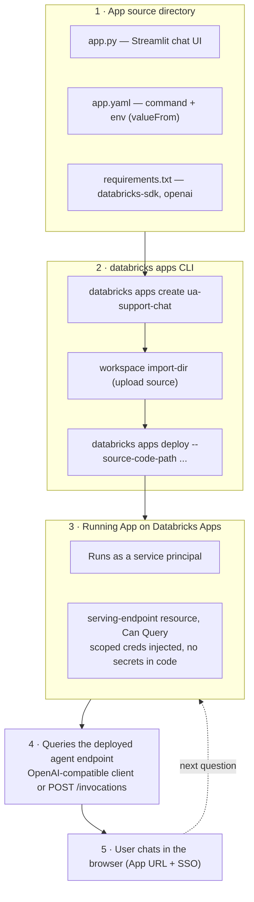
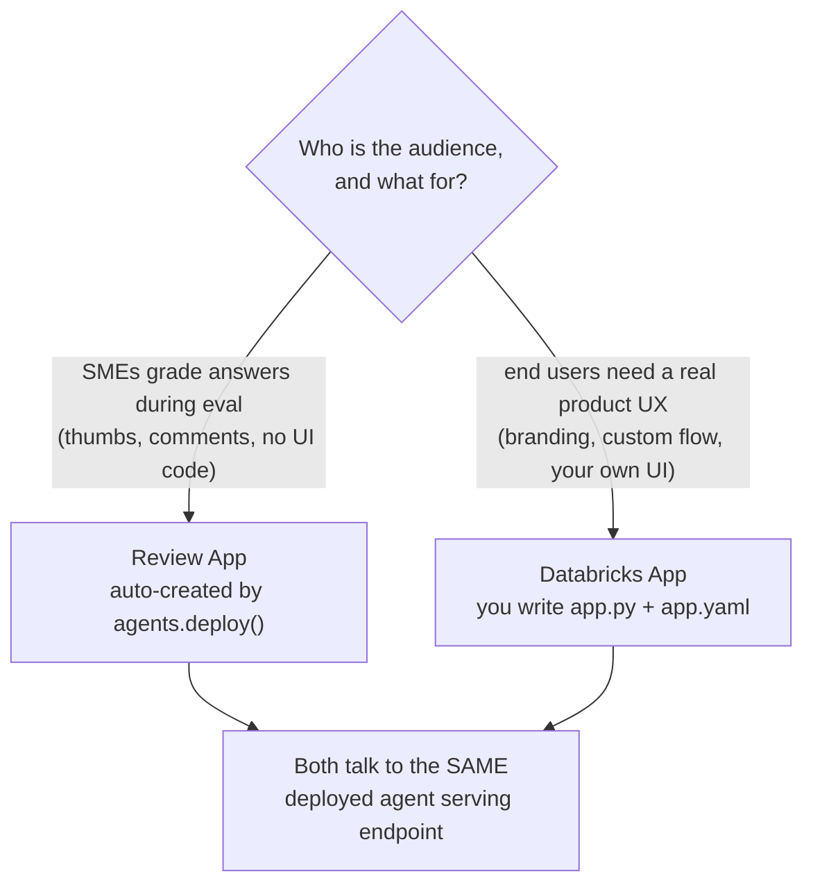

# Build and deploy a GenAI app on Databricks Apps  ·  Module 10 · Topic 10.5 (★ cornerstone)  ·  [Hands-on] (+ [Theory])

> **You are here:** Roadmap Module 10 → 10.5 (cornerstone deep-dive). You have built a Unity Airways agent — the RAG chain from Module 05 or the tool-using `ResponsesAgent` `unity_airways.rag.ua_support_agent` from Module 09. It works, and (via `agents.deploy()`) it sits behind a serving endpoint. But your customer still has no *product* to click. This topic puts a real chat UI in front of it and ships it on **Databricks Apps**.
> **Prerequisites:** a deployed agent/chain serving endpoint (Module 09 `agents.deploy()`, or a Module 05 chain, or a Knowledge Assistant from 10.2); the `databricks` CLI (v0.294.0+); rights to create an app and to grant the app **Can Query** on the endpoint. Helpful: 10.1 (AI Playground — where "Export to Databricks Apps" scaffolds most of this for you).
> **Feeds into:** 10.6 (end-to-end agent build), and **11.9** (the deep dive on Databricks Apps authentication and authorization for GenAI).

## TL;DR
- **Databricks Apps** is a managed platform that hosts an interactive Python web app (Streamlit, Dash, Flask, Gradio, FastAPI) *inside* your workspace, next to your data and models. No servers to run, no separate cloud account.
- An app is just **a source directory**: your app code (`app.py`) plus an **`app.yaml`** config that says how to start it and which env vars to inject. That is the whole contract.
- The app **queries your deployed agent's serving endpoint** with the standard client — an OpenAI-compatible client from the Databricks SDK, or a plain REST `POST .../invocations`. The UI is thin; the agent does the thinking.
- **Resources + scoped auth, no secrets in code.** You declare the serving endpoint as an app **resource** (permission: **Can Query**). The app runs as its own **service principal**; Databricks injects scoped credentials the SDK picks up automatically.
- **Deploy with the `databricks apps` CLI:** `databricks apps create` → upload the source → `databricks apps deploy`. You get an HTTPS URL behind workspace SSO that you share with `CAN USE`.
- **App vs Review App:** `agents.deploy()` gives you a built-in **Review App** for SMEs to grade answers during evaluation. A **Databricks App** is the custom, branded, production experience for real end users. Same endpoint underneath, different job.

## The problem
- Your Unity Airways support agent is genuinely good. It searches policies, looks up flight status, checks weather, and answers in one grounded reply. It lives behind a serving endpoint.
- A serving endpoint is an **API**, not an experience. Nobody at the airline's support desk is going to `curl` a JSON payload or open a notebook to ask "is UA123 delayed?"
- What the business asked for was a *thing they can open in a browser*: a chat box, the Unity Airways name on it, login handled, safe to share with the support team.
- So the gap is the last mile: take a working endpoint and wrap it in a hosted, governed, shareable UI — without standing up a web server, a load balancer, an auth layer, and a secrets vault yourself.

## Why the naive approach fails
- **Naive move 1 — spin up your own web server on a VM/EC2.** Now you own the OS patching, the TLS certs, the auth integration, the network path back into Databricks, and a long-lived token sitting in an env file. That token is a standing credential and a standing liability, and it drifts out of Unity Catalog's governance entirely.
- **Naive move 2 — paste a personal access token into the app.** It works in the demo and fails the security review. The token carries *your* full permissions, never expires on its own, and leaks the moment the repo is shared. This is exactly what the resource + service-principal model exists to kill.
- **Naive move 3 — just send people the Review App URL.** The Review App (from `agents.deploy()`) is built for *SMEs grading answers during evaluation*, not for a support team using the assistant all day. It is Databricks-branded, tied to your review/feedback loop, and not the product UX you were asked to build.
- **Naive move 4 — a notebook with input widgets.** Fine for a demo, but it needs a running cluster, exposes the whole workspace, and is not something you hand to a non-Databricks user.
- Root cause in one line: **hosting a governed, shareable app next to your models is a platform problem, and Databricks Apps is the platform** — so use it instead of rebuilding it.

## What it is
- **Databricks Apps** is a managed hosting platform for interactive web apps that run *in* your Databricks workspace. It runs common Python frameworks out of the box (Streamlit, Dash, Gradio, Flask, FastAPI) and gives each app a URL behind workspace SSO.
- You give it **a directory**. The two files that matter:
  - **`app.py`** — your application code (here, a Streamlit chat UI that reads user input and calls the agent endpoint).
  - **`app.yaml`** — the app config: the **`command`** that starts your app and the **`env`** variables to inject, including **`valueFrom`** references to resources.
- **Resources** are the governed handles the app is allowed to use — a SQL warehouse, a Lakebase database, a **serving endpoint**, a secret, a UC volume, a Genie space. You declare them; Databricks wires scoped credentials in.
- **Auth model:** every app has its own **service principal**. Databricks auto-injects `DATABRICKS_CLIENT_ID` / `DATABRICKS_CLIENT_SECRET`; the SDK's `Config()` finds them with zero code. Optionally the app can also act **on behalf of the signed-in user** via a forwarded token.
- The **`databricks apps` CLI** (or Asset Bundles, or the UI) creates the app, uploads the source, and deploys it.

## Why it matters (for a Databricks FDE)
- This is the demo-to-product moment. Almost every GenAI engagement ends with "great, now how do people actually *use* it?" — and Apps is the answer that keeps everything inside the customer's governance boundary.
- **No new trust surface.** The app is a service principal you can grant exactly `Can Query` on one endpoint. Security teams accept that far faster than "we stood up a Flask box with a PAT in it."
- **It reuses everything you already built.** The endpoint from Module 09's `agents.deploy()`, the Knowledge Assistant from 10.2, the RAG chain from Module 05 — an App can front any of them. You write UI, not infrastructure.
- **It is a fast win.** With "Export to Databricks Apps" from the AI Playground (10.1), a working prototype is often minutes away, then you refine the code.
- It shows up on the certification as the deployment surface for GenAI applications, distinct from the agent Review App.

## Core concepts
- **Databricks Apps** — managed platform to host interactive Python (and Node) web apps in the workspace, next to data and models, with SSO and governance.
- **App source directory** — the files you deploy: `app.py` (+ helpers), `app.yaml`, `requirements.txt`, `README.md`.
- **`app.yaml`** — the app manifest. Two keys you will almost always set: **`command`** (a list, e.g. `["streamlit", "run", "app.py"]`) and **`env`** (name/value or name/`valueFrom` pairs).
- **`valueFrom`** — in `app.yaml`, binds an env var to a declared **resource** instead of a hardcoded ID (e.g. `SERVING_ENDPOINT: valueFrom: serving-endpoint`). Portable and secret-free.
- **Resource** — a governed Databricks object the app may use. For a chat app the key one is a **model serving endpoint** (permission **Can Query**). Others: `sql-warehouse`, `database` (Lakebase), `secret`, `volume`, `vector-search-index`, `genie-space`, `function`.
- **Service principal (app auth)** — each app runs as its own identity. `DATABRICKS_CLIENT_ID` / `DATABRICKS_CLIENT_SECRET` are auto-injected; SDK `Config()` uses them. Grant this SP the minimum it needs.
- **On-behalf-of-user auth (user auth)** — optional; Databricks forwards the caller's token in the `x-forwarded-access-token` header so queries respect that user's Unity Catalog permissions. (Public Preview; deep dive in 11.9.)
- **Serving endpoint query** — how the app reaches the agent: an **OpenAI-compatible client** (`client.chat.completions.create(model=<endpoint>, messages=[...])`) or a REST `POST https://<host>/serving-endpoints/<endpoint>/invocations`.
- **`databricks apps` CLI** — `create`, `deploy` (with `--source-code-path`), `get`, `logs`, `start`, `stop`, `list`, `run-local`.
- **Review App** — the built-in SME feedback UI created by `agents.deploy()`; for evaluation, not production end users.

## 🗺️ Visual map

**Source (`app.py` + `app.yaml`) → `databricks apps deploy` → running App (service principal + endpoint resource) → queries the serving endpoint → user in the browser** — mirrored in the HTML explainer:



*Takeaway: you ship a small source directory; the platform runs it as a scoped identity and hands you a URL. The app is a thin UI over the endpoint you already deployed.*

**When to use an App vs the agent Review App:**



*Takeaway: the Review App is for reviewing quality; the Databricks App is the product. They can point at the same endpoint.*

## How it works — deep dive

### 1) The app is a directory with two files that matter [Theory]
- A minimal chat app is `app.py` + `app.yaml` (+ `requirements.txt` for anything not pre-installed). That is the entire deployable unit.
- The runtime is fixed and small: **Python 3.11, ~2 vCPU / 6 GB**, with Streamlit, Dash, Gradio, Flask, and FastAPI **pre-installed** — you do not list those in `requirements.txt`, only extra packages (here, `databricks-sdk` and `openai`).
- Your app must bind to the port in **`DATABRICKS_APP_PORT`** (defaults to 8000). Streamlit is auto-configured by the runtime; for other frameworks you read the env var or hardcode 8000. **Never use 8080.**

### 2) `app.yaml` — start command plus injected env [Hands-on]
- `command` is a list of argv tokens. For Streamlit it is `["streamlit", "run", "app.py"]`. (Dash/Gradio use `["python", "app.py"]`; Flask uses gunicorn; FastAPI uses uvicorn.)
- `env` entries are either a literal `value` or a `valueFrom` that resolves a declared resource at runtime — so no IDs or secrets live in your code or your repo.

```yaml
command:
  - "streamlit"
  - "run"
  - "app.py"

env:
  # Bind an env var to the serving-endpoint resource you declare in the UI.
  # No endpoint name hardcoded here — valueFrom resolves it at runtime.
  - name: SERVING_ENDPOINT
    valueFrom: serving-endpoint
```

### 3) Resources + service principal — scoped auth, no secrets [Theory]
- The app runs as **its own service principal**. It is not you, and it does not carry your permissions.
- You attach a **resource** (the model serving endpoint) and pick a permission — **Can Query** is the right, minimal one for a chat app. The platform injects scoped credentials the SDK reads automatically.
- Because you referenced the endpoint via `valueFrom: serving-endpoint`, moving the app between workspaces is a config change, not a code change.
- If you need answers filtered per user (row/column security in Unity Catalog), turn on **user authorization** and read the `x-forwarded-access-token` header, so the query runs as the signed-in user rather than the SP. That trade-off is the whole of 11.9.

### 4) The chat UI queries the deployed agent endpoint [Hands-on]
- The UI is deliberately thin: capture the message, call the endpoint, render the reply, keep the turn history in session state.
- Use the standard client. The cleanest is an **OpenAI-compatible** client from the SDK, which points at this workspace's `/serving-endpoints` and authenticates with the injected SP credentials.

```python
import os
import streamlit as st
from databricks.sdk import WorkspaceClient

st.set_page_config(page_title="Unity Airways Support", layout="centered")  # must be first

# Injected from app.yaml (valueFrom: serving-endpoint). This is the name of the
# serving endpoint that agents.deploy() created for unity_airways.rag.ua_support_agent.
ENDPOINT = os.environ["SERVING_ENDPOINT"]

@st.cache_resource                      # reuse one client across reruns (see gotchas)
def get_client():
    # WorkspaceClient() auto-detects the app's service-principal creds via SDK Config().
    # get_open_ai_client() returns an OpenAI-compatible client aimed at /serving-endpoints.
    return WorkspaceClient().serving_endpoints.get_open_ai_client()

client = get_client()

st.title("Unity Airways — Support Assistant")

if "messages" not in st.session_state:
    st.session_state.messages = []

for m in st.session_state.messages:                 # replay the conversation
    with st.chat_message(m["role"]):
        st.markdown(m["content"])

if prompt := st.chat_input("Ask about a flight, refund, or baggage rule…"):
    st.session_state.messages.append({"role": "user", "content": prompt})
    with st.chat_message("user"):
        st.markdown(prompt)
    with st.chat_message("assistant"):
        resp = client.chat.completions.create(     # call the agent endpoint
            model=ENDPOINT,
            messages=st.session_state.messages,
        )
        answer = resp.choices[0].message.content
        st.markdown(answer)
    st.session_state.messages.append({"role": "assistant", "content": answer})
```

- Prefer a raw REST call (or your agent uses the Responses schema)? The documented, dependency-light pattern is a signed `POST` to `/invocations`:

```python
import os, requests
from databricks.sdk.core import Config

cfg = Config()                                    # picks up the app SP credentials

def ask_agent(messages: list[dict]) -> dict:
    headers = cfg.authenticate()                  # adds the Authorization bearer header
    headers["Content-Type"] = "application/json"
    endpoint = os.environ["SERVING_ENDPOINT"]
    r = requests.post(
        f"https://{cfg.host}/serving-endpoints/{endpoint}/invocations",
        headers=headers,
        json={"messages": messages},              # match your agent's input schema
        timeout=120,
    )
    r.raise_for_status()
    return r.json()
```

### 5) Deploy with the `databricks apps` CLI [Hands-on]
- Three steps: create the app object, upload the source into the workspace, deploy from that path. The app then starts as its service principal and gets a URL.
- Add the serving endpoint as a resource (UI, "Configure → + Add resource") and grant **Can Query** — then redeploy so `valueFrom` resolves.

```bash
# 1. Create the app (name: <=26 chars, lowercase letters/numbers/hyphens, no underscores)
databricks apps create ua-support-chat

# 2. Upload the source directory into the workspace
databricks workspace mkdirs /Workspace/Users/me@unity.com/apps/ua-support-chat
databricks workspace import-dir . /Workspace/Users/me@unity.com/apps/ua-support-chat

# 3. Deploy from that path
databricks apps deploy ua-support-chat \
  --source-code-path /Workspace/Users/me@unity.com/apps/ua-support-chat

# 4. Get the URL and status; stream logs while it boots
databricks apps get ua-support-chat            # look for app_status.state: RUNNING and the url
databricks apps logs ua-support-chat           # [SYSTEM]/[APP] lines; "App started successfully"
```

- **Where the URL comes from:** `databricks apps get` returns it. Share access by granting `CAN USE` to the support team (group), `CAN MANAGE` only to developers.
- **Faster start:** in the **AI Playground** (10.1), "**Export to Databricks Apps**" scaffolds the `app.py` + `app.yaml` for a chat app wired to your endpoint — deploy that, then customize.

## Worked example (Unity Airways)
- You finished Module 09: the tool-using agent is registered at `unity_airways.rag.ua_support_agent` and deployed with `agents.deploy("unity_airways.rag.ua_support_agent", version)`. That created a serving endpoint (name is in the deploy output).
- The support team wants a branded chat box, not a notebook. You build the Databricks App:
  1. Put `app.py` (the Streamlit chat UI above), `app.yaml` (Streamlit command + `SERVING_ENDPOINT` via `valueFrom`), and `requirements.txt` (`databricks-sdk`, `openai`) in one folder.
  2. `databricks apps create ua-support-chat`, upload the folder, `databricks apps deploy ... --source-code-path ...`.
  3. In the UI, add the agent serving endpoint as a **serving-endpoint** resource with **Can Query**; redeploy.
  4. `databricks apps get ua-support-chat` gives the URL. Grant the support group `CAN USE`.
- An agent asks: *"Is UA123 on the 20th delayed, and can I get a refund?"* The app forwards the turn to the endpoint; the agent runs its tools (flight-status UC function + policy retriever) and returns one grounded answer; the app renders it. The app never held a secret and never left Unity Catalog's governance.
- Meanwhile, during evaluation, the SMEs kept using the **Review App** from `agents.deploy()` to grade answers. Same endpoint, different audience — exactly the split in Fig. 02.

## Uses, edge cases and limitations
| Use it when | Watch out when | Better move |
|---|---|---|
| You need a shareable, branded UI over an agent endpoint | You reach for a VM or external host | Deploy on Databricks Apps — stay inside governance |
| App only queries a serving endpoint | You start adding a SQL warehouse "just in case" | A pure chat app needs only the serving-endpoint resource; skip the analytics/Lakebase gate |
| Answers are the same for everyone | You need per-user row/column filtering | Turn on user auth (`x-forwarded-access-token`) — see 11.9 |
| SMEs need to grade answers during eval | You send them a hand-built app | Use the `agents.deploy()` Review App for review |
| Rapid prototype | You hand-write boilerplate | "Export to Databricks Apps" from the AI Playground scaffolds it |
| Heavy/streamed responses | The 2 vCPU / 6 GB app box does the LLM work | Keep the LLM on the endpoint; the app stays a thin client |
| Custom Python packages | You assume everything is available | Add them to `requirements.txt` (frameworks are pre-installed; psycopg2 etc. are not) |

## Common mistakes / gotchas
| Mistake | Why it hurts | Better move |
|---|---|---|
| Hardcoding a PAT or endpoint ID in `app.py` | Standing credential; fails security review; not portable | Declare a resource; reference it via `valueFrom`; let `Config()` auth |
| Binding to port 8080 (or ignoring `DATABRICKS_APP_PORT`) | App never becomes reachable | Bind `DATABRICKS_APP_PORT` (default 8000); Streamlit is auto-configured |
| `app.yaml` `command` doesn't match the framework | App won't start; cryptic logs | Streamlit `["streamlit","run","app.py"]`; Flask→gunicorn; FastAPI→uvicorn |
| Forgetting to grant the app SP **Can Query** on the endpoint | 403 from the endpoint at runtime | Add the serving-endpoint resource with Can Query, then redeploy |
| A Streamlit command not run first | `st.set_page_config()` errors | `st.set_page_config()` must be the very first Streamlit call |
| New client per rerun/request | Connection churn, slow app | `@st.cache_resource` for the client (Streamlit); pool for Flask/FastAPI |
| Uploading `node_modules`/`.venv` | Slow, bloated deploys | Use the SDK upload (auto-excludes) or clean the dir before `import-dir` |
| Treating the Review App as the product | Wrong audience, Databricks branding | Review App = eval; Databricks App = end-user product |
| Skipping post-deploy checks | "It deployed" ≠ "it runs" | `databricks apps get` (state RUNNING) + `databricks apps logs` |

> 📌 **IMPORTANT:** A Databricks App is just **a source directory (`app.py` + `app.yaml`) that the platform runs as a scoped service principal**. The two rules that keep it safe and portable: **declare the serving endpoint as a resource** (permission **Can Query**) and **reference it with `valueFrom`** — never a hardcoded ID or token. The app is a thin UI; the agent endpoint does the work.

> 💡 **TIP:** Start from the **AI Playground → "Export to Databricks Apps"** (10.1) to get a working `app.py` + `app.yaml` wired to your endpoint, then customize the UI. Iterate locally with `databricks apps run-local` before you deploy, and watch `databricks apps logs` on first boot — the "App started successfully" line is your green light. Keep the app to `CAN USE` for the team and `CAN MANAGE` for yourself.

> ⚠️ **GOTCHA:** `databricks apps logs` needs OAuth auth (it does not work with a PAT) — use `databricks apps get` for status if you authenticated with a token. The **serving endpoint name** created by `agents.deploy()` is auto-generated (commonly `agents_<catalog>-<schema>-<model>`, e.g. `agents_unity_airways-rag-ua_support_agent`) — **read it from the deploy output** rather than guessing, then bind it as the resource. And the SDK helper `WorkspaceClient().serving_endpoints.get_open_ai_client()` and the exact `serving-endpoint` resource key are grounded in the Databricks Apps skill + docs; the doc pages are JS-rendered so treat the precise strings as **live re-check pending** and confirm against current docs before asserting them to a customer.

## 📝 Notes
- _Space for your own notes._

**Self-check (5 questions)**
1. What are the two files that define a Databricks App, and what does each do? Which key in `app.yaml` injects a resource without hardcoding its ID?
2. What identity does an app run as, and how does the app get credentials to call the serving endpoint without any secret in the code? What permission does the app SP need on the endpoint?
3. Give the three `databricks apps` CLI steps to ship the app, and say where the app URL comes from and how you share it.
4. Write the core of the chat UI: how does `app.py` read user input, call the deployed agent endpoint, and render the reply? Name one client option.
5. When do you use the `agents.deploy()` Review App vs a Databricks App? What do they have in common?

## How this maps to the certification
- **Domain 5 — Deployment and production** (application delivery) owns this: standing up a GenAI application for real users, the resource/service-principal auth model, and the difference between the agent Review App and a hosted app.
- Exam-focus points: an app = source dir + `app.yaml`; resources referenced via `valueFrom` (no hardcoded IDs/secrets); apps run as a service principal with scoped, injected credentials; on-behalf-of-user auth for per-user governance; querying a serving endpoint from application code; and choosing Apps vs the Review App. Expect "how do end users interact with the deployed agent" — the answer is "a Databricks App in front of the serving endpoint."

## Sources
- 🧰 **`databricks-apps` skill** (`~/.agents/skills/databricks-apps/SKILL.md`): app name rules (≤26 chars, lowercase/hyphens), `databricks apps` scaffolding/validate/deploy flow, post-deploy verification (`databricks apps get`, `databricks apps logs`), and the Other-Frameworks path for Streamlit/Flask/etc. Data Access Decision Gate (analytics vs Lakebase) — skipped here because a pure endpoint-query chat app reads no Unity Catalog tables directly.
- 🧰 **`databricks-apps-python` skill** (`~/.agents/skills/databricks-apps-python/`): `1-authorization.md` (service principal auth via `Config()`, injected `DATABRICKS_CLIENT_ID`/`DATABRICKS_CLIENT_SECRET`, on-behalf-of-user `x-forwarded-access-token`, OAuth scopes); `2-app-resources.md` (resource types incl. **serving-endpoint** with **Can Query**, `valueFrom`, the REST `POST /serving-endpoints/<name>/invocations` pattern); `3-frameworks.md` and `4-deployment.md` (Streamlit command `["streamlit","run","app.py"]`, `app.yaml` `command`+`env`, `databricks apps create`/`deploy --source-code-path`, `DATABRICKS_APP_PORT`, runtime Python 3.11 / 2 vCPU / 6 GB, pre-installed frameworks); `examples/llm_config.py` (OpenAI-compatible client `OpenAI(api_key=token, base_url=.../serving-endpoints)`).
- 🧭 Naming cross-check: `.claude/skills/genai-teacher/references/naming-conventions.md` §2 — `agents.deploy()` creates a Serving endpoint + **Review App** + feedback model, and "for new use cases, **Databricks Apps** deployment is increasingly recommended"; AI Playground "**Export to Databricks Apps**"; served model `databricks-claude-sonnet-4-5`.
- 🌐 Databricks Docs — Databricks Apps: get-started, app-development, [resources](https://docs.databricks.com/aws/en/dev-tools/databricks-apps/resources), [auth](https://docs.databricks.com/aws/en/dev-tools/databricks-apps/auth), [app.yaml/runtime](https://docs.databricks.com/aws/en/dev-tools/databricks-apps/app-runtime). *Verified live (July 2026): the get-started page mentions `app.yaml`, `databricks apps create`, `databricks apps deploy`, `databricks apps run`, and "service principal". The `databricks` CLI (v0.298.0) confirms `apps create NAME`, `apps deploy [APP_NAME] --source-code-path`, and `apps get/logs/start/stop/list/run-local`. Resource-page strings are JS-rendered — the exact `serving-endpoint` key and SDK OpenAI-client helper are grounded on the skills above; treat as live re-check pending.*
- 📗 **B2 — Databricks Certified GenAI Engineer Associate Study Guide** (deployment/productionization): serving endpoints as the interface to a deployed agent; delivering the application to end users.
