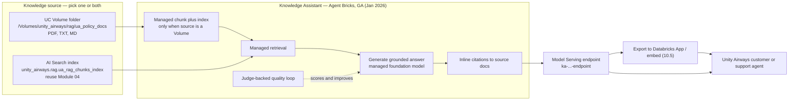
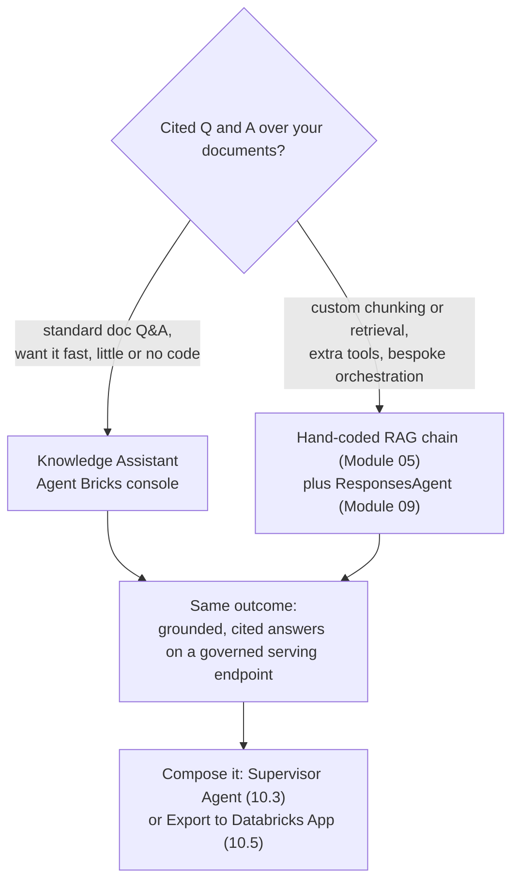

# Knowledge Assistant (Agent Bricks) — a cited Q&A chatbot, no code  ·  Module 10 · Topic 10.2 (★ cornerstone)  ·  [Theory] + [Hands-on]

> **You are here:** Roadmap Module 10 → 10.2 (cornerstone deep-dive). In Modules 04–05 you hand-built a RAG chain — index, retriever, prompt, chat model, the works. This topic shows the console-driven shortcut: point Databricks at your documents and it stands up the *same* cited Q&A bot for you, with retrieval, a quality loop, and citations all managed.
> **Prerequisites:** 10.1 (AI Playground — how the console prototyping surface feels). Helpful: Module 03 (a UC Volume of documents) and Module 04 (the AI Search index `unity_airways.rag.ua_rag_chunks_index`) — a Knowledge Assistant can reuse either as its knowledge source.
> **Feeds into:** 10.3 (a Knowledge Assistant becomes one "agent" a Supervisor Agent can route to), 10.5 (Export to a Databricks App), and it is the low-code counterpart to Module 05's hand-coded RAG chain + Module 09's `ResponsesAgent`.

## TL;DR
- A **Knowledge Assistant** is a **managed, cited Q&A chatbot** over your documents. You build it in the **Agent Bricks console** — point it at a **knowledge source**, name it, describe it, and click create. **No agent code.** It is **GA** (Jan 2026).
- The **knowledge source** is either a **Unity Catalog Volume folder** of documents (PDF / TXT / MD) **or** an existing **AI Search index** (reuse your Module 04 `unity_airways.rag.ua_rag_chunks_index`). Both are valid; pick whichever you already have.
- **Databricks manages the hard parts:** if you point at a Volume it **chunks and indexes** for you; then it handles **retrieval**, answer **generation**, a **judge-backed quality loop**, and **inline citations** back to the source document.
- **Same outcome as the hand-coded RAG chain (Module 05), far less code.** You give up fine-grained control over chunking, the retriever, and the prompt — you gain speed and a managed quality loop. Choose low-code when the job is standard doc Q&A; choose custom (Module 05 + `ResponsesAgent`) when you need bespoke retrieval, extra tools, or custom orchestration.
- **Consume it** through the serving **endpoint** it creates (query it like any Model Serving endpoint), the built-in chat in the tile, or **Export to a Databricks App** to embed it — that hand-off is Topic 10.5.

## The problem
- Unity Airways has hundreds of policy PDFs: refund rules, baggage limits, rebooking terms, loyalty tiers, visa guidance. Agents and customers need answers *from those exact documents*, with a pointer to which page said so.
- You already know one way to build this: the Module 04–05 RAG stack — parse and chunk the docs, embed them, create an AI Search index, wire a retriever, write a grounding prompt, bind a chat model, log and serve it. It works, and understanding it is essential.
- But most "answer questions over our docs" requests do **not** need anything bespoke. They need a solid retriever, a good grounding prompt, citations, and a way to tell whether the answers are any good. Rebuilding that stack by hand for every document set is slow, and every hand-built copy is one more thing to babysit.
- The real question a Field Engineer hears: *"Can we get a chatbot over these PDFs by end of week, that cites its sources and that we can trust?"* — without a two-week engineering project.

## Why the naive approach fails
- **Naive move 1 — hand-build the full RAG chain every time.** For a one-off cited Q&A bot this is a lot of moving parts to write, test, and maintain: chunk sizes, embedding model, index sync, retriever `k`, prompt, citation formatting, plus your own evaluation harness. Right for custom needs (Module 05), overkill for standard doc Q&A.
- **Naive move 2 — paste the docs into the prompt.** Stuff a few PDFs into the system prompt and ask. It blows the context window on a real document set, silently drops the documents that did not fit, and gives you **no citations** — so no one can verify the answer. Prompts are for instructions, not for a corpus.
- **Naive move 3 — a generic chatbot with no grounding.** Point a foundation model at "airline questions" with no retrieval. It hallucinates confident, wrong policy — the single worst failure mode for a support bot, because a made-up refund rule looks exactly like a real one.
- **Naive move 4 — ship it with no quality loop.** Even a decent RAG bot degrades quietly as documents change. Without built-in evaluation you find out from an angry customer, not a dashboard.
- Root cause in one line: **standard document Q&A needs retrieval + grounding + citations + a quality signal — and rebuilding all four by hand, every time, is the waste.** A Knowledge Assistant gives you all four from the console.

## What it is
- **Knowledge Assistant (Agent Bricks)** — a Databricks-managed agent tile that answers natural-language questions over a set of documents and **cites the source** for each answer. It is part of the **Agent Bricks** no/low-code family and is **GA** (Jan 2026).
- You configure it in the **console**, not in code: give it a **name**, a **description**, optional **instructions** (tone and answering rules), attach one or more **knowledge sources**, and optionally add **sample/example questions**. Then create it.
- A **knowledge source** is one of:
  - a **Unity Catalog Volume folder** of documents (PDF / TXT / MD, etc.) — Databricks **chunks and indexes** the files for you; or
  - an existing **AI Search index** (e.g. your Module 04 `unity_airways.rag.ua_rag_chunks_index`) — Databricks retrieves against the index you already built.
- Behind the tile, Databricks runs the pieces you would otherwise hand-code: **retrieval** over the source, **answer generation** with a managed foundation model, a **judge-backed quality loop** that scores answers, **guardrails**, and **citations** linking each claim back to a document. It also creates a **Model Serving endpoint** so apps and other agents can call it.
- It produces the **same kind of output** as your Module 05 RAG chain — a grounded, cited answer — but you wrote **no retriever, no prompt, and no evaluation harness**.

## Why it matters (for a Databricks FDE)
- This is the fastest credible path from "here are our documents" to "here is a cited chatbot" — often a same-day demo instead of a multi-day build. That speed wins proofs-of-concept.
- **It teaches the low-code vs custom decision**, which you will make on nearly every engagement. Knowing *when* Agent Bricks is enough — and when a customer genuinely needs the hand-coded chain from Module 05 plus a `ResponsesAgent` — is a core Field Engineering judgment call.
- **Governance comes for free.** The knowledge source lives in Unity Catalog, the endpoint is governed, guardrails and payload logging ride on AI Gateway, and citations make answers auditable. That is exactly what a customer's security review asks about.
- **It composes.** The Knowledge Assistant you build here is the "unstructured documents" specialist a **Supervisor Agent** routes to in 10.3, and the thing you **Export to a Databricks App** in 10.5. Understanding it unlocks both.

## Core concepts
- **Agent Bricks** — the no/low-code umbrella in the Databricks console for building managed agents (Knowledge Assistant, Supervisor Agent, Information Extraction, Custom LLM). You configure; Databricks builds and serves.
- **Knowledge Assistant (KA)** — the Agent Bricks tile for **cited Q&A over documents**. GA (Jan 2026).
- **Knowledge source** — where the answers come from: a **UC Volume folder** of files **or** an **AI Search index**. You can attach more than one.
- **Managed chunking + indexing** — when the source is a Volume, Databricks parses, chunks, and indexes the files so you do not have to (this is the Module 03–04 work, done for you). When the source is an existing index, this step is skipped.
- **Managed retrieval** — at question time, the KA fetches the most relevant chunks from the source. You do not write or tune the retriever.
- **Judge-backed quality loop** — Databricks uses an LLM-as-judge evaluation (the same family of scorers/judges you meet in Module 07 / `mlflow.genai`) to measure answer quality and improve the assistant. Sample questions feed this loop.
- **Citations** — each answer links back to the source document/chunk it used, so a human can verify it. This is the feature that makes a support bot trustworthy.
- **Instructions** — free-text guidance on tone and answering rules ("cite the specific policy; if it is not in the docs, say so"). The closest thing to a "prompt" you control here.
- **Guardrails + governance** — safety filtering and PII handling via AI Gateway; the source and the endpoint are governed by Unity Catalog.
- **Serving endpoint** — creating a KA stands up a Model Serving endpoint (name pattern like `ka-<id>-endpoint` — *confirm the exact name in the console*). Apps, other agents, and REST clients call it.
- **Export to Databricks Apps** — one-click path to embed the assistant in an app UI (Topic 10.5).

## 🗺️ Visual map

**Knowledge source → Knowledge Assistant (managed retrieval + judge loop + citations) → endpoint/app → user** — mirrored in the HTML explainer:



*Takeaway: you supply the documents and a few settings; Databricks runs retrieval, generation, the quality loop, and citations, then serves the result on an endpoint.*

**Low-code vs custom — the decision you actually make:**



*Takeaway: both roads reach a governed, cited Q&A endpoint. Pick low-code for standard document Q&A; pick custom when you need control the console does not expose.*

## How it works — deep dive

### The console build flow [Hands-on]
- You never leave the browser. In the Databricks left nav, open **Agent Bricks**, then choose **Knowledge Assistant**. *(Exact nav labels — "Agent Bricks", the tile name — can shift between releases; confirm in the current console.)*
- The tile asks for a small set of inputs:
  - **Name** — e.g. `Unity Airways Policy Assistant` (spaces are typically sanitized to underscores).
  - **Description** — a plain sentence of what it answers, e.g. "Answers Unity Airways customer questions about refunds, baggage, cancellations, and travel policy."
  - **Instructions** *(optional but do it)* — tone and answering rules: "Always cite the specific policy document. If the answer is not in the documents, say so plainly. Use short bullet points for multi-part answers."
  - **Knowledge source** — attach a **UC Volume folder** or an **AI Search index** (details below). You can attach more than one.
  - **Sample questions** *(optional)* — a few representative questions (and expected-behavior notes) that seed the quality loop and show users what to ask.
- Click create/build. The KA provisions asynchronously (a couple of minutes, similar to standing up a serving endpoint) and its status moves toward **online**.
- **What Databricks does for you here:** if the source is a Volume, it parses, chunks, and indexes every file; it wires a retriever; it builds the grounding + citation logic; it attaches the judge-backed quality loop; and it creates the serving endpoint. That is the entire Module 03–05 stack, assembled and managed.

### Choosing the knowledge source [Theory + Hands-on]
- **Option A — a UC Volume folder of documents.** Point the KA at something like `/Volumes/unity_airways/rag/ua_policy_docs`. Databricks handles chunking and indexing. Best when you have raw files and have **not** built an index yet — it saves you all of Module 03–04.
- **Option B — an existing AI Search index.** Reuse `unity_airways.rag.ua_rag_chunks_index` from Module 04. Databricks retrieves against your index directly and skips its own chunking/indexing. Best when you already invested in a tuned index and want the managed generation/citation/quality layer on top.
- **Trade-off:** the Volume path is the least work but gives you the least control over chunking; the index path lets you keep the chunking/embedding decisions you made in Module 04 while still getting the managed assistant. Same assistant either way.
- **Governance:** both sources are Unity Catalog objects. The KA reads them under UC permissions, so grants you already manage on the Volume or index carry over — no new data-access surface to secure.

### What "managed" actually covers — and what you give up [Theory]
- **Managed for you:** parsing/chunking/indexing (Volume source), the retriever, the grounding prompt, citation wiring, guardrails, the judge-backed quality loop, and the serving endpoint. You configure none of these in code.
- **Not yours to tune:** chunk size and strategy, the exact retriever and `k`, the embedding model (Volume path), the generation prompt internals, and the specific judge configuration. The KA manages the underlying foundation model for generation and judging — you do **not** pick it in code. *(This curriculum standardizes on `databricks-claude-sonnet-4-5` as the reference chat/judge model; the KA's exact managed default is set by Databricks — confirm in the console.)*
- **The line to remember:** you trade fine-grained control for speed and a managed quality loop. When a customer needs a specific chunking strategy, a custom reranker, extra tools, or multi-step orchestration, that is your signal to drop to the hand-coded chain (Module 05) and `ResponsesAgent` (Module 09).

### The quality loop and citations [Theory]
- The KA scores its own answers with an **LLM-as-judge** evaluation — the same idea you formalize in Module 07 with `mlflow.genai` scorers/judges. Your **sample questions** are the seed set it evaluates against.
- **Citations** are the trust feature: every answer points back to the document/chunk it used. In a support setting this is non-negotiable — a human can click through and confirm the policy, and a wrong answer is visibly traceable rather than an untraceable hallucination.
- Improve quality the console way: add or sharpen **instructions**, add more **sample questions**, and make sure the source documents are clean and well-named. You are tuning inputs, not retriever internals.

### Consuming the assistant [Hands-on]
- **In place:** the tile has a built-in chat for testing and demos — ask a question, see the answer and its citations immediately.
- **Via the serving endpoint:** creating the KA stands up a Model Serving endpoint. Query it like any other endpoint — the standard serving-endpoint query pattern. Exact request/response schema depends on the endpoint's signature, so **confirm the payload shape in the console's "Query"/"Use" panel** before wiring a client:

```python
# Standard Model Serving query pattern — confirm the KA endpoint name and
# the exact request/response schema in the console before relying on this.
from databricks.sdk import WorkspaceClient

w = WorkspaceClient()
resp = w.serving_endpoints.query(
    name="ka-<your-ka-id>-endpoint",          # exact name shown in the console
    messages=[{"role": "user",
               "content": "Can I get a refund on a Basic Economy fare?"}],
)
print(resp)   # answer text plus citation metadata (schema per the endpoint signature)
```

- **As a REST call:** the same endpoint is reachable at `POST /serving-endpoints/{name}/invocations` with a bearer token — useful for non-Python clients. *(Payload shape: verify against the endpoint signature.)*
- **Export to a Databricks App:** the console offers a one-click **Export to Databricks Apps** path to wrap the assistant in a chat UI you can share. That is exactly Topic 10.5, so we hand off there rather than build the app here.

## How to do it on Databricks

> **[Hands-on]** No compute cluster needed to author it — it is console-driven — but you do need a **knowledge source in Unity Catalog** (a Volume of documents *or* the AI Search index `unity_airways.rag.ua_rag_chunks_index`) and permission to create Agent Bricks in the workspace. Provisioning the endpoint uses serverless capacity.

**1. Prepare a knowledge source.** Either upload Unity Airways policy files to a Volume (e.g. `/Volumes/unity_airways/rag/ua_policy_docs`), or reuse the Module 04 index `unity_airways.rag.ua_rag_chunks_index`. *How to verify:* the Volume folder lists your files in Catalog Explorer, or the index shows as online in the AI Search UI.

**2. Open Agent Bricks → Knowledge Assistant** in the left nav and start a new assistant. *(Confirm the exact nav path and tile label in the current console.)*

**3. Fill in name, description, instructions.** Name it `Unity Airways Policy Assistant`; describe what it answers; add instructions that demand citations and honesty about gaps. *How to verify:* the form accepts the values and shows your attached source.

**4. Attach the knowledge source** — pick the Volume folder or the AI Search index. Add a second source if you have both. *How to verify:* the source appears in the assistant's configuration.

**5. (Optional) Add sample questions** — a handful of real Unity Airways questions ("What is the checked-bag allowance in Economy?", "How do I rebook after a cancellation?"). These seed the quality loop and onboard users. *How to verify:* the questions are listed on the tile.

**6. Create and wait for online.** Provisioning takes a few minutes; watch the status move to online. *How to verify:* the tile shows an online endpoint and the built-in chat responds.

**7. Test in the tile, then consume the endpoint.** Ask questions in the built-in chat and check that answers carry citations. Then query the serving endpoint (snippet above) or **Export to Databricks Apps** (10.5). *How to verify:* an answer cites a real source document, and an endpoint query returns the same grounded answer.

## Worked example (Unity Airways)
- **Goal:** a cited chatbot over Unity Airways policy docs, live by end of day, no engineering project.
- **You already have** either a Volume of policy PDFs from Module 03 or the AI Search index `unity_airways.rag.ua_rag_chunks_index` from Module 04. Either one is a valid knowledge source.
- **In the console:** open Agent Bricks → Knowledge Assistant → name it `Unity Airways Policy Assistant`, describe it, add instructions ("cite the policy; say so if it is not in the docs"), attach the source, add five sample questions, create.
- **A customer asks:** *"I booked Basic Economy and my flight was cancelled — can I get a refund?"* The KA retrieves the relevant refund-policy chunks, generates a grounded answer, and shows a **citation** to the exact policy document. No hallucinated rule, and a support agent can click through to verify.
- **You did not** write a retriever, a prompt, a citation formatter, or an evaluation harness. Compare that to Module 05, where you built each by hand. Same cited answer, a fraction of the code.
- **Next:** register this assistant as the "policy documents" specialist inside a **Supervisor Agent** (10.3) that also routes flight-status questions to a Genie Agent, or **Export to a Databricks App** (10.5) to give customers a branded chat window.

## Uses, edge cases and limitations
| Use it when | Watch out when | Better move |
|---|---|---|
| Standard cited Q&A over a document set | You need a specific chunking or reranking strategy | Hand-coded RAG chain (Module 05) where you control chunking/retrieval |
| You have raw files but no index yet | The corpus is huge or changes constantly | Point at a Volume and let managed indexing run; plan for re-index on updates |
| You already built an AI Search index | You want to reuse your tuned index, not re-chunk | Attach the existing index `unity_airways.rag.ua_rag_chunks_index` as the source |
| The bot must also call tools or hit APIs | Doc Q&A alone is not enough | Custom agent: tools (09.3) packaged in a `ResponsesAgent` (09.6) |
| It is one skill among several | You need routing across structured + unstructured | Make the KA one agent in a Supervisor Agent (10.3) |
| You need a shareable UI fast | Business users, not notebooks | Export to a Databricks App (10.5) |
| Answers must be auditable | Compliance/support context | Rely on the built-in citations; verify them in the tile |

## Common mistakes / gotchas
| Mistake | Why it hurts | Better move |
|---|---|---|
| Expecting to tune chunk size / retriever `k` in the console | The KA manages these; there is no knob | If you must control them, use the hand-coded chain (Module 05) |
| Vague description and no instructions | Weaker, less consistent answers; no citation discipline | Write a sharp description + instructions ("always cite; admit gaps") |
| Skipping sample questions | Nothing seeds the quality loop; users don't know what to ask | Add a handful of real questions before you demo |
| Pointing at a messy Volume (scans, huge mixed files) | Poor chunks → poor retrieval → poor answers | Clean, well-named, text-extractable files; split giant docs |
| Assuming updates auto-reflect instantly | Editing files does not always re-index on its own | Re-run the source update flow so the KA re-indexes changed content |
| Hard-coding an assumed endpoint payload | KA endpoint schema may differ from a plain chat model | Read the console "Query"/"Use" panel; confirm the request/response shape |
| Choosing low-code when the customer needs tools/orchestration | KA can't call APIs or plan multi-step | Drop to a custom `ResponsesAgent` (Module 09); or wrap in a Supervisor Agent (10.3) |
| Treating the reference model as a config option | The KA manages its own generation/judge model | Standardize expectations on `databricks-claude-sonnet-4-5`; confirm the managed default in the console |

> 📌 **IMPORTANT:** A Knowledge Assistant gives you the **same outcome as a hand-coded RAG chain — grounded, cited answers on a governed endpoint — with essentially no code.** The whole build is: pick a **knowledge source** (UC Volume folder *or* AI Search index), name it, describe it, add instructions and sample questions, create. Databricks manages chunking/indexing, retrieval, generation, the judge-backed quality loop, and citations. It is **GA** (Jan 2026).

> 💡 **TIP:** Your two highest-leverage inputs are the **instructions** and the **sample questions** — they are the only real levers you have, so spend your effort there ("always cite; say so if it is not in the docs"). If you already built the Module 04 index, attach it as the source instead of re-uploading files: you keep your chunking/embedding choices and still get the managed assistant on top.

> ⚠️ **GOTCHA:** Do not present exact console field labels, the endpoint name pattern (`ka-<id>-endpoint`), or the endpoint's request/response schema as fixed — Agent Bricks UI and endpoint signatures change between releases, and the docs pages are JS-rendered (a static fetch returns nothing). Confirm nav labels, the endpoint name, and the payload shape in the **current console** before you wire a client or assert them to a customer. When doc Q&A is not enough (tools, multi-step planning), the KA is the wrong tool — reach for a custom `ResponsesAgent` (Module 09) or a Supervisor Agent (10.3).

## 📝 Notes
- _Space for your own notes._

**Self-check (5 questions)**
1. What are the two valid knowledge-source types for a Knowledge Assistant, and when would you pick each? Which Module 04 object can you reuse?
2. List four things Databricks manages for you inside a Knowledge Assistant that you had to hand-build in Modules 03–05.
3. Which two console inputs give you the most control over answer quality, and why? What role do sample questions play?
4. Give two concrete signals that a customer should use a custom `ResponsesAgent` (Module 09) instead of a Knowledge Assistant.
5. Name three ways to consume a Knowledge Assistant once it is online, and say which one bridges to Topic 10.5.

## How this maps to the certification
- **Domain 1 — Design applications** and **Domain 5 — Deployment/governance** both touch this: recognizing when a **managed, low-code** Agent Bricks solution is the right design, and that it runs on a **governed serving endpoint** with citations and guardrails.
- Exam-relevant points: Knowledge Assistant is a **cited RAG Q&A** offering over a **UC Volume or an AI Search index**; Databricks manages retrieval, generation, evaluation, and citations; it composes into a **Supervisor Agent**; and the trade-off between **low-code (Agent Bricks)** and **custom (hand-coded RAG + `ResponsesAgent`)** is a design decision, not a capability gap.

## Sources
- 🧭 Naming cross-check: `.claude/skills/genai-teacher/references/naming-conventions.md` §2 — **Agent Bricks → Knowledge Assistant: GA (Jan 2026)**, "Cited Q&A chatbot over a UC-volume folder or an AI Search index"; **Supervisor Agent** GA (Feb 2026) for the 10.3 bridge; **AI Playground** "Export to Databricks Apps" for the 10.5 bridge. §3 — knowledge source can be an **AI Search index** (SDK stays `databricks-vectorsearch`). §4 — reference served model `databricks-claude-sonnet-4-5`.
- 🛠️ Skill: `databricks-agent-bricks` (`~/.agents/skills/databricks-agent-bricks/SKILL.md` and `1-knowledge-assistants.md`) — KA is document-based cited Q&A over a Volume; console inputs are name / description / instructions / knowledge source / sample questions; provisioning goes PROVISIONING → ONLINE; a KA exposes a serving endpoint (pattern `ka-<id>-endpoint`) and can be used inside a Supervisor Agent. *(Console field labels and the endpoint name pattern: confirm in the current console.)*
- 🌐 Databricks Docs — "Agent Bricks: Knowledge Assistant" (`docs.databricks.com/aws/en/generative-ai/agent-bricks/knowledge-assistant`). *(Live fetch returned no static text — JS-rendered page; treat as **live re-check pending**, grounded on the naming cheat-sheet §2 + the `databricks-agent-bricks` skill.)*
- 🔗 Curriculum cross-refs: Module 04–05 (the hand-coded index + RAG chain this replaces), Module 07 (`mlflow.genai` scorers/judges — the same idea behind the KA quality loop), Module 09 (`ResponsesAgent` — the custom counterpart), Topic 10.1 (AI Playground), Topic 10.3 (Supervisor Agent), Topic 10.5 (Databricks Apps).
