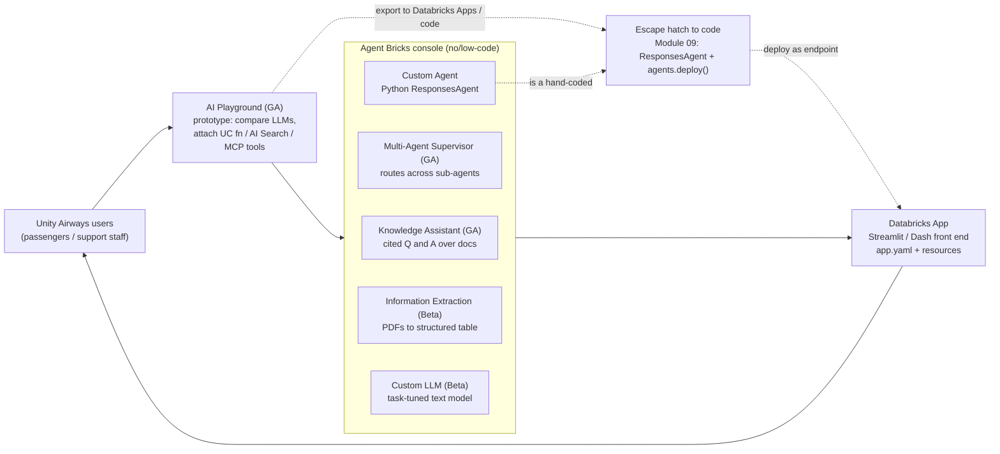
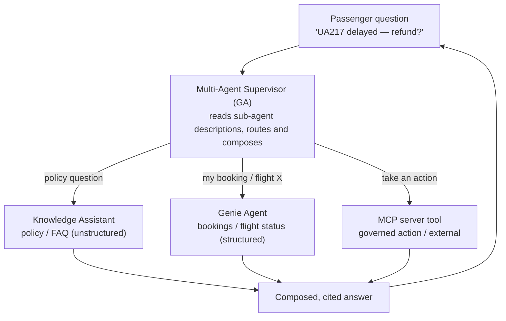

# Agent Bricks and no/low-code agents  ·  Module 10  ·  Topics 10.1–10.8  ·  [Theory + Hands-on]

> **You are here:** Roadmap Module 10 → Agent Bricks and no/low-code agents (all topics 10.1–10.8). This is the **no/low-code counterpart to Module 09**. Instead of hand-coding a `ResponsesAgent`, you build the **Unity Airways** support experience in the **Agent Bricks** console and **AI Playground**, then ship it on **Databricks Apps**.
> **Prerequisites:** **Module 04** (the AI Search index `unity_airways.rag.ua_rag_chunks_index` that a Knowledge Assistant reads), and ideally **Module 03** (the parsed/chunked FAQ docs behind it). Helpful but not required: **Module 05** (the RAG chain a Custom Agent can wrap) and **Module 09** (the hand-coded agent this module lets you skip — and fall back to). Next stop: **Module 11** (serving, Review App, AI Gateway, Databricks Apps auth).

This page is the **module hub**. It carries one numbered entry per topic (10.1–10.8). Two topics are cornerstones (★) with their own deep-dive pages:
- **10.2 ★ — Knowledge Assistant (Agent Bricks)** → `knowledge-assistant.md` / `knowledge-assistant.html`
- **10.5 ★ — Build and deploy a GenAI app on Databricks Apps** → `databricks-apps.md` / `databricks-apps.html`

Everything below builds one running artifact — the same **Unity Airways support experience** from Module 09, but assembled from **console tiles and Python front ends** instead of an agent class. You prototype in **AI Playground** (`databricks-claude-sonnet-4-5`), stand up a cited **Knowledge Assistant** over the Module 04 index, optionally wire several agents together with a **Multi-Agent Supervisor**, and put a chat UI in front of it all on **Databricks Apps** (`CATALOG="unity_airways"`, `SCHEMA="rag"`).

> 📌 **The one rule that shapes this module — start no-code, drop to code only when you hit a wall.**
> Module 09 hand-built the agent. Module 10 is the managed on-ramp, and the order of reach-for is deliberate:
> - **Prototype first in AI Playground (GA).** Compare LLMs side by side and attach tools (UC functions, AI Search, MCP) with no code before you commit to a shape.
> - **Then a console tile.** A **Knowledge Assistant** (GA) for cited document Q&A, a **Multi-Agent Supervisor** (GA) to route across specialists, or **Information Extraction** / **Custom LLM** (both **Beta**) for a narrower task. These build, evaluate, and deploy an endpoint for you.
> - **Escape hatch to code = a Custom Agent.** When the tiles cannot express what you need, you drop back to a Python `ResponsesAgent` (Module 09) and deploy it with `agents.deploy()` or behind a Databricks App. Same governance, more control.
> - **Front end = Databricks Apps.** A managed Python app (Streamlit / Dash / Flask / Gradio) configured by **`app.yaml`**, deployed with the **`databricks apps`** CLI, wired to serving endpoints and warehouses through scoped **resources**.
>
> **Agent Bricks** is the umbrella name for the console tiles (launched **Beta, June 2025**); individual tiles graduate at their own pace, so name the maturity of each one you demo.

---

## TL;DR
- **Agent Bricks** is the **no/low-code** way to build agents on Databricks — a set of console tiles that build, evaluate, and deploy an agent endpoint for you, so you skip the `ResponsesAgent` + `agents.deploy` code from Module 09.
- **Prototype in AI Playground (10.1, GA)**: a no-code chat surface to compare foundation models and attach tools (UC functions, AI Search, MCP), then **"Export to Databricks Apps"** or export to code.
- **Knowledge Assistant (10.2 ★, GA)** is the fast path to the Unity Airways FAQ bot: point it at a **UC-volume folder** of docs or the **Module 04 AI Search index**, add instructions and examples, and it gives you a **cited Q&A** endpoint — no chain to write.
- **Multi-Agent Supervisor (10.3, GA)** is the managed version of Module 09's agents-as-tools: it routes across **Genie Agents** (structured data), **Knowledge Assistants** (unstructured), and **MCP servers** (tools), driven by each sub-agent's description.
- **Custom Agent (10.4)** is the escape hatch back to code; **Databricks Apps (10.5 ★)** is the front end; **10.6** ties the whole low-code journey together; **Information Extraction (10.7, Beta)** turns PDFs into a structured table; **Custom LLM (10.8, Beta)** builds a task-tuned model for summarize/classify/transform/generate.

## The problem
- Module 09 produced a genuinely capable Unity Airways agent — but it took a LangGraph loop, a `ResponsesAgent` wrapper, `resources` for auth passthrough, UC registration, and an `agents.deploy` call. That is the right amount of work for a differentiated production agent. It is far too much for a **Tuesday-afternoon proof of value**.
- A field engineer in front of a customer often needs to answer a different question: *"Can we get a cited chatbot over your policy PDFs, live, before lunch?"* Writing agent code in that window is a non-starter.
- Business users and analysts on the customer side want to **build and tune agents themselves** — pick knowledge sources, edit instructions, add example questions — without opening a notebook.
- And even a great agent endpoint is invisible until someone can **chat with it**. A deployed model has no front door; passengers and support staff need a web app, not an API.

## Why the naive approach fails
- **"Just hand-code every agent like Module 09."** Correct, powerful, and slow. Most early-stage use cases never need a custom LangGraph loop — they need cited Q&A over documents, which a **Knowledge Assistant** does out of the box. Reaching for code first burns the demo window and the customer's patience.
- **"Wire the multi-agent system by hand."** Module 09.9 showed you *can* wrap deployed agents as tools behind a supervisor. Maintaining that routing, the descriptions, the evaluation, and the auth by hand is real work. The **Multi-Agent Supervisor** tile is the managed version — you declare the sub-agents and it handles orchestration.
- **"Ship the endpoint and call it done."** An endpoint is not an application. Without a **Databricks App** front end, only people with API access and a `curl` command can use it. The value story lives in the chat window.
- **"Treat every Agent Bricks tile as production-ready GA."** Some are GA (Knowledge Assistant, Multi-Agent Supervisor, AI Playground); **Information Extraction and Custom LLM are Beta.** Promising Beta features on a production timeline is how demos become escalations.
- **"Use the low-code tiles for everything."** They cover the common shapes, not every shape. When you need custom tool logic, unusual control flow, or a bespoke framework, the honest answer is the **Custom Agent** escape hatch back to Module 09 — not bending a tile until it breaks.

## What it is
- **Plain-language definition:** **Agent Bricks** is a console experience where you build a governed agent by **filling in tiles** instead of writing a class. You choose knowledge sources and sub-agents, describe how the agent should behave, and Databricks builds, evaluates, and serves it. **AI Playground** is the no-code chat surface where you prototype and compare before committing. **Databricks Apps** is the managed platform that hosts the Python web app users actually click.
- **Mental model:** Module 09 is *building the engine*; Module 10 is *assembling the car from parts and bolting on a dashboard*. Same road (Unity Catalog governance, MLflow evaluation, Model Serving underneath), far less fabrication.
- **Where it sits:** the low-code loop is **user → AI Playground (prototype) → Agent Bricks tile (Knowledge Assistant / Supervisor / Custom / Info Extraction / Custom LLM) → Databricks App (front end) → user**, with an **escape hatch to code (Module 09)** whenever a tile is not enough. Everything the tiles produce is a normal Databricks asset: a Model Serving endpoint, UC-governed data, MLflow traces.

## Why it matters (for a Databricks FDE)
- **Time-to-value.** A Knowledge Assistant over a customer's document volume is a same-day win. It is the single best "show, don't tell" for a GenAI conversation, and it needs zero notebook code.
- **The customer can own it.** Because the tiles are console-driven, a business analyst can pick sources, edit instructions, and add examples. That turns a one-off FE demo into something the account maintains and expands.
- **It reuses what earlier modules built.** The Knowledge Assistant reads the **Module 04 AI Search index**; the Supervisor can front the **Module 09 agent** or a **Genie Agent** over the same tables; a Custom Agent can wrap the **Module 05 chain**. Nothing is thrown away — Module 10 is a faster front for the same governed stack.
- **One governance and serving story.** Tiles deploy real Model Serving endpoints, read UC-governed data, and log MLflow traces — the same lifecycle you teach for hand-coded agents. You show a customer one permission and monitoring model across code and no-code.
- It maps to **exam Domain 3 — Application Development** (building and deploying agentic applications) with deployment threads into Domain 5, and it is the low-code answer the certification expects you to know exists alongside the Agent Framework.

## Core concepts
- **Agent Bricks** — the no/low-code agent umbrella in the Databricks console; a set of tiles (launched Beta, June 2025) that build, evaluate, and serve agents for you. See 10.2, 10.3, 10.4, 10.7, 10.8.
- **AI Playground** — the GA no-code chat surface to compare LLMs and prototype tool-calling agents (UC functions, AI Search, MCP), with **"Export to Databricks Apps"** and export-to-code. See 10.1.
- **Knowledge Assistant** — a GA tile for **cited Q&A** over a UC-volume folder of documents or an AI Search index. See 10.2 ★.
- **Multi-Agent Supervisor** (a.k.a. Supervisor Agent) — a GA tile for **managed orchestration** across Genie Agents (structured), Knowledge Assistants (unstructured), and MCP servers (tools). See 10.3.
- **Custom Agent** — the Python `ResponsesAgent` + framework path (Module 09), deployed via `agents.deploy()` or a Databricks App. The escape hatch when tiles are not enough. See 10.4.
- **Databricks Apps** — the managed platform hosting Python web apps (Streamlit / Dash / Flask / Gradio), configured by `app.yaml`, deployed with the `databricks apps` CLI, and wired to serving endpoints / warehouses via scoped **resources**. See 10.5 ★.
- **Information Extraction** *(Beta)* — a tile that turns unstructured docs / PDFs / images into a **structured table** via a generated JSON schema. See 10.7.
- **Custom LLM** *(Beta)* — a tile that builds a **task-tuned model** for domain text tasks (summarize / classify / transform / generate) from your examples. See 10.8.
- **Genie Agent** — natural-language Q&A over Unity Catalog **tables** (structured data); a first-class sub-agent inside the Supervisor. (Formerly "Genie Spaces"; see Module 12 for depth.)

## 🗺️ Visual map

**The low-code path — prototype, build a tile, front it with an app, with an escape hatch to code:**

*Takeaway: the whole Unity Airways experience can be assembled without writing an agent class. AI Playground de-risks the shape, an Agent Bricks tile builds the endpoint, and a Databricks App is the front door. Drop to code (Module 09) only when a tile cannot express the task.*

**Managed orchestration — how a Multi-Agent Supervisor routes one Unity Airways question:**

*Takeaway: the Supervisor is the managed twin of Module 09.9's agents-as-tools. You declare each sub-agent and a description; it does the routing, the multi-step composition, and the citation — no LangGraph loop to maintain.*

---

## 10.1 AI Playground — prototyping agents  ·  [Hands-on]

**AI Playground** (GA) is the no-code chat surface in the workspace where you try ideas before you build anything.

- **Compare models side by side.** Send the same prompt to several foundation models (for Unity Airways, `databricks-claude-sonnet-4-5` is the default chat LLM) and eyeball quality, latency, and cost before committing.
- **Prototype a tool-calling agent with no code.** Attach tools and watch the model decide when to call them:
  - **Unity Catalog functions** (a governed `get_flight_status` lookup),
  - **AI Search** retrieval against `unity_airways.rag.ua_rag_chunks_index` (the Module 04 index),
  - **MCP servers** (managed or external) for reusable, governed tools.
- **Export when it's good.** Playground offers **"Export to Databricks Apps"** to turn the prototype into a hosted chat app, and export-to-code to hand the same setup to a notebook when you want the Module 09 path.

**How to verify it worked:** in the Playground UI, ask *"Is UA217 to Tokyo delayed, and is my booking refundable?"* with the retriever and a UC function attached — you should see the model emit tool calls and cite retrieved chunks in the response. Each turn is captured as an MLflow trace you can open later.

> 💡 **TIP:** Use Playground as the cheap, fast *shape-finding* step. Decide which model, which tools, and roughly what system prompt work here — then move to a Knowledge Assistant (for pure Q&A) or export to Apps/code. It is the lowest-cost way to kill a bad idea before you build it.

---

## 10.2 ★ Knowledge Assistant (Agent Bricks) — cited document Q&A  ·  [Theory + Hands-on]

> **Cornerstone.** Full deep-dive — knowledge sources, instructions and examples, evaluation, endpoint, and embedding it in an app — lives in `knowledge-assistant.md` / `knowledge-assistant.html`. Summary here.

The **Knowledge Assistant** (**GA, Jan 2026**) is the fastest way to the Unity Airways FAQ bot. It is a **cited Q&A chatbot** that you configure, not code.

- **Point it at knowledge.** Either a **Unity Catalog volume folder** of documents (PDF / text — pair it with the `databricks-unstructured-pdf-generation` workflow when you need sample docs) **or** an existing **AI Search index** such as the Module 04 `unity_airways.rag.ua_rag_chunks_index`.
- **Shape its behavior.** Add a **description**, **instructions** (tone, what to cite, when to defer), and **example questions with guidelines** so it answers like a Unity Airways rep. Examples double as an evaluation set.
- **It builds, evaluates, and serves.** The tile provisions an endpoint (status moves `PROVISIONING → ONLINE`), grounds answers in your sources, and returns **citations** — the retrieval-plus-generation pattern of Module 05, with none of the chain code.

**How to verify it worked:** once the endpoint is `ONLINE`, ask a policy question and confirm the answer carries citations back to the source documents; a question with no supporting source should produce a graceful "I don't have that" rather than an invented policy.

> 📌 **IMPORTANT:** A Knowledge Assistant is the no-code twin of the Module 05 RAG chain — reuse the **same AI Search index** so retrieval quality (chunking, embeddings) carries over. If answers are weak, the fix is usually upstream in the index (Module 03/04), not in the tile.

---

## 10.3 Multi-Agent Supervisor (a.k.a. Supervisor Agent) — multi-agent orchestration  ·  [Theory + Hands-on]

The **Multi-Agent Supervisor** (**GA, Feb 2026**) is the managed version of the agents-as-tools pattern you hand-built in Module 09.9. You declare specialist sub-agents; it routes and composes.

- **What it orchestrates:**
  - **Genie Agents** — natural-language questions over Unity Catalog **tables** (structured: bookings, flight-status records),
  - **Knowledge Assistants** — cited answers over **unstructured** docs (policy, FAQ),
  - **MCP servers** — governed **tools** and actions (managed or external).
- **Routing is description-driven.** Each sub-agent gets a **description** that tells the supervisor when to pick it — exactly like a good `tool_description` in Module 09.4. Vague or overlapping descriptions are still the number-one cause of wrong routing.
- **Unity Airways example:** a support supervisor routes *policy* questions to the Knowledge Assistant, *"is my flight delayed / what's my booking"* to a **Genie Agent** over the ops tables, and *actions* (rebook, open a ticket) to an **MCP** tool — then composes a single cited answer.
- **It reuses Module 09.** A deployed Module 09 agent endpoint can be a sub-agent here; so can a Genie Agent from Module 12. The Supervisor is the composition layer, not a rewrite.

> 💡 **TIP:** Give each sub-agent a narrow remit and a crisp description, then test routing with example questions that clearly belong to one specialist. A supervisor with three sharp sub-agents beats one with six overlapping ones — the same lesson as Module 09.9, now enforced through the console.

---

## 10.4 Custom Agents (Agent Bricks) — the escape hatch to code  ·  [Theory + Hands-on]

When the low-code tiles cannot express what you need — custom tool logic, unusual control flow, a specific framework — you drop back to a **Custom Agent**.

- **What it is:** a Python **`ResponsesAgent`** plus your orchestration framework (LangGraph, etc.) — the exact artifact from Module 09.6. You author it in code, not the console.
- **How it deploys:** via **`agents.deploy()`** (→ Model Serving endpoint + Review App + feedback model, Module 09/11) **or** behind a **Databricks App** for a fully custom front end.
- **When to reach for it:** the tiles handle cited Q&A (Knowledge Assistant), routing (Supervisor), and narrow text tasks (Info Extraction, Custom LLM). Anything outside those shapes — bespoke tools, multi-tool loops with custom guardrails, non-standard I/O — is a Custom Agent.
- **It's the same governance.** A Custom Agent registers to Unity Catalog and serves like any other agent, so it sits alongside the tiles in the same permission and monitoring model.

> ⚠️ **GOTCHA:** Don't force a tile to do a Custom Agent's job. If you find yourself fighting the console — hacking instructions to fake tool logic the tile doesn't support — that is the signal to switch to code (Module 09). The escape hatch is a feature, not a failure.

---

## 10.5 ★ Build and deploy a GenAI app on Databricks Apps  ·  [Theory + Hands-on]

> **Cornerstone.** Full deep-dive — `app.yaml` structure, the `databricks apps` CLI (`init` / `validate` / `deploy` / `get`), resources and scoped auth, and wiring a chat UI to the agent endpoint — lives in `databricks-apps.md` / `databricks-apps.html`. Summary here.

**Databricks Apps** is the managed platform that gives your agent a front door. It hosts a Python web app next to your data and governance.

- **Frameworks:** Python — **Streamlit, Dash, Flask, Gradio** (and others). A Streamlit chat UI is the natural front end for the Unity Airways support agent.
- **Configured by `app.yaml`:** the manifest declares how the app runs (the start command) and what it can reach.
- **Deployed with the `databricks apps` CLI:** the loop is `databricks apps create` → `databricks workspace import-dir` (upload the source) → `databricks apps deploy --source-code-path`, then `databricks apps get` to confirm the app is `RUNNING`.
- **Resources with scoped auth:** an app reaches a **serving endpoint** (your agent, or `databricks-claude-sonnet-4-5` directly) and a **SQL warehouse** through declared **resources**, each granted the minimum access it needs. The app runs as its own service principal — auth is scoped, not the developer's personal token.
- **Unity Airways shape:** a Streamlit app with a chat box that calls the deployed agent endpoint via a serving-endpoint resource, in `unity_airways.rag`.

**How to verify it worked:** after `databricks apps deploy`, run `databricks apps get <app-name>` and confirm `app_status.state: RUNNING`, then open the app URL and send a chat message that round-trips to the agent endpoint.

> 📌 **IMPORTANT:** Before scaffolding, decide the **data-access pattern** — most read-only GenAI apps use **Analytics** (queries on a SQL warehouse at read time); reach for **Lakebase synced tables** only when you need sub-second lookups (search, typeahead, real-time by-ID). App **authentication and authorization** (service principal, OAuth scopes, on-behalf-of-user) is covered in Module 11.9.

---

## 10.6 Get started with AI agents end-to-end  ·  [Hands-on]

This is the glue topic — the full low-code journey in one pass, so you can run it as a single demo.

1. **Prototype (10.1):** in **AI Playground**, pick `databricks-claude-sonnet-4-5`, attach the AI Search retriever and a UC function, and confirm the shape works.
2. **Build the agent (10.2 / 10.3):** stand up a **Knowledge Assistant** over the Module 04 index for pure Q&A; if the use case spans structured + unstructured + actions, wrap specialists in a **Multi-Agent Supervisor**.
3. **(If needed) go custom (10.4):** for logic the tiles can't express, author a **Custom Agent** (`ResponsesAgent`, Module 09) and deploy it.
4. **Front it (10.5 ★):** build a **Databricks App** (Streamlit chat) wired to the endpoint via a resource, deploy with the `databricks apps` CLI.
5. **Govern and monitor (Module 11):** the endpoint carries MLflow tracing and monitoring; add a **Review App** for stakeholder feedback and **AI Gateway** guardrails at serving time.

**How to verify it worked:** a stakeholder with only the app URL can ask a Unity Airways question and get a cited answer — no notebook, no API token, no code on their side.

> 💡 **TIP:** Rehearse this path once end-to-end before a customer session. The demo lands hardest when you start in Playground (fast, visual), graduate to a Knowledge Assistant (cited answers), and finish in an app (a real front door) — each step visibly builds on the last.

---

## 10.7 Information Extraction (Agent Bricks) — unstructured docs to a structured table  ·  [Theory + Hands-on]  ·  *(Beta)*

**Information Extraction** (**Beta**) turns a pile of unstructured documents into a clean **structured table** — no parsing code.

- **What it does:** you point it at documents / PDFs / images, it **generates a JSON schema** for the fields you care about, and it extracts each document into rows you can query as a Delta table.
- **Unity Airways example:** scanned **booking confirmations** or **baggage-claim PDFs** → a governed table with columns like `booking_ref`, `passenger_name`, `flight_number`, `claim_amount` — ready for analytics or to feed a Genie Agent.
- **Where it fits:** this is the console-driven cousin of the SQL AI functions `ai_parse_document` / `ai_extract` (Module 03 / Module 11.10). Use the tile for an interactive, schema-guided extraction; use the SQL functions for batch pipelines.

> ⚠️ **GOTCHA:** Information Extraction is **Beta** — label it as such in customer material, expect the UI and schema behavior to change, and verify enrollment before you commit it to a production timeline. For a hardened batch job today, prefer `ai_extract` / `ai_parse_document` in SQL.

---

## 10.8 Custom LLM (Agent Bricks) — domain summarize/classify/transform/generate  ·  [Theory + Hands-on]  ·  *(Beta)*

**Custom LLM** (**Beta**) builds a **task-tuned model** for a specific domain text task, from your examples, without a training pipeline.

- **The four task shapes:** **summarize** (condense complaint threads), **classify** (route support tickets by category / urgency), **transform** (rewrite agent notes into customer-ready text), and **generate** (draft policy-grounded responses).
- **How it works:** you describe the task and provide examples; the tile builds and serves a model tuned for it, so you get better-than-generic quality on the narrow task without managing fine-tuning.
- **Unity Airways example:** a **ticket classifier** that tags each inbound message as `refund / rebooking / baggage / complaint` and a **summarizer** that turns a long thread into a one-line disposition for the support queue.
- **Where it fits:** use it for a **repeated, well-scoped text task** where a general chat model is overkill or inconsistent — distinct from the conversational Knowledge Assistant (Q&A) and the orchestrating Supervisor.

> ⚠️ **GOTCHA:** Custom LLM is **Beta** — same caution as Information Extraction: mark the maturity, verify enrollment, and don't promise it on a production date without checking current docs. For scaled, GA text tasks today, the SQL AI functions (`ai_classify`, `ai_summarize`, `ai_gen`) are the safe alternative (Module 11.10).

---

## Worked example (Unity Airways, low-code, end to end)

Rebuilding the Module 09 support experience without an agent class:

1. **Prototype (10.1):** open **AI Playground**, chat with `databricks-claude-sonnet-4-5`, attach the AI Search retriever over `unity_airways.rag.ua_rag_chunks_index` and a `get_flight_status` UC function. Confirm the model calls tools and cites sources.
2. **Cited Q&A (10.2 ★):** create a **Knowledge Assistant** over the same index (or a UC volume of FAQ PDFs), add instructions and example questions. Now you have a cited support bot endpoint — no chain code.
3. **Compose specialists (10.3):** if the customer needs bookings + policy + actions, add a **Multi-Agent Supervisor** that routes policy → the Knowledge Assistant, *"my flight / booking"* → a **Genie Agent** over the ops tables, and actions → an **MCP** tool.
4. **Go custom only if needed (10.4):** if a required behavior falls outside the tiles, author a **Custom Agent** (`ResponsesAgent`, Module 09) and deploy it — then treat it as another sub-agent or the app's backend.
5. **Enrich data with a tile (10.7 / 10.8, Beta):** use **Information Extraction** to turn scanned booking PDFs into a table for the Genie Agent, and a **Custom LLM** to classify inbound tickets — label both as Beta.
6. **Front end (10.5 ★):** build a **Databricks App** (Streamlit chat) wired to the agent endpoint via a serving-endpoint resource; deploy with the `databricks apps` CLI and confirm `RUNNING`.
7. **Govern and monitor (Module 11):** the endpoints carry tracing and monitoring; add a Review App for feedback and AI Gateway guardrails at serving time.

---

## Uses, edge cases and limitations

| Use it when | Be careful when | Better move |
|---|---|---|
| You need cited Q&A over documents fast | You start writing a RAG chain by hand | Ship a **Knowledge Assistant** (10.2) — reuse the Module 04 index |
| You're deciding model / tools / prompt shape | You commit to code before testing the shape | Prototype in **AI Playground** first (10.1) |
| A task spans structured + unstructured + actions | You hand-wire agents-as-tools yourself | Declare sub-agents in a **Multi-Agent Supervisor** (10.3) |
| A tile can't express the logic | You bend instructions to fake tool behavior | Drop to a **Custom Agent** (10.4, Module 09) |
| Users need to actually chat with the agent | You hand out an endpoint + `curl` | Put a **Databricks App** in front (10.5) |
| You need PDFs as a queryable table, interactively | You need a hardened batch pipeline | **Info Extraction** (Beta) for interactive; `ai_extract` for batch (10.7) |
| You have a repeated, narrow text task | You use a general chat model for everything | **Custom LLM** (Beta) or GA SQL AI functions (10.8) |

## Common mistakes / gotchas
- Reaching for hand-coded agents (Module 09) when a **Knowledge Assistant** would answer the need in an afternoon.
- Treating **Information Extraction** or **Custom LLM** as GA — both are **Beta**; label maturity and verify enrollment.
- Vague or overlapping **sub-agent descriptions** in a Multi-Agent Supervisor → wrong routing (same failure as vague `tool_description` in Module 09.4).
- Building a Knowledge Assistant on a weak index and blaming the tile — retrieval quality lives upstream in chunking/embeddings (Module 03/04).
- Shipping an endpoint with no **Databricks App** front end, so only API users can reach it.
- Forgetting the app **data-access decision** (Analytics vs Lakebase synced tables) before scaffolding, and forgetting that the app runs as a **service principal** with scoped resources — not your token.
- Bending a console tile to do custom tool logic instead of using the **Custom Agent** escape hatch.
- Calling the umbrella by an old name — it is **Agent Bricks**; the routing tile is the **Multi-Agent Supervisor** (a.k.a. Supervisor Agent).

## > 📌 IMPORTANT callouts
- **Start no-code, drop to code only when a tile can't do it.** AI Playground → Agent Bricks tile → Databricks App is the default path; the Custom Agent (Module 09) is the escape hatch.
- **Name the maturity of every tile you demo.** GA: AI Playground, Knowledge Assistant, Multi-Agent Supervisor. **Beta:** Information Extraction, Custom LLM. **Agent Bricks** itself launched Beta (June 2025).
- **Module 10 reuses, it doesn't replace.** The Knowledge Assistant reads the Module 04 index; the Supervisor can front the Module 09 agent and Genie Agents; a Custom Agent can wrap the Module 05 chain.

## > 💡 TIP
- Prototype the *shape* in Playground before you build anything — it's the cheapest way to kill a bad idea.
- Reuse the **same AI Search index** for the Knowledge Assistant that Module 05 used for the chain, so retrieval quality carries over.
- Give Supervisor sub-agents narrow remits and crisp descriptions; test routing with unambiguous example questions.
- Default a read-only app to **Analytics** (SQL warehouse) data access; reach for Lakebase synced tables only for sub-second lookups.

## > ⚠️ GOTCHA
- **Beta means Beta** — Information Extraction and Custom LLM can change and may need enrollment; prefer GA SQL AI functions for hardened pipelines today.
- Doc pages for these products are JS-rendered; a plain fetch may return empty. **Verify current GA/Beta status and URLs live before a customer commitment** (live re-check pending at authoring).
- An endpoint is not an app — without a Databricks App, the agent has no front door.

## 📝 Notes
- _Space for your own notes as you work through the module._

**Self-check (5 questions)**
1. What is the default no/low-code path in this module, and where is the escape hatch to code? Name the umbrella product and its launch maturity.
2. Which two Agent Bricks tiles are cornerstones here, and what does each produce? Which existing Unity Airways asset does the Knowledge Assistant reuse?
3. What does a Multi-Agent Supervisor orchestrate across, and what drives its routing? How does that map to Module 09.9?
4. Which two tiles are **Beta**, and what does each do? What GA alternative would you prefer for a hardened batch pipeline?
5. Name the config file and the CLI for Databricks Apps, and explain how an app reaches a serving endpoint securely.

## How this maps to the certification
- **Application Development** (exam Domain 3): building and deploying agentic applications with Databricks tooling — Agent Bricks (Knowledge Assistant, Multi-Agent Supervisor), AI Playground prototyping, and Databricks Apps as the deployment surface, alongside the Agent Framework path from Module 09.
- **Deployment / governance threads** (Domain 5): tiles deploy Model Serving endpoints, read UC-governed data, and carry MLflow tracing/monitoring — the same lifecycle as hand-coded agents.
- Exam-relevant facts this module nails: **Agent Bricks** is the no/low-code umbrella (Beta, June 2025); **Knowledge Assistant** = cited Q&A over a UC volume or AI Search index (GA); **Multi-Agent Supervisor** = managed orchestration across Genie Agents / Knowledge Assistants / MCP servers (GA); **AI Playground** = no-code prototyping + "Export to Databricks Apps" (GA); **Information Extraction** and **Custom LLM** are **Beta**; **Databricks Apps** hosts Python apps via `app.yaml` + the `databricks apps` CLI with scoped resources.

## Sources
- 📎 **Project cheat-sheet (primary for this module)** — `.claude/skills/genai-teacher/references/naming-conventions.md` **§2 Agent Bricks** (verified July 2026): **Agent Bricks** launched **Beta, June 2025**; **Knowledge Assistant GA (Jan 2026)** — cited Q&A over a UC-volume folder or AI Search index; **Multi-Agent Supervisor GA (Feb 2026)** — managed orchestration across Genie Agents (structured), Knowledge Assistant (unstructured), MCP servers (tools); **Information Extraction Beta** — docs/PDFs/images → structured table via generated JSON schema; **Custom LLM Beta** — domain summarize/classify/transform/generate; **Custom Agents** — Python `ResponsesAgent` + framework via `agents.deploy()` or Databricks Apps; **AI Playground GA** — compare LLMs, prototype tool-calling agents (UC functions, AI Search, MCP), "Export to Databricks Apps." §2 also notes Databricks Apps deployment is increasingly recommended for new use cases.
- 🧩 **Skill — `databricks-agent-bricks`**: `manage_ka` (Knowledge Assistant), `manage_mas` (Multi-Agent Supervisor — sub-agents via `ka_tile_id` / `genie_space_id` / `endpoint_name` / `uc_function_name` / `connection_name`, each with a routing `description`), provisioning states `PROVISIONING → ONLINE`, and reuse of Genie Spaces / model-serving endpoints as sub-agents.
- 🧩 **Skill — `databricks-apps`**: `app.yaml` manifest; `databricks apps` CLI (`create` / `deploy --source-code-path` / `get` / `logs` / `start` / `stop`); the **Analytics vs Lakebase synced-tables** data-access decision gate; non-AppKit Python frameworks (Streamlit / FastAPI / Flask / Gradio / Dash); apps run as a service principal with scoped **resources** (serving endpoints, SQL warehouses).
- 🌐 **Databricks Docs** (verify live — pages are JS-rendered and returned empty body / a 301 to a non-browser fetch at authoring; **live re-check pending**): Knowledge Assistant `docs.databricks.com/aws/en/generative-ai/agent-bricks/knowledge-assistant`; Multi-Agent Supervisor `.../agent-bricks/multi-agent-supervisor`; AI Playground `docs.databricks.com/aws/en/large-language-models/ai-playground` (HTTP 200 confirmed); Information Extraction `docs.databricks.com/aws/en/agents/agent-bricks/info-extraction` (301 redirect confirmed); Custom LLM `.../agent-bricks/custom-llm`; Databricks Apps `docs.databricks.com/aws/en/dev-tools/databricks-apps/`.
- 📘 **B1 — *Practical MLflow for GenAI on Databricks*** (Early Release): the concepts Module 10's managed tiles build on — **Ch 7** agents-as-tools / multi-agent orchestration (the DIY twin of the Multi-Agent Supervisor) and MCP servers as tools; **Ch 8** `agents.deploy()` for the Custom Agent path. *(The books predate Agent Bricks / AI Playground / Databricks Apps by name — those are grounded in the cheat-sheet, skills, and docs above.)*
