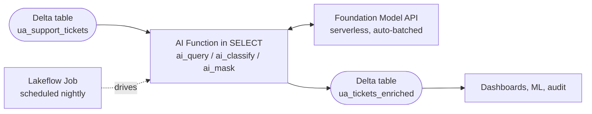
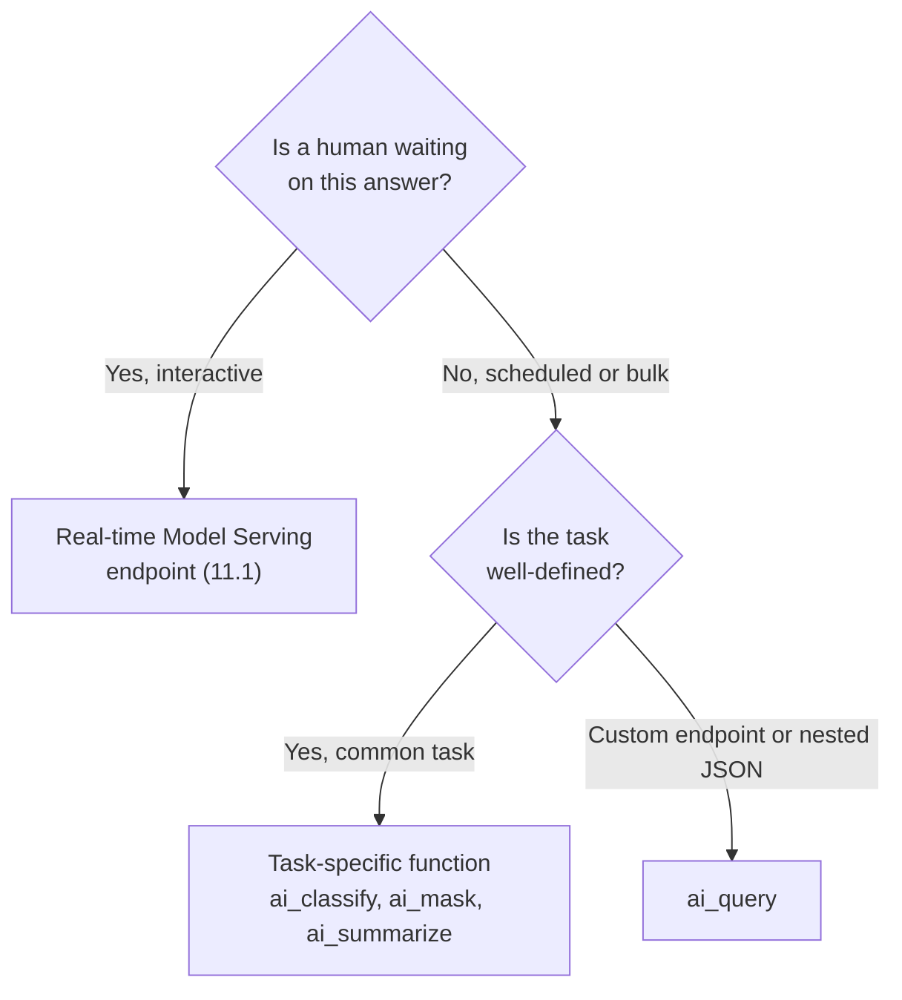

# AI Functions for GenAI at scale  ·  Module 11 · Topic 11.10 (★ cornerstone)  ·  [Theory] + [Hands-on]

> **You are here:** Roadmap Module 11 → 11.10 (cornerstone deep-dive). You have a Model Serving endpoint (11.1) and, from Module 09, a deployed Unity Airways agent. Those answer *one request at a time*. This topic is the other half of serving: running a model over a **whole Delta table** in SQL, at batch scale.
> **Prerequisites:** a Databricks SQL warehouse (Pro or Serverless) *or* a cluster on DBR 15.1+; a Unity Catalog schema you can write to; basic SQL. Helpful: Module 03 (you already met `ai_parse_document` / `ai_extract` there for RAG **data prep** — here the angle is **batch inference / enrichment at scale**).
> **Feeds into:** 11.11 (schedule these as a Lakeflow Job), and Module 16 (deep cost/throughput tuning).

## TL;DR
- **AI Functions** are built-in SQL functions that call Foundation Models straight from a query. No endpoint to create, no API key, no client code. They read a column like `UPPER()` reads a column.
- **`ai_query`** is the general workhorse: point it at any served model (a Foundation Model or your own agent endpoint) and run a prompt over every row. Ask for **structured JSON** with `responseFormat` or `returnType`.
- The **task-specific functions** (`ai_classify`, `ai_analyze_sentiment`, `ai_extract`, `ai_mask`, `ai_summarize`, `ai_translate`, `ai_fix_grammar`, `ai_gen`) are pre-tuned one-liners. Prefer them over `ai_query` when the task fits.
- **`vector_search`** queries a Databricks AI Search index from SQL, so retrieval joins your data instead of living only in Python.
- **The pattern is the same every time:** Delta table in, AI Function in the `SELECT`, Delta table out, scheduled by a Lakeflow Job. This is batch inference, not a chatbot: use it when nobody is waiting on the answer.

## The problem
- Unity Airways collects tens of thousands of support tickets, app-store reviews, and call transcripts every week. All of it lands in one Delta table, `unity_airways.rag.ua_support_tickets`.
- The support ops team wants each ticket **routed** (billing vs baggage vs delay), **scored for sentiment**, **stripped of PII** before analysts see it, and **summarized** into one line for the daily queue.
- Doing this by hand does not scale. Doing it with a real-time chatbot is the wrong tool: there is no human in the loop, the volume is huge, and the job runs on a schedule overnight.
- The team lives in SQL and Delta. They do not want to stand up a Python service, wire an OpenAI client, manage retries, or babysit a serving endpoint just to add a "sentiment" column.

## Why the naive approach fails
- **Naive move 1: loop row-by-row through a serving endpoint in Python.** You now own batching, concurrency limits, retry/backoff, checkpointing, and a long-running notebook. One transient 429 and the job dies at row 40,000. This is real infra work for what should be a `SELECT`.
- **Naive move 2: point a real-time Model Serving endpoint at the whole table.** Real-time endpoints are tuned for low latency on small, individual requests. Firing millions of rows at one is slow, expensive, and starves the interactive traffic the endpoint actually exists for. The book is blunt: `ai_query()` "is not appropriate for low-latency use cases such as chat applications" and, conversely, chat endpoints are the wrong home for bulk transforms.
- **Naive move 3: export to a third-party API.** Now your customer data leaves the governance boundary, you manage an API key as a standing secret, and cost/usage is invisible to the platform.
- Root cause in one line: **batch inference over a table is a data-engineering problem, and Databricks SQL is already the batch engine** — so express it in SQL and let the platform handle parallelism, retries, and scaling.

## What it is
- **AI Functions** are SQL (and PySpark-`expr`) functions that Databricks runs against Foundation Model APIs for you. Three families:
  - **General:** `ai_query` — any served model, any prompt, optional structured output.
  - **Task-specific:** `ai_classify`, `ai_analyze_sentiment`, `ai_extract`, `ai_gen`, `ai_mask`, `ai_summarize`, `ai_translate`, `ai_fix_grammar`, `ai_similarity`, `ai_parse_document`. Pre-tuned for one job each.
  - **Table-valued:** `ai_forecast` (time-series). Plus `vector_search`, which queries an AI Search index.
- **`ai_query` offloads inference to Databricks SQL compute.** The SQL engine handles parallelism, task distribution, and retries. Because it runs in batch mode, the job scales horizontally across compute. Each row of the input becomes one model request.
- It is **deterministic, repeatable inference on tables** — not conversation. `ai_query` does **not** support conversational state, tool-calling, or multi-step agent workflows. That is what your Module 09 agent endpoint is for (and you can still *call* that endpoint from `ai_query`).

## Why it matters (for a Databricks FDE)
- This is the "AI as a column" story that lands in almost every data-engineering conversation. Analysts already know SQL; AI Functions let them add classification, extraction, and summarization without learning an ML stack.
- **It reuses the customer's existing platform.** Same warehouse, same Delta tables, same Unity Catalog governance, same cost reporting. Nothing new to secure.
- **It scales the boring 80%.** Most enterprise GenAI value is not a fancy agent; it is enriching millions of rows reliably and cheaply. AI Functions are the fastest path to that.
- **It shows up on the certification.** The exam explicitly asks you to "identify batch inference workloads and apply `ai_query()`" and to choose `ai_query` vs Model Serving correctly.

## Core concepts
- **`ai_query(endpoint, request, ...)`** — call a served model over a column. `endpoint` is a Foundation Model name (e.g. `databricks-claude-sonnet-4-5`) *or* your own custom/agent endpoint name. `request` is the prompt string (or a STRUCT for custom ML endpoints).
- **Structured output** — force JSON so the result is queryable, not prose. Two ways: `responseFormat => '{"type":"json_object"}'` (chat models, DBR 15.4+) or `returnType => '<DDL schema>'` (parses the response like `from_json`, DBR 15.2+).
- **`failOnError => false`** — the batch-safety switch. Instead of blowing up the whole job on one bad row, each row returns a STRUCT `{response, errorMessage}` so you can route failures to a sidecar table.
- **`modelParameters => named_struct('temperature', 0.0, 'max_tokens', 500)`** — control sampling; set `temperature=0` for repeatable extraction.
- **Task-specific functions** — no endpoint argument. Databricks picks and tunes the model. `ai_classify(text, labels)`, `ai_mask(text, entities)`, etc.
- **`vector_search(index => ..., query_text => ..., num_results => ...)`** — retrieve top-k chunks from a Databricks AI Search index inside a SQL query.
- **The write-back** — results land in a new or existing Delta table so dashboards, ML pipelines, and audit systems consume structured columns, not model calls.
- **Warehouse vs cluster** — AI Functions run on a **Pro or Serverless SQL warehouse** or a DBR 15.1+ cluster. `ai_forecast` needs Pro/Serverless; `ai_parse_document` needs DBR 17.3+ (or serverless).

## 🗺️ Visual map

**The batch pattern (this repeats for every AI Function):** a Delta table goes in, an AI Function in the `SELECT` calls the Foundation Model API (serverless, auto-batched), and the enriched rows are written back to Delta. A Lakeflow Job drives it on a schedule.



**The routing decision — batch AI Function vs real-time endpoint:** the first question is always "is a human waiting?"



## How it works — deep dive

### 1. Each row becomes one request [Theory]
- When you call an AI Function in a `SELECT`, Databricks turns **each row into a separate model request** and submits them in bulk. The SQL engine spreads the work across compute and handles distribution and retries for you.
- This is why it scales to millions of rows and why it is *offline*: throughput matters, per-row latency does not. Seconds-to-minutes end-to-end is expected and fine.
- Keep the prompt format consistent with the endpoint's contract — pass the user text (and any retrieved context) in a predictable structure so results are comparable across rows.

### 2. `ai_query` vs the task-specific functions [Theory]
- **Prefer a task-specific function when one fits.** They are pre-tuned, need no model choice, and read cleanly. `ai_analyze_sentiment(text)` beats a hand-written sentiment prompt through `ai_query`.
- **Reach for `ai_query` when:** you need a **custom endpoint** (your Unity Airways agent, a fine-tuned model), **nested JSON** output, **multimodal** input (`files =>`), or explicit **sampling control**.

| Task | Use this | Reach for `ai_query` when... |
|---|---|---|
| Sentiment | `ai_analyze_sentiment` | never |
| Fixed-label routing | `ai_classify` (2–500 labels) | never |
| Field / entity extraction | `ai_extract` | output has deeply nested arrays |
| Summarization | `ai_summarize` (`max_words=0` = uncapped) | never |
| PII redaction | `ai_mask` | never |
| Translation | `ai_translate` | target language not in the supported set |
| Grammar fix | `ai_fix_grammar` | never |
| Free-form generation | `ai_gen` | you need structured JSON |
| Anything on a custom/fine-tuned endpoint | — | **this is `ai_query`'s job** |

### 3. Structured output — get columns, not prose [Theory + Hands-on]
- Free-text answers are hard to query. Force JSON and Databricks parses it into a struct you can select fields from.
- `responseFormat => '{"type":"json_object"}'` is the modern path for chat models (DBR 15.4+). `returnType => '<DDL>'` structures the parsed response directly (DBR 15.2+).
- Always pair batch `ai_query` with `failOnError => false` so a single malformed response does not fail 2 million rows.

### 4. Batch vs real-time serving [Theory]
- From the study guide, `ai_query` fits workloads with three traits: **large datasets** (thousands to millions of rows), **no synchronous interaction** (a nightly or hourly job is fine), and a **consistent, SQL-expressible schema**.

| | Suitable for `ai_query` | Not suitable — use Model Serving (11.1) |
|---|---|---|
| Timing | Scheduled / recurring / batch | User-driven, real-time |
| Data size | Large tables, bulk | Small, individual requests |
| Latency | Seconds to minutes OK | Must answer in milliseconds |
| Examples | Enrichment, embeddings, eval pipelines | Chatbots, live RAG, support agents |
| Runs on | SQL warehouse / DBSQL job | Model Serving endpoint |

## How to do it on Databricks [Hands-on]

**Set up the running example.** One Delta table of raw Unity Airways feedback:

```sql
-- Unity Airways raw feedback (support tickets, reviews, transcripts)
CREATE TABLE IF NOT EXISTS unity_airways.rag.ua_support_tickets (
  ticket_id     BIGINT,
  received_at   TIMESTAMP,
  channel       STRING,   -- 'email' | 'chat' | 'app_review' | 'call_transcript'
  language      STRING,   -- ISO code, e.g. 'en','es','fr'
  raw_text      STRING    -- the customer's message / review body (may contain PII)
);
```

**Enrich the whole table in one pass** with task-specific functions:

```sql
CREATE OR REPLACE TABLE unity_airways.rag.ua_tickets_enriched AS
SELECT
  ticket_id,
  received_at,
  channel,
  -- route the ticket to a queue (labels with descriptions = better accuracy)
  ai_classify(
    raw_text,
    '{"baggage":"lost, delayed, or damaged luggage",
      "delay":"flight delays, cancellations, missed connections",
      "billing":"refunds, charges, fare disputes",
      "other":"anything else"}'
  )                                              AS intent,
  ai_analyze_sentiment(raw_text)                 AS sentiment,   -- positive|negative|neutral|mixed
  ai_summarize(raw_text, 20)                     AS one_liner,   -- <=20 words for the queue
  -- redact PII BEFORE analysts or downstream tables ever see it
  ai_mask(raw_text, ARRAY('person','email','phone','address')) AS safe_text
FROM unity_airways.rag.ua_support_tickets
WHERE raw_text IS NOT NULL;   -- functions return NULL on NULL input; filter to save calls
```

> How to verify it worked: `SELECT intent, sentiment, count(*) FROM unity_airways.rag.ua_tickets_enriched GROUP BY 1,2 ORDER BY 3 DESC;` — you should see sensible buckets (many `delay` + `negative`) and no raw names/emails left in `safe_text`.

**`ai_query` with structured JSON** when you need multiple fields at once:

```sql
CREATE OR REPLACE TABLE unity_airways.rag.ua_tickets_structured AS
SELECT
  ticket_id,
  ai_query(
    'databricks-claude-sonnet-4-5',
    CONCAT(
      'Extract as JSON with keys intent, urgency (1-5), refund_requested (bool), ',
      'affected_flight. Ticket: ', raw_text
    ),
    responseFormat => '{"type":"json_object"}',
    failOnError     => false,            -- batch safety: no single row kills the job
    modelParameters => named_struct('temperature', CAST(0.0 AS DOUBLE), 'max_tokens', 300)
  ) AS ai_response
FROM unity_airways.rag.ua_support_tickets
WHERE raw_text IS NOT NULL;

-- parse the JSON into real columns and split off failures
SELECT
  ticket_id,
  from_json(ai_response.response,
            'STRUCT<intent:STRING, urgency:INT, refund_requested:BOOLEAN, affected_flight:STRING>') AS fields,
  ai_response.errorMessage AS error
FROM unity_airways.rag.ua_tickets_structured;
```

**Point `ai_query` at your own agent endpoint** (the Unity Airways `ResponsesAgent` deployed in Module 09) instead of a Foundation Model — same function, custom endpoint name:

```sql
SELECT ticket_id,
       ai_query('ua-support-agent',               -- your custom Model Serving endpoint (name from 11.1)
                CONCAT('Draft a reply to: ', raw_text),
                failOnError => false).response AS draft_reply
FROM unity_airways.rag.ua_support_tickets
WHERE raw_text IS NOT NULL;
```

**`vector_search` from SQL** — retrieve policy chunks relevant to each ticket, joining retrieval into your data:

```sql
SELECT
  t.ticket_id,
  vector_search(
    index       => 'unity_airways.rag.ua_rag_chunks_index',
    query_text  => t.raw_text,
    num_results => 3
  ) AS top_policy_chunks
FROM unity_airways.rag.ua_support_tickets t
WHERE t.raw_text IS NOT NULL;
```

**Translate and grammar-fix** for the global inbox and free-form generation for outbound copy:

```sql
SELECT
  ai_translate(raw_text, 'en')                 AS text_en,      -- to English
  ai_fix_grammar(raw_text)                     AS text_clean,   -- tidy user-generated text
  ai_gen(CONCAT('Write a one-line apology for: ', raw_text)) AS apology_line
FROM unity_airways.rag.ua_support_tickets
WHERE raw_text IS NOT NULL AND channel = 'app_review';
```

**The same call from PySpark** (identical function, wrapped in `expr`):

```python
from pyspark.sql.functions import expr

(spark.table("unity_airways.rag.ua_support_tickets")
      .filter("raw_text IS NOT NULL")
      .withColumn("sentiment", expr("ai_analyze_sentiment(raw_text)"))
      .withColumn("intent",    expr("ai_classify(raw_text, array('baggage','delay','billing','other'))"))
      .write.mode("overwrite").saveAsTable("unity_airways.rag.ua_tickets_enriched"))
```

**Schedule it (preview of 11.11).** Save the enrichment SQL as a query and attach it to a **Lakeflow Job** with a nightly trigger, or wrap the PySpark in a notebook task. The job re-runs the same `SELECT` against new rows and appends to `ua_tickets_enriched`. That is the whole production loop.

## Worked example — Unity Airways nightly enrichment
1. **Prepare the Delta table.** Raw feedback streams into `unity_airways.rag.ua_support_tickets` (from Auto Loader / Lakeflow Connect).
2. **Enrich in bulk.** The nightly job runs the `ua_tickets_enriched` query above: classify intent, score sentiment, summarize, and mask PII in one pass over the day's new tickets.
3. **Store back into a structured table.** Results land in `ua_tickets_enriched` (and failures, if any, in a sidecar filtered on `ai_response.errorMessage IS NOT NULL`).
4. **Consume it.** The support dashboard reads `intent` + `sentiment` counts; analysts see only `safe_text`; a downstream model trains on the structured columns. No one ever calls a model directly.

This is exactly the book's three-step batch pattern: prepare a Delta table → submit prompts in bulk with `ai_query` (or task functions) → store responses back into structured tables.

## Uses, edge cases & limitations
- **Use it for:** content enrichment, classification/routing, PII redaction, summarization, translation, embedding refresh, and offline eval pipelines over large tables.
- **Do not use it for:** anything a user is actively waiting on. Chatbots, live RAG, and interactive assistants belong on a real-time endpoint (11.1).
- **NULL in, NULL out.** Every function returns `NULL` when the input is `NULL`. Filter `WHERE col IS NOT NULL` first — it also saves you the wasted calls.
- **`ai_translate` supported languages:** a fixed set of common languages (check the `ai_translate` function reference for the current list). For anything outside it, use `ai_query` with a multilingual model.
- **`ai_classify`:** 2–500 labels; add short descriptions for ambiguous categories and set `multilabel => "true"` when a ticket can have several.
- **Runtime gates:** `responseFormat` needs DBR 15.4+, `returnType` 15.2+, `failOnError`/`modelParameters` 15.3+, `ai_parse_document` 17.3+, `ai_forecast` a Pro/Serverless warehouse.

## Common mistakes / gotchas
- **Forgetting `failOnError => false` in a batch job.** One bad row raises and the whole run fails. Always set it for scheduled `ai_query`, then split errors into a sidecar table.
- **Reaching for `ai_query` when a task function exists.** More prompt engineering, worse accuracy, more tokens. Check the routing table first.
- **Treating `ai_query` like a chatbot.** No memory, no tools, no multi-turn. If you need those, call your deployed *agent* endpoint (which has them) from `ai_query`, or use Model Serving directly.
- **Not estimating cost first.** Batch inference "can quickly accumulate costs when applied to very large datasets." Estimate token usage, filter aggressively, and test on a `LIMIT` sample before the full table.
- **Hardcoding a stale model name.** Served-model names churn. Confirm the exact endpoint on the supported-models page before you ship.

## > 📌 IMPORTANT
> - **`ai_query` is batch inference on tables, not a chat API.** It has no conversational state, tool-calling, or multi-step logic. Match the workload to the engine: bulk/scheduled → AI Functions; a human waiting → Model Serving (11.1).
> - **Prefer a task-specific function** (`ai_classify`, `ai_mask`, ...) whenever the task fits; drop to `ai_query` only for custom endpoints, nested JSON, multimodal, or sampling control.
> - **The pattern never changes:** Delta in → AI Function in `SELECT` → Delta out → Lakeflow Job on a schedule.

## > 💡 TIP
> - Develop on a sample: `... FROM ua_support_tickets WHERE raw_text IS NOT NULL LIMIT 200`. Confirm the output shape and cost, *then* remove the `LIMIT`.
> - Set `temperature => 0.0` via `modelParameters` for extraction/classification so re-runs are reproducible and diffable.
> - Wrap a common `ai_query` prompt in a **SQL UDF** (`CREATE FUNCTION ... RETURN ai_query(...)`) so analysts call `classify_ticket(text)` and you can swap the model in one place.

## > ⚠️ GOTCHA
> - **Model name drift.** Older docs show `databricks-claude-sonnet-4`; a current valid snapshot is `databricks-claude-sonnet-4-5` (newer Claude Sonnet/Opus revisions may also be listed). Endpoint names change often — **verify on the supported-models page at authoring time** and never guess. The embedding default here is `databricks-gte-large-en` (the book's Example 9-7 uses `databricks-bge-large-en`; both are valid Databricks-hosted embedding endpoints).
> - **Warehouse type matters.** AI Functions want a **Pro or Serverless** SQL warehouse (not Classic/Starter). `ai_forecast` in particular fails on Classic.
> - **Structured-output arg names are version- and doc-verified:** both `responseFormat` and `returnType` appear on the current `ai_query` reference page. If you hit an older runtime, `responseFormat` may be unavailable — fall back to `returnType` or prompt for JSON and parse with `from_json`.

## 📝 Notes
_Your space. Jot the one query you would actually ship for a customer this week._

**5-question self-check**
1. A support-team chatbot needs to answer in under a second. Is `ai_query` the right tool? Why or why not?
2. You must extract `intent`, `urgency`, and `refund_requested` from each ticket as queryable columns. Which `ai_query` argument makes the output JSON, and how do you turn it into columns?
3. Why should every batch `ai_query` set `failOnError => false`, and where do the failures go?
4. Name three tasks where you would pick a task-specific function over `ai_query`, and one where you must use `ai_query`.
5. What are the three workload characteristics that make a job a good fit for `ai_query` (per the study guide)?

## How this maps to the certification
- Directly on the exam blueprint: **"Identify batch inference workloads and apply `ai_query()`"** and choosing `ai_query` vs Model Serving by workload traits.
- Covered in **📗 B2 Ch5** ("Batch Inference Workloads with `ai_query`", the 3-step Delta→bulk→Delta pattern) and **📗 B2 Ch9** ("`ai_query()`" high-throughput section, Example 9-7, Table 9-12 workload suitability).
- Related domains: data prep for RAG (Module 03 `ai_parse_document`/`ai_extract`) and deployment/serving trade-offs (11.1).

## Sources
- 📗 **B2** — *Databricks Certified Generative AI Engineer Associate Study Guide*: Ch5 "Batch Inference Workloads with `ai_query`" (Example 5-12); Ch9 "`ai_query()`" (Example 9-7 batch embeddings; Table 9-12 workload suitability). Exam blueprint: "Identify batch inference workloads and apply `ai_query()`."
- 🌐 Enrich data using AI Functions — https://docs.databricks.com/aws/en/large-language-models/ai-functions *(live-confirmed function list: ai_query, ai_classify, ai_analyze_sentiment, ai_extract, ai_gen, ai_mask, ai_summarize, ai_translate, ai_fix_grammar, ai_similarity, ai_parse_document, ai_forecast, ai_prep_search [Beta], vector_search)*
- 🌐 `ai_query` function reference — https://docs.databricks.com/aws/en/sql/language-manual/functions/ai_query *(live-confirmed args: returnType, responseFormat, failOnError, modelParameters, files)*
- 🌐 `vector_search` function reference — https://docs.databricks.com/aws/en/sql/language-manual/functions/vector_search *(live-confirmed signature: `vector_search(index => , query_text => , num_results => , query_vector => )`)*
- 🌐 Task function references — https://docs.databricks.com/aws/en/sql/language-manual/functions/ (`ai_classify`, `ai_mask`, `ai_summarize`, `ai_translate`, `ai_analyze_sentiment`, `ai_extract`, `ai_gen`, `ai_fix_grammar`, `ai_similarity`)
- 🌐 Foundation Model APIs — supported models — https://docs.databricks.com/aws/en/machine-learning/foundation-model-apis/supported-models *(confirm endpoint names before shipping)*
- Project skill: `.claude/skills/genai-teacher/references/naming-conventions.md` §4–§5 (current AI Functions + Model Serving naming).
