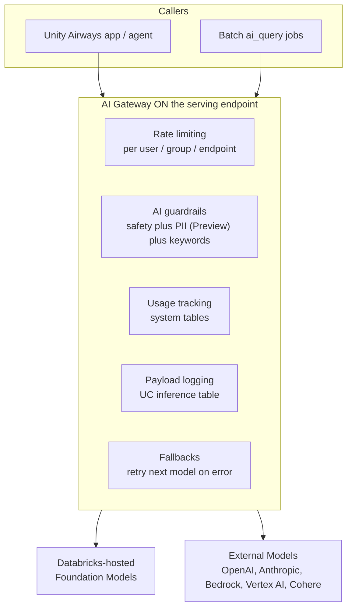
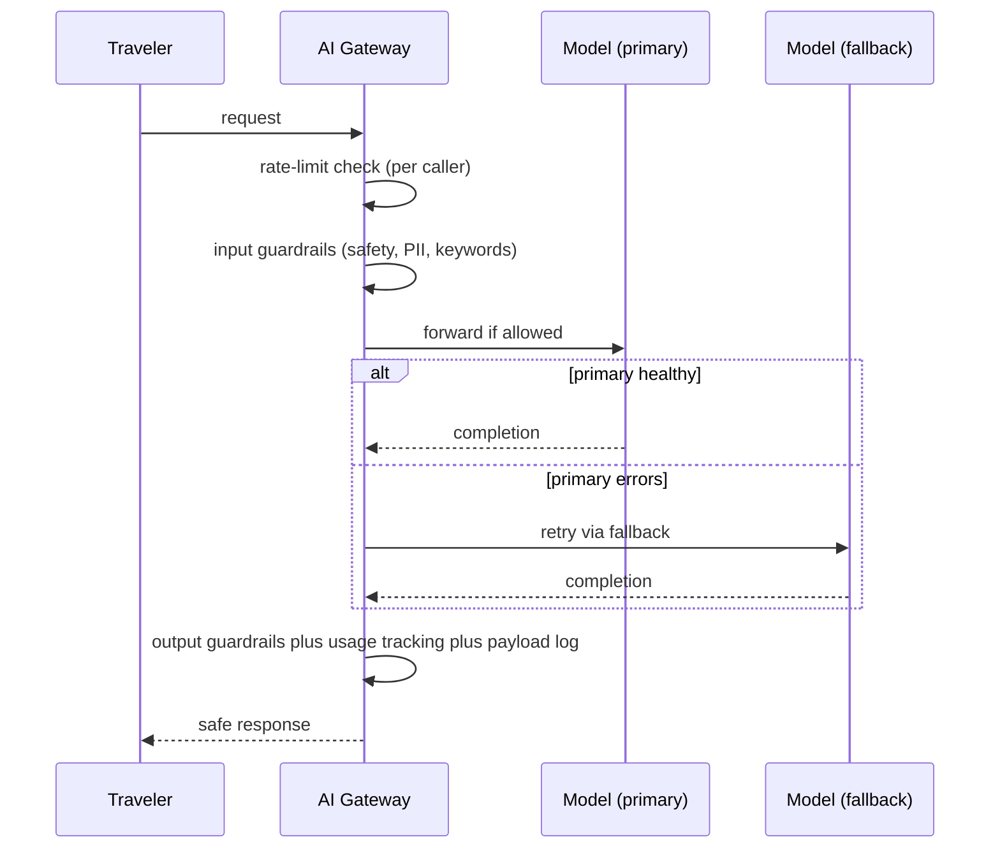

# AI Gateway  ·  Module 11 · Topic 11.3  ·  [Theory + Hands-on] ★

> **You are here:** Roadmap Module 11 → 11.3 (cornerstone deep-dive).
> **Prerequisites:** 11.1 (the Unity Airways agent is live as a Model Serving endpoint, `unity_airways.rag.ua_support_agent`, chat model `databricks-claude-sonnet-4-5`). Helpful: Module 04 (external models), Module 10 (agents). This is the *gateway/endpoint-config* angle; the **guardrails deep-dive lives in 12.2**, monitoring in **Module 13**, cost control in **Module 16**.

## TL;DR
- **AI Gateway is a governance layer that sits in front of a Model Serving endpoint.** It adds rate limiting, safety and PII guardrails, usage tracking, payload logging, and provider fallbacks without touching your app code.
- You turn it on per endpoint. In the UI it is the endpoint's **AI Gateway** tab; in code it is one call: **`w.serving_endpoints.put_ai_gateway(name, ...)`** (signature verified against the current `databricks-sdk`).
- It works for both **Databricks-hosted Foundation Models** and **External Models** (OpenAI, Anthropic, Amazon Bedrock, Google Vertex AI, Cohere, and more), so you can swap or fail over models behind a stable endpoint.
- **PII detection/redaction is Preview.** Safety filtering, rate limits, usage tracking, payload logging, and fallbacks are the established feature set.
- **Unity AI Gateway (Beta)** is the go-forward direction: richer UI and observability, governance of MCP servers and other agent surfaces, and **budget management** (spend thresholds and hard cost caps).

## The problem
- Your agent from 11.1 answers traveler questions reliably, but the endpoint still talks straight to an LLM with no controls in front of it.
- The moment it leaves your notebook and real users (or a batch `ai_query` job) hit it, five questions land on your desk at once:
  - Who is allowed to call it, and how often, before one script drains the token budget?
  - How do we stop the model from leaking a passenger's passport number or answering an off-topic, unsafe prompt?
  - Where do we see spend, latency, and error rates per team?
  - Can we keep the raw request/response payloads to debug and to build an eval set later?
  - What happens when the upstream provider has an outage at 2am?
- An FDE hears these in every "we built a POC, now make it production" conversation. AI Gateway is the standard answer.

## Why the naive approach fails
- **Wiring controls into the app.** You could add rate-limit code, a PII regex, and a logging call inside `app.py`. Now every app re-implements it, each slightly differently, and none of it is governed centrally.
- **Managing provider keys yourself.** Calling OpenAI or Anthropic directly means storing each provider's API key, matching each provider's request format, and editing code every time you switch models. The book calls this the tightly coupled trap: it "risks breaking the moment we want to swap to another model."
- **No shared view.** Cost and traffic get tracked per project, so the platform team has no single place to see consumption or enforce policy.
- The fix is to move these concerns **out of the app and onto the endpoint**, where one config governs every caller.

## What it is
- **Plain-language definition:** AI Gateway is a set of governance and reliability features you attach to a Model Serving endpoint. Requests flow *through* the gateway, which enforces limits, filters unsafe content, logs traffic, tracks usage, and can fail over to a backup model before returning the response.
- **Mental model:** think of it as the **reverse proxy / API gateway** you would put in front of any production API, purpose-built for LLM endpoints and wired into Unity Catalog. Same idea as an nginx or Kong in front of a web service, but it speaks "LLM" and writes to Delta.

## Why it matters (for a Databricks FDE)
- It is the difference between a demo endpoint and a governed one. This is often the last gate before a customer goes to production.
- It is UC-native: policies, logs, and usage all land in the customer's existing governance and observability stack. No new vendor, no new key vault.
- It decouples the app from the model, so the customer can adopt cheaper/newer models later without re-releasing the app.
- It is the on-ramp to the topics customers ask about next: guardrails (12.2), monitoring (Module 13), and cost control (Module 16).

## Core concepts
- **Serving endpoint** — the deployed API from 11.1. AI Gateway is a property *of* that endpoint, not a separate service you deploy.
- **Rate limiting** — cap calls (and/or tokens) per **user**, **user group**, **service principal**, or the **whole endpoint**, over a renewal window. Protects budget and fairness.
- **AI guardrails** — safety filtering, **PII detection with BLOCK / MASK / NONE behavior (Preview)**, invalid-keyword blocking, and topic restriction, applied to the **input**, the **output**, or both.
- **Usage tracking** — writes per-request consumption (tokens, counts) to **system tables** so finance and platform teams can attribute spend.
- **Payload logging (inference tables)** — captures the raw request and response into a **Delta table in Unity Catalog**. This is your debugging trail and a seed for eval datasets.
- **Fallbacks** — an ordered list of served models; if the primary errors, the gateway retries the next one so callers still get a response.
- **External Models** — the governed proxy to third-party providers (OpenAI, Anthropic, Amazon Bedrock, Google Vertex AI, Cohere, etc.). The gateway holds the provider key so your app never sees it.
- **AI Gateway for serving endpoints** vs **Unity AI Gateway** — the established per-endpoint feature set vs the newer **Beta** product surface that governs many agent surfaces (Apps, MCP servers, coding tools, endpoints) and adds budgets.

## 🗺️ Visual map

**Diagram 1 — where AI Gateway sits and what it enforces.**



**Diagram 2 — the request lifecycle through the gateway.**



## How it works — deep dive

### Rate limiting
- **Mechanism:** you attach one or more limits, each keyed by `USER`, `USER_GROUP`, `SERVICE_PRINCIPAL`, or `ENDPOINT`, with a `calls` and/or `tokens` budget over a renewal window (currently `MINUTE`).
- **Why it matters:** stops a single runaway caller from exhausting throughput or spend, and lets you give different teams different quotas on the same endpoint.
- **Trade-off:** limits are enforced at the gateway, so a blocked call returns an error to the caller. Set them generously at first and tighten with real usage data from Module 13.

### AI guardrails (safety, PII, keywords, topics)
- **Mechanism:** `AiGatewayGuardrails` holds an `input` and an `output` `AiGatewayGuardrailParameters`, each with `safety` (bool), `pii` (BLOCK / MASK / NONE), `invalid_keywords`, and `valid_topics`.
- **Why it matters:** the same policy applies to every caller, on the way in and on the way out. The airline can block prompt injection on input and redact a passport number on output in one place.
- **Trade-off:** gateway guardrails are coarse-grained safety and filtering. Domain logic ("never quote a refund amount without a policy citation") still belongs in the agent. The full guardrails design pattern is **12.2**.
- **Maturity:** safety filtering, keyword and topic controls are the established set. **PII detection/redaction is Preview** — verify behavior before promising it to a customer.

### Usage tracking
- **Mechanism:** flip `usage_tracking_config.enabled = True` and the gateway writes per-request consumption to **system tables**.
- **Why it matters:** finance-grade attribution of tokens and calls per endpoint, without instrumenting the app.
- **Trade-off:** system tables are account-level and may need enabling; the exact schema/table name should be confirmed in the current docs (Module 13 / 16 go deep). Treat precise table names as verify-at-authoring.

### Payload logging (inference tables)
- **Mechanism:** `inference_table_config` names a UC `catalog_name`, `schema_name`, and `table_name_prefix`; the gateway lands each request/response as rows in a Delta table there.
- **Why it matters:** this is your production debugging trail and the raw material for building an offline eval set (Module 08) and for monitoring (Module 13).
- **Trade-off:** logging has storage cost and can capture sensitive content, so pair it with the PII guardrail and UC access controls. The exact payload table suffix is a doc detail — read it back from the endpoint config rather than hardcoding.

### Fallbacks
- **Mechanism:** `fallback_config.enabled = True` tells the endpoint to retry the next served model in its list when the primary errors. The book shows a primary model with an "Add fallback" chain in the UI.
- **Why it matters:** provider outages and rate-limit errors stop being incidents. Travelers "always receive a response even during provider outages."
- **Trade-off:** the fallback model may differ in quality or cost. Keep the fallback list short and put a comparable model second.

### External Models and provider swap
- **Mechanism:** register a Databricks-hosted model or an External Model (OpenAI, Azure OpenAI, Anthropic, Amazon Bedrock, Google Vertex AI, Cohere, and others). The gateway stores the provider credential and exposes one unified, OpenAI-compatible surface.
- **Why it matters:** swap models by config, not code. The app keeps calling the same endpoint; the gateway routes.
- **Trade-off:** external calls leave Databricks' hosted models, so latency and data-egress considerations apply. Governance and logging still run at the gateway.

### Unity AI Gateway (Beta) — the direction of travel
- **What it adds:** a richer UI and observability, **governance of MCP servers** and other agent surfaces (per the current docs, AI Gateway "governs and monitors agents deployed to Apps, LLM endpoints, MCP servers, coding tools, and model serving endpoints"), and **budget management** with spend thresholds and hard cost caps.
- **Why it matters:** it centralizes control beyond a single endpoint, across the whole agent estate.
- **Maturity:** **Beta.** Teach it as where things are heading; keep production plans on the established per-endpoint feature set and confirm Beta availability with the customer's account team.

## How to do it on Databricks

### Option A — UI (fastest to demo)
1. Open **Serving** and select the Unity Airways endpoint (`ua-support-agent`).
2. Open the **AI Gateway** tab and edit the config.
3. Turn on **Rate limits** (e.g. 100 calls/min per user), **Guardrails** (safety on; add invalid keywords; set PII to Block or Mask — Preview), **Usage tracking**, and **Inference tables** (choose the UC catalog/schema).
4. To add a **fallback**, add a second served model to the endpoint and enable fallback.
5. Save. The endpoint updates in place; the URL and callers do not change.

### Option B — SDK (`put_ai_gateway`, reproducible)

```python
# [Hands-on] Configure AI Gateway on the Unity Airways endpoint.
# Signature verified against current databricks-sdk:
#   w.serving_endpoints.put_ai_gateway(name, *, fallback_config, guardrails,
#       inference_table_config, rate_limits, usage_tracking_config)
from databricks.sdk import WorkspaceClient
from databricks.sdk.service.serving import (
    AiGatewayGuardrails, AiGatewayGuardrailParameters,
    AiGatewayGuardrailPiiBehavior, AiGatewayGuardrailPiiBehaviorBehavior,
    AiGatewayRateLimit, AiGatewayRateLimitKey, AiGatewayRateLimitRenewalPeriod,
    AiGatewayUsageTrackingConfig, AiGatewayInferenceTableConfig, FallbackConfig,
)

w = WorkspaceClient()

w.serving_endpoints.put_ai_gateway(
    name="ua-support-agent",  # the endpoint deployed in 11.1

    # 1) Rate limiting: 100 calls/min per USER (also: USER_GROUP, SERVICE_PRINCIPAL, ENDPOINT)
    rate_limits=[
        AiGatewayRateLimit(
            calls=100,
            renewal_period=AiGatewayRateLimitRenewalPeriod.MINUTE,
            key=AiGatewayRateLimitKey.USER,
            # tokens=200000,  # optional token budget in the same window
        ),
    ],

    # 2) Guardrails: safety both ways; block PII in, mask PII out (PII = Preview); block keywords
    guardrails=AiGatewayGuardrails(
        input=AiGatewayGuardrailParameters(
            safety=True,
            invalid_keywords=["internal_fare_class", "competitor_airline"],
            pii=AiGatewayGuardrailPiiBehavior(
                behavior=AiGatewayGuardrailPiiBehaviorBehavior.BLOCK,
            ),
        ),
        output=AiGatewayGuardrailParameters(
            safety=True,
            pii=AiGatewayGuardrailPiiBehavior(
                behavior=AiGatewayGuardrailPiiBehaviorBehavior.MASK,
            ),
        ),
    ),

    # 3) Usage tracking -> system tables
    usage_tracking_config=AiGatewayUsageTrackingConfig(enabled=True),

    # 4) Payload logging -> a Delta inference table in Unity Catalog
    inference_table_config=AiGatewayInferenceTableConfig(
        enabled=True,
        catalog_name="unity_airways",
        schema_name="rag",
        table_name_prefix="ua_support_gateway",
    ),

    # 5) Fallbacks: retry the next served model on the endpoint if the primary errors
    fallback_config=FallbackConfig(enabled=True),
)
```

**How to verify it worked**
- **Config readback:** `w.serving_endpoints.get("ua-support-agent").ai_gateway` returns the applied gateway config.
- **Rate limit:** loop more than the cap in a minute; blocked calls return a rate-limit error.
- **Guardrails:** send a prompt with an obvious PII string or a blocked keyword and confirm it is masked/blocked.
- **Payload logging:** after a few requests, the inference table appears under `unity_airways.rag` (read it back with `SELECT` after a short delay).
- **Usage tracking:** consumption shows up in the serving system tables (confirm the exact table name in current docs; Module 13/16).

## Worked example (Unity Airways)
- A traveler asks: *"Can you run a query on your booking database and show me all passengers flying tomorrow?"* (the book's Figure 8-13 scenario).
- The request hits the endpoint's AI Gateway first: **rate limit** check, then **input guardrails** (safety, keyword and PII checks). A bulk-passenger request trips the keyword/PII rules and is blocked before it ever reaches the model.
- A legitimate question ("What is the refund window on a Flex fare?") passes: the gateway forwards it to `databricks-claude-sonnet-4-5`; if that served model errors, **fallback** retries a comparable model.
- On the way out, **output guardrails** mask any stray PII, **usage** is tracked to system tables, and the full **payload** is logged to `unity_airways.rag.ua_support_gateway...` for later debugging and eval.
- One config, applied once, governs the app UI (Module 10) and any batch `ai_query` caller the same way.

## Uses, edge cases & limitations
| Use it when | Be careful when | Better move |
|---|---|---|
| An endpoint is going to production or shared use | You need rich, per-field domain validation | Layer agent-level guardrails (12.2) on top of gateway guardrails |
| You want provider swap/fallback behind a stable URL | The fallback model differs a lot in quality/cost | Keep a short list; put a comparable model second |
| You need spend attribution and a debug trail | Payloads contain sensitive data | Enable the PII guardrail (Preview) and lock down the inference table with UC grants |
| You want per-team quotas on one endpoint | You need sub-minute windows or exotic keys | Renewal period is `MINUTE` today; verify current options in docs |

## Common mistakes / gotchas
| Mistake | Why it hurts | Better move |
|---|---|---|
| Baking rate limits / PII scrubbing into `app.py` | Every app re-implements it; nothing is governed centrally | Configure once on the endpoint via `put_ai_gateway` |
| Assuming PII redaction is GA | It is **Preview** and may change | Label it Preview; verify before committing to a customer |
| Treating "AI Gateway" and "Unity AI Gateway" as the same thing | One is the per-endpoint feature set; the other is a newer Beta product surface | Say which one you mean; keep production on the established features |
| Hardcoding the inference/system table names | Names are doc details and can differ | Read them back from the endpoint config / current docs |
| Logging payloads without access controls | Sensitive traffic sits in a readable table | Pair payload logging with PII guardrail + UC grants |

> 📌 **IMPORTANT:** AI Gateway is a **property of a serving endpoint**, not a separate deployment. You configure it once (UI tab or `w.serving_endpoints.put_ai_gateway(name, ...)`) and it governs **every** caller. The five levers are rate limiting, guardrails, usage tracking, payload logging, and fallbacks.

> 💡 **TIP (field):** Introduce a gateway "as soon as your agent moves out of your personal development notebook and into a shared environment." Start limits and guardrails permissive, enable payload logging on day one so you have data, then tighten using what Module 13 shows you.

> ⚠️ **GOTCHA:** The book (B1 Ch7/Ch8) calls this "MLflow AI Gateway / Databricks AI Gateway" and shows a standalone gateway endpoint URL. The current product term is **AI Gateway** configured on a Model Serving endpoint, with **Unity AI Gateway (Beta)** as the newer umbrella. **PII detection/redaction is Preview.** Exact **system table** and **inference table** names are doc details, so verify them live rather than quoting from memory. **Endpoint-type support:** the `databricks-sdk` `put_ai_gateway` docstring notes AI Gateway is fully supported on **Foundation Model, external-model, provisioned-throughput and pay-per-token** endpoints, while **agent endpoints** (a `ResponsesAgent` deployed via `agents.deploy`) **currently support only inference tables** via AI Gateway — so to guardrail/rate-limit an agent, configure the **Foundation Model endpoint it calls** (or front it with an FM/external endpoint). Evolving; verify for your workspace.

## 📝 Notes
- _Space for your own notes: which levers your customer needs first, and what their per-team quotas should be._

**Self-check (5 questions)**
1. Name the five things AI Gateway can enforce on a serving endpoint. Which single SDK call configures them?
2. What are the four rate-limit keys, and what renewal period is currently supported?
3. What are the three PII behaviors, and what is the maturity label you must attach to PII redaction?
4. Where does payload logging write, and why pair it with a PII guardrail and UC grants?
5. What is the difference between "AI Gateway for serving endpoints" and "Unity AI Gateway," and which is Beta?

## How this maps to the certification
- **Exam domain: Deployment and Production (governance, monitoring, safety).** The cert expects you to know that Databricks governs LLM endpoints with rate limits, guardrails, usage tracking, payload/inference logging, and fallbacks, and that External Models are proxied and governed through the same layer. Expect scenario questions on "how do you stop a runaway caller / redact PII / fail over providers" — the answer is AI Gateway on the endpoint.

## Sources
- 📘 **B1 — _Practical MLflow for GenAI on Databricks_ (O'Reilly Early Release, RAW & UNEDITED), Ch 7:** "MLflow AI Gateway transitioning to Databricks AI Gateway" (pp. 260–262) — centralized secure interface, provider abstraction, swap by config, UC integration, usage rate limits on user groups, guardrails, usage/payload tracking to tables. Figure 7-2.
- 📘 **B1 — Ch 8:** "MLflow AI Gateway," "Using MLflow AI Gateway," "Capabilities," "Fallbacks," "Custom Guardrails," and "AI Guardrails" (pp. 312–324) — gateway as governed proxy, unified endpoint + OpenAI-compatible client, fallback chains, guardrails on input/output, layered guardrail design. Figures 8-9 through 8-13 (Unity Airways flow).
- 🧰 **`databricks-sdk` (live introspection, July 2026):** `ServingEndpointsAPI.put_ai_gateway(name, *, fallback_config, guardrails, inference_table_config, rate_limits, usage_tracking_config) -> PutAiGatewayResponse`; config dataclasses `AiGatewayGuardrails/GuardrailParameters/GuardrailPiiBehavior`, `AiGatewayRateLimit` (keys `USER/USER_GROUP/SERVICE_PRINCIPAL/ENDPOINT`, renewal `MINUTE`, `calls`/`tokens`), `AiGatewayUsageTrackingConfig`, `AiGatewayInferenceTableConfig`, `FallbackConfig`. **This is the verified signature for the hands-on code above.**
- 🧭 **Naming cheat-sheet §6** (`references/naming-conventions.md`): AI Gateway feature set on Model Serving (rate limiting, guardrails incl. **PII Preview**, usage tracking, payload logging → inference tables, fallbacks, supported external providers) and **Unity AI Gateway = Beta** (MCP-service governance, budget management).
- 🌐 **Docs — AI Gateway** (`https://docs.databricks.com/ai-gateway/`): confirmed live via `llms.txt` (July 2026): "AI Gateway governs and monitors agents deployed to Apps, LLM endpoints, MCP servers, coding tools, and model serving endpoints." Endpoint-config and External Models pages under `docs.databricks.com/aws/en/ai-gateway/` and `.../generative-ai/external-models/` are JS-rendered; treat precise UI strings and table names as **live re-check pending**.
- 🔗 Cross-refs: guardrails deep-dive **12.2**; monitoring / inference tables **Module 13**; cost control / budgets **Module 16**; the endpoint itself **11.1**.
