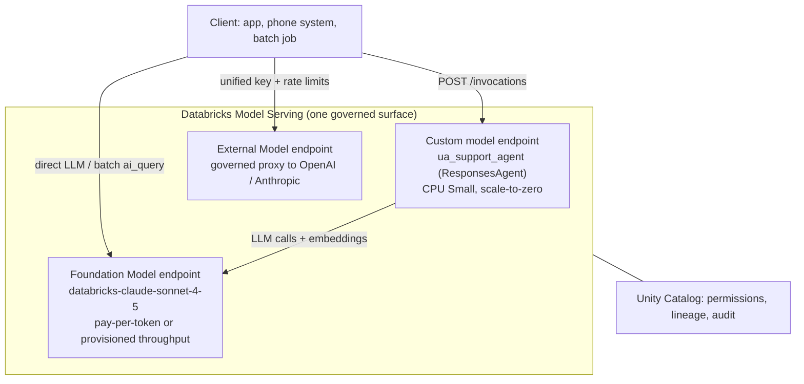
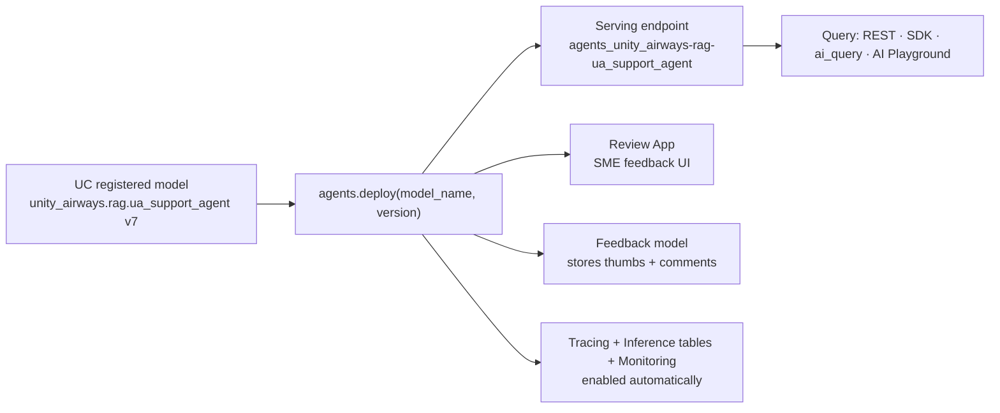
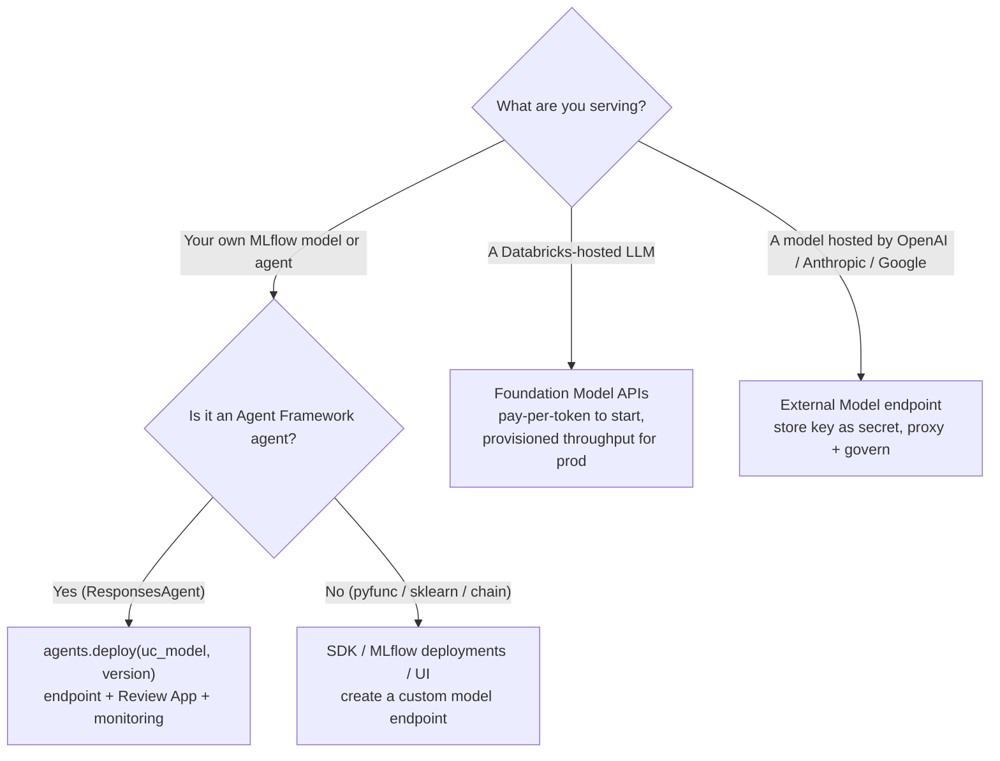

# Model Serving endpoints for GenAI  ·  Module 11 · Topic 11.1 (★ cornerstone)  ·  [Theory] + [Hands-on]

> **You are here:** Roadmap Module 11 → 11.1 (cornerstone deep-dive). You have a Unity Airways agent that works in a notebook — the RAG chain from Module 05 or the tool-using `ResponsesAgent` `unity_airways.rag.ua_support_agent` from Module 09, registered in Unity Catalog. This topic turns that registered model into a **live, governed REST API** with Databricks Model Serving.
> **Prerequisites:** a model or agent **registered in Unity Catalog** (Module 09); MLflow ≥ 3.1; the `databricks` CLI or `databricks-sdk`; rights to create a serving endpoint. Helpful: Module 07 (tracing), Module 08 (evaluation).
> **Feeds into:** 11.3 (AI Gateway), 11.6 (endpoint version control / A-B rollout), 11.7 (endpoint auth), 11.9 and Module 10 (Databricks Apps front-end).

## TL;DR
- **Model Serving** turns a packaged model into an HTTPS endpoint that autoscales, is governed by Unity Catalog, and is billed per use. It comes in **three GA families**: **Custom models** (your MLflow-packaged RAG chain / `ResponsesAgent`), **Foundation Models** (Databricks-hosted LLMs), and **External Models** (a governed proxy to OpenAI / Anthropic / Google).
- For a **GenAI agent** the one command to know is **`from databricks import agents; agents.deploy(uc_model_name, version)`** — it creates the serving endpoint *and* the Review App *and* a feedback model, and it switches on tracing, inference tables, and monitoring in one call.
- Endpoint config is small but consequential: **`workload_size`** (Small/Medium/Large), **`scale_to_zero_enabled`**, **`workload_type`** (CPU vs GPU), **environment variables / secrets**, and which **served-entity version** takes traffic.
- You invoke an endpoint the same way everywhere: REST `POST /serving-endpoints/<name>/invocations`, the SDK, or SQL **`ai_query`** for batch inference. Agents also support **streaming** (`stream=True`), **`return_trace`**, and **`custom_inputs`**.
- A custom **agent** endpoint is orchestration, not GPU inference — the heavy LLM work happens on a **separate Foundation Model endpoint** (`databricks-claude-sonnet-4-5`), so the agent itself runs happily on **CPU Small**.

## The problem
- The Unity Airways support agent answers well in a notebook. But a notebook is not a service: it needs a running cluster, it is tied to your identity, and no downstream app can call it.
- The support team's booking site, the IVR phone system, and a batch job that pre-summarizes overnight tickets all need the **same** agent, reachable over the network, at the same time, without fighting each other for a cluster.
- Traffic is spiky. Monday morning is 50 requests a second; 3 a.m. is nothing. You want to pay for the morning and pay near-zero overnight.
- And it has to stay **governed**: the same Unity Catalog permissions, the same audit trail, the same lineage you had in the notebook must follow the model into production.

## Why the naive approach fails
- **Naive move 1 — keep a cluster and a Flask app running.** You now own OS patching, TLS, autoscaling, a load balancer, and a long-lived token in an env file. That token is a standing credential outside Unity Catalog governance, and the cluster bills 24/7 for a workload that is busy two hours a day.
- **Naive move 2 — call the LLM provider (OpenAI) directly from every app.** Each app needs the raw API key, rate limits are per-app and uncoordinated, spend is invisible until the invoice lands, and swapping providers means editing every codebase.
- **Naive move 3 — one giant model that does everything on a GPU box.** A tool-using agent spends most of its time orchestrating (retrieval, tool calls, formatting), not doing raw GPU inference. Pinning it to an always-on GPU wastes money; the LLM itself is better served by a shared, optimized Foundation Model endpoint.
- **Naive move 4 — hand-wire the endpoint, then bolt on logging/eval later.** You end up with an endpoint that serves but has no request logs, no feedback capture, and no trace of what the agent actually did — so you cannot debug or evaluate it in production.
- Root cause in one line: **serving a governed, autoscaling, observable model is a platform problem, and Model Serving is the platform** — so configure it, do not rebuild it.

## What it is
- **Databricks Model Serving** is a managed, serverless service that exposes models as low-latency REST endpoints. You bring a model; Databricks runs the container, autoscales it, secures it behind workspace auth, and meters usage.
- There are **three endpoint families**, all GA:
  - **Custom models** — any model *you* packaged and logged with MLflow and registered in Unity Catalog: a scikit-learn model, a `pyfunc`, a LangChain RAG chain, or a `ResponsesAgent`. This is where the Unity Airways agent lives.
  - **Foundation Models** — LLMs **hosted by Databricks** and reachable out of the box (e.g. `databricks-claude-sonnet-4-5`, `databricks-gte-large-en`). Served through the **Foundation Model APIs** in two modes: **pay-per-token** and **provisioned throughput**.
  - **External Models** — a **governed proxy** to models hosted *outside* Databricks (OpenAI, Anthropic, Google, Azure OpenAI, …). You store the provider key once as a Databricks secret; every app calls the Databricks endpoint instead of the provider directly.
- Whatever the family, the **interface is identical**: an HTTPS endpoint you query with the same client, governed by the same permissions, observable through the same tools.

## Why it matters (for a Databricks FDE)
- This is the "make it real" step of every GenAI engagement. Registration (Module 09) stores the agent; serving is what lets a customer's app, phone system, or batch job actually call it.
- **Cost control is built in.** `scale_to_zero_enabled` means an idle endpoint costs nothing; `workload_size` lets you right-size for real traffic instead of guessing.
- **Governance carries over.** The endpoint enforces Unity Catalog permissions and produces audit logs, so the security review is short.
- **One command does the plumbing.** `agents.deploy()` wires the Review App, feedback model, tracing, inference tables, and monitoring — the things teams forget until they need to debug in production.
- **It is the anchor for the rest of Module 11.** AI Gateway (11.3), versioned rollout (11.6), and endpoint auth (11.7) all attach to the endpoint you create here.

## Core concepts
- **Serving endpoint** — a named, HTTPS-addressable service (`https://<host>/serving-endpoints/<name>/invocations`) that routes requests to one or more served entities.
- **Served entity** — a specific model **version** (or foundation/external model) behind the endpoint. An endpoint can host several and split **traffic %** across them (basis for A-B and canary rollout — 11.6).
- **Custom model endpoint** — serves a UC-registered MLflow model. For the Unity Airways agent this is a `ResponsesAgent`; the task type shows up as **Agent (Responses)**.
- **Foundation Model APIs** — Databricks-hosted LLMs in two modes:
  - **Pay-per-token** — billed per input+output token, zero setup, ideal to get started and for spiky/low-volume traffic.
  - **Provisioned throughput** — reserved capacity measured in tokens/second, with performance guarantees; required for **fine-tuned / custom weights** and for high, steady production load.
- **External model endpoint** — one Databricks endpoint that forwards to an outside provider; unifies keys, rate limits, and usage tracking (pairs with AI Gateway — 11.3).
- **`workload_size`** — Small / Medium / Large; sets the concurrency band (e.g. Small ≈ 0–4 concurrent requests in the book's example). Bigger size = more concurrency = more cost.
- **`scale_to_zero_enabled`** — when `True`, the endpoint scales to zero replicas when idle (cheap, but a **cold-start delay** on the next request). Great for dev; usually `False` for latency-sensitive prod.
- **`workload_type`** — **CPU** (default; fine for agents/orchestration) or **GPU** (for models that do heavy inference *inside* the endpoint). A `ResponsesAgent` that calls a foundation-model endpoint stays on **CPU**.
- **`environment_vars`** — key/value config injected into the endpoint; values can be `{{secrets/<scope>/<key>}}` references so no credential is hardcoded.
- **`agents.deploy()`** — the agent-specific deploy path: endpoint + Review App + feedback model + tracing + inference tables + monitoring in one call.
- **Inference tables** — a Delta table that logs every request/response for the endpoint; the backbone for production monitoring (Module 08) and debugging.

## 🗺️ Visual map

**The three endpoint families and how a custom agent endpoint leans on a Foundation Model endpoint** — mirrored in the HTML explainer:



**What `agents.deploy()` builds in one call** — mirrored in the HTML:



**Choosing an endpoint family and deploy path**:



## How it works — deep dive

### The three families, and when to reach for each
- **Custom models** package *your* logic. You logged the Unity Airways agent with MLflow (models-from-code) and registered it to `unity_airways.rag.ua_support_agent`. Serving it gives you a private endpoint that runs *your* orchestration. Trade-off: you own the model's dependencies and its behavior.
- **Foundation Models** are the shared LLM utility. Your agent does not embed a 70B model — it *calls* one (`databricks-claude-sonnet-4-5`) on a Foundation Model endpoint. Trade-off: pay-per-token is effortless but variable; provisioned throughput is predictable but you reserve (and pay for) capacity.
- **External Models** exist for governance, not hosting. If the customer is contractually on OpenAI, you still route through **one** Databricks endpoint so keys, spend, and rate limits are centralized. Trade-off: you inherit the external provider's latency and availability.

### Foundation Model APIs: pay-per-token vs provisioned throughput
- **Pay-per-token** — no capacity to manage, billed on tokens. Best for getting started, prototyping, low or bursty volume. Not designed for high sustained throughput.
- **Provisioned throughput** — you reserve a tokens/second band; latency and throughput are guaranteed. **Required** to serve fine-tuned or custom weights, and the right choice for steady production load.
- **Field rule:** start pay-per-token, move to provisioned throughput when either the traffic is steady and high or you need SLA-grade latency.

### `agents.deploy()` — what actually happens
- You call it against a **registered UC model version**. It (per the book and naming cheat-sheet):
  1. **Deploys the agent** to a Model Serving endpoint and makes it queryable as an API.
  2. **Creates a Review App** — a chat UI to hand to SMEs/test users for feedback.
  3. **Deploys a feedback model** that captures thumbs/comments into tables engineers can read.
  4. **Enables tracing, inference tables, and monitoring** so every production request is logged and analyzable.
- Parameters (from B1 Ch8): `model_name`, `model_version`, `scale_to_zero`, `environment_vars` (supports `{{secrets/scope/key}}`), `deploy_feedback_model`.
- The generated endpoint name follows a pattern like `agents_<catalog>-<schema>-<model>` (e.g. `agents_unity_airways-rag-ua_support_agent`) — **read it from the deploy output; do not hardcode a guess.**

### Endpoint configuration that matters
- **`scale_to_zero_enabled`** — cheap idling vs cold-start latency. Dev: on. Latency-critical prod: off (keep a warm replica).
- **`workload_size`** — Small/Medium/Large concurrency bands. Size to observed peak concurrency, not to hope.
- **`workload_type`** — CPU for agents/orchestration; GPU only when the endpoint itself runs heavy inference. The Unity Airways agent is CPU because the LLM lives on a separate FM endpoint.
- **Served-entity version + traffic %** — an endpoint can hold several versions and split traffic; this is how you canary a new agent version (11.6).
- **`environment_vars`** — inject config and secret references, never plaintext keys.

### Invoking an endpoint
- **REST** — `POST https://<host>/serving-endpoints/<name>/invocations` with a bearer token and a JSON body. For a `ResponsesAgent` the body uses an `input` array of role/content messages.
- **SDK** — `WorkspaceClient().serving_endpoints.query(...)`, or the OpenAI-compatible client for chat.
- **SQL `ai_query`** — call the served model row-by-row over a Delta table for **batch inference** at scale (GA).
- **Agent extras** (B1 Ch8): `"stream": true` for token streaming (needs `predict_stream` on the agent), `"databricks_options": {"return_trace": true}` to get the MLflow trace back with the answer, and `"custom_inputs"` to pass structured side-data (customer tier, locale, a binary attachment) that never enters the LLM prompt.

## How to do it on Databricks (Hands-on)

### Path A — Deploy the agent with `agents.deploy()` (recommended for agents)
```python
# [Hands-on] Deploy the registered Unity Airways ResponsesAgent (Module 09).
# Requires: mlflow>=3.1, databricks-agents; the model is already in Unity Catalog.
from databricks import agents

CATALOG, SCHEMA = "unity_airways", "rag"
UC_MODEL = f"{CATALOG}.{SCHEMA}.ua_support_agent"   # the ResponsesAgent from Module 09
VERSION  = 7                                        # the version you evaluated in Module 08

deployment = agents.deploy(
    model_name=UC_MODEL,
    model_version=VERSION,
    scale_to_zero=True,                 # dev: cheap idling. Prod latency-critical: False.
    environment_vars={                  # config + secrets, never plaintext keys
        "APP_ENV": "dev",
        "API_TOKEN": "{{secrets/ua_scope/api_token}}",
    },
    deploy_feedback_model=True,         # also stands up the Review App feedback loop
)

# The deploy output tells you the real endpoint name + Review App URL — read them, don't guess.
print(deployment.endpoint_name)        # e.g. agents_unity_airways-rag-ua_support_agent
print(deployment.review_app_url)
```
> **How to verify it worked:** the endpoint shows **Ready** on the *Serving* page (Task = *Agent (Responses)*), the *Use ▸ Open review app* menu opens the Review App, and `agents.deploy()` returned an endpoint name.

### Path B — Create a custom-model endpoint with the SDK (any MLflow model)
```python
# [Hands-on] Generic path for a pyfunc / chain / non-agent model registered in UC.
from databricks.sdk import WorkspaceClient
from databricks.sdk.service.serving import EndpointCoreConfigInput, ServedEntityInput
# NOTE: confirm class names against your installed databricks-sdk version.

w = WorkspaceClient()
w.serving_endpoints.create_and_wait(
    name="ua-support-agent",
    config=EndpointCoreConfigInput(
        served_entities=[
            ServedEntityInput(
                entity_name="unity_airways.rag.ua_support_agent",
                entity_version="7",
                workload_size="Small",         # concurrency band
                workload_type="CPU",           # agent orchestration -> CPU
                scale_to_zero_enabled=True,
            )
        ]
    ),
)
```

### Path C — MLflow Deployments client (framework-agnostic)
```python
# [Hands-on] Same idea via the MLflow deployments API.
import mlflow.deployments
client = mlflow.deployments.get_deploy_client("databricks")
client.create_endpoint(
    name="ua-support-agent",
    config={"served_entities": [{
        "entity_name": "unity_airways.rag.ua_support_agent",
        "entity_version": "7",
        "workload_size": "Small",
        "scale_to_zero_enabled": True,
    }]},
)
```

### Path D — The UI
- *Serving* (left nav) ▸ **Create serving endpoint** ▸ pick the UC model + version ▸ set **compute size**, **scale-to-zero**, **workload type** ▸ Create. This is the same config as the SDK, filled in a form.

### Invoke the endpoint
```python
# [Hands-on] Query the deployed agent over REST (ResponsesAgent -> "input" messages).
import os, requests
from databricks.sdk import WorkspaceClient

w = WorkspaceClient()
host = w.config.host
token = w.config.token
ENDPOINT = "agents_unity_airways-rag-ua_support_agent"  # from the deploy output

resp = requests.post(
    f"{host}/serving-endpoints/{ENDPOINT}/invocations",
    headers={"Authorization": f"Bearer {token}", "Content-Type": "application/json"},
    json={
        "input": [{"role": "user", "content": "My flight is at 4pm — what's the check-in cutoff?"}],
        "databricks_options": {"return_trace": True},   # get the MLflow trace back too
    },
    timeout=120,
)
resp.raise_for_status()
print(resp.json())
```
```sql
-- [Hands-on] Batch inference over a Delta table with ai_query (GA).
SELECT
  ticket_id,
  ai_query(
    'agents_unity_airways-rag-ua_support_agent',
    request => to_json(named_struct('input',
      array(named_struct('role','user','content', question_text))))
  ) AS agent_reply
FROM unity_airways.rag.overnight_tickets;
```
> **How to verify it worked:** the REST call returns a `200` with an assistant `output` array; with `return_trace` you also get the MLflow trace; the `ai_query` job writes one reply per row. All calls appear in the endpoint's inference table and in MLflow traces (Module 07).

### Inspect the endpoint schema
```python
# What does the endpoint expect and return? Check its served-entity + signature.
from databricks.sdk import WorkspaceClient
ep = WorkspaceClient().serving_endpoints.get("agents_unity_airways-rag-ua_support_agent")
print(ep.state, [se.name for se in ep.config.served_entities])
```

## Worked example — Unity Airways support agent goes live
- **Start:** `unity_airways.rag.ua_support_agent` v7 is registered in UC and passed evaluation in Module 08.
- **Deploy:** one `agents.deploy(UC_MODEL, 7, scale_to_zero=True, deploy_feedback_model=True)` call. Output gives `agents_unity_airways-rag-ua_support_agent` and a Review App URL.
- **What Databricks stood up:** the CPU Small endpoint (Task = *Agent (Responses)*), a Review App for the support-desk SMEs, a feedback model, and tracing + inference tables + monitoring.
- **Under the hood:** each request hits the agent endpoint, which calls the `databricks-claude-sonnet-4-5` Foundation Model endpoint for generation and the `databricks-gte-large-en` endpoint for embeddings during retrieval. The agent endpoint stays CPU because it orchestrates; the FM endpoints do the GPU work.
- **Use it:** SMEs grade answers in the Review App; the booking-site team calls `POST /invocations`; an overnight job runs `ai_query` to pre-summarize tickets.
- **Next:** front it with a branded chat UI on **Databricks Apps** (Module 10 / 11.9), add rate limits + guardrails with **AI Gateway** (11.3), and canary v8 with **traffic splitting** (11.6).

## Uses, edge cases & limitations
- **Use custom-model serving** for anything you packaged: agents, RAG chains, classical ML.
- **Use Foundation Model APIs** for the LLM/embedding calls your agent makes, and for standalone chat/batch. Pay-per-token to start; provisioned throughput for steady, high, or SLA-bound load and for custom weights.
- **Use External Models** to govern a mandated outside provider behind one endpoint.
- **Cold start:** with scale-to-zero on, the first request after idle is slow. Turn it off (or keep a warm replica) for latency-critical paths.
- **GPU only when needed:** most agents are CPU. Reserve GPU for endpoints that run heavy inference in-process.
- **Payload/timeout limits:** very large `custom_inputs` (binary attachments) and long generations bump against request-size and timeout limits — verify current limits in docs for production sizing.

## Common mistakes / gotchas
- **Hardcoding a guessed endpoint name.** The `agents.deploy()` name is generated (`agents_<catalog>-<schema>-<model>`). Read it from the deploy output or the Serving page.
- **Leaving scale-to-zero on in prod** and then reporting "the assistant is slow" — that is the cold start, not the model.
- **Putting a secret in `environment_vars` as plaintext.** Use `{{secrets/<scope>/<key>}}` references.
- **Expecting a chat `messages` schema from a `ResponsesAgent`.** It uses an **`input`** array (Responses schema), not the classic `messages` chat schema.
- **Serving a foundation model on your own GPU endpoint** when a pay-per-token FM endpoint already exists — you are paying to re-host something Databricks already hosts.
- **Deploying before evaluating.** Serve the version you validated in Module 08, not last night's experiment.

## > 📌 IMPORTANT
> - Model Serving has **three GA families**: **Custom models**, **Foundation Models** (pay-per-token vs provisioned throughput), **External Models**. Same query interface, same governance, different source.
> - For an **agent**, `agents.deploy(uc_model_name, version)` is the one call that also creates the **Review App + feedback model** and enables **tracing, inference tables, and monitoring**.
> - A custom **agent** endpoint runs on **CPU** — the GPU-heavy LLM work is on a separate **Foundation Model** endpoint it calls.

## > 💡 TIP
> - Start **pay-per-token**; switch to **provisioned throughput** only when traffic is steady/high or you need SLA latency or custom weights.
> - In dev, `scale_to_zero=True` to stop paying for idle. Flip it **off** for the customer-facing path.
> - Add `"databricks_options": {"return_trace": true}` while integrating — you get the agent's reasoning trace alongside the answer, which makes debugging the front-end trivial.
> - Right-size `workload_size` from the **inference table** (real concurrency), not a guess.

## > ⚠️ GOTCHA
> - The **`agents.deploy()` doc page is JS-rendered**, so the precise current parameter list and the endpoint-name pattern here are grounded in **B1 Ch8 + the naming cheat-sheet** — treat exact strings as **live re-check pending** and confirm against current docs before asserting to a customer.
> - The book calls the deploy tooling **"Mosaic AI Agent Framework."** Current docs are moving to plain **"Agent Framework" / "Databricks"** branding — teach the current name; the `agents.deploy()` API is unchanged.
> - `databricks-sdk` serving classes (`EndpointCoreConfigInput`, `ServedEntityInput`) and enum values (`workload_size`, `workload_type`) can shift between SDK versions — confirm against your installed version.
> - Foundation-model **endpoint names churn** (e.g. DBRX is retired). Confirm names on the supported-models page at authoring time; this lesson uses `databricks-claude-sonnet-4-5` per the project's shared conventions.

## 📝 Notes
_Your space._

**5-question self-check**
1. Name the three Model Serving families and give one example of what each serves.
2. What does `agents.deploy()` create *besides* the serving endpoint? Name at least three things.
3. When would you choose provisioned throughput over pay-per-token for a Foundation Model?
4. Why does the Unity Airways agent endpoint run on CPU rather than GPU? Where does the LLM inference actually happen?
5. Give two ways to invoke a deployed endpoint, and name the request-body field a `ResponsesAgent` expects.

## How this maps to the certification
- **Exam domain — Deployment & Productionization** (📗B2 Ch5): Databricks Model Serving as the interface to a deployed model/agent; selecting endpoint type and workload; optimizing endpoints; controlling access from serving endpoints; Foundation Model APIs and token- vs compute-based pricing; reading **model cards / metadata** (context window, modalities, limitations) to justify model choice; balancing **cost / latency / quality**.
- Expect questions that ask you to **pick or reject** an endpoint family or a model based on stated metadata, traffic, and cost/latency needs — not on observed output quality alone.

## Sources
- 📘 **B1 — _Practical MLflow for Generative AI on Databricks_**, Ch 8 "Deploying GenAI Application with MLflow": `agents.deploy()` and its parameters (`model_name`, `model_version`, `scale_to_zero`, `environment_vars`, `deploy_feedback_model`); the Model Serving Endpoint UI (compute size, traffic routing, usage metrics); querying via Browser/Curl/Python/SQL; **streaming** (`stream=True`, `predict_stream`), **`return_trace`** (`databricks_options`), **`custom_inputs`**; the **Review App**. *(O'Reilly Early Release — RAW & UNEDITED; verify against docs.)*
- 📗 **B2 — _Databricks Certified GenAI Engineer Associate Study Guide_**, Ch 5: Model Serving UI and endpoint optimization; model sizes and **cost/latency/quality** trade-offs; **model cards & metadata**; Foundation Model APIs; token-based vs compute-based pricing; access control from serving endpoints.
- 🧭 **naming-conventions.md** §4 (three GA families; FM API pay-per-token vs provisioned throughput; volatile served-model names), §2 (`agents.deploy()` creates endpoint + Review App + feedback model, enables tracing/inference tables/monitoring; `ResponsesAgent`), §5 (`ai_query` GA for batch inference), §6 (AI Gateway).
- 🌐 Databricks Docs — Model Serving overview (`docs.databricks.com/aws/en/machine-learning/model-serving/`): **live-verified July 2026** the page lists **Custom models**, **Foundation Model APIs** (pay-per-token, provisioned throughput), and **External models**. Create/manage endpoints (`.../model-serving/create-manage-serving-endpoints`): **live-verified** the config fields `scale_to_zero_enabled`, `workload_size`, `workload_type`, and `inference tables`.
- 🌐 Databricks Docs — Foundation Model APIs (`docs.databricks.com/aws/en/machine-learning/foundation-model-apis/`): **live-verified** the two modes (pay-per-token, provisioned throughput). Supported models: `.../foundation-model-apis/supported-models`.
- 🌐 Databricks Docs — Agent Framework deploy (`docs.databricks.com/aws/en/generative-ai/agent-framework/deploy-agent`): page is JS-rendered; `agents.deploy()` behavior grounded in B1 Ch8 + naming cheat-sheet — **live re-check pending**.
