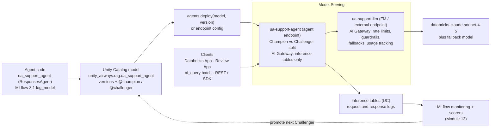
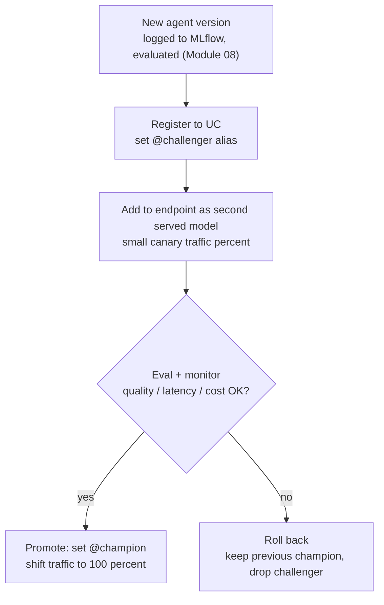

# Deployment and serving  ·  Module 11  ·  Topics 11.1–11.13  ·  [Theory + Hands-on]

> **You are here:** Roadmap **Level 5 · Module 11 — Deployment and serving** (all topics 11.1–11.13). This module takes the **Unity Airways** support agent from "works in my notebook" to a **governed production endpoint** other people and systems can safely call.
> **Prerequisites:** **Module 09** (the hand-coded `ua_support_agent`, a `ResponsesAgent`, and `agents.deploy()`), **Module 10** (the Databricks App front end and low-code tiles that sit on top of these endpoints), **Module 08** (`mlflow.genai.evaluate` — the eval you gate a rollout on). Helpful: **Module 04** (the AI Search index `unity_airways.rag.ua_rag_chunks_index`). Next stop: **Module 12 — Responsible GenAI** (guardrails, PII, governance, service principals).

This page is the **module hub**. It carries one numbered entry per topic (11.1–11.13). Three topics are **cornerstones (★)** with their own deep-dive pages:

- **11.1 ★ — Model Serving endpoints for GenAI** → `model-serving.md` / `model-serving.html`
- **11.3 ★ — AI Gateway (and Unity AI Gateway)** → `ai-gateway.md` / `ai-gateway.html`
- **11.10 ★ — AI Functions for GenAI at scale** → `ai-functions-at-scale.md` / `ai-functions-at-scale.html`

Everything below wraps around one running artifact — the **Unity Airways support agent** (`unity_airways.rag.ua_support_agent`, chat model `databricks-claude-sonnet-4-5`, embeddings `databricks-gte-large-en`) — and shows how to package it, serve it, govern the traffic, collect feedback, run it in batch, and operate it across environments. `CATALOG="unity_airways"`, `SCHEMA="rag"`, MLflow ≥ 3.1.

> 📌 **The one idea that shapes this module — a deployed model is a governed asset, not a script you `curl`.**
> The stages are always the same, and Databricks gives you a managed surface for each:
> - **Package** the model so it is versioned and reproducible — a `ResponsesAgent`/PyFunc logged with MLflow, registered to **Unity Catalog** (11.4, 11.13).
> - **Serve** it on **Model Serving** — one of three endpoint families (custom / foundation / external), created for you by `agents.deploy()` (11.1 ★, 11.12).
> - **Govern the edge** with **AI Gateway** — rate limits, guardrails, fallbacks, and payload logging in front of the endpoint (11.3 ★).
> - **Get feedback** from stakeholders through the **Review App** (11.2).
> - **Run at scale** in batch with **`ai_query`** and the wider **AI Functions** family (11.5, 11.10 ★), scheduled by **Lakeflow Jobs** (11.11).
> - **Operate** it — endpoint access and versioning, agent auth, and an LLMOps/AgentOps promotion loop (Champion vs Challenger) across environments (11.6, 11.7, 11.8, 11.9).

---

## TL;DR
- **Model Serving (11.1 ★)** is the home for every GenAI endpoint. Three families, all GA: **custom models** (your MLflow-packaged agent), **foundation models** (Databricks-hosted, pay-per-token or provisioned throughput), and **external models** (a governed proxy to OpenAI / Anthropic / Google).
- The easy button for an agent is **`agents.deploy(uc_model_name, version)`** — it creates the serving endpoint, a **Review App (11.2)**, a feedback model, and turns on tracing, inference tables, and monitoring in one call.
- **AI Gateway (11.3 ★)** is the control plane in front of an endpoint: rate limits, AI guardrails (safety + PII), provider fallbacks, usage tracking, and **payload logging into inference tables**. **Unity AI Gateway** is the newer, Beta go-forward that adds budgets/cost caps and MCP-service governance.
- **AI Functions (11.10 ★)** run GenAI in SQL at Spark scale — **`ai_query`** for batch inference (11.5) plus `ai_classify`, `ai_extract`, `ai_summarize`, `ai_gen`, `ai_mask`, `ai_translate`, `ai_analyze_sentiment`, `ai_fix_grammar`, and `vector_search`.
- **Operating it** means UC-governed **versions and aliases** (`@champion` / `@challenger`), scoped **endpoint auth**, a **Champion-vs-Challenger** rollout, **Databricks Apps** auth, external-model **secrets**, **Lakeflow Jobs** scheduling, and serving **open-source / Hugging Face** models via the `transformers` flavor.

## The problem
- Module 09 produced a genuinely good agent, and Module 10 put a chat window in front of it. But "it answered correctly when I ran the cell" is not a production system.
- A real deployment has to survive things a notebook never sees: **concurrent traffic**, a bad prompt trying to jailbreak it, a spike that blows the cost budget, a provider outage, a stakeholder who wants to *try it and complain*, and a new version that has to go out **without breaking the old one**.
- It also has to run in two very different modes. **Real-time** (a passenger asking a question, sub-second matters) and **batch** (score last night's 2 million support tickets for sentiment and category). Those need different tools.
- And it has to be **governed** — who can call the endpoint, whose credentials it uses to reach the AI Search index, where the request/response logs land, and which version is live right now.

## Why the naive approach fails
- **"Just share the notebook / a `curl` command."** No version pinning, no access control, no rate limit, no logging. The first traffic spike or prompt-injection attempt is an incident, and you cannot tell which model version produced a bad answer.
- **"Hard-code the OpenAI/Anthropic key in the agent."** Keys leak, rotate, and cannot be governed. External providers belong behind an **external-model serving endpoint** with the key in a **Databricks secret** (11.12), fronted by AI Gateway.
- **"Deploy the new version straight over the old one."** No rollback, no A/B, no eval gate. Champion-vs-Challenger with a traffic split and a UC alias flip exists precisely so a bad version never becomes a bad afternoon (11.8).
- **"Loop the real-time endpoint row-by-row for the nightly batch job."** Slow, expensive, and fragile. Batch is a single **`ai_query`** over a table, scheduled by a **Lakeflow Job** (11.5, 11.11).
- **"Ship the endpoint and stop."** With no Review App and no monitoring, you never learn it is wrong until a customer does. Feedback and inference tables are the input to the Module 13 improve loop.

## What it is
- **Plain-language definition:** *Deployment and serving* is the set of managed Databricks surfaces that turn a logged, UC-registered model into a **secure, observable, versioned endpoint** — plus the SQL functions and jobs that run that same model over data at scale.
- **Mental model:** if Module 09 built the engine and Module 10 built the dashboard, **Module 11 is the whole delivery system** — the assembly line that packages the car, the road it drives on (Model Serving), the tollgate and speed limits (AI Gateway), the test-drive desk (Review App), and the fleet-scheduling office (batch + Lakeflow Jobs).
- **Where it sits:** the production loop is **package (MLflow + UC) → serve (Model Serving) → govern (AI Gateway) → clients (Databricks App / Review App / `ai_query` / REST) → logs (inference tables) → monitor (Module 13) → promote the next version**. Everything is a first-class UC/MLflow asset — nothing is a loose script.

## Why it matters (for a Databricks FDE)
- **This is where the demo becomes a product.** Customers do not buy a notebook; they buy a governed endpoint their apps can call with an SLA. Module 11 is the conversation that turns a proof-of-value into a production commitment.
- **One serving story across the whole platform.** The same Model Serving + AI Gateway + Unity Catalog stack serves hand-coded agents (Module 09), Agent Bricks tiles (Module 10), foundation models, external providers, and open-source models. You teach one governance and monitoring model, not five.
- **Cost and safety live here.** Rate limits, budgets, guardrails, and provisioned-throughput sizing are the levers an FDE reaches for when a customer asks "how do we keep this from running away on cost or leaking PII?"
- **It maps to the certification.** Model Serving, endpoint access control, PyFunc pre/post-processing, and batch `ai_query` are squarely in **exam Domain 5 — Deployment and Production** (with Domain 3 application-development threads).

## Core concepts
- **Model Serving** — the managed endpoint service; three families (custom / foundation / external), all GA. See 11.1 ★.
- **`agents.deploy()`** — `from databricks import agents` → one call that provisions the endpoint, Review App, and feedback model, and enables tracing + inference tables + monitoring. See 11.1, 11.2.
- **AI Gateway** — the governance layer on a serving endpoint (rate limits, guardrails, fallbacks, usage + payload logging). **Unity AI Gateway** (Beta) adds budgets/cost caps and MCP-service governance. See 11.3 ★.
- **Review App** — the chat UI `agents.deploy()` creates so stakeholders and domain experts can try the agent and leave structured feedback. See 11.2.
- **PyFunc / Models-from-Code** — `mlflow.pyfunc.PythonModel` with `predict()` plus pre/post-processing; `mlflow.models.set_model()` is the recommended way to log chains/agents. A `ResponsesAgent` is a PyFunc under the hood. See 11.4.
- **AI Functions** — SQL-native GenAI (`ai_query` and friends) that runs a served model over a whole table. See 11.5, 11.10 ★.
- **UC versions and aliases** — `@champion` / `@challenger` aliases on a UC model; the endpoint pins a version; promotion is an alias flip + traffic shift. See 11.6, 11.8.
- **External model endpoint** — a governed proxy to a third-party provider (Claude/OpenAI), key stored in a **Databricks secret**. See 11.12.
- **Lakeflow Jobs** — the scheduler (formerly Databricks Workflows) for multi-task GenAI/RAG pipelines. See 11.11.

## 🗺️ Visual map

**The production serving topology — package once, serve, govern the edge, log everything, feed monitoring, promote the next version:**

*Takeaway: the model is packaged once and registered to Unity Catalog; every caller reaches the agent endpoint, which calls `ua-support-llm` where AI Gateway meters and screens each LLM request, while the agent endpoint's inference tables capture payloads for monitoring. The winner of the next eval becomes the new Champion.*

**The rollout loop — how a new Unity Airways agent version goes live safely (LLMOps / AgentOps):**

*Takeaway: promotion is a controlled traffic shift plus an alias flip, gated on evaluation — never an in-place overwrite. Rollback is just keeping the old Champion.*

---

## 11.1 ★ Model Serving endpoints for GenAI  ·  [Theory + Hands-on]

> **Cornerstone.** Full deep-dive — the three endpoint families, `agents.deploy()` vs a raw endpoint, provisioned throughput vs scale-to-zero, payloads, and validation — lives in `model-serving.md` / `model-serving.html`. Summary here.

- **Three endpoint families, all GA:** **custom models** (your MLflow-packaged `ua_support_agent`), **foundation models** (Databricks-hosted, e.g. `databricks-claude-sonnet-4-5` — pay-per-token or provisioned throughput), and **external models** (a governed proxy to OpenAI / Anthropic / Google).
- **The easy button for agents:** `from databricks import agents; agents.deploy("unity_airways.rag.ua_support_agent", version)` provisions the endpoint plus a Review App and feedback model, and enables tracing, inference tables, and monitoring.
- **Sizing:** **scale-to-zero** for dev/spiky traffic; **provisioned throughput** when production needs latency/throughput guarantees.
- **Key APIs/names:** Model Serving, Foundation Model APIs, `agents.deploy()`, served-model names, provisioned throughput.

## 11.2 The Review App for stakeholder feedback  ·  [Hands-on]

- **What it is:** a chat UI that `agents.deploy()` creates alongside the endpoint (via the **feedback model**) so test users and domain experts can try the Unity Airways agent and leave structured 👍/👎 + comments — no notebook needed.
- **How feedback lands:** responses and reviewer labels are captured as **MLflow traces / labels**, ready to become an evaluation set for the Module 08 harness and the Module 13 improve loop.
- **Structured labeling:** for a formal review round, `mlflow.genai.labeling` (`create_labeling_session`, `get_review_app`) organizes expert labeling against a dataset.
- **Key APIs/names:** Review App, feedback model, `deploy_feedback_model`, `mlflow.genai.labeling`.

## 11.3 ★ AI Gateway — guardrails, rate limits, fallbacks, logging  ·  [Theory + Hands-on]

> **Cornerstone.** Full deep-dive — enabling each feature on an endpoint, guardrail/PII config, provider fallbacks, usage system tables, payload logging, and Unity AI Gateway budgets — lives in `ai-gateway.md` / `ai-gateway.html`. Summary here.

- **AI Gateway, split across two endpoints (the governed agent pattern).** Put **rate limiting** (per user/endpoint), **AI guardrails** (safety filtering + PII detection/redaction, *Preview*), **provider fallbacks**, and **usage tracking** (system tables) on the **Foundation Model / external endpoint the agent calls** (`ua-support-llm`) — an FM/external endpoint supports every lever. Enable **payload logging → inference tables** on the **agent endpoint** (`ua-support-agent`, a deployed `ResponsesAgent`), which supports only inference tables via AI Gateway. No agent code changes. Supported providers include OpenAI, Anthropic, Google, and others.
- **Unity AI Gateway** *(Beta)* is the newer, recommended go-forward: richer observability, **MCP-service governance**, and **budget management** (spend thresholds / hard cost caps).
- **Why it matters:** this is the answer to "keep it from leaking PII or blowing the budget" — configured at the edge, governed centrally.
- **Key APIs/names:** AI Gateway, guardrails, rate limits, fallbacks, payload logging, Unity AI Gateway (Beta), budgets/cost caps.

## 11.4 PyFunc model structure; pre/post-processing  ·  [Hands-on]

- **The wrapper:** `mlflow.pyfunc.PythonModel` with a `predict()` (and optional `load_context()`) lets you package *any* Python logic as a servable model — the general flavor behind custom endpoints.
- **Pre/post-processing:** clean and format the request **before** the model call (normalize the passenger question, inject context) and parse/guard the output **after** (extract JSON, strip unsafe content, shape the response) — all inside the PyFunc.
- **Log it right:** prefer **Models-from-Code** (`mlflow.models.set_model()`) over pickling for chains/agents; log with `mlflow.pyfunc.log_model` and register to UC. A `ResponsesAgent` is itself a PyFunc-compatible model.
- **Key APIs/names:** `mlflow.pyfunc.PythonModel`, `predict()`, `load_context()`, `mlflow.models.set_model()`, `mlflow.pyfunc.log_model`.

## 11.5 Batch inference with `ai_query`  ·  [Hands-on]

- **What it does:** `ai_query('<endpoint>', request => <column>)` calls a served model from SQL for **every row** of a table — the right tool for scoring, summarizing, or extracting across a large dataset (each row becomes one call, parallelized by Spark/serverless SQL).
- **Unity Airways example:** run `ai_query` over last night's support tickets to draft a category, a sentiment, and a one-line summary in a single query.
- **Structured output:** request JSON/structured responses via a response-format argument so the output columns are clean and typed.
- **Scale + schedule:** wrap it in a **Lakeflow Job** (11.11); it is the same engine as the wider AI Functions family (11.10 ★).
- **Key APIs/names:** `ai_query`, serverless SQL, batch inference.

## 11.6 Access and version control for endpoints  ·  [Theory + Hands-on]

- **Versioning:** Unity Catalog holds model **versions** and **aliases** (`@champion` / `@challenger`); the endpoint's served-model config **pins a version**, so what is live is always explicit and auditable.
- **Access control:** endpoint permissions (`CAN_QUERY` / `CAN_MANAGE`) plus UC grants on the model, functions, and data the agent touches — grant to users, groups, or **service principals**, least-privilege.
- **Roll forward / back:** change the served-model version and traffic split, or flip the UC alias — no redeploy of code.
- **Key APIs/names:** UC model versions + aliases, endpoint ACLs (`CAN_QUERY` / `CAN_MANAGE`), traffic split.

## 11.7 Authentication for agent endpoints  ·  [Theory]

- **Who is calling:** query-time auth is a **PAT**, **OAuth (M2M service principal)**, or **on-behalf-of-user** — pick per client (an app uses its SP; a user-facing flow can pass the user's identity).
- **What the agent uses downstream:** `agents.deploy()` sets up **automatic authentication passthrough** so the agent's declared **resources** (the AI Search index, UC functions, a foundation model) get scoped credentials — you do not hand-manage tokens inside the agent.
- **System vs user identity:** understand when the endpoint acts as its own service identity vs the calling user; it decides what data the agent can legally see.
- **Key APIs/names:** PAT, OAuth M2M, on-behalf-of-user, resources, automatic authentication passthrough.

## 11.8 LLMOps and AgentOps: environments, Champion vs Challenger, rollout  ·  [Theory]

- **Environments:** promote a version through **dev → staging → prod**, tracked by UC aliases rather than copy-pasting artifacts.
- **Champion vs Challenger:** before any promotion, run the **challenger** (new candidate) against the **champion** (current prod) on the same eval set — or on shadow/split traffic — and only promote if quality/latency/cost win (B1 Ch8).
- **Rollout:** do it gradually — add the challenger as a second served model on a small **traffic percentage** (canary), watch monitoring, then flip `@champion` to 100%. **Rollback** is keeping the previous champion.
- **Key APIs/names:** Champion/Challenger, traffic split / canary, UC aliases, evaluation gate.

## 11.9 Databricks Apps authentication and authorization for GenAI  ·  [Theory]

- **App identity:** a Databricks App (Module 10.5) runs as its **own service principal** — never the developer's personal token — and reaches the agent endpoint through a scoped **resource**.
- **Scopes and delegation:** **OAuth scopes** limit what the app can do; **on-behalf-of-user** authorization lets the app act with the signed-in user's permissions when the answer must respect that user's data access.
- **Why it's here:** it closes the loop from Module 10 — the front end and the endpoint share one governed auth model.
- **Key APIs/names:** app service principal, OAuth scopes, on-behalf-of-user, app resources.

## 11.10 ★ AI Functions for GenAI at scale  ·  [Theory + Hands-on]

> **Cornerstone.** Full deep-dive — each function's signature, structured/JSON extraction with `ai_query`, `vector_search` in SQL, cost/scale patterns, and when to reach for which — lives in `ai-functions-at-scale.md` / `ai-functions-at-scale.html`. Summary here.

- **The family (all GA):** `ai_query` (general — any served model + prompt), `ai_classify`, `ai_analyze_sentiment`, `ai_extract`, `ai_gen`, `ai_mask`, `ai_summarize`, `ai_translate`, `ai_fix_grammar`, and `vector_search` (query an AI Search index from SQL).
- **Why it matters:** GenAI **in SQL at Spark scale**, governed by Unity Catalog — analysts and pipelines get LLM power without writing agent code.
- **Unity Airways example:** `ai_classify` to route tickets, `ai_analyze_sentiment` to flag angry passengers, `ai_mask` to redact PII before analytics, `ai_summarize` for queue dispositions.
- **Key APIs/names:** `ai_query`, `ai_classify`, `ai_analyze_sentiment`, `ai_extract`, `ai_gen`, `ai_mask`, `ai_summarize`, `ai_translate`, `ai_fix_grammar`, `vector_search`.

## 11.11 Orchestrating and scheduling GenAI/RAG pipelines with Lakeflow Jobs  ·  [Hands-on]

- **What it is:** **Lakeflow Jobs** (formerly Databricks Workflows) schedules the multi-task GenAI/RAG pipeline: ingest → `ai_parse_document`/chunk → embed → refresh the AI Search index → batch `ai_query` → `mlflow.genai.evaluate`.
- **Orchestration features:** task **dependencies (DAG)**, **triggers** (cron / file-arrival), **retries**, and serverless compute — so the nightly Unity Airways scoring and index refresh run reliably and unattended.
- **Rebrand note:** system-table schema moved `workflow` → `lakeflow`; existing Workflows run unchanged.
- **Key APIs/names:** Lakeflow Jobs, tasks/DAG, triggers, retries, serverless jobs compute.

## 11.12 External model credentials and provider setup  ·  [Hands-on]

- **Store the key safely:** put the provider API key (Claude/OpenAI) in a **Databricks secret** (secret scope) — never plaintext in code or config.
- **Create the endpoint:** stand up an **external-model serving endpoint** that references the secret; the agent and `ai_query` then call the provider by **endpoint name**, so you can swap providers without code changes.
- **Govern it:** external-model endpoints sit behind **AI Gateway** (11.3) for rate limits, fallbacks, and usage logging, and under UC for access control.
- **Key APIs/names:** Databricks secrets / secret scope, external model serving endpoint, provider config, AI Gateway.

## 11.13 Deploying open-source / Hugging Face models on Model Serving  ·  [Hands-on]

- **Package it:** log a Hugging Face model with the **`transformers` flavor** (`mlflow.transformers.log_model`) — or wrap a `transformers` pipeline in a **custom PyFunc** (11.4) for bespoke pre/post-processing — then register to UC (B2 Ch5, Example 7-7).
- **Serve it:** deploy as a **custom model** endpoint (11.1 ★); size **GPU** compute and consider **provisioned throughput** for steady load; pin dependencies so the environment is reproducible.
- **When to reach for it:** a specialized open-source model (a small classifier, a domain embedder, a fine-tune) that is not on the Foundation Model APIs list.
- **Key APIs/names:** `mlflow.transformers.log_model`, `transformers` flavor, custom PyFunc, custom model endpoint, GPU serving.

---

## Worked example (Unity Airways, deploy-to-operate, end to end)

Taking `ua_support_agent` from a logged model to a governed, monitored, scheduled production system:

1. **Package (11.4 / 11.13):** the agent is logged with **Models-from-Code** and registered to `unity_airways.rag.ua_support_agent`; a small open-source ticket-classifier is logged with the `transformers` flavor for the batch path.
2. **Serve (11.1 ★):** `agents.deploy("unity_airways.rag.ua_support_agent", version)` provisions the endpoint, Review App, and feedback model, and turns on tracing + inference tables + monitoring.
3. **Govern the edge (11.3 ★):** enable **AI Gateway** — rate limits, guardrails (PII redaction, *Preview*), a provider fallback, and usage tracking on `ua-support-llm` (the FM/external endpoint the agent calls), plus payload logging into an inference table on the agent endpoint `ua-support-agent`.
4. **External provider (11.12):** the OpenAI key lives in a Databricks secret behind an external-model endpoint, so a fallback to GPT is a config change, not a code change.
5. **Feedback (11.2):** support leads use the **Review App** to try the agent and label answers; labels flow into the Module 08 eval set.
6. **Batch + scale (11.5 / 11.10 ★):** a nightly `ai_query` scores every new ticket for category, sentiment, and summary; `ai_mask` redacts PII first.
7. **Schedule (11.11):** a **Lakeflow Job** runs index refresh → batch `ai_query` → `mlflow.genai.evaluate` on a cron trigger with retries.
8. **Operate (11.6 / 11.7 / 11.8 / 11.9):** endpoint ACLs and UC aliases control access and versioning; the Databricks App calls the endpoint as its service principal; a new version ships as a **Challenger** on 10% canary traffic and is promoted to **Champion** only after it wins the eval.

**How to verify it worked:** a stakeholder with only the app URL gets a cited answer; the request/response shows up in the inference table; `databricks` shows the endpoint `READY` with the pinned version; and a bad Challenger can be rolled back by re-aliasing `@champion` with zero code change.

---

## Uses, edge cases and limitations

| Use it when | Be careful when | Better move |
|---|---|---|
| You need a real-time agent endpoint | You share a notebook or `curl` | `agents.deploy()` → a governed Model Serving endpoint (11.1 ★) |
| You must meter cost / block PII / fail over | You bolt this into agent code | Enable **AI Gateway** at the edge (11.3 ★) |
| Stakeholders need to try it | You wait for a formal eval to start | Ship the **Review App** for feedback now (11.2) |
| You score millions of rows | You loop the real-time endpoint row-by-row | Batch **`ai_query`** in SQL (11.5, 11.10 ★) |
| A pipeline must run nightly | You run cells by hand | Schedule a **Lakeflow Job** (11.11) |
| You call OpenAI/Anthropic | You hard-code the API key | Secret + **external-model endpoint** behind AI Gateway (11.12) |
| You need a specialized OSS model | It is not on Foundation Model APIs | `transformers` flavor → **custom model** endpoint on GPU (11.13) |
| You ship a new version | You overwrite prod in place | **Champion vs Challenger** canary + alias flip (11.6, 11.8) |

## Common mistakes / gotchas
- Treating the endpoint as a script — no version pin, no ACLs, no rate limit, no logging. Everything downstream (monitoring, rollback, audit) then breaks.
- Hard-coding provider API keys instead of using a **Databricks secret** + external-model endpoint (11.12).
- Overwriting the production version in place — no rollback path. Use aliases + traffic split (11.6, 11.8).
- Looping the real-time endpoint for batch work instead of `ai_query` (11.5) — slow and expensive.
- Forgetting AI Gateway until after an incident. Guardrails, rate limits, and budgets are cheap **before** the spike (11.3).
- Assuming the app uses the developer's token — a **Databricks App runs as its own service principal** with scoped resources (11.9).
- Calling Model Serving governance "Mosaic AI Gateway" or Workflows — current names are **AI Gateway / Unity AI Gateway** and **Lakeflow Jobs**.

## > 📌 IMPORTANT callouts
- **A deployed model is a governed asset.** Package (MLflow + UC) → serve (Model Serving) → govern (AI Gateway) → log (inference tables) → monitor (Module 13) → promote. Never a loose script.
- **`agents.deploy()` gives you four things at once:** the endpoint, the Review App, the feedback model, and tracing + inference tables + monitoring.
- **Promotion is a traffic shift + alias flip gated on eval** — Champion vs Challenger — not an in-place overwrite.

## > 💡 TIP
- Turn on **AI Gateway** the moment the endpoint exists — rate limit + payload logging cost nothing and save you during the first spike.
- Use **provisioned throughput** only when production latency/throughput demands it; **scale-to-zero** is cheaper for dev and spiky traffic.
- For batch, reach for **`ai_query`** first; drop to a custom job only when the SQL function cannot express the task.
- Keep the **external-model endpoint name** stable so swapping providers is a config change, not a code change.

## > ⚠️ GOTCHA
- **Unity AI Gateway is Beta** and PII guardrails are **Preview** — label maturity and verify enrollment before a customer commitment (live re-check pending).
- **Served foundation-model names churn** (e.g. `databricks-claude-sonnet-4-5`) — confirm on the supported-models page at authoring time; **DBRX is treated as retired**.
- **Rebrands:** it is **AI Gateway / Unity AI Gateway** (not "Mosaic AI Gateway") and **Lakeflow Jobs** (not "Workflows"); the Vector Search SDK is still `databricks-vectorsearch` despite the "AI Search" rename.

## 📝 Notes
- _Space for your own notes as you work through the module._

**Self-check (5 questions)**
1. Name the three Model Serving endpoint families and give a Unity Airways example of each. Which one is `databricks-claude-sonnet-4-5`?
2. What four things does `agents.deploy()` create/enable in one call?
3. List four things AI Gateway adds in front of an endpoint, and one thing **Unity AI Gateway** (Beta) adds on top.
4. When would you use batch `ai_query` instead of calling the real-time endpoint, and how would you schedule it?
5. Describe a safe Champion-vs-Challenger rollout for a new agent version, and how you would roll it back with zero code change.

## How this maps to the certification
- **Deployment and Production** (exam Domain 5): Model Serving endpoints and optimization, endpoint **access control**, **PyFunc** models with pre/post-processing, and **batch inference with `ai_query`** are all called out explicitly (B2 Ch5).
- **Application Development** (Domain 3) threads: packaging agents with MLflow, registering to UC, and serving them are the deployment half of building an agentic application.
- Exam-relevant facts this module nails: three serving families (custom / foundation / external); `ai_query` for batch; PyFunc pre/post-processing; endpoint permissions and UC versioning; AI Gateway for rate limits/guardrails/logging; external models need secrets; open-source models serve via the `transformers` flavor.

## Sources
- 📎 **Project cheat-sheet (primary for current names/APIs)** — `.claude/skills/genai-teacher/references/naming-conventions.md`: **§4 Model Serving & Foundation Model APIs** (three families; pay-per-token vs provisioned throughput; served-model names churn; DBRX retired), **§5 AI Functions** (`ai_query`, `ai_classify`, `ai_extract`, `ai_gen`, `ai_summarize`, `ai_translate`, `ai_mask`, `ai_analyze_sentiment`, `ai_fix_grammar`, `vector_search` — all GA), **§6 AI Gateway** (rate limits, guardrails + PII redaction *Preview*, fallbacks, usage tracking, payload logging; **Unity AI Gateway** *Beta* — budgets/cost caps, MCP-service governance), **§2** (`agents.deploy()` → endpoint + Review App + feedback model + tracing/inference tables/monitoring; `ResponsesAgent`), **§8** (Databricks Workflows → **Lakeflow Jobs**). Verified July 2026 — re-verify Beta/Preview items live.
- 📘 **B1 — *Practical MLflow for GenAI on Databricks*** (Early Release, RAW/UNEDITED): **Ch 7** — "MLflow AI Gateway transitioning to Databricks AI Gateway" (unified secure interface over OpenAI/Anthropic/Azure OpenAI; swap providers by endpoint name; UC integration, usage rate limits, guardrails, real-time usage tracking, logging inputs/outputs to tables) and the Unity Airways agent/tools framing; **Ch 8** — `agents.deploy()`, `deploy_feedback_model`, and the **Review App**; **Champion vs Challenger** before deploying a new iteration (p332).
- 📗 **B2 — *Databricks Certified GenAI Engineer Associate Study Guide*** (Ch 5): Databricks Model Serving and endpoint optimization; controlling access to resources from serving endpoints; **PyFunc model structure** with pre/post-processing (p308–309); **batch inference with `ai_query`** (p359–360); serving open-source models via the **`transformers`** flavor (Example 7-7, p441–442).
- 🌐 **Databricks Docs** (live-confirmed at authoring): Model Serving overview — three families (custom / foundation / external) `docs.databricks.com/aws/en/machine-learning/model-serving/`; Foundation Model APIs `.../foundation-model-apis/`; AI Functions overview (`ai_query`, `ai_extract`, `ai_classify`, batch inference) `docs.databricks.com/aws/en/large-language-models/ai-functions`; AI Gateway `docs.databricks.com/aws/en/ai-gateway/`; Agent deploy `docs.databricks.com/aws/en/generative-ai/agent-framework/deploy-agent`; Lakeflow Jobs `docs.databricks.com/aws/en/jobs/`. Deep-dive pages (`model-serving`, `ai-gateway`, `ai-functions-at-scale`) carry the exact APIs and validation steps.

---

### Next module → **Module 12 — Responsible GenAI: guardrails and governance**
Module 12 goes deep on the safety and governance layer this module introduced at the edge: guardrail techniques (prompt filtering, redaction, input validation), **AI Guardrails** config, PII masking, rate limiting for abuse, Unity Catalog data governance, licensing/legal, risk frameworks and audit trails, and **service principals and model identity** (deploy-as-service-principal). Module 11 served and metered the agent; Module 12 makes it safe and accountable.

**Want to go hands-on?** I can build the **consolidated Module 11 lab notebook** — a Databricks-importable `.py` that runs the whole worked example end to end: log and register `ua_support_agent`, `agents.deploy()` it, enable AI Gateway, exercise the Review App, run a batch `ai_query` scoring job, wire it into a Lakeflow Job, and do a Champion-vs-Challenger promotion with rollback. Just say the word and I will generate it.
