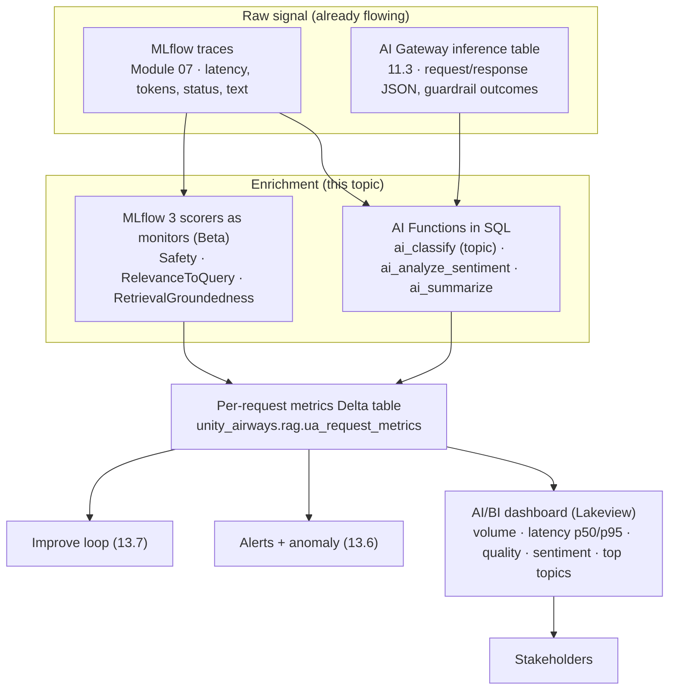
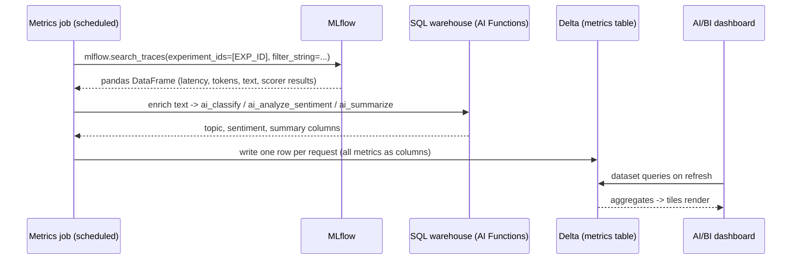

# NLP analysis on traces and a custom AI/BI monitoring dashboard   ·  Module 13 · Topic 13.5   ·  [Hands-on] ★

> You are here: Roadmap Module 13 (Production monitoring and continuous improvement) → Topic 13.5.
> Prereqs: 07 (MLflow Tracing), 08 (scorers and judges), 11.3 (AI Gateway payload logging → inference tables), 13.2 (inference tables), 13.3 (online monitoring and trace capture). Cross-links: 13.1 metric types · 13.4 agent monitoring tools · 13.6 alerts and anomaly detection · 13.7 the "improve" loop.

## TL;DR

- Your production agent already emits two raw signals: **MLflow traces** (Module 07) and **AI Gateway inference tables** (11.3). This topic turns that raw signal into a dashboard a stakeholder can read.
- Two enrichment engines run over the trace and inference tables: **AI Functions** in SQL (`ai_classify` for intent/topic, `ai_analyze_sentiment`, `ai_summarize`) for the unstructured text, and **MLflow 3 scorers running as production monitors** (`Safety`, `RelevanceToQuery`, `RetrievalGroundedness`) for quality. Production monitoring is **Beta**.
- Read trace data into a DataFrame with `mlflow.search_traces(experiment_ids=[...], ...)`. Pass **`experiment_ids=`** (a list), never `experiment_names=` — that argument does not exist on `search_traces`.
- Land one **per-request metrics Delta table** (latency, token counts, quality scores, sentiment, topic), then build a **Databricks AI/BI dashboard** (Lakeview) on top of it: volume, latency p50/p95, quality trend, sentiment mix, top topics.
- Dashboards are mostly UI plus SQL. Build the tiles in the UI and let the SQL behind each dataset do the work. Do not hand-write a dashboard API you cannot verify.

## The problem

You shipped the Unity Airways support agent (endpoint `ua-support-agent`). It answers thousands of traveler questions a week. Traces are flowing into MLflow, and the gateway is logging every request to an inference table. Then your director asks the questions every director asks:

- How many people used it this week, and is that going up?
- Is it fast enough? What is the p95 latency?
- Is quality holding, or are answers drifting off-topic?
- What are people actually asking about, and how do they feel when they leave?

You cannot answer any of that by scrolling the trace UI one request at a time. The signal is there. It is just raw, per-request, and half of it is unstructured text.

## Why the naive approach fails

- **Reading traces by hand does not scale.** The MLflow trace viewer is built for debugging one request, not for a weekly volume-and-quality story across 20,000 of them.
- **Latency and tokens are easy; quality is not.** Execution time and token counts are structured fields sitting right in the trace. But "was this answer relevant, safe, grounded, and on-topic?" lives inside free text. You need NLP to turn that text into a column.
- **A screenshot is not a dashboard.** Stakeholders want a live tile they can filter by date, not a number you pasted into Slack last Tuesday.
- **One-off notebooks rot.** A query you ran once tells you nothing next week. Monitoring has to be a standing, refreshing surface.

## What it is

> 📌 IMPORTANT: Topic 13.5 is a **pipeline**, not a single feature. Raw signal (traces + inference tables) → enrich (AI Functions for text, scorers for quality) → a per-request metrics Delta table → an AI/BI dashboard for humans.

- **[Theory]** The idea: production traces and inference tables are your source of truth for what actually happened. You run analysis over them and publish the result where non-engineers can see it.
- **[Hands-on]** The build: a scheduled job that reads traces, enriches them with SQL AI Functions and MLflow scorer output, writes a clean metrics table, and feeds a Lakeview dashboard.

## Why it matters (for a Databricks FDE)

- This is the payoff slide for the whole platform pitch. Traces, AI Gateway, AI Functions, MLflow scorers, and AI/BI dashboards are separate products; 13.5 is where you show them working as one system.
- It is the bridge from "the agent runs" to "the business trusts the agent." Volume proves adoption, latency proves reliability, quality and sentiment prove it is doing its job.
- It stays inside Unity Catalog. The metrics table is governed, the dashboard reads governed data, and the same scorers you used in evaluation (Module 08) now watch production. One measurement language, dev to prod.

## Core concepts

- **Trace (Module 07):** the end-to-end record of one request — spans, latency (`execution_time_ms`), token counts (span attributes), status, plus the request and response text. Captured automatically when an agent is deployed with the Agent SDK.
- **Inference table (11.3 / 13.2):** the AI Gateway payload log. One row per request/response, written to a UC Delta table you named when you turned on payload logging. Overlaps with traces on the text, but is the gateway's own record and includes guardrail outcomes.
- **AI Functions:** SQL-native calls to Foundation Models. Task-specific ones (`ai_classify`, `ai_analyze_sentiment`, `ai_summarize`) run over a text column like `UPPER()` would. `ai_query` is the general-purpose fallback for custom/structured output.
- **Scorer as a production monitor (Beta):** the same `mlflow.genai.scorers` you ran offline in Module 08, now `.register()`-ed and `.start()`-ed against production traces. A managed Lakeflow Job runs them on a sampled slice and writes the scores back to the traces.
- **`ScorerSamplingConfig(sample_rate=...)`:** what fraction of traces each monitor scores. `1.0` = every trace (use for safety); lower for expensive, less-critical scorers.
- **Per-request metrics table:** the flat Delta table you build — one row per request, all metrics as columns. This is the contract the dashboard reads.
- **AI/BI dashboard (Lakeview):** Databricks' BI surface (formerly "Lakeview dashboards"). Datasets are SQL queries; widgets (counters, charts, tables) reference dataset columns; layout is a 12-column grid. Built in the UI, stored as JSON.

## 🗺️ Visual map

**Diagram 1 — the pipeline: raw signal to stakeholder dashboard.**



**Diagram 2 — one refresh pass of the batch job.**



## How it works — deep dive

### 1. Get the trace data into a DataFrame

`mlflow.search_traces` pulls traces into a pandas DataFrame you can inspect, transform, and write to Delta.

```python
import mlflow

EXPERIMENT_ID = "3430349293389553"   # the experiment your endpoint logs to (13.3)

traces_df = mlflow.search_traces(
    experiment_ids=[EXPERIMENT_ID],              # a LIST of IDs
    filter_string="attributes.status = 'OK'",    # note the attributes. prefix + single quotes
    order_by=["attributes.timestamp_ms DESC"],
    max_results=5000,
)
print(len(traces_df), "traces")
print(traces_df.columns.tolist())   # request, response, trace_id, execution_time_ms, tokens, assessments, ...
```

> ⚠️ GOTCHA: Pass **`experiment_ids=`** (a list). There is **no `experiment_names=` argument** on `search_traces` — that mistake raises a `TypeError`. If you only know the name, resolve it first: `mlflow.get_experiment_by_name("/Shared/...").experiment_id`.

> ⚠️ GOTCHA: The `filter_string` grammar is strict. Prefix fields (`attributes.status`, `attributes.timestamp_ms`), use **single quotes** for values, backtick dotted tag names (`` tags.`mlflow.traceName` ``), and use `AND` — **`OR` is not supported**. Time is epoch milliseconds.

Structured metrics come for free off each trace: `trace.info.execution_time_ms` for latency, and token counts read from the LLM span's **token-usage attribute** (confirm the exact key in your own traces — MLflow exposes usage via a `token_usage`/`tokenUsage` span attribute rather than a fixed `mlflow.chat_model.*` key).

### 2. Turn quality into columns with scorers running as monitors [Beta]

Latency and tokens are structured. Quality is not, so you let the same MLflow scorers from Module 08 run continuously over production traces. Register them once, start them, and a managed Lakeflow Job scores a sampled slice on a schedule.

```python
import mlflow
from mlflow.genai.scorers import (
    Safety, RelevanceToQuery, RetrievalGroundedness, ScorerSamplingConfig,
)
from mlflow.tracing import set_databricks_monitoring_sql_warehouse_id

mlflow.set_experiment("/Shared/ua-support-agent")   # the production experiment

# 1) Point monitoring at a SQL warehouse that will run the scorer job
set_databricks_monitoring_sql_warehouse_id(
    sql_warehouse_id="<SQL_WAREHOUSE_ID>",   # only takes effect for experiments whose trace location is a UC schema
    experiment_id="<EXPERIMENT_ID>",   # optional; uses the active experiment if omitted
)

# 2) Register AND start each scorer. Registering alone does NOT activate monitoring.
JUDGE = "databricks:/databricks-gpt-oss-120b"   # the LLM that backs the judges

safety = Safety(model=JUDGE).register(name="prod_safety")
safety = safety.start(sampling_config=ScorerSamplingConfig(sample_rate=1.0))   # every trace

relevance = RelevanceToQuery(model=JUDGE).register(name="prod_relevance")
relevance = relevance.start(sampling_config=ScorerSamplingConfig(sample_rate=0.5))

grounded = RetrievalGroundedness(model=JUDGE).register(name="prod_groundedness")
grounded = grounded.start(sampling_config=ScorerSamplingConfig(sample_rate=0.5))
```

- **Both `.register()` and `.start()` are required.** Register without start and nothing runs.
- **Sampling controls cost.** Scoring every trace with an LLM judge is expensive at volume. Set critical scorers (safety) to `1.0` and less-critical ones lower.
- **A Lakeflow Job appears automatically.** Enabling monitoring provisions a scheduled job that runs the scorers and writes results back onto the traces. You can adjust its schedule in the job UI.
- Manage them later with `list_scorers()`, `get_scorer(name=...)`, `.update(sampling_config=...)`, `.stop()`, and `delete_scorer(name=...)`.

> 📌 IMPORTANT: This is the **same scorer objects** as offline evaluation (Module 08), reused online. That consistency is the point: one metric definition measures quality in dev and in prod, so version-over-version comparisons are honest.

### 3. Turn text into columns with AI Functions

Scorers cover quality. For the "what are people asking" and "how do they feel" questions, run AI Functions over the request/response text. These are plain SQL over the trace or inference Delta table.

```sql
-- Enrich the raw text of each request with topic, sentiment, and a short summary.
SELECT
  trace_id,
  request_time,
  user_question,
  agent_response,
  latency_ms,
  total_tokens,
  -- intent / topic routing: prefer ai_classify over ai_query for fixed labels
  ai_classify(
    user_question,
    ARRAY('Check-in', 'Cancellation', 'Baggage', 'Refunds', 'Loyalty', 'Other')
  )                                    AS topic,
  -- sentiment of the traveler's question: positive | neutral | negative
  ai_analyze_sentiment(user_question) AS sentiment,
  -- a one-line summary of the answer, for the detail table
  ai_summarize(agent_response, 20)    AS answer_summary
FROM unity_airways.rag.ua_trace_text
WHERE user_question IS NOT NULL;
```

- **Prefer task-specific functions.** `ai_classify` with an explicit label list is the right tool for intent/topic. `ai_analyze_sentiment` is purpose-built for sentiment. Reach for `ai_query` only when you need custom structured JSON that no task function produces.
- **Add an "Other" label on purpose.** A rising "Other" bucket is your topic-drift signal — questions the agent was never designed for. That feeds the alert in 13.6.

> ⚠️ GOTCHA: 📘B1 Ch9 shows this with `ai_query(...)` plus a JSON-schema `responseFormat` to force a `category` field. That works, but the current guidance is to prefer the task-specific `ai_classify` for fixed-label routing — it is simpler and less error-prone. Keep `ai_query` for genuinely custom output.

### 4. Land one per-request metrics table

Join the structured fields, the scorer results, and the AI-Function columns into one flat Delta table. One row per request, every metric a column. This is the stable contract the dashboard reads.

```python
# metrics_df: built from traces_df (latency, tokens, scorer assessments) joined to the
# AI-Function enrichment above (topic, sentiment, summary), keyed on trace_id.
(
    metrics_df.write
      .format("delta")
      .mode("overwrite")            # or MERGE on trace_id for incremental refresh
      .option("overwriteSchema", "true")
      .saveAsTable("unity_airways.rag.ua_request_metrics")
)
```

Target schema (rename to taste, keep it flat):

| Column | Source | Used by tile |
|---|---|---|
| `trace_id` | trace | join key, detail table |
| `request_time` | trace timestamp | every time series |
| `user_question`, `agent_response` | trace text | detail table |
| `latency_ms` | `execution_time_ms` | latency p50/p95 |
| `input_tokens`, `output_tokens`, `total_tokens` | span attributes | cost/volume |
| `status` | trace status | error rate |
| `topic` | `ai_classify` | top topics |
| `sentiment` | `ai_analyze_sentiment` | sentiment mix |
| `relevance`, `safety`, `groundedness` | scorer monitors | quality trend |
| `user_feedback` | `mlflow.log_feedback` (13.3) | satisfaction |

### 5. Build the AI/BI dashboard [Hands-on, UI + SQL]

Dashboards are built in the UI; the work is in the dataset SQL behind each tile. Flow:

1. **New → Dashboard** (AI/BI). Give it a name and pick your SQL warehouse.
2. **Data tab → add a dataset per domain.** One SQL query per dataset, always fully-qualified table names (`unity_airways.rag.ua_request_metrics`). Put the aggregation in the query.
3. **Canvas tab → drop widgets** and bind each field to a dataset column. Counters for KPIs, line charts for trends, a bar for topics, a pie for sentiment, a table for detail.
4. **Publish.** Published dashboards run on the warehouse and refresh on a schedule; viewers do not need workspace edit rights.

> 💡 TIP: Widget field expressions are limited (SUM, AVG, COUNT, DATE_TRUNC — no `CAST`, no `percentile`). Compute anything fancy (percentiles, CASE buckets, ratios) **in the dataset SELECT** and give it an alias, then point the widget at the alias.

Representative dataset queries behind the tiles:

```sql
-- Dataset: daily_volume_latency  (line charts: volume + latency p50/p95)
SELECT
  DATE(request_time)                          AS day,
  COUNT(*)                                     AS request_count,
  percentile_approx(latency_ms, 0.5)          AS p50_latency_ms,
  percentile_approx(latency_ms, 0.95)         AS p95_latency_ms,
  ROUND(AVG(CASE WHEN status = 'ERROR' THEN 1 ELSE 0 END), 4) AS error_rate
FROM unity_airways.rag.ua_request_metrics
WHERE request_time >= date_sub(current_date(), 30)
GROUP BY DATE(request_time)
ORDER BY day;
```

```sql
-- Dataset: quality_trend  (line chart: avg quality scores by day)
SELECT
  DATE(request_time)         AS day,
  ROUND(AVG(relevance), 3)   AS avg_relevance,
  ROUND(AVG(safety), 3)      AS avg_safety,
  ROUND(AVG(groundedness), 3) AS avg_groundedness
FROM unity_airways.rag.ua_request_metrics
GROUP BY DATE(request_time)
ORDER BY day;
```

```sql
-- Dataset: top_topics  (bar chart: keep cardinality small, 6 labels + Other)
SELECT topic, COUNT(*) AS n
FROM unity_airways.rag.ua_request_metrics
GROUP BY topic
ORDER BY n DESC;

-- Dataset: sentiment_mix  (pie/donut: positive | neutral | negative)
SELECT sentiment, COUNT(*) AS n
FROM unity_airways.rag.ua_request_metrics
GROUP BY sentiment;
```

> ⚠️ GOTCHA: Keep chart color/group dimensions to roughly 3–8 distinct values or the chart turns to mush. That is exactly why `ai_classify` uses a short, fixed label list — it caps topic cardinality by design. High-cardinality columns (`trace_id`) belong in a table widget, not a chart.

## Worked example

Unity Airways, one Monday morning. The metrics job ran overnight over the weekend's traces.

- **Volume tile:** 4,120 requests over 7 days, up 18% week over week. Adoption is real.
- **Latency tile:** p50 1.9s, p95 6.4s. The p95 line ticked up Saturday — worth a look in 13.6.
- **Quality trend:** `avg_safety` flat at 0.99, `avg_groundedness` dipped from 0.94 to 0.88 midweek. A retrieval regression, caught before anyone filed a ticket.
- **Top topics:** Baggage (38%), Check-in (24%), Cancellation (16%), Refunds (12%), Loyalty (6%), **Other (4%)**. That Other slice is new. Sampling those traces shows travelers asking about seat upgrades — a feature request the product team did not know it had.
- **Sentiment mix:** 61% neutral, 27% positive, 12% negative. The negative slice concentrates in Refunds, matching the one thumbs-down the book's example captured.

Every one of those numbers came from the raw trace and inference signal already flowing. The only new work was the enrichment and the tiles.

## Uses, edge cases and limitations

- **Use it when** you have production traffic and a stakeholder who needs a standing view of volume, latency, quality, and topics.
- **Do not** score every trace with LLM judges at high volume without sampling — the cost is real. Sample non-critical scorers.
- **AI Function output is model output.** `ai_classify` and `ai_analyze_sentiment` are usually good, not perfect. Treat a topic label as a strong signal, not ground truth, and keep the label list tight.
- **Native UC trace sync is Beta.** MLflow can sync traces straight into a UC table (`set_experiment_trace_location(UCSchemaLocation(...))`), which lets you skip step 1 and query the spans table directly. 📘B1 Ch9 flags it as private preview. The `search_traces` → Delta path in this lesson is the more portable route; use whichever your workspace supports.
- **Ad-hoc questions do not need a tile.** For one-off exploration ("show me traces with negative feedback"), use Genie Code or the MLflow MCP server (13.4) instead of building yet another dashboard.

## Common mistakes / gotchas

- **`experiment_names=` on `search_traces`.** Does not exist. Use `experiment_ids=[...]`.
- **Registering a scorer but never starting it.** No monitoring runs. You need both `.register()` and `.start()`.
- **Putting `percentile_approx` in a widget expression.** Widgets cannot; compute it in the dataset SQL and alias it.
- **Field-name mismatch in widgets.** The `name` in `query.fields` must exactly match the `fieldName` in `encodings`, or the tile shows "no fields to visualize."
- **Unbounded topic labels.** Letting `ai_classify` invent labels gives a 40-slice bar chart. Fix the label list; add "Other".
- **Reading traces one at a time.** The whole point of 13.5 is to stop doing that.

### 📌 IMPORTANT

- 13.5 is a pipeline: **traces + inference tables → enrich (AI Functions + scorer monitors) → per-request metrics Delta table → AI/BI dashboard**.
- **Production monitoring (scorers as monitors) is Beta.** Reuse the Module 08 scorers; both `.register()` and `.start()` are required; sampling controls cost.
- Read traces with **`mlflow.search_traces(experiment_ids=[...])`** — never `experiment_names=`.

### 💡 TIP

- Turn on 2–3 scorer monitors and the metrics job **on launch day**, not after the first incident. A quality trend is only useful if it has history.
- Keep the metrics table flat and put all business logic in the dataset SQL. AI/BI widgets are deliberately dumb; a clean table makes the whole dashboard trivial.
- Name the "Other" topic bucket on purpose and alert on it (13.6). It is your cheapest early-warning for drift and unmet demand.

### ⚠️ GOTCHA

- 📘B1 Ch9 uses `ai_query` + JSON-schema for intent; the current best practice is `ai_classify` for fixed labels. Both work; teach `ai_classify`.
- Native trace-to-UC sync is **private preview** in the book; verify availability before relying on the auto-created spans table (`..._trace_otel_spans`).
- Exact inference-table and synced-trace table names depend on how you configured payload logging (11.3) and trace destination (13.3). Confirm the names in your workspace before wiring the dashboard.

## 📝 Notes

Space for your own notes.

**5-question self-check:**

1. What are the two raw signals that feed the 13.5 pipeline, and which module produced each?
2. Which argument does `mlflow.search_traces` take to scope by experiment, and what is the common wrong one?
3. Name the two calls required to make a scorer monitor production traces, and what each does.
4. Why prefer `ai_classify` over `ai_query` for topic/intent, and why add an "Other" label?
5. You need p95 latency by day on a tile. Where do you compute the percentile, and why not in the widget?

## How this maps to the certification

- Databricks Certified Generative AI Engineer Associate — the **Evaluation and Monitoring** area (📗B2 Ch8). Expect questions on: choosing operational vs quality vs business metrics; using MLflow traces and scorers for online monitoring; and using Databricks tools (AI Functions, AI/BI dashboards, alerts) to surface production quality. Verify the current domain weighting on the official exam guide.

## Sources

- 📘 **B1 — _Practical MLflow for Generative AI on Databricks_ (O'Reilly Early Release, RAW & UNEDITED), Ch 9 "Production Monitoring with MLflow"** (pp. ~341–390): metric types (Tables 9-1/9-2/9-3); the online monitoring workflow; real-time trace capture; "Register and Start Scorers for Online Monitoring" (`list_scorers`, `RelevanceToQuery`/`Safety`/`RetrievalGroundedness`, `scorer.register`, `get_scorer`, `ScorerSamplingConfig(sample_rate=...)`, `scorer.start`, auto-provisioned Lakeflow Job, default MLflow dashboard); "Advanced Monitoring on Production Traces" (sync traces to a UC table — noted as private preview); "Natural Language Processing Analysis on Traces" (`ai_query` intent classification with `get_json_object` + `responseFormat` JSON schema over `workspace.unity_airways.production_traces`); "Custom Dashboard with Databricks AI/BI" (create dataset → dashboard); "Creating Metrics Alerts"; "Interactively Gather Insights" (Genie Code, MLflow MCP); "Expanding the Evaluation Dataset" (`mlflow.search_traces` + `merge_records`).
- 📗 **B2 — _Databricks Certified Generative AI Engineer Associate Study Guide_, Ch 8** — monitoring and metric types for the exam.
- 🌐 **Docs — AI Functions overview** (`docs.databricks.com/aws/en/large-language-models/ai-functions`) and per-function refs: `ai_classify`, `ai_analyze_sentiment`, `ai_summarize`, `ai_query` (`.../sql/language-manual/functions/ai_classify` etc.). Function pages confirmed live (July 2026); bodies are JS-rendered.
- 🌐 **Docs — Monitor and evaluate AI agents / production monitoring** (`docs.databricks.com/aws/en/mlflow3/genai/eval-monitor/`). Production monitoring path reuses MLflow 3 scorers/judges — **Beta**.
- 🌐 **MLflow — GenAI trace search** (`mlflow.org/docs/latest/genai/tracing/search-traces/`): `search_traces` uses `experiment_ids` (confirmed live).
- 🧭 **Naming cheat-sheet** (`.claude/skills/genai-teacher/references/naming-conventions.md`) §1 (production monitoring reuses scorers/judges, Beta; MLflow-2 "Lakehouse Monitoring for GenAI" is legacy) and §5 (AI Functions GA list).
- 🧰 **Feature skills:** `databricks-ai-functions` (task-function-first selection rule; signatures), `databricks-aibi-dashboards` (dataset-per-domain, widget field matching, 12-column grid, cardinality limits), `databricks-mlflow-evaluation` (Patterns 12–14: enable/manage monitoring scorers, query UC trace tables; `search_traces` filter-string grammar).
- 🔗 Cross-refs: metric types **13.1** · inference tables **13.2** · online monitoring and trace capture **13.3** · agent monitoring tools (Genie Code, MLflow MCP) **13.4** · alerts and anomaly detection **13.6** · the improve loop **13.7** · scorers/judges **Module 08** · AI Gateway payload logging **11.3**.
