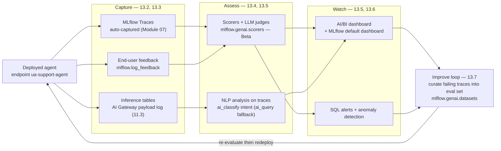
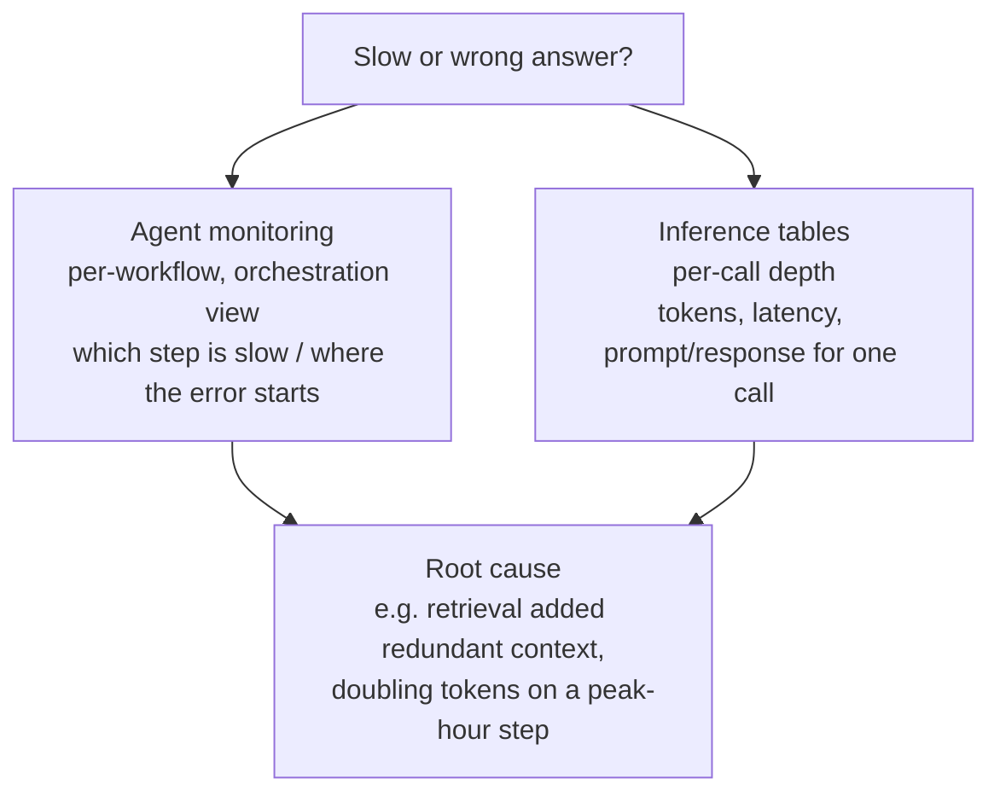

# Production monitoring and continuous improvement  ·  Module 13  ·  Topics 13.1–13.7  ·  [Theory + Hands-on]

> **You are here:** Roadmap **Level 5 · Module 13 — Production monitoring and continuous improvement** (all topics 13.1–13.7). This module takes the **Unity Airways** support agent from "safe and shipped" (Modules 11–12) to "**watched and always improving**" — you can see how quality drifts week to week, get paged before travelers notice, and grow tomorrow's eval set out of today's real traffic.
> **Prerequisites:** **Module 07** (MLflow Tracing — the traces you already capture *are* the monitoring signal), **Module 08** (eval scorers + LLM judges — the *same* scorers now run on production traces), **Module 11.3** (AI Gateway payload logging → inference tables), and **Module 12** (the audit/abuse hooks in 12.4/12.7). This is the **last module of Level 5 / Phase P4 (Production)**. Next stop: **Level 6 · Module 14 — AI/BI Genie**.

This page is the **module hub**. It carries one numbered entry per topic (13.1–13.7). One topic is a **cornerstone (★)** with its own deep-dive page:

- **13.5 ★ — NLP analysis on traces + a custom AI/BI monitoring dashboard** → `aibi-dashboard.md` / `aibi-dashboard.html`

Everything below wraps around one running artifact — the **Unity Airways support agent** (endpoint `ua-support-agent`, UC model `unity_airways.rag.ua_support_agent`, chat model `databricks-claude-sonnet-4-5`) — and one governing idea: **the monitor → improve loop**. `CATALOG="unity_airways"`, `SCHEMA="rag"`, MLflow ≥ 3.1 (some monitoring APIs ≥ 3.4 — verify), UC-first.

> 📌 **The one idea that shapes this module — deployment is the start, not the finish.** A GenAI app in production is a moving target: prompts change, users ask new things, retrieval drifts. So you close a loop:
> - **Capture** every request as an MLflow Trace, an inference-table row, and (when a user reacts) a feedback entry (13.2, 13.3).
> - **Assess** those traces with the *same* MLflow 3 scorers you used offline in Module 08, plus SQL/NLP analysis for deeper questions (13.4, 13.5 ★).
> - **Watch** the numbers on an AI/BI dashboard and get paged by alerts when something drifts (13.5 ★, 13.6).
> - **Improve** by curating the failing traces into your eval dataset and re-evaluating the next version before it ships (13.7) — then redeploy and watch again.

---

## TL;DR
- **Monitor the three metric families (13.1):** **operational** (latency, throughput, failures, token/CPU/memory), **quality** (response accuracy, tone, safety/compliance, user experience), and **business impact** (engagement, deflected tickets, task completion). B1 Tables 9-1/9-2/9-3.
- **The raw signal already exists (13.2, 13.3).** Inference tables come from **AI Gateway payload logging (11.3)** and from `agents.deploy()`; MLflow **Traces** are auto-captured by the Databricks Agent SDK the moment a request hits the endpoint — the traces you instrumented in **Module 07** are reused **as-is** in production. Human feedback attaches to a trace via **`mlflow.log_feedback(...)`**.
- **Production monitoring reuses MLflow 3 scorers (13.4) — Beta.** Register scorers to the experiment (`scorer.register(name=...)`), then schedule them on live traces with **`scorer.start(sampling_config=ScorerSamplingConfig(sample_rate=...))`**. Enabling this auto-provisions a **Lakeflow Job** that runs the judges on a sample of traces, and MLflow creates a **default dashboard** in the experiment.
- **Go beyond the defaults (13.5 ★).** Sync traces to a **Unity Catalog** table, run **`ai_classify`** (fixed labels; `ai_query` for free-form) for NLP analysis (e.g. classify each question's intent), and build a **custom AI/BI (Lakeview) dashboard**. Full build in `aibi-dashboard.md` / `aibi-dashboard.html`.
- **Alert on drift (13.6).** Databricks **SQL alerts** and Lakehouse-style thresholds fire email/webhook notifications on anomalies (a latency spike, a token surge, a jump in the "Others" intent bucket). Combine **static thresholds + statistical/baseline** alerts.
- **Close the loop (13.7).** Filter failing production traces with **`mlflow.search_traces(experiment_ids=[...])`** and fold them into the Module 08 eval dataset (`mlflow.genai.datasets`, `merge_records`). Every new version is now tested against *real* traffic before it ships.

## The problem
- Modules 11–12 got Unity Airways live: served, guardrailed, governed, auditable. Then the endpoint met the public, and a new set of questions arrived that a launch checklist cannot answer:
  - Is answer **quality** the same today as at launch, or has it quietly slipped?
  - A traveler thumbs-downs an answer — where does that signal go, and can we find that trace later?
  - **Latency** crept from 2 s to 8 s over a week — what changed, and would we notice before customers churn?
  - Users keep asking about a topic the agent was never built for — how would we even know?
  - Six weeks from now we want to ship v2. What do we test it against so we're confident it's actually better?
- These are not one-off incidents. They are the **steady-state operating questions** for any GenAI app, and they only get answered if you built the loop in from day one.

## Why the naive approach fails
- **"We'll watch CPU and error rate like any service."** Operational metrics catch *outages*, not *quality decay*. A GenAI app can be 100% "up" and 200 ms fast while confidently returning wrong, ungrounded, or off-brand answers. You need **quality** and **business** metrics too (13.1).
- **"We'll build a separate logging pipeline for prod."** You already emit the perfect signal — **MLflow Traces** (Module 07). Re-instrumenting for prod duplicates work and, worse, measures something *different* from dev. Reuse the same traces and the same scorers so dev and prod are comparable (13.3, 13.4).
- **"Re-implement the eval judges as SQL rules for prod."** Now offline and online quality use different definitions and you can't tell if a change helped. **Reuse the exact Module 08 scorers** on production traces (13.4).
- **"A dashboard is enough."** Dashboards are for humans who happen to be looking. Drift at 3 a.m. needs an **alert** (13.6). And a fixed set of charts leads to "dashboard sprawl" — some questions are better asked ad hoc in SQL or natural language (13.5).
- **"Improvement means prompt-tweaking by vibes."** Without a growing, production-seeded eval set you're guessing. The **improve loop** turns real failures into regression tests for the next version (13.7).

## What it is
- **Plain-language definition:** *Production monitoring on Databricks* is the continuous practice of **capturing** every agent request (traces + inference tables + feedback), **assessing** it with reused MLflow 3 scorers and SQL/NLP analysis, **watching** the results on AI/BI dashboards with alerts, and **feeding failures back** into the evaluation dataset to drive the next release.
- **Mental model:** a **thermostat**, not a smoke alarm. It doesn't just scream when the house is on fire (an outage) — it continuously reads the temperature (quality/cost/latency), compares to a set point (baselines), nudges the system (alerts + the improve loop), and reads again.
- **Where it sits:** Module 07 gave you the sensor (tracing). Module 08 gave you the ruler (scorers/judges). Module 11 gave you the payload log (inference tables via AI Gateway). Module 13 **connects them into a running loop** and adds the dashboards, alerts, and dataset-curation step.

## Why it matters (for a Databricks FDE)
- **This is the "how do we keep it good?" conversation.** Customers who got past security/compliance (Module 12) immediately ask how they'll know the agent is still working next quarter. Module 13 is the answer, and it's all native — no new observability vendor.
- **One quality definition, dev to prod.** Because production monitoring **reuses the Module 08 scorers**, "the metric went down" means the same thing everywhere. That is the single most reassuring thing you can show a customer.
- **It maps to the exam.** Metric types, inference tables/logs, agent monitoring tools, anomaly detection/alerts, and RAG failure diagnosis are **exam Domain 6 — Monitoring/Deployment** (B2 Ch8).
- **It is the FDE's "prove the ROI" toolkit.** Business-impact metrics (deflected tickets, time saved) are how a POC becomes a renewal.

## Core concepts
- **Three metric families** — operational, quality, business impact; traditional tools cover the first, **MLflow Traces + scorers** unlock the second, and business metrics often need an org study on top (13.1).
- **Inference tables** — an auto-populated Delta table where each row is one model invocation (prompt, response, tokens, latency, timestamps, model id); the **primary audit trail** and the raw material for SQL analysis (13.2).
- **MLflow Traces in production** — the same OpenTelemetry-style spans from Module 07, auto-captured by the Databricks Agent SDK at the endpoint; feedback links to a trace by `trace_id` (13.3).
- **Online scorers/judges (Beta)** — `mlflow.genai.scorers` (built-ins like `RelevanceToQuery`, `Safety`, `RetrievalGroundedness`) plus custom judges via `@scorer` / `make_judge` (needs MLflow ≥ 3.4), **registered** then **scheduled** on a sample of live traces (13.4).
- **Inference table vs agent monitoring** — per-call depth vs per-workflow context; you need both to debug a multi-step agent (B2 Table 8-4) (13.2/13.4).
- **NLP analysis on traces** — sync traces to UC, then `ai_query` to classify/summarize at scale; visualize in an **AI/BI (Lakeview) dashboard** (13.5 ★).
- **Alerts + anomaly detection** — static thresholds *and* statistical/baseline deviation; alerts must be **actionable** (who responds, how fast) (13.6).
- **The improve loop** — curate failing production traces into the eval dataset (`mlflow.genai.datasets`) and re-evaluate before shipping; "evaluate in dev → monitor in prod → repeat" (B1 Fig 9-17) (13.7).

## 🗺️ Visual map

**Diagram 1 — the monitor → improve loop: one Unity Airways request, from live endpoint back to the next release.**



*Takeaway: the same trace you captured in Module 07 becomes the monitoring signal, the scoring input, the dashboard row, the alert trigger, and — when it fails — the newest test case for v2.*

**Diagram 2 — inference table vs agent monitoring: two views you switch between to debug a multi-step agent (B2 Table 8-4).**



*Takeaway: agent monitoring tells you **which** step misbehaved; inference tables tell you **what** happened inside that call. Neither is enough alone.*

---

## 13.1 Metric types: operational, quality, business impact  ·  [Theory]

- **Operational metrics** — system health: **performance** (end-to-end latency + per-component breakdown, e.g. FAQ AI Search retrieval time), **reliability** (# requests, # failures, component failures over 7 days), **resource utilization** (LLM input/output tokens, endpoint CPU/memory). Quantitative and easy to collect; MLflow Tracing adds the per-stage breakdown (B1 Table 9-1).
- **Quality metrics** — how good the answers are: **response quality** (factual accuracy, right FAQ used, on-brand tone), **safety and compliance** (bias, harmful content, PII leakage), **user experience** (ratings, CSAT). These come from **unstructured text**, so you need NLP / LLM-as-judge to score them (B1 Table 9-2).
- **Business impact metrics** — did it move the needle: **user engagement** (recurring users, common/unanswerable topics) and **business improvement** (tickets deflected since launch, time saved, task-completion lift). Traces help, but some of this needs an internal study or survey (B1 Table 9-3).
- **Exam angle:** no single metric decides model choice — you weigh groundedness, task completion, latency, token usage, and stability **together** (B2 Table 8-2). Don't default to "biggest model."
- **Key names:** operational / quality / business-impact families; latency breakdown, throughput, failure rate, token usage, CSAT, deflection rate.

## 13.2 Inference tables and logs  ·  [Theory + Hands-on]

- **What they are:** a Delta table where **each row is one model invocation** — request id, timestamp, prompt/response, `prompt_tokens` / `completion_tokens` / `total_tokens`, `latency_ms`, `model_name`. The **primary audit trail** and the foundation for SQL-based monitoring (B2 Ch8, Fig 8-3).
- **Where they come from:** **AI Gateway payload logging** on the endpoint (Module **11.3**) and, for agents, `agents.deploy()` (which wires up tracing + inference tables + monitoring). Flow: *User request → LLM endpoint → inference log → inference table → dashboard*.
- **Hands-on — query the last 50 calls** (adapt for aggregates):
  ```sql
  SELECT request_id, timestamp, prompt_tokens, completion_tokens,
         total_tokens, latency_ms, model_name
  FROM   unity_airways.rag.<inference_table>
  ORDER BY timestamp DESC
  LIMIT 50;
  ```
- **RAG diagnosis (B2 Table 8-3):** inference logs separate **retrieval failure** (missing/irrelevant context) from **model hallucination** (good context, wrong answer) — different fixes. Rising `total_tokens` with no quality gain ⇒ trim retrieved chunks.
- **Key names:** inference tables, payload logging, `request_id`, `total_tokens`, `latency_ms`; **⚠️ they store user content — treat as sensitive** (retention + redaction).

## 13.3 Online monitoring workflow; real-time trace capture  ·  [Hands-on]

- **No new instrumentation.** The Databricks Agent SDK auto-captures MLflow **Traces** to an MLflow Experiment the moment a request hits the endpoint — the traces you wrote in **Module 07** are reused **as-is** in production (view them on the Experiment or Model Serving page).
- **Off-Databricks?** Same idea via env vars: `MLFLOW_TRACKING_URI=databricks`, `MLFLOW_EXPERIMENT_NAME`, `DATABRICKS_HOST`, `DATABRICKS_TOKEN` (B1 Ch9).
- **Get the `trace_id` back** so feedback can attach to the right request: query with `"databricks_options": {"return_trace": true}`.
- **Hands-on — link human feedback to a trace:**
  ```python
  import mlflow
  from mlflow.entities.assessment import AssessmentSource, AssessmentSourceType

  mlflow.log_feedback(
      trace_id=trace_id,                 # returned with the chat response
      name="user_feedback",
      value=satisfied,                   # True = thumbs-up, False = thumbs-down
      rationale=rationale,               # optional short comment
      source=AssessmentSource(
          source_type=AssessmentSourceType.HUMAN,
          source_id=user_id),
  )
  ```
- **Verify it worked:** open the trace in the MLflow UI — the feedback shows under **Assessments**; the Traces tab (Logs/Charts) lists real-time requests with tokens, execution time, and state.
- **Key names:** Databricks Agent SDK, MLflow Experiment, `mlflow.log_feedback`, `AssessmentSourceType.HUMAN`, `return_trace`.

## 13.4 Agent monitoring tools  ·  [Theory + Hands-on]

- **Two complementary views (B2 Table 8-4):** **inference tables** (per-call depth — tokens/latency/prompt for a single invocation) and **agent monitoring** (per-workflow context — how chained LLM calls sequence, which step is slow, where an error propagates). A multi-step agent needs both.
- **Production monitoring reuses the Module 08 scorers — Beta.** Same offline judges now score live traces, so dev and prod measure quality identically. Register once, then schedule:
  ```python
  from mlflow.genai.scorers import (
      RelevanceToQuery, Safety, RetrievalGroundedness,
      list_scorers, get_scorer, ScorerSamplingConfig)

  # register (skip if already registered on the experiment)
  for s in [RelevanceToQuery(), Safety(), RetrievalGroundedness()]:
      if s.name not in [x.name for x in list_scorers()]:
          s.register(name=s.name)

  # prerequisite: point monitoring at a SQL warehouse first (see aibi-dashboard.md):
  #   from mlflow.tracing import set_databricks_monitoring_sql_warehouse_id
  #   set_databricks_monitoring_sql_warehouse_id(sql_warehouse_id="<ID>", experiment_id=EXPERIMENT_ID)

  # schedule on live traces — sample_rate=1.0 scores every trace
  for name in ["relevance_to_query", "safety", "retrieval_groundedness"]:
      get_scorer(name=name).start(
          sampling_config=ScorerSamplingConfig(sample_rate=1.0))
  ```
- **What `.start()` does:** flips the scorer to *Evaluating traces: ON*, auto-provisions a **Lakeflow Job** ("Trace Metrics Computation Job") that runs the judges on the sampled traces on a schedule, and MLflow creates a **default dashboard** in the experiment for operational + quality metrics.
- **Sampling is a cost lever:** `sample_rate` (0–1) trades coverage for cost — set **1.0 for critical scorers** (safety), lower for expensive/less-critical ones (B1 Ch9 NOTE). Custom judges: `@scorer` / `make_judge()` (**MLflow ≥ 3.4**).
- **Key names:** `mlflow.genai.scorers`, `list_scorers`, `scorer.register`, `get_scorer`, `ScorerSamplingConfig(sample_rate=)`, `scorer.start(sampling_config=)`, Lakeflow Job, default dashboard. **Beta — verify enrollment/version.**

## 13.5 ★ NLP analysis on traces; custom AI/BI monitoring dashboard  ·  [Hands-on]

> **Cornerstone.** Full build — syncing traces to Unity Catalog, the `ai_query` NLP pass, and assembling the AI/BI (Lakeview) dashboard end to end — lives in `aibi-dashboard.md` / `aibi-dashboard.html`. Summary here; **reuse these exact product names + the cornerstone's tables (`unity_airways.rag.ua_trace_text` for synced traces, `unity_airways.rag.ua_request_metrics` for the derived per-request metrics)** so the hub and the deep-dive stay consistent.

- **Why go past the defaults:** MLflow's auto dashboard covers standard operational/quality metrics, but questions like *"what are the most common question categories, and what can't we answer?"* need custom analysis.
- **Sync traces to UC:** from the MLflow Traces UI, enable **Sync traces to Unity Catalog** → a Delta table (`unity_airways.rag.ua_trace_text` in the cornerstone; the book calls it `production_traces`), which creates a "Trace Archive Job". **⚠️ trace-sync is Preview** at time of writing.
- **NLP with `ai_classify` (preferred):** classify each question's intent in SQL — pull the text with `get_json_object(request, '$.request.input[0].content')` and pass it to **`ai_classify(text, ARRAY('Check-in','Cancellation','Baggage','Others'))`** for fixed labels; the book's general-purpose fallback is **`ai_query(...)` with a `responseFormat` JSON schema**. Aggregate into a metrics table (`unity_airways.rag.ua_request_metrics`).
- **AI/BI dashboard:** on the Databricks **AI/BI** page, create a **dataset** from that SQL and add widgets (pie of intent mix, latency percentiles, pass-rate trends). This is the **Lakeview / AI-BI** product — a UI + SQL surface, **no invented dashboard API**. → full walkthrough in `aibi-dashboard.html`.
- **Key names:** Sync traces to Unity Catalog, `ai_classify` / `ai_query`, `get_json_object`, `responseFormat` JSON schema, AI/BI (Lakeview) dashboard, dataset + widget. Ad-hoc option: **Genie Code** on the experiment / **MLflow MCP server** for NL trace questions.

## 13.6 Metric alerts and anomaly detection  ·  [Hands-on]

- **Dashboards are passive; alerts page you.** Set up **Databricks SQL alerts** on a query over the traces/inference table — e.g. count of the **"Others"** intent bucket (a topic-drift signal) crossing a threshold → email/notification (B1 Fig 9-14).
- **Alert shape:** a SQL query + a **condition** (`Count(intent_count) > 5`), a schedule, and a notification destination. Combine **static thresholds** (fixed latency/token caps — catch sudden spikes) with **statistical / baseline-deviation** alerts (catch slow drift) (B2 Ch8, Fig 8-4).
- **Anomaly pipeline:** *inference table + metric baselines → anomaly detection → alert trigger*. Baselines often come from your controlled MLflow eval results, so you can tell a regression from routine noise.
- **Make alerts actionable:** each alert names the responsible team, expected response time, and first investigation step — otherwise alerts become noise (B2 Ch8). Keep separate alert categories for performance, cost, and reliability.
- **Key names:** Databricks SQL Alerts (condition / threshold / notification), static vs statistical alerts, metric baselines, topic-drift ("Others") signal, latency/token-spike alerts.

## 13.7 The "Improve" loop — expanding eval sets from production  ·  [Theory + Hands-on]

- **The point of monitoring is the next version.** Real production traces are the best ground truth you'll ever get — fold the failing/interesting ones into the **Module 08 eval dataset** so v2 is tested against reality, not just dev fixtures (B1 Ch9, "Expanding the Evaluation Dataset").
- **Hands-on — curate traces into the eval dataset:**
  ```python
  import mlflow

  ds = mlflow.genai.datasets.get_dataset(
      f"{catalog}.{schema}.{eval_dataset_table_name}")

  traces = mlflow.search_traces(          # ⚠️ experiment_ids, NOT experiment_names
      experiment_ids=[experiment_id],
      filter_string="attributes.status = 'OK'",
      order_by=["attributes.timestamp_ms DESC"],
      max_results=10)

  ds = ds.merge_records(traces)           # closed feedback loop
  ```
  In practice you'd filter on **negative feedback** or **failed scorers**, not just `status='OK'` — those are your regressions-in-waiting.
- **The whole loop (B1 Fig 9-17):** domain experts + production both feed the eval dataset → **evaluate in dev** with the shared scorers → deploy → **monitor in prod** → curate failures back into the dataset → repeat. Production data can also drive automated **prompt optimization** (Module 03).
- **Redeploy discipline:** promote v2 by **moving an alias** (Module 11.8 / 12.7) so the endpoint URL stays stable and the audit trail holds.
- **Key names:** `mlflow.genai.datasets.get_dataset`, `mlflow.search_traces(experiment_ids=..., filter_string=..., order_by=..., max_results=...)`, `merge_records`, closed feedback loop, evaluate-in-dev → monitor-in-prod.

---

## Worked example (Unity Airways, monitor → improve end to end)

A week after launch, CSAT dips and support pings you. Walk the loop:

1. **Capture (13.2, 13.3):** every request is already an MLflow Trace + an inference-table row. A traveler thumbs-downs *"What happens if my baggage exceeds the weight limit?"* — the app calls `mlflow.log_feedback(trace_id, value=False, rationale="answer didn't state the fee")`, attaching it to that exact trace.
2. **Assess (13.4):** the online scorers (`RetrievalGroundedness`, `Safety`, `RelevanceToQuery`) run on a sample via the auto-provisioned Lakeflow Job. Groundedness sits at 74% — a chunk of answers aren't backed by retrieved context.
3. **Analyze (13.5 ★):** you sync traces to `unity_airways.rag.ua_trace_text` and `ai_classify` intent. Baggage questions are 38% of traffic and score worst; a rising **"Others"** bucket shows travelers asking about a new route the FAQ never covered.
4. **Alert (13.6):** a SQL alert on `count("Others") > threshold` already emailed the team when drift started; a latency alert caught prompt-token inflation during peak hours (the B2 case study pattern).
5. **Improve (13.7):** you `mlflow.search_traces(experiment_ids=[...])` for negative-feedback + low-groundedness traces, `merge_records` them into the eval dataset, add the missing FAQ docs, and re-run `mlflow.genai.evaluate()` (Module 08). v2 clears the bar; you promote it by moving the alias.

**How to verify it worked:** the thumbs-down shows under the trace's Assessments; the scorer dashboard shows groundedness climbing after v2; the "Others" alert stops firing; and the new baggage/route traces now live in the eval dataset as permanent regression tests.

---

## Uses, edge cases and limitations

| Use it when | Be careful when | Better move |
|---|---|---|
| An agent is live and must stay good | You only watch CPU/error rate | Add quality + business metrics, not just operational (13.1) |
| You want dev/prod comparable | You re-implement judges as SQL for prod | Reuse the Module 08 scorers online (13.4) |
| You need to debug a slow multi-step agent | You look only at one call | Switch between agent monitoring + inference tables (13.2/13.4) |
| Standard charts aren't enough | You spawn a dashboard per question | `ai_query` NLP + one AI/BI dashboard, or Genie Code ad hoc (13.5) |
| Drift happens off-hours | You rely on someone watching a dashboard | SQL alerts, static + statistical (13.6) |
| You're planning v2 | You tweak prompts by feel | Curate failing traces into the eval set, re-evaluate (13.7) |

## Common mistakes / gotchas
- Treating "the endpoint is up" as "the agent is good" — operational health ≠ answer quality (13.1).
- Building a parallel prod logging stack instead of reusing MLflow Traces from Module 07 (13.3).
- Using different quality definitions offline vs online — reuse the *same* scorers (13.4).
- Forgetting inference tables hold **raw user content** — apply retention/redaction (13.2).
- Scoring 100% of traces when volume is huge — tune `sample_rate` down for non-critical scorers (13.4).
- `mlflow.search_traces(...)` takes **`experiment_ids=`** (a list) — there is **no `experiment_names` argument** (passing it raises `TypeError`) (13.7).
- Alerts with no owner or runbook — they become noise (13.6).
- Never curating production failures back into the eval set — monitoring without the improve loop is just watching (13.7).

## > 📌 IMPORTANT callouts
- **The monitor → improve loop is the whole module.** Capture (traces/inference tables/feedback) → assess (reused scorers + NLP) → watch (AI/BI dashboard + alerts) → improve (curate failing traces into the eval set) → redeploy.
- **Production monitoring reuses the Module 08 scorers and is Beta.** `scorer.register(...)` then `scorer.start(sampling_config=ScorerSamplingConfig(sample_rate=...))`; enabling it provisions a Lakeflow Job and a default MLflow dashboard. Verify version/enrollment.
- **The trace is the atom.** The same MLflow Trace is the monitoring signal, the scorer input, the dashboard row, the alert trigger, and — when it fails — the next eval-set record.

## > 💡 TIP
- Plan what you want to see in prod **while instrumenting in dev** (Module 07) — the traces carry over unchanged, so capture the fields you'll want to slice on later.
- Set alert thresholds generously at first, then tighten using real usage — pair every rate limit / guardrail from Module 12 with a monitor here.
- Filter the improve-loop query on **negative feedback or failed scorers**, not `status='OK'` — you want the regressions, not the easy wins.
- Use **Genie Code** or the **MLflow MCP server** for one-off trace questions instead of building yet another dashboard.

## > ⚠️ GOTCHA
- **Production monitoring is Beta**; some APIs need **MLflow ≥ 3.4** (e.g. `make_judge`) and **trace-to-UC sync is Preview** — label maturity and verify before a customer commitment.
- **`mlflow.search_traces` takes `experiment_ids=` (a list), not `experiment_names=`** — there is no `experiment_names` argument; passing it raises `TypeError`.
- **The book (B1 Ch9) uses its own naming** (`workspace.unity_airways.production_traces`, judge model `databricks-gpt-oss-120b`); this hub standardizes on `unity_airways.rag.*` and chat model `databricks-claude-sonnet-4-5` — the concepts and APIs are identical.
- **B2 Ch8 describes generic monitoring** (dashboards, thresholds); on Databricks teach the **native** path — inference tables via AI Gateway, online scorers, AI/BI dashboards, SQL alerts.

## 📝 Notes
- _Space for your own notes: which metric family your customer is missing, and whether their alerts actually page a human._

**Self-check (5 questions)**
1. Name the three metric families and give one Unity Airways example of each. Why can't operational metrics alone tell you the agent is "good"?
2. Where do inference tables come from, what does one row represent, and how do they differ from agent monitoring (name two axes from B2 Table 8-4)?
3. Which two MLflow calls register and then schedule a scorer on live production traces, and what does enabling it auto-provision? What is the maturity label?
4. How do you attach a traveler's thumbs-down to the exact request, and what must the query return for that to work?
5. Write (in words) the improve-loop query: which function, which argument (and the known-bug trap), and what you do with the results.

## How this maps to the certification
- **Monitoring / Deployment (exam Domain 6, B2 Ch8):** metric types and how they influence model selection (Table 8-2); inference tables and logs (Example 8-2); agent monitoring tools and the inference-table-vs-agent-monitoring trade-off (Table 8-4); anomaly detection and alerting strategies (static vs statistical); diagnosing RAG retrieval failure vs hallucination from inference logs (Table 8-3).
- **Exam-relevant facts this module nails:** don't default to the biggest model — weigh metrics together; inference tables are the audit trail and RAG-diagnosis surface; agent monitoring vs inference tables; pair static + statistical alerts; monitoring feeds an evaluation-driven improve loop.

## Sources
- 📘 **B1 — *Practical MLflow for GenAI on Databricks*** (Early Release, RAW/UNEDITED), **Ch 9 — Production Monitoring** (primary): Types of Metrics (Tables 9-1/9-2/9-3 operational/quality/business); Online Monitoring Workflow (instrumenting + real-time trace capture; Fig 9-1); Collecting End-User Feedback (`mlflow.log_feedback`, `AssessmentSource`/`AssessmentSourceType.HUMAN`, `return_trace`; Figs 9-2/9-3); Register and Start Scorers for Online Monitoring (`mlflow.genai.scorers`, `list_scorers`, `scorer.register`, `get_scorer`, `ScorerSamplingConfig(sample_rate=)`, `scorer.start`; auto-provisioned Lakeflow "Trace Metrics Computation Job"; default dashboard; Figs 9-4/9-5/9-6/9-7); Advanced Monitoring (sync traces to UC — **Preview**; `ai_query` NLP; AI/BI dashboard; Genie Code; MLflow MCP server; Figs 9-8→9-16); Creating Metrics Alerts (SQL alerts; Fig 9-14); Expanding the Evaluation Dataset (`mlflow.genai.datasets.get_dataset`, `mlflow.search_traces`, `merge_records`; closed loop Fig 9-17). **Ch 2** referenced for the improve-loop framing.
- 📗 **B2 — *Databricks Certified GenAI Engineer Associate Study Guide*** (**Ch 8**): Evaluation metrics → model selection (Table 8-2); Monitoring and Logging; Inference Tables and Logs (Fig 8-3, Example 8-2); Using Agent Monitoring Tools; Anomaly Detection and Alerts (Fig 8-4, static + statistical); Monitoring Dashboard Best Practices; Case Study (latency spike); Using Inference Logging to Evaluate RAG Performance (Table 8-3 failure signals, Example 8-3, hallucination-vs-retrieval Fig 8-5); Using Agent Monitoring and Inference Tables (Table 8-4 comparison).
- 📎 **Project cheat-sheet** — `.claude/skills/genai-teacher/references/naming-conventions.md` **§1**: **Production monitoring reuses the same MLflow 3 scorers/judges — Beta**; MLflow-2 "Lakehouse Monitoring for generative AI" is **legacy**; `make_judge` needs **MLflow ≥ 3.4**; `mlflow.genai.datasets`. Verified July 2026 — re-verify Beta/Preview live.
- 🌐 **Databricks / MLflow docs** (bounded curl, Jul 2026): `docs.databricks.com/aws/en/mlflow3/genai/eval-monitor/` confirms **"Beta"** + "run scorers and LLM judges on your production" traces; `mlflow.org/docs/latest/genai/eval-monitor/` confirms "Production Monitoring". Exact scorer-scheduling API pages are JS-rendered — API names taken from B1 Ch9 code (primary) and §1 of the cheat-sheet.
- 🧩 **Cornerstone (this module):** `aibi-dashboard.md` / `aibi-dashboard.html` — the 13.5 NLP-on-traces + custom AI/BI dashboard deep-dive (same product names, endpoint `ua-support-agent`, tables `unity_airways.rag.ua_trace_text` + `unity_airways.rag.ua_request_metrics`).

---

### Next module → **Level 6 · Module 14 — AI/BI Genie**
Module 13 completes **Level 5 (Production)**: the Unity Airways agent is now **watched and always improving** — captured, scored with the same judges from dev, dashboarded, alerted, and feeding its own failures back into the next release. That closes the build-deploy-govern-monitor arc.

**Level 6** turns to **conversational analytics**: **Module 14 — AI/BI Genie** (Genie Agents, formerly Genie Spaces) lets business users ask questions of governed data in natural language, and **Module 15** adds the metric-view semantic layer beneath it.

**Want to go hands-on?** I can build the **consolidated Module 13 lab notebook** — a Databricks-importable `.py` that runs the whole monitor → improve loop on `ua-support-agent`: send sample traffic and view real-time traces, `mlflow.log_feedback` a thumbs-down, register + `scorer.start()` the online scorers, sync traces to `unity_airways.rag.ua_trace_text` and `ai_classify` intent into `unity_airways.rag.ua_request_metrics`, wire a SQL alert on the "Others" bucket, and curate failing traces into the eval dataset with `mlflow.search_traces` + `merge_records` — each step with a "how to verify it worked" check. Say the word and I'll generate it.
