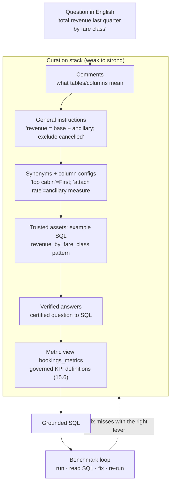

# Curate and tune a Genie Agent — the accuracy engine  ·  Module 14 · Topic 14.3 ★  ·  [Theory + Hands-on]

> **You are here:** Roadmap Module 14 → 14.3 (cornerstone deep-dive). This is the topic that decides whether your Genie Agent is trusted or ignored. Read the module hub `module.md` first for the 14.1–14.9 overview.
> **Prerequisites:** 14.1–14.2 (what a Genie Agent is; the "Unity Airways Revenue Analytics" Agent created over `unity_airways.analytics`). Strongly recommended: **Module 15** — its metric view `bookings_metrics` is the single most powerful curation asset you'll attach here.

## TL;DR
- **A Genie Agent's accuracy comes from curation, not the model.** The same model gives great answers on a well-briefed Agent and garbage on a bare one.
- **The curation stack, weakest to strongest:** table/column **comments** → **general instructions** → **synonyms** → **trusted assets** (verified example SQL / SQL functions) → **verified answers** → a **metric view** (the strongest, because it defines KPIs once and governs them).
- **Tune with a benchmark loop, not vibes:** write question→expected-answer pairs, run them, read the generated SQL, fix the misses with the right lever, re-run, watch accuracy climb.
- **Everything you curate is captured in the Agent's config** (`serialized_space`): sample questions, per-column configs, example question→SQL pairs, join specs, filter/measure snippets, and benchmarks — so it's exportable and versionable.
- **The through-line of the whole module:** Module 15's metric-view metadata (15.6 — synonyms, display names, formatting) *is* Genie curation. Define it once in the semantic layer; Genie inherits it.

## The problem
- You created the **"Unity Airways Revenue Analytics"** Agent in 14.2 and asked *"total revenue last quarter by fare class."* Genie returned a number — but it summed only `base_fare_usd`, ignored `ancillary_usd`, and included cancelled bookings. The number is wrong, and it looks authoritative.
- Ask the same question three ways ("revenue", "sales", "how much did we make") and you get three different SQL queries — sometimes three different numbers.
- A revenue manager can't tell a right answer from a confidently-wrong one, so they stop trusting the Agent. One bad number in a leadership meeting and the project is dead.

## Why the naive approach fails
- **"The model will figure out our schema."** It won't infer that Unity Airways revenue = base fare + ancillary, or that "last quarter" means the previous full calendar quarter, from column names alone. Business logic is not in the data types.
- **"Write one giant instruction paragraph and call it curated."** Prose instructions help, but they don't pin a *query*. For the KPIs leadership watches you need deterministic assets — verified answers and a metric view — not a paragraph the model interprets loosely each time.
- **"Tune by asking a few questions and eyeballing."** Without a repeatable **benchmark**, you can't tell whether a change helped or just moved the failures around. Tuning becomes superstition.
- **"Curate in Genie, define metrics somewhere else."** If the KPI logic lives in dashboards and notebooks instead of a **metric view**, Genie re-derives it and drifts. Curation and semantics must be the same source of truth.

## What it is
- **Curation** is the briefing you give the Agent so it writes the SQL an analyst would. It is a stack of assets, each more binding than the last, that ground the model's SQL generation.
- **Tuning** is the measured loop of adding/adjusting those assets against a benchmark until accuracy is where you need it.
- **Mental model:** you are onboarding a sharp but new analyst. Comments are the data dictionary; instructions are the team's rules; synonyms are the local slang; trusted assets are worked examples; verified answers are "always use this exact query for this question"; and the metric view is the official KPI handbook everyone already agreed on.

## Why it matters (for a Databricks FDE)
- **It's the difference between a demo and a deployment.** Any Genie Agent demos well on a softball question. Only a curated one survives a skeptical analyst asking the real questions.
- **It's the concrete case for the semantic layer.** The cleanest way to show a customer *why* they want metric views (Module 15) is to tune a Genie Agent with one and watch KPI accuracy jump. Curation is the sales pitch for governance.
- **It's reusable, governed, and exportable.** Curation lives in the Agent config and in UC objects (comments, metric views), so it's versionable and promotable dev→prod — not tribal knowledge.

## Core concepts

Every lever below maps to a real part of the Agent's saved configuration (`serialized_space`, schema v2), which is worth knowing because it tells you exactly what "curation" is made of:

- **Table & column comments** *(UC metadata)* — the base layer. `COMMENT ON` text is read by Genie as ground truth about what each table/column means. Cheapest, most underused lever.
- **Sample questions** *(config)* — seed questions shown in the UI; they teach vocabulary and show users what's answerable.
- **General instructions** *(instructions)* — plain-English rules the Agent always applies (metric definitions, default filters, time conventions, tone).
- **Column configs** *(data_sources.tables[].column_configs)* — per-column formatting (currency, %, dates) and **entity/value matching** (e.g. map "Gold" to the exact `loyalty_tier` value).
- **Trusted assets — example question→SQL** *(instructions.example_question_sqls)* — verified query patterns Genie reuses; the highest-impact non-metric-view lever.
- **Join specs** *(instructions.join_specs)* — how the star-schema tables join, so Genie stops guessing keys.
- **SQL snippets — filters & measures** *(instructions.sql_snippets)* — reusable named filters (e.g. "domestic only") and measures with usage instructions.
- **Benchmarks** *(benchmarks)* — question→expected-answer pairs used to measure quality and drive the tuning loop.
- **Verified answers** — certified question→SQL pairs (14.5) that get a trust badge and are reused verbatim.
- **Metric view** *(a UC data source)* — `bookings_metrics`: the governed KPI definitions (dimensions + measures) with synonyms and display names from 15.6. The strongest curation because the logic is defined once and governed centrally.

## 🗺️ Visual map

**The curation stack — each layer binds the SQL more tightly than the one below it:**



*Takeaway: add curation bottom-up (comments and a metric view first), and let a benchmark loop tell you which lever to reach for next. The metric view sits at the top because it makes the KPI definition governed and non-negotiable.*

---

## How it works — deep dive

### 1. Comments and the metric view come first (fix accuracy upstream)
- Before writing a single instruction, make sure every table and key column has a **`COMMENT`**, and that KPIs are defined in the **`bookings_metrics` metric view**, not re-derived.
- **Why this order:** most wrong answers are an *upstream* problem. If `ancillary_usd` has no comment and revenue isn't in the metric view, no amount of instruction prose will make Genie reliable. Fix the metadata; then curate.
- The metric view carries `total_revenue = SUM(base_fare_usd + ancillary_usd)`, `cancellation_rate`, `ancillary_attach_rate` — with the **synonyms and display names** added in 15.6. Genie reads those and stops guessing.

### 2. General instructions — the team's rules in plain English
- Write rules the Agent applies to every question. For Unity Airways:
  - *"'Revenue' means base fare plus ancillary spend (use the `total_revenue` measure from `bookings_metrics`)."*
  - *"Exclude cancelled bookings (`status = 'cancelled'`) unless the user asks about cancellations."*
  - *"'Last quarter' = the previous full calendar quarter based on `booking_date`."*
  - *"When a user names a loyalty tier, match the exact value: Blue/Silver/Gold/Platinum."*
- **Trade-off:** instructions are flexible and cheap but *interpreted* each time — great for conventions and defaults, not a substitute for a pinned query on a critical KPI.

### 3. Synonyms and column configs — speak the business's language
- Map business words to schema: "top cabin" → `fare_class = 'First'`; "attach rate" → the `ancillary_attach_rate` measure; "churn/cancellations" → `cancellation_rate`; "direct channel" → `channel = 'direct'`.
- **Column configs** add value-matching (so "Gold" resolves to the right `loyalty_tier` value) and formatting (USD, %, dates) so answers render correctly.
- **Why it matters:** most accuracy loss is vocabulary mismatch, not reasoning failure. Synonyms close that gap directly.

### 4. Trusted assets — example question→SQL (and SQL functions)
- Provide verified example pairs so Genie reuses a known-good pattern instead of improvising:
  - Q: *"Revenue by fare class for a given quarter"* → the exact SELECT that uses `bookings_metrics`, groups by `fare_class`, filters the quarter.
  - Q: *"Cancellation rate by route"* → the join + rate calculation.
- These teach the join keys, the grouping, and the measure usage in one shot. In config terms these are `example_question_sqls`, backed by `join_specs` and `sql_snippets`.
- **Trade-off:** more setup than instructions, far more reliable. This is the workhorse lever for common analytical shapes.

### 5. Verified answers — certify the queries that matter
- For the handful of questions leadership actually asks, mark the correct **question→SQL** as **verified** (14.5). Genie reuses that exact SQL and shows a trust badge.
- **Why:** it removes model variance entirely for your most important numbers. *"Total revenue last quarter by fare class"* becomes deterministic.

### 6. The benchmark quality loop — tune by measurement
- Build a **benchmark set**: 15–30 question→expected-answer pairs spanning your real questions plus known edge cases.
- The loop:
  1. **Run** the benchmark against the current Agent.
  2. **Read the generated SQL** for each miss — is it a metadata gap, a vocabulary gap, a join error, or a metric-definition gap?
  3. **Fix with the matching lever** (comment / metric view / synonym / example SQL / verified answer).
  4. **Re-run** and compare. Accuracy should trend up; a change that helps one question and breaks another is visible immediately.
- **Field reality:** this loop is the actual job of tuning. Treat every production **thumbs-down** (14.4) as a new benchmark row.

---

## How to do it on Databricks

**In the console (primary path):**
1. Open the **"Unity Airways Revenue Analytics"** Agent → **Instructions / Curation** panel (you need **CAN EDIT**).
2. Add **general instructions** (the rules above).
3. Add **example SQL** / trusted-asset queries for `revenue_by_fare_class` and `cancellation_rate_by_route`.
4. Add **synonyms** and set **column configs** (currency/%, value-matching for loyalty tiers).
5. Confirm the **metric view `bookings_metrics`** is attached as a data source.
6. Add **benchmark** question→answer pairs and run them.
7. Mark the top KPI questions as **verified answers**.

**Upstream (SQL) — the metadata layer that curation reads:**
```sql
-- Comments are curation Genie reads as ground truth. Do this before touching instructions.
COMMENT ON TABLE unity_airways.analytics.fct_bookings
  IS 'One row per booking. base_fare_usd + ancillary_usd = revenue; status in (booked, flown, cancelled).';
COMMENT ON COLUMN unity_airways.analytics.fct_bookings.ancillary_usd
  IS 'Ancillary spend (bags, seats, upgrades) in USD. Part of total revenue.';
COMMENT ON COLUMN unity_airways.analytics.fct_bookings.status
  IS 'Booking status: booked, flown, or cancelled. Exclude cancelled from revenue unless asked.';
```

**Export the curated config for backup / dev→prod (Agent config is versionable):**
```python
# Via the databricks-genie MCP tooling, an Agent's full curation exports as serialized_space (v2):
#   config.sample_questions
#   data_sources.tables[].identifier + column_configs
#   instructions.example_question_sqls | join_specs | sql_snippets (filters + measures)
#   benchmarks
# Export, remap the catalog if promoting to another workspace, then import.
exported = manage_genie(action="export", space_id="<space_id>")   # requires CAN EDIT
# exported["serialized_space"] contains everything above — back it up / diff it / promote it.
```

**How to verify it worked:** run the benchmark set before and after attaching the metric view + adding two verified examples. The share of questions returning the *right SQL and number* should rise measurably. Spot-check that *"total revenue last quarter by fare class"* now uses `total_revenue` from `bookings_metrics`, excludes cancelled, and returns the verified query with a badge.

---

## Worked example (Unity Airways)

Turning the wrong "revenue" answer from The problem into a trusted one:

1. **Upstream:** add `COMMENT`s to `fct_bookings` (revenue = base + ancillary; exclude cancelled) and confirm `bookings_metrics` defines `total_revenue`.
2. **Instruction:** *"Revenue = `total_revenue` from `bookings_metrics`; exclude cancelled bookings; 'last quarter' = previous full calendar quarter."*
3. **Synonym:** "sales" and "how much we made" → `total_revenue`; "top cabin" → `fare_class = 'First'`.
4. **Trusted example:** the `revenue_by_fare_class` SELECT that groups `total_revenue` by `fare_class` and filters the quarter.
5. **Benchmark:** add *"total revenue last quarter by fare class"* with the expected number; run — it now matches.
6. **Verify:** mark that question as a **verified answer** so it's deterministic and badged going forward.
7. **Loop:** a week later, a thumbs-down on *"ancillary attach rate by tier"* becomes a new benchmark row → add a synonym + example → re-run → fixed.

---

## Uses, edge cases and limitations

| Situation | Reach for | Why |
|---|---|---|
| A KPI must mean one thing everywhere | **Metric view** (`bookings_metrics`) | Defined once, governed, inherited by Genie and dashboards |
| A named question must be identical every time | **Verified answer** | Removes model variance for that exact query |
| Business slang doesn't match columns | **Synonyms + column configs** | Closes the vocabulary gap directly |
| A common analytical shape is written wrong | **Example SQL / trusted asset** | Teaches the join + grouping + measure usage |
| Conventions, defaults, tone | **General instructions** | Flexible rules applied to every question |
| You can't tell if a change helped | **Benchmark loop** | Measured tuning, not guesswork |
| Answers are wrong on many questions | Fix **comments + metric view first** | Accuracy is upstream before it's in-Agent |

## Common mistakes / gotchas
- Skipping **comments** and the **metric view** and trying to fix everything with instruction prose.
- **No benchmark** — tuning by vibes, so you can't tell improvement from churn.
- Overusing **general instructions** for critical KPIs instead of a **verified answer** or the **metric view** (deterministic beats interpreted for the numbers that matter).
- Curating metric logic **inside Genie only**, so dashboards drift from Genie — define it in the **metric view** so both agree.
- Judging by the **number**, not the **SQL** — you'll miss right-number-wrong-query bugs.
- Forgetting curation is **exportable** (`serialized_space`) — back it up and promote it, don't re-curate per environment.

## > 📌 IMPORTANT
- **Fix accuracy upstream first:** comments + metric view before instructions. Curation compounds from a good metadata base.
- **The metric view is the strongest lever** because it makes the KPI definition governed and shared — 15.6's synonyms/display names/formatting are Genie curation you get for free.
- **Tune against a benchmark.** Measured loops beat eyeballing every time.

## > 💡 TIP
- Keep a living benchmark set in a table/notebook; append every production thumbs-down as a new row.
- For each miss, diagnose the *type* (metadata / vocabulary / join / metric) and use the matching lever — don't reflexively add more prose.
- Verify your top ~10 leadership questions; let everything else ride on instructions + the metric view.

## > ⚠️ GOTCHA
- **Curation surfaces and labels move** between Genie releases (panels, "trusted assets" naming). Confirm the exact UI in the customer's workspace (live re-check pending on the trusted-assets doc page, which is JS-rendered).
- **Export requires CAN EDIT**, and promoting across workspaces means **remapping the catalog** inside `serialized_space` (it appears in table identifiers, SQL, join specs, and filters).
- A metric view needs a **Pro or Serverless SQL warehouse** — same requirement as the Genie Agent itself.

## 📝 Notes
- _Space for your own curation backlog and benchmark notes._

**Self-check (5 questions)**
1. Order the curation stack weakest→strongest, and say which one you always do first and why.
2. Why is attaching the `bookings_metrics` metric view stronger curation than a general instruction that defines revenue?
3. What is the benchmark loop, and what four *types* of miss should you diagnose when reading a wrong query's SQL?
4. When do you use a **verified answer** instead of an **example SQL** trusted asset?
5. What is stored in `serialized_space`, and why does that matter for dev→prod promotion?

## How this maps to the certification
- **Semantic layer + governed self-service:** the exam expects you to know that a Genie Agent's trustworthiness comes from **curation** and a **metric view**, not the model — and that **verified answers** certify specific query results.
- **Metric views (Module 15) feeding Genie (15.6 → 14):** define KPIs once with synonyms/display names/formatting; Genie inherits governed definitions. This is the tested link between business semantics and conversational analytics.

## Sources
- 📎 **Project cheat-sheet** — `.claude/skills/genai-teacher/references/naming-conventions.md` **§7** (verified July 2026): Genie Agents (formerly Genie Spaces) GA; curation-driven accuracy.
- 🧩 **Skill — `databricks-genie`** (`spaces.md`, `conversation.md`): the `serialized_space` (v2) anatomy that defines every curation lever — `config.sample_questions`, `data_sources.tables[].column_configs`, `instructions.example_question_sqls` (verified Q&A), `join_specs`, `sql_snippets` (filters + measures), `benchmarks`; the "descriptive comments + sample questions + instructions improve SQL generation" guidance; and export/import (CAN EDIT, catalog remap) for versioning curation.
- 📎 **Shared P5 build brief** — `unity_airways.analytics` star schema; `bookings_metrics` measures (`total_revenue`, `cancellation_rate`, `ancillary_attach_rate`) and dimensions; 15.6 agent metadata (synonyms, display names, formatting) → Module 14 continuity.
- 🌐 **Databricks Docs** (page titles confirmed live, deeper content JS-rendered — **live re-check pending**): Genie curation / trusted assets (set up) `docs.databricks.com/aws/en/genie/set-up`; Genie best practices `docs.databricks.com/aws/en/genie/best-practices`; metric views for Genie (Module 15).
- 📗 **B2 — Study Guide** — AI/BI Genie curation for accurate governed analytics (verify chapter; predates the "Genie Agents" rename — prefer current names).
