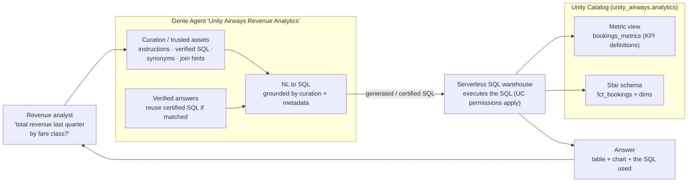
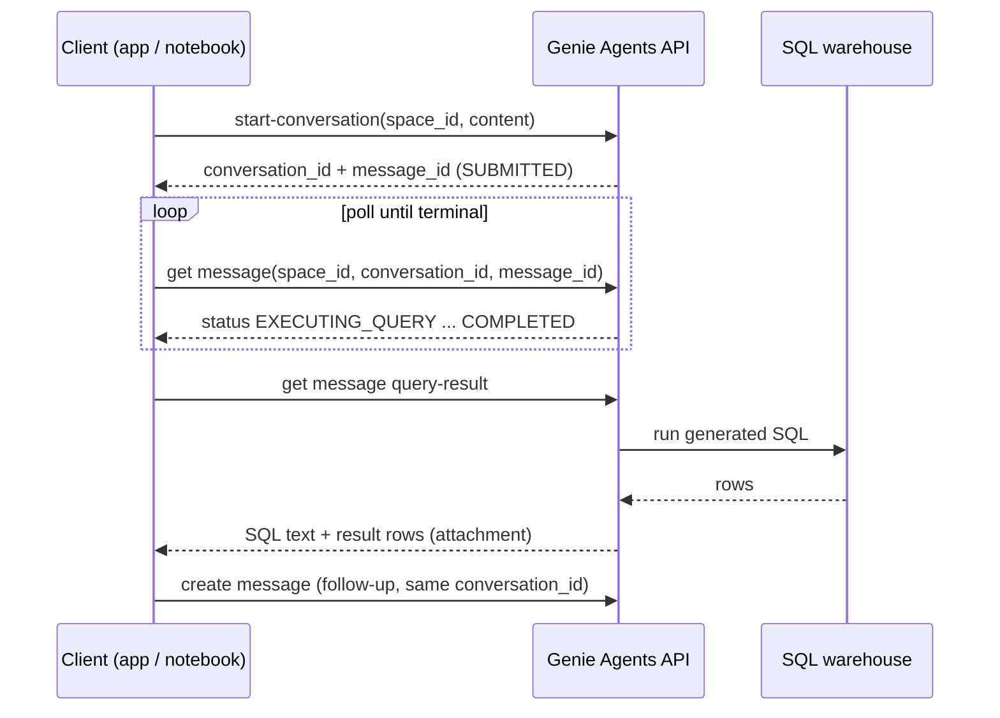

# AI/BI Genie — natural-language analytics on your governed data  ·  Module 14  ·  Topics 14.1–14.9  ·  [Theory + Hands-on]

> **You are here:** Roadmap Module 14 → AI/BI Genie (all topics 14.1–14.9). This is the **conversational-analytics** half of the curriculum — the "ask your data a question in English" surface that sits on top of Unity Catalog. It is an **independent track** (needs only **Module 00**), and it pairs with **Module 15** (metric views) as the semantic layer underneath.
> **Prerequisites:** **Module 00** (Unity Catalog, a serverless SQL warehouse). Strongly recommended: **Module 15** — its metric view `unity_airways.analytics.bookings_metrics` is the trusted KPI source this module's Genie Agent reads. Helpful context: **Module 09.11** (Genie is exposable as a managed MCP server) and **Module 10** (a Multi-Agent Supervisor can call a Genie Agent as its structured-data tool). Next stop: **Module 15 — Business Semantics (metric views)** if you skipped it, then **Module 16**.

This page is the **module hub**. It carries one numbered entry per topic (14.1–14.9). One topic is a cornerstone (★) with its own deep-dive page:
- **14.3 ★ — Curate and tune a Genie Agent** → `curate-tune-genie.md` / `curate-tune-genie.html`

Everything below builds one running artifact — the **"Unity Airways Revenue Analytics"** Genie Agent over the `unity_airways.analytics` schema. Its data sources are the star-schema tables (`fct_bookings`, `dim_flights`, `dim_customers`, `dim_airports`) **and** the governed metric view `unity_airways.analytics.bookings_metrics` from Module 15. A revenue analyst asks *"What was total revenue last quarter by fare class?"* in English; Genie writes the SQL, runs it on a serverless warehouse, and answers with a table, a chart, and the SQL it used.

> 📌 **The one rule that shapes this module — Genie is only as good as the semantic layer you point it at.**
> A Genie Agent is a natural-language front end. Its accuracy comes almost entirely from **curation**: table and column comments, a metric view with the official KPI definitions, general instructions, verified example queries, and synonyms. Point it at a well-modelled `unity_airways.analytics` (Module 15's metric view especially) and it answers like an analyst. Point it at raw, uncommented tables and it guesses.

---

## TL;DR
- **A Genie Agent is a natural-language interface to structured data in Unity Catalog.** You ask a business question in plain English; Genie generates SQL, runs it on a **serverless SQL warehouse**, and returns a result with the SQL shown. See 14.1–14.2.
- **Curation, not the model, drives accuracy** (14.3 ★): general instructions, **trusted assets** (verified example SQL / SQL functions), synonyms, and — the big one — a **metric view** (`bookings_metrics`) that carries the official KPI definitions so Genie never has to guess how "revenue" is calculated.
- **Verified answers** (14.5) let a data owner mark a specific question→SQL pair as certified; Genie reuses that exact query and shows a blue check. It is the trust primitive for governed self-service.
- **Agent mode** (14.6, formerly "deep research") lets Genie **plan and run multiple queries** for a broad, open-ended question and compose a cited multi-step report — beyond a single SELECT.
- **Programmatic access** (14.7–14.8): embed a Genie Agent in an external app via an **iframe**, or drive it with the **Genie Agents API** (Conversation API) over REST or the `w.genie.*` Python SDK.
- **Genie One** (14.9, formerly "Databricks One") is the simplified, single-entry UI for business users, with workspace- and account-level discovery, Agent-mode deep research, and spend **budgets**.

## The problem
- Unity Airways has a clean analytics schema, but the people who most need answers — revenue managers, route planners, loyalty analysts — do not write SQL.
- Every "quick number" (*"ancillary attach rate for Gold-tier passengers last quarter?"*) becomes a ticket to the data team. The data team becomes a query-writing bottleneck, and answers arrive a day late.
- Worse, when analysts *do* self-serve in a notebook, everyone computes "revenue" slightly differently — some include ancillary spend, some don't; some count cancelled bookings, some exclude them. The same question returns three different numbers in three meetings.
- The business wants **self-service** ("let me just ask") **without** giving up **governance** (one definition of each metric, row/column permissions, an audit trail).

## Why the naive approach fails
- **"Just give everyone SQL access and a wiki of table docs."** Non-analysts won't write SQL, and a wiki drifts out of date the moment the schema changes. The bottleneck stays.
- **"Point a generic text-to-SQL LLM at the raw tables."** With no comments, no join hints, and no metric definitions, the model hallucinates column meanings, invents joins, and computes metrics inconsistently. It is confidently wrong, which is worse than slow.
- **"Let each team define its own metrics in its own dashboard."** That is exactly how you get three different "revenue" numbers. Definitions must live **once**, in a governed place, or self-service multiplies confusion instead of reducing it.
- **"Bolt a chatbot on and skip the curation."** A Genie Agent with no instructions, no verified queries, and no metric view is the generic-LLM failure mode with a nicer logo. The product only shines when the semantic layer underneath is real.

## What it is
- **Plain-language definition:** a **Genie Agent** (formerly "Genie Space") is a **curated, governed, natural-language analytics interface** over a chosen set of Unity Catalog tables and metric views. It translates English questions into SQL, executes them on a serverless SQL warehouse, and presents the answer conversationally — with the generated SQL always visible for trust.
- **Mental model:** Genie is a **very well-briefed analyst**, not a magic model. The briefing is your curation: comments, instructions, verified example queries, synonyms, and (best of all) a **metric view** that pre-defines the KPIs. Give it a good briefing and it is reliable; give it none and it guesses.
- **Where it sits:** the loop is **business user → Genie Agent → Unity Catalog (tables + metric view) → serverless SQL warehouse → answer (table + chart + SQL)**, all inside UC governance (permissions, lineage, audit). It is one of Databricks' two conversational front ends — Genie for **structured** data (this module), a Knowledge Assistant for **unstructured** documents (Module 10).

## Why it matters (for a Databricks FDE)
- **The fastest "wow" on structured data.** Standing up a Genie Agent over a customer's gold tables and asking a real business question in English is a same-meeting win — the structured-data twin of the Module 10 Knowledge Assistant demo.
- **It is the self-service-vs-governance story made concrete.** You show a business user asking questions freely, while every metric resolves to one governed definition (the metric view) and every query respects UC permissions and lands in the audit log.
- **It composes with the rest of the platform.** A Genie Agent is a first-class **sub-agent** inside a Multi-Agent Supervisor (Module 10) for the "structured data" leg, and it is exposable as a **managed MCP server** (Module 09.11) so any agent can call it as a tool.
- **It sells the semantic layer.** The single best argument for Module 15 metric views *is* Genie: "define the KPI once, and every English question — and every dashboard — gets the same number." Module 14 and Module 15 are two ends of one story.
- It maps to the certification's **application/analytics** thread: knowing when a governed natural-language analytics surface is the right tool, and how curation and verified answers deliver trustworthy self-service.

## Core concepts
- **Genie Agent** — a curated natural-language interface over UC tables/metric views; generates and runs SQL on a serverless SQL warehouse. Formerly "Genie Spaces," earlier "AI/BI Genie." (14.1)
- **Data sources** — the tables and **metric views** a Genie Agent can query. For Unity Airways: the star schema plus `bookings_metrics`. Choosing well-modelled gold tables + a metric view is half the accuracy battle. (14.2)
- **Curation / trusted assets** — the briefing that makes Genie accurate: **general instructions**, **example SQL queries** (and SQL-function "trusted assets"), **join hints**, **synonyms**, and column/value formatting. The cornerstone. (14.3 ★)
- **Metric view** — a UC object that defines dimensions and measures (KPI logic) once; when a Genie Agent uses it, "revenue" always means the same thing. Built in Module 15 (`bookings_metrics`). (14.3, cross-link)
- **Benchmarks / quality loop** — a set of question→expected-answer pairs you run repeatedly to measure and improve the Agent's accuracy as you tune. (14.3–14.4)
- **Verified answers** — a certified question→SQL pair a data owner blesses; Genie reuses that exact SQL and marks the answer with a check. The trust primitive. (14.5)
- **Agent mode** — Genie plans and runs **multiple** queries for a broad question and composes a cited, multi-step report (formerly "deep research" / "Research Agent"). (14.6)
- **Genie Agents API (Conversation API)** — REST + `w.genie.*` SDK to start a conversation, send a message, poll it to `COMPLETED`, and fetch the SQL result — the basis for embedding and automation. (14.7–14.8)
- **Genie One** — the simplified single-entry UI for business users; workspace + account-level discovery, Agent-mode deep research, and spend budgets. Formerly "Databricks One." (14.9)

## 🗺️ Visual map

**How a Genie Agent answers one Unity Airways question — from English to a governed SQL result:**

*Takeaway: Genie is a front end. The accuracy lives in the curation box and, above all, in the metric view — the model just assembles SQL from a good briefing and runs it under governance.*

**The Genie Agents API round-trip (14.8) — the sequence behind embedding and automation:**

*Takeaway: start → poll the message to a terminal status → fetch the query result. Follow-ups reuse the same `conversation_id` so Genie keeps context. The `and_wait` SDK helpers collapse the polling loop for you.*

---

## 14.1 Genie Agents concepts — how Genie works  ·  [Theory]

A **Genie Agent** is a curated, natural-language interface to **structured** data governed by Unity Catalog.

- **What happens on a question:** Genie reads your question, uses table/column **metadata + your curation** to generate SQL, runs it on a **serverless SQL warehouse**, and returns the result plus the SQL it wrote. You (and the business user) can always inspect and correct the SQL.
- **Why the SQL is always shown:** trust. Unlike a black-box chatbot, every Genie answer exposes exactly how it got the number, so an analyst can verify or a data owner can turn a good query into a **verified answer** (14.5).
- **Governance is inherited, not added.** Genie runs queries under Unity Catalog, so **row/column permissions, lineage, and audit logging apply automatically** — a user only ever sees data they are already allowed to see.
- **Structured vs unstructured.** Genie is the front end for **tables and metric views**. For document Q&A you want a **Knowledge Assistant** (Module 10). A Multi-Agent Supervisor can route across both.

> ⚠️ **GOTCHA — the rename:** these were called **"Genie Spaces"** (and earlier "AI/BI Genie") until 2026; docs, older blogs, and the SDK/REST path still say **`spaces`** (e.g. `/api/2.0/genie/spaces/...`). The **product name is now "Genie Agents"** — teach the current name, but don't be surprised that the API surface keeps the `spaces` noun.

---

## 14.2 Create and manage a Genie Agent  ·  [Hands-on]

Creating the **"Unity Airways Revenue Analytics"** Agent is a short console flow — the work is choosing good data sources.

- **Where:** the workspace **Genie** area (SQL / AI-BI section) → **New** (or from a table/dashboard's context menu). It is UI-first; there is no "create-space" authoring API in the current SDK, so build it in the console.
- **Pick a warehouse:** a Genie Agent needs a **serverless (or Pro) SQL warehouse** to run queries. Pick one that is running for a snappy demo.
- **Add data sources (the important step):** attach the `unity_airways.analytics` star-schema tables **and** the `bookings_metrics` **metric view**. Prefer **gold, well-commented** tables and the metric view over raw/bronze — Genie leans on comments and the metric view's definitions.
- **Seed sample questions** so business users know what to ask, and so Genie learns your vocabulary:
  - *"What was total revenue last quarter by fare class?"*
  - *"Which routes have the highest cancellation rate?"*
  - *"Compare ancillary attach rate across loyalty tiers."*
- **Set permissions:** share the Agent with **CAN VIEW** (ask questions) or **CAN EDIT** (curate). Editors can export/import the Agent config for backup or dev→prod migration.

**How to verify it worked:** ask one of the sample questions in the Agent's chat. You should get a numeric answer, a chart, and a visible SQL query that references `bookings_metrics` (or the star tables). If the SQL joins the wrong tables or miscounts, that is a **curation** signal — go to 14.3.

> 💡 **TIP:** The single highest-leverage setup choice is attaching the **metric view**. It hands Genie the official `total_revenue`, `cancellation_rate`, and `ancillary_attach_rate` definitions, so it never has to reverse-engineer them from raw columns.

---

## 14.3 ★ Curate and tune a Genie Agent  ·  [Theory + Hands-on]

> **Cornerstone.** Full deep-dive — general instructions, example SQL / trusted assets, synonyms, the benchmark quality loop, verified answers, and how each lever moves accuracy — lives in `curate-tune-genie.md` / `curate-tune-genie.html`. Summary here.

Curation is where a Genie Agent goes from "cute demo" to "the number the CFO trusts." You are writing the analyst's briefing.

- **General instructions** — plain-English rules the Agent always follows: *"Revenue means base fare plus ancillary. Exclude cancelled bookings unless asked. 'Last quarter' means the previous full calendar quarter."* This is the cheapest, highest-impact lever.
- **Trusted assets — example SQL and SQL functions** — verified, parameterized query patterns the Agent can reuse. A trusted `revenue_by_fare_class` example teaches the exact join and grouping, so Genie stops improvising it.
- **The metric view (`bookings_metrics`)** — the strongest form of curation. Because Module 15 defined `total_revenue`, `cancellation_rate`, and `ancillary_attach_rate` **once** with `synonyms` and friendly display names (15.6), Genie inherits governed KPI logic instead of guessing. **15.6 metadata → 14 accuracy** is the through-line of this module.
- **Synonyms** — map business vocabulary to columns/values: "top cabin" → `fare_class = 'First'`, "attach rate" → the ancillary measure, "churn" → your cancellation metric.
- **Benchmarks + quality loop** — a set of question→expected-answer pairs you re-run after each change, so tuning is measured, not vibes. Fix the misses; re-run; watch accuracy climb.
- **Verified answers** — bless the correct query for a common question so it is reused and marked trusted (14.5).

**How to verify it worked:** re-run your benchmark set after adding instructions + the metric view + a couple of verified examples; the share of questions answered with the *right* SQL and number should measurably rise (that is the whole game).

> 📌 **IMPORTANT:** Tune **upstream first**. Most wrong answers trace to missing **table/column comments** or a metric not defined in the **metric view** — fix those before piling on instructions. Curation compounds: good metadata + a metric view + a few verified answers beats a wall of prose instructions.

---

## 14.4 Test and monitor a Genie Agent  ·  [Hands-on]

Shipping a Genie Agent is the start, not the end — you test it before rollout and monitor it in use.

- **Test before rollout:** run your **benchmark** questions and a set of adversarial/edge questions (ambiguous phrasing, questions the data *can't* answer). A healthy Agent answers what it can and **asks for clarification** (or says it can't) rather than inventing a join.
- **Read the generated SQL, not just the number.** A right number from wrong SQL (e.g. a coincidental match) is a latent bug. Reviewing SQL is how you catch it.
- **Monitor in production:** Genie surfaces **usage and feedback** — which questions get asked, thumbs-up/down, and which queries fail. Every query also lands in **UC audit logs** and query history, so you can see load, cost, and access patterns.
- **Close the loop:** turn frequent, correct questions into **verified answers** (14.5); turn frequent *wrong* ones into new instructions/examples (14.3). Monitoring feeds curation.

**How to verify it worked:** after a week of use, open the Agent's monitoring view — you should see the top questions, a feedback signal, and any failing queries. The failing/thumbs-down ones are your next curation backlog.

> 💡 **TIP:** Treat thumbs-down as free labelling. Each one is a real user telling you exactly which question your curation doesn't yet cover — the highest-signal input to the 14.3 quality loop.

---

## 14.5 Verified answers and trust/safety  ·  [Theory]

**Verified answers** are the trust primitive that makes governed self-service safe at scale.

- **What it is:** a data owner (CAN EDIT) marks a specific **question → SQL** pair as **verified**. When a user asks that question (or a close paraphrase), Genie **reuses the certified SQL** and shows a **verified/blue-check** badge instead of re-generating.
- **Why it matters:** it removes model variance from the answers that matter most. *"What was total revenue last quarter?"* should return the exact same governed query every time — verified answers guarantee it.
- **Trust and safety, layered:**
  - **Governance:** UC row/column permissions, lineage, and audit apply to every query — a user can't use Genie to see data they lack rights to.
  - **Transparency:** the SQL is always visible, so answers are auditable, not black-box.
  - **Determinism where it counts:** verified answers + a metric view pin the important metrics to one definition and one query.
  - **Graceful failure:** a well-curated Agent asks for clarification or declines rather than fabricating SQL for an unanswerable question.

> 📌 **IMPORTANT:** Verified answers and the **metric view** are complementary trust layers. The metric view guarantees the *metric definition* is consistent; a verified answer guarantees the *whole query* for a named question is the blessed one. Use both for the KPIs leadership watches.

---

## 14.6 Agent mode in Genie Agents  ·  [Theory + Hands-on]

**Agent mode** turns Genie from a one-shot text-to-SQL tool into something that **plans and iterates**.

- **What it does:** for a broad, open-ended question — *"Why did revenue dip last quarter?"* — Agent mode **breaks the question into multiple sub-queries**, runs them, reasons over the intermediate results, and composes a **cited, multi-step report** (with each supporting query shown).
- **Single-query Genie vs Agent mode:** a normal question maps to one SELECT. Agent mode is for analysis that needs several queries chained together (segment, compare, drill down) — the difference between "give me the number" and "investigate this for me."
- **Naming:** this capability was previously described as **"deep research"** / a **"Research Agent."** Teach it as **Agent mode**.
- **Unity Airways example:** *"Explain the drop in Gold-tier ancillary revenue last quarter"* → Agent mode queries ancillary revenue by tier over time, isolates Gold, compares routes/fare classes, and returns a short narrative with the queries it ran.

**How to verify it worked:** ask a broad "why/how" question with Agent mode on; the response should be a multi-part analysis with **more than one** supporting query, not a single SELECT.

> ⚠️ **GOTCHA:** Agent mode runs **multiple** queries, so it costs more warehouse time and takes longer than a single question. Use it for genuine investigations, not for "what was revenue yesterday." Verify its exact availability/label in your workspace — Genie capabilities and their names change between releases.

---

## 14.7 Embed a Genie Agent in an external app  ·  [Hands-on]

You can put a Genie Agent inside an app your users already live in — no rebuild of the analytics engine.

- **Two integration paths:**
  1. **Iframe embed** — embed the Genie UI (a specific Agent) directly in an internal web app or portal via an iframe. Fastest path to a branded, in-context "ask your data" box. Requires the workspace to permit embedding for the target domain.
  2. **API integration** — drive Genie from your own UI/backend with the **Genie Agents API** (14.8) and render results however you like.
- **Auth:** an embedded/API-driven Genie call runs as an identity (user via SSO/OAuth, or a service principal with a token). **UC permissions still apply** — embedding does not bypass governance.
- **Databricks Apps option:** for a fully custom front end hosted on Databricks, a **Databricks App** (Module 10) can call the Genie Agents API and present results in your own chat UI — the same pattern as fronting an agent endpoint.

**How to verify it worked:** load the host app, ask a Unity Airways question through the embedded Genie, and confirm you get an answer scoped to your permissions — then confirm a user without table access sees an appropriately empty/blocked result.

> 💡 **TIP:** Iframe embedding is the quickest demo; the **API path** is what you build for a production, brand-controlled experience. Choose the iframe for speed, the API for control.

---

## 14.8 Genie Agents API (Conversation API)  ·  [Hands-on]

The **Genie Agents API** (the Conversation API) is how you drive a Genie Agent programmatically — the engine behind embedding, automation, and agent-as-tool.

- **The REST round-trip** (base `/api/2.0/genie/spaces/{space_id}` — note the path keeps the legacy `spaces` noun):
  1. `POST .../start-conversation` with body `{"content": "your question"}` → returns a `conversation_id` and a `message_id`.
  2. `GET .../conversations/{conversation_id}/messages/{message_id}` → **poll** `status` until a terminal state (`COMPLETED` / `FAILED` / `CANCELLED`).
  3. `GET .../conversations/{conversation_id}/messages/{message_id}/query-result` (or the per-attachment query-result) → the SQL result rows.
  4. `POST .../conversations/{conversation_id}/messages` with `{"content": "..."}` → a **follow-up** in the same conversation (Genie keeps context).
- **The Python SDK** (`databricks-sdk`) wraps this as `w.genie.*` (verified against SDK 0.73.0):
  - `w.genie.start_conversation(space_id, content)` / `w.genie.start_conversation_and_wait(space_id, content)`
  - `w.genie.create_message(space_id, conversation_id, content)` / `w.genie.create_message_and_wait(...)`
  - `w.genie.get_message(space_id, conversation_id, message_id)` — inspect `.status` (a `MessageStatus`) and `.attachments`
  - `w.genie.get_message_query_result(space_id, conversation_id, message_id)` — returns a `statement_response` with the rows; `get_message_attachment_query_result(...)` for a specific attachment
  - `w.genie.get_space(space_id)`, `w.genie.list_spaces()`
- **The `_and_wait` helpers** poll for you (default timeout 20 minutes) and return the completed `GenieMessage` — use them in notebooks; use the raw `start`/`get`/poll form when you need custom timeout/UX.
- A message's answer arrives as **attachments**: a `text` attachment (Genie's prose) and/or a `query` attachment (the generated SQL + a `statement_id` you resolve to rows via the query-result call).

**How to verify it worked:** run the round-trip against the Unity Airways Agent, print the returned **SQL** and the **first rows** — they should match what the Agent shows in the UI for the same question. Then send a follow-up on the same `conversation_id` and confirm Genie uses prior context.

> 📌 **IMPORTANT:** The REST path uses **`spaces`** and the SDK namespace is **`w.genie`** — that split trips people up. Poll the **message** for status; fetch the **query-result** separately for rows. Do not assume a made-up method name — the verified surface is the `w.genie.*` list above (SDK 0.73.0); re-verify against your installed SDK version.

---

## 14.9 Genie One — the unified business-user interface  ·  [Theory + Hands-on]

**Genie One** is the simplified, single front door for **business users** — the place a non-technical stakeholder lands to ask questions across everything they're allowed to see.

- **What it is:** a streamlined Databricks UI (formerly **"Databricks One"**) built for consumers of analytics, not builders. It strips the full workspace down to "ask and get answers."
- **Discovery, workspace + account level:** it surfaces the **Genie Agents, AI/BI dashboards, and Databricks Apps** a user has access to — so a business user finds the "Unity Airways Revenue Analytics" Agent without navigating the data-engineering workspace.
- **Domains** *(Preview):* a way to organize discoverable assets by business area (e.g. Revenue, Operations, Loyalty) so users find the right Agent faster.
- **Agent-mode deep research:** the multi-step investigation of 14.6, surfaced for business users in the unified UI.
- **Budgets:** spend controls/thresholds so self-service analytics doesn't run up an unbounded serverless bill — governance for cost, alongside UC governance for data.

**How to verify it worked:** sign in as a business user (or a scoped test identity), open Genie One, and confirm you can discover and open the Unity Airways Revenue Analytics Agent and an AI/BI dashboard **without** touching the full workspace UI — and only the assets you have rights to.

> ⚠️ **GOTCHA — the rename and the maturity split:** it is **"Genie One,"** not "Databricks One." The **core unified UI is GA**, but pieces like **Domains are Preview**. Verify feature-by-feature availability in the customer's workspace before promising a specific capability — Genie One is evolving quickly.

---

## Worked example (Unity Airways, end to end)

Building and driving the **"Unity Airways Revenue Analytics"** Genie Agent:

1. **Semantics first (Module 15):** the `unity_airways.analytics.bookings_metrics` metric view defines `total_revenue`, `cancellation_rate`, and `ancillary_attach_rate` once, with synonyms and display names (15.6). This is the foundation.
2. **Create the Agent (14.2):** in the Genie console, create **"Unity Airways Revenue Analytics"** on a serverless warehouse; attach the star-schema tables **and** `bookings_metrics`; seed the three sample questions.
3. **Curate (14.3 ★):** add general instructions (what "revenue" and "last quarter" mean, exclude cancelled), a couple of verified example SQL patterns, and synonyms ("top cabin" → First, "attach rate" → ancillary measure). Build a small benchmark set.
4. **Test (14.4):** run the benchmark + edge questions; read the SQL, not just the numbers; fix misses via instructions/examples; re-run.
5. **Verify (14.5):** mark *"What was total revenue last quarter by fare class?"* as a **verified answer** so it always returns the blessed SQL with a check.
6. **Investigate (14.6):** turn on **Agent mode** and ask *"Why did Gold-tier ancillary revenue drop last quarter?"* — get a cited multi-query report.
7. **Integrate (14.7–14.8):** drive the Agent from a notebook/app via the **Genie Agents API** (`w.genie.start_conversation_and_wait` → `get_message_query_result`), or embed the UI in a portal via iframe.
8. **Publish for the business (14.9):** business users discover and use the Agent through **Genie One**, under spend budgets.

---

## Uses, edge cases and limitations

| Use it when | Be careful when | Better move |
|---|---|---|
| Business users need to self-serve numbers from governed tables | The tables are raw/uncommented | Model + comment first (gold + a metric view), then Genie |
| You want one governed definition of each KPI in every answer | Each team has its own metric logic | Define once in a **metric view** (Module 15), attach it |
| A named KPI question must be identical every time | The model paraphrases the query differently | Mark a **verified answer** (14.5) |
| A broad "why/how" investigation across several queries | It's a simple one-number question | Single-query Genie, not Agent mode (14.6) |
| You need Genie inside another app | You need full brand control | **API** (14.8), not just the iframe (14.7) |
| Business users need a simple front door | They're navigating the full workspace | **Genie One** (14.9) |
| Structured tables / metric views | The question is about documents/PDFs | A **Knowledge Assistant** (Module 10), or a Supervisor across both |

## Common mistakes / gotchas
- Calling them **"Genie Spaces"** — the product is **Genie Agents** (the REST path still says `spaces`, which is a separate thing).
- Pointing Genie at **raw, uncommented tables** and blaming the model for bad SQL — accuracy is a **curation/metadata** problem first.
- **Not attaching the metric view**, so Genie re-derives KPIs inconsistently instead of using the governed `bookings_metrics` definitions.
- Judging answers by the **number only** and not reading the **generated SQL** — a right number from wrong SQL is a latent bug.
- Using **Agent mode** for simple questions (slower + more warehouse cost) or expecting single-query Genie to do multi-step investigation.
- Assuming embedding/API **bypasses governance** — UC permissions always apply to the querying identity.
- Inventing **SDK method names** — the verified surface is `w.genie.start_conversation(_and_wait)`, `create_message(_and_wait)`, `get_message`, `get_message_query_result` (SDK 0.73.0); re-verify for your version.
- Saying **"Databricks One"** — it is **Genie One** now; and Domains are Preview.

## > 📌 IMPORTANT callouts
- **Genie's accuracy is curation, not the model.** Comments + a metric view + instructions + verified answers are the product. This is the whole reason 14.3 is the cornerstone and Module 15 exists.
- **Governance is inherited.** Every Genie query runs under Unity Catalog permissions, lineage, and audit — self-service without a governance hole.
- **Names:** **Genie Agents** (not Genie Spaces), **Agent mode** (not "deep research"/"Research Agent"), **Genie One** (not Databricks One). The API path keeps the legacy `spaces` noun.

## > 💡 TIP
- The highest-leverage setup step is **attaching the metric view** — it hands Genie the official KPI definitions for free.
- **Read the SQL** on every test question; treat every **thumbs-down** as a labelled gap for your curation backlog.
- Choose the **iframe** for a fast embed, the **API** for a production, brand-controlled experience.
- Use the `_and_wait` SDK helpers in notebooks; use the raw start/poll form when you need custom timeouts.

## > ⚠️ GOTCHA
- The **rename**: Genie Spaces → **Genie Agents**; Databricks One → **Genie One**. Book/older-doc language will lag.
- **Agent mode costs more** (multiple queries) — reserve it for real investigations.
- **GA vs Preview**: core Genie Agents, the Genie Agents API, and Agent mode are **GA**; **Domains** (Genie One) are **Preview**. Verify feature availability live per workspace — Genie moves fast (live re-check pending on exact per-feature status).

## 📝 Notes
- _Space for your own notes as you work through the module._

**Self-check (5 questions)**
1. In one sentence, what is a Genie Agent, and what actually determines whether its answers are accurate?
2. Name three curation levers from 14.3 and explain why attaching the `bookings_metrics` metric view is the strongest one. How does 15.6 feed Module 14?
3. What is a **verified answer**, and how is it different from (and complementary to) a metric view?
4. Describe the Genie Agents API round-trip: which call starts a conversation, how do you know the answer is ready, and how do you get the rows? Name two `w.genie.*` methods.
5. What is **Agent mode** for (and when should you *not* use it), and what is **Genie One** (including its former name)?

## How this maps to the certification
- **Analytics / application thread:** knowing that **AI/BI Genie (Genie Agents)** is Databricks' governed **natural-language interface to structured data**, when to reach for it over a hand-written query or a document Q&A bot, and how it inherits Unity Catalog governance.
- **Semantic layer:** understanding that a **metric view** (Module 15) is what makes Genie's KPI answers consistent — the exam-relevant link between business semantics and conversational analytics (15.6 → 14).
- **Trust and integration:** **verified answers** as the certification-trust primitive; the **Genie Agents API** and **iframe embedding** as the programmatic surfaces; **Agent mode** for multi-step analysis; and Genie as a **Multi-Agent Supervisor** sub-agent / **managed MCP** tool (Modules 10 and 09.11).
- Exam-relevant facts this module nails: Genie Agents = curated NL-to-SQL over UC tables/metric views on a serverless warehouse (GA); accuracy = curation (instructions, trusted assets/example SQL, synonyms, metric view); **verified answers** = certified question→SQL; **Agent mode** = multi-query cited report (formerly deep research); **Genie Agents API** = start-conversation → poll message → query-result (`w.genie.*`); **Genie One** = business-user unified UI (formerly Databricks One), Domains Preview.

## Sources
- 📎 **Project cheat-sheet (primary for this module)** — `.claude/skills/genai-teacher/references/naming-conventions.md` **§7 AI/BI Genie & Genie One** (verified July 2026): **Genie Agents** (formerly Genie Spaces / AI-BI Genie) **GA**; **Agent mode** (formerly "Research Agent"/"deep research") **GA**; **Genie Agents API** (Conversation + Management APIs) + iframe embedding **GA**; **Genie One** (formerly "Databricks One") core **GA**, **Domains Preview**.
- 🧩 **Skill — `databricks-genie`** (`SKILL.md`, `spaces.md`, `conversation.md`): the `serialized_space` (v2) anatomy that defines curation — `data_sources.tables[].column_configs`, `instructions.example_question_sqls` (certified Q&A), `join_specs`, `sql_snippets` (filters + measures), and `benchmarks`; the create/curate/test workflow; and the Conversation API (`ask_genie` / start-conversation → follow-up with `conversation_id`) behavior.
- 🧩 **`databricks-sdk` 0.73.0** (introspected at authoring): `w.genie.start_conversation`, `start_conversation_and_wait`, `create_message`, `create_message_and_wait`, `get_message`, `get_message_query_result`, `get_message_attachment_query_result`, `get_space`, `list_spaces`; `MessageStatus` values `SUBMITTED / FILTERING_CONTEXT / ASKING_AI / PENDING_WAREHOUSE / EXECUTING_QUERY / COMPLETED / FAILED / CANCELLED / QUERY_RESULT_EXPIRED / FETCHING_METADATA`.
- 📎 **Shared P5 build brief** — `unity_airways.analytics` star schema + `bookings_metrics` metric view; locked Genie Agent name **"Unity Airways Revenue Analytics"**; verified REST endpoints (`POST /api/2.0/genie/spaces/{space_id}/start-conversation`, `.../conversations/{conversation_id}/messages`, `GET .../messages/{message_id}`, `.../query-result`).
- 🌐 **Databricks Docs** (page titles confirmed live via bounded curl, July 2026; deeper content JS-rendered — **live re-check pending** on per-feature GA/Preview and the trusted-assets page): **Genie Agents** `docs.databricks.com/aws/en/genie/`; **Genie Agents API** `docs.databricks.com/aws/en/genie/conversation-api`; **Agent mode** `docs.databricks.com/aws/en/genie/agent-mode`; trusted assets / curation (set up) `docs.databricks.com/aws/en/genie/set-up`; **Genie One** `docs.databricks.com/aws/en/genie-one/genie`.
- 📗 **B2 — *Databricks Certified Generative AI Engineer Associate Study Guide*** — AI/BI Genie for governed natural-language analytics (verify exact chapter; the study guide predates the "Genie Agents"/"Genie One" renames, so prefer the current names above and treat book terminology as legacy).
