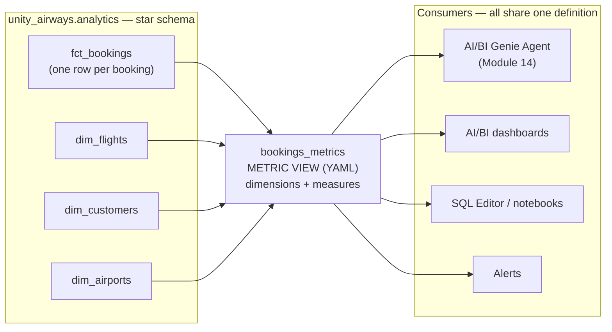
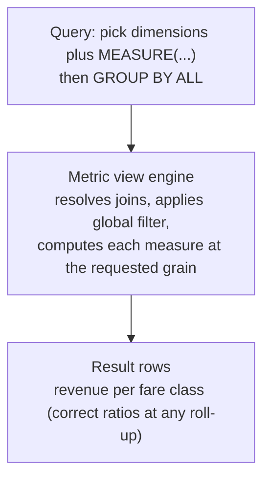

# Business Semantics — Unity Catalog metric views  ·  Module 15  ·  Topics 15.1–15.7  ·  [Theory + Hands-on]

> **You are here:** Roadmap Level 6 → Module 15 (Business Semantics, Unity Catalog metric views), all topics 15.1–15.7. This module builds the **governed KPI layer** that Module 14's **AI/BI Genie Agent** queries as a trusted source.
> **Prerequisites:** basic SQL and a **Pro or Serverless SQL warehouse** (or a DBR 17.2+ cluster). Helpful: **Unity Catalog** basics (Module 02) for catalog/schema/grants. Next stop: **Module 14 — AI/BI Genie** (this metric view becomes the Genie Agent's trusted source; 15.6 → 14), then **Module 16** (cost, performance and scaling).

This page is the **module hub**. It carries one numbered entry per topic (15.1–15.7). One topic is a cornerstone (★) with its own deep-dive page:
- **15.3 ★ — Query metric views; tutorial with joins** → `query-metric-views.md` / `query-metric-views.html`

Everything below builds one running artifact — the **Unity Airways** semantic layer: a star schema in `unity_airways.analytics`, and a single metric view `unity_airways.analytics.bookings_metrics` that every dashboard, SQL query, and the Module 14 Genie Agent share as the one place where "revenue" and "cancellation rate" are defined.

> 📌 **The one rule that shapes this module — define each metric once, in YAML, and let every tool re-aggregate it safely.** A metric view separates **how a measure is computed** (`SUM(base_fare_usd + ancillary_usd)`) from **how it is sliced** (by fare class, by month, by region). The aggregation is *not* baked in at creation time the way a regular view bakes in its `GROUP BY`. Consumers pick the grain at query time with `MEASURE()`, and ratios like cancellation rate stay correct at every level of roll-up. That is the whole point of a semantic layer: one definition, many questions, no drift.

---

## TL;DR
- A **metric view** is a Unity Catalog object defined in **YAML** that holds **dimensions** (how you slice) and **measures** (how you aggregate), separately — so aggregation happens **at query time**, not at creation time.
- You query it with the **`MEASURE()`** function and `GROUP BY ALL`; **`SELECT *` is not supported** — you always name the dimensions and wrap measures in `MEASURE()`.
- It solves **metric drift**: instead of five dashboards each writing their own slightly-different "revenue" SQL, everyone reads the one governed definition. Ratios (cancellation rate, attach rate) re-aggregate **correctly** at any grain.
- It models a **star / snowflake schema** with `joins` declared in the YAML, so a consumer never writes a JOIN — they just ask for `Region` and the view resolves it.
- **15.6:** business-friendly measure/dimension **names + `comment`s** are the metadata that **AI/BI Genie (Module 14)** reads to answer natural-language questions accurately — the metric view is Genie's trusted, governed source of KPIs.

## The problem
- Unity Airways has revenue numbers everywhere: a finance dashboard, an ops dashboard, an analyst's ad-hoc notebook, and now a **Genie Agent** that answers "what was total revenue last quarter by fare class?" in plain English.
- Each of those was built by a different person at a different time. The finance dashboard counts `base_fare_usd` only. The ops dashboard adds `ancillary_usd`. The analyst filters out cancelled bookings; the Genie Agent doesn't. Same word — "revenue" — four different numbers.
- When the numbers disagree in a leadership meeting, nobody trusts any of them. The semantic layer problem is not a SQL problem; it is a **single-source-of-truth** problem.

## Why the naive approach fails
- **"Just write a regular view with the GROUP BY baked in."** A standard view like `SELECT fare_class, SUM(...) AS revenue FROM ... GROUP BY fare_class` locks the grain forever. Ask it for revenue by *month* and you are writing a second view. Ask for a *ratio* (cancellation rate) rolled up to region and a naive view averages the per-route rates — which is wrong. Metrics multiply into a maze of near-duplicate views.
- **"Put the definitions in each dashboard / BI tool."** Now the logic lives in N tools, drifts independently, and cannot be governed or granted as one Unity Catalog object. There is no lineage from "revenue" to the column it came from.
- **"Let Genie infer the metrics from raw tables."** Genie *can* query raw tables, but then it re-derives "revenue" from column names and comments every time, and different phrasings produce different SQL. Point Genie at a **metric view** and "revenue" always means the one governed `MEASURE(Total Revenue)`.
- **"Pre-aggregate everything into summary tables."** Fast, but you must predict every slice in advance, and you still hand-code each ratio. A metric view keeps one definition and computes any slice on demand (and can *optionally* materialize the hot ones — 15.5).

## What it is
- **Plain-language definition:** a **metric view** is a governed Unity Catalog view, created with `CREATE VIEW ... WITH METRICS LANGUAGE YAML`, whose body is a small YAML document. The YAML names a **source** table (plus optional **joins** to dimension tables), a list of **dimensions** (categorical slices, each an SQL expression), and a list of **measures** (aggregate expressions like `SUM(...)`). Nothing is aggregated until someone queries it.
- **Mental model:** a regular view is a *photograph* — the aggregation is fixed at the moment you take it. A metric view is a *lens* — it holds the recipe, and each query develops a different picture (by month, by region, by tier) from the same recipe.
- **Where it sits:** `star-schema tables (fct + dims) → metric view (bookings_metrics) → every consumer (SQL Editor, AI/BI dashboards, Genie Agent, Alerts)`. The metric view is the **contract** between the data and everyone who asks it questions.

## Why it matters (for a Databricks FDE)
- **It is the trust layer under Genie.** Module 14's Genie Agent is only as good as the metrics it queries. A metric view gives Genie unambiguous, governed measures — so "revenue" in chat equals "revenue" on the finance dashboard. 15.6 is the hand-off point between these two modules.
- **One definition, governed by Unity Catalog.** The metric view is a UC object: you `GRANT SELECT` on it, it has lineage back to `fct_bookings`, and changing the definition changes it everywhere at once. No more chasing dashboard copies.
- **Ratios stay correct.** Cancellation rate and ancillary attach rate are ratios of sums. A metric view re-computes the numerator and denominator at each grain, so the region-level rate is a true region-level rate — not an average of route rates. This is the single most common thing hand-rolled SQL gets wrong.
- **Less SQL for consumers.** Joins live in the YAML once. An analyst asking for revenue by `Region` never writes a JOIN — they name a dimension and the view resolves the star/snowflake path.
- It is the semantic backbone of the **Conversational Analytics** story you sell: governed metrics → Genie → business users self-serve in plain English, with the same numbers finance trusts.

## Core concepts
- **Metric view** — a UC view created `WITH METRICS LANGUAGE YAML`; body is YAML with `version`, `source`, optional `filter`/`joins`, and required `dimensions` + `measures`. See 15.1, 15.7.
- **Dimension** — a categorical attribute you slice/group by (Fare Class, Region, Booking Month). An SQL expression (a column, a `CASE`, a `DATE_TRUNC`, or a joined column). **Cannot** contain an aggregate. Backtick-quoted in queries when the name has spaces. See 15.4.
- **Measure** — an **aggregate** expression computed at query time (`SUM`, `COUNT`, `AVG`, ratios, `FILTER (WHERE ...)`). Queried only through `MEASURE(name)`. See 15.4.
- **`MEASURE()` function** — the required wrapper that tells the engine to evaluate a measure at the current grain. `SELECT *` and bare measure references are **not** supported. See 15.3 ★.
- **Joins** — star (one level) or snowflake (nested) dimension joins declared in the YAML `joins:` block; reference the fact as `source` and each dim by its join `name`. See 15.3 ★, 15.4.
- **Materialization** *(experimental)* — pre-compute hot dimension/measure combinations on a schedule (uses Lakeflow pipelines under the hood); needs serverless. See 15.5.
- **Agent metadata** — the business-friendly **`name`** (display name) and **`comment`** on the view and every dimension/measure. This is what **Genie** and agents read to map a question to a metric. See 15.6.
- **`version`** — YAML spec version: **`1.1`** for DBR 17.2+ (adds `comment` on dimensions/measures — needed for 15.6); `0.1` for DBR 16.4–17.1. See 15.7.

## 🗺️ Visual map

**The semantic layer — one governed definition, many consumers:**



*Takeaway: the metric view is the contract between the star schema and every tool. Change "revenue" once in the YAML and it changes for Genie, dashboards, and SQL at the same time.*

**Query flow — aggregation happens at query time, not at creation:**



*Takeaway: the same view answers "revenue by fare class" and "revenue by month by region" — the grain is chosen by the query, and ratios recompute their numerator and denominator at that grain.*

---

## 15.1 What metric views are and why a semantic layer matters  ·  [Theory]

A **metric view** is Unity Catalog's answer to metric drift. It is a governed object that stores **what a metric means** in YAML, so every tool computes it the same way.

- **The core split:** *measures* (how to aggregate) live apart from *dimensions* (how to slice). A regular view fuses them at creation; a metric view keeps them separate so the grain is a query-time choice.
- **Why a semantic layer matters:** it is the one place "revenue", "bookings", and "cancellation rate" are defined. Finance, ops, analysts, and Genie all read the same definition, so the numbers agree. That agreement is the product.
- **What it is not:** it is not a materialized table (though it *can* be materialized — 15.5), and it is not a BI-tool-specific model. It is a first-class UC object with grants and lineage.
- **When you reach for it:** whenever a metric is used in more than one place, or whenever you want Genie to answer with governed KPIs instead of re-derived SQL.

> 📌 **IMPORTANT:** The value is governance, not just convenience. Because the metric view is a UC object, "what does revenue mean and where does it come from" has one auditable answer — the YAML plus its lineage back to `fct_bookings`.

## 15.2 Create and edit metric views  ·  [Hands-on]

You create a metric view with a single SQL statement whose body is YAML, or through the **Catalog Explorer** visual editor.

```sql
CREATE OR REPLACE VIEW unity_airways.analytics.bookings_metrics
WITH METRICS
LANGUAGE YAML
AS $$
  version: 1.1
  comment: "Unity Airways bookings KPIs — governed semantic layer; trusted source for AI/BI Genie."
  source: unity_airways.analytics.fct_bookings
  dimensions:
    - name: Fare Class
      expr: fare_class
      comment: "Cabin / booking class: Economy, Premium, Business, First."
  measures:
    - name: Total Revenue
      expr: SUM(base_fare_usd + ancillary_usd)
      comment: "Base fare plus ancillary revenue, in USD."
    - name: Booking Count
      expr: COUNT(booking_id)
$$
```

- **`WITH METRICS LANGUAGE YAML AS $$ ... $$`** is the required shape. The `$$` dollar-quotes the YAML body so you do not have to escape quotes.
- **Editing = re-issue `CREATE OR REPLACE VIEW`** with the updated YAML, or edit visually in **Catalog Explorer** (which round-trips the same YAML). There is no partial in-place patch in SQL — you replace the whole definition. (The `manage_metric_views` `alter` action does the same thing programmatically, but it is an agent/MCP build-tooling helper — the surface a learner uses is SQL DDL, Catalog Explorer, or the Python SDK.)
- **How to verify it worked:** `DESCRIBE EXTENDED unity_airways.analytics.bookings_metrics` shows it as a view, and a one-line query (``SELECT `Fare Class`, MEASURE(`Total Revenue`) FROM ... GROUP BY ALL``) returns rows.

> 💡 **TIP:** Keep the YAML in version control (a `.sql` file with the `CREATE OR REPLACE`), not just in the workspace. The metric view *is* code — treat edits like code review, because a definition change moves every downstream number.

## 15.3 ★ Query metric views; tutorial with joins  ·  [Hands-on]

> **Cornerstone.** Full deep-dive — `MEASURE()`, `GROUP BY ALL`, filtering, time dimensions, star/snowflake joins, and BI/SQL consumption — lives in `query-metric-views.md` / `query-metric-views.html`. Summary here.

You query a metric view like a table, with two rules: **name the dimensions**, and **wrap every measure in `MEASURE()`**.

```sql
SELECT
  `Fare Class`,
  MEASURE(`Total Revenue`) AS total_revenue,
  MEASURE(`Booking Count`)  AS bookings
FROM unity_airways.analytics.bookings_metrics
GROUP BY ALL
ORDER BY total_revenue DESC
```

- **`SELECT *` is not supported.** You must list the dimensions you want and use `MEASURE()` for measures. `GROUP BY ALL` groups by every non-measure column you selected.
- **Joins are invisible to the query.** Because `dim_flights`, `dim_customers`, and `dim_airports` are joined **in the YAML**, asking for `Region` or `Loyalty Tier` needs no JOIN in your SELECT — the view resolves the path.
- **Filter on dimensions in `WHERE`**, order by a measure via its alias. To filter *on a measure*, wrap the aggregate query in an outer `SELECT` and filter the alias.

**How to verify it worked:** the region query below should return one row per region with a cancellation rate strictly between 0 and 1 — proof the ratio re-aggregated correctly across routes:

```sql
SELECT `Region`, MEASURE(`Cancellation Rate`) AS cancel_rate, MEASURE(`Total Revenue`) AS revenue
FROM unity_airways.analytics.bookings_metrics
GROUP BY ALL
ORDER BY revenue DESC
```

## 15.4 Modeling metric views; advanced techniques  ·  [Theory + Hands-on]

Beyond a single table, metric views model real schemas and richer metrics.

- **Star schema (one-level joins):** join each dimension table to the fact by a key. Reference the fact as `source` and the dim by its join `name`.
  ```yaml
  joins:
    - name: customers
      source: unity_airways.analytics.dim_customers
      on: source.customer_id = customers.customer_id
  ```
- **Snowflake schema (nested joins, DBR 17.1+):** for `Region`, the fact has no airport code — it reaches airports **through** flights. Nest the airport join under the flight join:
  ```yaml
  joins:
    - name: flights
      source: unity_airways.analytics.dim_flights
      on: source.flight_id = flights.flight_id
      joins:
        - name: origin_airport_info
          source: unity_airways.analytics.dim_airports
          on: flights.origin_airport = origin_airport_info.airport_code
  ```
- **Derived dimensions:** wrap raw columns in `CASE`/`DATE_TRUNC` to expose business categories (`Booking Month`, a `High/Medium/Low` bucket).
- **Filtered measures (`FILTER (WHERE ...)`):** compute a subset without a second view — e.g. `COUNT(1) FILTER (WHERE status = 'cancelled')`.
- **Ratio measures:** `SUM(ancillary_usd) / SUM(base_fare_usd)` — the engine keeps numerator and denominator separate so the ratio is correct at any grain.
- **Window measures *(experimental)*:** add a `window:` block for running totals, trailing windows, and period-over-period. These are shown in current examples with `version: 0.1` and are experimental — verify runtime support before relying on them.

> ⚠️ **GOTCHA:** A dimension **cannot** contain an aggregate and a measure **must**. Putting `SUM(...)` in a dimension, or a bare column in a measure, is the most common authoring error. Slices go in `dimensions`; anything with `SUM/COUNT/AVG` goes in `measures`.

## 15.5 Materialization for metric views  ·  [Theory + Hands-on]  ·  *(Experimental)*

By default a metric view computes on read. **Materialization** pre-computes chosen slices on a schedule so hot queries hit a cached table.

```yaml
materialization:
  schedule: every 6 hours
  mode: relaxed
  materialized_views:
    - name: revenue_by_month_class_region
      type: aggregated
      dimensions: [Booking Month, Fare Class, Region]
      measures:   [Total Revenue, Booking Count]
    - name: full_model
      type: unaggregated        # materializes source + joins + filter
```

- **`aggregated`** pre-computes a specific dimension/measure combination (use for frequently queried slices). **`unaggregated`** materializes the joined-and-filtered data model (use when the source view or joins are expensive).
- **It runs on Lakeflow (Spark Declarative Pipelines) under the hood** and needs **serverless compute enabled** and **DBR 17.2+**. `TRIGGER ON UPDATE` is not supported.
- The definition of the metric never changes — materialization is a **performance** choice, transparent to queries. Consumers still write the same `MEASURE()` SQL.

> 💡 **TIP:** Don't materialize first. Ship the metric view, watch which slices are actually hot (the monthly-by-fare-class breakdown, say), then materialize exactly those. Materializing everything re-introduces the summary-table sprawl you were trying to escape.

## 15.6 Agent metadata in metric views — feeding Genie/agents  ·  [Theory + Hands-on]

This is the bridge to **Module 14**. A Genie Agent answers plain-English questions by mapping words to metrics — and it maps them using the metric view's **metadata**.

- **Display names = the `name` field.** Because you named the measure `Total Revenue` (not `m1` or `rev_calc`), a question about "revenue" or "total sales" resolves cleanly. Business-friendly names *are* the primary agent metadata, and they are backtick-quoted in queries.
- **`comment` on the view and on every dimension/measure** is the description Genie reads to disambiguate. A good comment says what the metric means, its units, and its alternate phrasings:
  ```yaml
  - name: Cancellation Rate
    expr: COUNT(1) FILTER (WHERE status = 'cancelled') * 1.0 / COUNT(1)
    comment: "Share of bookings cancelled (0-1). Also known as: cancel rate, cancellation percentage."
  ```
- **Synonyms in the comment** are a safe, portable way to teach Genie alternate terms today ("a.k.a. cabin, class" for Fare Class). Whether the metric-view YAML also exposes a dedicated `synonyms:` key (and a value-`format:` key for currency/percentage display) is evolving — **verify the exact key names against current docs at authoring time**; embedding them in `comment` works regardless.
- **How Genie consumes it (Module 14):** in the Genie Agent you add the **metric view** as a data source. Genie then answers "compare ancillary attach rate across loyalty tiers" by writing `` MEASURE(`Ancillary Attach Rate`) ... GROUP BY `Loyalty Tier` `` — governed, correct, and consistent with your dashboards.

> 📌 **IMPORTANT:** Names and comments are not decoration — they are the interface between your data and the LLM. A metric view with clear names and rich comments is a *better* Genie source than raw tables, because the semantics are explicit instead of inferred. This is why 15.6 feeds 14 directly.

## 15.7 Metric view YAML syntax reference; manage metric views  ·  [Hands-on]

The full YAML surface, and how to operate the object.

| Top-level key | Required | Purpose |
|---|---|---|
| `version` | No | `1.1` (DBR 17.2+, adds dim/measure `comment`) or `0.1` (DBR 16.4–17.1). Defaults to `1.1`. |
| `source` | **Yes** | Fully-qualified source table/view (three-level name). |
| `comment` | No | View-level description (agent metadata). |
| `filter` | No | Global `WHERE` applied to every query. |
| `joins` | No | Star/snowflake dimension joins (`name`, `source`, `on`/`using`, nested `joins`). |
| `dimensions` | **Yes** | List of `{name, expr, comment}` — no aggregates. |
| `measures` | **Yes** | List of `{name, expr, comment, window?}` — `expr` must aggregate. |
| `materialization` | No | Experimental pre-computation block. |

- **Manage it as a UC object:** `GRANT SELECT ON VIEW unity_airways.analytics.bookings_metrics TO data-consumers`; `DESCRIBE EXTENDED ...`; `DROP VIEW ...`. It appears in Catalog Explorer with lineage.
- **Programmatic management:** the learner-facing surface is **SQL DDL** (`CREATE OR REPLACE VIEW ... WITH METRICS`, `ALTER`, `DESCRIBE EXTENDED`, `DROP`, `GRANT`), **Catalog Explorer**, and the **Python SDK**. The `manage_metric_views` helper (`create` / `alter` / `describe` / `query` / `drop` / `grant`) is an **agent/MCP build tool** from the `databricks-metric-views` tooling — handy inside an automated build pipeline, not a public workspace API.

> ⚠️ **GOTCHA:** Metric views require a **Pro or Serverless SQL warehouse** (or DBR 17.2+ for v1.1) — they do not run on a basic/classic warehouse. If `WITH METRICS` errors, check the warehouse type and runtime version first.

---

## Worked example (Unity Airways — the full semantic layer)

The consolidated lab builds this end to end. The shape:

1. **Star schema (15.1/15.4):** seed `fct_bookings` (fact, one row per booking) plus `dim_flights`, `dim_customers`, `dim_airports` in `unity_airways.analytics`, each with `COMMENT`s.
2. **Create the metric view (15.2):** `unity_airways.analytics.bookings_metrics` — source `fct_bookings`, snowflake join to `dim_airports` through `dim_flights`, star joins to `dim_customers`.
3. **Dimensions:** `Fare Class`, `Channel`, `Loyalty Tier`, `Segment`, `Origin Airport`, `Dest Airport`, `Region`, `Booking Month`, `Booking Quarter`.
4. **Measures:** `Total Revenue` = `SUM(base_fare_usd + ancillary_usd)`, `Booking Count` = `COUNT(booking_id)`, `Avg Fare` = `AVG(base_fare_usd)`, `Cancellation Rate` = cancelled/total, `Ancillary Attach Rate` = ancillary/base, `Total Seats` = `SUM(seats)`.
5. **Agent metadata (15.6):** business names + rich `comment`s (with synonyms) on the view and every field, so the Module 14 Genie Agent answers accurately.
6. **Query (15.3 ★):** revenue by fare class, revenue by month, cancellation rate by region, attach rate by loyalty tier.
7. **Materialize (15.5, optional):** pre-compute the monthly-by-fare-class-by-region slice.

The three Genie questions from Module 14 map straight onto measures + dimensions:
- *"Total revenue last quarter by fare class"* → `MEASURE(Total Revenue)` by `Fare Class`, filtered on `Booking Quarter`.
- *"Which routes have the highest cancellation rate"* → `MEASURE(Cancellation Rate)` by `Origin Airport`, `Dest Airport`.
- *"Compare ancillary attach rate across loyalty tiers"* → `MEASURE(Ancillary Attach Rate)` by `Loyalty Tier`.

## Uses, edge cases and limitations

| Use it when | Be careful when | Better move |
|---|---|---|
| A metric is used in more than one place | You copy the SQL into each dashboard | Define it once in a metric view |
| You need a ratio correct at every roll-up | You average per-route rates for a region | A ratio **measure** (num/denom kept separate) |
| Genie needs governed KPIs (Module 14) | You point Genie at raw tables | Point Genie at the metric view + rich comments |
| Consumers shouldn't write JOINs | You expose raw star-schema tables | Declare `joins:` in the YAML once |
| A slice is queried constantly and is slow | You pre-aggregate everything up front | Materialize just the hot slices (15.5) |
| You want lineage + grants on a metric | You track "what is revenue?" in a wiki | The metric view is the auditable answer |

## Common mistakes / gotchas
- Using **`SELECT *`** on a metric view — unsupported. Always name dimensions and wrap measures in `MEASURE()`.
- Forgetting **backticks** around names with spaces (`` `Fare Class` ``) → "cannot resolve column".
- Putting a **JOIN in the query** — joins must be in the YAML; the query only names dimensions.
- Putting an **aggregate in a dimension** or a **bare column in a measure** — dimensions slice, measures aggregate.
- **Averaging a ratio** across groups in hand SQL instead of letting the measure recompute numerator/denominator — the classic wrong-cancellation-rate bug a metric view prevents.
- Running on a **basic/classic warehouse** — metric views need Pro/Serverless SQL (or DBR 17.2+).
- Inventing YAML keys for agent metadata — the **verified** metadata is `name` + `comment`; embed synonyms in `comment` and verify any dedicated `synonyms`/`format` key against current docs.
- **Materializing everything** — it re-creates the summary-table sprawl the metric view was meant to replace. Materialize the hot slices only.

## > 📌 IMPORTANT callouts
- **Aggregation is a query-time choice.** Measures and dimensions are stored separately; the grain is picked by the query with `MEASURE()` + `GROUP BY ALL`. This is what makes one view answer many questions and keeps ratios correct.
- **The metric view is Genie's trusted source (15.6 → Module 14).** Business-friendly `name`s and rich `comment`s are the metadata Genie maps questions to. Governed metrics beat inferred ones.
- **It is one governed UC object.** Grants, lineage, and a single definition — change "revenue" once and it changes everywhere.

## > 💡 TIP
- Keep the `CREATE OR REPLACE VIEW ... WITH METRICS` YAML in source control; a definition edit moves every downstream number, so review it like code.
- Write `comment`s for a *reader who is an LLM*: state meaning, units, and alternate phrasings (synonyms) so Genie resolves questions cleanly.
- Ship first, measure what's hot, then materialize only those slices.

## > ⚠️ GOTCHA
- `SELECT *` and bare measure references fail — `MEASURE()` is mandatory.
- Metric views need a **Pro/Serverless SQL warehouse** (or DBR 17.2+); `version: 1.1` requires 17.2+, `0.1` covers 16.4–17.1.
- Snowflake (nested) joins require **DBR 17.1+**. Materialization and window measures are **experimental** — verify before production.
- The exact YAML keys for **synonyms** and value **formatting** are evolving; embedding synonyms in `comment` is the portable, verified approach (**live re-check pending** on dedicated keys).

## 📝 Notes
- _Space for your own notes as you work through the module._

**Self-check (5 questions)**
1. What does a metric view separate that a regular view fuses, and why does that separation let one view answer many questions?
2. Write the two rules for querying a metric view. Why does `SELECT *` fail?
3. `dim_airports` has no key in `fct_bookings`. How do you expose `Region` as a dimension, and what runtime does that need?
4. Why is a ratio like cancellation rate a **measure** (not a dimension), and what bug does that prevent when rolling up to region?
5. What two pieces of metadata does a Genie Agent (Module 14) read from a metric view to answer questions accurately, and where do synonyms go today?

## How this maps to the certification
- Business semantics / metric views is **not a standalone exam objective**, but it underpins two things the GenAI Engineer Associate exam does care about:
  - **Assembling / application development (Genie):** a metric view is the governed data source a **Genie Agent** (Module 14) queries — the conversational-analytics application pattern.
  - **Governance (Unity Catalog):** metric views are UC objects with grants and lineage — the same governance model the exam expects for models, functions, and data.
- Exam-relevant facts this module nails: metric views are defined in **YAML** (`source`, `dimensions`, `measures`, optional `joins`/`filter`/`materialization`); queried with **`MEASURE()`** and `GROUP BY ALL`; **`SELECT *` unsupported**; they require a **Pro/Serverless SQL warehouse**; and their **names + comments** are what feeds Genie.

## Sources
- 🧩 **Skill — `databricks-metric-views`** (primary for this module): the YAML spec (`version`, `source`, `comment`, `filter`, `joins`, `dimensions`, `measures`, `materialization`), the `MEASURE()` query rule and `SELECT *` limitation, star/snowflake join syntax, filtered/ratio/window measures, materialization types and requirements, and the `manage_metric_views` tool actions (`create`/`alter`/`describe`/`query`/`drop`/`grant`). YAML `version` `1.1` for DBR 17.2+ (adds dim/measure `comment`), `0.1` for 16.4–17.1.
- 📎 **P5 shared build brief** — `scratchpad/p5-build-brief.md`: locked names `unity_airways.analytics` (`fct_bookings`/`dim_flights`/`dim_customers`/`dim_airports`), metric view `unity_airways.analytics.bookings_metrics`, the six measures and dimension set, and the 15.6 → Module 14 Genie continuity.
- 📎 **Project cheat-sheet** — `.claude/skills/genai-teacher/references/naming-conventions.md` §7 (verified July 2026): **Genie Agents** (formerly Genie Spaces) consume governed sources; metric views feed Genie as the trusted KPI layer.
- 🌐 **Databricks Docs** (verify live — pages are JS-rendered and returned an empty body to a plain fetch at authoring; **live re-check pending**): Metric Views `docs.databricks.com/aws/en/metric-views/`; YAML syntax `.../metric-views/data-modeling/syntax`; Joins `.../metric-views/data-modeling/joins`; Materialization `.../metric-views/materialization`; `MEASURE()` `docs.databricks.com/aws/en/sql/language-manual/functions/measure`. Verify the exact YAML keys for agent **synonyms**/value **formatting** here before relying on them.
